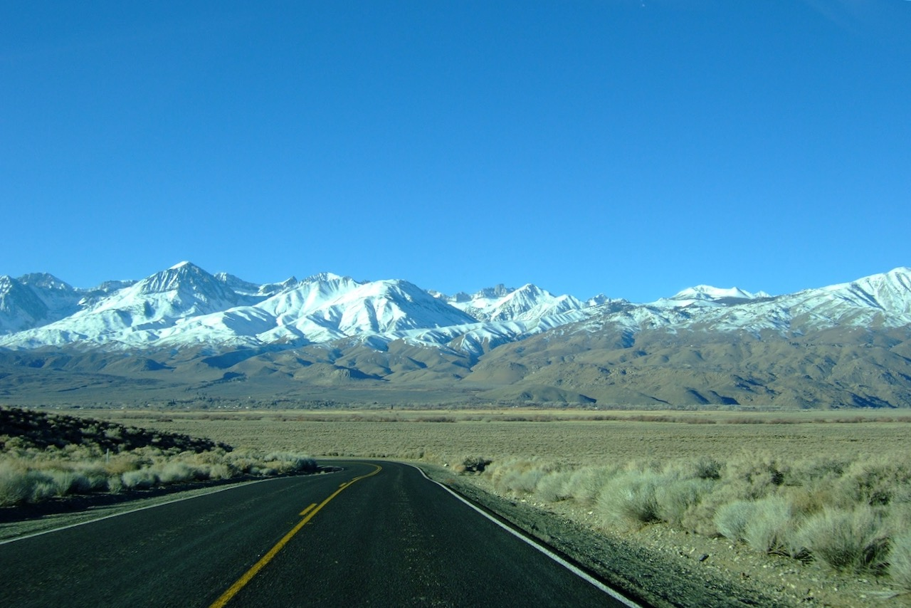

## Host Links:

The documentation is currently available from the links below:

* [Direct](https://www.magclouds.org/ism3d/d811bb3037aca6a6b0e0ea7bbca033e2e396f67c)

* [Gateway](https://www.magclouds.org/ism3d) (pw: workinProgress)

## Highlights:

* [Tutorials: ism3d Python API usages](https://www.magclouds.org/ism3d/d811bb3037aca6a6b0e0ea7bbca033e2e396f67c/tutorials/demo_api_uvhelper.html)

* [casa6 installation](https://www.magclouds.org/ism3d/d811bb3037aca6a6b0e0ea7bbca033e2e396f67c/tutorials/demo_api_uvhelper.html)

* [parameter file format](https://www.magclouds.org/ism3d/d811bb3037aca6a6b0e0ea7bbca033e2e396f67c/notes/inpfile.html)

Big Pine, CA 2010.1.13 6:11 pm &copy; Rui Xue