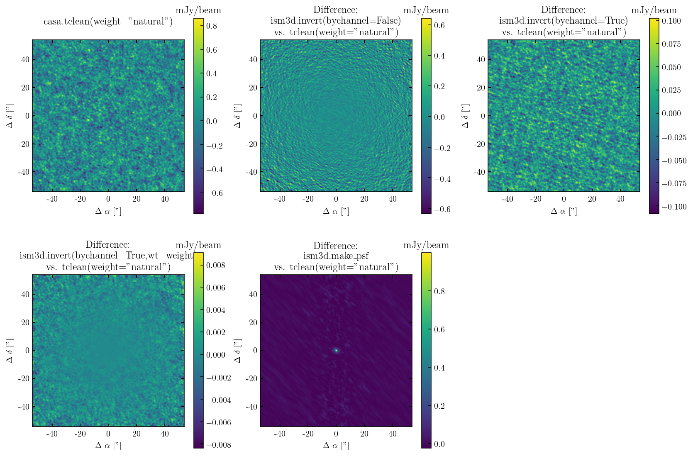

Invert
======

We perform imaging operations on the same visibility dataset using three
different approachs and compare their precisions:

-  ism3d.uvhelper.inver
-  casatasks.tclean
-  galario

.. code:: ipython3

    import numpy as np
    from astropy.io import fits
    
    import matplotlib as mpl
    mpl.use('Agg')
    mpl.rcParams['xtick.direction'] = 'in'
    mpl.rcParams['ytick.direction'] = 'in'
    mpl.rcParams.update({'font.size': 12})
    mpl.rcParams["font.family"] = "serif"
    mpl.rcParams["image.origin"]="lower"
    mpl.rc('text', usetex=True)
    
    %matplotlib inline
    import matplotlib.pyplot as plt
    %matplotlib inline
    from astropy.wcs import WCS
    
    from spectral_cube import SpectralCube
    from spectral_cube.utils import SpectralCubeWarning
    warnings.filterwarnings(action='ignore', category=SpectralCubeWarning,append=True)
    warnings.filterwarnings("ignore", category=FutureWarning)
    warnings.filterwarnings("ignore")
    
    from astropy import units as u 
    from astropy.coordinates import SkyCoord
    import finufftpy
    from casatasks import mstransform
    from ism3d.tests.test_import import *
    
    workdir='/Volumes/S1/projects/alma_g09/'
    
    import numpy as np
    from astropy.io import ascii
    from astropy.io import fits

.. parsed-literal::

    hostname: Ruis-Mac-mini.local

.. code:: ipython3

    ## load UV data
    
    dir_data='../data/g09/alma_cal/'
    dir_out='../output/demo_invert_ft/'
    
    bb4ms=dir_data+'bb4.ms'
    bb4uv=ism3d.read_ms(vis=bb4ms)
    pickbb='bb4' ; bbuse=bb4uv; bbms=bb4ms

.. parsed-literal::

    2020-06-27 05:46:35	INFO	msmetadata_cmpt.cc::open	Performing internal consistency checks on ../data/g09/alma_cal/bb4.ms...

.. code:: ipython3

    from ism3d.uvhelper import invert_ft,make_psf
    from ism3d.meta import create_header
    
    uvw=bbuse['uvw@'+bbms]
    uu=uvw[:,0]
    vv=uvw[:,1]
    vis=bbuse['data@'+bbms]
    wv=(bbuse['chanfreq@'+bbms]).to(u.m,equivalencies=u.spectral()).value
    cell=0.2*u.arcsec
    imsize=540
    
    #phase_center = SkyCoord('09:13:38.894000 -01:07:03.62000', unit=(u.hourangle, u.deg), frame='icrs') 
    
    dxy=(cell).to_value(u.degree)
    chanfreq=bbuse['chanfreq@'+bbms]
    chanwidth=bbuse['chanwidth@'+bbms]
    phasecenter=bbuse['phasecenter@'+bbms]
    
    crval3=chanfreq.to_value(u.Hz)
    if  not np.isscalar(crval3):
        crval3=crval3[0]
    header=create_header(naxis=[imsize,imsize,np.size(chanfreq)],objname='G09_uvspec',
                         #crval=[phase_center.ra.to_value(u.deg),phase_center.dec.to_value(u.deg),crval3],
                         crval=[phasecenter[0].to_value(u.deg),phasecenter[1].to_value(u.deg),crval3],
                         cdelt=[-(cell).to_value(u.degree),+(cell).to_value(u.degree),np.mean(chanwidth.to_value(u.Hz))])
    
    print("working on ver1")
    uvspec_cube_ver1=invert_ft(uu,vv,wv,vis,cell,imsize,bychannel=False)
    print("working on ver2")
    uvspec_cube_ver2=invert_ft(uu,vv,wv,vis,cell,imsize,bychannel=True)
    print("working on ver3")
    uvspec_cube_ver3=invert_ft(uu,vv,wv,vis,cell,imsize,bychannel=True,wt=bbuse['weight@'+bbms])
    
    tcube,thdr=fits.getdata(dir_data+'/bb04_nat_nea_th0.residual.fits',header=True)
    tcube=tcube[0,:,:,:]
    
    ver_names=['bb04_diff_ver1','bb04_diff_ver2','bb04_diff_ver3']
    use_cubes=[uvspec_cube_ver1,uvspec_cube_ver2,uvspec_cube_ver3]
    for i in range(3):
        cube_diff=(use_cubes[i].T)[238::-1,:,:]-tcube
        cube_diff=cube_diff.astype(np.float32)
        fits.writeto(dir_out+'/'+ver_names[i]+'_nufft_vs_tclean.fits',cube_diff,thdr,overwrite=True)
    
    from ism3d.uvhelper.ft import make_psf
    uvspec_psf_ver3=make_psf(uu,vv,wv,cell,imsize,bychannel=True,wt=bbuse['weight@'+bbms])
    fits.writeto(dir_out+'/bb04_psf_ver3_nufft.fits',uvspec_psf_ver3.T,thdr,overwrite=True)

.. parsed-literal::

    working on ver1
    2d1many: ndata=240 (ms,mt)=(540,540) (nf1,nf2)=(1080,1080) nj=1154327 ...
    kernel fser (ns=16):	 0.000394 s
    fftw plan (64)    	 0.00197 s
    [many] sort (did_sort=1):	 0.00805 s
    [many] spread:			 7.64 s
    [many] fft (12 threads):		 1.46 s
    [many] deconvolve & copy out:	 0.331 s
    freed
    working on ver2
    working on ver3

.. code:: ipython3

    from astropy.wcs import WCS
    from astropy.wcs.utils import skycoord_to_pixel, proj_plane_pixel_scales
    
    
    def linear_offset_coords(wcs, center):
        """
        Returns a locally linear offset coordinate system.
        
        Given a 2-d celestial WCS object and a central coordinate, return a WCS
        that describes an 'offset' coordinate system, assuming that the
        coordinates are locally linear (that is, the grid lines of this offset
        coordinate system are always aligned with the pixel coordinates, and
        distortions from spherical projections and distortion terms are not taken
        into account)
        
        Parameters
        ----------
        wcs : `~astropy.wcs.WCS`
            The original WCS, which should be a 2-d celestial WCS
        center : `~astropy.coordinates.SkyCoord`
            The coordinates on which the offset coordinate system should be
            centered.
        """
    
        # Convert center to pixel coordinates
        xp, yp = skycoord_to_pixel(center, wcs)
            
        # Set up new WCS
        new_wcs = WCS(naxis=2)
        new_wcs.wcs.crpix = xp + 1, yp + 1
        new_wcs.wcs.crval = 0., 0.
        new_wcs.wcs.cdelt = proj_plane_pixel_scales(wcs)*3600.
        new_wcs.wcs.ctype = 'XOFFSET', 'YOFFSET'
        new_wcs.wcs.cunit = 'arcsec', 'arcsec'
    
        return new_wcs

.. code:: ipython3

    import matplotlib.pyplot as plt
    from astropy.io import fits
    from mpl_toolkits.axes_grid1 import make_axes_locatable
    %matplotlib inline
    %config InlineBackend.figure_format='retina'
    
    filenames = [dir_data+'bb04_nat_nea_th0.residual',  
                 dir_out+'bb04_diff_ver1_nufft_vs_tclean', 
                 dir_out+'bb04_diff_ver2_nufft_vs_tclean',
                 dir_out+'bb04_diff_ver3_nufft_vs_tclean',
                 dir_out+'bb04_psf_ver3_nufft']
    titles=['\ncasa.tclean(weight="natural")\n',
            'Difference: \n ism3d.invert(bychannel=False)\n vs. tclean(weight="natural")',
            'Difference: \n ism3d.invert(bychannel=True)\n vs. tclean(weight="natural")',
            'Difference: \n ism3d.invert(bychannel=True,wt=weight)\n vs. tclean(weight="natural")',
            'Difference: \n ism3d.make\_psf\n vs. tclean(weight="natural")']
    plt.clf()
    
    hdr=fits.getheader(filenames[0]+'.fits')
    w = WCS(hdr).celestial
    coord = SkyCoord(hdr['CRVAL1'], hdr['CRVAL2'], unit="deg")
    
    offset_w=linear_offset_coords(w,coord)
    
    fig, axs = plt.subplots(2,3, figsize=(12,8),subplot_kw={'projection':offset_w})
    fig.subplots_adjust(left=0.05, bottom=0.05, right=0.95, top=0.95, wspace=0.2,hspace=0.2)
    
    for ii, name in enumerate(filenames):
    
        xx,yy = int(ii/3),ii%3
        data=fits.getdata(name+'.fits',header=False)
        data=np.squeeze(data)[0,:,:]*1e3
        if 'psf' in name:
            data/=1e3
    
        im = axs[xx,yy].imshow(data,origin='lower')
        
        #divider = make_axes_locatable(axs[xx,yy])
        #cax = divider.append_axes("right", size="7%", pad=0.05)
        clb=fig.colorbar(im, ax=axs[xx,yy])
        clb.ax.set_title('mJy/beam')
        axs[xx,yy].set_title(titles[ii])
        axs[xx,yy].set_xlabel(r'$\Delta~\alpha$ ["]')
        axs[xx,yy].set_ylabel(r'$\Delta~\delta$ ["]')
        #aa[xx,yy].set_title(os.path.basename(name).replace('_','.'))
        #aa[xx,yy].set_aspect('auto')
    
    fig.delaxes(axs[1][2])
    
    #fig.tight_layout()
    plt.show()
    fig.savefig(dir_out+'demo_invert_ft.pdf')

.. parsed-literal::

    <Figure size 432x288 with 0 Axes>

