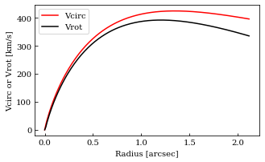

|Open In Colab|

Example BX610: perform model fitting using method=‘amoeba’ for the Band 4 Cycle 2 DataSet
-----------------------------------------------------------------------------------------

.. |Open In Colab| image:: https://colab.research.google.com/assets/colab-badge.svg
   :target: https://colab.research.google.com/github/r-xue/casa_proc/blob/master/demo/test_casaproc.ipynb

.. code:: ipython3

    import sys
    import glob
    import os
    import io
    import logging
    from pprint import pprint
    
    print(sys.version)
    
    import socket 
    if  'hypersion' or 'mini' in socket.gethostname() :
        os.chdir('/Users/Rui/Documents/Workspace/projects/GMaKE/examples/output/')
    print(socket.gethostname())
    print(os.getcwd())
    
    import gmake
    print(gmake.__version__)
    print(gmake.__email__)
    print(gmake.__demo__)
    
    inpfile=gmake.__demo__+'/../examples/inpfile/bx610_b4c2_uv_ab.inp'
    logfile=''
    
    #gmake.logger_config()
    #gmake.logger_status()
    #import pprint
    #pprint.pprint(logging.Logger.manager.loggerDict) 
    gmake.logger_config()
    inp_dct=gmake.read_inp(inpfile)
    inp_dct=gmake.inp_validate(inp_dct)
    
    outdir=inp_dct['general']['outdir']
    gmake.logger_config(logfile=outdir+'/gmake.log',loglevel='DEBUG',logfilelevel='DEBUG')
    gmake.logger_status()
    
    %reload_ext line_profiler
    %reload_ext memory_profiler

.. parsed-literal::

    3.7.5 (default, Oct 19 2019, 11:15:26) 
    [Clang 11.0.0 (clang-1100.0.33.8)]
    hyperion
    /Users/Rui/Documents/Workspace/projects/GMaKE/examples/output
    0.2.dev1
    rx.astro@gmail.com
    /Users/Rui/Documents/Workspace/projects/GMaKE/gmake
    <Logger gmake (DEBUG)>
    [<FileHandler /Users/Rui/Documents/Workspace/projects/GMaKE/examples/output/bx610_b4c2_uv_ab/gmake.log (DEBUG)>, <StreamHandler stderr (DEBUG)>]

.. code:: ipython3

    #%time dat_dct=gmake.read_data(inp_dct,fill_mask=True,fill_error=True)
    #%prun dat_dct=gmake.read_data(inp_dct,fill_mask=True,fill_error=True)
    #%lprun -f gmake.read_data dat_dct=gmake.read_data(inp_dct,fill_mask=True,fill_error=True)
    #del dat_dct
    #%memit dat_dct=gmake.read_data(inp_dct)
    #%mprun -f gmake.read_data dat_dct=gmake.read_data(inp_dct)
    dat_dct=gmake.read_data(inp_dct)

.. parsed-literal::

    read data (may take some time..)
    
    Read: ../data/bx610/alma/2013.1.00059.S/bb3.ms.pt2
    
    data@../data/bx610/alma/2013.1.00059.S/bb3.ms.pt2            complex64       (70778, 128)          69 MiB             
    uvw@../data/bx610/alma/2013.1.00059.S/bb3.ms.pt2             float32         (70778, 3)           830 KiB             
    weight@../data/bx610/alma/2013.1.00059.S/bb3.ms.pt2          float32         (70778,)             277 KiB             
      >>percentiles (0,16,50,84,100)%: [ 14.7851572   93.24289703 106.88607025 126.21764709 170.49371338]
    chanfreq@../data/bx610/alma/2013.1.00059.S/bb3.ms.pt2        (128,)     143300351307.3234 Hz 143796392089.3743 Hz
    chanwidth@../data/bx610/alma/2013.1.00059.S/bb3.ms.pt2       (128,)     -3905832.9295 Hz -3905832.9295 Hz
    phasecenter@../data/bx610/alma/2013.1.00059.S/bb3.ms.pt2     23h46m09.43s  12d49m19.21s
    
    Read: ../data/bx610/alma/2013.1.00059.S/bb1.ms.pt2
    
    data@../data/bx610/alma/2013.1.00059.S/bb1.ms.pt2            complex64       (69446, 179)          95 MiB             
    uvw@../data/bx610/alma/2013.1.00059.S/bb1.ms.pt2             float32         (69446, 3)           814 KiB             
    weight@../data/bx610/alma/2013.1.00059.S/bb1.ms.pt2          float32         (69446,)             271 KiB             
      >>percentiles (0,16,50,84,100)%: [ 13.42515182  78.06726685  89.57231522 108.5837677  142.61140442]
    chanfreq@../data/bx610/alma/2013.1.00059.S/bb1.ms.pt2        (179,)     153001471657.7332 Hz 153696709919.1904 Hz
    chanwidth@../data/bx610/alma/2013.1.00059.S/bb1.ms.pt2       (179,)     3905832.9295 Hz 3905832.9295 Hz
    phasecenter@../data/bx610/alma/2013.1.00059.S/bb1.ms.pt2     23h46m09.43s  12d49m19.21s
    
    Read: ../data/bx610/alma/2013.1.00059.S/bb1.ms.pt1
    
    data@../data/bx610/alma/2013.1.00059.S/bb1.ms.pt1            complex64       (69446, 1)           543 KiB             
    uvw@../data/bx610/alma/2013.1.00059.S/bb1.ms.pt1             float32         (69446, 3)           814 KiB             
    weight@../data/bx610/alma/2013.1.00059.S/bb1.ms.pt1          float32         (69446,)             271 KiB             
      >>percentiles (0,16,50,84,100)%: [ 2201.72753906 12802.96191406 14689.87988281 17807.66992188
     23388.29296875]
    chanfreq@../data/bx610/alma/2013.1.00059.S/bb1.ms.pt1        (1,)       152679240441.0466 Hz 152679240441.0466 Hz
    chanwidth@../data/bx610/alma/2013.1.00059.S/bb1.ms.pt1       (1,)       640556600.4437 Hz 640556600.4437 Hz
    phasecenter@../data/bx610/alma/2013.1.00059.S/bb1.ms.pt1     23h46m09.43s  12d49m19.21s
    
    Read: ../data/bx610/alma/2013.1.00059.S/bb1.ms.pt3
    
    data@../data/bx610/alma/2013.1.00059.S/bb1.ms.pt3            complex64       (69446, 1)           543 KiB             
    uvw@../data/bx610/alma/2013.1.00059.S/bb1.ms.pt3             float32         (69446, 3)           814 KiB             
    weight@../data/bx610/alma/2013.1.00059.S/bb1.ms.pt3          float32         (69446,)             271 KiB             
      >>percentiles (0,16,50,84,100)%: [ 1812.39770508 10539.02578125 12092.27734375 14658.75351562
     19252.56640625]
    chanfreq@../data/bx610/alma/2013.1.00059.S/bb1.ms.pt3        (1,)       153962306558.3988 Hz 153962306558.3988 Hz
    chanwidth@../data/bx610/alma/2013.1.00059.S/bb1.ms.pt3       (1,)       527287445.4872 Hz 527287445.4872 Hz
    phasecenter@../data/bx610/alma/2013.1.00059.S/bb1.ms.pt3     23h46m09.43s  12d49m19.21s
    
    Read: ../data/bx610/alma/2013.1.00059.S/bb2.ms.mfs
    
    data@../data/bx610/alma/2013.1.00059.S/bb2.ms.mfs            complex64       (74469, 1)           582 KiB             
    uvw@../data/bx610/alma/2013.1.00059.S/bb2.ms.mfs             float32         (74469, 3)           873 KiB             
    weight@../data/bx610/alma/2013.1.00059.S/bb2.ms.mfs          float32         (74469,)             291 KiB             
      >>percentiles (0,16,50,84,100)%: [ 5305.07617188 31035.58476563 36684.11328125 44963.8225
     62921.171875  ]
    chanfreq@../data/bx610/alma/2013.1.00059.S/bb2.ms.mfs        (1,)       155167256017.1630 Hz 155167256017.1630 Hz
    chanwidth@../data/bx610/alma/2013.1.00059.S/bb2.ms.mfs       (1,)       1866988140.3177 Hz 1866988140.3177 Hz
    phasecenter@../data/bx610/alma/2013.1.00059.S/bb2.ms.mfs     23h46m09.43s  12d49m19.21s
    
    Read: ../data/bx610/alma/2013.1.00059.S/bb3.ms.pt1
    
    data@../data/bx610/alma/2013.1.00059.S/bb3.ms.pt1            complex64       (70778, 1)           553 KiB             
    uvw@../data/bx610/alma/2013.1.00059.S/bb3.ms.pt1             float32         (70778, 3)           830 KiB             
    weight@../data/bx610/alma/2013.1.00059.S/bb3.ms.pt1          float32         (70778,)             277 KiB             
      >>percentiles (0,16,50,84,100)%: [ 3711.07421875 23403.8059375  26828.41796875 31680.60578125
     42794.0078125 ]
    chanfreq@../data/bx610/alma/2013.1.00059.S/bb3.ms.pt1        (1,)       142808216358.2020 Hz 142808216358.2020 Hz
    chanwidth@../data/bx610/alma/2013.1.00059.S/bb3.ms.pt1       (1,)       -980364065.3133 Hz -980364065.3133 Hz
    phasecenter@../data/bx610/alma/2013.1.00059.S/bb3.ms.pt1     23h46m09.43s  12d49m19.21s
    
    Read: ../data/bx610/alma/2013.1.00059.S/bb3.ms.pt3
    
    data@../data/bx610/alma/2013.1.00059.S/bb3.ms.pt3            complex64       (70778, 1)           553 KiB             
    uvw@../data/bx610/alma/2013.1.00059.S/bb3.ms.pt3             float32         (70778, 3)           830 KiB             
    weight@../data/bx610/alma/2013.1.00059.S/bb3.ms.pt3          float32         (70778,)             277 KiB             
      >>percentiles (0,16,50,84,100)%: [ 1463.73095703  9230.9815625  10581.72558594 12495.54765625
     16878.88671875]
    chanfreq@../data/bx610/alma/2013.1.00059.S/bb3.ms.pt3        (1,)       143991683735.8510 Hz 143991683735.8510 Hz
    chanwidth@../data/bx610/alma/2013.1.00059.S/bb3.ms.pt3       (1,)       -386677460.0240 Hz -386677460.0240 Hz
    phasecenter@../data/bx610/alma/2013.1.00059.S/bb3.ms.pt3     23h46m09.43s  12d49m19.21s
    
    Read: ../data/bx610/alma/2013.1.00059.S/bb4.ms.mfs
    
    data@../data/bx610/alma/2013.1.00059.S/bb4.ms.mfs            complex64       (70778, 1)           553 KiB             
    uvw@../data/bx610/alma/2013.1.00059.S/bb4.ms.mfs             float32         (70778, 3)           830 KiB             
    weight@../data/bx610/alma/2013.1.00059.S/bb4.ms.mfs          float32         (70778,)             277 KiB             
      >>percentiles (0,16,50,84,100)%: [ 6399.703125   39997.3965625  46777.44726562 55403.3934375
     76517.5390625 ]
    chanfreq@../data/bx610/alma/2013.1.00059.S/bb4.ms.mfs        (1,)       141418724105.1758 Hz 141418724105.1758 Hz
    chanwidth@../data/bx610/alma/2013.1.00059.S/bb4.ms.mfs       (1,)       -1866988140.3323 Hz -1866988140.3323 Hz
    phasecenter@../data/bx610/alma/2013.1.00059.S/bb4.ms.mfs     23h46m09.43s  12d49m19.21s
    --------------------------------------------------------------------------------
    --- dat_dct size 175.86 Mibyte ---
    --- took 3.94303  seconds ---

.. code:: ipython3

    #
    #mod_dct=gmake.inp2mod(inp_dct)
    #gmake.pprint(mod_dct)
    #gmake.model_vrot(mod_dct)
    #gmake.pprint(mod_dct)
    #gmake.model_vrot_plot(mod_dct['co76'])
    
    inp_dct=gmake.read_inp(inpfile)
    inp_dct=gmake.inp_validate(inp_dct)
    mod_dct=gmake.inp2mod(inp_dct)
    gmake.model_vrot(mod_dct)
    #mod_dct['co76']
    %mprun -f gmake.model_eval.model_lnprob fit_dct=gmake.fit_setup(inp_dct,dat_dct)
    #fit_dct=gmake.fit_setup(inp_dct,dat_dct,initial_model=True,save_model=False)
    #%mprun -f gmake.fit_iterate gmake.fit_iterate(fit_dct,inp_dct,dat_dct)

.. parsed-literal::

    ++++++++++++++++++++++++++++++++++++++++++++++++++++++++++++++++++++++++++++++++++++++++++++++++++++
    optimizer: amoeba
    optimizing parameters:
    ----------------------------------------------------------------------------------------------------
    index    name    unit    start    lo_limit    up_limit    scale
     0   vsys@basics       km / s               100.00      (     0.00     ,     220.00     )    120.00     
     1   disk_sd@diskdyn   solMass / pc2        3000.00     (    100.00    ,    50000.00    )   47000.00    
     2   disk_rs@diskdyn   kpc                   2.00       (     0.20     ,      10.00     )     8.00      
     3   vdis@basics       km / s                20.00      (     0.00     ,     200.00     )    180.00     
     4   pa@basics         deg                  -52.40      (    -132.40   ,      27.60     )     80.00     
     5   inc@basics        deg                   44.06      (     5.00     ,      85.00     )     40.94     
     6   xypos.ra@basics   deg                356.5393258   (  356.5390481 ,   356.5396036  )   0.0002778   
     7   xypos.dec@basics  deg                12.8220182    (  12.8217404  ,   12.8222960   )   0.0002778   
     8   lineflux@co43     Jy km / s             1.20       (     0.10     ,     200.00     )    198.80     
     9   sbser[0]@co43     arcsec                0.22       (     0.01     ,      2.00      )     1.78      
     10  lineflux@ci10     Jy km / s             0.40       (     0.10     ,     200.00     )    199.60     
     11  sbser[0]@ci10     arcsec                0.19       (     0.01     ,      2.00      )     1.81      
     12  contflux@cont     Jy                    0.00       (     0.00     ,      0.01      )     0.01      
     13  sbser[0]@cont     arcsec                0.12       (     0.01     ,      2.00      )     1.88      
     14  alpha@cont                              3.72       (     3.00     ,      4.50      )     0.78      
    ++++++++++++++++++++++++++++++++++++++++++++++++++++++++++++++++++++++++++++++++++++++++++++++++++++
    ndim:    15
    outdir:  bx610_b4c2_uv_ab

.. parsed-literal::

    --> 64 0.10307632316147813 ../data/bx610/alma/2013.1.00059.S/bb3.ms.pt2
    --> 64 0.09648870359054133 ../data/bx610/alma/2013.1.00059.S/bb1.ms.pt2
    --> 64 0.096911872319068 ../data/bx610/alma/2013.1.00059.S/bb1.ms.pt1
    --> 64 0.0961042399880706 ../data/bx610/alma/2013.1.00059.S/bb1.ms.pt3
    --> 64 0.09677697831042092 ../data/bx610/alma/2013.1.00059.S/bb2.ms.mfs
    --> 64 0.10361045745715311 ../data/bx610/alma/2013.1.00059.S/bb3.ms.pt1
    --> 64 0.10275888527960735 ../data/bx610/alma/2013.1.00059.S/bb3.ms.pt3
    --> 64 0.10462845930605057 ../data/bx610/alma/2013.1.00059.S/bb4.ms.mfs

.. parsed-literal::

    data@../data/bx610/alma/2013.1.00059.S/bb3.ms.pt2 20765252.674618606 9059584
    data@../data/bx610/alma/2013.1.00059.S/bb1.ms.pt2 28616358.903096303 12430834
    data@../data/bx610/alma/2013.1.00059.S/bb1.ms.pt1 179001.27091614687 69446
    data@../data/bx610/alma/2013.1.00059.S/bb1.ms.pt3 183910.19381335194 69446
    data@../data/bx610/alma/2013.1.00059.S/bb2.ms.mfs 196004.50760099737 74469
    data@../data/bx610/alma/2013.1.00059.S/bb3.ms.pt1 179818.21838618867 70778
    data@../data/bx610/alma/2013.1.00059.S/bb3.ms.pt3 196179.71418257902 70778
    data@../data/bx610/alma/2013.1.00059.S/bb4.ms.mfs 184905.96711657924 70778
    one trial                                          : 1.78250  seconds
    ndata->21916113.0
    chisq->50501431.449730754
    --- save to: bx610_b4c2_uv_ab/fit.h5

.. parsed-literal::

    

.. parsed-literal::

    Filename: /Users/Rui/Documents/Workspace/projects/GMaKE/gmake/model_eval.py
    
    Line #    Mem usage    Increment   Line Contents
    ================================================
       258    784.1 MiB    784.1 MiB   def model_lnprob(theta,fit_dct,inp_dct,dat_dct,
       259                                              savemodel=None,decomp=False,nsamps=1e5,
       260                                              packblobs=False,
       261                                              verbose=False):
       262                                 """
       263                                 this is the evaluating function for emcee
       264                                 packblobs=True:
       265                                     lnl,blobs
       266                                 packblobs=False:
       267                                     lnl,lnp,chisq,ndata,npar
       268                                 """
       269                             
       270    784.1 MiB      0.0 MiB       if  verbose==True:
       271                                     start_time = time.time()
       272                                     
       273    784.1 MiB      0.0 MiB       lp = model_lnprior(theta,fit_dct)
       274                                 
       275    784.1 MiB      0.0 MiB       if  not np.isfinite(lp):
       276                                     blobs={'lnprob':-np.inf,'chisq':+np.inf,'ndata':0.0,'npar':len(theta)}
       277                                     if  packblobs==True:
       278                                         return -np.inf,blobs
       279                                     else:
       280                                         return -np.inf,-np.inf,+np.inf,0.0,len(theta)
       281                             
       282                                  
       283                                          
       284    784.1 MiB      0.0 MiB       lnl,blobs=model_lnlike(theta,fit_dct,inp_dct,dat_dct,
       285    784.1 MiB      0.0 MiB                              savemodel=savemodel,decomp=decomp,nsamps=nsamps,
       286    800.1 MiB     16.0 MiB                              verbose=verbose)
       287                                 
       288    800.1 MiB      0.0 MiB       if  verbose==True:
       289                                     print("try ->",theta)
       290                                     print("---{0:^10} : {1:<8.5f} seconds ---".format('lnprob',time.time()-start_time))    
       291                                 
       292                                 # np.array: to creat a zero-d object array 
       293    800.1 MiB      0.0 MiB       if  packblobs==True:
       294                                     return lp+lnl,blobs
       295                                 else:
       296    800.1 MiB      0.0 MiB           return lp+lnl,blobs['lnprob'],blobs['chisq'],blobs['ndata'],blobs['npar']

.. code:: ipython3

    #from hickle import SerializedWarning
    %matplotlib inline
    #%matplotlib notebook
    gmake.fit_analyze(inpfile,export=True)
    #print(fit_dct['p_scale'])

.. parsed-literal::

    --- save to: bx610_b4c2_uv_ab/fit.h5
    Check optimized parameters:
     0   vsys@basics       =    104.26      <-    100.00      (     0.00     ,     220.00     )
     1   disk_sd@diskdyn   =    3248.07     <-    3000.00     (    100.00    ,    50000.00    )
     2   disk_rs@diskdyn   =     5.30       <-     2.00       (     0.20     ,      10.00     )
     3   vdis@basics       =     80.82      <-     20.00      (     0.00     ,     200.00     )
     4   pa@basics         =    -48.71      <-    -52.40      (    -132.40   ,      27.60     )
     5   inc@basics        =     36.06      <-     44.06      (     5.00     ,      85.00     )
     6   xypos.ra@basics   =  356.5393206   <-  356.5393258   (  356.5390481 ,   356.5396036  )
     7   xypos.dec@basics  =  12.8220161    <-  12.8220182    (  12.8217404  ,   12.8222960   )
     8   lineflux@co43     =     1.37       <-     1.20       (     0.10     ,     200.00     )
     9   sbser[0]@co43     =     0.20       <-     0.22       (     0.01     ,      2.00      )
     10  lineflux@ci10     =     0.36       <-     0.40       (     0.10     ,     200.00     )
     11  sbser[0]@ci10     =     0.16       <-     0.19       (     0.01     ,      2.00      )
     12  contflux@cont     =     0.00       <-     0.00       (     0.00     ,      0.01      )
     13  sbser[0]@cont     =     0.15       <-     0.12       (     0.01     ,      2.00      )
     14  alpha@cont        =     4.21       <-     3.72       (     3.00     ,      4.50      )
    analyzing outfolder:bx610_b4c2_uv_ab
    plotting...bx610_b4c2_uv_ab/iteration.pdf
    data@../data/bx610/alma/2013.1.00059.S/bb3.ms.pt2 20765263.57319384 9059584
    data@../data/bx610/alma/2013.1.00059.S/bb1.ms.pt2 28616359.43365973 12430834
    data@../data/bx610/alma/2013.1.00059.S/bb1.ms.pt1 179001.91774253696 69446
    data@../data/bx610/alma/2013.1.00059.S/bb1.ms.pt3 183910.2391211092 69446
    data@../data/bx610/alma/2013.1.00059.S/bb2.ms.mfs 196005.71670883684 74469
    data@../data/bx610/alma/2013.1.00059.S/bb3.ms.pt1 179818.9623388967 70778
    data@../data/bx610/alma/2013.1.00059.S/bb3.ms.pt3 196179.90291483383 70778
    data@../data/bx610/alma/2013.1.00059.S/bb4.ms.mfs 184907.37493719187 70778
    export the model set:              bx610_b4c2_uv_ab/model_0              (may take some time..)
     
    -->data_b4c2_bb3.ms.pt2
     
    imod2d@../data/bx610/alma/2013.1.00059.S/bb3.ms.pt2
    write reference model image: 
        imod2d@../data/bx610/alma/2013.1.00059.S/bb3.ms.pt2 to bx610_b4c2_uv_ab/model_0/imod2d_b4c2_bb3.ms.pt2.fits
    imod3d@../data/bx610/alma/2013.1.00059.S/bb3.ms.pt2
    write reference model image: 
        imod3d@../data/bx610/alma/2013.1.00059.S/bb3.ms.pt2 to bx610_b4c2_uv_ab/model_0/imod3d_b4c2_bb3.ms.pt2.fits
    pbeam@../data/bx610/alma/2013.1.00059.S/bb3.ms.pt2
    write reference model image: 
        pbeam@../data/bx610/alma/2013.1.00059.S/bb3.ms.pt2 to bx610_b4c2_uv_ab/model_0/pbeam_b4c2_bb3.ms.pt2.fits
    write reference model profile: 
        imod3d_prof@co43@../data/bx610/alma/2013.1.00059.S/bb3.ms.pt2 to bx610_b4c2_uv_ab/model_0/imodrp_co43_b4c2_bb3.ms.pt2.fits
    copy ms container: 
        ../data/bx610/alma/2013.1.00059.S/bb3.ms.pt2  to  bx610_b4c2_uv_ab/model_0/model_b4c2_bb3.ms.pt2
    write ms column: 
        uvmodel@../data/bx610/alma/2013.1.00059.S/bb3.ms.pt2 to data@bx610_b4c2_uv_ab/model_0/model_b4c2_bb3.ms.pt2
    create symlink:
        /Users/Rui/Documents/Workspace/projects/GMaKE/examples/data/bx610/alma/2013.1.00059.S/bb3.ms.pt2  to  bx610_b4c2_uv_ab/model_0/data_b4c2_bb3.ms.pt2
     
    -->data_b4c2_bb1.ms.pt2
     
    imod2d@../data/bx610/alma/2013.1.00059.S/bb1.ms.pt2
    write reference model image: 
        imod2d@../data/bx610/alma/2013.1.00059.S/bb1.ms.pt2 to bx610_b4c2_uv_ab/model_0/imod2d_b4c2_bb1.ms.pt2.fits
    imod3d@../data/bx610/alma/2013.1.00059.S/bb1.ms.pt2
    write reference model image: 
        imod3d@../data/bx610/alma/2013.1.00059.S/bb1.ms.pt2 to bx610_b4c2_uv_ab/model_0/imod3d_b4c2_bb1.ms.pt2.fits
    pbeam@../data/bx610/alma/2013.1.00059.S/bb1.ms.pt2
    write reference model image: 
        pbeam@../data/bx610/alma/2013.1.00059.S/bb1.ms.pt2 to bx610_b4c2_uv_ab/model_0/pbeam_b4c2_bb1.ms.pt2.fits
    write reference model profile: 
        imod3d_prof@ci10@../data/bx610/alma/2013.1.00059.S/bb1.ms.pt2 to bx610_b4c2_uv_ab/model_0/imodrp_ci10_b4c2_bb1.ms.pt2.fits
    copy ms container: 
        ../data/bx610/alma/2013.1.00059.S/bb1.ms.pt2  to  bx610_b4c2_uv_ab/model_0/model_b4c2_bb1.ms.pt2
    write ms column: 
        uvmodel@../data/bx610/alma/2013.1.00059.S/bb1.ms.pt2 to data@bx610_b4c2_uv_ab/model_0/model_b4c2_bb1.ms.pt2
    create symlink:
        /Users/Rui/Documents/Workspace/projects/GMaKE/examples/data/bx610/alma/2013.1.00059.S/bb1.ms.pt2  to  bx610_b4c2_uv_ab/model_0/data_b4c2_bb1.ms.pt2
     
    -->data_b4c2_bb1.ms.pt1
     
    imod2d@../data/bx610/alma/2013.1.00059.S/bb1.ms.pt1
    write reference model image: 
        imod2d@../data/bx610/alma/2013.1.00059.S/bb1.ms.pt1 to bx610_b4c2_uv_ab/model_0/imod2d_b4c2_bb1.ms.pt1.fits
    imod3d@../data/bx610/alma/2013.1.00059.S/bb1.ms.pt1
    write reference model image: 
        imod3d@../data/bx610/alma/2013.1.00059.S/bb1.ms.pt1 to bx610_b4c2_uv_ab/model_0/imod3d_b4c2_bb1.ms.pt1.fits
    pbeam@../data/bx610/alma/2013.1.00059.S/bb1.ms.pt1
    write reference model image: 
        pbeam@../data/bx610/alma/2013.1.00059.S/bb1.ms.pt1 to bx610_b4c2_uv_ab/model_0/pbeam_b4c2_bb1.ms.pt1.fits
    copy ms container: 
        ../data/bx610/alma/2013.1.00059.S/bb1.ms.pt1  to  bx610_b4c2_uv_ab/model_0/model_b4c2_bb1.ms.pt1
    write ms column: 
        uvmodel@../data/bx610/alma/2013.1.00059.S/bb1.ms.pt1 to data@bx610_b4c2_uv_ab/model_0/model_b4c2_bb1.ms.pt1
    create symlink:
        /Users/Rui/Documents/Workspace/projects/GMaKE/examples/data/bx610/alma/2013.1.00059.S/bb1.ms.pt1  to  bx610_b4c2_uv_ab/model_0/data_b4c2_bb1.ms.pt1
     
    -->data_b4c2_bb1.ms.pt3
     
    imod2d@../data/bx610/alma/2013.1.00059.S/bb1.ms.pt3
    write reference model image: 
        imod2d@../data/bx610/alma/2013.1.00059.S/bb1.ms.pt3 to bx610_b4c2_uv_ab/model_0/imod2d_b4c2_bb1.ms.pt3.fits
    imod3d@../data/bx610/alma/2013.1.00059.S/bb1.ms.pt3
    write reference model image: 
        imod3d@../data/bx610/alma/2013.1.00059.S/bb1.ms.pt3 to bx610_b4c2_uv_ab/model_0/imod3d_b4c2_bb1.ms.pt3.fits
    pbeam@../data/bx610/alma/2013.1.00059.S/bb1.ms.pt3
    write reference model image: 
        pbeam@../data/bx610/alma/2013.1.00059.S/bb1.ms.pt3 to bx610_b4c2_uv_ab/model_0/pbeam_b4c2_bb1.ms.pt3.fits
    copy ms container: 
        ../data/bx610/alma/2013.1.00059.S/bb1.ms.pt3  to  bx610_b4c2_uv_ab/model_0/model_b4c2_bb1.ms.pt3
    write ms column: 
        uvmodel@../data/bx610/alma/2013.1.00059.S/bb1.ms.pt3 to data@bx610_b4c2_uv_ab/model_0/model_b4c2_bb1.ms.pt3
    create symlink:
        /Users/Rui/Documents/Workspace/projects/GMaKE/examples/data/bx610/alma/2013.1.00059.S/bb1.ms.pt3  to  bx610_b4c2_uv_ab/model_0/data_b4c2_bb1.ms.pt3
     
    -->data_b4c2_bb2.ms.mfs
     
    imod2d@../data/bx610/alma/2013.1.00059.S/bb2.ms.mfs
    write reference model image: 
        imod2d@../data/bx610/alma/2013.1.00059.S/bb2.ms.mfs to bx610_b4c2_uv_ab/model_0/imod2d_b4c2_bb2.ms.mfs.fits
    imod3d@../data/bx610/alma/2013.1.00059.S/bb2.ms.mfs
    write reference model image: 
        imod3d@../data/bx610/alma/2013.1.00059.S/bb2.ms.mfs to bx610_b4c2_uv_ab/model_0/imod3d_b4c2_bb2.ms.mfs.fits
    pbeam@../data/bx610/alma/2013.1.00059.S/bb2.ms.mfs
    write reference model image: 
        pbeam@../data/bx610/alma/2013.1.00059.S/bb2.ms.mfs to bx610_b4c2_uv_ab/model_0/pbeam_b4c2_bb2.ms.mfs.fits
    copy ms container: 
        ../data/bx610/alma/2013.1.00059.S/bb2.ms.mfs  to  bx610_b4c2_uv_ab/model_0/model_b4c2_bb2.ms.mfs
    write ms column: 
        uvmodel@../data/bx610/alma/2013.1.00059.S/bb2.ms.mfs to data@bx610_b4c2_uv_ab/model_0/model_b4c2_bb2.ms.mfs
    create symlink:
        /Users/Rui/Documents/Workspace/projects/GMaKE/examples/data/bx610/alma/2013.1.00059.S/bb2.ms.mfs  to  bx610_b4c2_uv_ab/model_0/data_b4c2_bb2.ms.mfs
     
    -->data_b4c2_bb3.ms.pt1
     
    imod2d@../data/bx610/alma/2013.1.00059.S/bb3.ms.pt1
    write reference model image: 
        imod2d@../data/bx610/alma/2013.1.00059.S/bb3.ms.pt1 to bx610_b4c2_uv_ab/model_0/imod2d_b4c2_bb3.ms.pt1.fits
    imod3d@../data/bx610/alma/2013.1.00059.S/bb3.ms.pt1
    write reference model image: 
        imod3d@../data/bx610/alma/2013.1.00059.S/bb3.ms.pt1 to bx610_b4c2_uv_ab/model_0/imod3d_b4c2_bb3.ms.pt1.fits
    pbeam@../data/bx610/alma/2013.1.00059.S/bb3.ms.pt1
    write reference model image: 
        pbeam@../data/bx610/alma/2013.1.00059.S/bb3.ms.pt1 to bx610_b4c2_uv_ab/model_0/pbeam_b4c2_bb3.ms.pt1.fits
    copy ms container: 
        ../data/bx610/alma/2013.1.00059.S/bb3.ms.pt1  to  bx610_b4c2_uv_ab/model_0/model_b4c2_bb3.ms.pt1
    write ms column: 
        uvmodel@../data/bx610/alma/2013.1.00059.S/bb3.ms.pt1 to data@bx610_b4c2_uv_ab/model_0/model_b4c2_bb3.ms.pt1
    create symlink:
        /Users/Rui/Documents/Workspace/projects/GMaKE/examples/data/bx610/alma/2013.1.00059.S/bb3.ms.pt1  to  bx610_b4c2_uv_ab/model_0/data_b4c2_bb3.ms.pt1
     
    -->data_b4c2_bb3.ms.pt3
     
    imod2d@../data/bx610/alma/2013.1.00059.S/bb3.ms.pt3
    write reference model image: 
        imod2d@../data/bx610/alma/2013.1.00059.S/bb3.ms.pt3 to bx610_b4c2_uv_ab/model_0/imod2d_b4c2_bb3.ms.pt3.fits
    imod3d@../data/bx610/alma/2013.1.00059.S/bb3.ms.pt3
    write reference model image: 
        imod3d@../data/bx610/alma/2013.1.00059.S/bb3.ms.pt3 to bx610_b4c2_uv_ab/model_0/imod3d_b4c2_bb3.ms.pt3.fits
    pbeam@../data/bx610/alma/2013.1.00059.S/bb3.ms.pt3
    write reference model image: 
        pbeam@../data/bx610/alma/2013.1.00059.S/bb3.ms.pt3 to bx610_b4c2_uv_ab/model_0/pbeam_b4c2_bb3.ms.pt3.fits
    copy ms container: 
        ../data/bx610/alma/2013.1.00059.S/bb3.ms.pt3  to  bx610_b4c2_uv_ab/model_0/model_b4c2_bb3.ms.pt3
    write ms column: 
        uvmodel@../data/bx610/alma/2013.1.00059.S/bb3.ms.pt3 to data@bx610_b4c2_uv_ab/model_0/model_b4c2_bb3.ms.pt3
    create symlink:
        /Users/Rui/Documents/Workspace/projects/GMaKE/examples/data/bx610/alma/2013.1.00059.S/bb3.ms.pt3  to  bx610_b4c2_uv_ab/model_0/data_b4c2_bb3.ms.pt3
     
    -->data_b4c2_bb4.ms.mfs
     
    imod2d@../data/bx610/alma/2013.1.00059.S/bb4.ms.mfs
    write reference model image: 
        imod2d@../data/bx610/alma/2013.1.00059.S/bb4.ms.mfs to bx610_b4c2_uv_ab/model_0/imod2d_b4c2_bb4.ms.mfs.fits
    imod3d@../data/bx610/alma/2013.1.00059.S/bb4.ms.mfs
    write reference model image: 
        imod3d@../data/bx610/alma/2013.1.00059.S/bb4.ms.mfs to bx610_b4c2_uv_ab/model_0/imod3d_b4c2_bb4.ms.mfs.fits
    pbeam@../data/bx610/alma/2013.1.00059.S/bb4.ms.mfs
    write reference model image: 
        pbeam@../data/bx610/alma/2013.1.00059.S/bb4.ms.mfs to bx610_b4c2_uv_ab/model_0/pbeam_b4c2_bb4.ms.mfs.fits
    copy ms container: 
        ../data/bx610/alma/2013.1.00059.S/bb4.ms.mfs  to  bx610_b4c2_uv_ab/model_0/model_b4c2_bb4.ms.mfs
    write ms column: 
        uvmodel@../data/bx610/alma/2013.1.00059.S/bb4.ms.mfs to data@bx610_b4c2_uv_ab/model_0/model_b4c2_bb4.ms.mfs
    create symlink:
        /Users/Rui/Documents/Workspace/projects/GMaKE/examples/data/bx610/alma/2013.1.00059.S/bb4.ms.mfs  to  bx610_b4c2_uv_ab/model_0/data_b4c2_bb4.ms.mfs
    --------------------------------------------------------------------------------
    --- took 6.29045  seconds ---
    --- save to: bx610_b4c2_uv_ab/model_0/models.h5
    save the model input parameter: bx610_b4c2_uv_ab/model_0/model.inp
    model_0: 
    {'chisq': 50501447.12061697,
     'lnprob': 5828195.268423655,
     'ndata': 21916113.0,
     'npar': 15}
    data@../data/bx610/alma/2013.1.00059.S/bb3.ms.pt2 20765058.493245587 9059584
    data@../data/bx610/alma/2013.1.00059.S/bb1.ms.pt2 28616342.50425755 12430834
    data@../data/bx610/alma/2013.1.00059.S/bb1.ms.pt1 178988.17040125947 69446
    data@../data/bx610/alma/2013.1.00059.S/bb1.ms.pt3 183909.48165470324 69446
    data@../data/bx610/alma/2013.1.00059.S/bb2.ms.mfs 196000.07827234385 74469
    data@../data/bx610/alma/2013.1.00059.S/bb3.ms.pt1 179805.64241429817 70778
    data@../data/bx610/alma/2013.1.00059.S/bb3.ms.pt3 196180.0804210547 70778
    data@../data/bx610/alma/2013.1.00059.S/bb4.ms.mfs 184891.47815903244 70778
    export the model set:              bx610_b4c2_uv_ab/model_1              (may take some time..)
     
    -->data_b4c2_bb3.ms.pt2
     
    imod2d@../data/bx610/alma/2013.1.00059.S/bb3.ms.pt2
    write reference model image: 
        imod2d@../data/bx610/alma/2013.1.00059.S/bb3.ms.pt2 to bx610_b4c2_uv_ab/model_1/imod2d_b4c2_bb3.ms.pt2.fits
    imod3d@../data/bx610/alma/2013.1.00059.S/bb3.ms.pt2
    write reference model image: 
        imod3d@../data/bx610/alma/2013.1.00059.S/bb3.ms.pt2 to bx610_b4c2_uv_ab/model_1/imod3d_b4c2_bb3.ms.pt2.fits
    pbeam@../data/bx610/alma/2013.1.00059.S/bb3.ms.pt2
    write reference model image: 
        pbeam@../data/bx610/alma/2013.1.00059.S/bb3.ms.pt2 to bx610_b4c2_uv_ab/model_1/pbeam_b4c2_bb3.ms.pt2.fits
    write reference model profile: 
        imod3d_prof@co43@../data/bx610/alma/2013.1.00059.S/bb3.ms.pt2 to bx610_b4c2_uv_ab/model_1/imodrp_co43_b4c2_bb3.ms.pt2.fits
    copy ms container: 
        ../data/bx610/alma/2013.1.00059.S/bb3.ms.pt2  to  bx610_b4c2_uv_ab/model_1/model_b4c2_bb3.ms.pt2
    write ms column: 
        uvmodel@../data/bx610/alma/2013.1.00059.S/bb3.ms.pt2 to data@bx610_b4c2_uv_ab/model_1/model_b4c2_bb3.ms.pt2
    create symlink:
        /Users/Rui/Documents/Workspace/projects/GMaKE/examples/data/bx610/alma/2013.1.00059.S/bb3.ms.pt2  to  bx610_b4c2_uv_ab/model_1/data_b4c2_bb3.ms.pt2
     
    -->data_b4c2_bb1.ms.pt2
     
    imod2d@../data/bx610/alma/2013.1.00059.S/bb1.ms.pt2
    write reference model image: 
        imod2d@../data/bx610/alma/2013.1.00059.S/bb1.ms.pt2 to bx610_b4c2_uv_ab/model_1/imod2d_b4c2_bb1.ms.pt2.fits
    imod3d@../data/bx610/alma/2013.1.00059.S/bb1.ms.pt2
    write reference model image: 
        imod3d@../data/bx610/alma/2013.1.00059.S/bb1.ms.pt2 to bx610_b4c2_uv_ab/model_1/imod3d_b4c2_bb1.ms.pt2.fits
    pbeam@../data/bx610/alma/2013.1.00059.S/bb1.ms.pt2
    write reference model image: 
        pbeam@../data/bx610/alma/2013.1.00059.S/bb1.ms.pt2 to bx610_b4c2_uv_ab/model_1/pbeam_b4c2_bb1.ms.pt2.fits
    write reference model profile: 
        imod3d_prof@ci10@../data/bx610/alma/2013.1.00059.S/bb1.ms.pt2 to bx610_b4c2_uv_ab/model_1/imodrp_ci10_b4c2_bb1.ms.pt2.fits
    copy ms container: 
        ../data/bx610/alma/2013.1.00059.S/bb1.ms.pt2  to  bx610_b4c2_uv_ab/model_1/model_b4c2_bb1.ms.pt2
    write ms column: 
        uvmodel@../data/bx610/alma/2013.1.00059.S/bb1.ms.pt2 to data@bx610_b4c2_uv_ab/model_1/model_b4c2_bb1.ms.pt2
    create symlink:
        /Users/Rui/Documents/Workspace/projects/GMaKE/examples/data/bx610/alma/2013.1.00059.S/bb1.ms.pt2  to  bx610_b4c2_uv_ab/model_1/data_b4c2_bb1.ms.pt2
     
    -->data_b4c2_bb1.ms.pt1
     
    imod2d@../data/bx610/alma/2013.1.00059.S/bb1.ms.pt1
    write reference model image: 
        imod2d@../data/bx610/alma/2013.1.00059.S/bb1.ms.pt1 to bx610_b4c2_uv_ab/model_1/imod2d_b4c2_bb1.ms.pt1.fits
    imod3d@../data/bx610/alma/2013.1.00059.S/bb1.ms.pt1
    write reference model image: 
        imod3d@../data/bx610/alma/2013.1.00059.S/bb1.ms.pt1 to bx610_b4c2_uv_ab/model_1/imod3d_b4c2_bb1.ms.pt1.fits
    pbeam@../data/bx610/alma/2013.1.00059.S/bb1.ms.pt1
    write reference model image: 
        pbeam@../data/bx610/alma/2013.1.00059.S/bb1.ms.pt1 to bx610_b4c2_uv_ab/model_1/pbeam_b4c2_bb1.ms.pt1.fits
    copy ms container: 
        ../data/bx610/alma/2013.1.00059.S/bb1.ms.pt1  to  bx610_b4c2_uv_ab/model_1/model_b4c2_bb1.ms.pt1
    write ms column: 
        uvmodel@../data/bx610/alma/2013.1.00059.S/bb1.ms.pt1 to data@bx610_b4c2_uv_ab/model_1/model_b4c2_bb1.ms.pt1
    create symlink:
        /Users/Rui/Documents/Workspace/projects/GMaKE/examples/data/bx610/alma/2013.1.00059.S/bb1.ms.pt1  to  bx610_b4c2_uv_ab/model_1/data_b4c2_bb1.ms.pt1
     
    -->data_b4c2_bb1.ms.pt3
     
    imod2d@../data/bx610/alma/2013.1.00059.S/bb1.ms.pt3
    write reference model image: 
        imod2d@../data/bx610/alma/2013.1.00059.S/bb1.ms.pt3 to bx610_b4c2_uv_ab/model_1/imod2d_b4c2_bb1.ms.pt3.fits
    imod3d@../data/bx610/alma/2013.1.00059.S/bb1.ms.pt3
    write reference model image: 
        imod3d@../data/bx610/alma/2013.1.00059.S/bb1.ms.pt3 to bx610_b4c2_uv_ab/model_1/imod3d_b4c2_bb1.ms.pt3.fits
    pbeam@../data/bx610/alma/2013.1.00059.S/bb1.ms.pt3
    write reference model image: 
        pbeam@../data/bx610/alma/2013.1.00059.S/bb1.ms.pt3 to bx610_b4c2_uv_ab/model_1/pbeam_b4c2_bb1.ms.pt3.fits
    copy ms container: 
        ../data/bx610/alma/2013.1.00059.S/bb1.ms.pt3  to  bx610_b4c2_uv_ab/model_1/model_b4c2_bb1.ms.pt3
    write ms column: 
        uvmodel@../data/bx610/alma/2013.1.00059.S/bb1.ms.pt3 to data@bx610_b4c2_uv_ab/model_1/model_b4c2_bb1.ms.pt3
    create symlink:
        /Users/Rui/Documents/Workspace/projects/GMaKE/examples/data/bx610/alma/2013.1.00059.S/bb1.ms.pt3  to  bx610_b4c2_uv_ab/model_1/data_b4c2_bb1.ms.pt3
     
    -->data_b4c2_bb2.ms.mfs
     
    imod2d@../data/bx610/alma/2013.1.00059.S/bb2.ms.mfs
    write reference model image: 
        imod2d@../data/bx610/alma/2013.1.00059.S/bb2.ms.mfs to bx610_b4c2_uv_ab/model_1/imod2d_b4c2_bb2.ms.mfs.fits
    imod3d@../data/bx610/alma/2013.1.00059.S/bb2.ms.mfs
    write reference model image: 
        imod3d@../data/bx610/alma/2013.1.00059.S/bb2.ms.mfs to bx610_b4c2_uv_ab/model_1/imod3d_b4c2_bb2.ms.mfs.fits
    pbeam@../data/bx610/alma/2013.1.00059.S/bb2.ms.mfs
    write reference model image: 
        pbeam@../data/bx610/alma/2013.1.00059.S/bb2.ms.mfs to bx610_b4c2_uv_ab/model_1/pbeam_b4c2_bb2.ms.mfs.fits
    copy ms container: 
        ../data/bx610/alma/2013.1.00059.S/bb2.ms.mfs  to  bx610_b4c2_uv_ab/model_1/model_b4c2_bb2.ms.mfs
    write ms column: 
        uvmodel@../data/bx610/alma/2013.1.00059.S/bb2.ms.mfs to data@bx610_b4c2_uv_ab/model_1/model_b4c2_bb2.ms.mfs
    create symlink:
        /Users/Rui/Documents/Workspace/projects/GMaKE/examples/data/bx610/alma/2013.1.00059.S/bb2.ms.mfs  to  bx610_b4c2_uv_ab/model_1/data_b4c2_bb2.ms.mfs
     
    -->data_b4c2_bb3.ms.pt1
     
    imod2d@../data/bx610/alma/2013.1.00059.S/bb3.ms.pt1
    write reference model image: 
        imod2d@../data/bx610/alma/2013.1.00059.S/bb3.ms.pt1 to bx610_b4c2_uv_ab/model_1/imod2d_b4c2_bb3.ms.pt1.fits
    imod3d@../data/bx610/alma/2013.1.00059.S/bb3.ms.pt1
    write reference model image: 
        imod3d@../data/bx610/alma/2013.1.00059.S/bb3.ms.pt1 to bx610_b4c2_uv_ab/model_1/imod3d_b4c2_bb3.ms.pt1.fits
    pbeam@../data/bx610/alma/2013.1.00059.S/bb3.ms.pt1
    write reference model image: 
        pbeam@../data/bx610/alma/2013.1.00059.S/bb3.ms.pt1 to bx610_b4c2_uv_ab/model_1/pbeam_b4c2_bb3.ms.pt1.fits
    copy ms container: 
        ../data/bx610/alma/2013.1.00059.S/bb3.ms.pt1  to  bx610_b4c2_uv_ab/model_1/model_b4c2_bb3.ms.pt1
    write ms column: 
        uvmodel@../data/bx610/alma/2013.1.00059.S/bb3.ms.pt1 to data@bx610_b4c2_uv_ab/model_1/model_b4c2_bb3.ms.pt1
    create symlink:
        /Users/Rui/Documents/Workspace/projects/GMaKE/examples/data/bx610/alma/2013.1.00059.S/bb3.ms.pt1  to  bx610_b4c2_uv_ab/model_1/data_b4c2_bb3.ms.pt1
     
    -->data_b4c2_bb3.ms.pt3
     
    imod2d@../data/bx610/alma/2013.1.00059.S/bb3.ms.pt3
    write reference model image: 
        imod2d@../data/bx610/alma/2013.1.00059.S/bb3.ms.pt3 to bx610_b4c2_uv_ab/model_1/imod2d_b4c2_bb3.ms.pt3.fits
    imod3d@../data/bx610/alma/2013.1.00059.S/bb3.ms.pt3
    write reference model image: 
        imod3d@../data/bx610/alma/2013.1.00059.S/bb3.ms.pt3 to bx610_b4c2_uv_ab/model_1/imod3d_b4c2_bb3.ms.pt3.fits
    pbeam@../data/bx610/alma/2013.1.00059.S/bb3.ms.pt3
    write reference model image: 
        pbeam@../data/bx610/alma/2013.1.00059.S/bb3.ms.pt3 to bx610_b4c2_uv_ab/model_1/pbeam_b4c2_bb3.ms.pt3.fits
    copy ms container: 
        ../data/bx610/alma/2013.1.00059.S/bb3.ms.pt3  to  bx610_b4c2_uv_ab/model_1/model_b4c2_bb3.ms.pt3
    write ms column: 
        uvmodel@../data/bx610/alma/2013.1.00059.S/bb3.ms.pt3 to data@bx610_b4c2_uv_ab/model_1/model_b4c2_bb3.ms.pt3
    create symlink:
        /Users/Rui/Documents/Workspace/projects/GMaKE/examples/data/bx610/alma/2013.1.00059.S/bb3.ms.pt3  to  bx610_b4c2_uv_ab/model_1/data_b4c2_bb3.ms.pt3
     
    -->data_b4c2_bb4.ms.mfs
     
    imod2d@../data/bx610/alma/2013.1.00059.S/bb4.ms.mfs
    write reference model image: 
        imod2d@../data/bx610/alma/2013.1.00059.S/bb4.ms.mfs to bx610_b4c2_uv_ab/model_1/imod2d_b4c2_bb4.ms.mfs.fits
    imod3d@../data/bx610/alma/2013.1.00059.S/bb4.ms.mfs
    write reference model image: 
        imod3d@../data/bx610/alma/2013.1.00059.S/bb4.ms.mfs to bx610_b4c2_uv_ab/model_1/imod3d_b4c2_bb4.ms.mfs.fits
    pbeam@../data/bx610/alma/2013.1.00059.S/bb4.ms.mfs
    write reference model image: 
        pbeam@../data/bx610/alma/2013.1.00059.S/bb4.ms.mfs to bx610_b4c2_uv_ab/model_1/pbeam_b4c2_bb4.ms.mfs.fits
    copy ms container: 
        ../data/bx610/alma/2013.1.00059.S/bb4.ms.mfs  to  bx610_b4c2_uv_ab/model_1/model_b4c2_bb4.ms.mfs
    write ms column: 
        uvmodel@../data/bx610/alma/2013.1.00059.S/bb4.ms.mfs to data@bx610_b4c2_uv_ab/model_1/model_b4c2_bb4.ms.mfs
    create symlink:
        /Users/Rui/Documents/Workspace/projects/GMaKE/examples/data/bx610/alma/2013.1.00059.S/bb4.ms.mfs  to  bx610_b4c2_uv_ab/model_1/data_b4c2_bb4.ms.mfs
    --------------------------------------------------------------------------------
    --- took 5.83650  seconds ---
    --- save to: bx610_b4c2_uv_ab/model_1/models.h5
    save the model input parameter: bx610_b4c2_uv_ab/model_1/model.inp
    model_1: 
    {'chisq': 50501175.928825825,
     'lnprob': 5828330.8643192295,
     'ndata': 21916113.0,
     'npar': 15}

.. parsed-literal::

    <Figure size 432x288 with 0 Axes>

.. code:: ipython3

    models=gmake.hdf2dct(inp_dct['general']['outdir']+'/model_1/models.h5')
    #gmake.pprint(models['mod_dct']['co43'])
    gmake.model_vrot_plot(models['mod_dct']['co43'])

.. parsed-literal::

    <Figure size 432x288 with 0 Axes>

