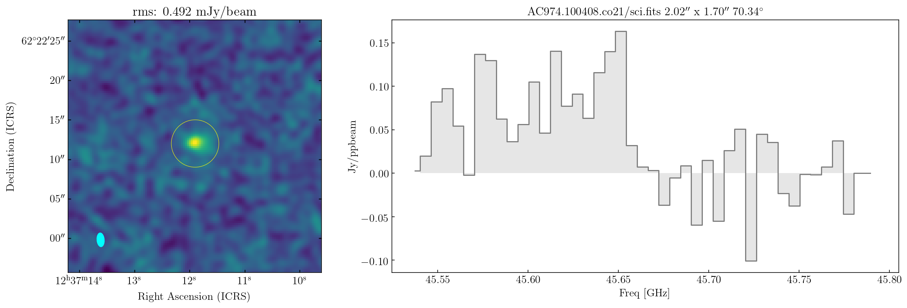
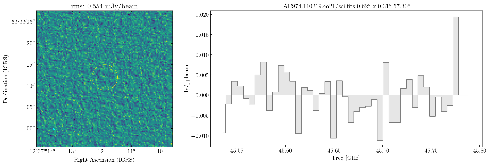
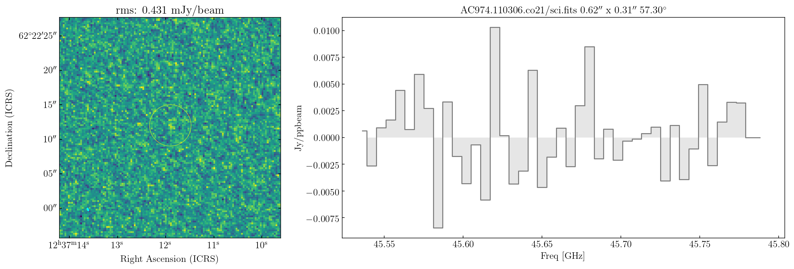
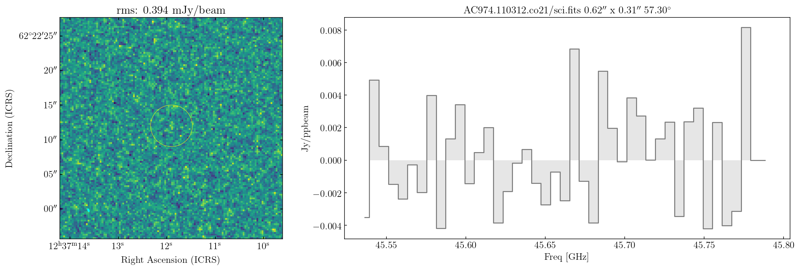
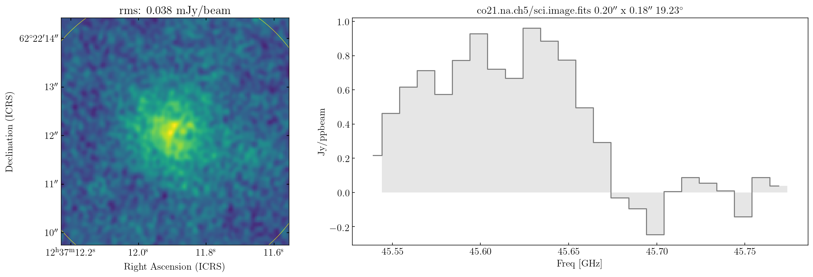

|Open In Colab|

Example GN20: perform imaging of CO 2-1 dataset
-----------------------------------------------

.. |Open In Colab| image:: https://colab.research.google.com/assets/colab-badge.svg
   :target: https://colab.research.google.com/github/r-xue/casa_proc/blob/master/demo/test_casaproc.ipynb

.. code:: ipython3

    
    import sys,os,glob,io,socket
    import logging
    from pprint import pprint
    import numpy as np
    
    import casatasks as ctasks
    import casatools as ctools
    
    # Import wurlitzer for display real-time console logs
    #   https://github.com/minrk/wurlitzer
    %reload_ext wurlitzer
    
    # for inline plots
    %matplotlib inline
    %config InlineBackend.figure_format = "retina"

Using the beta-version of CASA 6

.. code:: ipython3

    print('casatools ver:',ctools.version_string())
    print('casatasks ver:',ctasks.version_string())

.. parsed-literal::

    casatools ver: 6.1.0.30
    casatasks ver: 6.1.0.30

Import some convinient functions from ``rxutils``
^^^^^^^^^^^^^^^^^^^^^^^^^^^^^^^^^^^^^^^^^^^^^^^^^

.. code:: ipython3

    from rxutils.casa.imager import invert        # generate a small dirty image (invert) from a MS dataset as invert
    from rxutils.casa.imager import xclean
    from rxutils.casa.proc import setLogfile        # help reset the casa 6 log file
    from rxutils.casa.proc import checkchflag       # help check channel-wise flagging stats

11B044

.. code:: ipython3

    demo_dir='/Users/Rui/Documents/Workspace/projects/GMaKE/examples/data/gn20/vla/'
    if  'hypersion' or 'mini' in socket.gethostname() :
        os.chdir(demo_dir)
    setLogfile(demo_dir+'/'+'demo_gn20_imaging.log')
    
    
    mslist=glob.glob('AC*ms')
    mslist=sorted(mslist)
    print(mslist)
    
    #'AC974.100408.ms'
    
    for ms in mslist:
        print(">>>> working on MS:",ms)
        #if  not ('100408' in ms or '100409' in ms):
        #    continue        
        checkchflag(ms)
        invert(ms,ms.replace('.ms','')+'.co21/sci',antenna='',\
           cell=0.25,imsize=[128,128],phasecenter='ICRS 12:37:11.89 +62.22.11.80',\
           datacolumn='data',start=0,nchan=-1,width=1)

.. parsed-literal::

    ['AC974.100329.ms', 'AC974.100404.ms', 'AC974.100408.ms', 'AC974.100409.ms', 'AC974.110211.ms', 'AC974.110212.ms', 'AC974.110214.ms', 'AC974.110216.ms', 'AC974.110217.ms', 'AC974.110218.ms', 'AC974.110219.ms', 'AC974.110221.ms', 'AC974.110224.ms', 'AC974.110226.ms', 'AC974.110227.ms', 'AC974.110306.ms', 'AC974.110312.ms', 'AC974.110428.ms']
    >>>> working on MS: AC974.100329.ms
    
    run checkchflag on AC974.100329.ms
    
    
    query: DATA_DESC_ID==0
    data shape:  (2, 128, 138765)
    
    pol id: 0 variety: 4
    00000000000000000000000000000000000000000000000000000000000000000000000000000000000000000000000000000000000000000000000000111111 113806/138765
    00000000000000000000000000000000000000000000000000000000000000111111111111111111111111111111111111111111111111111111111111111111 12168/138765
    11111111111111111111111111111111111111111111111111111111111100000000000000000000000000000000000000000000000000000000000000111111 12735/138765
    11111111111111111111111111111111111111111111111111111111111111111111111111111111111111111111111111111111111111111111111111111111 56/138765
    pol id: 1 variety: 4
    00000000000000000000000000000000000000000000000000000000000000000000000000000000000000000000000000000000000000000000000000111111 113806/138765
    00000000000000000000000000000000000000000000000000000000000000111111111111111111111111111111111111111111111111111111111111111111 12168/138765
    11111111111111111111111111111111111111111111111111111111111100000000000000000000000000000000000000000000000000000000000000111111 12735/138765
    11111111111111111111111111111111111111111111111111111111111111111111111111111111111111111111111111111111111111111111111111111111 56/138765
    

.. parsed-literal::

    2019-12-13 13:33:51	INFO	tclean::::casa	##########################################
    2019-12-13 13:33:51	INFO	tclean::::casa	##### Begin Task: tclean             #####
    2019-12-13 13:33:51	INFO	tclean::::casa	tclean( vis='AC974.100329.ms', selectdata=True, field='', spw='', timerange='', uvrange='', antenna='', scan='', observation='', intent='', datacolumn='data', imagename='AC974.100329.co21/sci', imsize=[128, 128], cell=0.25, phasecenter='ICRS 12:37:11.89 +62.22.11.80', stokes='I', projection='SIN', startmodel='', specmode='cube', reffreq='', nchan=-1, start=0, width=1, outframe='LSRK', veltype='radio', restfreq=[], interpolation='nearest', perchanweightdensity=True, gridder='standard', facets=1, psfphasecenter='', chanchunks=1, wprojplanes=1, vptable='', mosweight=True, aterm=True, psterm=False, wbawp=True, conjbeams=False, cfcache='', usepointing=False, computepastep=360.0, rotatepastep=360.0, pointingoffsetsigdev=0.0, pblimit=0.2, normtype='flatnoise', deconvolver='hogbom', scales=[], nterms=2, smallscalebias=0.0, restoration=True, restoringbeam='', pbcor=False, outlierfile='', weighting='briggs', robust=1.0, noise='1.0Jy', npixels=0, uvtaper=[''], niter=0, gain=0.1, threshold=0.0, nsigma=0.0, cycleniter=-1, cyclefactor=1.0, minpsffraction=0.05, maxpsffraction=0.8, interactive=False, usemask='user', mask='', pbmask=0.0, sidelobethreshold=3.0, noisethreshold=5.0, lownoisethreshold=1.5, negativethreshold=0.0, smoothfactor=1.0, minbeamfrac=0.3, cutthreshold=0.01, growiterations=75, dogrowprune=True, minpercentchange=-1.0, verbose=False, fastnoise=True, restart=True, savemodel='none', calcres=True, calcpsf=True, parallel=False )
    2019-12-13 13:33:51	INFO	tclean::::casa	Verifying Input Parameters
    2019-12-13 13:33:51	INFO	SynthesisImagerVi2::selectData 	MS : AC974.100329.ms | [Opened in readonly mode]
    2019-12-13 13:33:51	INFO	SynthesisImagerVi2::selectData 	  NRows selected : 138765
    2019-12-13 13:33:51	INFO	SynthesisImagerVi2::defineImage 	Define image coordinates for [AC974.100329.co21/sci] : 
    2019-12-13 13:33:51	WARN	SynthesisParamsImage::buildCoordinateSystem (file casa-source/code/synthesis/ImagerObjects/SynthesisUtilMethods.cc, line 2124)	No rest frequency info, using the center of the selected spw(s):4.5662e+10 Hz. Velocity labelling may not be correct.
    2019-12-13 13:33:51	INFO	MSTransformRegridder::calcChanFreqs	 phaseCenter='Direction: [-0.457666, -0.0749419, 0.88596]'  Channels equidistant in freq
    2019-12-13 13:33:51	INFO	MSTransformRegridder::calcChanFreqs+	 Central frequency (in output frame) = 4.5662e+10 Hz
    2019-12-13 13:33:51	INFO	MSTransformRegridder::calcChanFreqs+	 Width of central channel (in output frame) = 2e+06 Hz
    2019-12-13 13:33:51	INFO	MSTransformRegridder::calcChanFreqs+	 Number of channels = 128
    2019-12-13 13:33:51	INFO	MSTransformRegridder::calcChanFreqs+	 Total width of SPW (in output frame) = 2.56e+08 Hz
    2019-12-13 13:33:51	INFO	MSTransformRegridder::calcChanFreqs+	 Lower edge = 4.5534e+10 Hz, upper edge = 4.579e+10 Hz
    2019-12-13 13:33:51	INFO	SynthesisImagerVi2::defineImage 	Impars : start 0
    2019-12-13 13:33:51	INFO	SynthesisImagerVi2::defineImage 	Shape : [128, 128, 1, 128]Spectral : [4.5535e+10] at [0] with increment [2e+06]
    2019-12-13 13:33:51	INFO	SynthesisImagerVi2::defineImage 	Set Gridding options for [AC974.100329.co21/sci] with ftmachine : gridft
    2019-12-13 13:33:51	INFO	SynthesisImagerVi2::weight() 	Set imaging weights : Briggs weighting: sidelobes will be suppressed over full image
    2019-12-13 13:33:51	INFO	SynthesisImagerVi2::weight() 	Doing spectral cube Briggs weighting formula --  norm
    2019-12-13 13:33:51	INFO	SynthesisImager::tuneSelectData 	Tuning frequency data selection to match image spectral coordinates
    2019-12-13 13:33:51	INFO	SynthesisImagerVi2::selectData 	MS : AC974.100329.ms | [Opened in readonly mode]
    2019-12-13 13:33:51	INFO	SynthesisImagerVi2::selectData 	  NRows selected : 138765
    2019-12-13 13:33:51	INFO	task_tclean::SynthesisDeconvolver::setupDeconvolution 	Set Deconvolution Options for [AC974.100329.co21/sci] : hogbom
    2019-12-13 13:33:51	INFO	SynthesisImager::makePSF 	----------------------------------------------------------- Make PSF ---------------------------------------------
    
    0%....10....20....30....40....50....60....70....80....90....100%
    2019-12-13 13:34:19	INFO	SIImageStore::calcSensitivity 	[AC974.100329.co21/sci] Theoretical sensitivity (Jy/bm):c0:0.000191317 c1:0.000191316 c2:0.000191316 c3:0.000191316 c4:0.000191317 c5:0.000191317 c6:0.000191318 c7:0.000191318 c8:0.000191317 c9:0.000191317 c10:0.000191318 c11:0.000191317 c12:0.000191317 c13:0.000191317 c14:0.000191317 c15:0.000191317 c16:0.000191317 c17:0.000191317 c18:0.000191316 c19:0.000191316 c20:0.000191316 c21:0.000191317 c22:0.000191317 c23:0.000191316 c24:0.000191316 c25:0.000191317 c26:0.000191317 c27:0.000191316 c28:0.000191316 c29:0.000191316 c30:0.000191316 c31:0.000191316 c32:0.000191316 c33:0.000191316 c34:0.000191316 c35:0.000191317 c36:0.000191317 c37:0.000191317 c38:0.000191316 c39:0.00019132 c40:0.000191318 c41:0.000191318 c42:0.000191318 c43:0.000191318 c44:0.000191318 c45:0.000191318 c46:0.000191318 c47:0.000191318 c48:0.000191317 c49:0.000191318 c50:0.000191317 c51:0.000191317 c52:0.000191318 c53:0.000191319 c54:0.000191318 c55:0.000191318 c56:0.000191319 c57:0.000191319 c58:0.000191318 c59:0.000191318 c60:0.000183522 c61:0.000183522 c62:0.000184531 c63:0.000184531 c64:0.00018453 c65:0.000184531 c66:0.000184531 c67:0.000184531 c68:0.000184531 c69:0.000184531 c70:0.000184531 c71:0.000184531 c72:0.000184531 c73:0.000184531 c74:0.000184531 c75:0.000184531 c76:0.000184531 c77:0.000184533 c78:0.000184533 c79:0.000184533 c80:0.000184533 c81:0.000184533 c82:0.000184533 c83:0.000184534 c84:0.000184533 c85:0.000184533 c86:0.000184533 c87:0.000184533 c88:0.000184533 c89:0.000184533 c90:0.000184532 c91:0.000184534 c92:0.000184534 c93:0.000184534 c94:0.000184533 c95:0.000184534 c96:0.000184534 c97:0.000184534 c98:0.000184533 c99:0.000184533 c100:0.000184534 c101:0.000184534 c102:0.000184533 c103:0.000184533 c104:0.000184533 c105:0.000184533 c106:0.000184533 c107:0.000184532 c108:0.000184533 c109:0.000184533 c110:0.000184533 c111:0.000184533 c112:0.000184533 c113:0.000184533 c114:0.000184533 c115:0.000184532 c116:0.000184532 c117:0.000184533 c118:0.000184532 c119:0.000184533 c120:0.000184533 c121:0.000184533 c122:none c123:none c124:none c125:none c126:none c127:none 
    2019-12-13 13:34:19	WARN	SIImageStore::getPSFGaussian (file casa-source/code/synthesis/ImagerObjects/SIImageStore.cc, line 1895)	PSF is blank for[C122:P0] [C123:P0] [C124:P0] [C125:P0] [C126:P0] [C127:P0] 
    2019-12-13 13:34:19	INFO	SIImageStore::printBeamSet 	Restoring Beams 
    2019-12-13 13:34:19	INFO	SIImageStore::printBeamSet +	Pol   Type Chan        Freq   Vel
    2019-12-13 13:34:19	INFO	SIImageStore::printBeamSet +	  I    Max   60 4.56550e+10    46    1.8970 arcsec x    1.6303 arcsec pa=-86.6340 deg
    2019-12-13 13:34:19	INFO	SIImageStore::printBeamSet +	  I    Min   59 4.56530e+10    59    1.8499 arcsec x    1.6339 arcsec pa=-82.8061 deg
    2019-12-13 13:34:19	INFO	SIImageStore::printBeamSet +	  I Median  117 4.57690e+10  -703    1.8857 arcsec x    1.6227 arcsec pa=-86.5455 deg
    2019-12-13 13:34:19	INFO	task_tclean::SynthesisImagerVi2::makePrimaryBeam 	vi2 : Evaluating Primary Beam model onto image grid(s)
    2019-12-13 13:34:20	INFO	task_tclean::SynthesisImager::executeMajorCycle 	----------------------------------------------------------- Run (Last) Major Cycle 1 -------------------------------------
    
    0%....10....20....30....40....50....60....70....80....90....100%
    2019-12-13 13:34:41	INFO	task_tclean::SDAlgorithmBase::restore 	[AC974.100329.co21/sci] : Restoring model image.
    2019-12-13 13:34:41	WARN	task_tclean::SIImageStore::restore (file casa-source/code/synthesis/ImagerObjects/SIImageStore.cc, line 2068)	Restoring with an empty model image. Only residuals will be processed to form the output restored image.
    2019-12-13 13:34:41	INFO	task_tclean::SIImageStore::restore 	Beam for chan : 0 : 1.85465 arcsec, 1.63938 arcsec, -83.2102 deg
    2019-12-13 13:34:41	INFO	task_tclean::SIImageStore::restore 	Beam for chan : 1 : 1.85458 arcsec, 1.63931 arcsec, -83.21 deg
    2019-12-13 13:34:41	INFO	task_tclean::SIImageStore::restore 	Beam for chan : 2 : 1.85451 arcsec, 1.63924 arcsec, -83.2098 deg
    2019-12-13 13:34:41	INFO	task_tclean::SIImageStore::restore 	Beam for chan : 3 : 1.85443 arcsec, 1.63917 arcsec, -83.2086 deg
    2019-12-13 13:34:41	INFO	task_tclean::SIImageStore::restore 	Beam for chan : 4 : 1.85434 arcsec, 1.63909 arcsec, -83.208 deg
    2019-12-13 13:34:41	INFO	task_tclean::SIImageStore::restore 	Beam for chan : 5 : 1.85426 arcsec, 1.63902 arcsec, -83.2075 deg
    2019-12-13 13:34:41	INFO	task_tclean::SIImageStore::restore 	Beam for chan : 6 : 1.85419 arcsec, 1.63896 arcsec, -83.2047 deg
    2019-12-13 13:34:41	INFO	task_tclean::SIImageStore::restore 	Beam for chan : 7 : 1.85412 arcsec, 1.63889 arcsec, -83.2044 deg
    2019-12-13 13:34:41	INFO	task_tclean::SIImageStore::restore 	Beam for chan : 8 : 1.85403 arcsec, 1.63881 arcsec, -83.2066 deg
    2019-12-13 13:34:41	INFO	task_tclean::SIImageStore::restore 	Beam for chan : 9 : 1.85395 arcsec, 1.63874 arcsec, -83.2064 deg
    2019-12-13 13:34:41	INFO	task_tclean::SIImageStore::restore 	Beam for chan : 10 : 1.85391 arcsec, 1.63869 arcsec, -83.2115 deg
    2019-12-13 13:34:41	INFO	task_tclean::SIImageStore::restore 	Beam for chan : 11 : 1.85381 arcsec, 1.6386 arcsec, -83.2053 deg
    2019-12-13 13:34:41	INFO	task_tclean::SIImageStore::restore 	Beam for chan : 12 : 1.85373 arcsec, 1.63852 arcsec, -83.2058 deg
    2019-12-13 13:34:41	INFO	task_tclean::SIImageStore::restore 	Beam for chan : 13 : 1.85365 arcsec, 1.63845 arcsec, -83.2049 deg
    2019-12-13 13:34:41	INFO	task_tclean::SIImageStore::restore 	Beam for chan : 14 : 1.85326 arcsec, 1.63708 arcsec, -82.8216 deg
    2019-12-13 13:34:41	INFO	task_tclean::SIImageStore::restore 	Beam for chan : 15 : 1.85319 arcsec, 1.63702 arcsec, -82.821 deg
    2019-12-13 13:34:41	INFO	task_tclean::SIImageStore::restore 	Beam for chan : 16 : 1.85311 arcsec, 1.63695 arcsec, -82.8208 deg
    2019-12-13 13:34:41	INFO	task_tclean::SIImageStore::restore 	Beam for chan : 17 : 1.85304 arcsec, 1.63688 arcsec, -82.8205 deg
    2019-12-13 13:34:41	INFO	task_tclean::SIImageStore::restore 	Beam for chan : 18 : 1.85296 arcsec, 1.63681 arcsec, -82.8206 deg
    2019-12-13 13:34:41	INFO	task_tclean::SIImageStore::restore 	Beam for chan : 19 : 1.85289 arcsec, 1.63674 arcsec, -82.82 deg
    2019-12-13 13:34:41	INFO	task_tclean::SIImageStore::restore 	Beam for chan : 20 : 1.85282 arcsec, 1.63667 arcsec, -82.8193 deg
    2019-12-13 13:34:41	INFO	task_tclean::SIImageStore::restore 	Beam for chan : 21 : 1.85273 arcsec, 1.6366 arcsec, -82.8193 deg
    2019-12-13 13:34:41	INFO	task_tclean::SIImageStore::restore 	Beam for chan : 22 : 1.85266 arcsec, 1.63653 arcsec, -82.8184 deg
    2019-12-13 13:34:41	INFO	task_tclean::SIImageStore::restore 	Beam for chan : 23 : 1.85258 arcsec, 1.63646 arcsec, -82.8177 deg
    2019-12-13 13:34:41	INFO	task_tclean::SIImageStore::restore 	Beam for chan : 24 : 1.8525 arcsec, 1.63639 arcsec, -82.8171 deg
    2019-12-13 13:34:41	INFO	task_tclean::SIImageStore::restore 	Beam for chan : 25 : 1.85243 arcsec, 1.63631 arcsec, -82.8165 deg
    2019-12-13 13:34:41	INFO	task_tclean::SIImageStore::restore 	Beam for chan : 26 : 1.85235 arcsec, 1.63624 arcsec, -82.8164 deg
    2019-12-13 13:34:41	INFO	task_tclean::SIImageStore::restore 	Beam for chan : 27 : 1.85228 arcsec, 1.63618 arcsec, -82.8165 deg
    2019-12-13 13:34:41	INFO	task_tclean::SIImageStore::restore 	Beam for chan : 28 : 1.8522 arcsec, 1.6361 arcsec, -82.8166 deg
    2019-12-13 13:34:41	INFO	task_tclean::SIImageStore::restore 	Beam for chan : 29 : 1.85213 arcsec, 1.63603 arcsec, -82.8166 deg
    2019-12-13 13:34:41	INFO	task_tclean::SIImageStore::restore 	Beam for chan : 30 : 1.85206 arcsec, 1.63595 arcsec, -82.8168 deg
    2019-12-13 13:34:41	INFO	task_tclean::SIImageStore::restore 	Beam for chan : 31 : 1.85199 arcsec, 1.63588 arcsec, -82.8164 deg
    2019-12-13 13:34:41	INFO	task_tclean::SIImageStore::restore 	Beam for chan : 32 : 1.85191 arcsec, 1.63581 arcsec, -82.8161 deg
    2019-12-13 13:34:41	INFO	task_tclean::SIImageStore::restore 	Beam for chan : 33 : 1.85184 arcsec, 1.63574 arcsec, -82.8159 deg
    2019-12-13 13:34:41	INFO	task_tclean::SIImageStore::restore 	Beam for chan : 34 : 1.85176 arcsec, 1.63566 arcsec, -82.8158 deg
    2019-12-13 13:34:41	INFO	task_tclean::SIImageStore::restore 	Beam for chan : 35 : 1.85169 arcsec, 1.63561 arcsec, -82.8128 deg
    2019-12-13 13:34:41	INFO	task_tclean::SIImageStore::restore 	Beam for chan : 36 : 1.85162 arcsec, 1.63555 arcsec, -82.8118 deg
    2019-12-13 13:34:41	INFO	task_tclean::SIImageStore::restore 	Beam for chan : 37 : 1.85154 arcsec, 1.63546 arcsec, -82.8155 deg
    2019-12-13 13:34:41	INFO	task_tclean::SIImageStore::restore 	Beam for chan : 38 : 1.85147 arcsec, 1.63539 arcsec, -82.8146 deg
    2019-12-13 13:34:41	INFO	task_tclean::SIImageStore::restore 	Beam for chan : 39 : 1.85141 arcsec, 1.63533 arcsec, -82.8174 deg
    2019-12-13 13:34:41	INFO	task_tclean::SIImageStore::restore 	Beam for chan : 40 : 1.8513 arcsec, 1.63523 arcsec, -82.8141 deg
    2019-12-13 13:34:41	INFO	task_tclean::SIImageStore::restore 	Beam for chan : 41 : 1.85123 arcsec, 1.63517 arcsec, -82.8137 deg
    2019-12-13 13:34:41	INFO	task_tclean::SIImageStore::restore 	Beam for chan : 42 : 1.85116 arcsec, 1.6351 arcsec, -82.8134 deg
    2019-12-13 13:34:41	INFO	task_tclean::SIImageStore::restore 	Beam for chan : 43 : 1.85108 arcsec, 1.63504 arcsec, -82.8126 deg
    2019-12-13 13:34:41	INFO	task_tclean::SIImageStore::restore 	Beam for chan : 44 : 1.851 arcsec, 1.63496 arcsec, -82.8126 deg
    2019-12-13 13:34:41	INFO	task_tclean::SIImageStore::restore 	Beam for chan : 45 : 1.85093 arcsec, 1.63489 arcsec, -82.812 deg
    2019-12-13 13:34:41	INFO	task_tclean::SIImageStore::restore 	Beam for chan : 46 : 1.85086 arcsec, 1.63482 arcsec, -82.8113 deg
    2019-12-13 13:34:41	INFO	task_tclean::SIImageStore::restore 	Beam for chan : 47 : 1.85078 arcsec, 1.63476 arcsec, -82.811 deg
    2019-12-13 13:34:41	INFO	task_tclean::SIImageStore::restore 	Beam for chan : 48 : 1.85071 arcsec, 1.63469 arcsec, -82.8109 deg
    2019-12-13 13:34:41	INFO	task_tclean::SIImageStore::restore 	Beam for chan : 49 : 1.85064 arcsec, 1.63462 arcsec, -82.8086 deg
    2019-12-13 13:34:41	INFO	task_tclean::SIImageStore::restore 	Beam for chan : 50 : 1.85056 arcsec, 1.63454 arcsec, -82.8102 deg
    2019-12-13 13:34:41	INFO	task_tclean::SIImageStore::restore 	Beam for chan : 51 : 1.85049 arcsec, 1.63448 arcsec, -82.8105 deg
    2019-12-13 13:34:41	INFO	task_tclean::SIImageStore::restore 	Beam for chan : 52 : 1.85044 arcsec, 1.63443 arcsec, -82.817 deg
    2019-12-13 13:34:41	INFO	task_tclean::SIImageStore::restore 	Beam for chan : 53 : 1.85037 arcsec, 1.63439 arcsec, -82.8137 deg
    2019-12-13 13:34:41	INFO	task_tclean::SIImageStore::restore 	Beam for chan : 54 : 1.85027 arcsec, 1.63429 arcsec, -82.8069 deg
    2019-12-13 13:34:41	INFO	task_tclean::SIImageStore::restore 	Beam for chan : 55 : 1.8502 arcsec, 1.63422 arcsec, -82.8069 deg
    2019-12-13 13:34:41	INFO	task_tclean::SIImageStore::restore 	Beam for chan : 56 : 1.85011 arcsec, 1.63414 arcsec, -82.8064 deg
    2019-12-13 13:34:41	INFO	task_tclean::SIImageStore::restore 	Beam for chan : 57 : 1.85003 arcsec, 1.63407 arcsec, -82.8061 deg
    2019-12-13 13:34:41	INFO	task_tclean::SIImageStore::restore 	Beam for chan : 58 : 1.84996 arcsec, 1.63399 arcsec, -82.8059 deg
    2019-12-13 13:34:41	INFO	task_tclean::SIImageStore::restore 	Beam for chan : 59 : 1.84989 arcsec, 1.63393 arcsec, -82.8061 deg
    2019-12-13 13:34:41	INFO	task_tclean::SIImageStore::restore 	Beam for chan : 60 : 1.89702 arcsec, 1.63031 arcsec, -86.634 deg
    2019-12-13 13:34:41	INFO	task_tclean::SIImageStore::restore 	Beam for chan : 61 : 1.89695 arcsec, 1.63025 arcsec, -86.6343 deg
    2019-12-13 13:34:41	INFO	task_tclean::SIImageStore::restore 	Beam for chan : 62 : 1.8899 arcsec, 1.62668 arcsec, -86.5516 deg
    2019-12-13 13:34:41	INFO	task_tclean::SIImageStore::restore 	Beam for chan : 63 : 1.88983 arcsec, 1.62661 arcsec, -86.5515 deg
    2019-12-13 13:34:41	INFO	task_tclean::SIImageStore::restore 	Beam for chan : 64 : 1.88975 arcsec, 1.62655 arcsec, -86.551 deg
    2019-12-13 13:34:41	INFO	task_tclean::SIImageStore::restore 	Beam for chan : 65 : 1.88968 arcsec, 1.62647 arcsec, -86.551 deg
    2019-12-13 13:34:41	INFO	task_tclean::SIImageStore::restore 	Beam for chan : 66 : 1.8896 arcsec, 1.6264 arcsec, -86.551 deg
    2019-12-13 13:34:41	INFO	task_tclean::SIImageStore::restore 	Beam for chan : 67 : 1.88952 arcsec, 1.62633 arcsec, -86.551 deg
    2019-12-13 13:34:41	INFO	task_tclean::SIImageStore::restore 	Beam for chan : 68 : 1.88944 arcsec, 1.62622 arcsec, -86.5525 deg
    2019-12-13 13:34:41	INFO	task_tclean::SIImageStore::restore 	Beam for chan : 69 : 1.88937 arcsec, 1.62615 arcsec, -86.5524 deg
    2019-12-13 13:34:41	INFO	task_tclean::SIImageStore::restore 	Beam for chan : 70 : 1.8893 arcsec, 1.62608 arcsec, -86.5525 deg
    2019-12-13 13:34:41	INFO	task_tclean::SIImageStore::restore 	Beam for chan : 71 : 1.88922 arcsec, 1.62601 arcsec, -86.5522 deg
    2019-12-13 13:34:41	INFO	task_tclean::SIImageStore::restore 	Beam for chan : 72 : 1.88914 arcsec, 1.62595 arcsec, -86.5521 deg
    2019-12-13 13:34:41	INFO	task_tclean::SIImageStore::restore 	Beam for chan : 73 : 1.88907 arcsec, 1.62587 arcsec, -86.5516 deg
    2019-12-13 13:34:41	INFO	task_tclean::SIImageStore::restore 	Beam for chan : 74 : 1.88899 arcsec, 1.6258 arcsec, -86.5513 deg
    2019-12-13 13:34:41	INFO	task_tclean::SIImageStore::restore 	Beam for chan : 75 : 1.88892 arcsec, 1.62573 arcsec, -86.551 deg
    2019-12-13 13:34:41	INFO	task_tclean::SIImageStore::restore 	Beam for chan : 76 : 1.88885 arcsec, 1.62566 arcsec, -86.5506 deg
    2019-12-13 13:34:41	INFO	task_tclean::SIImageStore::restore 	Beam for chan : 77 : 1.88875 arcsec, 1.62557 arcsec, -86.55 deg
    2019-12-13 13:34:41	INFO	task_tclean::SIImageStore::restore 	Beam for chan : 78 : 1.88868 arcsec, 1.6255 arcsec, -86.5499 deg
    2019-12-13 13:34:41	INFO	task_tclean::SIImageStore::restore 	Beam for chan : 79 : 1.8886 arcsec, 1.62542 arcsec, -86.55 deg
    2019-12-13 13:34:41	INFO	task_tclean::SIImageStore::restore 	Beam for chan : 80 : 1.88852 arcsec, 1.62536 arcsec, -86.5502 deg
    2019-12-13 13:34:41	INFO	task_tclean::SIImageStore::restore 	Beam for chan : 81 : 1.88845 arcsec, 1.62529 arcsec, -86.5506 deg
    2019-12-13 13:34:41	INFO	task_tclean::SIImageStore::restore 	Beam for chan : 82 : 1.88838 arcsec, 1.62522 arcsec, -86.5499 deg
    2019-12-13 13:34:41	INFO	task_tclean::SIImageStore::restore 	Beam for chan : 83 : 1.88829 arcsec, 1.62514 arcsec, -86.5502 deg
    2019-12-13 13:34:41	INFO	task_tclean::SIImageStore::restore 	Beam for chan : 84 : 1.88822 arcsec, 1.62507 arcsec, -86.5499 deg
    2019-12-13 13:34:41	INFO	task_tclean::SIImageStore::restore 	Beam for chan : 85 : 1.88814 arcsec, 1.625 arcsec, -86.5499 deg
    2019-12-13 13:34:41	INFO	task_tclean::SIImageStore::restore 	Beam for chan : 86 : 1.88806 arcsec, 1.62493 arcsec, -86.5496 deg
    2019-12-13 13:34:41	INFO	task_tclean::SIImageStore::restore 	Beam for chan : 87 : 1.88799 arcsec, 1.62486 arcsec, -86.5493 deg
    2019-12-13 13:34:41	INFO	task_tclean::SIImageStore::restore 	Beam for chan : 88 : 1.88792 arcsec, 1.62478 arcsec, -86.5491 deg
    2019-12-13 13:34:41	INFO	task_tclean::SIImageStore::restore 	Beam for chan : 89 : 1.88784 arcsec, 1.62471 arcsec, -86.549 deg
    2019-12-13 13:34:41	INFO	task_tclean::SIImageStore::restore 	Beam for chan : 90 : 1.88777 arcsec, 1.62464 arcsec, -86.5493 deg
    2019-12-13 13:34:41	INFO	task_tclean::SIImageStore::restore 	Beam for chan : 91 : 1.88768 arcsec, 1.62457 arcsec, -86.5494 deg
    2019-12-13 13:34:41	INFO	task_tclean::SIImageStore::restore 	Beam for chan : 92 : 1.8876 arcsec, 1.6245 arcsec, -86.5492 deg
    2019-12-13 13:34:41	INFO	task_tclean::SIImageStore::restore 	Beam for chan : 93 : 1.88753 arcsec, 1.62443 arcsec, -86.5493 deg
    2019-12-13 13:34:41	INFO	task_tclean::SIImageStore::restore 	Beam for chan : 94 : 1.88746 arcsec, 1.62435 arcsec, -86.5486 deg
    2019-12-13 13:34:41	INFO	task_tclean::SIImageStore::restore 	Beam for chan : 95 : 1.88741 arcsec, 1.62429 arcsec, -86.548 deg
    2019-12-13 13:34:41	INFO	task_tclean::SIImageStore::restore 	Beam for chan : 96 : 1.8873 arcsec, 1.62421 arcsec, -86.5485 deg
    2019-12-13 13:34:41	INFO	task_tclean::SIImageStore::restore 	Beam for chan : 97 : 1.88723 arcsec, 1.62414 arcsec, -86.5485 deg
    2019-12-13 13:34:41	INFO	task_tclean::SIImageStore::restore 	Beam for chan : 98 : 1.88715 arcsec, 1.62407 arcsec, -86.5478 deg
    2019-12-13 13:34:41	INFO	task_tclean::SIImageStore::restore 	Beam for chan : 99 : 1.88708 arcsec, 1.62399 arcsec, -86.547 deg
    2019-12-13 13:34:41	INFO	task_tclean::SIImageStore::restore 	Beam for chan : 100 : 1.887 arcsec, 1.62392 arcsec, -86.547 deg
    2019-12-13 13:34:41	INFO	task_tclean::SIImageStore::restore 	Beam for chan : 101 : 1.88693 arcsec, 1.62385 arcsec, -86.547 deg
    2019-12-13 13:34:41	INFO	task_tclean::SIImageStore::restore 	Beam for chan : 102 : 1.88686 arcsec, 1.62378 arcsec, -86.5467 deg
    2019-12-13 13:34:41	INFO	task_tclean::SIImageStore::restore 	Beam for chan : 103 : 1.88678 arcsec, 1.62371 arcsec, -86.5464 deg
    2019-12-13 13:34:41	INFO	task_tclean::SIImageStore::restore 	Beam for chan : 104 : 1.8867 arcsec, 1.62364 arcsec, -86.5467 deg
    2019-12-13 13:34:41	INFO	task_tclean::SIImageStore::restore 	Beam for chan : 105 : 1.88663 arcsec, 1.62357 arcsec, -86.5469 deg
    2019-12-13 13:34:41	INFO	task_tclean::SIImageStore::restore 	Beam for chan : 106 : 1.88656 arcsec, 1.6235 arcsec, -86.5465 deg
    2019-12-13 13:34:41	INFO	task_tclean::SIImageStore::restore 	Beam for chan : 107 : 1.88649 arcsec, 1.62343 arcsec, -86.546 deg
    2019-12-13 13:34:41	INFO	task_tclean::SIImageStore::restore 	Beam for chan : 108 : 1.8864 arcsec, 1.62336 arcsec, -86.5458 deg
    2019-12-13 13:34:41	INFO	task_tclean::SIImageStore::restore 	Beam for chan : 109 : 1.88633 arcsec, 1.62329 arcsec, -86.5454 deg
    2019-12-13 13:34:41	INFO	task_tclean::SIImageStore::restore 	Beam for chan : 110 : 1.88626 arcsec, 1.62321 arcsec, -86.5449 deg
    2019-12-13 13:34:41	INFO	task_tclean::SIImageStore::restore 	Beam for chan : 111 : 1.88618 arcsec, 1.62314 arcsec, -86.545 deg
    2019-12-13 13:34:41	INFO	task_tclean::SIImageStore::restore 	Beam for chan : 112 : 1.88611 arcsec, 1.62307 arcsec, -86.5456 deg
    2019-12-13 13:34:41	INFO	task_tclean::SIImageStore::restore 	Beam for chan : 113 : 1.88604 arcsec, 1.623 arcsec, -86.5456 deg
    2019-12-13 13:34:41	INFO	task_tclean::SIImageStore::restore 	Beam for chan : 114 : 1.88596 arcsec, 1.62293 arcsec, -86.5458 deg
    2019-12-13 13:34:41	INFO	task_tclean::SIImageStore::restore 	Beam for chan : 115 : 1.88589 arcsec, 1.62286 arcsec, -86.5457 deg
    2019-12-13 13:34:41	INFO	task_tclean::SIImageStore::restore 	Beam for chan : 116 : 1.88582 arcsec, 1.62279 arcsec, -86.5455 deg
    2019-12-13 13:34:41	INFO	task_tclean::SIImageStore::restore 	Beam for chan : 117 : 1.88574 arcsec, 1.62272 arcsec, -86.5455 deg
    2019-12-13 13:34:41	INFO	task_tclean::SIImageStore::restore 	Beam for chan : 118 : 1.88567 arcsec, 1.62265 arcsec, -86.545 deg
    2019-12-13 13:34:41	INFO	task_tclean::SIImageStore::restore 	Beam for chan : 119 : 1.88558 arcsec, 1.62257 arcsec, -86.5449 deg
    2019-12-13 13:34:41	INFO	task_tclean::SIImageStore::restore 	Beam for chan : 120 : 1.88551 arcsec, 1.6225 arcsec, -86.5452 deg
    2019-12-13 13:34:41	INFO	task_tclean::SIImageStore::restore 	Beam for chan : 121 : 1.88544 arcsec, 1.62243 arcsec, -86.5449 deg
    2019-12-13 13:34:41	INFO	task_tclean::SIImageStore::restore 	Beam for chan : 122 : 1.89702 arcsec, 1.63031 arcsec, -86.634 deg
    2019-12-13 13:34:41	INFO	task_tclean::SIImageStore::restore 	Beam for chan : 123 : 1.89702 arcsec, 1.63031 arcsec, -86.634 deg
    2019-12-13 13:34:41	INFO	task_tclean::SIImageStore::restore 	Beam for chan : 124 : 1.89702 arcsec, 1.63031 arcsec, -86.634 deg
    2019-12-13 13:34:41	INFO	task_tclean::SIImageStore::restore 	Beam for chan : 125 : 1.89702 arcsec, 1.63031 arcsec, -86.634 deg
    2019-12-13 13:34:41	INFO	task_tclean::SIImageStore::restore 	Beam for chan : 126 : 1.89702 arcsec, 1.63031 arcsec, -86.634 deg
    2019-12-13 13:34:41	INFO	task_tclean::SIImageStore::restore 	Beam for chan : 127 : 1.89702 arcsec, 1.63031 arcsec, -86.634 deg
    2019-12-13 13:34:42	INFO	tclean::::casa	Result tclean: {}
    2019-12-13 13:34:42	INFO	tclean::::casa	Task tclean complete. Start time: 2019-12-13 07:33:50.798356 End time: 2019-12-13 07:34:41.537733
    2019-12-13 13:34:42	INFO	tclean::::casa	##### End Task: tclean               #####
    2019-12-13 13:34:42	INFO	tclean::::casa	##########################################
    2019-12-13 13:34:42	INFO	exportfits::::casa	##########################################
    2019-12-13 13:34:42	INFO	exportfits::::casa	##### Begin Task: exportfits         #####
    2019-12-13 13:34:42	INFO	exportfits::::casa	exportfits( imagename='AC974.100329.co21/sci.image', fitsimage='AC974.100329.co21/sci.fits', velocity=False, optical=False, bitpix=-32, minpix=0, maxpix=-1, overwrite=True, dropstokes=False, stokeslast=True, history=True, dropdeg=False )
    2019-12-13 13:34:42	INFO	exportfits::ImageFactory::toFITS	Applying mask of name 'mask0'
    2019-12-13 13:34:42	INFO	exportfits::ImageFitsConverter::ImageHeaderToFITS 	Truncating miscinfo field useweightimage to useweigh
    2019-12-13 13:34:42	INFO	exportfits::::casa	Result exportfits: None
    2019-12-13 13:34:42	INFO	exportfits::::casa	Task exportfits complete. Start time: 2019-12-13 07:34:41.540591 End time: 2019-12-13 07:34:41.648569
    2019-12-13 13:34:42	INFO	exportfits::::casa	##### End Task: exportfits           #####
    2019-12-13 13:34:42	INFO	exportfits::::casa	##########################################

.. parsed-literal::

    >>>> working on MS: AC974.100404.ms
    
    run checkchflag on AC974.100404.ms
    
    
    query: DATA_DESC_ID==0
    data shape:  (2, 128, 151672)
    
    pol id: 0 variety: 2
    00000000000000000000000000000000000000000000000000000000000000000000000000000000000000000000000000000000000000000000000000111111 137702/151672
    00000000000000000000000000000000000000000000000000000000000000111111111111111111111111111111111111111111111111111111111111111111 13970/151672
    pol id: 1 variety: 2
    00000000000000000000000000000000000000000000000000000000000000000000000000000000000000000000000000000000000000000000000000111111 137702/151672
    00000000000000000000000000000000000000000000000000000000000000111111111111111111111111111111111111111111111111111111111111111111 13970/151672
    

.. parsed-literal::

    2019-12-13 13:34:56	INFO	tclean::::casa	##########################################
    2019-12-13 13:34:56	INFO	tclean::::casa	##### Begin Task: tclean             #####
    2019-12-13 13:34:56	INFO	tclean::::casa	tclean( vis='AC974.100404.ms', selectdata=True, field='', spw='', timerange='', uvrange='', antenna='', scan='', observation='', intent='', datacolumn='data', imagename='AC974.100404.co21/sci', imsize=[128, 128], cell=0.25, phasecenter='ICRS 12:37:11.89 +62.22.11.80', stokes='I', projection='SIN', startmodel='', specmode='cube', reffreq='', nchan=-1, start=0, width=1, outframe='LSRK', veltype='radio', restfreq=[], interpolation='nearest', perchanweightdensity=True, gridder='standard', facets=1, psfphasecenter='', chanchunks=1, wprojplanes=1, vptable='', mosweight=True, aterm=True, psterm=False, wbawp=True, conjbeams=False, cfcache='', usepointing=False, computepastep=360.0, rotatepastep=360.0, pointingoffsetsigdev=0.0, pblimit=0.2, normtype='flatnoise', deconvolver='hogbom', scales=[], nterms=2, smallscalebias=0.0, restoration=True, restoringbeam='', pbcor=False, outlierfile='', weighting='briggs', robust=1.0, noise='1.0Jy', npixels=0, uvtaper=[''], niter=0, gain=0.1, threshold=0.0, nsigma=0.0, cycleniter=-1, cyclefactor=1.0, minpsffraction=0.05, maxpsffraction=0.8, interactive=False, usemask='user', mask='', pbmask=0.0, sidelobethreshold=3.0, noisethreshold=5.0, lownoisethreshold=1.5, negativethreshold=0.0, smoothfactor=1.0, minbeamfrac=0.3, cutthreshold=0.01, growiterations=75, dogrowprune=True, minpercentchange=-1.0, verbose=False, fastnoise=True, restart=True, savemodel='none', calcres=True, calcpsf=True, parallel=False )
    2019-12-13 13:34:56	INFO	tclean::::casa	Verifying Input Parameters
    2019-12-13 13:34:56	INFO	SynthesisImagerVi2::selectData 	MS : AC974.100404.ms | [Opened in readonly mode]
    2019-12-13 13:34:56	INFO	SynthesisImagerVi2::selectData 	  NRows selected : 151672
    2019-12-13 13:34:56	INFO	SynthesisImagerVi2::defineImage 	Define image coordinates for [AC974.100404.co21/sci] : 
    2019-12-13 13:34:56	WARN	SynthesisParamsImage::buildCoordinateSystem (file casa-source/code/synthesis/ImagerObjects/SynthesisUtilMethods.cc, line 2124)	No rest frequency info, using the center of the selected spw(s):4.56622e+10 Hz. Velocity labelling may not be correct.
    2019-12-13 13:34:56	INFO	MSTransformRegridder::calcChanFreqs	 phaseCenter='Direction: [-0.457666, -0.0749419, 0.88596]'  Channels equidistant in freq
    2019-12-13 13:34:56	INFO	MSTransformRegridder::calcChanFreqs+	 Central frequency (in output frame) = 4.56622e+10 Hz
    2019-12-13 13:34:56	INFO	MSTransformRegridder::calcChanFreqs+	 Width of central channel (in output frame) = 2.00001e+06 Hz
    2019-12-13 13:34:56	INFO	MSTransformRegridder::calcChanFreqs+	 Number of channels = 128
    2019-12-13 13:34:56	INFO	MSTransformRegridder::calcChanFreqs+	 Total width of SPW (in output frame) = 2.56001e+08 Hz
    2019-12-13 13:34:56	INFO	MSTransformRegridder::calcChanFreqs+	 Lower edge = 4.55342e+10 Hz, upper edge = 4.57902e+10 Hz
    2019-12-13 13:34:56	INFO	SynthesisImagerVi2::defineImage 	Impars : start 0
    2019-12-13 13:34:56	INFO	SynthesisImagerVi2::defineImage 	Shape : [128, 128, 1, 128]Spectral : [4.55352e+10] at [0] with increment [2.00001e+06]
    2019-12-13 13:34:56	INFO	SynthesisImagerVi2::defineImage 	Set Gridding options for [AC974.100404.co21/sci] with ftmachine : gridft
    2019-12-13 13:34:56	INFO	SynthesisImagerVi2::weight() 	Set imaging weights : Briggs weighting: sidelobes will be suppressed over full image
    2019-12-13 13:34:56	INFO	SynthesisImagerVi2::weight() 	Doing spectral cube Briggs weighting formula --  norm
    2019-12-13 13:34:56	INFO	SynthesisImager::tuneSelectData 	Tuning frequency data selection to match image spectral coordinates
    2019-12-13 13:34:56	INFO	SynthesisImagerVi2::selectData 	MS : AC974.100404.ms | [Opened in readonly mode]
    2019-12-13 13:34:56	INFO	SynthesisImagerVi2::selectData 	  NRows selected : 151672
    2019-12-13 13:34:56	INFO	task_tclean::SynthesisDeconvolver::setupDeconvolution 	Set Deconvolution Options for [AC974.100404.co21/sci] : hogbom
    2019-12-13 13:34:56	INFO	SynthesisImager::makePSF 	----------------------------------------------------------- Make PSF ---------------------------------------------
    
    0%....10....20....30....40....50....60....70....80....90....100%
    2019-12-13 13:35:27	INFO	SIImageStore::calcSensitivity 	[AC974.100404.co21/sci] Theoretical sensitivity (Jy/bm):c0:0.000189537 c1:0.000189537 c2:0.000189537 c3:0.000189537 c4:0.000189537 c5:0.000189537 c6:0.00018954 c7:0.000189539 c8:0.000189539 c9:0.000189539 c10:0.000189539 c11:0.000189539 c12:0.000189539 c13:0.000189539 c14:0.000189539 c15:0.000189538 c16:0.000189538 c17:0.000189538 c18:0.000189538 c19:0.000189539 c20:0.000189538 c21:0.000189539 c22:0.000189538 c23:0.000189538 c24:0.000189538 c25:0.000189538 c26:0.000189538 c27:0.000189538 c28:0.000189538 c29:0.000189538 c30:0.000189538 c31:0.000189538 c32:0.000189539 c33:0.000189539 c34:0.000189539 c35:0.000189539 c36:0.000189539 c37:0.000189539 c38:0.000189539 c39:0.000189542 c40:0.000189541 c41:0.00018954 c42:0.00018954 c43:0.00018954 c44:0.00018954 c45:0.00018954 c46:0.00018954 c47:0.000189539 c48:0.00018954 c49:0.000189539 c50:0.000189539 c51:0.000189539 c52:0.000189539 c53:0.00018954 c54:0.00018954 c55:0.00018954 c56:0.00018954 c57:0.00018954 c58:0.00018954 c59:0.00018954 c60:0.00018954 c61:0.00018954 c62:0.000190454 c63:0.000190454 c64:0.000190455 c65:0.000190455 c66:0.000190456 c67:0.000190456 c68:0.000190456 c69:0.000190456 c70:0.000190456 c71:0.000190456 c72:0.000190456 c73:0.000190456 c74:0.000190456 c75:0.000190456 c76:0.000190458 c77:0.000190458 c78:0.000190458 c79:0.000190458 c80:0.000190458 c81:0.000190458 c82:0.000190458 c83:0.000190458 c84:0.000190458 c85:0.000190459 c86:0.000190459 c87:0.000190459 c88:0.000190459 c89:0.000190459 c90:0.000190459 c91:0.000190459 c92:0.000190459 c93:0.000190459 c94:0.000190459 c95:0.00019046 c96:0.000190459 c97:0.000190459 c98:0.000190459 c99:0.000190459 c100:0.000190459 c101:0.000190459 c102:0.000190459 c103:0.000190459 c104:0.000190459 c105:0.000190459 c106:0.000190458 c107:0.000190459 c108:0.000190459 c109:0.000190459 c110:0.000190459 c111:0.000190458 c112:0.000190459 c113:0.00019046 c114:0.000190459 c115:0.000190459 c116:0.00019046 c117:0.000190461 c118:0.00019046 c119:0.00019046 c120:0.00019046 c121:0.00019046 c122:none c123:none c124:none c125:none c126:none c127:none 
    2019-12-13 13:35:27	WARN	SIImageStore::getPSFGaussian (file casa-source/code/synthesis/ImagerObjects/SIImageStore.cc, line 1895)	PSF is blank for[C122:P0] [C123:P0] [C124:P0] [C125:P0] [C126:P0] [C127:P0] 
    2019-12-13 13:35:27	INFO	SIImageStore::printBeamSet 	Restoring Beams 
    2019-12-13 13:35:27	INFO	SIImageStore::printBeamSet +	Pol   Type Chan        Freq   Vel
    2019-12-13 13:35:27	INFO	SIImageStore::printBeamSet +	  I    Max    0 4.55352e+10   834    1.9195 arcsec x    1.8714 arcsec pa=-29.3493 deg
    2019-12-13 13:35:27	INFO	SIImageStore::printBeamSet +	  I    Min  121 4.57772e+10  -755    1.9067 arcsec x    1.8562 arcsec pa=-28.0853 deg
    2019-12-13 13:35:27	INFO	SIImageStore::printBeamSet +	  I Median   57 4.56492e+10    85    1.9151 arcsec x    1.8670 arcsec pa=-29.3427 deg
    2019-12-13 13:35:27	INFO	task_tclean::SynthesisImagerVi2::makePrimaryBeam 	vi2 : Evaluating Primary Beam model onto image grid(s)
    2019-12-13 13:35:28	INFO	task_tclean::SynthesisImager::executeMajorCycle 	----------------------------------------------------------- Run (Last) Major Cycle 1 -------------------------------------
    
    0%....10....20....30....40....50....60....70....80....90....100%
    2019-12-13 13:35:54	INFO	task_tclean::SDAlgorithmBase::restore 	[AC974.100404.co21/sci] : Restoring model image.
    2019-12-13 13:35:54	WARN	task_tclean::SIImageStore::restore (file casa-source/code/synthesis/ImagerObjects/SIImageStore.cc, line 2068)	Restoring with an empty model image. Only residuals will be processed to form the output restored image.
    2019-12-13 13:35:54	INFO	task_tclean::SIImageStore::restore 	Beam for chan : 0 : 1.91953 arcsec, 1.87136 arcsec, -29.3493 deg
    2019-12-13 13:35:55	INFO	task_tclean::SIImageStore::restore 	Beam for chan : 1 : 1.91946 arcsec, 1.87129 arcsec, -29.3501 deg
    2019-12-13 13:35:55	INFO	task_tclean::SIImageStore::restore 	Beam for chan : 2 : 1.91938 arcsec, 1.87121 arcsec, -29.348 deg
    2019-12-13 13:35:55	INFO	task_tclean::SIImageStore::restore 	Beam for chan : 3 : 1.9193 arcsec, 1.87112 arcsec, -29.3466 deg
    2019-12-13 13:35:55	INFO	task_tclean::SIImageStore::restore 	Beam for chan : 4 : 1.91922 arcsec, 1.87105 arcsec, -29.3442 deg
    2019-12-13 13:35:55	INFO	task_tclean::SIImageStore::restore 	Beam for chan : 5 : 1.91914 arcsec, 1.87097 arcsec, -29.3457 deg
    2019-12-13 13:35:55	INFO	task_tclean::SIImageStore::restore 	Beam for chan : 6 : 1.91908 arcsec, 1.87092 arcsec, -29.3194 deg
    2019-12-13 13:35:55	INFO	task_tclean::SIImageStore::restore 	Beam for chan : 7 : 1.91899 arcsec, 1.87081 arcsec, -29.3481 deg
    2019-12-13 13:35:55	INFO	task_tclean::SIImageStore::restore 	Beam for chan : 8 : 1.91889 arcsec, 1.87073 arcsec, -29.3458 deg
    2019-12-13 13:35:55	INFO	task_tclean::SIImageStore::restore 	Beam for chan : 9 : 1.91882 arcsec, 1.87065 arcsec, -29.3461 deg
    2019-12-13 13:35:55	INFO	task_tclean::SIImageStore::restore 	Beam for chan : 10 : 1.91874 arcsec, 1.87058 arcsec, -29.3505 deg
    2019-12-13 13:35:55	INFO	task_tclean::SIImageStore::restore 	Beam for chan : 11 : 1.91867 arcsec, 1.8705 arcsec, -29.3496 deg
    2019-12-13 13:35:55	INFO	task_tclean::SIImageStore::restore 	Beam for chan : 12 : 1.91859 arcsec, 1.87043 arcsec, -29.3506 deg
    2019-12-13 13:35:55	INFO	task_tclean::SIImageStore::restore 	Beam for chan : 13 : 1.91852 arcsec, 1.87035 arcsec, -29.3475 deg
    2019-12-13 13:35:55	INFO	task_tclean::SIImageStore::restore 	Beam for chan : 14 : 1.91844 arcsec, 1.87027 arcsec, -29.3468 deg
    2019-12-13 13:35:55	INFO	task_tclean::SIImageStore::restore 	Beam for chan : 15 : 1.91837 arcsec, 1.8702 arcsec, -29.345 deg
    2019-12-13 13:35:55	INFO	task_tclean::SIImageStore::restore 	Beam for chan : 16 : 1.91829 arcsec, 1.87012 arcsec, -29.3456 deg
    2019-12-13 13:35:55	INFO	task_tclean::SIImageStore::restore 	Beam for chan : 17 : 1.91821 arcsec, 1.87005 arcsec, -29.3435 deg
    2019-12-13 13:35:55	INFO	task_tclean::SIImageStore::restore 	Beam for chan : 18 : 1.91814 arcsec, 1.86997 arcsec, -29.3454 deg
    2019-12-13 13:35:55	INFO	task_tclean::SIImageStore::restore 	Beam for chan : 19 : 1.91806 arcsec, 1.86989 arcsec, -29.3449 deg
    2019-12-13 13:35:55	INFO	task_tclean::SIImageStore::restore 	Beam for chan : 20 : 1.91798 arcsec, 1.86982 arcsec, -29.3455 deg
    2019-12-13 13:35:55	INFO	task_tclean::SIImageStore::restore 	Beam for chan : 21 : 1.91791 arcsec, 1.86974 arcsec, -29.3435 deg
    2019-12-13 13:35:55	INFO	task_tclean::SIImageStore::restore 	Beam for chan : 22 : 1.91783 arcsec, 1.86966 arcsec, -29.3428 deg
    2019-12-13 13:35:55	INFO	task_tclean::SIImageStore::restore 	Beam for chan : 23 : 1.91776 arcsec, 1.86958 arcsec, -29.3393 deg
    2019-12-13 13:35:55	INFO	task_tclean::SIImageStore::restore 	Beam for chan : 24 : 1.91768 arcsec, 1.86951 arcsec, -29.3397 deg
    2019-12-13 13:35:55	INFO	task_tclean::SIImageStore::restore 	Beam for chan : 25 : 1.9176 arcsec, 1.86943 arcsec, -29.3429 deg
    2019-12-13 13:35:55	INFO	task_tclean::SIImageStore::restore 	Beam for chan : 26 : 1.91753 arcsec, 1.86936 arcsec, -29.3441 deg
    2019-12-13 13:35:55	INFO	task_tclean::SIImageStore::restore 	Beam for chan : 27 : 1.91745 arcsec, 1.86928 arcsec, -29.3441 deg
    2019-12-13 13:35:55	INFO	task_tclean::SIImageStore::restore 	Beam for chan : 28 : 1.91738 arcsec, 1.8692 arcsec, -29.3458 deg
    2019-12-13 13:35:55	INFO	task_tclean::SIImageStore::restore 	Beam for chan : 29 : 1.9173 arcsec, 1.86913 arcsec, -29.3465 deg
    2019-12-13 13:35:55	INFO	task_tclean::SIImageStore::restore 	Beam for chan : 30 : 1.91722 arcsec, 1.86905 arcsec, -29.3475 deg
    2019-12-13 13:35:55	INFO	task_tclean::SIImageStore::restore 	Beam for chan : 31 : 1.91714 arcsec, 1.86898 arcsec, -29.3482 deg
    2019-12-13 13:35:55	INFO	task_tclean::SIImageStore::restore 	Beam for chan : 32 : 1.91705 arcsec, 1.86889 arcsec, -29.3516 deg
    2019-12-13 13:35:55	INFO	task_tclean::SIImageStore::restore 	Beam for chan : 33 : 1.91698 arcsec, 1.86882 arcsec, -29.351 deg
    2019-12-13 13:35:55	INFO	task_tclean::SIImageStore::restore 	Beam for chan : 34 : 1.9169 arcsec, 1.86874 arcsec, -29.3508 deg
    2019-12-13 13:35:55	INFO	task_tclean::SIImageStore::restore 	Beam for chan : 35 : 1.91685 arcsec, 1.86867 arcsec, -29.3449 deg
    2019-12-13 13:35:55	INFO	task_tclean::SIImageStore::restore 	Beam for chan : 36 : 1.91676 arcsec, 1.86859 arcsec, -29.3459 deg
    2019-12-13 13:35:55	INFO	task_tclean::SIImageStore::restore 	Beam for chan : 37 : 1.91672 arcsec, 1.86853 arcsec, -29.3662 deg
    2019-12-13 13:35:55	INFO	task_tclean::SIImageStore::restore 	Beam for chan : 38 : 1.91664 arcsec, 1.86845 arcsec, -29.3668 deg
    2019-12-13 13:35:55	INFO	task_tclean::SIImageStore::restore 	Beam for chan : 39 : 1.91656 arcsec, 1.86842 arcsec, -29.3817 deg
    2019-12-13 13:35:55	INFO	task_tclean::SIImageStore::restore 	Beam for chan : 40 : 1.91647 arcsec, 1.86829 arcsec, -29.3651 deg
    2019-12-13 13:35:55	INFO	task_tclean::SIImageStore::restore 	Beam for chan : 41 : 1.91636 arcsec, 1.86821 arcsec, -29.3437 deg
    2019-12-13 13:35:55	INFO	task_tclean::SIImageStore::restore 	Beam for chan : 42 : 1.91629 arcsec, 1.86814 arcsec, -29.3443 deg
    2019-12-13 13:35:55	INFO	task_tclean::SIImageStore::restore 	Beam for chan : 43 : 1.91622 arcsec, 1.86806 arcsec, -29.344 deg
    2019-12-13 13:35:55	INFO	task_tclean::SIImageStore::restore 	Beam for chan : 44 : 1.91614 arcsec, 1.86798 arcsec, -29.3437 deg
    2019-12-13 13:35:55	INFO	task_tclean::SIImageStore::restore 	Beam for chan : 45 : 1.91606 arcsec, 1.8679 arcsec, -29.3473 deg
    2019-12-13 13:35:55	INFO	task_tclean::SIImageStore::restore 	Beam for chan : 46 : 1.91599 arcsec, 1.86783 arcsec, -29.3483 deg
    2019-12-13 13:35:55	INFO	task_tclean::SIImageStore::restore 	Beam for chan : 47 : 1.91592 arcsec, 1.86775 arcsec, -29.3453 deg
    2019-12-13 13:35:55	INFO	task_tclean::SIImageStore::restore 	Beam for chan : 48 : 1.9159 arcsec, 1.86769 arcsec, -29.3645 deg
    2019-12-13 13:35:55	INFO	task_tclean::SIImageStore::restore 	Beam for chan : 49 : 1.91577 arcsec, 1.86761 arcsec, -29.3468 deg
    2019-12-13 13:35:55	INFO	task_tclean::SIImageStore::restore 	Beam for chan : 50 : 1.91569 arcsec, 1.86753 arcsec, -29.3451 deg
    2019-12-13 13:35:55	INFO	task_tclean::SIImageStore::restore 	Beam for chan : 51 : 1.91561 arcsec, 1.86745 arcsec, -29.344 deg
    2019-12-13 13:35:55	INFO	task_tclean::SIImageStore::restore 	Beam for chan : 52 : 1.91555 arcsec, 1.86741 arcsec, -29.3375 deg
    2019-12-13 13:35:55	INFO	task_tclean::SIImageStore::restore 	Beam for chan : 53 : 1.91547 arcsec, 1.86733 arcsec, -29.3397 deg
    2019-12-13 13:35:55	INFO	task_tclean::SIImageStore::restore 	Beam for chan : 54 : 1.91539 arcsec, 1.86725 arcsec, -29.3383 deg
    2019-12-13 13:35:55	INFO	task_tclean::SIImageStore::restore 	Beam for chan : 55 : 1.9153 arcsec, 1.86714 arcsec, -29.3449 deg
    2019-12-13 13:35:55	INFO	task_tclean::SIImageStore::restore 	Beam for chan : 56 : 1.91522 arcsec, 1.86706 arcsec, -29.3437 deg
    2019-12-13 13:35:55	INFO	task_tclean::SIImageStore::restore 	Beam for chan : 57 : 1.91514 arcsec, 1.86698 arcsec, -29.3427 deg
    2019-12-13 13:35:55	INFO	task_tclean::SIImageStore::restore 	Beam for chan : 58 : 1.91506 arcsec, 1.86691 arcsec, -29.3436 deg
    2019-12-13 13:35:55	INFO	task_tclean::SIImageStore::restore 	Beam for chan : 59 : 1.91498 arcsec, 1.86683 arcsec, -29.3476 deg
    2019-12-13 13:35:55	INFO	task_tclean::SIImageStore::restore 	Beam for chan : 60 : 1.91491 arcsec, 1.86676 arcsec, -29.3466 deg
    2019-12-13 13:35:55	INFO	task_tclean::SIImageStore::restore 	Beam for chan : 61 : 1.91483 arcsec, 1.86669 arcsec, -29.3456 deg
    2019-12-13 13:35:55	INFO	task_tclean::SIImageStore::restore 	Beam for chan : 62 : 1.91128 arcsec, 1.86074 arcsec, -28.0879 deg
    2019-12-13 13:35:55	INFO	task_tclean::SIImageStore::restore 	Beam for chan : 63 : 1.91121 arcsec, 1.86066 arcsec, -28.0871 deg
    2019-12-13 13:35:55	INFO	task_tclean::SIImageStore::restore 	Beam for chan : 64 : 1.91113 arcsec, 1.86058 arcsec, -28.0858 deg
    2019-12-13 13:35:55	INFO	task_tclean::SIImageStore::restore 	Beam for chan : 65 : 1.91105 arcsec, 1.8605 arcsec, -28.086 deg
    2019-12-13 13:35:55	INFO	task_tclean::SIImageStore::restore 	Beam for chan : 66 : 1.91098 arcsec, 1.86042 arcsec, -28.0865 deg
    2019-12-13 13:35:55	INFO	task_tclean::SIImageStore::restore 	Beam for chan : 67 : 1.9109 arcsec, 1.86035 arcsec, -28.0855 deg
    2019-12-13 13:35:55	INFO	task_tclean::SIImageStore::restore 	Beam for chan : 68 : 1.91082 arcsec, 1.86028 arcsec, -28.0856 deg
    2019-12-13 13:35:55	INFO	task_tclean::SIImageStore::restore 	Beam for chan : 69 : 1.91074 arcsec, 1.8602 arcsec, -28.0854 deg
    2019-12-13 13:35:55	INFO	task_tclean::SIImageStore::restore 	Beam for chan : 70 : 1.91067 arcsec, 1.86012 arcsec, -28.0837 deg
    2019-12-13 13:35:55	INFO	task_tclean::SIImageStore::restore 	Beam for chan : 71 : 1.91059 arcsec, 1.86004 arcsec, -28.0839 deg
    2019-12-13 13:35:55	INFO	task_tclean::SIImageStore::restore 	Beam for chan : 72 : 1.91052 arcsec, 1.85996 arcsec, -28.0838 deg
    2019-12-13 13:35:55	INFO	task_tclean::SIImageStore::restore 	Beam for chan : 73 : 1.91044 arcsec, 1.85989 arcsec, -28.0859 deg
    2019-12-13 13:35:55	INFO	task_tclean::SIImageStore::restore 	Beam for chan : 74 : 1.91036 arcsec, 1.85981 arcsec, -28.0879 deg
    2019-12-13 13:35:55	INFO	task_tclean::SIImageStore::restore 	Beam for chan : 75 : 1.91028 arcsec, 1.85974 arcsec, -28.0901 deg
    2019-12-13 13:35:55	INFO	task_tclean::SIImageStore::restore 	Beam for chan : 76 : 1.9102 arcsec, 1.85971 arcsec, -28.1144 deg
    2019-12-13 13:35:55	INFO	task_tclean::SIImageStore::restore 	Beam for chan : 77 : 1.91011 arcsec, 1.85956 arcsec, -28.0869 deg
    2019-12-13 13:35:55	INFO	task_tclean::SIImageStore::restore 	Beam for chan : 78 : 1.91004 arcsec, 1.85949 arcsec, -28.0876 deg
    2019-12-13 13:35:55	INFO	task_tclean::SIImageStore::restore 	Beam for chan : 79 : 1.90996 arcsec, 1.85941 arcsec, -28.0854 deg
    2019-12-13 13:35:55	INFO	task_tclean::SIImageStore::restore 	Beam for chan : 80 : 1.90988 arcsec, 1.85933 arcsec, -28.0849 deg
    2019-12-13 13:35:55	INFO	task_tclean::SIImageStore::restore 	Beam for chan : 81 : 1.90981 arcsec, 1.85926 arcsec, -28.0853 deg
    2019-12-13 13:35:55	INFO	task_tclean::SIImageStore::restore 	Beam for chan : 82 : 1.90973 arcsec, 1.85919 arcsec, -28.0835 deg
    2019-12-13 13:35:55	INFO	task_tclean::SIImageStore::restore 	Beam for chan : 83 : 1.90966 arcsec, 1.85911 arcsec, -28.0815 deg
    2019-12-13 13:35:55	INFO	task_tclean::SIImageStore::restore 	Beam for chan : 84 : 1.90958 arcsec, 1.85904 arcsec, -28.0823 deg
    2019-12-13 13:35:55	INFO	task_tclean::SIImageStore::restore 	Beam for chan : 85 : 1.9095 arcsec, 1.85895 arcsec, -28.0793 deg
    2019-12-13 13:35:55	INFO	task_tclean::SIImageStore::restore 	Beam for chan : 86 : 1.90942 arcsec, 1.85888 arcsec, -28.0776 deg
    2019-12-13 13:35:55	INFO	task_tclean::SIImageStore::restore 	Beam for chan : 87 : 1.90934 arcsec, 1.8588 arcsec, -28.0806 deg
    2019-12-13 13:35:55	INFO	task_tclean::SIImageStore::restore 	Beam for chan : 88 : 1.90926 arcsec, 1.85873 arcsec, -28.0815 deg
    2019-12-13 13:35:55	INFO	task_tclean::SIImageStore::restore 	Beam for chan : 89 : 1.90919 arcsec, 1.85865 arcsec, -28.0816 deg
    2019-12-13 13:35:55	INFO	task_tclean::SIImageStore::restore 	Beam for chan : 90 : 1.90911 arcsec, 1.85857 arcsec, -28.082 deg
    2019-12-13 13:35:55	INFO	task_tclean::SIImageStore::restore 	Beam for chan : 91 : 1.90903 arcsec, 1.8585 arcsec, -28.0787 deg
    2019-12-13 13:35:55	INFO	task_tclean::SIImageStore::restore 	Beam for chan : 92 : 1.90896 arcsec, 1.85842 arcsec, -28.077 deg
    2019-12-13 13:35:55	INFO	task_tclean::SIImageStore::restore 	Beam for chan : 93 : 1.90888 arcsec, 1.85835 arcsec, -28.0769 deg
    2019-12-13 13:35:55	INFO	task_tclean::SIImageStore::restore 	Beam for chan : 94 : 1.90881 arcsec, 1.85827 arcsec, -28.0783 deg
    2019-12-13 13:35:55	INFO	task_tclean::SIImageStore::restore 	Beam for chan : 95 : 1.90877 arcsec, 1.85823 arcsec, -28.1025 deg
    2019-12-13 13:35:55	INFO	task_tclean::SIImageStore::restore 	Beam for chan : 96 : 1.90866 arcsec, 1.85812 arcsec, -28.077 deg
    2019-12-13 13:35:55	INFO	task_tclean::SIImageStore::restore 	Beam for chan : 97 : 1.90859 arcsec, 1.85805 arcsec, -28.0771 deg
    2019-12-13 13:35:55	INFO	task_tclean::SIImageStore::restore 	Beam for chan : 98 : 1.90851 arcsec, 1.85796 arcsec, -28.0768 deg
    2019-12-13 13:35:55	INFO	task_tclean::SIImageStore::restore 	Beam for chan : 99 : 1.90843 arcsec, 1.85789 arcsec, -28.079 deg
    2019-12-13 13:35:55	INFO	task_tclean::SIImageStore::restore 	Beam for chan : 100 : 1.90835 arcsec, 1.85781 arcsec, -28.0823 deg
    2019-12-13 13:35:55	INFO	task_tclean::SIImageStore::restore 	Beam for chan : 101 : 1.90828 arcsec, 1.85774 arcsec, -28.0837 deg
    2019-12-13 13:35:55	INFO	task_tclean::SIImageStore::restore 	Beam for chan : 102 : 1.90821 arcsec, 1.85766 arcsec, -28.0843 deg
    2019-12-13 13:35:55	INFO	task_tclean::SIImageStore::restore 	Beam for chan : 103 : 1.90813 arcsec, 1.85759 arcsec, -28.084 deg
    2019-12-13 13:35:55	INFO	task_tclean::SIImageStore::restore 	Beam for chan : 104 : 1.90805 arcsec, 1.85751 arcsec, -28.0793 deg
    2019-12-13 13:35:55	INFO	task_tclean::SIImageStore::restore 	Beam for chan : 105 : 1.90797 arcsec, 1.85744 arcsec, -28.0818 deg
    2019-12-13 13:35:55	INFO	task_tclean::SIImageStore::restore 	Beam for chan : 106 : 1.9079 arcsec, 1.85736 arcsec, -28.0832 deg
    2019-12-13 13:35:55	INFO	task_tclean::SIImageStore::restore 	Beam for chan : 107 : 1.90782 arcsec, 1.85729 arcsec, -28.0836 deg
    2019-12-13 13:35:55	INFO	task_tclean::SIImageStore::restore 	Beam for chan : 108 : 1.90774 arcsec, 1.85721 arcsec, -28.0828 deg
    2019-12-13 13:35:55	INFO	task_tclean::SIImageStore::restore 	Beam for chan : 109 : 1.90767 arcsec, 1.85713 arcsec, -28.0838 deg
    2019-12-13 13:35:55	INFO	task_tclean::SIImageStore::restore 	Beam for chan : 110 : 1.90759 arcsec, 1.85706 arcsec, -28.0819 deg
    2019-12-13 13:35:55	INFO	task_tclean::SIImageStore::restore 	Beam for chan : 111 : 1.90752 arcsec, 1.85698 arcsec, -28.081 deg
    2019-12-13 13:35:55	INFO	task_tclean::SIImageStore::restore 	Beam for chan : 112 : 1.90744 arcsec, 1.85691 arcsec, -28.0812 deg
    2019-12-13 13:35:55	INFO	task_tclean::SIImageStore::restore 	Beam for chan : 113 : 1.90736 arcsec, 1.85683 arcsec, -28.0842 deg
    2019-12-13 13:35:55	INFO	task_tclean::SIImageStore::restore 	Beam for chan : 114 : 1.90729 arcsec, 1.85676 arcsec, -28.0835 deg
    2019-12-13 13:35:55	INFO	task_tclean::SIImageStore::restore 	Beam for chan : 115 : 1.90721 arcsec, 1.85669 arcsec, -28.0853 deg
    2019-12-13 13:35:55	INFO	task_tclean::SIImageStore::restore 	Beam for chan : 116 : 1.90713 arcsec, 1.85661 arcsec, -28.0859 deg
    2019-12-13 13:35:55	INFO	task_tclean::SIImageStore::restore 	Beam for chan : 117 : 1.90704 arcsec, 1.85652 arcsec, -28.0846 deg
    2019-12-13 13:35:55	INFO	task_tclean::SIImageStore::restore 	Beam for chan : 118 : 1.90697 arcsec, 1.85645 arcsec, -28.0831 deg
    2019-12-13 13:35:55	INFO	task_tclean::SIImageStore::restore 	Beam for chan : 119 : 1.9069 arcsec, 1.85638 arcsec, -28.0814 deg
    2019-12-13 13:35:55	INFO	task_tclean::SIImageStore::restore 	Beam for chan : 120 : 1.90682 arcsec, 1.85631 arcsec, -28.0837 deg
    2019-12-13 13:35:55	INFO	task_tclean::SIImageStore::restore 	Beam for chan : 121 : 1.90674 arcsec, 1.85623 arcsec, -28.0853 deg
    2019-12-13 13:35:55	INFO	task_tclean::SIImageStore::restore 	Beam for chan : 122 : 1.91953 arcsec, 1.87136 arcsec, -29.3493 deg
    2019-12-13 13:35:55	INFO	task_tclean::SIImageStore::restore 	Beam for chan : 123 : 1.91953 arcsec, 1.87136 arcsec, -29.3493 deg
    2019-12-13 13:35:55	INFO	task_tclean::SIImageStore::restore 	Beam for chan : 124 : 1.91953 arcsec, 1.87136 arcsec, -29.3493 deg
    2019-12-13 13:35:55	INFO	task_tclean::SIImageStore::restore 	Beam for chan : 125 : 1.91953 arcsec, 1.87136 arcsec, -29.3493 deg
    2019-12-13 13:35:55	INFO	task_tclean::SIImageStore::restore 	Beam for chan : 126 : 1.91953 arcsec, 1.87136 arcsec, -29.3493 deg
    2019-12-13 13:35:55	INFO	task_tclean::SIImageStore::restore 	Beam for chan : 127 : 1.91953 arcsec, 1.87136 arcsec, -29.3493 deg
    2019-12-13 13:35:55	INFO	tclean::::casa	Result tclean: {}
    2019-12-13 13:35:55	INFO	tclean::::casa	Task tclean complete. Start time: 2019-12-13 07:34:56.266482 End time: 2019-12-13 07:35:54.995058
    2019-12-13 13:35:55	INFO	tclean::::casa	##### End Task: tclean               #####
    2019-12-13 13:35:55	INFO	tclean::::casa	##########################################
    2019-12-13 13:35:55	INFO	exportfits::::casa	##########################################
    2019-12-13 13:35:55	INFO	exportfits::::casa	##### Begin Task: exportfits         #####
    2019-12-13 13:35:55	INFO	exportfits::::casa	exportfits( imagename='AC974.100404.co21/sci.image', fitsimage='AC974.100404.co21/sci.fits', velocity=False, optical=False, bitpix=-32, minpix=0, maxpix=-1, overwrite=True, dropstokes=False, stokeslast=True, history=True, dropdeg=False )
    2019-12-13 13:35:55	INFO	exportfits::ImageFactory::toFITS	Applying mask of name 'mask0'
    2019-12-13 13:35:55	INFO	exportfits::ImageFitsConverter::ImageHeaderToFITS 	Truncating miscinfo field useweightimage to useweigh
    2019-12-13 13:35:55	INFO	exportfits::::casa	Result exportfits: None
    2019-12-13 13:35:55	INFO	exportfits::::casa	Task exportfits complete. Start time: 2019-12-13 07:35:54.997846 End time: 2019-12-13 07:35:55.094964
    2019-12-13 13:35:55	INFO	exportfits::::casa	##### End Task: exportfits           #####
    2019-12-13 13:35:55	INFO	exportfits::::casa	##########################################

.. parsed-literal::

    >>>> working on MS: AC974.100408.ms
    
    run checkchflag on AC974.100408.ms
    
    
    query: DATA_DESC_ID==0
    data shape:  (2, 128, 136555)
    
    pol id: 0 variety: 325
    00000000000000000000000000000000000000000000000000000000000000000000000000000000000000000000000000000000000000000000000000111111 125484/136555
    00000000000000000000000000000000000000000000000000000000000000000000000000000000000000000000000000000000000000000000000001111111 7166/136555
    00000000000000000000000000000000000000000000000000000000000000000111001111011110011111110011111011011011111111111111000001111111 1/136555
    00000000000000000000000000000000000000000000000000000000000000001101101111011111011111011111011110011000110001100000000111111111 1/136555
    00000000000000000000000000000000000000000000000000000000000000011110111011100000011111000001100011011001100011000111100011111111 1/136555
    00000000000000000000000000000000000000000000000000000000000000011111100011111111111111111111111101111110011111111101111111111111 1/136555
    00000000000000000000000000000000000000000000000000000000000000011111111111111111001111111101111111111111111111111011111111111111 1/136555
    00000000000000000000000000000000000000000000000000000000000000110001101111111101100011110001111111100000011001111111000001111111 1/136555
    00000000000000000000000000000000000000000000000000000000000000110011111111110111110110011100000011011111110111111111100000111111 1/136555
    00000000000000000000000000000000000000000000000000000000000000110110011111111111111111011111111111111111111111111100110011111111 1/136555
    00000000000000000000000000000000000000000000000000000000000000111011111111111111111111111011111100001110000011111111111111111111 1/136555
    00000000000000000000000000000000000000000000000000000000000000111101111111111111111111111111111011111111111111111111111111111111 1/136555
    00000000000000000000000000000000000000000000000000000000000000111110000000000111111111011101111111110111100111110001100001111111 1/136555
    00000000000000000000000000000000000000000000000000000000000000111110111001111111100111000011111011110011111110111111011111111111 1/136555
    00000000000000000000000000000000000000000000000000000000000000111110111111111111111111111111111111011111111100111111111110111111 1/136555
    00000000000000000000000000000000000000000000000000000000000000111111011111111111111111111111111111111111111111111111111111111111 1/136555
    00000000000000000000000000000000000000000000000000000000000000111111100111111110111111111111111111111111110001111111111111111111 1/136555
    00000000000000000000000000000000000000000000000000000000000000111111100111111111111111111111111110111111111101111111111111111111 1/136555
    00000000000000000000000000000000000000000000000000000000000000111111110011111111001111111111101111111111111111111011111111111111 1/136555
    00000000000000000000000000000000000000000000000000000000000000111111110111111111111111111111111111111111111111110111111111111111 1/136555
    00000000000000000000000000000000000000000000000000000000000000111111111000000001101110011111011111111000011100001101111110111111 1/136555
    00000000000000000000000000000000000000000000000000000000000000111111111001100111101100111100110110111111000000011111110011111111 1/136555
    00000000000000000000000000000000000000000000000000000000000000111111111011111111110111011111111111101100011111111111111111111111 1/136555
    00000000000000000000000000000000000000000000000000000000000000111111111111100011111111111111111101111111111111111111111111111111 1/136555
    00000000000000000000000000000000000000000000000000000000000000111111111111111011111111111110111111111111111111111111111111111111 1/136555
    00000000000000000000000000000000000000000000000000000000000000111111111111111011111111111111111111111111111111111111111111111111 1/136555
    00000000000000000000000000000000000000000000000000000000000000111111111111111111101111111111111111111111111111111111111111111111 1/136555
    00000000000000000000000000000000000000000000000000000000000000111111111111111111111111111111111111001111111111111111111111111111 1/136555
    00000000000000000000000000000000000000000000000000000000000000111111111111111111111111111111111111111011011111111111111111111111 1/136555
    00000000000000000000000000000000000000000000000000000000000000111111111111111111111111111111111111111011111111111111111111111111 1/136555
    00000000000000000000000000000000000000000000000000000000000000111111111111111111111111111111111111111111111110111111111111111111 1/136555
    00000000000000000000000000000000000000000000000000000000000000111111111111111111111111111111111111111111111111111110111111111111 1/136555
    00000000000000000000000000000000000000000000000000000000000000111111111111111111111111111111111111111111111111111111011111111111 1/136555
    00000000000000000000000000000000000000000000000000000000000000111111111111111111111111111111111111111111111111111111111111111111 326/136555
    00000000000000000000000000000000000000000000000000110000000000000000000000000000000000000000000000000000000000000000000000111111 1/136555
    00000000000000000000000000000000000000000000000110000011111000000000000000000000000000000000000000000000000000000000000000111111 1/136555
    00000000000000000000000000000000000000000000001100000000000000000000000000000000000000000000000000000000000000000000000000111111 1/136555
    00000000000000000000000000000000000000000000011000000000000000000000000000000000000000000000000000000000000000000000000001111111 1/136555
    00000000000000000000000000000000000000000001100000000000000000000000000000000000000000000000000000000000000000000000000001111111 1/136555
    00000000000000000000000000000000000000000001100000000000111100000000000000000000000000000000000000000000000000000000000000111111 1/136555
    00000000000000000000000000000000000000000001100000000111100000000000000000000000000000000000000000000000000000000000000001111111 1/136555
    00000000000000000000000000000000000001100000000000000000000000000000000000000000000000000000000000000000000000000000000000111111 1/136555
    00000000000000000000000000000000000110000000000000000000000000000000000000000000000000000000000000000000000000000000000001111111 1/136555
    00000000000000000000000000000000000110000000000000000011000000000000000000000000000000000000000000000000000000000000000001111111 1/136555
    00000000000000000000000000000000011000000000000000000000000000000000000000000000000000000000000000000000000000000000000000111111 1/136555
    00000000000000000000000000000000011000000000000000000000000000000000000000000000000000000000000000000000000000000000000001111111 1/136555
    00000000000000000000000000000001100000000000000000000001100000000000000000000000000000000000000000000000000000000000000000111111 1/136555
    00000000000000000000000000000011000000000000000000000000000000000000000000000000000000000000000000000000000000000000000001111111 1/136555
    00000000000000000000000000000110000000000000001100000111111000000000000000000000000000000000000000000000000000000000000000111111 1/136555
    00000000000000000000000000000110000000001100000000000110000000000000000000000000000000000000000000000000000000000000000000111111 1/136555
    00000000000000000000000000000110000000011000000000000000000000000000000000000000000000000000000000000000000000000000000000111111 1/136555
    00000000000000000000000000000110110000000000110000000000111000000000000000000000000000000000000000000000000000000000000000111111 1/136555
    00000000000000000000000000001100000000000000000000000000000000000000000000000000000000000000000000000000000000000000000000111111 1/136555
    00000000000000000000000000001100000000000000000110000000001100000000000000000000000000000000000000000000000000000000000000111111 1/136555
    00000000000000000000000000011000000000000000000001111011000000000000000000000000000000000000000000000000000000000000000000111111 1/136555
    00000000000000000000000000011000111100000000000000000000000000000000000000000000000000000000000000000000000000000000000000111111 1/136555
    00000000000000000000000001111011000011101101111100110001111100000000000000000000000000000000000000000000000000000000000000111111 1/136555
    00000000000000000000000011000000000000000000000000000000000000000000000000000000000000000000000000000000000000000000000000111111 1/136555
    00000000000000000000000011110000000000001100000000000000000000000000000000000000000000000000000000000000000000000000000000111111 1/136555
    00000000000000000000000110000000011000000000000000000000110000000000000000000000000000000000000000000000000000000000000000111111 1/136555
    00000000000000000000011011011000011001100000110000000000000000000000000000000000000000000000000000000000000000000000000000111111 1/136555
    00000000000000000000110001100000000000000000000000000011011000000000000000000000000000000000000000000000000000000000000000111111 1/136555
    00000000000000000000110110000000000000011001100000001111100000000000000000000000000000000000000000000000000000000000000000111111 1/136555
    00000000000000000001100000000000000000000000000110000000000000000000000000000000000000000000000000000000000000000000000000111111 1/136555
    00000000000000000001100000011000000000000000000000000011000000000000000000000000000000000000000000000000000000000000000000111111 1/136555
    00000000000000000001100011011011011000001110011011111001100000000000000000000000000000000000000000000000000000000000000000111111 1/136555
    00000000000000000001111000000001111100000001100000011100011000000000000000000000000000000000000000000000000000000000000000111111 1/136555
    00000000000000000011101100000110011111110110001100001111111100000000000000000000000000000000000000000000000000000000000000111111 1/136555
    00000000000000000110000000000000000000000000000000000000000000000000000000000000000000000000000000000000000000000000000000111111 1/136555
    00000000000000000110000110000011000000011000000000110000001100000000000000000000000000000000000000000000000000000000000000111111 1/136555
    00000000000000001100000000000000000000000000110000000111000000000000000000000000000000000000000000000000000000000000000001111111 1/136555
    00000000000000011000000000000000000000000000000000000000000000000000000000000000000000000000000000000000000000000000000000111111 1/136555
    00000000000000110000000000000000000000001100011100000001100000000000000000000000000000000000000000000000000000000000000000111111 1/136555
    00000000000000110000000000000011111110110111100011000111100000000000000000000000000000000000000000000000000000000000000000111111 1/136555
    00000000000000110000000000111110111011000000111000001100111100000000000000000000000000000000000000000000000000000000000000111111 1/136555
    00000000000000111000001111000111000110001101100000000011000000000000000000000000000000000000000000000000000000000000000000111111 1/136555
    00000000000000111100000000000000000000000000000000001100000000000000000000000000000000000000000000000000000000000000000000111111 1/136555
    00000000000011000000000000000011111100000000111100110000000000000000000000000000000000000000000000000000000000000000000000111111 1/136555
    00000000000011000110000000000000000000000000000000000000000000000000000000000000000000000000000000000000000000000000000000111111 1/136555
    00000000000011111000000001101100000000000000001110001100111000000000000000000000000000000000000000000000000000000000000000111111 1/136555
    00000000000110011000000011000000000111000000000001111000001100000000000000000000000000000000000000000000000000000000000000111111 1/136555
    00000000001100000000000000000000000001100000000000000000000000000000000000000000000000000000000000000000000000000000000000111111 1/136555
    00000000001100000001100011000001100011000110000000110000000000000000000000000000000000000000000000000000000000000000000000111111 1/136555
    00000000011000000000000011100000000110000000000000011110110000000000000000000000000000000000000000000000000000000000000001111111 1/136555
    00000000011000000011000000000000000000000000000000000000000000000000000000000000000000000000000000000000000000000000000000111111 1/136555
    00000000011100110011000110011000000000000001111000000110000000000000000000000000000000000000000000000000000000000000000000111111 1/136555
    00000000110000000000000011011011000000000000000000110111100000000000000000000000000000000000000000000000000000000000000001111111 1/136555
    00000000110000000011000000000000000011000000000001110000110000000000000000000000000000000000000000000000000000000000000000111111 1/136555
    00000001100000000000000000000000000000011000000000000000000000000000000000000000000000000000000000000000000000000000000000111111 1/136555
    00000001100000000000000001100011000000000000000011111011000000000000000000000000000000000000000000000000000000000000000000111111 1/136555
    00000001100000011000001100000000000011000000110000000000000000000000000000000000000000000000000000000000000000000000000000111111 1/136555
    00000011000000000000000000000000000000000000000000110000001100000000000000000000000000000000000000000000000000000000000000111111 1/136555
    00000011000000000000000000001101101111011000000000000000000000000000000000000000000000000000000000000000000000000000000000111111 1/136555
    00000011000000000110000000000001100011000000000000001100001100000000000000000000000000000000000000000000000000000000000000111111 1/136555
    00000011000000110011000000000000000110001110000000000000000000000000000000000000000000000000000000000000000000000000000000111111 1/136555
    00000011000001100000000000000011000000000000000011000000110000000000000000000000000000000000000000000000000000000000000000111111 1/136555
    00000011001100000000000000000000000000011110011000000000000000000000000000000000000000000000000000000000000000000000000000111111 1/136555
    00000011011111011011000000000000000000011011011111011111111100000000000000000000000000000000000000000000000000000000000000111111 1/136555
    00000011110001111111111000110000111101111000011111111001111000000000000000000000000000000000000000000000000000000000000000111111 1/136555
    00000011111101101101110011011101111110001111101101110011011100000000000000000000000000000000000000000000000000000000000000111111 1/136555
    00000110000000000000111000110000000111101100000000011000011000000000000000000000000000000000000000000000000000000000000000111111 1/136555
    00000110000000110001100000000110000000110000000000110001100000000000000000000000000000000000000000000000000000000000000000111111 1/136555
    00000110000001111111100011111110011110000110011111111111110000000000000000000000000000000000000000000000000000000000000000111111 1/136555
    00000110000110001101100110110110001111000000110110000111111000000000000000000000000000000000000000000000000000000000000000111111 1/136555
    00000110011000000000000011000000000011111111100001111001100000000000000000000000000000000000000000000000000000000000000000111111 1/136555
    00000110110001100000111011111101110011001111100000001100011100000000000000000000000000000000000000000000000000000000000000111111 1/136555
    00000111000000011000011000000000111111001111100011000001100000000000000000000000000000000000000000000000000000000000000000111111 1/136555
    00001100000000000000000000001100000110000000000000000000110000000000000000000000000000000000000000000000000000000000000001111111 1/136555
    00001100000000000000011000000000000000000000000000000001100000000000000000000000000000000000000000000000000000000000000000111111 1/136555
    00001100000110011110000000000000000001111011110111111110001100000000000000000000000000000000000000000000000000000000000000111111 1/136555
    00001100001100000000110000000001101100000000000000001100000000000000000000000000000000000000000000000000000000000000000000111111 1/136555
    00001110000011011000011001100000111111000001100000111000111100000000000000000000000000000000000000000000000000000000000000111111 1/136555
    00001111000000000000001101110000000011000011111100000001100000000000000000000000000000000000000000000000000000000000000000111111 1/136555
    00001111000110011111111100000011111000011111100111111001111100000000000000000000000000000000000000000000000000000000000000111111 1/136555
    00011000000000000000000000001100000000000011000000111000000000000000000000000000000000000000000000000000000000000000000000111111 1/136555
    00011000110011011111100001110000111001100001111100001100111100000000000000000000000000000000000000000000000000000000000000111111 1/136555
    00011000111000000000000110000000000000000000000111101111000000000000000000000000000000000000000000000000000000000000000000111111 1/136555
    00011011110011000000000000011111011000000001100011100000011000000000000000000000000000000000000000000000000000000000000000111111 1/136555
    00011110000000011000000110000000111100000000000000000001100000000000000000000000000000000000000000000000000000000000000000111111 1/136555
    00011110111110011100110000000011000110111001111100000001101100000000000000000000000000000000000000000000000000000000000000111111 1/136555
    00011111011100111111111111000011111111110001110111111111111100000000000000000000000000000000000000000000000000000000000000111111 1/136555
    00110000000000000000000000000000000000000000000001100000000000000000000000000000000000000000000000000000000000000000000000111111 1/136555
    00110000000000000000000000000000110000000000000000000000000000000000000000000000000000000000000000000000000000000000000000111111 1/136555
    00110000001100000000111100001100000111110000000111001100000000000000000000000000000000000000000000000000000000000000000000111111 1/136555
    00110000111100000001100000001100000001100000000000011011000000000000000000000000000000000000000000000000000000000000000001111111 1/136555
    00110001101111111111001111101110111111111111111111111110110000000000000000000000000000000000000000000000000000000000000000111111 1/136555
    00110110000000000000001101100000001111110000000001111110111100000000000000000000000000000000000000000000000000000000000000111111 1/136555
    00110111100111111111111111111011011011111111110001111110111000000000000000000000000000000000000000000000000000000000000000111111 1/136555
    00111000000001100011000000000011000011000000110000001100001100000000000000000000000000000000000000000000000000000000000000111111 1/136555
    00111000001100000001111000001111100111111101100110110110111100000000000000000000000000000000000000000000000000000000000000111111 1/136555
    00111000011111000000110000000011001111011111011000000000001100000000000000000000000000000000000000000000000000000000000000111111 1/136555
    00111000011111101111000000001111000110110110011100001111001100000000000000000000000000000000000000000000000000000000000000111111 1/136555
    00111100011111101111110001111011011011111111000011111111111000000000000000000000000000000000000000000000000000000000000000111111 1/136555
    00111100110110011011101111011000000011000011111111111000111000000000000000000000000000000000000000000000000000000000000000111111 1/136555
    00111101110110111111011111111111111111111111011000111110011100000000000000000000000000000000000000000000000000000000000000111111 1/136555
    00111110011111111101111001111001111111111110001100111000000000000000000000000000000000000000000000000000000000000000000000111111 1/136555
    00111110110000000000011000111100001111111000001110111111111100000000000000000000000000000000000000000000000000000000000000111111 1/136555
    01100000000000000000000000000000000000000000000000000000000000000000000000000000000000000000000000000000000000000000000000111111 2/136555
    01100000000000000000000000011000011001100001100110000110000000000000000000000000000000000000000000000000000000000000000000111111 1/136555
    01100000000000001110000000011111111000000000110000011001110000000000000000000000000000000000000000000000000000000000000000111111 1/136555
    01100000000000001110000110000000000000001100000111111011000000000000000000000000000000000000000000000000000000000000000000111111 1/136555
    01100000000000110000000110000000000011000000000000000110000000000000000000000000000000000000000000000000000000000000000000111111 1/136555
    01100011000000000000000000000000000111011100000011011101111000000000000000000000000000000000000000000000000000000000000000111111 1/136555
    01100011110111111000000001111000011111111101110001111100000000000000000000000000000000000000000000000000000000000000000000111111 1/136555
    01100110000011100000000001101100111111100110110011000110110000000000000000000000000000000000000000000000000000000000000000111111 1/136555
    01101100001101111000111100110000001100111110110000111000111100000000000000000000000000000000000000000000000000000000000000111111 1/136555
    01101110001111101111110000111111111110111111110110000011000000000000000000000000000000000000000000000000000000000000000000111111 1/136555
    01101111111111110111011011111111111001111100110001111111111000000000000000000000000000000000000000000000000000000000000000111111 1/136555
    01110001100000011100110011000011000000110000011100000011011000000000000000000000000000000000000000000000000000000000000000111111 1/136555
    01110110000000001111110000000011011000011001100000000110000000000000000000000000000000000000000000000000000000000000000000111111 1/136555
    01111000000011000000000111111000000000000000000000000110000000000000000000000000000000000000000000000000000000000000000000111111 1/136555
    01111001111111001100111111011110000110111011111111101111111100000000000000000000000000000000000000000000000000000000000000111111 1/136555
    01111011011110111111111011001111110001111101111111110111111000000000000000000000000000000000000000000000000000000000000000111111 1/136555
    01111100011111110111111111111110001100001100011110110011111000000000000000000000000000000000000000000000000000000000000000111111 1/136555
    01111110111100111101111111110001111111110111001100001111111100000000000000000000000000000000000000000000000000000000000000111111 1/136555
    01111111111111111111111111111111111110110111111110111111011100000000000000000000000000000000000000000000000000000000000000111111 1/136555
    10000000000000000000000000000000000000000000000000000000000000000000000000000000000000000000000000000000000000000000000000111111 1/136555
    10000000000000000000000000000000000000000000000110000000000000000000000000000000000000000000000000000000000000000000000000111111 1/136555
    10000000000000000000000000000000000000110001110000001100011000000000000000000000000000000000000000000000000000000000000000111111 1/136555
    10000000000000000000011000001100000000000011000000000000000000000000000000000000000000000000000000000000000000000000000000111111 1/136555
    10000000000000011001100001110000000111110011000111110110001100000000000000000000000000000000000000000000000000000000000000111111 1/136555
    10000000000000110000000000000000001100000011000000001100001100000000000000000000000000000000000000000000000000000000000000111111 1/136555
    10000000000001100000000000000000011110011000011011000000001100000000000000000000000000000000000000000000000000000000000000111111 1/136555
    10000000000001100011000000000000000110000000000000000000000000000000000000000000000000000000000000000000000000000000000000111111 1/136555
    10000000000110000000000000011000000000000000001100000001100000000000000000000000000000000000000000000000000000000000000000111111 1/136555
    10000000011111110011011111111111110001101110001110111101111100000000000000000000000000000000000000000000000000000000000000111111 1/136555
    10000000110110000001111111000000000110011111111001100001100000000000000000000000000000000000000000000000000000000000000000111111 1/136555
    10000011000110000011100000000001100000110001110110111111111100000000000000000000000000000000000000000000000000000000000000111111 1/136555
    10000110011001100000011011011111111100000011011000111101111100000000000000000000000000000000000000000000000000000000000000111111 1/136555
    10000110110011001100000001111011000001111111100110000011011100000000000000000000000000000000000000000000000000000000000000111111 1/136555
    10000111110000110110000011011100110111000001110000111011000000000000000000000000000000000000000000000000000000000000000000111111 1/136555
    10000111111110000111111111110001111111111111111111111111111100000000000000000000000000000000000000000000000000000000000000111111 1/136555
    10001100001110011110111111111101111110001100011011111101111100000000000000000000000000000000000000000000000000000000000000111111 1/136555
    10001100011111110011011001100001111001111001111011111111000000000000000000000000000000000000000000000000000000000000000000111111 1/136555
    10011000000000000011111000001111000000000000000001110000000000000000000000000000000000000000000000000000000000000000000001111111 1/136555
    10011011011100011000000000001100000000011111000000001101100000000000000000000000000000000000000000000000000000000000000000111111 1/136555
    10011100000110110001110000001100000110000000011111100011111100000000000000000000000000000000000000000000000000000000000000111111 1/136555
    10011100001111110011111111011110111100111001111101111111111000000000000000000000000000000000000000000000000000000000000000111111 1/136555
    10011111101111111100111100111111110001110000001111110000000000000000000000000000000000000000000000000000000000000000000000111111 1/136555
    10011111111001110111011111110110111101111111101111111111111100000000000000000000000000000000000000000000000000000000000000111111 1/136555
    10110000000000000001100000000000000000110000000001100000000000000000000000000000000000000000000000000000000000000000000000111111 1/136555
    10110000000000000110110000111100000000000000110001100000110000000000000000000000000000000000000000000000000000000000000001111111 1/136555
    10110001101111011000111111000011001100000011000000000001100000000000000000000000000000000000000000000000000000000000000000111111 1/136555
    10111000111111111000011100110000111110111111011000011111110000000000000000000000000000000000000000000000000000000000000000111111 1/136555
    10111100011100111100000111110001111011011001111011111111111100000000000000000000000000000000000000000000000000000000000000111111 1/136555
    10111101111111111111111111111111000011111111111110111111111100000000000000000000000000000000000000000000000000000000000000111111 1/136555
    10111111000000000000011001111111111111001111111111111001100000000000000000000000000000000000000000000000000000000000000000111111 1/136555
    10111111011111111111111111111100111111111111111110111111111100000000000000000000000000000000000000000000000000000000000000111111 1/136555
    11000000000000000000000000000000000000000000000000000000000000000000000000000000000000000000000000000000000000000000000000111111 1/136555
    11000000000000000000000000000000000110000001100000000000000000000000000000000000000000000000000000000000000000000000000000111111 1/136555
    11000000000000000000000000000000110000000000000000000011011000000000000000000000000000000000000000000000000000000000000001111111 1/136555
    11000000000000000000000000011101110111000000000000001100000000000000000000000000000000000000000000000000000000000000000000111111 1/136555
    11000000000000000000000000110110011101100011100000000001111100000000000000000000000000000000000000000000000000000000000000111111 1/136555
    11000000000000000000000001101100000000000000000000000000000000000000000000000000000000000000000000000000000000000000000000111111 1/136555
    11000000000000000000000011011000000001111111111000111111111000000000000000000000000000000000000000000000000000000000000000111111 1/136555
    11000000000000000001111000000000000000001100011100000000000000000000000000000000000000000000000000000000000000000000000000111111 1/136555
    11000000000000000001111100011110001110001110110011011110000000000000000000000000000000000000000000000000000000000000000000111111 1/136555
    11000000000000001100000000000001100000000000000000000000000000000000000000000000000000000000000000000000000000000000000000111111 1/136555
    11000000000000001100110000000011000000000000000000011111000000000000000000000000000000000000000000000000000000000000000000111111 1/136555
    11000000000001111100111111000000000111110001111100011101111000000000000000000000000000000000000000000000000000000000000000111111 1/136555
    11000000000011000000111100000000000000000000000001100000000000000000000000000000000000000000000000000000000000000000000000111111 1/136555
    11000000000110000000110000000000000000000000000000000000000000000000000000000000000000000000000000000000000000000000000000111111 1/136555
    11000000011001100000011001101100111011110000011110000111100000000000000000000000000000000000000000000000000000000000000000111111 1/136555
    11000000011110001101100000000111000000000011100111100011011100000000000000000000000000000000000000000000000000000000000000111111 1/136555
    11000000110000000111011101100111111111110110001111100111100000000000000000000000000000000000000000000000000000000000000000111111 1/136555
    11000001100000000000001100110000000001101101110011100000011000000000000000000000000000000000000000000000000000000000000000111111 1/136555
    11000001100000000000110000000000000000000000000000000000000000000000000000000000000000000000000000000000000000000000000000111111 1/136555
    11000001100000110001101111110000000001111110000001110000110000000000000000000000000000000000000000000000000000000000000000111111 1/136555
    11000001111000011110110000110000111100011011111000011000000000000000000000000000000000000000000000000000000000000000000000111111 1/136555
    11000011000000000000000001100000000000000000011011111100000000000000000000000000000000000000000000000000000000000000000000111111 1/136555
    11000011000000000001110000000011110110110000000001101111000000000000000000000000000000000000000000000000000000000000000000111111 1/136555
    11000011101111111111111111111101111111111111111111111111111100000000000000000000000000000000000000000000000000000000000000111111 1/136555
    11000011111000000110001111001110110000111100000001111011011000000000000000000000000000000000000000000000000000000000000000111111 1/136555
    11000110000001111101111111111101110110110001111111111111001100000000000000000000000000000000000000000000000000000000000000111111 1/136555
    11000111011000000111110000000000001100001100011011000000111100000000000000000000000000000000000000000000000000000000000000111111 1/136555
    11000111100000000011100001111100110000001100001100110000110000000000000000000000000000000000000000000000000000000000000000111111 1/136555
    11000111100001100110000000001100011000000000000000011011111000000000000000000000000000000000000000000000000000000000000000111111 1/136555
    11000111111111111111110111111111110011011111111001110111111100000000000000000000000000000000000000000000000000000000000000111111 1/136555
    11001100000000000000000000000000000000000000000000000000000000000000000000000000000000000000000000000000000000000000000000111111 1/136555
    11001100000000000000000000110000000000000000000000000000000000000000000000000000000000000000000000000000000000000000000000111111 1/136555
    11001100000110011001110000110000110000000110000111111101110000000000000000000000000000000000000000000000000000000000000000111111 1/136555
    11001101100011111001101100001110110011111011111111011101111000000000000000000000000000000000000000000000000000000000000000111111 1/136555
    11001111000111100110111001110000000011001101111001111000000000000000000000000000000000000000000000000000000000000000000000111111 1/136555
    11001111111111110011110001110000111000111100001111101111011000000000000000000000000000000000000000000000000000000000000000111111 1/136555
    11011000000000000000000000000000000110000011111111000001100000000000000000000000000000000000000000000000000000000000000000111111 1/136555
    11011011111000011000011110000011000001101100001100000000110000000000000000000000000000000000000000000000000000000000000000111111 1/136555
    11011110011001100111111111101101111111111011000001110001111100000000000000000000000000000000000000000000000000000000000000111111 1/136555
    11011110111001100110000001111111100001110001100011111100001100000000000000000000000000000000000000000000000000000000000000111111 1/136555
    11011111100111111111111111110111110111111111111111111001111000000000000000000000000000000000000000000000000000000000000000111111 1/136555
    11011111110011001100000111111110001110111111111111110111111100000000000000000000000000000000000000000000000000000000000000111111 1/136555
    11011111111011110000111000011111111111111011111011000111111100000000000000000000000000000000000000000000000000000000000000111111 1/136555
    11011111111111111111111111111111101111011111111101111111101100000000000000000000000000000000000000000000000000000000000000111111 1/136555
    11100000000000000000001100000000000000000011011011100001100000000000000000000000000000000000000000000000000000000000000000111111 1/136555
    11100000000110000000000000000000000000000000000000000000000000000000000000000000000000000000000000000000000000000000000001111111 1/136555
    11100000001110000000000000011110000011110000000000000000000000000000000000000000000000000000000000000000000000000000000000111111 1/136555
    11100000001111001100000000011000011101100000000000000000000000000000000000000000000000000000000000000000000000000000000000111111 1/136555
    11100000011111111101111000110011111111111101100111111111110000000000000000000000000000000000000000000000000000000000000000111111 1/136555
    11100000110000110110000000001100000000001100110000111000000000000000000000000000000000000000000000000000000000000000000000111111 1/136555
    11100000110111111000110000011001100011000000011111100111001100000000000000000000000000000000000000000000000000000000000000111111 1/136555
    11100000111001110001101111111111001100111011011111100110110000000000000000000000000000000000000000000000000000000000000000111111 1/136555
    11100001100000000111100000000000011001110001100110000000000000000000000000000000000000000000000000000000000000000000000000111111 1/136555
    11100001100011111000111011000011011011100001100110000000110000000000000000000000000000000000000000000000000000000000000000111111 1/136555
    11100011000001110000000000000000000000000000000000011100000000000000000000000000000000000000000000000000000000000000000000111111 1/136555
    11100011001111001101110011110011110001111111111011110001111000000000000000000000000000000000000000000000000000000000000000111111 1/136555
    11100011100000011100001111111111111111111111110111111011111100000000000000000000000000000000000000000000000000000000000000111111 1/136555
    11100011100011110011111001110000000001110001100000000011011100000000000000000000000000000000000000000000000000000000000000111111 1/136555
    11100110000011000001101100000110000110110000000110001100001100000000000000000000000000000000000000000000000000000000000000111111 1/136555
    11100110011011110111110001110000111100000001111000000000000000000000000000000000000000000000000000000000000000000000000000111111 1/136555
    11100111011101101111111101110001110111111110110000111111000000000000000000000000000000000000000000000000000000000000000000111111 1/136555
    11100111100000000011110110110111111000001100000000000000000000000000000000000000000000000000000000000000000000000000000000111111 1/136555
    11100111110111000011111111111100000111111110000111111100111100000000000000000000000000000000000000000000000000000000000000111111 1/136555
    11101100000011011110000000110011111101111000110001100011111100000000000000000000000000000000000000000000000000000000000000111111 1/136555
    11101100011000000000110110000001111001111000111111000110000000000000000000000000000000000000000000000000000000000000000000111111 1/136555
    11101100111110111111110011111111111011111111111111111111101100000000000000000000000000000000000000000000000000000000000000111111 1/136555
    11101101111111101111000110000011100000000001110000111110000000000000000000000000000000000000000000000000000000000000000000111111 1/136555
    11101110001101111101111011001110011110001110111000011100011100000000000000000000000000000000000000000000000000000000000000111111 1/136555
    11110000000000000110000001111011111000000011011101111111111000000000000000000000000000000000000000000000000000000000000000111111 1/136555
    11110000000110011111110000011000111111001101111110111011111100000000000000000000000000000000000000000000000000000000000000111111 1/136555
    11110000001100000000000000000000000000000001100000000000011100000000000000000000000000000000000000000000000000000000000000111111 1/136555
    11110000001100000011000110110000001101101100000110000011001100000000000000000000000000000000000000000000000000000000000000111111 1/136555
    11110000011000000000000000011110011111111000000000011000111100000000000000000000000000000000000000000000000000000000000000111111 1/136555
    11110000011001100000001111111111001100111111000110111110011100000000000000000000000000000000000000000000000000000000000000111111 1/136555
    11110001100000000001100011000110000011001111011100011111101100000000000000000000000000000000000000000000000000000000000000111111 1/136555
    11110001101110011110011101110011001111110000001111111111111100000000000000000000000000000000000000000000000000000000000000111111 1/136555
    11110001111011000110000001111111100011101110000110111110111100000000000000000000000000000000000000000000000000000000000000111111 1/136555
    11110001111011110111111101111111111011111111110111111110011000000000000000000000000000000000000000000000000000000000000000111111 1/136555
    11110011111111111000011000001111111111000000011111111111011000000000000000000000000000000000000000000000000000000000000000111111 1/136555
    11110110110000111111110001111111111011111111111110110111111100000000000000000000000000000000000000000000000000000000000000111111 1/136555
    11110111000111111111100011111001111111111111111111111111111100000000000000000000000000000000000000000000000000000000000000111111 1/136555
    11110111100011000000000000000000000000000000000000000000000000000000000000000000000000000000000000000000000000000000000000111111 1/136555
    11110111100111111111110110111111011111111110011111111110111100000000000000000000000000000000000000000000000000000000000000111111 1/136555
    11110111111011011111011111101110111011111111000000001111011100000000000000000000000000000000000000000000000000000000000000111111 1/136555
    11110111111111101100011110111000011001100001111110110111000000000000000000000000000000000000000000000000000000000000000000111111 1/136555
    11110111111111111111111111110111111111110011111111111111011100000000000000000000000000000000000000000000000000000000000000111111 1/136555
    11111000000011000000000000000111011000111110110110011001100000000000000000000000000000000000000000000000000000000000000000111111 1/136555
    11111000011101101100111001100011111000110000000000000000111100000000000000000000000000000000000000000000000000000000000000111111 1/136555
    11111001110000111111111111111111111111111111111110000001111000000000000000000000000000000000000000000000000000000000000000111111 1/136555
    11111011000000110011110001111011111011110011000111001111001100000000000000000000000000000000000000000000000000000000000000111111 1/136555
    11111011011110001101101100011111111110110000110000111100001100000000000000000000000000000000000000000000000000000000000000111111 1/136555
    11111011101100011111110110111100000111111111100111101110000000000000000000000000000000000000000000000000000000000000000000111111 1/136555
    11111011110011110001100110000000000000000000000110000000000000000000000000000000000000000000000000000000000000000000000000111111 1/136555
    11111011110110001111111110111100111101101111111011110011110000000000000000000000000000000000000000000000000000000000000000111111 1/136555
    11111100000000011001110001111011000011000110000110001100000000000000000000000000000000000000000000000000000000000000000000111111 1/136555
    11111100000011111100011011110000000000111100001100011000001100000000000000000000000000000000000000000000000000000000000000111111 1/136555
    11111101100000111110111110000000000110001101100110000011111100000000000000000000000000000000000000000000000000000000000000111111 1/136555
    11111101110111011111000011111000111111001111111111111111111100000000000000000000000000000000000000000000000000000000000000111111 1/136555
    11111101111110000111111111111111111011111111011111111011011000000000000000000000000000000000000000000000000000000000000000111111 1/136555
    11111101111111111110111111111111011111111100011111111001111100000000000000000000000000000000000000000000000000000000000000111111 1/136555
    11111110000111101110000011110111111000111111110001100110110000000000000000000000000000000000000000000000000000000000000000111111 1/136555
    11111110110011000111000111101111110111110001111100001110000000000000000000000000000000000000000000000000000000000000000000111111 1/136555
    11111110110111001111111111111111111110111101100001111111111100000000000000000000000000000000000000000000000000000000000000111111 1/136555
    11111110111011011111110111111111111111111111111111111111111100000000000000000000000000000000000000000000000000000000000000111111 1/136555
    11111110111111111111111111111110111111111111111111111111110000000000000000000000000000000000000000000000000000000000000000111111 1/136555
    11111111000011011011101111100111111000111111111011111011111100000000000000000000000000000000000000000000000000000000000000111111 1/136555
    11111111000111000000111000001111000011001111110111110111111100000000000000000000000000000000000000000000000000000000000000111111 1/136555
    11111111011011011100111110011110110111111100110000111111000000000000000000000000000000000000000000000000000000000000000000111111 1/136555
    11111111011111101111111101100000011011100001111000001100011000000000000000000000000000000000000000000000000000000000000000111111 1/136555
    11111111100000001111000001111110111110111111101111111111011000000000000000000000000000000000000000000000000000000000000000111111 1/136555
    11111111100011011111011111001110000110000001100000111110111100000000000000000000000000000000000000000000000000000000000000111111 1/136555
    11111111100111000111111000011111001111111101111111111111111100000000000000000000000000000000000000000000000000000000000000111111 1/136555
    11111111101111111111001111110011111111111111110011111110111100000000000000000000000000000000000000000000000000000000000000111111 1/136555
    11111111110011110111100000001100000111111100000000011001110000000000000000000000000000000000000000000000000000000000000000111111 1/136555
    11111111111000000111110110001111001101100000011111111000011000000000000000000000000000000000000000000000000000000000000000111111 1/136555
    11111111111000110001111100110110111111100000011000001111100000000000000000000000000000000000000000000000000000000000000000111111 1/136555
    11111111111001101111111111111111110111111101111111111111111100000000000000000000000000000000000000000000000000000000000000111111 1/136555
    11111111111100011101111110001111111011111111110111111111011100000000000000000000000000000000000000000000000000000000000000111111 1/136555
    11111111111110000000001100000000011000000000110000000000000000000000000000000000000000000000000000000000000000000000000000111111 1/136555
    11111111111110111111111111111001111111111111111110111111101100000000000000000000000000000000000000000000000000000000000000111111 1/136555
    11111111111110111111111111111110111111111111111111111111011100000000000000000000000000000000000000000000000000000000000000111111 1/136555
    11111111111110111111111111111111101111111111111111111110111000000000000000000000000000000000000000000000000000000000000000111111 1/136555
    11111111111111011000111111111111111110110011111111111111111000000000000000000000000000000000000000000000000000000000000000111111 1/136555
    11111111111111100011001111111111001111101101101111111111111100000000000000000000000000000000000000000000000000000000000000111111 1/136555
    11111111111111110111111111111101111111111101111111100001101100000000000000000000000000000000000000000000000000000000000000111111 1/136555
    11111111111111111111011111110111111111111111100011111111111100000000000000000000000000000000000000000000000000000000000000111111 1/136555
    11111111111111111111101111111111111111111111111111111111111100000000000000000000000000000000000000000000000000000000000000111111 1/136555
    11111111111111111111110111111100111111111111111101101111111100000000000000000000000000000000000000000000000000000000000000111111 1/136555
    11111111111111111111111001111111111011011111111101111111111000000000000000000000000000000000000000000000000000000000000000111111 1/136555
    11111111111111111111111011111111111111111111111111111111110000000000000000000000000000000000000000000000000000000000000000111111 1/136555
    11111111111111111111111111101111101111101111111011111111111100000000000000000000000000000000000000000000000000000000000000111111 1/136555
    11111111111111111111111111111111111011111111111111111111111000000000000000000000000000000000000000000000000000000000000000111111 1/136555
    11111111111111111111111111111111111111110111110011100111111000000000000000000000000000000000000000000000000000000000000000111111 1/136555
    11111111111111111111111111111111111111111111111111111111110000000000000000000000000000000000000000000000000000000000000000111111 1/136555
    11111111111111111111111111111111111111111111111111111111111000000000000000000000000000000000000000000000000000000000000001111111 85/136555
    11111111111111111111111111111111111111111111111111111111111100000000000000000000000000000000000000000000000000000000000000111111 1702/136555
    11111111111111111111111111111111111111111111111111111111111111111111111111111111111111111111111111111111111111111111111111111111 1472/136555
    pol id: 1 variety: 5
    00000000000000000000000000000000000000000000000000000000000000000000000000000000000000000000000000000000000000000000000000111111 126118/136555
    00000000000000000000000000000000000000000000000000000000000000000000000000000000000000000000000000000000000000000000000001111111 7182/136555
    11111111111111111111111111111111111111111111111111111111111000000000000000000000000000000000000000000000000000000000000001111111 85/136555
    11111111111111111111111111111111111111111111111111111111111100000000000000000000000000000000000000000000000000000000000000111111 1698/136555
    11111111111111111111111111111111111111111111111111111111111111111111111111111111111111111111111111111111111111111111111111111111 1472/136555
    

.. parsed-literal::

    2019-12-13 13:36:10	INFO	tclean::::casa	##########################################
    2019-12-13 13:36:10	INFO	tclean::::casa	##### Begin Task: tclean             #####
    2019-12-13 13:36:10	INFO	tclean::::casa	tclean( vis='AC974.100408.ms', selectdata=True, field='', spw='', timerange='', uvrange='', antenna='', scan='', observation='', intent='', datacolumn='data', imagename='AC974.100408.co21/sci', imsize=[128, 128], cell=0.25, phasecenter='ICRS 12:37:11.89 +62.22.11.80', stokes='I', projection='SIN', startmodel='', specmode='cube', reffreq='', nchan=-1, start=0, width=1, outframe='LSRK', veltype='radio', restfreq=[], interpolation='nearest', perchanweightdensity=True, gridder='standard', facets=1, psfphasecenter='', chanchunks=1, wprojplanes=1, vptable='', mosweight=True, aterm=True, psterm=False, wbawp=True, conjbeams=False, cfcache='', usepointing=False, computepastep=360.0, rotatepastep=360.0, pointingoffsetsigdev=0.0, pblimit=0.2, normtype='flatnoise', deconvolver='hogbom', scales=[], nterms=2, smallscalebias=0.0, restoration=True, restoringbeam='', pbcor=False, outlierfile='', weighting='briggs', robust=1.0, noise='1.0Jy', npixels=0, uvtaper=[''], niter=0, gain=0.1, threshold=0.0, nsigma=0.0, cycleniter=-1, cyclefactor=1.0, minpsffraction=0.05, maxpsffraction=0.8, interactive=False, usemask='user', mask='', pbmask=0.0, sidelobethreshold=3.0, noisethreshold=5.0, lownoisethreshold=1.5, negativethreshold=0.0, smoothfactor=1.0, minbeamfrac=0.3, cutthreshold=0.01, growiterations=75, dogrowprune=True, minpercentchange=-1.0, verbose=False, fastnoise=True, restart=True, savemodel='none', calcres=True, calcpsf=True, parallel=False )
    2019-12-13 13:36:10	INFO	tclean::::casa	Verifying Input Parameters
    2019-12-13 13:36:10	INFO	SynthesisImagerVi2::selectData 	MS : AC974.100408.ms | [Opened in readonly mode]
    2019-12-13 13:36:10	INFO	SynthesisImagerVi2::selectData 	  NRows selected : 136555
    2019-12-13 13:36:10	INFO	SynthesisImagerVi2::defineImage 	Define image coordinates for [AC974.100408.co21/sci] : 
    2019-12-13 13:36:10	WARN	SynthesisParamsImage::buildCoordinateSystem (file casa-source/code/synthesis/ImagerObjects/SynthesisUtilMethods.cc, line 2124)	No rest frequency info, using the center of the selected spw(s):4.56623e+10 Hz. Velocity labelling may not be correct.
    2019-12-13 13:36:10	INFO	MSTransformRegridder::calcChanFreqs	 phaseCenter='Direction: [-0.457666, -0.0749419, 0.88596]'  Channels equidistant in freq
    2019-12-13 13:36:10	INFO	MSTransformRegridder::calcChanFreqs+	 Central frequency (in output frame) = 4.56623e+10 Hz
    2019-12-13 13:36:10	INFO	MSTransformRegridder::calcChanFreqs+	 Width of central channel (in output frame) = 2.00001e+06 Hz
    2019-12-13 13:36:10	INFO	MSTransformRegridder::calcChanFreqs+	 Number of channels = 128
    2019-12-13 13:36:10	INFO	MSTransformRegridder::calcChanFreqs+	 Total width of SPW (in output frame) = 2.56002e+08 Hz
    2019-12-13 13:36:10	INFO	MSTransformRegridder::calcChanFreqs+	 Lower edge = 4.55343e+10 Hz, upper edge = 4.57903e+10 Hz
    2019-12-13 13:36:10	INFO	SynthesisImagerVi2::defineImage 	Impars : start 0
    2019-12-13 13:36:10	INFO	SynthesisImagerVi2::defineImage 	Shape : [128, 128, 1, 128]Spectral : [4.55353e+10] at [0] with increment [2.00001e+06]
    2019-12-13 13:36:10	INFO	SynthesisImagerVi2::defineImage 	Set Gridding options for [AC974.100408.co21/sci] with ftmachine : gridft
    2019-12-13 13:36:10	INFO	SynthesisImagerVi2::weight() 	Set imaging weights : Briggs weighting: sidelobes will be suppressed over full image
    2019-12-13 13:36:10	INFO	SynthesisImagerVi2::weight() 	Doing spectral cube Briggs weighting formula --  norm
    2019-12-13 13:36:10	INFO	SynthesisImager::tuneSelectData 	Tuning frequency data selection to match image spectral coordinates
    2019-12-13 13:36:10	INFO	SynthesisImagerVi2::selectData 	MS : AC974.100408.ms | [Opened in readonly mode]
    2019-12-13 13:36:10	INFO	SynthesisImagerVi2::selectData 	  NRows selected : 136555
    2019-12-13 13:36:10	INFO	task_tclean::SynthesisDeconvolver::setupDeconvolution 	Set Deconvolution Options for [AC974.100408.co21/sci] : hogbom
    2019-12-13 13:36:10	INFO	SynthesisImager::makePSF 	----------------------------------------------------------- Make PSF ---------------------------------------------
    
    0%....10....20....30....40....50....60....70....80....90....100%
    2019-12-13 13:36:37	INFO	SIImageStore::calcSensitivity 	[AC974.100408.co21/sci] Theoretical sensitivity (Jy/bm):c0:0.000226817 c1:0.000226801 c2:0.000226779 c3:0.000226757 c4:0.00022675 c5:0.000226763 c6:0.000226757 c7:0.000226753 c8:0.000226746 c9:0.000226744 c10:0.000226745 c11:0.000226747 c12:0.000226762 c13:0.000226756 c14:0.000226752 c15:0.000226762 c16:0.000226761 c17:0.000226766 c18:0.000226761 c19:0.000226778 c20:0.000226784 c21:0.000226775 c22:0.000226759 c23:0.000226754 c24:0.000226761 c25:0.000226774 c26:0.000226774 c27:0.000226784 c28:0.000226776 c29:0.000226771 c30:0.000226779 c31:0.000226764 c32:0.000226764 c33:0.00022678 c34:0.000226777 c35:0.000226774 c36:0.00022679 c37:0.000226784 c38:0.000226782 c39:0.000226776 c40:0.00022678 c41:0.000226767 c42:0.000226757 c43:0.000226782 c44:0.000226786 c45:0.000226778 c46:0.000226762 c47:0.000226777 c48:0.000226778 c49:0.000226771 c50:0.000226794 c51:0.000226795 c52:0.000226797 c53:0.000226794 c54:0.000226792 c55:0.000226796 c56:0.0002268 c57:0.000226801 c58:0.000226797 c59:0.000226685 c60:0.000225433 c61:0.000225433 c62:0.000226002 c63:0.000226006 c64:0.000226003 c65:0.000226004 c66:0.000226006 c67:0.000226003 c68:0.000226002 c69:0.000225999 c70:0.000226003 c71:0.000225998 c72:0.000226004 c73:0.000226008 c74:0.000226005 c75:0.000226001 c76:0.000225999 c77:0.000226005 c78:0.000226009 c79:0.00022601 c80:0.000226007 c81:0.000226002 c82:0.000226009 c83:0.000226012 c84:0.000226011 c85:0.000226008 c86:0.000226003 c87:0.000226011 c88:0.000226007 c89:0.000226007 c90:0.000226002 c91:0.00022601 c92:0.000226011 c93:0.000226011 c94:0.00022601 c95:0.000226009 c96:0.00022601 c97:0.000226008 c98:0.000226006 c99:0.000226007 c100:0.000226009 c101:0.000226002 c102:0.000226008 c103:0.000226006 c104:0.000226003 c105:0.000226005 c106:0.000226002 c107:0.000226004 c108:0.000226003 c109:0.000226007 c110:0.000226007 c111:0.000226012 c112:0.000226009 c113:0.000226008 c114:0.000226008 c115:0.000226012 c116:0.000226006 c117:0.000226003 c118:0.000225999 c119:0.000226 c120:0.000226006 c121:0.000232973 c122:none c123:none c124:none c125:none c126:none c127:none 
    2019-12-13 13:36:37	WARN	SIImageStore::getPSFGaussian (file casa-source/code/synthesis/ImagerObjects/SIImageStore.cc, line 1895)	PSF is blank for[C122:P0] [C123:P0] [C124:P0] [C125:P0] [C126:P0] [C127:P0] 
    2019-12-13 13:36:37	INFO	SIImageStore::printBeamSet 	Restoring Beams 
    2019-12-13 13:36:37	INFO	SIImageStore::printBeamSet +	Pol   Type Chan        Freq   Vel
    2019-12-13 13:36:37	INFO	SIImageStore::printBeamSet +	  I    Max    3 4.55413e+10   794    2.0225 arcsec x    1.6998 arcsec pa= 70.3371 deg
    2019-12-13 13:36:37	INFO	SIImageStore::printBeamSet +	  I    Min  121 4.57773e+10  -755    1.9903 arcsec x    1.6919 arcsec pa= 71.1499 deg
    2019-12-13 13:36:37	INFO	SIImageStore::printBeamSet +	  I Median   56 4.56473e+10    98    2.0179 arcsec x    1.6956 arcsec pa= 70.3161 deg
    2019-12-13 13:36:38	INFO	task_tclean::SynthesisImagerVi2::makePrimaryBeam 	vi2 : Evaluating Primary Beam model onto image grid(s)
    2019-12-13 13:36:38	INFO	task_tclean::SynthesisImager::executeMajorCycle 	----------------------------------------------------------- Run (Last) Major Cycle 1 -------------------------------------
    
    0%....10....20....30....40....50....60....70....80....90....100%
    2019-12-13 13:37:00	INFO	task_tclean::SDAlgorithmBase::restore 	[AC974.100408.co21/sci] : Restoring model image.
    2019-12-13 13:37:00	WARN	task_tclean::SIImageStore::restore (file casa-source/code/synthesis/ImagerObjects/SIImageStore.cc, line 2068)	Restoring with an empty model image. Only residuals will be processed to form the output restored image.
    2019-12-13 13:37:00	INFO	task_tclean::SIImageStore::restore 	Beam for chan : 0 : 2.02231 arcsec, 1.69986 arcsec, 70.3692 deg
    2019-12-13 13:37:00	INFO	task_tclean::SIImageStore::restore 	Beam for chan : 1 : 2.0224 arcsec, 1.69979 arcsec, 70.3463 deg
    2019-12-13 13:37:00	INFO	task_tclean::SIImageStore::restore 	Beam for chan : 2 : 2.0224 arcsec, 1.69976 arcsec, 70.3331 deg
    2019-12-13 13:37:00	INFO	task_tclean::SIImageStore::restore 	Beam for chan : 3 : 2.02247 arcsec, 1.6998 arcsec, 70.3371 deg
    2019-12-13 13:37:00	INFO	task_tclean::SIImageStore::restore 	Beam for chan : 4 : 2.02242 arcsec, 1.69962 arcsec, 70.3371 deg
    2019-12-13 13:37:00	INFO	task_tclean::SIImageStore::restore 	Beam for chan : 5 : 2.02232 arcsec, 1.69957 arcsec, 70.3303 deg
    2019-12-13 13:37:00	INFO	task_tclean::SIImageStore::restore 	Beam for chan : 6 : 2.02236 arcsec, 1.69952 arcsec, 70.3246 deg
    2019-12-13 13:37:00	INFO	task_tclean::SIImageStore::restore 	Beam for chan : 7 : 2.02219 arcsec, 1.69947 arcsec, 70.3456 deg
    2019-12-13 13:37:00	INFO	task_tclean::SIImageStore::restore 	Beam for chan : 8 : 2.02216 arcsec, 1.6995 arcsec, 70.338 deg
    2019-12-13 13:37:00	INFO	task_tclean::SIImageStore::restore 	Beam for chan : 9 : 2.02216 arcsec, 1.6994 arcsec, 70.3086 deg
    2019-12-13 13:37:00	INFO	task_tclean::SIImageStore::restore 	Beam for chan : 10 : 2.02199 arcsec, 1.69931 arcsec, 70.3328 deg
    2019-12-13 13:37:00	INFO	task_tclean::SIImageStore::restore 	Beam for chan : 11 : 2.02189 arcsec, 1.69927 arcsec, 70.3423 deg
    2019-12-13 13:37:00	INFO	task_tclean::SIImageStore::restore 	Beam for chan : 12 : 2.02179 arcsec, 1.69913 arcsec, 70.3446 deg
    2019-12-13 13:37:00	INFO	task_tclean::SIImageStore::restore 	Beam for chan : 13 : 2.02169 arcsec, 1.69901 arcsec, 70.3419 deg
    2019-12-13 13:37:00	INFO	task_tclean::SIImageStore::restore 	Beam for chan : 14 : 2.02161 arcsec, 1.69904 arcsec, 70.3456 deg
    2019-12-13 13:37:00	INFO	task_tclean::SIImageStore::restore 	Beam for chan : 15 : 2.02143 arcsec, 1.69893 arcsec, 70.3494 deg
    2019-12-13 13:37:00	INFO	task_tclean::SIImageStore::restore 	Beam for chan : 16 : 2.02131 arcsec, 1.69879 arcsec, 70.3331 deg
    2019-12-13 13:37:00	INFO	task_tclean::SIImageStore::restore 	Beam for chan : 17 : 2.02117 arcsec, 1.69864 arcsec, 70.349 deg
    2019-12-13 13:37:00	INFO	task_tclean::SIImageStore::restore 	Beam for chan : 18 : 2.02113 arcsec, 1.69857 arcsec, 70.3385 deg
    2019-12-13 13:37:00	INFO	task_tclean::SIImageStore::restore 	Beam for chan : 19 : 2.02095 arcsec, 1.69866 arcsec, 70.3557 deg
    2019-12-13 13:37:00	INFO	task_tclean::SIImageStore::restore 	Beam for chan : 20 : 2.02088 arcsec, 1.6985 arcsec, 70.3522 deg
    2019-12-13 13:37:00	INFO	task_tclean::SIImageStore::restore 	Beam for chan : 21 : 2.02084 arcsec, 1.69833 arcsec, 70.3425 deg
    2019-12-13 13:37:00	INFO	task_tclean::SIImageStore::restore 	Beam for chan : 22 : 2.02083 arcsec, 1.69822 arcsec, 70.3308 deg
    2019-12-13 13:37:00	INFO	task_tclean::SIImageStore::restore 	Beam for chan : 23 : 2.02089 arcsec, 1.69826 arcsec, 70.3244 deg
    2019-12-13 13:37:00	INFO	task_tclean::SIImageStore::restore 	Beam for chan : 24 : 2.02068 arcsec, 1.69821 arcsec, 70.3254 deg
    2019-12-13 13:37:00	INFO	task_tclean::SIImageStore::restore 	Beam for chan : 25 : 2.0205 arcsec, 1.69814 arcsec, 70.3437 deg
    2019-12-13 13:37:00	INFO	task_tclean::SIImageStore::restore 	Beam for chan : 26 : 2.02044 arcsec, 1.69798 arcsec, 70.342 deg
    2019-12-13 13:37:00	INFO	task_tclean::SIImageStore::restore 	Beam for chan : 27 : 2.0203 arcsec, 1.6979 arcsec, 70.325 deg
    2019-12-13 13:37:00	INFO	task_tclean::SIImageStore::restore 	Beam for chan : 28 : 2.02032 arcsec, 1.69785 arcsec, 70.3041 deg
    2019-12-13 13:37:00	INFO	task_tclean::SIImageStore::restore 	Beam for chan : 29 : 2.02027 arcsec, 1.69785 arcsec, 70.3158 deg
    2019-12-13 13:37:00	INFO	task_tclean::SIImageStore::restore 	Beam for chan : 30 : 2.02005 arcsec, 1.69763 arcsec, 70.3307 deg
    2019-12-13 13:37:00	INFO	task_tclean::SIImageStore::restore 	Beam for chan : 31 : 2.02003 arcsec, 1.69755 arcsec, 70.3462 deg
    2019-12-13 13:37:00	INFO	task_tclean::SIImageStore::restore 	Beam for chan : 32 : 2.01999 arcsec, 1.69745 arcsec, 70.3414 deg
    2019-12-13 13:37:00	INFO	task_tclean::SIImageStore::restore 	Beam for chan : 33 : 2.01982 arcsec, 1.69725 arcsec, 70.3338 deg
    2019-12-13 13:37:00	INFO	task_tclean::SIImageStore::restore 	Beam for chan : 34 : 2.01975 arcsec, 1.69721 arcsec, 70.332 deg
    2019-12-13 13:37:00	INFO	task_tclean::SIImageStore::restore 	Beam for chan : 35 : 2.01981 arcsec, 1.69746 arcsec, 70.3323 deg
    2019-12-13 13:37:00	INFO	task_tclean::SIImageStore::restore 	Beam for chan : 36 : 2.01957 arcsec, 1.69725 arcsec, 70.3353 deg
    2019-12-13 13:37:01	INFO	task_tclean::SIImageStore::restore 	Beam for chan : 37 : 2.01955 arcsec, 1.69716 arcsec, 70.3366 deg
    2019-12-13 13:37:01	INFO	task_tclean::SIImageStore::restore 	Beam for chan : 38 : 2.01949 arcsec, 1.6972 arcsec, 70.3333 deg
    2019-12-13 13:37:01	INFO	task_tclean::SIImageStore::restore 	Beam for chan : 39 : 2.01942 arcsec, 1.69709 arcsec, 70.3421 deg
    2019-12-13 13:37:01	INFO	task_tclean::SIImageStore::restore 	Beam for chan : 40 : 2.01929 arcsec, 1.69684 arcsec, 70.3224 deg
    2019-12-13 13:37:01	INFO	task_tclean::SIImageStore::restore 	Beam for chan : 41 : 2.0193 arcsec, 1.69687 arcsec, 70.3292 deg
    2019-12-13 13:37:01	INFO	task_tclean::SIImageStore::restore 	Beam for chan : 42 : 2.01927 arcsec, 1.6969 arcsec, 70.3272 deg
    2019-12-13 13:37:01	INFO	task_tclean::SIImageStore::restore 	Beam for chan : 43 : 2.01902 arcsec, 1.69674 arcsec, 70.3327 deg
    2019-12-13 13:37:01	INFO	task_tclean::SIImageStore::restore 	Beam for chan : 44 : 2.01892 arcsec, 1.69647 arcsec, 70.3335 deg
    2019-12-13 13:37:01	INFO	task_tclean::SIImageStore::restore 	Beam for chan : 45 : 2.01889 arcsec, 1.69653 arcsec, 70.339 deg
    2019-12-13 13:37:01	INFO	task_tclean::SIImageStore::restore 	Beam for chan : 46 : 2.01903 arcsec, 1.6967 arcsec, 70.3238 deg
    2019-12-13 13:37:01	INFO	task_tclean::SIImageStore::restore 	Beam for chan : 47 : 2.01876 arcsec, 1.69647 arcsec, 70.3211 deg
    2019-12-13 13:37:01	INFO	task_tclean::SIImageStore::restore 	Beam for chan : 48 : 2.01865 arcsec, 1.69633 arcsec, 70.3308 deg
    2019-12-13 13:37:01	INFO	task_tclean::SIImageStore::restore 	Beam for chan : 49 : 2.01867 arcsec, 1.69628 arcsec, 70.3294 deg
    2019-12-13 13:37:01	INFO	task_tclean::SIImageStore::restore 	Beam for chan : 50 : 2.01843 arcsec, 1.69614 arcsec, 70.3219 deg
    2019-12-13 13:37:01	INFO	task_tclean::SIImageStore::restore 	Beam for chan : 51 : 2.01843 arcsec, 1.69615 arcsec, 70.3041 deg
    2019-12-13 13:37:01	INFO	task_tclean::SIImageStore::restore 	Beam for chan : 52 : 2.01836 arcsec, 1.69614 arcsec, 70.2986 deg
    2019-12-13 13:37:01	INFO	task_tclean::SIImageStore::restore 	Beam for chan : 53 : 2.01824 arcsec, 1.69607 arcsec, 70.3241 deg
    2019-12-13 13:37:01	INFO	task_tclean::SIImageStore::restore 	Beam for chan : 54 : 2.01815 arcsec, 1.696 arcsec, 70.331 deg
    2019-12-13 13:37:01	INFO	task_tclean::SIImageStore::restore 	Beam for chan : 55 : 2.01791 arcsec, 1.69573 arcsec, 70.3284 deg
    2019-12-13 13:37:01	INFO	task_tclean::SIImageStore::restore 	Beam for chan : 56 : 2.0179 arcsec, 1.69563 arcsec, 70.3161 deg
    2019-12-13 13:37:01	INFO	task_tclean::SIImageStore::restore 	Beam for chan : 57 : 2.01791 arcsec, 1.69563 arcsec, 70.3028 deg
    2019-12-13 13:37:01	INFO	task_tclean::SIImageStore::restore 	Beam for chan : 58 : 2.01779 arcsec, 1.6957 arcsec, 70.3177 deg
    2019-12-13 13:37:01	INFO	task_tclean::SIImageStore::restore 	Beam for chan : 59 : 2.01696 arcsec, 1.69572 arcsec, 70.3757 deg
    2019-12-13 13:37:01	INFO	task_tclean::SIImageStore::restore 	Beam for chan : 60 : 1.99874 arcsec, 1.69676 arcsec, 71.0603 deg
    2019-12-13 13:37:01	INFO	task_tclean::SIImageStore::restore 	Beam for chan : 61 : 1.99867 arcsec, 1.6967 arcsec, 71.0592 deg
    2019-12-13 13:37:01	INFO	task_tclean::SIImageStore::restore 	Beam for chan : 62 : 1.99978 arcsec, 1.69497 arcsec, 71.5454 deg
    2019-12-13 13:37:01	INFO	task_tclean::SIImageStore::restore 	Beam for chan : 63 : 1.99973 arcsec, 1.69489 arcsec, 71.551 deg
    2019-12-13 13:37:01	INFO	task_tclean::SIImageStore::restore 	Beam for chan : 64 : 1.9997 arcsec, 1.69486 arcsec, 71.5464 deg
    2019-12-13 13:37:01	INFO	task_tclean::SIImageStore::restore 	Beam for chan : 65 : 1.99961 arcsec, 1.69475 arcsec, 71.5424 deg
    2019-12-13 13:37:01	INFO	task_tclean::SIImageStore::restore 	Beam for chan : 66 : 1.9995 arcsec, 1.69468 arcsec, 71.5486 deg
    2019-12-13 13:37:01	INFO	task_tclean::SIImageStore::restore 	Beam for chan : 67 : 1.99946 arcsec, 1.69462 arcsec, 71.5399 deg
    2019-12-13 13:37:01	INFO	task_tclean::SIImageStore::restore 	Beam for chan : 68 : 1.9994 arcsec, 1.69452 arcsec, 71.5384 deg
    2019-12-13 13:37:01	INFO	task_tclean::SIImageStore::restore 	Beam for chan : 69 : 1.99924 arcsec, 1.69453 arcsec, 71.544 deg
    2019-12-13 13:37:01	INFO	task_tclean::SIImageStore::restore 	Beam for chan : 70 : 1.99915 arcsec, 1.69444 arcsec, 71.5431 deg
    2019-12-13 13:37:01	INFO	task_tclean::SIImageStore::restore 	Beam for chan : 71 : 1.99912 arcsec, 1.69436 arcsec, 71.5325 deg
    2019-12-13 13:37:01	INFO	task_tclean::SIImageStore::restore 	Beam for chan : 72 : 1.99908 arcsec, 1.69425 arcsec, 71.5378 deg
    2019-12-13 13:37:01	INFO	task_tclean::SIImageStore::restore 	Beam for chan : 73 : 1.99897 arcsec, 1.69414 arcsec, 71.5383 deg
    2019-12-13 13:37:01	INFO	task_tclean::SIImageStore::restore 	Beam for chan : 74 : 1.99886 arcsec, 1.69409 arcsec, 71.5388 deg
    2019-12-13 13:37:01	INFO	task_tclean::SIImageStore::restore 	Beam for chan : 75 : 1.99887 arcsec, 1.69404 arcsec, 71.532 deg
    2019-12-13 13:37:01	INFO	task_tclean::SIImageStore::restore 	Beam for chan : 76 : 1.99879 arcsec, 1.69398 arcsec, 71.5304 deg
    2019-12-13 13:37:01	INFO	task_tclean::SIImageStore::restore 	Beam for chan : 77 : 1.99861 arcsec, 1.69382 arcsec, 71.529 deg
    2019-12-13 13:37:01	INFO	task_tclean::SIImageStore::restore 	Beam for chan : 78 : 1.99856 arcsec, 1.69376 arcsec, 71.531 deg
    2019-12-13 13:37:01	INFO	task_tclean::SIImageStore::restore 	Beam for chan : 79 : 1.99848 arcsec, 1.6937 arcsec, 71.5343 deg
    2019-12-13 13:37:01	INFO	task_tclean::SIImageStore::restore 	Beam for chan : 80 : 1.99831 arcsec, 1.69365 arcsec, 71.536 deg
    2019-12-13 13:37:01	INFO	task_tclean::SIImageStore::restore 	Beam for chan : 81 : 1.9983 arcsec, 1.69359 arcsec, 71.5269 deg
    2019-12-13 13:37:01	INFO	task_tclean::SIImageStore::restore 	Beam for chan : 82 : 1.99825 arcsec, 1.69352 arcsec, 71.537 deg
    2019-12-13 13:37:01	INFO	task_tclean::SIImageStore::restore 	Beam for chan : 83 : 1.99818 arcsec, 1.69342 arcsec, 71.5387 deg
    2019-12-13 13:37:01	INFO	task_tclean::SIImageStore::restore 	Beam for chan : 84 : 1.99813 arcsec, 1.69336 arcsec, 71.5384 deg
    2019-12-13 13:37:01	INFO	task_tclean::SIImageStore::restore 	Beam for chan : 85 : 1.99805 arcsec, 1.69328 arcsec, 71.5322 deg
    2019-12-13 13:37:01	INFO	task_tclean::SIImageStore::restore 	Beam for chan : 86 : 1.9979 arcsec, 1.69321 arcsec, 71.5274 deg
    2019-12-13 13:37:01	INFO	task_tclean::SIImageStore::restore 	Beam for chan : 87 : 1.99787 arcsec, 1.69311 arcsec, 71.5324 deg
    2019-12-13 13:37:01	INFO	task_tclean::SIImageStore::restore 	Beam for chan : 88 : 1.99782 arcsec, 1.69308 arcsec, 71.531 deg
    2019-12-13 13:37:01	INFO	task_tclean::SIImageStore::restore 	Beam for chan : 89 : 1.99772 arcsec, 1.69299 arcsec, 71.5255 deg
    2019-12-13 13:37:01	INFO	task_tclean::SIImageStore::restore 	Beam for chan : 90 : 1.99769 arcsec, 1.69298 arcsec, 71.5284 deg
    2019-12-13 13:37:01	INFO	task_tclean::SIImageStore::restore 	Beam for chan : 91 : 1.99754 arcsec, 1.69285 arcsec, 71.536 deg
    2019-12-13 13:37:01	INFO	task_tclean::SIImageStore::restore 	Beam for chan : 92 : 1.99744 arcsec, 1.69273 arcsec, 71.5314 deg
    2019-12-13 13:37:01	INFO	task_tclean::SIImageStore::restore 	Beam for chan : 93 : 1.99737 arcsec, 1.69268 arcsec, 71.5295 deg
    2019-12-13 13:37:01	INFO	task_tclean::SIImageStore::restore 	Beam for chan : 94 : 1.99735 arcsec, 1.69261 arcsec, 71.5287 deg
    2019-12-13 13:37:01	INFO	task_tclean::SIImageStore::restore 	Beam for chan : 95 : 1.99726 arcsec, 1.69255 arcsec, 71.527 deg
    2019-12-13 13:37:01	INFO	task_tclean::SIImageStore::restore 	Beam for chan : 96 : 1.9972 arcsec, 1.69247 arcsec, 71.528 deg
    2019-12-13 13:37:01	INFO	task_tclean::SIImageStore::restore 	Beam for chan : 97 : 1.99704 arcsec, 1.69241 arcsec, 71.529 deg
    2019-12-13 13:37:01	INFO	task_tclean::SIImageStore::restore 	Beam for chan : 98 : 1.99704 arcsec, 1.69235 arcsec, 71.5242 deg
    2019-12-13 13:37:01	INFO	task_tclean::SIImageStore::restore 	Beam for chan : 99 : 1.99697 arcsec, 1.69229 arcsec, 71.524 deg
    2019-12-13 13:37:01	INFO	task_tclean::SIImageStore::restore 	Beam for chan : 100 : 1.99691 arcsec, 1.69222 arcsec, 71.5283 deg
    2019-12-13 13:37:01	INFO	task_tclean::SIImageStore::restore 	Beam for chan : 101 : 1.99673 arcsec, 1.69214 arcsec, 71.519 deg
    2019-12-13 13:37:01	INFO	task_tclean::SIImageStore::restore 	Beam for chan : 102 : 1.99667 arcsec, 1.69202 arcsec, 71.5202 deg
    2019-12-13 13:37:01	INFO	task_tclean::SIImageStore::restore 	Beam for chan : 103 : 1.99659 arcsec, 1.69196 arcsec, 71.5194 deg
    2019-12-13 13:37:01	INFO	task_tclean::SIImageStore::restore 	Beam for chan : 104 : 1.9966 arcsec, 1.69193 arcsec, 71.5164 deg
    2019-12-13 13:37:01	INFO	task_tclean::SIImageStore::restore 	Beam for chan : 105 : 1.99654 arcsec, 1.69184 arcsec, 71.5183 deg
    2019-12-13 13:37:01	INFO	task_tclean::SIImageStore::restore 	Beam for chan : 106 : 1.99642 arcsec, 1.69177 arcsec, 71.5178 deg
    2019-12-13 13:37:01	INFO	task_tclean::SIImageStore::restore 	Beam for chan : 107 : 1.99633 arcsec, 1.69169 arcsec, 71.5178 deg
    2019-12-13 13:37:01	INFO	task_tclean::SIImageStore::restore 	Beam for chan : 108 : 1.99623 arcsec, 1.69165 arcsec, 71.5206 deg
    2019-12-13 13:37:01	INFO	task_tclean::SIImageStore::restore 	Beam for chan : 109 : 1.99622 arcsec, 1.69155 arcsec, 71.5196 deg
    2019-12-13 13:37:01	INFO	task_tclean::SIImageStore::restore 	Beam for chan : 110 : 1.99615 arcsec, 1.69145 arcsec, 71.5167 deg
    2019-12-13 13:37:01	INFO	task_tclean::SIImageStore::restore 	Beam for chan : 111 : 1.99599 arcsec, 1.69135 arcsec, 71.5183 deg
    2019-12-13 13:37:01	INFO	task_tclean::SIImageStore::restore 	Beam for chan : 112 : 1.99594 arcsec, 1.69131 arcsec, 71.5235 deg
    2019-12-13 13:37:01	INFO	task_tclean::SIImageStore::restore 	Beam for chan : 113 : 1.99583 arcsec, 1.69128 arcsec, 71.5268 deg
    2019-12-13 13:37:01	INFO	task_tclean::SIImageStore::restore 	Beam for chan : 114 : 1.99579 arcsec, 1.69117 arcsec, 71.5219 deg
    2019-12-13 13:37:01	INFO	task_tclean::SIImageStore::restore 	Beam for chan : 115 : 1.99564 arcsec, 1.69109 arcsec, 71.529 deg
    2019-12-13 13:37:01	INFO	task_tclean::SIImageStore::restore 	Beam for chan : 116 : 1.99564 arcsec, 1.69108 arcsec, 71.5227 deg
    2019-12-13 13:37:01	INFO	task_tclean::SIImageStore::restore 	Beam for chan : 117 : 1.9956 arcsec, 1.691 arcsec, 71.5192 deg
    2019-12-13 13:37:01	INFO	task_tclean::SIImageStore::restore 	Beam for chan : 118 : 1.99555 arcsec, 1.69097 arcsec, 71.518 deg
    2019-12-13 13:37:01	INFO	task_tclean::SIImageStore::restore 	Beam for chan : 119 : 1.99553 arcsec, 1.6909 arcsec, 71.5157 deg
    2019-12-13 13:37:01	INFO	task_tclean::SIImageStore::restore 	Beam for chan : 120 : 1.99543 arcsec, 1.69081 arcsec, 71.5208 deg
    2019-12-13 13:37:01	INFO	task_tclean::SIImageStore::restore 	Beam for chan : 121 : 1.99029 arcsec, 1.69187 arcsec, 71.1499 deg
    2019-12-13 13:37:01	INFO	task_tclean::SIImageStore::restore 	Beam for chan : 122 : 2.02247 arcsec, 1.6998 arcsec, 70.3371 deg
    2019-12-13 13:37:01	INFO	task_tclean::SIImageStore::restore 	Beam for chan : 123 : 2.02247 arcsec, 1.6998 arcsec, 70.3371 deg
    2019-12-13 13:37:01	INFO	task_tclean::SIImageStore::restore 	Beam for chan : 124 : 2.02247 arcsec, 1.6998 arcsec, 70.3371 deg
    2019-12-13 13:37:01	INFO	task_tclean::SIImageStore::restore 	Beam for chan : 125 : 2.02247 arcsec, 1.6998 arcsec, 70.3371 deg
    2019-12-13 13:37:01	INFO	task_tclean::SIImageStore::restore 	Beam for chan : 126 : 2.02247 arcsec, 1.6998 arcsec, 70.3371 deg
    2019-12-13 13:37:01	INFO	task_tclean::SIImageStore::restore 	Beam for chan : 127 : 2.02247 arcsec, 1.6998 arcsec, 70.3371 deg
    2019-12-13 13:37:01	INFO	tclean::::casa	Result tclean: {}
    2019-12-13 13:37:01	INFO	tclean::::casa	Task tclean complete. Start time: 2019-12-13 07:36:09.536204 End time: 2019-12-13 07:37:00.834949
    2019-12-13 13:37:01	INFO	tclean::::casa	##### End Task: tclean               #####
    2019-12-13 13:37:01	INFO	tclean::::casa	##########################################
    2019-12-13 13:37:01	INFO	exportfits::::casa	##########################################
    2019-12-13 13:37:01	INFO	exportfits::::casa	##### Begin Task: exportfits         #####
    2019-12-13 13:37:01	INFO	exportfits::::casa	exportfits( imagename='AC974.100408.co21/sci.image', fitsimage='AC974.100408.co21/sci.fits', velocity=False, optical=False, bitpix=-32, minpix=0, maxpix=-1, overwrite=True, dropstokes=False, stokeslast=True, history=True, dropdeg=False )
    2019-12-13 13:37:01	INFO	exportfits::ImageFactory::toFITS	Applying mask of name 'mask0'
    2019-12-13 13:37:01	INFO	exportfits::ImageFitsConverter::ImageHeaderToFITS 	Truncating miscinfo field useweightimage to useweigh
    2019-12-13 13:37:01	INFO	exportfits::::casa	Result exportfits: None
    2019-12-13 13:37:01	INFO	exportfits::::casa	Task exportfits complete. Start time: 2019-12-13 07:37:00.837924 End time: 2019-12-13 07:37:00.931793
    2019-12-13 13:37:01	INFO	exportfits::::casa	##### End Task: exportfits           #####
    2019-12-13 13:37:01	INFO	exportfits::::casa	##########################################

.. parsed-literal::

    >>>> working on MS: AC974.100409.ms
    
    run checkchflag on AC974.100409.ms
    
    
    query: DATA_DESC_ID==0
    data shape:  (2, 128, 159790)
    
    pol id: 0 variety: 7
    00000000000000000000000000000000000000000000000000000000000000000000000000000000000000000000000000000000000000000000000000111111 137103/159790
    00000000000000000000000000000000000000000000000000000000000000000000000000000000000000000000000000000000000000000000000001111111 6480/159790
    00000000000000000000000000000000000000000000000000000000000000111111111111111111111111111111111111111111111111111111111111111111 12611/159790
    00000000000000000000000000000000000000000000000000000000000001111111111111111111111111111111111111111111111111111111111111111111 685/159790
    11111111111111111111111111111111111111111111111111111111111000000000000000000000000000000000000000000000000000000000000001111111 36/159790
    11111111111111111111111111111111111111111111111111111111111100000000000000000000000000000000000000000000000000000000000000111111 1164/159790
    11111111111111111111111111111111111111111111111111111111111111111111111111111111111111111111111111111111111111111111111111111111 1711/159790
    pol id: 1 variety: 48
    00000000000000000000000000000000000000000000000000000000000000000000000000000000000000000000000000000000000000000000000000111111 137329/159790
    00000000000000000000000000000000000000000000000000000000000000000000000000000000000000000000000000000000000000000000000001111111 6495/159790
    00000000000000000000000000000000000000000000000000000000000000000000000000000000000000000000000000000000000000000001100000111111 1/159790
    00000000000000000000000000000000000000000000000000000000000000000000000000000000000000000000000000000000000000110000000000111111 1/159790
    00000000000000000000000000000000000000000000000000000000000000000000000000000000000000000000000000000000001100000000000000111111 1/159790
    00000000000000000000000000000000000000000000000000000000000000000000000000000000000000000000000000000111000000110011000000111111 1/159790
    00000000000000000000000000000000000000000000000000000000000000000000000000000000000000000000000000001100000000000000000000111111 1/159790
    00000000000000000000000000000000000000000000000000000000000000000000000000000000000000000000000001100000000000000000000000111111 1/159790
    00000000000000000000000000000000000000000000000000000000000000000000000000000000000000000000011000000001100000000110000000111111 1/159790
    00000000000000000000000000000000000000000000000000000000000000000000000000000000000000001100000000000000000000000000000000111111 2/159790
    00000000000000000000000000000000000000000000000000000000000000000000000000000000000001100000000000000000000000000000000000111111 1/159790
    00000000000000000000000000000000000000000000000000000000000000000000000000000000011000000000000000000000000000000000000000111111 2/159790
    00000000000000000000000000000000000000000000000000000000000000000000000000000110000111000000000000111111011001111110000011111111 1/159790
    00000000000000000000000000000000000000000000000000000000000000000000000000000110011000000000000000000000000111110000011000111111 1/159790
    00000000000000000000000000000000000000000000000000000000000000000000000000001100001100001100000001100000000000000000000000111111 1/159790
    00000000000000000000000000000000000000000000000000000000000000000000000000001100110000000000000000000000011000000000000001111111 1/159790
    00000000000000000000000000000000000000000000000000000000000000000000000000110000001100000000000000000000000000000110001100111111 1/159790
    00000000000000000000000000000000000000000000000000000000000000000000000001110000000000000000000000000000001110000000000111111111 1/159790
    00000000000000000000000000000000000000000000000000000000000000000000000011000000011000110000000000000000000000000000000000111111 1/159790
    00000000000000000000000000000000000000000000000000000000000000000000000110000000110110000000000000000001100000000000000000111111 1/159790
    00000000000000000000000000000000000000000000000000000000000000000000001100000000000000000000000001100000000000000000000000111111 1/159790
    00000000000000000000000000000000000000000000000000000000000000000000110000000000000000000111100000000000000000000000000011111111 1/159790
    00000000000000000000000000000000000000000000000000000000000000000000110000000000000000001101100001100011100110000000000001111111 1/159790
    00000000000000000000000000000000000000000000000000000000000000000000110011111100000001110111111011000000111000011000000000111111 1/159790
    00000000000000000000000000000000000000000000000000000000000000000001100000000000000000000000000000000000001101100000111101111111 1/159790
    00000000000000000000000000000000000000000000000000000000000000000011000000110000001100000000000000000000000000000000000111111111 1/159790
    00000000000000000000000000000000000000000000000000000000000000000011000011000011000011000000000000011011100000000000000000111111 1/159790
    00000000000000000000000000000000000000000000000000000000000000000110000000000000000000000000000000000000000000000000000000111111 1/159790
    00000000000000000000000000000000000000000000000000000000000000001111000000000000000000000000000000000000000000000000000000111111 1/159790
    00000000000000000000000000000000000000000000000000000000000000011000000000000000000000000000000000000000000000000000000000111111 1/159790
    00000000000000000000000000000000000000000000000000000000000000011000000000000000000000000000001100000000000000000000000000111111 1/159790
    00000000000000000000000000000000000000000000000000000000000000011000000000000000110000000000000000000000000000000000000000111111 1/159790
    00000000000000000000000000000000000000000000000000000000000000011000000000110000000000000000000000000000001100000000011000111111 1/159790
    00000000000000000000000000000000000000000000000000000000000000011000000000110011110011001101111111000000000000000000110011111111 1/159790
    00000000000000000000000000000000000000000000000000000000000000011000000110000000000000000000011110111101100000000000000000111111 1/159790
    00000000000000000000000000000000000000000000000000000000000000011000111111101111100000011000000000110000001100000000111100111111 1/159790
    00000000000000000000000000000000000000000000000000000000000000011001100001101100111100110000000000001111111111100000110000111111 1/159790
    00000000000000000000000000000000000000000000000000000000000000110000000000000000000000000000000000000000000000000000000000111111 2/159790
    00000000000000000000000000000000000000000000000000000000000000110000000000000000000000000000000000000110000000000000000000111111 1/159790
    00000000000000000000000000000000000000000000000000000000000000110000000000000000011100011000000011100000000000000110011011111111 1/159790
    00000000000000000000000000000000000000000000000000000000000000110000000111100000011000000000000000000000000000011000000000111111 1/159790
    00000000000000000000000000000000000000000000000000000000000000110110000110011011101110111111111111101111101100011111000001111111 1/159790
    00000000000000000000000000000000000000000000000000000000000000111101111100111111100001111111111111011111100111011111011111111111 1/159790
    00000000000000000000000000000000000000000000000000000000000000111111111111111111111111111111111111111111111111111111111111111111 12611/159790
    00000000000000000000000000000000000000000000000000000000000001111111111111111111111111111111111111111111111111111111111111111111 685/159790
    11111111111111111111111111111111111111111111111111111111111000000000000000000000000000000000000000000000000000000000000001111111 19/159790
    11111111111111111111111111111111111111111111111111111111111100000000000000000000000000000000000000000000000000000000000000111111 896/159790
    11111111111111111111111111111111111111111111111111111111111111111111111111111111111111111111111111111111111111111111111111111111 1711/159790
    

.. parsed-literal::

    2019-12-13 13:37:17	INFO	tclean::::casa	##########################################
    2019-12-13 13:37:17	INFO	tclean::::casa	##### Begin Task: tclean             #####
    2019-12-13 13:37:17	INFO	tclean::::casa	tclean( vis='AC974.100409.ms', selectdata=True, field='', spw='', timerange='', uvrange='', antenna='', scan='', observation='', intent='', datacolumn='data', imagename='AC974.100409.co21/sci', imsize=[128, 128], cell=0.25, phasecenter='ICRS 12:37:11.89 +62.22.11.80', stokes='I', projection='SIN', startmodel='', specmode='cube', reffreq='', nchan=-1, start=0, width=1, outframe='LSRK', veltype='radio', restfreq=[], interpolation='nearest', perchanweightdensity=True, gridder='standard', facets=1, psfphasecenter='', chanchunks=1, wprojplanes=1, vptable='', mosweight=True, aterm=True, psterm=False, wbawp=True, conjbeams=False, cfcache='', usepointing=False, computepastep=360.0, rotatepastep=360.0, pointingoffsetsigdev=0.0, pblimit=0.2, normtype='flatnoise', deconvolver='hogbom', scales=[], nterms=2, smallscalebias=0.0, restoration=True, restoringbeam='', pbcor=False, outlierfile='', weighting='briggs', robust=1.0, noise='1.0Jy', npixels=0, uvtaper=[''], niter=0, gain=0.1, threshold=0.0, nsigma=0.0, cycleniter=-1, cyclefactor=1.0, minpsffraction=0.05, maxpsffraction=0.8, interactive=False, usemask='user', mask='', pbmask=0.0, sidelobethreshold=3.0, noisethreshold=5.0, lownoisethreshold=1.5, negativethreshold=0.0, smoothfactor=1.0, minbeamfrac=0.3, cutthreshold=0.01, growiterations=75, dogrowprune=True, minpercentchange=-1.0, verbose=False, fastnoise=True, restart=True, savemodel='none', calcres=True, calcpsf=True, parallel=False )
    2019-12-13 13:37:17	INFO	tclean::::casa	Verifying Input Parameters
    2019-12-13 13:37:17	INFO	SynthesisImagerVi2::selectData 	MS : AC974.100409.ms | [Opened in readonly mode]
    2019-12-13 13:37:17	INFO	SynthesisImagerVi2::selectData 	  NRows selected : 159790
    2019-12-13 13:37:17	INFO	SynthesisImagerVi2::defineImage 	Define image coordinates for [AC974.100409.co21/sci] : 
    2019-12-13 13:37:17	WARN	SynthesisParamsImage::buildCoordinateSystem (file casa-source/code/synthesis/ImagerObjects/SynthesisUtilMethods.cc, line 2124)	No rest frequency info, using the center of the selected spw(s):4.56623e+10 Hz. Velocity labelling may not be correct.
    2019-12-13 13:37:17	INFO	MSTransformRegridder::calcChanFreqs	 phaseCenter='Direction: [-0.457666, -0.0749419, 0.88596]'  Channels equidistant in freq
    2019-12-13 13:37:17	INFO	MSTransformRegridder::calcChanFreqs+	 Central frequency (in output frame) = 4.56623e+10 Hz
    2019-12-13 13:37:17	INFO	MSTransformRegridder::calcChanFreqs+	 Width of central channel (in output frame) = 2.00001e+06 Hz
    2019-12-13 13:37:17	INFO	MSTransformRegridder::calcChanFreqs+	 Number of channels = 128
    2019-12-13 13:37:17	INFO	MSTransformRegridder::calcChanFreqs+	 Total width of SPW (in output frame) = 2.56002e+08 Hz
    2019-12-13 13:37:17	INFO	MSTransformRegridder::calcChanFreqs+	 Lower edge = 4.55343e+10 Hz, upper edge = 4.57903e+10 Hz
    2019-12-13 13:37:17	INFO	SynthesisImagerVi2::defineImage 	Impars : start 0
    2019-12-13 13:37:17	INFO	SynthesisImagerVi2::defineImage 	Shape : [128, 128, 1, 128]Spectral : [4.55353e+10] at [0] with increment [2.00001e+06]
    2019-12-13 13:37:17	INFO	SynthesisImagerVi2::defineImage 	Set Gridding options for [AC974.100409.co21/sci] with ftmachine : gridft
    2019-12-13 13:37:17	INFO	SynthesisImagerVi2::weight() 	Set imaging weights : Briggs weighting: sidelobes will be suppressed over full image
    2019-12-13 13:37:17	INFO	SynthesisImagerVi2::weight() 	Doing spectral cube Briggs weighting formula --  norm
    2019-12-13 13:37:17	INFO	SynthesisImager::tuneSelectData 	Tuning frequency data selection to match image spectral coordinates
    2019-12-13 13:37:17	INFO	SynthesisImagerVi2::selectData 	MS : AC974.100409.ms | [Opened in readonly mode]
    2019-12-13 13:37:17	INFO	SynthesisImagerVi2::selectData 	  NRows selected : 159790
    2019-12-13 13:37:17	INFO	task_tclean::SynthesisDeconvolver::setupDeconvolution 	Set Deconvolution Options for [AC974.100409.co21/sci] : hogbom
    2019-12-13 13:37:17	INFO	SynthesisImager::makePSF 	----------------------------------------------------------- Make PSF ---------------------------------------------
    
    0%....10....20....30....40....50....60....70....80....90....100%
    2019-12-13 13:37:46	INFO	SIImageStore::calcSensitivity 	[AC974.100409.co21/sci] Theoretical sensitivity (Jy/bm):c0:0.000172978 c1:0.000172978 c2:0.000172978 c3:0.000172978 c4:0.000172979 c5:0.000172979 c6:0.000172981 c7:0.00017298 c8:0.00017298 c9:0.00017298 c10:0.000172981 c11:0.00017298 c12:0.000172982 c13:0.000172981 c14:0.000172981 c15:0.000172981 c16:0.000172981 c17:0.000172981 c18:0.000172981 c19:0.000172981 c20:0.000172981 c21:0.000172981 c22:0.000172981 c23:0.000172981 c24:0.00017298 c25:0.00017298 c26:0.000172981 c27:0.000172981 c28:0.000172981 c29:0.000172981 c30:0.000172981 c31:0.000172981 c32:0.000172981 c33:0.000172982 c34:0.000172981 c35:0.000172982 c36:0.000172982 c37:0.000172981 c38:0.000172982 c39:0.000172982 c40:0.000172982 c41:0.000172982 c42:0.000172982 c43:0.000172982 c44:0.000172982 c45:0.000172982 c46:0.000172982 c47:0.000172982 c48:0.000172983 c49:0.000172984 c50:0.000172983 c51:0.000172984 c52:0.000172984 c53:0.000172984 c54:0.000172984 c55:0.000172983 c56:0.000172984 c57:0.000172984 c58:0.000172984 c59:0.000172968 c60:0.000172448 c61:0.000172502 c62:0.000173431 c63:0.000173441 c64:0.000173432 c65:0.000173427 c66:0.00017343 c67:0.000173431 c68:0.000173429 c69:0.000173425 c70:0.000173423 c71:0.000173429 c72:0.000173431 c73:0.000173431 c74:0.000173433 c75:0.00017343 c76:0.000173432 c77:0.000173433 c78:0.00017343 c79:0.000173428 c80:0.000173431 c81:0.00017344 c82:0.000173441 c83:0.000173435 c84:0.000173429 c85:0.00017343 c86:0.000173431 c87:0.000173432 c88:0.000173435 c89:0.000173435 c90:0.000173427 c91:0.000173429 c92:0.000173429 c93:0.000173429 c94:0.000173431 c95:0.000173429 c96:0.000173429 c97:0.000173436 c98:0.000173437 c99:0.000173429 c100:0.000173433 c101:0.000173435 c102:0.000173434 c103:0.000173437 c104:0.000173435 c105:0.000173429 c106:0.000173436 c107:0.000173436 c108:0.00017343 c109:0.000173429 c110:0.000173433 c111:0.000173434 c112:0.000173428 c113:0.00017343 c114:0.000173433 c115:0.000173429 c116:0.00017343 c117:0.000173433 c118:0.000173433 c119:0.000173433 c120:0.000173433 c121:0.000177942 c122:none c123:none c124:none c125:none c126:none c127:none 
    2019-12-13 13:37:47	WARN	SIImageStore::getPSFGaussian (file casa-source/code/synthesis/ImagerObjects/SIImageStore.cc, line 1895)	PSF is blank for[C122:P0] [C123:P0] [C124:P0] [C125:P0] [C126:P0] [C127:P0] 
    2019-12-13 13:37:47	INFO	SIImageStore::printBeamSet 	Restoring Beams 
    2019-12-13 13:37:47	INFO	SIImageStore::printBeamSet +	Pol   Type Chan        Freq   Vel
    2019-12-13 13:37:47	INFO	SIImageStore::printBeamSet +	  I    Max    0 4.55353e+10   834    1.9375 arcsec x    1.5655 arcsec pa=-69.2363 deg
    2019-12-13 13:37:47	INFO	SIImageStore::printBeamSet +	  I    Min  121 4.57773e+10  -755    1.9155 arcsec x    1.5546 arcsec pa=-69.6431 deg
    2019-12-13 13:37:47	INFO	SIImageStore::printBeamSet +	  I Median   55 4.56453e+10   112    1.9333 arcsec x    1.5616 arcsec pa=-69.2349 deg
    2019-12-13 13:37:47	INFO	task_tclean::SynthesisImagerVi2::makePrimaryBeam 	vi2 : Evaluating Primary Beam model onto image grid(s)
    2019-12-13 13:37:47	INFO	task_tclean::SynthesisImager::executeMajorCycle 	----------------------------------------------------------- Run (Last) Major Cycle 1 -------------------------------------
    
    0%....10....20....30....40....50....60....70....80....90....100%
    2019-12-13 13:38:12	INFO	task_tclean::SDAlgorithmBase::restore 	[AC974.100409.co21/sci] : Restoring model image.
    2019-12-13 13:38:12	WARN	task_tclean::SIImageStore::restore (file casa-source/code/synthesis/ImagerObjects/SIImageStore.cc, line 2068)	Restoring with an empty model image. Only residuals will be processed to form the output restored image.
    2019-12-13 13:38:12	INFO	task_tclean::SIImageStore::restore 	Beam for chan : 0 : 1.93747 arcsec, 1.56546 arcsec, -69.2363 deg
    2019-12-13 13:38:12	INFO	task_tclean::SIImageStore::restore 	Beam for chan : 1 : 1.93739 arcsec, 1.56539 arcsec, -69.2358 deg
    2019-12-13 13:38:12	INFO	task_tclean::SIImageStore::restore 	Beam for chan : 2 : 1.93732 arcsec, 1.56533 arcsec, -69.2368 deg
    2019-12-13 13:38:12	INFO	task_tclean::SIImageStore::restore 	Beam for chan : 3 : 1.93724 arcsec, 1.56526 arcsec, -69.2344 deg
    2019-12-13 13:38:12	INFO	task_tclean::SIImageStore::restore 	Beam for chan : 4 : 1.93716 arcsec, 1.56518 arcsec, -69.2368 deg
    2019-12-13 13:38:12	INFO	task_tclean::SIImageStore::restore 	Beam for chan : 5 : 1.93707 arcsec, 1.56511 arcsec, -69.2354 deg
    2019-12-13 13:38:12	INFO	task_tclean::SIImageStore::restore 	Beam for chan : 6 : 1.937 arcsec, 1.56504 arcsec, -69.2344 deg
    2019-12-13 13:38:12	INFO	task_tclean::SIImageStore::restore 	Beam for chan : 7 : 1.93693 arcsec, 1.56497 arcsec, -69.2344 deg
    2019-12-13 13:38:12	INFO	task_tclean::SIImageStore::restore 	Beam for chan : 8 : 1.93684 arcsec, 1.56489 arcsec, -69.2354 deg
    2019-12-13 13:38:12	INFO	task_tclean::SIImageStore::restore 	Beam for chan : 9 : 1.93676 arcsec, 1.56482 arcsec, -69.2354 deg
    2019-12-13 13:38:12	INFO	task_tclean::SIImageStore::restore 	Beam for chan : 10 : 1.93669 arcsec, 1.56476 arcsec, -69.2373 deg
    2019-12-13 13:38:12	INFO	task_tclean::SIImageStore::restore 	Beam for chan : 11 : 1.93661 arcsec, 1.56467 arcsec, -69.2354 deg
    2019-12-13 13:38:12	INFO	task_tclean::SIImageStore::restore 	Beam for chan : 12 : 1.93653 arcsec, 1.5646 arcsec, -69.2363 deg
    2019-12-13 13:38:12	INFO	task_tclean::SIImageStore::restore 	Beam for chan : 13 : 1.93646 arcsec, 1.56453 arcsec, -69.2363 deg
    2019-12-13 13:38:12	INFO	task_tclean::SIImageStore::restore 	Beam for chan : 14 : 1.93637 arcsec, 1.56445 arcsec, -69.2349 deg
    2019-12-13 13:38:12	INFO	task_tclean::SIImageStore::restore 	Beam for chan : 15 : 1.9363 arcsec, 1.56439 arcsec, -69.2349 deg
    2019-12-13 13:38:12	INFO	task_tclean::SIImageStore::restore 	Beam for chan : 16 : 1.93623 arcsec, 1.56432 arcsec, -69.2349 deg
    2019-12-13 13:38:12	INFO	task_tclean::SIImageStore::restore 	Beam for chan : 17 : 1.93616 arcsec, 1.56425 arcsec, -69.2349 deg
    2019-12-13 13:38:12	INFO	task_tclean::SIImageStore::restore 	Beam for chan : 18 : 1.93608 arcsec, 1.56418 arcsec, -69.2349 deg
    2019-12-13 13:38:12	INFO	task_tclean::SIImageStore::restore 	Beam for chan : 19 : 1.936 arcsec, 1.56411 arcsec, -69.2349 deg
    2019-12-13 13:38:12	INFO	task_tclean::SIImageStore::restore 	Beam for chan : 20 : 1.93593 arcsec, 1.56404 arcsec, -69.2349 deg
    2019-12-13 13:38:12	INFO	task_tclean::SIImageStore::restore 	Beam for chan : 21 : 1.93585 arcsec, 1.56397 arcsec, -69.2349 deg
    2019-12-13 13:38:12	INFO	task_tclean::SIImageStore::restore 	Beam for chan : 22 : 1.93578 arcsec, 1.5639 arcsec, -69.2344 deg
    2019-12-13 13:38:12	INFO	task_tclean::SIImageStore::restore 	Beam for chan : 23 : 1.9357 arcsec, 1.56383 arcsec, -69.2344 deg
    2019-12-13 13:38:12	INFO	task_tclean::SIImageStore::restore 	Beam for chan : 24 : 1.93563 arcsec, 1.56376 arcsec, -69.2344 deg
    2019-12-13 13:38:12	INFO	task_tclean::SIImageStore::restore 	Beam for chan : 25 : 1.93556 arcsec, 1.56369 arcsec, -69.2344 deg
    2019-12-13 13:38:12	INFO	task_tclean::SIImageStore::restore 	Beam for chan : 26 : 1.93548 arcsec, 1.56362 arcsec, -69.2344 deg
    2019-12-13 13:38:12	INFO	task_tclean::SIImageStore::restore 	Beam for chan : 27 : 1.93541 arcsec, 1.56355 arcsec, -69.2344 deg
    2019-12-13 13:38:12	INFO	task_tclean::SIImageStore::restore 	Beam for chan : 28 : 1.93534 arcsec, 1.56348 arcsec, -69.2358 deg
    2019-12-13 13:38:12	INFO	task_tclean::SIImageStore::restore 	Beam for chan : 29 : 1.93525 arcsec, 1.56341 arcsec, -69.2349 deg
    2019-12-13 13:38:12	INFO	task_tclean::SIImageStore::restore 	Beam for chan : 30 : 1.93518 arcsec, 1.56334 arcsec, -69.2354 deg
    2019-12-13 13:38:12	INFO	task_tclean::SIImageStore::restore 	Beam for chan : 31 : 1.93511 arcsec, 1.56327 arcsec, -69.2354 deg
    2019-12-13 13:38:13	INFO	task_tclean::SIImageStore::restore 	Beam for chan : 32 : 1.93503 arcsec, 1.56319 arcsec, -69.2358 deg
    2019-12-13 13:38:13	INFO	task_tclean::SIImageStore::restore 	Beam for chan : 33 : 1.93502 arcsec, 1.56314 arcsec, -69.2363 deg
    2019-12-13 13:38:13	INFO	task_tclean::SIImageStore::restore 	Beam for chan : 34 : 1.93488 arcsec, 1.56306 arcsec, -69.2354 deg
    2019-12-13 13:38:13	INFO	task_tclean::SIImageStore::restore 	Beam for chan : 35 : 1.93481 arcsec, 1.56299 arcsec, -69.2344 deg
    2019-12-13 13:38:13	INFO	task_tclean::SIImageStore::restore 	Beam for chan : 36 : 1.93474 arcsec, 1.56292 arcsec, -69.2339 deg
    2019-12-13 13:38:13	INFO	task_tclean::SIImageStore::restore 	Beam for chan : 37 : 1.93465 arcsec, 1.56284 arcsec, -69.2358 deg
    2019-12-13 13:38:13	INFO	task_tclean::SIImageStore::restore 	Beam for chan : 38 : 1.93458 arcsec, 1.56277 arcsec, -69.2358 deg
    2019-12-13 13:38:13	INFO	task_tclean::SIImageStore::restore 	Beam for chan : 39 : 1.93452 arcsec, 1.5627 arcsec, -69.2368 deg
    2019-12-13 13:38:13	INFO	task_tclean::SIImageStore::restore 	Beam for chan : 40 : 1.93445 arcsec, 1.56264 arcsec, -69.2368 deg
    2019-12-13 13:38:13	INFO	task_tclean::SIImageStore::restore 	Beam for chan : 41 : 1.93437 arcsec, 1.56257 arcsec, -69.2368 deg
    2019-12-13 13:38:13	INFO	task_tclean::SIImageStore::restore 	Beam for chan : 42 : 1.93431 arcsec, 1.5625 arcsec, -69.2368 deg
    2019-12-13 13:38:13	INFO	task_tclean::SIImageStore::restore 	Beam for chan : 43 : 1.93423 arcsec, 1.56243 arcsec, -69.2363 deg
    2019-12-13 13:38:13	INFO	task_tclean::SIImageStore::restore 	Beam for chan : 44 : 1.93416 arcsec, 1.56236 arcsec, -69.2363 deg
    2019-12-13 13:38:13	INFO	task_tclean::SIImageStore::restore 	Beam for chan : 45 : 1.93408 arcsec, 1.56229 arcsec, -69.2363 deg
    2019-12-13 13:38:13	INFO	task_tclean::SIImageStore::restore 	Beam for chan : 46 : 1.93402 arcsec, 1.56222 arcsec, -69.2368 deg
    2019-12-13 13:38:13	INFO	task_tclean::SIImageStore::restore 	Beam for chan : 47 : 1.93394 arcsec, 1.56215 arcsec, -69.2368 deg
    2019-12-13 13:38:13	INFO	task_tclean::SIImageStore::restore 	Beam for chan : 48 : 1.93386 arcsec, 1.56207 arcsec, -69.2368 deg
    2019-12-13 13:38:13	INFO	task_tclean::SIImageStore::restore 	Beam for chan : 49 : 1.93377 arcsec, 1.562 arcsec, -69.2368 deg
    2019-12-13 13:38:13	INFO	task_tclean::SIImageStore::restore 	Beam for chan : 50 : 1.9337 arcsec, 1.56193 arcsec, -69.2368 deg
    2019-12-13 13:38:13	INFO	task_tclean::SIImageStore::restore 	Beam for chan : 51 : 1.93367 arcsec, 1.56187 arcsec, -69.2334 deg
    2019-12-13 13:38:13	INFO	task_tclean::SIImageStore::restore 	Beam for chan : 52 : 1.93357 arcsec, 1.56181 arcsec, -69.2393 deg
    2019-12-13 13:38:13	INFO	task_tclean::SIImageStore::restore 	Beam for chan : 53 : 1.93349 arcsec, 1.56174 arcsec, -69.2393 deg
    2019-12-13 13:38:13	INFO	task_tclean::SIImageStore::restore 	Beam for chan : 54 : 1.93341 arcsec, 1.56167 arcsec, -69.2349 deg
    2019-12-13 13:38:13	INFO	task_tclean::SIImageStore::restore 	Beam for chan : 55 : 1.93334 arcsec, 1.5616 arcsec, -69.2349 deg
    2019-12-13 13:38:13	INFO	task_tclean::SIImageStore::restore 	Beam for chan : 56 : 1.93326 arcsec, 1.56152 arcsec, -69.2349 deg
    2019-12-13 13:38:13	INFO	task_tclean::SIImageStore::restore 	Beam for chan : 57 : 1.93319 arcsec, 1.56145 arcsec, -69.2349 deg
    2019-12-13 13:38:13	INFO	task_tclean::SIImageStore::restore 	Beam for chan : 58 : 1.93309 arcsec, 1.56138 arcsec, -69.2349 deg
    2019-12-13 13:38:13	INFO	task_tclean::SIImageStore::restore 	Beam for chan : 59 : 1.93309 arcsec, 1.56133 arcsec, -69.2417 deg
    2019-12-13 13:38:13	INFO	task_tclean::SIImageStore::restore 	Beam for chan : 60 : 1.93555 arcsec, 1.56184 arcsec, -69.4531 deg
    2019-12-13 13:38:13	INFO	task_tclean::SIImageStore::restore 	Beam for chan : 61 : 1.93504 arcsec, 1.56154 arcsec, -69.4473 deg
    2019-12-13 13:38:13	INFO	task_tclean::SIImageStore::restore 	Beam for chan : 62 : 1.92843 arcsec, 1.55742 arcsec, -69.335 deg
    2019-12-13 13:38:13	INFO	task_tclean::SIImageStore::restore 	Beam for chan : 63 : 1.92829 arcsec, 1.55725 arcsec, -69.3364 deg
    2019-12-13 13:38:13	INFO	task_tclean::SIImageStore::restore 	Beam for chan : 64 : 1.92822 arcsec, 1.55716 arcsec, -69.3311 deg
    2019-12-13 13:38:13	INFO	task_tclean::SIImageStore::restore 	Beam for chan : 65 : 1.92823 arcsec, 1.55716 arcsec, -69.3325 deg
    2019-12-13 13:38:13	INFO	task_tclean::SIImageStore::restore 	Beam for chan : 66 : 1.9282 arcsec, 1.55708 arcsec, -69.3384 deg
    2019-12-13 13:38:13	INFO	task_tclean::SIImageStore::restore 	Beam for chan : 67 : 1.92806 arcsec, 1.557 arcsec, -69.3359 deg
    2019-12-13 13:38:13	INFO	task_tclean::SIImageStore::restore 	Beam for chan : 68 : 1.92789 arcsec, 1.55699 arcsec, -69.3271 deg
    2019-12-13 13:38:13	INFO	task_tclean::SIImageStore::restore 	Beam for chan : 69 : 1.92784 arcsec, 1.55694 arcsec, -69.3296 deg
    2019-12-13 13:38:13	INFO	task_tclean::SIImageStore::restore 	Beam for chan : 70 : 1.92784 arcsec, 1.55685 arcsec, -69.3374 deg
    2019-12-13 13:38:13	INFO	task_tclean::SIImageStore::restore 	Beam for chan : 71 : 1.9278 arcsec, 1.55675 arcsec, -69.3452 deg
    2019-12-13 13:38:13	INFO	task_tclean::SIImageStore::restore 	Beam for chan : 72 : 1.92773 arcsec, 1.55668 arcsec, -69.3447 deg
    2019-12-13 13:38:13	INFO	task_tclean::SIImageStore::restore 	Beam for chan : 73 : 1.9276 arcsec, 1.55659 arcsec, -69.3374 deg
    2019-12-13 13:38:13	INFO	task_tclean::SIImageStore::restore 	Beam for chan : 74 : 1.92745 arcsec, 1.55648 arcsec, -69.332 deg
    2019-12-13 13:38:13	INFO	task_tclean::SIImageStore::restore 	Beam for chan : 75 : 1.92739 arcsec, 1.55646 arcsec, -69.334 deg
    2019-12-13 13:38:13	INFO	task_tclean::SIImageStore::restore 	Beam for chan : 76 : 1.92738 arcsec, 1.55642 arcsec, -69.3447 deg
    2019-12-13 13:38:13	INFO	task_tclean::SIImageStore::restore 	Beam for chan : 77 : 1.92733 arcsec, 1.55633 arcsec, -69.3418 deg
    2019-12-13 13:38:13	INFO	task_tclean::SIImageStore::restore 	Beam for chan : 78 : 1.92726 arcsec, 1.55625 arcsec, -69.3394 deg
    2019-12-13 13:38:13	INFO	task_tclean::SIImageStore::restore 	Beam for chan : 79 : 1.92715 arcsec, 1.5562 arcsec, -69.3398 deg
    2019-12-13 13:38:13	INFO	task_tclean::SIImageStore::restore 	Beam for chan : 80 : 1.92708 arcsec, 1.55612 arcsec, -69.3452 deg
    2019-12-13 13:38:13	INFO	task_tclean::SIImageStore::restore 	Beam for chan : 81 : 1.92699 arcsec, 1.55604 arcsec, -69.3455 deg
    2019-12-13 13:38:13	INFO	task_tclean::SIImageStore::restore 	Beam for chan : 82 : 1.92692 arcsec, 1.55595 arcsec, -69.3433 deg
    2019-12-13 13:38:13	INFO	task_tclean::SIImageStore::restore 	Beam for chan : 83 : 1.9269 arcsec, 1.55588 arcsec, -69.3457 deg
    2019-12-13 13:38:13	INFO	task_tclean::SIImageStore::restore 	Beam for chan : 84 : 1.92685 arcsec, 1.55587 arcsec, -69.3447 deg
    2019-12-13 13:38:13	INFO	task_tclean::SIImageStore::restore 	Beam for chan : 85 : 1.9267 arcsec, 1.55578 arcsec, -69.3364 deg
    2019-12-13 13:38:13	INFO	task_tclean::SIImageStore::restore 	Beam for chan : 86 : 1.92656 arcsec, 1.55569 arcsec, -69.333 deg
    2019-12-13 13:38:13	INFO	task_tclean::SIImageStore::restore 	Beam for chan : 87 : 1.92649 arcsec, 1.55561 arcsec, -69.3333 deg
    2019-12-13 13:38:13	INFO	task_tclean::SIImageStore::restore 	Beam for chan : 88 : 1.9265 arcsec, 1.55555 arcsec, -69.3525 deg
    2019-12-13 13:38:13	INFO	task_tclean::SIImageStore::restore 	Beam for chan : 89 : 1.92642 arcsec, 1.55554 arcsec, -69.3496 deg
    2019-12-13 13:38:13	INFO	task_tclean::SIImageStore::restore 	Beam for chan : 90 : 1.92628 arcsec, 1.55548 arcsec, -69.3318 deg
    2019-12-13 13:38:13	INFO	task_tclean::SIImageStore::restore 	Beam for chan : 91 : 1.92618 arcsec, 1.55539 arcsec, -69.3318 deg
    2019-12-13 13:38:13	INFO	task_tclean::SIImageStore::restore 	Beam for chan : 92 : 1.92611 arcsec, 1.55532 arcsec, -69.3318 deg
    2019-12-13 13:38:13	INFO	task_tclean::SIImageStore::restore 	Beam for chan : 93 : 1.92603 arcsec, 1.55521 arcsec, -69.3335 deg
    2019-12-13 13:38:13	INFO	task_tclean::SIImageStore::restore 	Beam for chan : 94 : 1.92594 arcsec, 1.55512 arcsec, -69.3335 deg
    2019-12-13 13:38:13	INFO	task_tclean::SIImageStore::restore 	Beam for chan : 95 : 1.92594 arcsec, 1.55507 arcsec, -69.335 deg
    2019-12-13 13:38:13	INFO	task_tclean::SIImageStore::restore 	Beam for chan : 96 : 1.92581 arcsec, 1.555 arcsec, -69.3337 deg
    2019-12-13 13:38:13	INFO	task_tclean::SIImageStore::restore 	Beam for chan : 97 : 1.92593 arcsec, 1.55493 arcsec, -69.3442 deg
    2019-12-13 13:38:13	INFO	task_tclean::SIImageStore::restore 	Beam for chan : 98 : 1.92593 arcsec, 1.55482 arcsec, -69.3455 deg
    2019-12-13 13:38:13	INFO	task_tclean::SIImageStore::restore 	Beam for chan : 99 : 1.9257 arcsec, 1.55478 arcsec, -69.3374 deg
    2019-12-13 13:38:13	INFO	task_tclean::SIImageStore::restore 	Beam for chan : 100 : 1.92576 arcsec, 1.5547 arcsec, -69.3391 deg
    2019-12-13 13:38:13	INFO	task_tclean::SIImageStore::restore 	Beam for chan : 101 : 1.92566 arcsec, 1.55461 arcsec, -69.3394 deg
    2019-12-13 13:38:13	INFO	task_tclean::SIImageStore::restore 	Beam for chan : 102 : 1.92548 arcsec, 1.55457 arcsec, -69.3457 deg
    2019-12-13 13:38:13	INFO	task_tclean::SIImageStore::restore 	Beam for chan : 103 : 1.92537 arcsec, 1.55447 arcsec, -69.3452 deg
    2019-12-13 13:38:13	INFO	task_tclean::SIImageStore::restore 	Beam for chan : 104 : 1.92525 arcsec, 1.55444 arcsec, -69.3445 deg
    2019-12-13 13:38:13	INFO	task_tclean::SIImageStore::restore 	Beam for chan : 105 : 1.92526 arcsec, 1.5544 arcsec, -69.3364 deg
    2019-12-13 13:38:13	INFO	task_tclean::SIImageStore::restore 	Beam for chan : 106 : 1.92514 arcsec, 1.55427 arcsec, -69.3403 deg
    2019-12-13 13:38:13	INFO	task_tclean::SIImageStore::restore 	Beam for chan : 107 : 1.92496 arcsec, 1.55416 arcsec, -69.3357 deg
    2019-12-13 13:38:13	INFO	task_tclean::SIImageStore::restore 	Beam for chan : 108 : 1.92492 arcsec, 1.55414 arcsec, -69.3323 deg
    2019-12-13 13:38:13	INFO	task_tclean::SIImageStore::restore 	Beam for chan : 109 : 1.92491 arcsec, 1.55407 arcsec, -69.3318 deg
    2019-12-13 13:38:13	INFO	task_tclean::SIImageStore::restore 	Beam for chan : 110 : 1.92496 arcsec, 1.55398 arcsec, -69.3313 deg
    2019-12-13 13:38:13	INFO	task_tclean::SIImageStore::restore 	Beam for chan : 111 : 1.92492 arcsec, 1.55392 arcsec, -69.333 deg
    2019-12-13 13:38:13	INFO	task_tclean::SIImageStore::restore 	Beam for chan : 112 : 1.92475 arcsec, 1.5539 arcsec, -69.3333 deg
    2019-12-13 13:38:13	INFO	task_tclean::SIImageStore::restore 	Beam for chan : 113 : 1.92464 arcsec, 1.5538 arcsec, -69.3342 deg
    2019-12-13 13:38:13	INFO	task_tclean::SIImageStore::restore 	Beam for chan : 114 : 1.92453 arcsec, 1.5537 arcsec, -69.3345 deg
    2019-12-13 13:38:13	INFO	task_tclean::SIImageStore::restore 	Beam for chan : 115 : 1.92444 arcsec, 1.55367 arcsec, -69.3345 deg
    2019-12-13 13:38:13	INFO	task_tclean::SIImageStore::restore 	Beam for chan : 116 : 1.92435 arcsec, 1.55358 arcsec, -69.3323 deg
    2019-12-13 13:38:13	INFO	task_tclean::SIImageStore::restore 	Beam for chan : 117 : 1.92424 arcsec, 1.55348 arcsec, -69.3333 deg
    2019-12-13 13:38:13	INFO	task_tclean::SIImageStore::restore 	Beam for chan : 118 : 1.92417 arcsec, 1.55341 arcsec, -69.3328 deg
    2019-12-13 13:38:13	INFO	task_tclean::SIImageStore::restore 	Beam for chan : 119 : 1.92414 arcsec, 1.55334 arcsec, -69.3325 deg
    2019-12-13 13:38:13	INFO	task_tclean::SIImageStore::restore 	Beam for chan : 120 : 1.9241 arcsec, 1.5533 arcsec, -69.3311 deg
    2019-12-13 13:38:13	INFO	task_tclean::SIImageStore::restore 	Beam for chan : 121 : 1.91551 arcsec, 1.55461 arcsec, -69.6431 deg
    2019-12-13 13:38:13	INFO	task_tclean::SIImageStore::restore 	Beam for chan : 122 : 1.93747 arcsec, 1.56546 arcsec, -69.2363 deg
    2019-12-13 13:38:13	INFO	task_tclean::SIImageStore::restore 	Beam for chan : 123 : 1.93747 arcsec, 1.56546 arcsec, -69.2363 deg
    2019-12-13 13:38:13	INFO	task_tclean::SIImageStore::restore 	Beam for chan : 124 : 1.93747 arcsec, 1.56546 arcsec, -69.2363 deg
    2019-12-13 13:38:13	INFO	task_tclean::SIImageStore::restore 	Beam for chan : 125 : 1.93747 arcsec, 1.56546 arcsec, -69.2363 deg
    2019-12-13 13:38:13	INFO	task_tclean::SIImageStore::restore 	Beam for chan : 126 : 1.93747 arcsec, 1.56546 arcsec, -69.2363 deg
    2019-12-13 13:38:13	INFO	task_tclean::SIImageStore::restore 	Beam for chan : 127 : 1.93747 arcsec, 1.56546 arcsec, -69.2363 deg
    2019-12-13 13:38:13	INFO	tclean::::casa	Result tclean: {}
    2019-12-13 13:38:13	INFO	tclean::::casa	Task tclean complete. Start time: 2019-12-13 07:37:16.725911 End time: 2019-12-13 07:38:12.877468
    2019-12-13 13:38:13	INFO	tclean::::casa	##### End Task: tclean               #####
    2019-12-13 13:38:13	INFO	tclean::::casa	##########################################
    2019-12-13 13:38:13	INFO	exportfits::::casa	##########################################
    2019-12-13 13:38:13	INFO	exportfits::::casa	##### Begin Task: exportfits         #####
    2019-12-13 13:38:13	INFO	exportfits::::casa	exportfits( imagename='AC974.100409.co21/sci.image', fitsimage='AC974.100409.co21/sci.fits', velocity=False, optical=False, bitpix=-32, minpix=0, maxpix=-1, overwrite=True, dropstokes=False, stokeslast=True, history=True, dropdeg=False )
    2019-12-13 13:38:13	INFO	exportfits::ImageFactory::toFITS	Applying mask of name 'mask0'
    2019-12-13 13:38:13	INFO	exportfits::ImageFitsConverter::ImageHeaderToFITS 	Truncating miscinfo field useweightimage to useweigh
    2019-12-13 13:38:13	INFO	exportfits::::casa	Result exportfits: None
    2019-12-13 13:38:13	INFO	exportfits::::casa	Task exportfits complete. Start time: 2019-12-13 07:38:12.880369 End time: 2019-12-13 07:38:12.986357
    2019-12-13 13:38:13	INFO	exportfits::::casa	##### End Task: exportfits           #####
    2019-12-13 13:38:13	INFO	exportfits::::casa	##########################################

.. parsed-literal::

    >>>> working on MS: AC974.110211.ms
    
    run checkchflag on AC974.110211.ms
    
    
    query: DATA_DESC_ID==0
    data shape:  (2, 128, 147039)
    
    pol id: 0 variety: 4
    00000000000000000000000000000000000000000000000000000000000000000000000000000000000000000000000000000000000000000000000000111111 112557/147039
    00000000000000000000000000000000000000000000000000000000000000111111111111111111111111111111111111111111111111111111111111111111 85/147039
    11111111111111111111111111111111111111111111111111111111111100000000000000000000000000000000000000000000000000000000000000111111 34354/147039
    11111111111111111111111111111111111111111111111111111111111111111111111111111111111111111111111111111111111111111111111111111111 43/147039
    pol id: 1 variety: 3
    00000000000000000000000000000000000000000000000000000000000000000000000000000000000000000000000000000000000000000000000000111111 133363/147039
    00000000000000000000000000000000000000000000000000000000000000111111111111111111111111111111111111111111111111111111111111111111 106/147039
    11111111111111111111111111111111111111111111111111111111111100000000000000000000000000000000000000000000000000000000000000111111 13570/147039
    

.. parsed-literal::

    2019-12-13 13:38:27	INFO	tclean::::casa	##########################################
    2019-12-13 13:38:27	INFO	tclean::::casa	##### Begin Task: tclean             #####
    2019-12-13 13:38:27	INFO	tclean::::casa	tclean( vis='AC974.110211.ms', selectdata=True, field='', spw='', timerange='', uvrange='', antenna='', scan='', observation='', intent='', datacolumn='data', imagename='AC974.110211.co21/sci', imsize=[128, 128], cell=0.25, phasecenter='ICRS 12:37:11.89 +62.22.11.80', stokes='I', projection='SIN', startmodel='', specmode='cube', reffreq='', nchan=-1, start=0, width=1, outframe='LSRK', veltype='radio', restfreq=[], interpolation='nearest', perchanweightdensity=True, gridder='standard', facets=1, psfphasecenter='', chanchunks=1, wprojplanes=1, vptable='', mosweight=True, aterm=True, psterm=False, wbawp=True, conjbeams=False, cfcache='', usepointing=False, computepastep=360.0, rotatepastep=360.0, pointingoffsetsigdev=0.0, pblimit=0.2, normtype='flatnoise', deconvolver='hogbom', scales=[], nterms=2, smallscalebias=0.0, restoration=True, restoringbeam='', pbcor=False, outlierfile='', weighting='briggs', robust=1.0, noise='1.0Jy', npixels=0, uvtaper=[''], niter=0, gain=0.1, threshold=0.0, nsigma=0.0, cycleniter=-1, cyclefactor=1.0, minpsffraction=0.05, maxpsffraction=0.8, interactive=False, usemask='user', mask='', pbmask=0.0, sidelobethreshold=3.0, noisethreshold=5.0, lownoisethreshold=1.5, negativethreshold=0.0, smoothfactor=1.0, minbeamfrac=0.3, cutthreshold=0.01, growiterations=75, dogrowprune=True, minpercentchange=-1.0, verbose=False, fastnoise=True, restart=True, savemodel='none', calcres=True, calcpsf=True, parallel=False )
    2019-12-13 13:38:27	INFO	tclean::::casa	Verifying Input Parameters
    2019-12-13 13:38:27	INFO	SynthesisImagerVi2::selectData 	MS : AC974.110211.ms | [Opened in readonly mode]
    2019-12-13 13:38:27	INFO	SynthesisImagerVi2::selectData 	  NRows selected : 147039
    2019-12-13 13:38:27	INFO	SynthesisImagerVi2::defineImage 	Define image coordinates for [AC974.110211.co21/sci] : 
    2019-12-13 13:38:27	WARN	SynthesisParamsImage::buildCoordinateSystem (file casa-source/code/synthesis/ImagerObjects/SynthesisUtilMethods.cc, line 2124)	No rest frequency info, using the center of the selected spw(s):4.56602e+10 Hz. Velocity labelling may not be correct.
    2019-12-13 13:38:27	INFO	MSTransformRegridder::calcChanFreqs	 phaseCenter='Direction: [-0.457666, -0.0749419, 0.88596]'  Channels equidistant in freq
    2019-12-13 13:38:27	INFO	MSTransformRegridder::calcChanFreqs+	 Central frequency (in output frame) = 4.56602e+10 Hz
    2019-12-13 13:38:27	INFO	MSTransformRegridder::calcChanFreqs+	 Width of central channel (in output frame) = 1.99992e+06 Hz
    2019-12-13 13:38:27	INFO	MSTransformRegridder::calcChanFreqs+	 Number of channels = 128
    2019-12-13 13:38:27	INFO	MSTransformRegridder::calcChanFreqs+	 Total width of SPW (in output frame) = 2.5599e+08 Hz
    2019-12-13 13:38:27	INFO	MSTransformRegridder::calcChanFreqs+	 Lower edge = 4.55322e+10 Hz, upper edge = 4.57882e+10 Hz
    2019-12-13 13:38:27	INFO	SynthesisImagerVi2::defineImage 	Impars : start 0
    2019-12-13 13:38:27	INFO	SynthesisImagerVi2::defineImage 	Shape : [128, 128, 1, 128]Spectral : [4.55332e+10] at [0] with increment [1.99992e+06]
    2019-12-13 13:38:27	INFO	SynthesisImagerVi2::defineImage 	Set Gridding options for [AC974.110211.co21/sci] with ftmachine : gridft
    2019-12-13 13:38:27	INFO	SynthesisImagerVi2::weight() 	Set imaging weights : Briggs weighting: sidelobes will be suppressed over full image
    2019-12-13 13:38:27	INFO	SynthesisImagerVi2::weight() 	Doing spectral cube Briggs weighting formula --  norm
    2019-12-13 13:38:27	INFO	SynthesisImager::tuneSelectData 	Tuning frequency data selection to match image spectral coordinates
    2019-12-13 13:38:27	INFO	SynthesisImagerVi2::selectData 	MS : AC974.110211.ms | [Opened in readonly mode]
    2019-12-13 13:38:27	INFO	SynthesisImagerVi2::selectData 	  NRows selected : 147039
    2019-12-13 13:38:27	INFO	task_tclean::SynthesisDeconvolver::setupDeconvolution 	Set Deconvolution Options for [AC974.110211.co21/sci] : hogbom
    2019-12-13 13:38:27	INFO	SynthesisImager::makePSF 	----------------------------------------------------------- Make PSF ---------------------------------------------
    
    0%....10....20....30....40....50....60....70....80....90....100%
    2019-12-13 13:38:44	INFO	SIImageStore::calcSensitivity 	[AC974.110211.co21/sci] Theoretical sensitivity (Jy/bm):c0:0.000350533 c1:0.000350561 c2:0.00035059 c3:0.000350592 c4:0.00035057 c5:0.000350588 c6:0.000350586 c7:0.000350587 c8:0.000350591 c9:0.000350601 c10:0.000350633 c11:0.000350667 c12:0.000350658 c13:0.000350648 c14:0.000350672 c15:0.000350691 c16:0.000350703 c17:0.000350741 c18:0.000350746 c19:0.000350754 c20:0.000350788 c21:0.000350774 c22:0.000350734 c23:0.000350751 c24:0.00035075 c25:0.00035076 c26:0.000350806 c27:0.00035082 c28:0.000350844 c29:0.000350853 c30:0.00035085 c31:0.000350849 c32:0.000350896 c33:0.000350921 c34:0.000350918 c35:0.000350903 c36:0.00035093 c37:0.000350925 c38:0.000350958 c39:0.000350952 c40:0.000350962 c41:0.000350961 c42:0.000350978 c43:0.000350988 c44:0.000351 c45:0.000351002 c46:0.000351001 c47:0.000351019 c48:0.000351065 c49:0.000351107 c50:0.00035109 c51:0.000351081 c52:0.000351086 c53:0.000351088 c54:0.000351094 c55:0.000351091 c56:0.000351097 c57:0.000351109 c58:0.000351117 c59:0.00035113 c60:0.00033086 c61:0.00033086 c62:0.000331008 c63:0.000331011 c64:0.000331002 c65:0.000331009 c66:0.00033103 c67:0.000331039 c68:0.00033103 c69:0.000331049 c70:0.000331052 c71:0.000331062 c72:0.000331062 c73:0.000331058 c74:0.000331078 c75:0.000331103 c76:0.000331095 c77:0.000331117 c78:0.000331104 c79:0.000331099 c80:0.000331115 c81:0.000331123 c82:0.000331129 c83:0.000331138 c84:0.000331155 c85:0.000331138 c86:0.000331149 c87:0.000331161 c88:0.000331165 c89:0.00033118 c90:0.000331168 c91:0.000331178 c92:0.00033117 c93:0.000331165 c94:0.000331186 c95:0.000331186 c96:0.000331191 c97:0.000331211 c98:0.00033124 c99:0.000331236 c100:0.000331259 c101:0.000331271 c102:0.000331256 c103:0.00033128 c104:0.000331273 c105:0.000331279 c106:0.00033131 c107:0.000331309 c108:0.000331322 c109:0.000331303 c110:0.000331315 c111:0.000331306 c112:0.000331322 c113:0.000331342 c114:0.000331336 c115:0.000331349 c116:0.000331338 c117:0.000331335 c118:0.000331352 c119:0.00033136 c120:0.000331367 c121:0.000331383 c122:none c123:none c124:none c125:none c126:none c127:none 
    2019-12-13 13:38:44	WARN	SIImageStore::getPSFGaussian (file casa-source/code/synthesis/ImagerObjects/SIImageStore.cc, line 1895)	PSF is blank for[C122:P0] [C123:P0] [C124:P0] [C125:P0] [C126:P0] [C127:P0] 
    2019-12-13 13:38:44	INFO	SIImageStore::printBeamSet 	Restoring Beams 
    2019-12-13 13:38:44	INFO	SIImageStore::printBeamSet +	Pol   Type Chan        Freq   Vel
    2019-12-13 13:38:44	INFO	SIImageStore::printBeamSet +	  I    Max   49 4.56312e+10   190    0.6225 arcsec x    0.3093 arcsec pa= 56.9856 deg
    2019-12-13 13:38:44	INFO	SIImageStore::printBeamSet +	  I    Min  117 4.57672e+10  -703    0.6091 arcsec x    0.2921 arcsec pa= 55.2932 deg
    2019-12-13 13:38:44	INFO	SIImageStore::printBeamSet +	  I Median    1 4.55352e+10   821    0.6223 arcsec x    0.3090 arcsec pa= 56.9584 deg
    2019-12-13 13:38:44	INFO	task_tclean::SynthesisImagerVi2::makePrimaryBeam 	vi2 : Evaluating Primary Beam model onto image grid(s)
    2019-12-13 13:38:44	INFO	task_tclean::SynthesisImager::executeMajorCycle 	----------------------------------------------------------- Run (Last) Major Cycle 1 -------------------------------------
    
    0%....10....20....30....40....50....60....70....80....90....100%
    2019-12-13 13:38:57	INFO	task_tclean::SDAlgorithmBase::restore 	[AC974.110211.co21/sci] : Restoring model image.
    2019-12-13 13:38:57	WARN	task_tclean::SIImageStore::restore (file casa-source/code/synthesis/ImagerObjects/SIImageStore.cc, line 2068)	Restoring with an empty model image. Only residuals will be processed to form the output restored image.
    2019-12-13 13:38:57	INFO	task_tclean::SIImageStore::restore 	Beam for chan : 0 : 0.622315 arcsec, 0.309011 arcsec, 56.9573 deg
    2019-12-13 13:38:57	INFO	task_tclean::SIImageStore::restore 	Beam for chan : 1 : 0.622324 arcsec, 0.309022 arcsec, 56.9584 deg
    2019-12-13 13:38:57	INFO	task_tclean::SIImageStore::restore 	Beam for chan : 2 : 0.622392 arcsec, 0.309111 arcsec, 56.967 deg
    2019-12-13 13:38:57	INFO	task_tclean::SIImageStore::restore 	Beam for chan : 3 : 0.622382 arcsec, 0.309097 arcsec, 56.9657 deg
    2019-12-13 13:38:57	INFO	task_tclean::SIImageStore::restore 	Beam for chan : 4 : 0.622346 arcsec, 0.309051 arcsec, 56.9612 deg
    2019-12-13 13:38:57	INFO	task_tclean::SIImageStore::restore 	Beam for chan : 5 : 0.622362 arcsec, 0.309071 arcsec, 56.9632 deg
    2019-12-13 13:38:57	INFO	task_tclean::SIImageStore::restore 	Beam for chan : 6 : 0.622357 arcsec, 0.309065 arcsec, 56.9626 deg
    2019-12-13 13:38:57	INFO	task_tclean::SIImageStore::restore 	Beam for chan : 7 : 0.622341 arcsec, 0.309045 arcsec, 56.9606 deg
    2019-12-13 13:38:57	INFO	task_tclean::SIImageStore::restore 	Beam for chan : 8 : 0.622329 arcsec, 0.309028 arcsec, 56.959 deg
    2019-12-13 13:38:57	INFO	task_tclean::SIImageStore::restore 	Beam for chan : 9 : 0.622324 arcsec, 0.309023 arcsec, 56.9585 deg
    2019-12-13 13:38:57	INFO	task_tclean::SIImageStore::restore 	Beam for chan : 10 : 0.622379 arcsec, 0.309094 arcsec, 56.9654 deg
    2019-12-13 13:38:57	INFO	task_tclean::SIImageStore::restore 	Beam for chan : 11 : 0.622371 arcsec, 0.309083 arcsec, 56.9643 deg
    2019-12-13 13:38:57	INFO	task_tclean::SIImageStore::restore 	Beam for chan : 12 : 0.622319 arcsec, 0.309016 arcsec, 56.9578 deg
    2019-12-13 13:38:57	INFO	task_tclean::SIImageStore::restore 	Beam for chan : 13 : 0.622333 arcsec, 0.309033 arcsec, 56.9595 deg
    2019-12-13 13:38:57	INFO	task_tclean::SIImageStore::restore 	Beam for chan : 14 : 0.622379 arcsec, 0.309094 arcsec, 56.9653 deg
    2019-12-13 13:38:57	INFO	task_tclean::SIImageStore::restore 	Beam for chan : 15 : 0.622394 arcsec, 0.309114 arcsec, 56.9673 deg
    2019-12-13 13:38:57	INFO	task_tclean::SIImageStore::restore 	Beam for chan : 16 : 0.622374 arcsec, 0.309087 arcsec, 56.9647 deg
    2019-12-13 13:38:57	INFO	task_tclean::SIImageStore::restore 	Beam for chan : 17 : 0.622423 arcsec, 0.309151 arcsec, 56.9709 deg
    2019-12-13 13:38:57	INFO	task_tclean::SIImageStore::restore 	Beam for chan : 18 : 0.622416 arcsec, 0.309141 arcsec, 56.97 deg
    2019-12-13 13:38:57	INFO	task_tclean::SIImageStore::restore 	Beam for chan : 19 : 0.6224 arcsec, 0.309121 arcsec, 56.9681 deg
    2019-12-13 13:38:57	INFO	task_tclean::SIImageStore::restore 	Beam for chan : 20 : 0.622404 arcsec, 0.309126 arcsec, 56.9685 deg
    2019-12-13 13:38:57	INFO	task_tclean::SIImageStore::restore 	Beam for chan : 21 : 0.622387 arcsec, 0.309105 arcsec, 56.9664 deg
    2019-12-13 13:38:57	INFO	task_tclean::SIImageStore::restore 	Beam for chan : 22 : 0.622344 arcsec, 0.309048 arcsec, 56.9609 deg
    2019-12-13 13:38:57	INFO	task_tclean::SIImageStore::restore 	Beam for chan : 23 : 0.622359 arcsec, 0.309068 arcsec, 56.9628 deg
    2019-12-13 13:38:57	INFO	task_tclean::SIImageStore::restore 	Beam for chan : 24 : 0.622358 arcsec, 0.309067 arcsec, 56.9627 deg
    2019-12-13 13:38:57	INFO	task_tclean::SIImageStore::restore 	Beam for chan : 25 : 0.622367 arcsec, 0.309079 arcsec, 56.9639 deg
    2019-12-13 13:38:57	INFO	task_tclean::SIImageStore::restore 	Beam for chan : 26 : 0.622421 arcsec, 0.309148 arcsec, 56.9706 deg
    2019-12-13 13:38:57	INFO	task_tclean::SIImageStore::restore 	Beam for chan : 27 : 0.622402 arcsec, 0.309124 arcsec, 56.9683 deg
    2019-12-13 13:38:57	INFO	task_tclean::SIImageStore::restore 	Beam for chan : 28 : 0.622435 arcsec, 0.309166 arcsec, 56.9724 deg
    2019-12-13 13:38:57	INFO	task_tclean::SIImageStore::restore 	Beam for chan : 29 : 0.622428 arcsec, 0.309157 arcsec, 56.9715 deg
    2019-12-13 13:38:57	INFO	task_tclean::SIImageStore::restore 	Beam for chan : 30 : 0.622419 arcsec, 0.309146 arcsec, 56.9704 deg
    2019-12-13 13:38:57	INFO	task_tclean::SIImageStore::restore 	Beam for chan : 31 : 0.622429 arcsec, 0.309159 arcsec, 56.9717 deg
    2019-12-13 13:38:57	INFO	task_tclean::SIImageStore::restore 	Beam for chan : 32 : 0.62249 arcsec, 0.309238 arcsec, 56.9794 deg
    2019-12-13 13:38:57	INFO	task_tclean::SIImageStore::restore 	Beam for chan : 33 : 0.622501 arcsec, 0.309251 arcsec, 56.9807 deg
    2019-12-13 13:38:57	INFO	task_tclean::SIImageStore::restore 	Beam for chan : 34 : 0.622503 arcsec, 0.309255 arcsec, 56.981 deg
    2019-12-13 13:38:57	INFO	task_tclean::SIImageStore::restore 	Beam for chan : 35 : 0.622476 arcsec, 0.309219 arcsec, 56.9775 deg
    2019-12-13 13:38:57	INFO	task_tclean::SIImageStore::restore 	Beam for chan : 36 : 0.622463 arcsec, 0.309203 arcsec, 56.976 deg
    2019-12-13 13:38:57	INFO	task_tclean::SIImageStore::restore 	Beam for chan : 37 : 0.622457 arcsec, 0.309194 arcsec, 56.9751 deg
    2019-12-13 13:38:57	INFO	task_tclean::SIImageStore::restore 	Beam for chan : 38 : 0.622523 arcsec, 0.309281 arcsec, 56.9835 deg
    2019-12-13 13:38:57	INFO	task_tclean::SIImageStore::restore 	Beam for chan : 39 : 0.622493 arcsec, 0.309241 arcsec, 56.9797 deg
    2019-12-13 13:38:57	INFO	task_tclean::SIImageStore::restore 	Beam for chan : 40 : 0.622482 arcsec, 0.309227 arcsec, 56.9783 deg
    2019-12-13 13:38:57	INFO	task_tclean::SIImageStore::restore 	Beam for chan : 41 : 0.62248 arcsec, 0.309224 arcsec, 56.978 deg
    2019-12-13 13:38:57	INFO	task_tclean::SIImageStore::restore 	Beam for chan : 42 : 0.622486 arcsec, 0.309232 arcsec, 56.9788 deg
    2019-12-13 13:38:57	INFO	task_tclean::SIImageStore::restore 	Beam for chan : 43 : 0.622453 arcsec, 0.30919 arcsec, 56.9747 deg
    2019-12-13 13:38:57	INFO	task_tclean::SIImageStore::restore 	Beam for chan : 44 : 0.622452 arcsec, 0.309188 arcsec, 56.9745 deg
    2019-12-13 13:38:57	INFO	task_tclean::SIImageStore::restore 	Beam for chan : 45 : 0.622443 arcsec, 0.309177 arcsec, 56.9734 deg
    2019-12-13 13:38:57	INFO	task_tclean::SIImageStore::restore 	Beam for chan : 46 : 0.622414 arcsec, 0.30914 arcsec, 56.9698 deg
    2019-12-13 13:38:57	INFO	task_tclean::SIImageStore::restore 	Beam for chan : 47 : 0.622462 arcsec, 0.309201 arcsec, 56.9758 deg
    2019-12-13 13:38:57	INFO	task_tclean::SIImageStore::restore 	Beam for chan : 48 : 0.622506 arcsec, 0.309258 arcsec, 56.9814 deg
    2019-12-13 13:38:57	INFO	task_tclean::SIImageStore::restore 	Beam for chan : 49 : 0.622539 arcsec, 0.309301 arcsec, 56.9856 deg
    2019-12-13 13:38:57	INFO	task_tclean::SIImageStore::restore 	Beam for chan : 50 : 0.62248 arcsec, 0.309224 arcsec, 56.978 deg
    2019-12-13 13:38:57	INFO	task_tclean::SIImageStore::restore 	Beam for chan : 51 : 0.622453 arcsec, 0.30919 arcsec, 56.9747 deg
    2019-12-13 13:38:57	INFO	task_tclean::SIImageStore::restore 	Beam for chan : 52 : 0.622495 arcsec, 0.309244 arcsec, 56.9799 deg
    2019-12-13 13:38:57	INFO	task_tclean::SIImageStore::restore 	Beam for chan : 53 : 0.622486 arcsec, 0.309233 arcsec, 56.9789 deg
    2019-12-13 13:38:57	INFO	task_tclean::SIImageStore::restore 	Beam for chan : 54 : 0.622478 arcsec, 0.309222 arcsec, 56.9778 deg
    2019-12-13 13:38:57	INFO	task_tclean::SIImageStore::restore 	Beam for chan : 55 : 0.622461 arcsec, 0.3092 arcsec, 56.9757 deg
    2019-12-13 13:38:57	INFO	task_tclean::SIImageStore::restore 	Beam for chan : 56 : 0.62248 arcsec, 0.309224 arcsec, 56.9781 deg
    2019-12-13 13:38:57	INFO	task_tclean::SIImageStore::restore 	Beam for chan : 57 : 0.622505 arcsec, 0.309256 arcsec, 56.9812 deg
    2019-12-13 13:38:57	INFO	task_tclean::SIImageStore::restore 	Beam for chan : 58 : 0.622491 arcsec, 0.309238 arcsec, 56.9794 deg
    2019-12-13 13:38:57	INFO	task_tclean::SIImageStore::restore 	Beam for chan : 59 : 0.622495 arcsec, 0.309244 arcsec, 56.9799 deg
    2019-12-13 13:38:57	INFO	task_tclean::SIImageStore::restore 	Beam for chan : 60 : 0.609162 arcsec, 0.292158 arcsec, 55.2987 deg
    2019-12-13 13:38:57	INFO	task_tclean::SIImageStore::restore 	Beam for chan : 61 : 0.60916 arcsec, 0.292155 arcsec, 55.2985 deg
    2019-12-13 13:38:57	INFO	task_tclean::SIImageStore::restore 	Beam for chan : 62 : 0.609227 arcsec, 0.29224 arcsec, 55.3069 deg
    2019-12-13 13:38:57	INFO	task_tclean::SIImageStore::restore 	Beam for chan : 63 : 0.609218 arcsec, 0.292229 arcsec, 55.3058 deg
    2019-12-13 13:38:57	INFO	task_tclean::SIImageStore::restore 	Beam for chan : 64 : 0.609224 arcsec, 0.292237 arcsec, 55.3066 deg
    2019-12-13 13:38:57	INFO	task_tclean::SIImageStore::restore 	Beam for chan : 65 : 0.609227 arcsec, 0.29224 arcsec, 55.3069 deg
    2019-12-13 13:38:57	INFO	task_tclean::SIImageStore::restore 	Beam for chan : 66 : 0.609228 arcsec, 0.292241 arcsec, 55.307 deg
    2019-12-13 13:38:57	INFO	task_tclean::SIImageStore::restore 	Beam for chan : 67 : 0.609219 arcsec, 0.292231 arcsec, 55.306 deg
    2019-12-13 13:38:57	INFO	task_tclean::SIImageStore::restore 	Beam for chan : 68 : 0.609219 arcsec, 0.29223 arcsec, 55.3059 deg
    2019-12-13 13:38:57	INFO	task_tclean::SIImageStore::restore 	Beam for chan : 69 : 0.60924 arcsec, 0.292257 arcsec, 55.3085 deg
    2019-12-13 13:38:57	INFO	task_tclean::SIImageStore::restore 	Beam for chan : 70 : 0.609229 arcsec, 0.292243 arcsec, 55.3072 deg
    2019-12-13 13:38:57	INFO	task_tclean::SIImageStore::restore 	Beam for chan : 71 : 0.60925 arcsec, 0.292269 arcsec, 55.3098 deg
    2019-12-13 13:38:57	INFO	task_tclean::SIImageStore::restore 	Beam for chan : 72 : 0.609236 arcsec, 0.292252 arcsec, 55.3081 deg
    2019-12-13 13:38:57	INFO	task_tclean::SIImageStore::restore 	Beam for chan : 73 : 0.609233 arcsec, 0.292248 arcsec, 55.3077 deg
    2019-12-13 13:38:57	INFO	task_tclean::SIImageStore::restore 	Beam for chan : 74 : 0.609246 arcsec, 0.292265 arcsec, 55.3094 deg
    2019-12-13 13:38:57	INFO	task_tclean::SIImageStore::restore 	Beam for chan : 75 : 0.609263 arcsec, 0.292285 arcsec, 55.3114 deg
    2019-12-13 13:38:57	INFO	task_tclean::SIImageStore::restore 	Beam for chan : 76 : 0.609277 arcsec, 0.292304 arcsec, 55.3132 deg
    2019-12-13 13:38:57	INFO	task_tclean::SIImageStore::restore 	Beam for chan : 77 : 0.609274 arcsec, 0.292299 arcsec, 55.3128 deg
    2019-12-13 13:38:57	INFO	task_tclean::SIImageStore::restore 	Beam for chan : 78 : 0.609256 arcsec, 0.292277 arcsec, 55.3105 deg
    2019-12-13 13:38:57	INFO	task_tclean::SIImageStore::restore 	Beam for chan : 79 : 0.609256 arcsec, 0.292277 arcsec, 55.3106 deg
    2019-12-13 13:38:57	INFO	task_tclean::SIImageStore::restore 	Beam for chan : 80 : 0.609266 arcsec, 0.292289 arcsec, 55.3118 deg
    2019-12-13 13:38:57	INFO	task_tclean::SIImageStore::restore 	Beam for chan : 81 : 0.609262 arcsec, 0.292285 arcsec, 55.3113 deg
    2019-12-13 13:38:57	INFO	task_tclean::SIImageStore::restore 	Beam for chan : 82 : 0.60926 arcsec, 0.292282 arcsec, 55.311 deg
    2019-12-13 13:38:57	INFO	task_tclean::SIImageStore::restore 	Beam for chan : 83 : 0.60925 arcsec, 0.29227 arcsec, 55.3098 deg
    2019-12-13 13:38:57	INFO	task_tclean::SIImageStore::restore 	Beam for chan : 84 : 0.609221 arcsec, 0.292232 arcsec, 55.3061 deg
    2019-12-13 13:38:57	INFO	task_tclean::SIImageStore::restore 	Beam for chan : 85 : 0.60921 arcsec, 0.292218 arcsec, 55.3047 deg
    2019-12-13 13:38:57	INFO	task_tclean::SIImageStore::restore 	Beam for chan : 86 : 0.609221 arcsec, 0.292232 arcsec, 55.3061 deg
    2019-12-13 13:38:57	INFO	task_tclean::SIImageStore::restore 	Beam for chan : 87 : 0.609233 arcsec, 0.292248 arcsec, 55.3077 deg
    2019-12-13 13:38:57	INFO	task_tclean::SIImageStore::restore 	Beam for chan : 88 : 0.609224 arcsec, 0.292237 arcsec, 55.3066 deg
    2019-12-13 13:38:57	INFO	task_tclean::SIImageStore::restore 	Beam for chan : 89 : 0.609215 arcsec, 0.292226 arcsec, 55.3055 deg
    2019-12-13 13:38:57	INFO	task_tclean::SIImageStore::restore 	Beam for chan : 90 : 0.609206 arcsec, 0.292214 arcsec, 55.3043 deg
    2019-12-13 13:38:57	INFO	task_tclean::SIImageStore::restore 	Beam for chan : 91 : 0.609203 arcsec, 0.292209 arcsec, 55.3038 deg
    2019-12-13 13:38:57	INFO	task_tclean::SIImageStore::restore 	Beam for chan : 92 : 0.609184 arcsec, 0.292185 arcsec, 55.3015 deg
    2019-12-13 13:38:57	INFO	task_tclean::SIImageStore::restore 	Beam for chan : 93 : 0.609159 arcsec, 0.292154 arcsec, 55.2984 deg
    2019-12-13 13:38:57	INFO	task_tclean::SIImageStore::restore 	Beam for chan : 94 : 0.609169 arcsec, 0.292166 arcsec, 55.2995 deg
    2019-12-13 13:38:57	INFO	task_tclean::SIImageStore::restore 	Beam for chan : 95 : 0.609154 arcsec, 0.292148 arcsec, 55.2978 deg
    2019-12-13 13:38:57	INFO	task_tclean::SIImageStore::restore 	Beam for chan : 96 : 0.609162 arcsec, 0.292157 arcsec, 55.2987 deg
    2019-12-13 13:38:57	INFO	task_tclean::SIImageStore::restore 	Beam for chan : 97 : 0.609177 arcsec, 0.292176 arcsec, 55.3006 deg
    2019-12-13 13:38:57	INFO	task_tclean::SIImageStore::restore 	Beam for chan : 98 : 0.609176 arcsec, 0.292176 arcsec, 55.3005 deg
    2019-12-13 13:38:57	INFO	task_tclean::SIImageStore::restore 	Beam for chan : 99 : 0.609186 arcsec, 0.292188 arcsec, 55.3017 deg
    2019-12-13 13:38:57	INFO	task_tclean::SIImageStore::restore 	Beam for chan : 100 : 0.609198 arcsec, 0.292204 arcsec, 55.3033 deg
    2019-12-13 13:38:57	INFO	task_tclean::SIImageStore::restore 	Beam for chan : 101 : 0.609211 arcsec, 0.292219 arcsec, 55.3048 deg
    2019-12-13 13:38:57	INFO	task_tclean::SIImageStore::restore 	Beam for chan : 102 : 0.609207 arcsec, 0.292215 arcsec, 55.3044 deg
    2019-12-13 13:38:57	INFO	task_tclean::SIImageStore::restore 	Beam for chan : 103 : 0.609188 arcsec, 0.292191 arcsec, 55.302 deg
    2019-12-13 13:38:57	INFO	task_tclean::SIImageStore::restore 	Beam for chan : 104 : 0.609214 arcsec, 0.292223 arcsec, 55.3052 deg
    2019-12-13 13:38:57	INFO	task_tclean::SIImageStore::restore 	Beam for chan : 105 : 0.60921 arcsec, 0.292219 arcsec, 55.3048 deg
    2019-12-13 13:38:57	INFO	task_tclean::SIImageStore::restore 	Beam for chan : 106 : 0.609214 arcsec, 0.292224 arcsec, 55.3053 deg
    2019-12-13 13:38:57	INFO	task_tclean::SIImageStore::restore 	Beam for chan : 107 : 0.609204 arcsec, 0.292211 arcsec, 55.3041 deg
    2019-12-13 13:38:57	INFO	task_tclean::SIImageStore::restore 	Beam for chan : 108 : 0.609198 arcsec, 0.292204 arcsec, 55.3033 deg
    2019-12-13 13:38:57	INFO	task_tclean::SIImageStore::restore 	Beam for chan : 109 : 0.609177 arcsec, 0.292177 arcsec, 55.3006 deg
    2019-12-13 13:38:57	INFO	task_tclean::SIImageStore::restore 	Beam for chan : 110 : 0.609196 arcsec, 0.292201 arcsec, 55.303 deg
    2019-12-13 13:38:57	INFO	task_tclean::SIImageStore::restore 	Beam for chan : 111 : 0.609186 arcsec, 0.292188 arcsec, 55.3018 deg
    2019-12-13 13:38:57	INFO	task_tclean::SIImageStore::restore 	Beam for chan : 112 : 0.609169 arcsec, 0.292166 arcsec, 55.2995 deg
    2019-12-13 13:38:57	INFO	task_tclean::SIImageStore::restore 	Beam for chan : 113 : 0.609158 arcsec, 0.292153 arcsec, 55.2983 deg
    2019-12-13 13:38:57	INFO	task_tclean::SIImageStore::restore 	Beam for chan : 114 : 0.609151 arcsec, 0.292144 arcsec, 55.2973 deg
    2019-12-13 13:38:57	INFO	task_tclean::SIImageStore::restore 	Beam for chan : 115 : 0.60914 arcsec, 0.29213 arcsec, 55.2959 deg
    2019-12-13 13:38:57	INFO	task_tclean::SIImageStore::restore 	Beam for chan : 116 : 0.609127 arcsec, 0.292114 arcsec, 55.2944 deg
    2019-12-13 13:38:57	INFO	task_tclean::SIImageStore::restore 	Beam for chan : 117 : 0.609118 arcsec, 0.292102 arcsec, 55.2932 deg
    2019-12-13 13:38:57	INFO	task_tclean::SIImageStore::restore 	Beam for chan : 118 : 0.609153 arcsec, 0.292146 arcsec, 55.2976 deg
    2019-12-13 13:38:57	INFO	task_tclean::SIImageStore::restore 	Beam for chan : 119 : 0.609145 arcsec, 0.292136 arcsec, 55.2965 deg
    2019-12-13 13:38:57	INFO	task_tclean::SIImageStore::restore 	Beam for chan : 120 : 0.609134 arcsec, 0.292122 arcsec, 55.2952 deg
    2019-12-13 13:38:57	INFO	task_tclean::SIImageStore::restore 	Beam for chan : 121 : 0.609141 arcsec, 0.292131 arcsec, 55.2961 deg
    2019-12-13 13:38:57	INFO	task_tclean::SIImageStore::restore 	Beam for chan : 122 : 0.622539 arcsec, 0.309301 arcsec, 56.9856 deg
    2019-12-13 13:38:57	INFO	task_tclean::SIImageStore::restore 	Beam for chan : 123 : 0.622539 arcsec, 0.309301 arcsec, 56.9856 deg
    2019-12-13 13:38:57	INFO	task_tclean::SIImageStore::restore 	Beam for chan : 124 : 0.622539 arcsec, 0.309301 arcsec, 56.9856 deg
    2019-12-13 13:38:57	INFO	task_tclean::SIImageStore::restore 	Beam for chan : 125 : 0.622539 arcsec, 0.309301 arcsec, 56.9856 deg
    2019-12-13 13:38:57	INFO	task_tclean::SIImageStore::restore 	Beam for chan : 126 : 0.622539 arcsec, 0.309301 arcsec, 56.9856 deg
    2019-12-13 13:38:57	INFO	task_tclean::SIImageStore::restore 	Beam for chan : 127 : 0.622539 arcsec, 0.309301 arcsec, 56.9856 deg
    2019-12-13 13:38:57	INFO	tclean::::casa	Result tclean: {}
    2019-12-13 13:38:57	INFO	tclean::::casa	Task tclean complete. Start time: 2019-12-13 07:38:26.987672 End time: 2019-12-13 07:38:57.092487
    2019-12-13 13:38:57	INFO	tclean::::casa	##### End Task: tclean               #####
    2019-12-13 13:38:57	INFO	tclean::::casa	##########################################
    2019-12-13 13:38:57	INFO	exportfits::::casa	##########################################
    2019-12-13 13:38:57	INFO	exportfits::::casa	##### Begin Task: exportfits         #####
    2019-12-13 13:38:57	INFO	exportfits::::casa	exportfits( imagename='AC974.110211.co21/sci.image', fitsimage='AC974.110211.co21/sci.fits', velocity=False, optical=False, bitpix=-32, minpix=0, maxpix=-1, overwrite=True, dropstokes=False, stokeslast=True, history=True, dropdeg=False )
    2019-12-13 13:38:57	INFO	exportfits::ImageFactory::toFITS	Applying mask of name 'mask0'
    2019-12-13 13:38:57	INFO	exportfits::ImageFitsConverter::ImageHeaderToFITS 	Truncating miscinfo field useweightimage to useweigh
    2019-12-13 13:38:57	INFO	exportfits::::casa	Result exportfits: None
    2019-12-13 13:38:57	INFO	exportfits::::casa	Task exportfits complete. Start time: 2019-12-13 07:38:57.094977 End time: 2019-12-13 07:38:57.190519
    2019-12-13 13:38:57	INFO	exportfits::::casa	##### End Task: exportfits           #####
    2019-12-13 13:38:57	INFO	exportfits::::casa	##########################################

.. parsed-literal::

    >>>> working on MS: AC974.110212.ms
    
    run checkchflag on AC974.110212.ms
    
    
    query: DATA_DESC_ID==0
    data shape:  (2, 128, 181036)
    
    pol id: 0 variety: 7
    00000000000000000000000000000000000000000000000000000000000000000000000000000000000000000000000000000000000000000000000000111111 139626/181036
    00000000000000000000000000000000000000000000000000000000000000000000000000000000000000000000000000000000000000000000000001111111 17173/181036
    00000000000000000000000000000000000000000000000000000000000000111111111111111111111111111111111111111111111111111111111111111111 3080/181036
    00000000000000000000000000000000000000000000000000000000000001111111111111111111111111111111111111111111111111111111111111111111 371/181036
    11111111111111111111111111111111111111111111111111111111111000000000000000000000000000000000000000000000000000000000000001111111 1998/181036
    11111111111111111111111111111111111111111111111111111111111100000000000000000000000000000000000000000000000000000000000000111111 15585/181036
    11111111111111111111111111111111111111111111111111111111111111111111111111111111111111111111111111111111111111111111111111111111 3203/181036
    pol id: 1 variety: 6
    00000000000000000000000000000000000000000000000000000000000000000000000000000000000000000000000000000000000000000000000000111111 144784/181036
    00000000000000000000000000000000000000000000000000000000000000000000000000000000000000000000000000000000000000000000000001111111 17871/181036
    00000000000000000000000000000000000000000000000000000000000000111111111111111111111111111111111111111111111111111111111111111111 482/181036
    00000000000000000000000000000000000000000000000000000000000001111111111111111111111111111111111111111111111111111111111111111111 21/181036
    11111111111111111111111111111111111111111111111111111111111000000000000000000000000000000000000000000000000000000000000001111111 2031/181036
    11111111111111111111111111111111111111111111111111111111111100000000000000000000000000000000000000000000000000000000000000111111 15847/181036
    

.. parsed-literal::

    2019-12-13 13:39:15	INFO	tclean::::casa	##########################################
    2019-12-13 13:39:15	INFO	tclean::::casa	##### Begin Task: tclean             #####
    2019-12-13 13:39:15	INFO	tclean::::casa	tclean( vis='AC974.110212.ms', selectdata=True, field='', spw='', timerange='', uvrange='', antenna='', scan='', observation='', intent='', datacolumn='data', imagename='AC974.110212.co21/sci', imsize=[128, 128], cell=0.25, phasecenter='ICRS 12:37:11.89 +62.22.11.80', stokes='I', projection='SIN', startmodel='', specmode='cube', reffreq='', nchan=-1, start=0, width=1, outframe='LSRK', veltype='radio', restfreq=[], interpolation='nearest', perchanweightdensity=True, gridder='standard', facets=1, psfphasecenter='', chanchunks=1, wprojplanes=1, vptable='', mosweight=True, aterm=True, psterm=False, wbawp=True, conjbeams=False, cfcache='', usepointing=False, computepastep=360.0, rotatepastep=360.0, pointingoffsetsigdev=0.0, pblimit=0.2, normtype='flatnoise', deconvolver='hogbom', scales=[], nterms=2, smallscalebias=0.0, restoration=True, restoringbeam='', pbcor=False, outlierfile='', weighting='briggs', robust=1.0, noise='1.0Jy', npixels=0, uvtaper=[''], niter=0, gain=0.1, threshold=0.0, nsigma=0.0, cycleniter=-1, cyclefactor=1.0, minpsffraction=0.05, maxpsffraction=0.8, interactive=False, usemask='user', mask='', pbmask=0.0, sidelobethreshold=3.0, noisethreshold=5.0, lownoisethreshold=1.5, negativethreshold=0.0, smoothfactor=1.0, minbeamfrac=0.3, cutthreshold=0.01, growiterations=75, dogrowprune=True, minpercentchange=-1.0, verbose=False, fastnoise=True, restart=True, savemodel='none', calcres=True, calcpsf=True, parallel=False )
    2019-12-13 13:39:15	INFO	tclean::::casa	Verifying Input Parameters
    2019-12-13 13:39:15	INFO	SynthesisImagerVi2::selectData 	MS : AC974.110212.ms | [Opened in readonly mode]
    2019-12-13 13:39:15	INFO	SynthesisImagerVi2::selectData 	  NRows selected : 181036
    2019-12-13 13:39:15	INFO	SynthesisImagerVi2::defineImage 	Define image coordinates for [AC974.110212.co21/sci] : 
    2019-12-13 13:39:15	WARN	SynthesisParamsImage::buildCoordinateSystem (file casa-source/code/synthesis/ImagerObjects/SynthesisUtilMethods.cc, line 2124)	No rest frequency info, using the center of the selected spw(s):4.56602e+10 Hz. Velocity labelling may not be correct.
    2019-12-13 13:39:15	INFO	MSTransformRegridder::calcChanFreqs	 phaseCenter='Direction: [-0.457666, -0.0749419, 0.88596]'  Channels equidistant in freq
    2019-12-13 13:39:15	INFO	MSTransformRegridder::calcChanFreqs+	 Central frequency (in output frame) = 4.56602e+10 Hz
    2019-12-13 13:39:15	INFO	MSTransformRegridder::calcChanFreqs+	 Width of central channel (in output frame) = 1.99992e+06 Hz
    2019-12-13 13:39:15	INFO	MSTransformRegridder::calcChanFreqs+	 Number of channels = 128
    2019-12-13 13:39:15	INFO	MSTransformRegridder::calcChanFreqs+	 Total width of SPW (in output frame) = 2.5599e+08 Hz
    2019-12-13 13:39:15	INFO	MSTransformRegridder::calcChanFreqs+	 Lower edge = 4.55322e+10 Hz, upper edge = 4.57882e+10 Hz
    2019-12-13 13:39:15	INFO	SynthesisImagerVi2::defineImage 	Impars : start 0
    2019-12-13 13:39:15	INFO	SynthesisImagerVi2::defineImage 	Shape : [128, 128, 1, 128]Spectral : [4.55332e+10] at [0] with increment [1.99992e+06]
    2019-12-13 13:39:15	INFO	SynthesisImagerVi2::defineImage 	Set Gridding options for [AC974.110212.co21/sci] with ftmachine : gridft
    2019-12-13 13:39:15	INFO	SynthesisImagerVi2::weight() 	Set imaging weights : Briggs weighting: sidelobes will be suppressed over full image
    2019-12-13 13:39:15	INFO	SynthesisImagerVi2::weight() 	Doing spectral cube Briggs weighting formula --  norm
    2019-12-13 13:39:15	INFO	SynthesisImager::tuneSelectData 	Tuning frequency data selection to match image spectral coordinates
    2019-12-13 13:39:15	INFO	SynthesisImagerVi2::selectData 	MS : AC974.110212.ms | [Opened in readonly mode]
    2019-12-13 13:39:15	INFO	SynthesisImagerVi2::selectData 	  NRows selected : 181036
    2019-12-13 13:39:15	INFO	task_tclean::SynthesisDeconvolver::setupDeconvolution 	Set Deconvolution Options for [AC974.110212.co21/sci] : hogbom
    2019-12-13 13:39:15	INFO	SynthesisImager::makePSF 	----------------------------------------------------------- Make PSF ---------------------------------------------
    
    0%....10....20....30....40....50....60....70....80....90....100%
    2019-12-13 13:39:37	INFO	SIImageStore::calcSensitivity 	[AC974.110212.co21/sci] Theoretical sensitivity (Jy/bm):c0:0.000231971 c1:0.000231982 c2:0.000231984 c3:0.000231982 c4:0.000231995 c5:0.000231994 c6:0.000232006 c7:0.000232002 c8:0.00023201 c9:0.00023202 c10:0.000232031 c11:0.000232029 c12:0.000232037 c13:0.000232044 c14:0.000232057 c15:0.000232069 c16:0.000232066 c17:0.000232071 c18:0.000232076 c19:0.000232081 c20:0.000232082 c21:0.000232089 c22:0.000232079 c23:0.000232093 c24:0.000232089 c25:0.000232099 c26:0.000232097 c27:0.000232102 c28:0.000232109 c29:0.000232122 c30:0.000232119 c31:0.000232121 c32:0.000232128 c33:0.000232134 c34:0.000232139 c35:0.000232159 c36:0.000232155 c37:0.000232146 c38:0.000232162 c39:0.000232172 c40:0.000232181 c41:0.000232176 c42:0.000232179 c43:0.000232181 c44:0.000232191 c45:0.000232207 c46:0.000232209 c47:0.000232212 c48:0.000232211 c49:0.000232212 c50:0.000232214 c51:0.000232218 c52:0.000232238 c53:0.000232228 c54:0.000232234 c55:0.000232241 c56:0.000232254 c57:0.000232274 c58:0.000232268 c59:0.000230224 c60:0.000216255 c61:0.000216366 c62:0.000217303 c63:0.000217309 c64:0.000217319 c65:0.000217327 c66:0.00021733 c67:0.000217322 c68:0.000217329 c69:0.000217331 c70:0.000217337 c71:0.000217338 c72:0.000217343 c73:0.000217343 c74:0.000217348 c75:0.000217347 c76:0.000217346 c77:0.000217352 c78:0.000217355 c79:0.000217354 c80:0.000217356 c81:0.000217373 c82:0.000217382 c83:0.00021739 c84:0.000217393 c85:0.000217397 c86:0.000217392 c87:0.000217397 c88:0.000217402 c89:0.000217411 c90:0.000217409 c91:0.000217415 c92:0.000217416 c93:0.000217417 c94:0.00021742 c95:0.000217426 c96:0.000217433 c97:0.000217431 c98:0.000217438 c99:0.000217438 c100:0.000217446 c101:0.000217453 c102:0.000217455 c103:0.000217466 c104:0.000217468 c105:0.00021747 c106:0.00021748 c107:0.000217491 c108:0.000217488 c109:0.00021749 c110:0.000217502 c111:0.000217507 c112:0.000217511 c113:0.000217519 c114:0.000217516 c115:0.000217527 c116:0.00021752 c117:0.000217533 c118:0.000217544 c119:0.000217548 c120:0.000217554 c121:0.000231014 c122:none c123:none c124:none c125:none c126:none c127:none 
    2019-12-13 13:39:37	WARN	SIImageStore::getPSFGaussian (file casa-source/code/synthesis/ImagerObjects/SIImageStore.cc, line 1895)	PSF is blank for[C122:P0] [C123:P0] [C124:P0] [C125:P0] [C126:P0] [C127:P0] 
    2019-12-13 13:39:37	INFO	SIImageStore::printBeamSet 	Restoring Beams 
    2019-12-13 13:39:37	INFO	SIImageStore::printBeamSet +	Pol   Type Chan        Freq   Vel
    2019-12-13 13:39:37	INFO	SIImageStore::printBeamSet +	  I    Max    0 4.55332e+10   834    0.6250 arcsec x    0.3125 arcsec pa= 57.2958 deg
    2019-12-13 13:39:37	INFO	SIImageStore::printBeamSet +	  I    Min    1 4.55352e+10   821    0.0000 arcsec x    0.0000 arcsec pa=  0.0000 deg
    2019-12-13 13:39:37	INFO	SIImageStore::printBeamSet +	  I Median   64 4.56612e+10    -7    0.6250 arcsec x    0.3125 arcsec pa= 57.2958 deg
    2019-12-13 13:39:37	INFO	task_tclean::SynthesisImagerVi2::makePrimaryBeam 	vi2 : Evaluating Primary Beam model onto image grid(s)
    2019-12-13 13:39:38	INFO	task_tclean::SynthesisImager::executeMajorCycle 	----------------------------------------------------------- Run (Last) Major Cycle 1 -------------------------------------
    
    0%....10....20....30....40....50....60....70....80....90....100%
    2019-12-13 13:39:55	INFO	task_tclean::SDAlgorithmBase::restore 	[AC974.110212.co21/sci] : Restoring model image.
    2019-12-13 13:39:55	WARN	task_tclean::SIImageStore::restore (file casa-source/code/synthesis/ImagerObjects/SIImageStore.cc, line 2068)	Restoring with an empty model image. Only residuals will be processed to form the output restored image.
    2019-12-13 13:39:55	INFO	task_tclean::SIImageStore::restore 	Beam for chan : 0 : 0.625 arcsec, 0.3125 arcsec, 57.2958 deg
    2019-12-13 13:39:55	INFO	task_tclean::SIImageStore::restore 	Beam for chan : 1 : 0.625 arcsec, 0.3125 arcsec, 57.2958 deg
    2019-12-13 13:39:55	INFO	task_tclean::SIImageStore::restore 	Beam for chan : 2 : 0.625 arcsec, 0.3125 arcsec, 57.2958 deg
    2019-12-13 13:39:55	INFO	task_tclean::SIImageStore::restore 	Beam for chan : 3 : 0.625 arcsec, 0.3125 arcsec, 57.2958 deg
    2019-12-13 13:39:55	INFO	task_tclean::SIImageStore::restore 	Beam for chan : 4 : 0.625 arcsec, 0.3125 arcsec, 57.2958 deg
    2019-12-13 13:39:55	INFO	task_tclean::SIImageStore::restore 	Beam for chan : 5 : 0.625 arcsec, 0.3125 arcsec, 57.2958 deg
    2019-12-13 13:39:55	INFO	task_tclean::SIImageStore::restore 	Beam for chan : 6 : 0.625 arcsec, 0.3125 arcsec, 57.2958 deg
    2019-12-13 13:39:55	INFO	task_tclean::SIImageStore::restore 	Beam for chan : 7 : 0.625 arcsec, 0.3125 arcsec, 57.2958 deg
    2019-12-13 13:39:55	INFO	task_tclean::SIImageStore::restore 	Beam for chan : 8 : 0.625 arcsec, 0.3125 arcsec, 57.2958 deg
    2019-12-13 13:39:55	INFO	task_tclean::SIImageStore::restore 	Beam for chan : 9 : 0.625 arcsec, 0.3125 arcsec, 57.2958 deg
    2019-12-13 13:39:55	INFO	task_tclean::SIImageStore::restore 	Beam for chan : 10 : 0.625 arcsec, 0.3125 arcsec, 57.2958 deg
    2019-12-13 13:39:55	INFO	task_tclean::SIImageStore::restore 	Beam for chan : 11 : 0.625 arcsec, 0.3125 arcsec, 57.2958 deg
    2019-12-13 13:39:55	INFO	task_tclean::SIImageStore::restore 	Beam for chan : 12 : 0.625 arcsec, 0.3125 arcsec, 57.2958 deg
    2019-12-13 13:39:55	INFO	task_tclean::SIImageStore::restore 	Beam for chan : 13 : 0.625 arcsec, 0.3125 arcsec, 57.2958 deg
    2019-12-13 13:39:55	INFO	task_tclean::SIImageStore::restore 	Beam for chan : 14 : 0.625 arcsec, 0.3125 arcsec, 57.2958 deg
    2019-12-13 13:39:55	INFO	task_tclean::SIImageStore::restore 	Beam for chan : 15 : 0.625 arcsec, 0.3125 arcsec, 57.2958 deg
    2019-12-13 13:39:55	INFO	task_tclean::SIImageStore::restore 	Beam for chan : 16 : 0.625 arcsec, 0.3125 arcsec, 57.2958 deg
    2019-12-13 13:39:55	INFO	task_tclean::SIImageStore::restore 	Beam for chan : 17 : 0.625 arcsec, 0.3125 arcsec, 57.2958 deg
    2019-12-13 13:39:55	INFO	task_tclean::SIImageStore::restore 	Beam for chan : 18 : 0.625 arcsec, 0.3125 arcsec, 57.2958 deg
    2019-12-13 13:39:55	INFO	task_tclean::SIImageStore::restore 	Beam for chan : 19 : 0.625 arcsec, 0.3125 arcsec, 57.2958 deg
    2019-12-13 13:39:55	INFO	task_tclean::SIImageStore::restore 	Beam for chan : 20 : 0.625 arcsec, 0.3125 arcsec, 57.2958 deg
    2019-12-13 13:39:55	INFO	task_tclean::SIImageStore::restore 	Beam for chan : 21 : 0.625 arcsec, 0.3125 arcsec, 57.2958 deg
    2019-12-13 13:39:55	INFO	task_tclean::SIImageStore::restore 	Beam for chan : 22 : 0.625 arcsec, 0.3125 arcsec, 57.2958 deg
    2019-12-13 13:39:55	INFO	task_tclean::SIImageStore::restore 	Beam for chan : 23 : 0.625 arcsec, 0.3125 arcsec, 57.2958 deg
    2019-12-13 13:39:55	INFO	task_tclean::SIImageStore::restore 	Beam for chan : 24 : 0.625 arcsec, 0.3125 arcsec, 57.2958 deg
    2019-12-13 13:39:55	INFO	task_tclean::SIImageStore::restore 	Beam for chan : 25 : 0.625 arcsec, 0.3125 arcsec, 57.2958 deg
    2019-12-13 13:39:55	INFO	task_tclean::SIImageStore::restore 	Beam for chan : 26 : 0.625 arcsec, 0.3125 arcsec, 57.2958 deg
    2019-12-13 13:39:55	INFO	task_tclean::SIImageStore::restore 	Beam for chan : 27 : 0.625 arcsec, 0.3125 arcsec, 57.2958 deg
    2019-12-13 13:39:55	INFO	task_tclean::SIImageStore::restore 	Beam for chan : 28 : 0.625 arcsec, 0.3125 arcsec, 57.2958 deg
    2019-12-13 13:39:55	INFO	task_tclean::SIImageStore::restore 	Beam for chan : 29 : 0.625 arcsec, 0.3125 arcsec, 57.2958 deg
    2019-12-13 13:39:55	INFO	task_tclean::SIImageStore::restore 	Beam for chan : 30 : 0.625 arcsec, 0.3125 arcsec, 57.2958 deg
    2019-12-13 13:39:55	INFO	task_tclean::SIImageStore::restore 	Beam for chan : 31 : 0.625 arcsec, 0.3125 arcsec, 57.2958 deg
    2019-12-13 13:39:55	INFO	task_tclean::SIImageStore::restore 	Beam for chan : 32 : 0.625 arcsec, 0.3125 arcsec, 57.2958 deg
    2019-12-13 13:39:55	INFO	task_tclean::SIImageStore::restore 	Beam for chan : 33 : 0.625 arcsec, 0.3125 arcsec, 57.2958 deg
    2019-12-13 13:39:55	INFO	task_tclean::SIImageStore::restore 	Beam for chan : 34 : 0.625 arcsec, 0.3125 arcsec, 57.2958 deg
    2019-12-13 13:39:55	INFO	task_tclean::SIImageStore::restore 	Beam for chan : 35 : 0.625 arcsec, 0.3125 arcsec, 57.2958 deg
    2019-12-13 13:39:55	INFO	task_tclean::SIImageStore::restore 	Beam for chan : 36 : 0.625 arcsec, 0.3125 arcsec, 57.2958 deg
    2019-12-13 13:39:55	INFO	task_tclean::SIImageStore::restore 	Beam for chan : 37 : 0.625 arcsec, 0.3125 arcsec, 57.2958 deg
    2019-12-13 13:39:55	INFO	task_tclean::SIImageStore::restore 	Beam for chan : 38 : 0.625 arcsec, 0.3125 arcsec, 57.2958 deg
    2019-12-13 13:39:55	INFO	task_tclean::SIImageStore::restore 	Beam for chan : 39 : 0.625 arcsec, 0.3125 arcsec, 57.2958 deg
    2019-12-13 13:39:55	INFO	task_tclean::SIImageStore::restore 	Beam for chan : 40 : 0.625 arcsec, 0.3125 arcsec, 57.2958 deg
    2019-12-13 13:39:55	INFO	task_tclean::SIImageStore::restore 	Beam for chan : 41 : 0.625 arcsec, 0.3125 arcsec, 57.2958 deg
    2019-12-13 13:39:55	INFO	task_tclean::SIImageStore::restore 	Beam for chan : 42 : 0.625 arcsec, 0.3125 arcsec, 57.2958 deg
    2019-12-13 13:39:55	INFO	task_tclean::SIImageStore::restore 	Beam for chan : 43 : 0.625 arcsec, 0.3125 arcsec, 57.2958 deg
    2019-12-13 13:39:55	INFO	task_tclean::SIImageStore::restore 	Beam for chan : 44 : 0.625 arcsec, 0.3125 arcsec, 57.2958 deg
    2019-12-13 13:39:55	INFO	task_tclean::SIImageStore::restore 	Beam for chan : 45 : 0.625 arcsec, 0.3125 arcsec, 57.2958 deg
    2019-12-13 13:39:55	INFO	task_tclean::SIImageStore::restore 	Beam for chan : 46 : 0.625 arcsec, 0.3125 arcsec, 57.2958 deg
    2019-12-13 13:39:55	INFO	task_tclean::SIImageStore::restore 	Beam for chan : 47 : 0.625 arcsec, 0.3125 arcsec, 57.2958 deg
    2019-12-13 13:39:55	INFO	task_tclean::SIImageStore::restore 	Beam for chan : 48 : 0.625 arcsec, 0.3125 arcsec, 57.2958 deg
    2019-12-13 13:39:55	INFO	task_tclean::SIImageStore::restore 	Beam for chan : 49 : 0.625 arcsec, 0.3125 arcsec, 57.2958 deg
    2019-12-13 13:39:55	INFO	task_tclean::SIImageStore::restore 	Beam for chan : 50 : 0.625 arcsec, 0.3125 arcsec, 57.2958 deg
    2019-12-13 13:39:55	INFO	task_tclean::SIImageStore::restore 	Beam for chan : 51 : 0.625 arcsec, 0.3125 arcsec, 57.2958 deg
    2019-12-13 13:39:55	INFO	task_tclean::SIImageStore::restore 	Beam for chan : 52 : 0.625 arcsec, 0.3125 arcsec, 57.2958 deg
    2019-12-13 13:39:55	INFO	task_tclean::SIImageStore::restore 	Beam for chan : 53 : 0.625 arcsec, 0.3125 arcsec, 57.2958 deg
    2019-12-13 13:39:55	INFO	task_tclean::SIImageStore::restore 	Beam for chan : 54 : 0.625 arcsec, 0.3125 arcsec, 57.2958 deg
    2019-12-13 13:39:55	INFO	task_tclean::SIImageStore::restore 	Beam for chan : 55 : 0.625 arcsec, 0.3125 arcsec, 57.2958 deg
    2019-12-13 13:39:55	INFO	task_tclean::SIImageStore::restore 	Beam for chan : 56 : 0.625 arcsec, 0.3125 arcsec, 57.2958 deg
    2019-12-13 13:39:55	INFO	task_tclean::SIImageStore::restore 	Beam for chan : 57 : 0.625 arcsec, 0.3125 arcsec, 57.2958 deg
    2019-12-13 13:39:55	INFO	task_tclean::SIImageStore::restore 	Beam for chan : 58 : 0.625 arcsec, 0.3125 arcsec, 57.2958 deg
    2019-12-13 13:39:55	INFO	task_tclean::SIImageStore::restore 	Beam for chan : 59 : 0.625 arcsec, 0.3125 arcsec, 57.2958 deg
    2019-12-13 13:39:55	INFO	task_tclean::SIImageStore::restore 	Beam for chan : 60 : 0.625 arcsec, 0.3125 arcsec, 57.2958 deg
    2019-12-13 13:39:55	INFO	task_tclean::SIImageStore::restore 	Beam for chan : 61 : 0.625 arcsec, 0.3125 arcsec, 57.2958 deg
    2019-12-13 13:39:55	INFO	task_tclean::SIImageStore::restore 	Beam for chan : 62 : 0.625 arcsec, 0.3125 arcsec, 57.2958 deg
    2019-12-13 13:39:55	INFO	task_tclean::SIImageStore::restore 	Beam for chan : 63 : 0.625 arcsec, 0.3125 arcsec, 57.2958 deg
    2019-12-13 13:39:55	INFO	task_tclean::SIImageStore::restore 	Beam for chan : 64 : 0.625 arcsec, 0.3125 arcsec, 57.2958 deg
    2019-12-13 13:39:55	INFO	task_tclean::SIImageStore::restore 	Beam for chan : 65 : 0.625 arcsec, 0.3125 arcsec, 57.2958 deg
    2019-12-13 13:39:55	INFO	task_tclean::SIImageStore::restore 	Beam for chan : 66 : 0.625 arcsec, 0.3125 arcsec, 57.2958 deg
    2019-12-13 13:39:55	INFO	task_tclean::SIImageStore::restore 	Beam for chan : 67 : 0.625 arcsec, 0.3125 arcsec, 57.2958 deg
    2019-12-13 13:39:55	INFO	task_tclean::SIImageStore::restore 	Beam for chan : 68 : 0.625 arcsec, 0.3125 arcsec, 57.2958 deg
    2019-12-13 13:39:55	INFO	task_tclean::SIImageStore::restore 	Beam for chan : 69 : 0.625 arcsec, 0.3125 arcsec, 57.2958 deg
    2019-12-13 13:39:55	INFO	task_tclean::SIImageStore::restore 	Beam for chan : 70 : 0.625 arcsec, 0.3125 arcsec, 57.2958 deg
    2019-12-13 13:39:55	INFO	task_tclean::SIImageStore::restore 	Beam for chan : 71 : 0.625 arcsec, 0.3125 arcsec, 57.2958 deg
    2019-12-13 13:39:55	INFO	task_tclean::SIImageStore::restore 	Beam for chan : 72 : 0.625 arcsec, 0.3125 arcsec, 57.2958 deg
    2019-12-13 13:39:55	INFO	task_tclean::SIImageStore::restore 	Beam for chan : 73 : 0.625 arcsec, 0.3125 arcsec, 57.2958 deg
    2019-12-13 13:39:55	INFO	task_tclean::SIImageStore::restore 	Beam for chan : 74 : 0.625 arcsec, 0.3125 arcsec, 57.2958 deg
    2019-12-13 13:39:55	INFO	task_tclean::SIImageStore::restore 	Beam for chan : 75 : 0.625 arcsec, 0.3125 arcsec, 57.2958 deg
    2019-12-13 13:39:55	INFO	task_tclean::SIImageStore::restore 	Beam for chan : 76 : 0.625 arcsec, 0.3125 arcsec, 57.2958 deg
    2019-12-13 13:39:55	INFO	task_tclean::SIImageStore::restore 	Beam for chan : 77 : 0.625 arcsec, 0.3125 arcsec, 57.2958 deg
    2019-12-13 13:39:55	INFO	task_tclean::SIImageStore::restore 	Beam for chan : 78 : 0.625 arcsec, 0.3125 arcsec, 57.2958 deg
    2019-12-13 13:39:55	INFO	task_tclean::SIImageStore::restore 	Beam for chan : 79 : 0.625 arcsec, 0.3125 arcsec, 57.2958 deg
    2019-12-13 13:39:55	INFO	task_tclean::SIImageStore::restore 	Beam for chan : 80 : 0.625 arcsec, 0.3125 arcsec, 57.2958 deg
    2019-12-13 13:39:55	INFO	task_tclean::SIImageStore::restore 	Beam for chan : 81 : 0.625 arcsec, 0.3125 arcsec, 57.2958 deg
    2019-12-13 13:39:55	INFO	task_tclean::SIImageStore::restore 	Beam for chan : 82 : 0.625 arcsec, 0.3125 arcsec, 57.2958 deg
    2019-12-13 13:39:55	INFO	task_tclean::SIImageStore::restore 	Beam for chan : 83 : 0.625 arcsec, 0.3125 arcsec, 57.2958 deg
    2019-12-13 13:39:55	INFO	task_tclean::SIImageStore::restore 	Beam for chan : 84 : 0.625 arcsec, 0.3125 arcsec, 57.2958 deg
    2019-12-13 13:39:55	INFO	task_tclean::SIImageStore::restore 	Beam for chan : 85 : 0.625 arcsec, 0.3125 arcsec, 57.2958 deg
    2019-12-13 13:39:55	INFO	task_tclean::SIImageStore::restore 	Beam for chan : 86 : 0.625 arcsec, 0.3125 arcsec, 57.2958 deg
    2019-12-13 13:39:55	INFO	task_tclean::SIImageStore::restore 	Beam for chan : 87 : 0.625 arcsec, 0.3125 arcsec, 57.2958 deg
    2019-12-13 13:39:55	INFO	task_tclean::SIImageStore::restore 	Beam for chan : 88 : 0.625 arcsec, 0.3125 arcsec, 57.2958 deg
    2019-12-13 13:39:55	INFO	task_tclean::SIImageStore::restore 	Beam for chan : 89 : 0.625 arcsec, 0.3125 arcsec, 57.2958 deg
    2019-12-13 13:39:55	INFO	task_tclean::SIImageStore::restore 	Beam for chan : 90 : 0.625 arcsec, 0.3125 arcsec, 57.2958 deg
    2019-12-13 13:39:55	INFO	task_tclean::SIImageStore::restore 	Beam for chan : 91 : 0.625 arcsec, 0.3125 arcsec, 57.2958 deg
    2019-12-13 13:39:55	INFO	task_tclean::SIImageStore::restore 	Beam for chan : 92 : 0.625 arcsec, 0.3125 arcsec, 57.2958 deg
    2019-12-13 13:39:55	INFO	task_tclean::SIImageStore::restore 	Beam for chan : 93 : 0.625 arcsec, 0.3125 arcsec, 57.2958 deg
    2019-12-13 13:39:55	INFO	task_tclean::SIImageStore::restore 	Beam for chan : 94 : 0.625 arcsec, 0.3125 arcsec, 57.2958 deg
    2019-12-13 13:39:55	INFO	task_tclean::SIImageStore::restore 	Beam for chan : 95 : 0.625 arcsec, 0.3125 arcsec, 57.2958 deg
    2019-12-13 13:39:55	INFO	task_tclean::SIImageStore::restore 	Beam for chan : 96 : 0.625 arcsec, 0.3125 arcsec, 57.2958 deg
    2019-12-13 13:39:55	INFO	task_tclean::SIImageStore::restore 	Beam for chan : 97 : 0.625 arcsec, 0.3125 arcsec, 57.2958 deg
    2019-12-13 13:39:55	INFO	task_tclean::SIImageStore::restore 	Beam for chan : 98 : 0.625 arcsec, 0.3125 arcsec, 57.2958 deg
    2019-12-13 13:39:55	INFO	task_tclean::SIImageStore::restore 	Beam for chan : 99 : 0.625 arcsec, 0.3125 arcsec, 57.2958 deg
    2019-12-13 13:39:55	INFO	task_tclean::SIImageStore::restore 	Beam for chan : 100 : 0.625 arcsec, 0.3125 arcsec, 57.2958 deg
    2019-12-13 13:39:55	INFO	task_tclean::SIImageStore::restore 	Beam for chan : 101 : 0.625 arcsec, 0.3125 arcsec, 57.2958 deg
    2019-12-13 13:39:55	INFO	task_tclean::SIImageStore::restore 	Beam for chan : 102 : 0.625 arcsec, 0.3125 arcsec, 57.2958 deg
    2019-12-13 13:39:55	INFO	task_tclean::SIImageStore::restore 	Beam for chan : 103 : 0.625 arcsec, 0.3125 arcsec, 57.2958 deg
    2019-12-13 13:39:55	INFO	task_tclean::SIImageStore::restore 	Beam for chan : 104 : 0.625 arcsec, 0.3125 arcsec, 57.2958 deg
    2019-12-13 13:39:55	INFO	task_tclean::SIImageStore::restore 	Beam for chan : 105 : 0.625 arcsec, 0.3125 arcsec, 57.2958 deg
    2019-12-13 13:39:55	INFO	task_tclean::SIImageStore::restore 	Beam for chan : 106 : 0.625 arcsec, 0.3125 arcsec, 57.2958 deg
    2019-12-13 13:39:55	INFO	task_tclean::SIImageStore::restore 	Beam for chan : 107 : 0.625 arcsec, 0.3125 arcsec, 57.2958 deg
    2019-12-13 13:39:55	INFO	task_tclean::SIImageStore::restore 	Beam for chan : 108 : 0.625 arcsec, 0.3125 arcsec, 57.2958 deg
    2019-12-13 13:39:55	INFO	task_tclean::SIImageStore::restore 	Beam for chan : 109 : 0.625 arcsec, 0.3125 arcsec, 57.2958 deg
    2019-12-13 13:39:55	INFO	task_tclean::SIImageStore::restore 	Beam for chan : 110 : 0.625 arcsec, 0.3125 arcsec, 57.2958 deg
    2019-12-13 13:39:55	INFO	task_tclean::SIImageStore::restore 	Beam for chan : 111 : 0.625 arcsec, 0.3125 arcsec, 57.2958 deg
    2019-12-13 13:39:55	INFO	task_tclean::SIImageStore::restore 	Beam for chan : 112 : 0.625 arcsec, 0.3125 arcsec, 57.2958 deg
    2019-12-13 13:39:55	INFO	task_tclean::SIImageStore::restore 	Beam for chan : 113 : 0.625 arcsec, 0.3125 arcsec, 57.2958 deg
    2019-12-13 13:39:55	INFO	task_tclean::SIImageStore::restore 	Beam for chan : 114 : 0.625 arcsec, 0.3125 arcsec, 57.2958 deg
    2019-12-13 13:39:55	INFO	task_tclean::SIImageStore::restore 	Beam for chan : 115 : 0.625 arcsec, 0.3125 arcsec, 57.2958 deg
    2019-12-13 13:39:55	INFO	task_tclean::SIImageStore::restore 	Beam for chan : 116 : 0.625 arcsec, 0.3125 arcsec, 57.2958 deg
    2019-12-13 13:39:55	INFO	task_tclean::SIImageStore::restore 	Beam for chan : 117 : 0.625 arcsec, 0.3125 arcsec, 57.2958 deg
    2019-12-13 13:39:55	INFO	task_tclean::SIImageStore::restore 	Beam for chan : 118 : 0.625 arcsec, 0.3125 arcsec, 57.2958 deg
    2019-12-13 13:39:55	INFO	task_tclean::SIImageStore::restore 	Beam for chan : 119 : 0.625 arcsec, 0.3125 arcsec, 57.2958 deg
    2019-12-13 13:39:55	INFO	task_tclean::SIImageStore::restore 	Beam for chan : 120 : 0.625 arcsec, 0.3125 arcsec, 57.2958 deg
    2019-12-13 13:39:55	INFO	task_tclean::SIImageStore::restore 	Beam for chan : 121 : 0.625 arcsec, 0.3125 arcsec, 57.2958 deg
    2019-12-13 13:39:55	INFO	task_tclean::SIImageStore::restore 	Beam for chan : 122 : 0.625 arcsec, 0.3125 arcsec, 57.2958 deg
    2019-12-13 13:39:55	INFO	task_tclean::SIImageStore::restore 	Beam for chan : 123 : 0.625 arcsec, 0.3125 arcsec, 57.2958 deg
    2019-12-13 13:39:55	INFO	task_tclean::SIImageStore::restore 	Beam for chan : 124 : 0.625 arcsec, 0.3125 arcsec, 57.2958 deg
    2019-12-13 13:39:55	INFO	task_tclean::SIImageStore::restore 	Beam for chan : 125 : 0.625 arcsec, 0.3125 arcsec, 57.2958 deg
    2019-12-13 13:39:55	INFO	task_tclean::SIImageStore::restore 	Beam for chan : 126 : 0.625 arcsec, 0.3125 arcsec, 57.2958 deg
    2019-12-13 13:39:55	INFO	task_tclean::SIImageStore::restore 	Beam for chan : 127 : 0.625 arcsec, 0.3125 arcsec, 57.2958 deg
    2019-12-13 13:39:56	INFO	tclean::::casa	Result tclean: {}
    2019-12-13 13:39:56	INFO	tclean::::casa	Task tclean complete. Start time: 2019-12-13 07:39:15.037454 End time: 2019-12-13 07:39:55.562455
    2019-12-13 13:39:56	INFO	tclean::::casa	##### End Task: tclean               #####
    2019-12-13 13:39:56	INFO	tclean::::casa	##########################################
    2019-12-13 13:39:56	INFO	exportfits::::casa	##########################################
    2019-12-13 13:39:56	INFO	exportfits::::casa	##### Begin Task: exportfits         #####
    2019-12-13 13:39:56	INFO	exportfits::::casa	exportfits( imagename='AC974.110212.co21/sci.image', fitsimage='AC974.110212.co21/sci.fits', velocity=False, optical=False, bitpix=-32, minpix=0, maxpix=-1, overwrite=True, dropstokes=False, stokeslast=True, history=True, dropdeg=False )
    2019-12-13 13:39:56	INFO	exportfits::ImageFactory::toFITS	Applying mask of name 'mask0'
    2019-12-13 13:39:56	INFO	exportfits::ImageFitsConverter::ImageHeaderToFITS 	Truncating miscinfo field useweightimage to useweigh
    2019-12-13 13:39:56	INFO	exportfits::::casa	Result exportfits: None
    2019-12-13 13:39:56	INFO	exportfits::::casa	Task exportfits complete. Start time: 2019-12-13 07:39:55.566351 End time: 2019-12-13 07:39:55.658293
    2019-12-13 13:39:56	INFO	exportfits::::casa	##### End Task: exportfits           #####
    2019-12-13 13:39:56	INFO	exportfits::::casa	##########################################

.. parsed-literal::

    >>>> working on MS: AC974.110214.ms
    
    run checkchflag on AC974.110214.ms
    
    
    query: DATA_DESC_ID==0
    data shape:  (2, 128, 194497)
    
    pol id: 0 variety: 7
    00000000000000000000000000000000000000000000000000000000000000000000000000000000000000000000000000000000000000000000000000111111 156773/194497
    00000000000000000000000000000000000000000000000000000000000000000000000000000000000000000000000000000000000000000000000001111111 19232/194497
    00000000000000000000000000000000000000000000000000000000000000111111111111111111111111111111111111111111111111111111111111111111 3815/194497
    00000000000000000000000000000000000000000000000000000000000001111111111111111111111111111111111111111111111111111111111111111111 487/194497
    11111111111111111111111111111111111111111111111111111111111000000000000000000000000000000000000000000000000000000000000001111111 1286/194497
    11111111111111111111111111111111111111111111111111111111111100000000000000000000000000000000000000000000000000000000000000111111 10737/194497
    11111111111111111111111111111111111111111111111111111111111111111111111111111111111111111111111111111111111111111111111111111111 2167/194497
    pol id: 1 variety: 4
    00000000000000000000000000000000000000000000000000000000000000000000000000000000000000000000000000000000000000000000000000111111 156809/194497
    00000000000000000000000000000000000000000000000000000000000000000000000000000000000000000000000000000000000000000000000001111111 19232/194497
    11111111111111111111111111111111111111111111111111111111111000000000000000000000000000000000000000000000000000000000000001111111 1995/194497
    11111111111111111111111111111111111111111111111111111111111100000000000000000000000000000000000000000000000000000000000000111111 16461/194497
    

.. parsed-literal::

    2019-12-13 13:40:15	INFO	tclean::::casa	##########################################
    2019-12-13 13:40:15	INFO	tclean::::casa	##### Begin Task: tclean             #####
    2019-12-13 13:40:15	INFO	tclean::::casa	tclean( vis='AC974.110214.ms', selectdata=True, field='', spw='', timerange='', uvrange='', antenna='', scan='', observation='', intent='', datacolumn='data', imagename='AC974.110214.co21/sci', imsize=[128, 128], cell=0.25, phasecenter='ICRS 12:37:11.89 +62.22.11.80', stokes='I', projection='SIN', startmodel='', specmode='cube', reffreq='', nchan=-1, start=0, width=1, outframe='LSRK', veltype='radio', restfreq=[], interpolation='nearest', perchanweightdensity=True, gridder='standard', facets=1, psfphasecenter='', chanchunks=1, wprojplanes=1, vptable='', mosweight=True, aterm=True, psterm=False, wbawp=True, conjbeams=False, cfcache='', usepointing=False, computepastep=360.0, rotatepastep=360.0, pointingoffsetsigdev=0.0, pblimit=0.2, normtype='flatnoise', deconvolver='hogbom', scales=[], nterms=2, smallscalebias=0.0, restoration=True, restoringbeam='', pbcor=False, outlierfile='', weighting='briggs', robust=1.0, noise='1.0Jy', npixels=0, uvtaper=[''], niter=0, gain=0.1, threshold=0.0, nsigma=0.0, cycleniter=-1, cyclefactor=1.0, minpsffraction=0.05, maxpsffraction=0.8, interactive=False, usemask='user', mask='', pbmask=0.0, sidelobethreshold=3.0, noisethreshold=5.0, lownoisethreshold=1.5, negativethreshold=0.0, smoothfactor=1.0, minbeamfrac=0.3, cutthreshold=0.01, growiterations=75, dogrowprune=True, minpercentchange=-1.0, verbose=False, fastnoise=True, restart=True, savemodel='none', calcres=True, calcpsf=True, parallel=False )
    2019-12-13 13:40:15	INFO	tclean::::casa	Verifying Input Parameters
    2019-12-13 13:40:15	INFO	SynthesisImagerVi2::selectData 	MS : AC974.110214.ms | [Opened in readonly mode]
    2019-12-13 13:40:15	INFO	SynthesisImagerVi2::selectData 	  NRows selected : 194497
    2019-12-13 13:40:15	INFO	SynthesisImagerVi2::defineImage 	Define image coordinates for [AC974.110214.co21/sci] : 
    2019-12-13 13:40:15	WARN	SynthesisParamsImage::buildCoordinateSystem (file casa-source/code/synthesis/ImagerObjects/SynthesisUtilMethods.cc, line 2124)	No rest frequency info, using the center of the selected spw(s):4.56603e+10 Hz. Velocity labelling may not be correct.
    2019-12-13 13:40:15	INFO	MSTransformRegridder::calcChanFreqs	 phaseCenter='Direction: [-0.457666, -0.0749419, 0.88596]'  Channels equidistant in freq
    2019-12-13 13:40:15	INFO	MSTransformRegridder::calcChanFreqs+	 Central frequency (in output frame) = 4.56603e+10 Hz
    2019-12-13 13:40:15	INFO	MSTransformRegridder::calcChanFreqs+	 Width of central channel (in output frame) = 1.99992e+06 Hz
    2019-12-13 13:40:15	INFO	MSTransformRegridder::calcChanFreqs+	 Number of channels = 128
    2019-12-13 13:40:15	INFO	MSTransformRegridder::calcChanFreqs+	 Total width of SPW (in output frame) = 2.5599e+08 Hz
    2019-12-13 13:40:15	INFO	MSTransformRegridder::calcChanFreqs+	 Lower edge = 4.55323e+10 Hz, upper edge = 4.57883e+10 Hz
    2019-12-13 13:40:15	INFO	SynthesisImagerVi2::defineImage 	Impars : start 0
    2019-12-13 13:40:15	INFO	SynthesisImagerVi2::defineImage 	Shape : [128, 128, 1, 128]Spectral : [4.55333e+10] at [0] with increment [1.99992e+06]
    2019-12-13 13:40:15	INFO	SynthesisImagerVi2::defineImage 	Set Gridding options for [AC974.110214.co21/sci] with ftmachine : gridft
    2019-12-13 13:40:15	INFO	SynthesisImagerVi2::weight() 	Set imaging weights : Briggs weighting: sidelobes will be suppressed over full image
    2019-12-13 13:40:15	INFO	SynthesisImagerVi2::weight() 	Doing spectral cube Briggs weighting formula --  norm
    2019-12-13 13:40:15	INFO	SynthesisImager::tuneSelectData 	Tuning frequency data selection to match image spectral coordinates
    2019-12-13 13:40:15	INFO	SynthesisImagerVi2::selectData 	MS : AC974.110214.ms | [Opened in readonly mode]
    2019-12-13 13:40:15	INFO	SynthesisImagerVi2::selectData 	  NRows selected : 194497
    2019-12-13 13:40:15	INFO	task_tclean::SynthesisDeconvolver::setupDeconvolution 	Set Deconvolution Options for [AC974.110214.co21/sci] : hogbom
    2019-12-13 13:40:15	INFO	SynthesisImager::makePSF 	----------------------------------------------------------- Make PSF ---------------------------------------------
    
    0%....10....20....30....40....50....60....70....80....90....100%
    2019-12-13 13:40:39	INFO	SIImageStore::calcSensitivity 	[AC974.110214.co21/sci] Theoretical sensitivity (Jy/bm):c0:0.000273656 c1:0.000273655 c2:0.000273666 c3:0.000273663 c4:0.00027368 c5:0.000273674 c6:0.000273694 c7:0.000273682 c8:0.00027369 c9:0.000273717 c10:0.000273715 c11:0.000273725 c12:0.000273736 c13:0.000273739 c14:0.000273741 c15:0.000273746 c16:0.000273743 c17:0.000273759 c18:0.000273774 c19:0.000273773 c20:0.00027377 c21:0.000273783 c22:0.000273798 c23:0.000273797 c24:0.000273802 c25:0.000273803 c26:0.000273806 c27:0.000273815 c28:0.000273814 c29:0.000273832 c30:0.000273839 c31:0.000273838 c32:0.000273841 c33:0.000273848 c34:0.00027385 c35:0.000273882 c36:0.00027389 c37:0.000273886 c38:0.000273888 c39:0.000273895 c40:0.0002739 c41:0.000273899 c42:0.0002739 c43:0.000273911 c44:0.000273924 c45:0.000273935 c46:0.000273949 c47:0.000273945 c48:0.000273951 c49:0.000273947 c50:0.00027395 c51:0.000273949 c52:0.000273972 c53:0.000273971 c54:0.000273976 c55:0.000273982 c56:0.000273994 c57:0.000274014 c58:0.000274016 c59:0.000273029 c60:0.000265843 c61:0.000265898 c62:0.000266261 c63:0.000266271 c64:0.000266285 c65:0.000266279 c66:0.00026627 c67:0.00026628 c68:0.000266282 c69:0.000266282 c70:0.000266282 c71:0.000266297 c72:0.000266295 c73:0.000266301 c74:0.000266312 c75:0.000266327 c76:0.000266333 c77:0.000266348 c78:0.000266351 c79:0.000266361 c80:0.000266362 c81:0.00026638 c82:0.000266391 c83:0.000266411 c84:0.000266419 c85:0.000266413 c86:0.000266414 c87:0.000266418 c88:0.000266433 c89:0.000266443 c90:0.00026645 c91:0.000266455 c92:0.00026645 c93:0.000266462 c94:0.000266464 c95:0.000266469 c96:0.000266479 c97:0.00026649 c98:0.000266504 c99:0.000266499 c100:0.000266515 c101:0.000266506 c102:0.000266523 c103:0.000266529 c104:0.000266542 c105:0.000266546 c106:0.000266548 c107:0.000266565 c108:0.00026657 c109:0.000266566 c110:0.000266581 c111:0.000266581 c112:0.000266586 c113:0.000266597 c114:0.000266596 c115:0.000266611 c116:0.000266604 c117:0.000266612 c118:0.000266628 c119:0.000266641 c120:0.000266643 c121:0.000282875 c122:none c123:none c124:none c125:none c126:none c127:none 
    2019-12-13 13:40:39	WARN	SIImageStore::getPSFGaussian (file casa-source/code/synthesis/ImagerObjects/SIImageStore.cc, line 1895)	PSF is blank for[C122:P0] [C123:P0] [C124:P0] [C125:P0] [C126:P0] [C127:P0] 
    2019-12-13 13:40:39	INFO	SIImageStore::printBeamSet 	Restoring Beams 
    2019-12-13 13:40:39	INFO	SIImageStore::printBeamSet +	Pol   Type Chan        Freq   Vel
    2019-12-13 13:40:39	INFO	SIImageStore::printBeamSet +	  I    Max    0 4.55333e+10   834    0.6250 arcsec x    0.3125 arcsec pa= 57.2958 deg
    2019-12-13 13:40:39	INFO	SIImageStore::printBeamSet +	  I    Min    1 4.55353e+10   821    0.0000 arcsec x    0.0000 arcsec pa=  0.0000 deg
    2019-12-13 13:40:39	INFO	SIImageStore::printBeamSet +	  I Median   64 4.56613e+10    -7    0.6250 arcsec x    0.3125 arcsec pa= 57.2958 deg
    2019-12-13 13:40:39	INFO	task_tclean::SynthesisImagerVi2::makePrimaryBeam 	vi2 : Evaluating Primary Beam model onto image grid(s)
    2019-12-13 13:40:40	INFO	task_tclean::SynthesisImager::executeMajorCycle 	----------------------------------------------------------- Run (Last) Major Cycle 1 -------------------------------------
    
    0%....10....20....30....40....50....60....70....80....90....100%
    2019-12-13 13:40:58	INFO	task_tclean::SDAlgorithmBase::restore 	[AC974.110214.co21/sci] : Restoring model image.
    2019-12-13 13:40:58	WARN	task_tclean::SIImageStore::restore (file casa-source/code/synthesis/ImagerObjects/SIImageStore.cc, line 2068)	Restoring with an empty model image. Only residuals will be processed to form the output restored image.
    2019-12-13 13:40:58	INFO	task_tclean::SIImageStore::restore 	Beam for chan : 0 : 0.625 arcsec, 0.3125 arcsec, 57.2958 deg
    2019-12-13 13:40:58	INFO	task_tclean::SIImageStore::restore 	Beam for chan : 1 : 0.625 arcsec, 0.3125 arcsec, 57.2958 deg
    2019-12-13 13:40:58	INFO	task_tclean::SIImageStore::restore 	Beam for chan : 2 : 0.625 arcsec, 0.3125 arcsec, 57.2958 deg
    2019-12-13 13:40:58	INFO	task_tclean::SIImageStore::restore 	Beam for chan : 3 : 0.625 arcsec, 0.3125 arcsec, 57.2958 deg
    2019-12-13 13:40:58	INFO	task_tclean::SIImageStore::restore 	Beam for chan : 4 : 0.625 arcsec, 0.3125 arcsec, 57.2958 deg
    2019-12-13 13:40:58	INFO	task_tclean::SIImageStore::restore 	Beam for chan : 5 : 0.625 arcsec, 0.3125 arcsec, 57.2958 deg
    2019-12-13 13:40:58	INFO	task_tclean::SIImageStore::restore 	Beam for chan : 6 : 0.625 arcsec, 0.3125 arcsec, 57.2958 deg
    2019-12-13 13:40:58	INFO	task_tclean::SIImageStore::restore 	Beam for chan : 7 : 0.625 arcsec, 0.3125 arcsec, 57.2958 deg
    2019-12-13 13:40:58	INFO	task_tclean::SIImageStore::restore 	Beam for chan : 8 : 0.625 arcsec, 0.3125 arcsec, 57.2958 deg
    2019-12-13 13:40:58	INFO	task_tclean::SIImageStore::restore 	Beam for chan : 9 : 0.625 arcsec, 0.3125 arcsec, 57.2958 deg
    2019-12-13 13:40:58	INFO	task_tclean::SIImageStore::restore 	Beam for chan : 10 : 0.625 arcsec, 0.3125 arcsec, 57.2958 deg
    2019-12-13 13:40:58	INFO	task_tclean::SIImageStore::restore 	Beam for chan : 11 : 0.625 arcsec, 0.3125 arcsec, 57.2958 deg
    2019-12-13 13:40:58	INFO	task_tclean::SIImageStore::restore 	Beam for chan : 12 : 0.625 arcsec, 0.3125 arcsec, 57.2958 deg
    2019-12-13 13:40:58	INFO	task_tclean::SIImageStore::restore 	Beam for chan : 13 : 0.625 arcsec, 0.3125 arcsec, 57.2958 deg
    2019-12-13 13:40:58	INFO	task_tclean::SIImageStore::restore 	Beam for chan : 14 : 0.625 arcsec, 0.3125 arcsec, 57.2958 deg
    2019-12-13 13:40:58	INFO	task_tclean::SIImageStore::restore 	Beam for chan : 15 : 0.625 arcsec, 0.3125 arcsec, 57.2958 deg
    2019-12-13 13:40:58	INFO	task_tclean::SIImageStore::restore 	Beam for chan : 16 : 0.625 arcsec, 0.3125 arcsec, 57.2958 deg
    2019-12-13 13:40:58	INFO	task_tclean::SIImageStore::restore 	Beam for chan : 17 : 0.625 arcsec, 0.3125 arcsec, 57.2958 deg
    2019-12-13 13:40:58	INFO	task_tclean::SIImageStore::restore 	Beam for chan : 18 : 0.625 arcsec, 0.3125 arcsec, 57.2958 deg
    2019-12-13 13:40:58	INFO	task_tclean::SIImageStore::restore 	Beam for chan : 19 : 0.625 arcsec, 0.3125 arcsec, 57.2958 deg
    2019-12-13 13:40:58	INFO	task_tclean::SIImageStore::restore 	Beam for chan : 20 : 0.625 arcsec, 0.3125 arcsec, 57.2958 deg
    2019-12-13 13:40:58	INFO	task_tclean::SIImageStore::restore 	Beam for chan : 21 : 0.625 arcsec, 0.3125 arcsec, 57.2958 deg
    2019-12-13 13:40:58	INFO	task_tclean::SIImageStore::restore 	Beam for chan : 22 : 0.625 arcsec, 0.3125 arcsec, 57.2958 deg
    2019-12-13 13:40:58	INFO	task_tclean::SIImageStore::restore 	Beam for chan : 23 : 0.625 arcsec, 0.3125 arcsec, 57.2958 deg
    2019-12-13 13:40:58	INFO	task_tclean::SIImageStore::restore 	Beam for chan : 24 : 0.625 arcsec, 0.3125 arcsec, 57.2958 deg
    2019-12-13 13:40:58	INFO	task_tclean::SIImageStore::restore 	Beam for chan : 25 : 0.625 arcsec, 0.3125 arcsec, 57.2958 deg
    2019-12-13 13:40:58	INFO	task_tclean::SIImageStore::restore 	Beam for chan : 26 : 0.625 arcsec, 0.3125 arcsec, 57.2958 deg
    2019-12-13 13:40:58	INFO	task_tclean::SIImageStore::restore 	Beam for chan : 27 : 0.625 arcsec, 0.3125 arcsec, 57.2958 deg
    2019-12-13 13:40:58	INFO	task_tclean::SIImageStore::restore 	Beam for chan : 28 : 0.625 arcsec, 0.3125 arcsec, 57.2958 deg
    2019-12-13 13:40:58	INFO	task_tclean::SIImageStore::restore 	Beam for chan : 29 : 0.625 arcsec, 0.3125 arcsec, 57.2958 deg
    2019-12-13 13:40:58	INFO	task_tclean::SIImageStore::restore 	Beam for chan : 30 : 0.625 arcsec, 0.3125 arcsec, 57.2958 deg
    2019-12-13 13:40:58	INFO	task_tclean::SIImageStore::restore 	Beam for chan : 31 : 0.625 arcsec, 0.3125 arcsec, 57.2958 deg
    2019-12-13 13:40:58	INFO	task_tclean::SIImageStore::restore 	Beam for chan : 32 : 0.625 arcsec, 0.3125 arcsec, 57.2958 deg
    2019-12-13 13:40:58	INFO	task_tclean::SIImageStore::restore 	Beam for chan : 33 : 0.625 arcsec, 0.3125 arcsec, 57.2958 deg
    2019-12-13 13:40:58	INFO	task_tclean::SIImageStore::restore 	Beam for chan : 34 : 0.625 arcsec, 0.3125 arcsec, 57.2958 deg
    2019-12-13 13:40:58	INFO	task_tclean::SIImageStore::restore 	Beam for chan : 35 : 0.625 arcsec, 0.3125 arcsec, 57.2958 deg
    2019-12-13 13:40:58	INFO	task_tclean::SIImageStore::restore 	Beam for chan : 36 : 0.625 arcsec, 0.3125 arcsec, 57.2958 deg
    2019-12-13 13:40:58	INFO	task_tclean::SIImageStore::restore 	Beam for chan : 37 : 0.625 arcsec, 0.3125 arcsec, 57.2958 deg
    2019-12-13 13:40:58	INFO	task_tclean::SIImageStore::restore 	Beam for chan : 38 : 0.625 arcsec, 0.3125 arcsec, 57.2958 deg
    2019-12-13 13:40:58	INFO	task_tclean::SIImageStore::restore 	Beam for chan : 39 : 0.625 arcsec, 0.3125 arcsec, 57.2958 deg
    2019-12-13 13:40:58	INFO	task_tclean::SIImageStore::restore 	Beam for chan : 40 : 0.625 arcsec, 0.3125 arcsec, 57.2958 deg
    2019-12-13 13:40:58	INFO	task_tclean::SIImageStore::restore 	Beam for chan : 41 : 0.625 arcsec, 0.3125 arcsec, 57.2958 deg
    2019-12-13 13:40:58	INFO	task_tclean::SIImageStore::restore 	Beam for chan : 42 : 0.625 arcsec, 0.3125 arcsec, 57.2958 deg
    2019-12-13 13:40:58	INFO	task_tclean::SIImageStore::restore 	Beam for chan : 43 : 0.625 arcsec, 0.3125 arcsec, 57.2958 deg
    2019-12-13 13:40:58	INFO	task_tclean::SIImageStore::restore 	Beam for chan : 44 : 0.625 arcsec, 0.3125 arcsec, 57.2958 deg
    2019-12-13 13:40:58	INFO	task_tclean::SIImageStore::restore 	Beam for chan : 45 : 0.625 arcsec, 0.3125 arcsec, 57.2958 deg
    2019-12-13 13:40:58	INFO	task_tclean::SIImageStore::restore 	Beam for chan : 46 : 0.625 arcsec, 0.3125 arcsec, 57.2958 deg
    2019-12-13 13:40:58	INFO	task_tclean::SIImageStore::restore 	Beam for chan : 47 : 0.625 arcsec, 0.3125 arcsec, 57.2958 deg
    2019-12-13 13:40:58	INFO	task_tclean::SIImageStore::restore 	Beam for chan : 48 : 0.625 arcsec, 0.3125 arcsec, 57.2958 deg
    2019-12-13 13:40:58	INFO	task_tclean::SIImageStore::restore 	Beam for chan : 49 : 0.625 arcsec, 0.3125 arcsec, 57.2958 deg
    2019-12-13 13:40:58	INFO	task_tclean::SIImageStore::restore 	Beam for chan : 50 : 0.625 arcsec, 0.3125 arcsec, 57.2958 deg
    2019-12-13 13:40:58	INFO	task_tclean::SIImageStore::restore 	Beam for chan : 51 : 0.625 arcsec, 0.3125 arcsec, 57.2958 deg
    2019-12-13 13:40:58	INFO	task_tclean::SIImageStore::restore 	Beam for chan : 52 : 0.625 arcsec, 0.3125 arcsec, 57.2958 deg
    2019-12-13 13:40:58	INFO	task_tclean::SIImageStore::restore 	Beam for chan : 53 : 0.625 arcsec, 0.3125 arcsec, 57.2958 deg
    2019-12-13 13:40:58	INFO	task_tclean::SIImageStore::restore 	Beam for chan : 54 : 0.625 arcsec, 0.3125 arcsec, 57.2958 deg
    2019-12-13 13:40:58	INFO	task_tclean::SIImageStore::restore 	Beam for chan : 55 : 0.625 arcsec, 0.3125 arcsec, 57.2958 deg
    2019-12-13 13:40:58	INFO	task_tclean::SIImageStore::restore 	Beam for chan : 56 : 0.625 arcsec, 0.3125 arcsec, 57.2958 deg
    2019-12-13 13:40:58	INFO	task_tclean::SIImageStore::restore 	Beam for chan : 57 : 0.625 arcsec, 0.3125 arcsec, 57.2958 deg
    2019-12-13 13:40:58	INFO	task_tclean::SIImageStore::restore 	Beam for chan : 58 : 0.625 arcsec, 0.3125 arcsec, 57.2958 deg
    2019-12-13 13:40:58	INFO	task_tclean::SIImageStore::restore 	Beam for chan : 59 : 0.625 arcsec, 0.3125 arcsec, 57.2958 deg
    2019-12-13 13:40:58	INFO	task_tclean::SIImageStore::restore 	Beam for chan : 60 : 0.625 arcsec, 0.3125 arcsec, 57.2958 deg
    2019-12-13 13:40:58	INFO	task_tclean::SIImageStore::restore 	Beam for chan : 61 : 0.625 arcsec, 0.3125 arcsec, 57.2958 deg
    2019-12-13 13:40:58	INFO	task_tclean::SIImageStore::restore 	Beam for chan : 62 : 0.625 arcsec, 0.3125 arcsec, 57.2958 deg
    2019-12-13 13:40:58	INFO	task_tclean::SIImageStore::restore 	Beam for chan : 63 : 0.625 arcsec, 0.3125 arcsec, 57.2958 deg
    2019-12-13 13:40:58	INFO	task_tclean::SIImageStore::restore 	Beam for chan : 64 : 0.625 arcsec, 0.3125 arcsec, 57.2958 deg
    2019-12-13 13:40:58	INFO	task_tclean::SIImageStore::restore 	Beam for chan : 65 : 0.625 arcsec, 0.3125 arcsec, 57.2958 deg
    2019-12-13 13:40:58	INFO	task_tclean::SIImageStore::restore 	Beam for chan : 66 : 0.625 arcsec, 0.3125 arcsec, 57.2958 deg
    2019-12-13 13:40:58	INFO	task_tclean::SIImageStore::restore 	Beam for chan : 67 : 0.625 arcsec, 0.3125 arcsec, 57.2958 deg
    2019-12-13 13:40:58	INFO	task_tclean::SIImageStore::restore 	Beam for chan : 68 : 0.625 arcsec, 0.3125 arcsec, 57.2958 deg
    2019-12-13 13:40:58	INFO	task_tclean::SIImageStore::restore 	Beam for chan : 69 : 0.625 arcsec, 0.3125 arcsec, 57.2958 deg
    2019-12-13 13:40:58	INFO	task_tclean::SIImageStore::restore 	Beam for chan : 70 : 0.625 arcsec, 0.3125 arcsec, 57.2958 deg
    2019-12-13 13:40:58	INFO	task_tclean::SIImageStore::restore 	Beam for chan : 71 : 0.625 arcsec, 0.3125 arcsec, 57.2958 deg
    2019-12-13 13:40:58	INFO	task_tclean::SIImageStore::restore 	Beam for chan : 72 : 0.625 arcsec, 0.3125 arcsec, 57.2958 deg
    2019-12-13 13:40:58	INFO	task_tclean::SIImageStore::restore 	Beam for chan : 73 : 0.625 arcsec, 0.3125 arcsec, 57.2958 deg
    2019-12-13 13:40:58	INFO	task_tclean::SIImageStore::restore 	Beam for chan : 74 : 0.625 arcsec, 0.3125 arcsec, 57.2958 deg
    2019-12-13 13:40:58	INFO	task_tclean::SIImageStore::restore 	Beam for chan : 75 : 0.625 arcsec, 0.3125 arcsec, 57.2958 deg
    2019-12-13 13:40:58	INFO	task_tclean::SIImageStore::restore 	Beam for chan : 76 : 0.625 arcsec, 0.3125 arcsec, 57.2958 deg
    2019-12-13 13:40:58	INFO	task_tclean::SIImageStore::restore 	Beam for chan : 77 : 0.625 arcsec, 0.3125 arcsec, 57.2958 deg
    2019-12-13 13:40:58	INFO	task_tclean::SIImageStore::restore 	Beam for chan : 78 : 0.625 arcsec, 0.3125 arcsec, 57.2958 deg
    2019-12-13 13:40:58	INFO	task_tclean::SIImageStore::restore 	Beam for chan : 79 : 0.625 arcsec, 0.3125 arcsec, 57.2958 deg
    2019-12-13 13:40:58	INFO	task_tclean::SIImageStore::restore 	Beam for chan : 80 : 0.625 arcsec, 0.3125 arcsec, 57.2958 deg
    2019-12-13 13:40:58	INFO	task_tclean::SIImageStore::restore 	Beam for chan : 81 : 0.625 arcsec, 0.3125 arcsec, 57.2958 deg
    2019-12-13 13:40:58	INFO	task_tclean::SIImageStore::restore 	Beam for chan : 82 : 0.625 arcsec, 0.3125 arcsec, 57.2958 deg
    2019-12-13 13:40:58	INFO	task_tclean::SIImageStore::restore 	Beam for chan : 83 : 0.625 arcsec, 0.3125 arcsec, 57.2958 deg
    2019-12-13 13:40:58	INFO	task_tclean::SIImageStore::restore 	Beam for chan : 84 : 0.625 arcsec, 0.3125 arcsec, 57.2958 deg
    2019-12-13 13:40:58	INFO	task_tclean::SIImageStore::restore 	Beam for chan : 85 : 0.625 arcsec, 0.3125 arcsec, 57.2958 deg
    2019-12-13 13:40:58	INFO	task_tclean::SIImageStore::restore 	Beam for chan : 86 : 0.625 arcsec, 0.3125 arcsec, 57.2958 deg
    2019-12-13 13:40:58	INFO	task_tclean::SIImageStore::restore 	Beam for chan : 87 : 0.625 arcsec, 0.3125 arcsec, 57.2958 deg
    2019-12-13 13:40:58	INFO	task_tclean::SIImageStore::restore 	Beam for chan : 88 : 0.625 arcsec, 0.3125 arcsec, 57.2958 deg
    2019-12-13 13:40:58	INFO	task_tclean::SIImageStore::restore 	Beam for chan : 89 : 0.625 arcsec, 0.3125 arcsec, 57.2958 deg
    2019-12-13 13:40:58	INFO	task_tclean::SIImageStore::restore 	Beam for chan : 90 : 0.625 arcsec, 0.3125 arcsec, 57.2958 deg
    2019-12-13 13:40:58	INFO	task_tclean::SIImageStore::restore 	Beam for chan : 91 : 0.625 arcsec, 0.3125 arcsec, 57.2958 deg
    2019-12-13 13:40:58	INFO	task_tclean::SIImageStore::restore 	Beam for chan : 92 : 0.625 arcsec, 0.3125 arcsec, 57.2958 deg
    2019-12-13 13:40:58	INFO	task_tclean::SIImageStore::restore 	Beam for chan : 93 : 0.625 arcsec, 0.3125 arcsec, 57.2958 deg
    2019-12-13 13:40:58	INFO	task_tclean::SIImageStore::restore 	Beam for chan : 94 : 0.625 arcsec, 0.3125 arcsec, 57.2958 deg
    2019-12-13 13:40:58	INFO	task_tclean::SIImageStore::restore 	Beam for chan : 95 : 0.625 arcsec, 0.3125 arcsec, 57.2958 deg
    2019-12-13 13:40:58	INFO	task_tclean::SIImageStore::restore 	Beam for chan : 96 : 0.625 arcsec, 0.3125 arcsec, 57.2958 deg
    2019-12-13 13:40:58	INFO	task_tclean::SIImageStore::restore 	Beam for chan : 97 : 0.625 arcsec, 0.3125 arcsec, 57.2958 deg
    2019-12-13 13:40:58	INFO	task_tclean::SIImageStore::restore 	Beam for chan : 98 : 0.625 arcsec, 0.3125 arcsec, 57.2958 deg
    2019-12-13 13:40:58	INFO	task_tclean::SIImageStore::restore 	Beam for chan : 99 : 0.625 arcsec, 0.3125 arcsec, 57.2958 deg
    2019-12-13 13:40:58	INFO	task_tclean::SIImageStore::restore 	Beam for chan : 100 : 0.625 arcsec, 0.3125 arcsec, 57.2958 deg
    2019-12-13 13:40:58	INFO	task_tclean::SIImageStore::restore 	Beam for chan : 101 : 0.625 arcsec, 0.3125 arcsec, 57.2958 deg
    2019-12-13 13:40:58	INFO	task_tclean::SIImageStore::restore 	Beam for chan : 102 : 0.625 arcsec, 0.3125 arcsec, 57.2958 deg
    2019-12-13 13:40:58	INFO	task_tclean::SIImageStore::restore 	Beam for chan : 103 : 0.625 arcsec, 0.3125 arcsec, 57.2958 deg
    2019-12-13 13:40:58	INFO	task_tclean::SIImageStore::restore 	Beam for chan : 104 : 0.625 arcsec, 0.3125 arcsec, 57.2958 deg
    2019-12-13 13:40:58	INFO	task_tclean::SIImageStore::restore 	Beam for chan : 105 : 0.625 arcsec, 0.3125 arcsec, 57.2958 deg
    2019-12-13 13:40:58	INFO	task_tclean::SIImageStore::restore 	Beam for chan : 106 : 0.625 arcsec, 0.3125 arcsec, 57.2958 deg
    2019-12-13 13:40:58	INFO	task_tclean::SIImageStore::restore 	Beam for chan : 107 : 0.625 arcsec, 0.3125 arcsec, 57.2958 deg
    2019-12-13 13:40:58	INFO	task_tclean::SIImageStore::restore 	Beam for chan : 108 : 0.625 arcsec, 0.3125 arcsec, 57.2958 deg
    2019-12-13 13:40:58	INFO	task_tclean::SIImageStore::restore 	Beam for chan : 109 : 0.625 arcsec, 0.3125 arcsec, 57.2958 deg
    2019-12-13 13:40:58	INFO	task_tclean::SIImageStore::restore 	Beam for chan : 110 : 0.625 arcsec, 0.3125 arcsec, 57.2958 deg
    2019-12-13 13:40:58	INFO	task_tclean::SIImageStore::restore 	Beam for chan : 111 : 0.625 arcsec, 0.3125 arcsec, 57.2958 deg
    2019-12-13 13:40:58	INFO	task_tclean::SIImageStore::restore 	Beam for chan : 112 : 0.625 arcsec, 0.3125 arcsec, 57.2958 deg
    2019-12-13 13:40:58	INFO	task_tclean::SIImageStore::restore 	Beam for chan : 113 : 0.625 arcsec, 0.3125 arcsec, 57.2958 deg
    2019-12-13 13:40:58	INFO	task_tclean::SIImageStore::restore 	Beam for chan : 114 : 0.625 arcsec, 0.3125 arcsec, 57.2958 deg
    2019-12-13 13:40:58	INFO	task_tclean::SIImageStore::restore 	Beam for chan : 115 : 0.625 arcsec, 0.3125 arcsec, 57.2958 deg
    2019-12-13 13:40:58	INFO	task_tclean::SIImageStore::restore 	Beam for chan : 116 : 0.625 arcsec, 0.3125 arcsec, 57.2958 deg
    2019-12-13 13:40:58	INFO	task_tclean::SIImageStore::restore 	Beam for chan : 117 : 0.625 arcsec, 0.3125 arcsec, 57.2958 deg
    2019-12-13 13:40:58	INFO	task_tclean::SIImageStore::restore 	Beam for chan : 118 : 0.625 arcsec, 0.3125 arcsec, 57.2958 deg
    2019-12-13 13:40:58	INFO	task_tclean::SIImageStore::restore 	Beam for chan : 119 : 0.625 arcsec, 0.3125 arcsec, 57.2958 deg
    2019-12-13 13:40:58	INFO	task_tclean::SIImageStore::restore 	Beam for chan : 120 : 0.625 arcsec, 0.3125 arcsec, 57.2958 deg
    2019-12-13 13:40:58	INFO	task_tclean::SIImageStore::restore 	Beam for chan : 121 : 0.625 arcsec, 0.3125 arcsec, 57.2958 deg
    2019-12-13 13:40:58	INFO	task_tclean::SIImageStore::restore 	Beam for chan : 122 : 0.625 arcsec, 0.3125 arcsec, 57.2958 deg
    2019-12-13 13:40:58	INFO	task_tclean::SIImageStore::restore 	Beam for chan : 123 : 0.625 arcsec, 0.3125 arcsec, 57.2958 deg
    2019-12-13 13:40:58	INFO	task_tclean::SIImageStore::restore 	Beam for chan : 124 : 0.625 arcsec, 0.3125 arcsec, 57.2958 deg
    2019-12-13 13:40:58	INFO	task_tclean::SIImageStore::restore 	Beam for chan : 125 : 0.625 arcsec, 0.3125 arcsec, 57.2958 deg
    2019-12-13 13:40:58	INFO	task_tclean::SIImageStore::restore 	Beam for chan : 126 : 0.625 arcsec, 0.3125 arcsec, 57.2958 deg
    2019-12-13 13:40:58	INFO	task_tclean::SIImageStore::restore 	Beam for chan : 127 : 0.625 arcsec, 0.3125 arcsec, 57.2958 deg
    2019-12-13 13:40:58	INFO	tclean::::casa	Result tclean: {}
    2019-12-13 13:40:58	INFO	tclean::::casa	Task tclean complete. Start time: 2019-12-13 07:40:14.846517 End time: 2019-12-13 07:40:58.491409
    2019-12-13 13:40:58	INFO	tclean::::casa	##### End Task: tclean               #####
    2019-12-13 13:40:58	INFO	tclean::::casa	##########################################
    2019-12-13 13:40:58	INFO	exportfits::::casa	##########################################
    2019-12-13 13:40:58	INFO	exportfits::::casa	##### Begin Task: exportfits         #####
    2019-12-13 13:40:58	INFO	exportfits::::casa	exportfits( imagename='AC974.110214.co21/sci.image', fitsimage='AC974.110214.co21/sci.fits', velocity=False, optical=False, bitpix=-32, minpix=0, maxpix=-1, overwrite=True, dropstokes=False, stokeslast=True, history=True, dropdeg=False )
    2019-12-13 13:40:59	INFO	exportfits::ImageFactory::toFITS	Applying mask of name 'mask0'
    2019-12-13 13:40:59	INFO	exportfits::ImageFitsConverter::ImageHeaderToFITS 	Truncating miscinfo field useweightimage to useweigh
    2019-12-13 13:40:59	INFO	exportfits::::casa	Result exportfits: None
    2019-12-13 13:40:59	INFO	exportfits::::casa	Task exportfits complete. Start time: 2019-12-13 07:40:58.494662 End time: 2019-12-13 07:40:58.592929
    2019-12-13 13:40:59	INFO	exportfits::::casa	##### End Task: exportfits           #####
    2019-12-13 13:40:59	INFO	exportfits::::casa	##########################################

.. parsed-literal::

    >>>> working on MS: AC974.110216.ms
    
    run checkchflag on AC974.110216.ms
    
    
    query: DATA_DESC_ID==0
    data shape:  (2, 128, 159958)
    
    pol id: 0 variety: 7
    00000000000000000000000000000000000000000000000000000000000000000000000000000000000000000000000000000000000000000000000000111111 111649/159958
    00000000000000000000000000000000000000000000000000000000000000000000000000000000000000000000000000000000000000000000000001111111 13709/159958
    00000000000000000000000000000000000000000000000000000000000000111111111111111111111111111111111111111111111111111111111111111111 5942/159958
    00000000000000000000000000000000000000000000000000000000000001111111111111111111111111111111111111111111111111111111111111111111 539/159958
    11111111111111111111111111111111111111111111111111111111111000000000000000000000000000000000000000000000000000000000000001111111 2219/159958
    11111111111111111111111111111111111111111111111111111111111100000000000000000000000000000000000000000000000000000000000000111111 19330/159958
    11111111111111111111111111111111111111111111111111111111111111111111111111111111111111111111111111111111111111111111111111111111 6570/159958
    pol id: 1 variety: 7
    00000000000000000000000000000000000000000000000000000000000000000000000000000000000000000000000000000000000000000000000000111111 122437/159958
    00000000000000000000000000000000000000000000000000000000000000000000000000000000000000000000000000000000000000000000000001111111 15022/159958
    00000000000000000000000000000000000000000000000000000000000000111111111111111111111111111111111111111111111111111111111111111111 4058/159958
    00000000000000000000000000000000000000000000000000000000000001111111111111111111111111111111111111111111111111111111111111111111 352/159958
    11111111111111111111111111111111111111111111111111111111111000000000000000000000000000000000000000000000000000000000000001111111 1477/159958
    11111111111111111111111111111111111111111111111111111111111100000000000000000000000000000000000000000000000000000000000000111111 13436/159958
    11111111111111111111111111111111111111111111111111111111111111111111111111111111111111111111111111111111111111111111111111111111 3176/159958
    

.. parsed-literal::

    2019-12-13 13:41:14	INFO	tclean::::casa	##########################################
    2019-12-13 13:41:14	INFO	tclean::::casa	##### Begin Task: tclean             #####
    2019-12-13 13:41:14	INFO	tclean::::casa	tclean( vis='AC974.110216.ms', selectdata=True, field='', spw='', timerange='', uvrange='', antenna='', scan='', observation='', intent='', datacolumn='data', imagename='AC974.110216.co21/sci', imsize=[128, 128], cell=0.25, phasecenter='ICRS 12:37:11.89 +62.22.11.80', stokes='I', projection='SIN', startmodel='', specmode='cube', reffreq='', nchan=-1, start=0, width=1, outframe='LSRK', veltype='radio', restfreq=[], interpolation='nearest', perchanweightdensity=True, gridder='standard', facets=1, psfphasecenter='', chanchunks=1, wprojplanes=1, vptable='', mosweight=True, aterm=True, psterm=False, wbawp=True, conjbeams=False, cfcache='', usepointing=False, computepastep=360.0, rotatepastep=360.0, pointingoffsetsigdev=0.0, pblimit=0.2, normtype='flatnoise', deconvolver='hogbom', scales=[], nterms=2, smallscalebias=0.0, restoration=True, restoringbeam='', pbcor=False, outlierfile='', weighting='briggs', robust=1.0, noise='1.0Jy', npixels=0, uvtaper=[''], niter=0, gain=0.1, threshold=0.0, nsigma=0.0, cycleniter=-1, cyclefactor=1.0, minpsffraction=0.05, maxpsffraction=0.8, interactive=False, usemask='user', mask='', pbmask=0.0, sidelobethreshold=3.0, noisethreshold=5.0, lownoisethreshold=1.5, negativethreshold=0.0, smoothfactor=1.0, minbeamfrac=0.3, cutthreshold=0.01, growiterations=75, dogrowprune=True, minpercentchange=-1.0, verbose=False, fastnoise=True, restart=True, savemodel='none', calcres=True, calcpsf=True, parallel=False )
    2019-12-13 13:41:14	INFO	tclean::::casa	Verifying Input Parameters
    2019-12-13 13:41:14	INFO	SynthesisImagerVi2::selectData 	MS : AC974.110216.ms | [Opened in readonly mode]
    2019-12-13 13:41:14	INFO	SynthesisImagerVi2::selectData 	  NRows selected : 159958
    2019-12-13 13:41:14	INFO	SynthesisImagerVi2::defineImage 	Define image coordinates for [AC974.110216.co21/sci] : 
    2019-12-13 13:41:14	WARN	SynthesisParamsImage::buildCoordinateSystem (file casa-source/code/synthesis/ImagerObjects/SynthesisUtilMethods.cc, line 2124)	No rest frequency info, using the center of the selected spw(s):4.56604e+10 Hz. Velocity labelling may not be correct.
    2019-12-13 13:41:14	INFO	MSTransformRegridder::calcChanFreqs	 phaseCenter='Direction: [-0.457666, -0.0749419, 0.88596]'  Channels equidistant in freq
    2019-12-13 13:41:14	INFO	MSTransformRegridder::calcChanFreqs+	 Central frequency (in output frame) = 4.56604e+10 Hz
    2019-12-13 13:41:14	INFO	MSTransformRegridder::calcChanFreqs+	 Width of central channel (in output frame) = 1.99993e+06 Hz
    2019-12-13 13:41:14	INFO	MSTransformRegridder::calcChanFreqs+	 Number of channels = 128
    2019-12-13 13:41:14	INFO	MSTransformRegridder::calcChanFreqs+	 Total width of SPW (in output frame) = 2.55991e+08 Hz
    2019-12-13 13:41:14	INFO	MSTransformRegridder::calcChanFreqs+	 Lower edge = 4.55324e+10 Hz, upper edge = 4.57884e+10 Hz
    2019-12-13 13:41:14	INFO	SynthesisImagerVi2::defineImage 	Impars : start 0
    2019-12-13 13:41:14	INFO	SynthesisImagerVi2::defineImage 	Shape : [128, 128, 1, 128]Spectral : [4.55334e+10] at [0] with increment [1.99993e+06]
    2019-12-13 13:41:14	INFO	SynthesisImagerVi2::defineImage 	Set Gridding options for [AC974.110216.co21/sci] with ftmachine : gridft
    2019-12-13 13:41:14	INFO	SynthesisImagerVi2::weight() 	Set imaging weights : Briggs weighting: sidelobes will be suppressed over full image
    2019-12-13 13:41:14	INFO	SynthesisImagerVi2::weight() 	Doing spectral cube Briggs weighting formula --  norm
    2019-12-13 13:41:14	INFO	SynthesisImager::tuneSelectData 	Tuning frequency data selection to match image spectral coordinates
    2019-12-13 13:41:14	INFO	SynthesisImagerVi2::selectData 	MS : AC974.110216.ms | [Opened in readonly mode]
    2019-12-13 13:41:14	INFO	SynthesisImagerVi2::selectData 	  NRows selected : 159958
    2019-12-13 13:41:14	INFO	task_tclean::SynthesisDeconvolver::setupDeconvolution 	Set Deconvolution Options for [AC974.110216.co21/sci] : hogbom
    2019-12-13 13:41:14	INFO	SynthesisImager::makePSF 	----------------------------------------------------------- Make PSF ---------------------------------------------
    
    0%....10....20....30....40....50....60....70....80....90....100%
    2019-12-13 13:41:34	INFO	SIImageStore::calcSensitivity 	[AC974.110216.co21/sci] Theoretical sensitivity (Jy/bm):c0:0.000172453 c1:0.000172461 c2:0.000172465 c3:0.00017246 c4:0.000172469 c5:0.000172466 c6:0.000172473 c7:0.000172467 c8:0.000172478 c9:0.00017249 c10:0.000172501 c11:0.000172504 c12:0.00017251 c13:0.000172509 c14:0.0001725 c15:0.000172497 c16:0.000172509 c17:0.000172512 c18:0.000172523 c19:0.00017252 c20:0.000172518 c21:0.000172517 c22:0.000172532 c23:0.000172521 c24:0.000172517 c25:0.000172527 c26:0.000172534 c27:0.000172532 c28:0.000172533 c29:0.000172539 c30:0.000172547 c31:0.000172542 c32:0.000172544 c33:0.000172551 c34:0.000172554 c35:0.000172569 c36:0.00017257 c37:0.000172569 c38:0.000172578 c39:0.000172594 c40:0.000172575 c41:0.000172573 c42:0.000172578 c43:0.000172575 c44:0.000172584 c45:0.000172598 c46:0.000172592 c47:0.000172598 c48:0.000172602 c49:0.00017261 c50:0.000172611 c51:0.000172601 c52:0.000172608 c53:0.000172611 c54:0.000172612 c55:0.000172616 c56:0.000172617 c57:0.000172632 c58:0.000172643 c59:0.000171741 c60:0.000165064 c61:0.000165153 c62:0.000166163 c63:0.000166169 c64:0.000166177 c65:0.000166176 c66:0.000166165 c67:0.000166179 c68:0.000166182 c69:0.000166169 c70:0.000166177 c71:0.000166192 c72:0.000166198 c73:0.000166191 c74:0.000166194 c75:0.000166199 c76:0.000166192 c77:0.000166204 c78:0.000166193 c79:0.000166189 c80:0.000166194 c81:0.00016621 c82:0.000166213 c83:0.000166227 c84:0.000166223 c85:0.000166218 c86:0.00016622 c87:0.000166219 c88:0.00016623 c89:0.000166239 c90:0.000166238 c91:0.000166239 c92:0.000166232 c93:0.000166249 c94:0.00016625 c95:0.00016625 c96:0.000166255 c97:0.000166254 c98:0.000166261 c99:0.000166259 c100:0.000166267 c101:0.000166266 c102:0.000166267 c103:0.000166279 c104:0.000166286 c105:0.000166288 c106:0.000166295 c107:0.000166299 c108:0.000166295 c109:0.0001663 c110:0.000166303 c111:0.000166306 c112:0.000166313 c113:0.000166319 c114:0.00016631 c115:0.000166318 c116:0.000166315 c117:0.000166329 c118:0.000166331 c119:0.00016634 c120:0.000166351 c121:0.000176533 c122:none c123:none c124:none c125:none c126:none c127:none 
    2019-12-13 13:41:34	WARN	SIImageStore::getPSFGaussian (file casa-source/code/synthesis/ImagerObjects/SIImageStore.cc, line 1895)	PSF is blank for[C122:P0] [C123:P0] [C124:P0] [C125:P0] [C126:P0] [C127:P0] 
    2019-12-13 13:41:34	INFO	SIImageStore::printBeamSet 	Restoring Beams 
    2019-12-13 13:41:34	INFO	SIImageStore::printBeamSet +	Pol   Type Chan        Freq   Vel
    2019-12-13 13:41:34	INFO	SIImageStore::printBeamSet +	  I    Max    0 4.55334e+10   834    0.6250 arcsec x    0.3125 arcsec pa= 57.2958 deg
    2019-12-13 13:41:34	INFO	SIImageStore::printBeamSet +	  I    Min    1 4.55354e+10   821    0.0000 arcsec x    0.0000 arcsec pa=  0.0000 deg
    2019-12-13 13:41:34	INFO	SIImageStore::printBeamSet +	  I Median   64 4.56614e+10    -7    0.6250 arcsec x    0.3125 arcsec pa= 57.2958 deg
    2019-12-13 13:41:34	INFO	task_tclean::SynthesisImagerVi2::makePrimaryBeam 	vi2 : Evaluating Primary Beam model onto image grid(s)
    2019-12-13 13:41:35	INFO	task_tclean::SynthesisImager::executeMajorCycle 	----------------------------------------------------------- Run (Last) Major Cycle 1 -------------------------------------
    
    0%....10....20....30....40....50....60....70....80....90....100%
    2019-12-13 13:41:50	INFO	task_tclean::SDAlgorithmBase::restore 	[AC974.110216.co21/sci] : Restoring model image.
    2019-12-13 13:41:50	WARN	task_tclean::SIImageStore::restore (file casa-source/code/synthesis/ImagerObjects/SIImageStore.cc, line 2068)	Restoring with an empty model image. Only residuals will be processed to form the output restored image.
    2019-12-13 13:41:50	INFO	task_tclean::SIImageStore::restore 	Beam for chan : 0 : 0.625 arcsec, 0.3125 arcsec, 57.2958 deg
    2019-12-13 13:41:50	INFO	task_tclean::SIImageStore::restore 	Beam for chan : 1 : 0.625 arcsec, 0.3125 arcsec, 57.2958 deg
    2019-12-13 13:41:50	INFO	task_tclean::SIImageStore::restore 	Beam for chan : 2 : 0.625 arcsec, 0.3125 arcsec, 57.2958 deg
    2019-12-13 13:41:50	INFO	task_tclean::SIImageStore::restore 	Beam for chan : 3 : 0.625 arcsec, 0.3125 arcsec, 57.2958 deg
    2019-12-13 13:41:50	INFO	task_tclean::SIImageStore::restore 	Beam for chan : 4 : 0.625 arcsec, 0.3125 arcsec, 57.2958 deg
    2019-12-13 13:41:50	INFO	task_tclean::SIImageStore::restore 	Beam for chan : 5 : 0.625 arcsec, 0.3125 arcsec, 57.2958 deg
    2019-12-13 13:41:50	INFO	task_tclean::SIImageStore::restore 	Beam for chan : 6 : 0.625 arcsec, 0.3125 arcsec, 57.2958 deg
    2019-12-13 13:41:50	INFO	task_tclean::SIImageStore::restore 	Beam for chan : 7 : 0.625 arcsec, 0.3125 arcsec, 57.2958 deg
    2019-12-13 13:41:50	INFO	task_tclean::SIImageStore::restore 	Beam for chan : 8 : 0.625 arcsec, 0.3125 arcsec, 57.2958 deg
    2019-12-13 13:41:50	INFO	task_tclean::SIImageStore::restore 	Beam for chan : 9 : 0.625 arcsec, 0.3125 arcsec, 57.2958 deg
    2019-12-13 13:41:50	INFO	task_tclean::SIImageStore::restore 	Beam for chan : 10 : 0.625 arcsec, 0.3125 arcsec, 57.2958 deg
    2019-12-13 13:41:50	INFO	task_tclean::SIImageStore::restore 	Beam for chan : 11 : 0.625 arcsec, 0.3125 arcsec, 57.2958 deg
    2019-12-13 13:41:50	INFO	task_tclean::SIImageStore::restore 	Beam for chan : 12 : 0.625 arcsec, 0.3125 arcsec, 57.2958 deg
    2019-12-13 13:41:50	INFO	task_tclean::SIImageStore::restore 	Beam for chan : 13 : 0.625 arcsec, 0.3125 arcsec, 57.2958 deg
    2019-12-13 13:41:50	INFO	task_tclean::SIImageStore::restore 	Beam for chan : 14 : 0.625 arcsec, 0.3125 arcsec, 57.2958 deg
    2019-12-13 13:41:50	INFO	task_tclean::SIImageStore::restore 	Beam for chan : 15 : 0.625 arcsec, 0.3125 arcsec, 57.2958 deg
    2019-12-13 13:41:50	INFO	task_tclean::SIImageStore::restore 	Beam for chan : 16 : 0.625 arcsec, 0.3125 arcsec, 57.2958 deg
    2019-12-13 13:41:50	INFO	task_tclean::SIImageStore::restore 	Beam for chan : 17 : 0.625 arcsec, 0.3125 arcsec, 57.2958 deg
    2019-12-13 13:41:50	INFO	task_tclean::SIImageStore::restore 	Beam for chan : 18 : 0.625 arcsec, 0.3125 arcsec, 57.2958 deg
    2019-12-13 13:41:50	INFO	task_tclean::SIImageStore::restore 	Beam for chan : 19 : 0.625 arcsec, 0.3125 arcsec, 57.2958 deg
    2019-12-13 13:41:50	INFO	task_tclean::SIImageStore::restore 	Beam for chan : 20 : 0.625 arcsec, 0.3125 arcsec, 57.2958 deg
    2019-12-13 13:41:50	INFO	task_tclean::SIImageStore::restore 	Beam for chan : 21 : 0.625 arcsec, 0.3125 arcsec, 57.2958 deg
    2019-12-13 13:41:50	INFO	task_tclean::SIImageStore::restore 	Beam for chan : 22 : 0.625 arcsec, 0.3125 arcsec, 57.2958 deg
    2019-12-13 13:41:50	INFO	task_tclean::SIImageStore::restore 	Beam for chan : 23 : 0.625 arcsec, 0.3125 arcsec, 57.2958 deg
    2019-12-13 13:41:50	INFO	task_tclean::SIImageStore::restore 	Beam for chan : 24 : 0.625 arcsec, 0.3125 arcsec, 57.2958 deg
    2019-12-13 13:41:50	INFO	task_tclean::SIImageStore::restore 	Beam for chan : 25 : 0.625 arcsec, 0.3125 arcsec, 57.2958 deg
    2019-12-13 13:41:50	INFO	task_tclean::SIImageStore::restore 	Beam for chan : 26 : 0.625 arcsec, 0.3125 arcsec, 57.2958 deg
    2019-12-13 13:41:50	INFO	task_tclean::SIImageStore::restore 	Beam for chan : 27 : 0.625 arcsec, 0.3125 arcsec, 57.2958 deg
    2019-12-13 13:41:50	INFO	task_tclean::SIImageStore::restore 	Beam for chan : 28 : 0.625 arcsec, 0.3125 arcsec, 57.2958 deg
    2019-12-13 13:41:50	INFO	task_tclean::SIImageStore::restore 	Beam for chan : 29 : 0.625 arcsec, 0.3125 arcsec, 57.2958 deg
    2019-12-13 13:41:50	INFO	task_tclean::SIImageStore::restore 	Beam for chan : 30 : 0.625 arcsec, 0.3125 arcsec, 57.2958 deg
    2019-12-13 13:41:50	INFO	task_tclean::SIImageStore::restore 	Beam for chan : 31 : 0.625 arcsec, 0.3125 arcsec, 57.2958 deg
    2019-12-13 13:41:50	INFO	task_tclean::SIImageStore::restore 	Beam for chan : 32 : 0.625 arcsec, 0.3125 arcsec, 57.2958 deg
    2019-12-13 13:41:50	INFO	task_tclean::SIImageStore::restore 	Beam for chan : 33 : 0.625 arcsec, 0.3125 arcsec, 57.2958 deg
    2019-12-13 13:41:50	INFO	task_tclean::SIImageStore::restore 	Beam for chan : 34 : 0.625 arcsec, 0.3125 arcsec, 57.2958 deg
    2019-12-13 13:41:50	INFO	task_tclean::SIImageStore::restore 	Beam for chan : 35 : 0.625 arcsec, 0.3125 arcsec, 57.2958 deg
    2019-12-13 13:41:50	INFO	task_tclean::SIImageStore::restore 	Beam for chan : 36 : 0.625 arcsec, 0.3125 arcsec, 57.2958 deg
    2019-12-13 13:41:50	INFO	task_tclean::SIImageStore::restore 	Beam for chan : 37 : 0.625 arcsec, 0.3125 arcsec, 57.2958 deg
    2019-12-13 13:41:50	INFO	task_tclean::SIImageStore::restore 	Beam for chan : 38 : 0.625 arcsec, 0.3125 arcsec, 57.2958 deg
    2019-12-13 13:41:50	INFO	task_tclean::SIImageStore::restore 	Beam for chan : 39 : 0.625 arcsec, 0.3125 arcsec, 57.2958 deg
    2019-12-13 13:41:50	INFO	task_tclean::SIImageStore::restore 	Beam for chan : 40 : 0.625 arcsec, 0.3125 arcsec, 57.2958 deg
    2019-12-13 13:41:50	INFO	task_tclean::SIImageStore::restore 	Beam for chan : 41 : 0.625 arcsec, 0.3125 arcsec, 57.2958 deg
    2019-12-13 13:41:50	INFO	task_tclean::SIImageStore::restore 	Beam for chan : 42 : 0.625 arcsec, 0.3125 arcsec, 57.2958 deg
    2019-12-13 13:41:50	INFO	task_tclean::SIImageStore::restore 	Beam for chan : 43 : 0.625 arcsec, 0.3125 arcsec, 57.2958 deg
    2019-12-13 13:41:50	INFO	task_tclean::SIImageStore::restore 	Beam for chan : 44 : 0.625 arcsec, 0.3125 arcsec, 57.2958 deg
    2019-12-13 13:41:50	INFO	task_tclean::SIImageStore::restore 	Beam for chan : 45 : 0.625 arcsec, 0.3125 arcsec, 57.2958 deg
    2019-12-13 13:41:50	INFO	task_tclean::SIImageStore::restore 	Beam for chan : 46 : 0.625 arcsec, 0.3125 arcsec, 57.2958 deg
    2019-12-13 13:41:50	INFO	task_tclean::SIImageStore::restore 	Beam for chan : 47 : 0.625 arcsec, 0.3125 arcsec, 57.2958 deg
    2019-12-13 13:41:50	INFO	task_tclean::SIImageStore::restore 	Beam for chan : 48 : 0.625 arcsec, 0.3125 arcsec, 57.2958 deg
    2019-12-13 13:41:50	INFO	task_tclean::SIImageStore::restore 	Beam for chan : 49 : 0.625 arcsec, 0.3125 arcsec, 57.2958 deg
    2019-12-13 13:41:50	INFO	task_tclean::SIImageStore::restore 	Beam for chan : 50 : 0.625 arcsec, 0.3125 arcsec, 57.2958 deg
    2019-12-13 13:41:50	INFO	task_tclean::SIImageStore::restore 	Beam for chan : 51 : 0.625 arcsec, 0.3125 arcsec, 57.2958 deg
    2019-12-13 13:41:50	INFO	task_tclean::SIImageStore::restore 	Beam for chan : 52 : 0.625 arcsec, 0.3125 arcsec, 57.2958 deg
    2019-12-13 13:41:50	INFO	task_tclean::SIImageStore::restore 	Beam for chan : 53 : 0.625 arcsec, 0.3125 arcsec, 57.2958 deg
    2019-12-13 13:41:50	INFO	task_tclean::SIImageStore::restore 	Beam for chan : 54 : 0.625 arcsec, 0.3125 arcsec, 57.2958 deg
    2019-12-13 13:41:50	INFO	task_tclean::SIImageStore::restore 	Beam for chan : 55 : 0.625 arcsec, 0.3125 arcsec, 57.2958 deg
    2019-12-13 13:41:50	INFO	task_tclean::SIImageStore::restore 	Beam for chan : 56 : 0.625 arcsec, 0.3125 arcsec, 57.2958 deg
    2019-12-13 13:41:50	INFO	task_tclean::SIImageStore::restore 	Beam for chan : 57 : 0.625 arcsec, 0.3125 arcsec, 57.2958 deg
    2019-12-13 13:41:50	INFO	task_tclean::SIImageStore::restore 	Beam for chan : 58 : 0.625 arcsec, 0.3125 arcsec, 57.2958 deg
    2019-12-13 13:41:50	INFO	task_tclean::SIImageStore::restore 	Beam for chan : 59 : 0.625 arcsec, 0.3125 arcsec, 57.2958 deg
    2019-12-13 13:41:50	INFO	task_tclean::SIImageStore::restore 	Beam for chan : 60 : 0.625 arcsec, 0.3125 arcsec, 57.2958 deg
    2019-12-13 13:41:50	INFO	task_tclean::SIImageStore::restore 	Beam for chan : 61 : 0.625 arcsec, 0.3125 arcsec, 57.2958 deg
    2019-12-13 13:41:50	INFO	task_tclean::SIImageStore::restore 	Beam for chan : 62 : 0.625 arcsec, 0.3125 arcsec, 57.2958 deg
    2019-12-13 13:41:50	INFO	task_tclean::SIImageStore::restore 	Beam for chan : 63 : 0.625 arcsec, 0.3125 arcsec, 57.2958 deg
    2019-12-13 13:41:50	INFO	task_tclean::SIImageStore::restore 	Beam for chan : 64 : 0.625 arcsec, 0.3125 arcsec, 57.2958 deg
    2019-12-13 13:41:50	INFO	task_tclean::SIImageStore::restore 	Beam for chan : 65 : 0.625 arcsec, 0.3125 arcsec, 57.2958 deg
    2019-12-13 13:41:50	INFO	task_tclean::SIImageStore::restore 	Beam for chan : 66 : 0.625 arcsec, 0.3125 arcsec, 57.2958 deg
    2019-12-13 13:41:50	INFO	task_tclean::SIImageStore::restore 	Beam for chan : 67 : 0.625 arcsec, 0.3125 arcsec, 57.2958 deg
    2019-12-13 13:41:50	INFO	task_tclean::SIImageStore::restore 	Beam for chan : 68 : 0.625 arcsec, 0.3125 arcsec, 57.2958 deg
    2019-12-13 13:41:50	INFO	task_tclean::SIImageStore::restore 	Beam for chan : 69 : 0.625 arcsec, 0.3125 arcsec, 57.2958 deg
    2019-12-13 13:41:50	INFO	task_tclean::SIImageStore::restore 	Beam for chan : 70 : 0.625 arcsec, 0.3125 arcsec, 57.2958 deg
    2019-12-13 13:41:50	INFO	task_tclean::SIImageStore::restore 	Beam for chan : 71 : 0.625 arcsec, 0.3125 arcsec, 57.2958 deg
    2019-12-13 13:41:50	INFO	task_tclean::SIImageStore::restore 	Beam for chan : 72 : 0.625 arcsec, 0.3125 arcsec, 57.2958 deg
    2019-12-13 13:41:50	INFO	task_tclean::SIImageStore::restore 	Beam for chan : 73 : 0.625 arcsec, 0.3125 arcsec, 57.2958 deg
    2019-12-13 13:41:50	INFO	task_tclean::SIImageStore::restore 	Beam for chan : 74 : 0.625 arcsec, 0.3125 arcsec, 57.2958 deg
    2019-12-13 13:41:50	INFO	task_tclean::SIImageStore::restore 	Beam for chan : 75 : 0.625 arcsec, 0.3125 arcsec, 57.2958 deg
    2019-12-13 13:41:50	INFO	task_tclean::SIImageStore::restore 	Beam for chan : 76 : 0.625 arcsec, 0.3125 arcsec, 57.2958 deg
    2019-12-13 13:41:50	INFO	task_tclean::SIImageStore::restore 	Beam for chan : 77 : 0.625 arcsec, 0.3125 arcsec, 57.2958 deg
    2019-12-13 13:41:50	INFO	task_tclean::SIImageStore::restore 	Beam for chan : 78 : 0.625 arcsec, 0.3125 arcsec, 57.2958 deg
    2019-12-13 13:41:50	INFO	task_tclean::SIImageStore::restore 	Beam for chan : 79 : 0.625 arcsec, 0.3125 arcsec, 57.2958 deg
    2019-12-13 13:41:50	INFO	task_tclean::SIImageStore::restore 	Beam for chan : 80 : 0.625 arcsec, 0.3125 arcsec, 57.2958 deg
    2019-12-13 13:41:50	INFO	task_tclean::SIImageStore::restore 	Beam for chan : 81 : 0.625 arcsec, 0.3125 arcsec, 57.2958 deg
    2019-12-13 13:41:50	INFO	task_tclean::SIImageStore::restore 	Beam for chan : 82 : 0.625 arcsec, 0.3125 arcsec, 57.2958 deg
    2019-12-13 13:41:50	INFO	task_tclean::SIImageStore::restore 	Beam for chan : 83 : 0.625 arcsec, 0.3125 arcsec, 57.2958 deg
    2019-12-13 13:41:50	INFO	task_tclean::SIImageStore::restore 	Beam for chan : 84 : 0.625 arcsec, 0.3125 arcsec, 57.2958 deg
    2019-12-13 13:41:50	INFO	task_tclean::SIImageStore::restore 	Beam for chan : 85 : 0.625 arcsec, 0.3125 arcsec, 57.2958 deg
    2019-12-13 13:41:50	INFO	task_tclean::SIImageStore::restore 	Beam for chan : 86 : 0.625 arcsec, 0.3125 arcsec, 57.2958 deg
    2019-12-13 13:41:50	INFO	task_tclean::SIImageStore::restore 	Beam for chan : 87 : 0.625 arcsec, 0.3125 arcsec, 57.2958 deg
    2019-12-13 13:41:50	INFO	task_tclean::SIImageStore::restore 	Beam for chan : 88 : 0.625 arcsec, 0.3125 arcsec, 57.2958 deg
    2019-12-13 13:41:50	INFO	task_tclean::SIImageStore::restore 	Beam for chan : 89 : 0.625 arcsec, 0.3125 arcsec, 57.2958 deg
    2019-12-13 13:41:50	INFO	task_tclean::SIImageStore::restore 	Beam for chan : 90 : 0.625 arcsec, 0.3125 arcsec, 57.2958 deg
    2019-12-13 13:41:50	INFO	task_tclean::SIImageStore::restore 	Beam for chan : 91 : 0.625 arcsec, 0.3125 arcsec, 57.2958 deg
    2019-12-13 13:41:50	INFO	task_tclean::SIImageStore::restore 	Beam for chan : 92 : 0.625 arcsec, 0.3125 arcsec, 57.2958 deg
    2019-12-13 13:41:50	INFO	task_tclean::SIImageStore::restore 	Beam for chan : 93 : 0.625 arcsec, 0.3125 arcsec, 57.2958 deg
    2019-12-13 13:41:50	INFO	task_tclean::SIImageStore::restore 	Beam for chan : 94 : 0.625 arcsec, 0.3125 arcsec, 57.2958 deg
    2019-12-13 13:41:50	INFO	task_tclean::SIImageStore::restore 	Beam for chan : 95 : 0.625 arcsec, 0.3125 arcsec, 57.2958 deg
    2019-12-13 13:41:50	INFO	task_tclean::SIImageStore::restore 	Beam for chan : 96 : 0.625 arcsec, 0.3125 arcsec, 57.2958 deg
    2019-12-13 13:41:50	INFO	task_tclean::SIImageStore::restore 	Beam for chan : 97 : 0.625 arcsec, 0.3125 arcsec, 57.2958 deg
    2019-12-13 13:41:50	INFO	task_tclean::SIImageStore::restore 	Beam for chan : 98 : 0.625 arcsec, 0.3125 arcsec, 57.2958 deg
    2019-12-13 13:41:50	INFO	task_tclean::SIImageStore::restore 	Beam for chan : 99 : 0.625 arcsec, 0.3125 arcsec, 57.2958 deg
    2019-12-13 13:41:50	INFO	task_tclean::SIImageStore::restore 	Beam for chan : 100 : 0.625 arcsec, 0.3125 arcsec, 57.2958 deg
    2019-12-13 13:41:50	INFO	task_tclean::SIImageStore::restore 	Beam for chan : 101 : 0.625 arcsec, 0.3125 arcsec, 57.2958 deg
    2019-12-13 13:41:50	INFO	task_tclean::SIImageStore::restore 	Beam for chan : 102 : 0.625 arcsec, 0.3125 arcsec, 57.2958 deg
    2019-12-13 13:41:50	INFO	task_tclean::SIImageStore::restore 	Beam for chan : 103 : 0.625 arcsec, 0.3125 arcsec, 57.2958 deg
    2019-12-13 13:41:50	INFO	task_tclean::SIImageStore::restore 	Beam for chan : 104 : 0.625 arcsec, 0.3125 arcsec, 57.2958 deg
    2019-12-13 13:41:50	INFO	task_tclean::SIImageStore::restore 	Beam for chan : 105 : 0.625 arcsec, 0.3125 arcsec, 57.2958 deg
    2019-12-13 13:41:50	INFO	task_tclean::SIImageStore::restore 	Beam for chan : 106 : 0.625 arcsec, 0.3125 arcsec, 57.2958 deg
    2019-12-13 13:41:50	INFO	task_tclean::SIImageStore::restore 	Beam for chan : 107 : 0.625 arcsec, 0.3125 arcsec, 57.2958 deg
    2019-12-13 13:41:50	INFO	task_tclean::SIImageStore::restore 	Beam for chan : 108 : 0.625 arcsec, 0.3125 arcsec, 57.2958 deg
    2019-12-13 13:41:50	INFO	task_tclean::SIImageStore::restore 	Beam for chan : 109 : 0.625 arcsec, 0.3125 arcsec, 57.2958 deg
    2019-12-13 13:41:50	INFO	task_tclean::SIImageStore::restore 	Beam for chan : 110 : 0.625 arcsec, 0.3125 arcsec, 57.2958 deg
    2019-12-13 13:41:50	INFO	task_tclean::SIImageStore::restore 	Beam for chan : 111 : 0.625 arcsec, 0.3125 arcsec, 57.2958 deg
    2019-12-13 13:41:50	INFO	task_tclean::SIImageStore::restore 	Beam for chan : 112 : 0.625 arcsec, 0.3125 arcsec, 57.2958 deg
    2019-12-13 13:41:50	INFO	task_tclean::SIImageStore::restore 	Beam for chan : 113 : 0.625 arcsec, 0.3125 arcsec, 57.2958 deg
    2019-12-13 13:41:50	INFO	task_tclean::SIImageStore::restore 	Beam for chan : 114 : 0.625 arcsec, 0.3125 arcsec, 57.2958 deg
    2019-12-13 13:41:50	INFO	task_tclean::SIImageStore::restore 	Beam for chan : 115 : 0.625 arcsec, 0.3125 arcsec, 57.2958 deg
    2019-12-13 13:41:50	INFO	task_tclean::SIImageStore::restore 	Beam for chan : 116 : 0.625 arcsec, 0.3125 arcsec, 57.2958 deg
    2019-12-13 13:41:50	INFO	task_tclean::SIImageStore::restore 	Beam for chan : 117 : 0.625 arcsec, 0.3125 arcsec, 57.2958 deg
    2019-12-13 13:41:50	INFO	task_tclean::SIImageStore::restore 	Beam for chan : 118 : 0.625 arcsec, 0.3125 arcsec, 57.2958 deg
    2019-12-13 13:41:50	INFO	task_tclean::SIImageStore::restore 	Beam for chan : 119 : 0.625 arcsec, 0.3125 arcsec, 57.2958 deg
    2019-12-13 13:41:50	INFO	task_tclean::SIImageStore::restore 	Beam for chan : 120 : 0.625 arcsec, 0.3125 arcsec, 57.2958 deg
    2019-12-13 13:41:50	INFO	task_tclean::SIImageStore::restore 	Beam for chan : 121 : 0.625 arcsec, 0.3125 arcsec, 57.2958 deg
    2019-12-13 13:41:50	INFO	task_tclean::SIImageStore::restore 	Beam for chan : 122 : 0.625 arcsec, 0.3125 arcsec, 57.2958 deg
    2019-12-13 13:41:50	INFO	task_tclean::SIImageStore::restore 	Beam for chan : 123 : 0.625 arcsec, 0.3125 arcsec, 57.2958 deg
    2019-12-13 13:41:50	INFO	task_tclean::SIImageStore::restore 	Beam for chan : 124 : 0.625 arcsec, 0.3125 arcsec, 57.2958 deg
    2019-12-13 13:41:50	INFO	task_tclean::SIImageStore::restore 	Beam for chan : 125 : 0.625 arcsec, 0.3125 arcsec, 57.2958 deg
    2019-12-13 13:41:50	INFO	task_tclean::SIImageStore::restore 	Beam for chan : 126 : 0.625 arcsec, 0.3125 arcsec, 57.2958 deg
    2019-12-13 13:41:50	INFO	task_tclean::SIImageStore::restore 	Beam for chan : 127 : 0.625 arcsec, 0.3125 arcsec, 57.2958 deg
    2019-12-13 13:41:50	INFO	tclean::::casa	Result tclean: {}
    2019-12-13 13:41:50	INFO	tclean::::casa	Task tclean complete. Start time: 2019-12-13 07:41:14.084266 End time: 2019-12-13 07:41:50.485042
    2019-12-13 13:41:50	INFO	tclean::::casa	##### End Task: tclean               #####
    2019-12-13 13:41:50	INFO	tclean::::casa	##########################################
    2019-12-13 13:41:50	INFO	exportfits::::casa	##########################################
    2019-12-13 13:41:50	INFO	exportfits::::casa	##### Begin Task: exportfits         #####
    2019-12-13 13:41:50	INFO	exportfits::::casa	exportfits( imagename='AC974.110216.co21/sci.image', fitsimage='AC974.110216.co21/sci.fits', velocity=False, optical=False, bitpix=-32, minpix=0, maxpix=-1, overwrite=True, dropstokes=False, stokeslast=True, history=True, dropdeg=False )
    2019-12-13 13:41:50	INFO	exportfits::ImageFactory::toFITS	Applying mask of name 'mask0'
    2019-12-13 13:41:51	INFO	exportfits::ImageFitsConverter::ImageHeaderToFITS 	Truncating miscinfo field useweightimage to useweigh
    2019-12-13 13:41:51	INFO	exportfits::::casa	Result exportfits: None
    2019-12-13 13:41:51	INFO	exportfits::::casa	Task exportfits complete. Start time: 2019-12-13 07:41:50.487809 End time: 2019-12-13 07:41:50.589543
    2019-12-13 13:41:51	INFO	exportfits::::casa	##### End Task: exportfits           #####
    2019-12-13 13:41:51	INFO	exportfits::::casa	##########################################

.. parsed-literal::

    >>>> working on MS: AC974.110217.ms
    
    run checkchflag on AC974.110217.ms
    
    
    query: DATA_DESC_ID==0
    data shape:  (2, 128, 164247)
    
    pol id: 0 variety: 7
    00000000000000000000000000000000000000000000000000000000000000000000000000000000000000000000000000000000000000000000000000111111 133360/164247
    00000000000000000000000000000000000000000000000000000000000000000000000000000000000000000000000000000000000000000000000001111111 15779/164247
    00000000000000000000000000000000000000000000000000000000000000111111111111111111111111111111111111111111111111111111111111111111 9373/164247
    00000000000000000000000000000000000000000000000000000000000001111111111111111111111111111111111111111111111111111111111111111111 1179/164247
    11111111111111111111111111111111111111111111111111111111111000000000000000000000000000000000000000000000000000000000000001111111 31/164247
    11111111111111111111111111111111111111111111111111111111111100000000000000000000000000000000000000000000000000000000000000111111 564/164247
    11111111111111111111111111111111111111111111111111111111111111111111111111111111111111111111111111111111111111111111111111111111 3961/164247
    pol id: 1 variety: 7
    00000000000000000000000000000000000000000000000000000000000000000000000000000000000000000000000000000000000000000000000000111111 135545/164247
    00000000000000000000000000000000000000000000000000000000000000000000000000000000000000000000000000000000000000000000000001111111 16104/164247
    00000000000000000000000000000000000000000000000000000000000000111111111111111111111111111111111111111111111111111111111111111111 8299/164247
    00000000000000000000000000000000000000000000000000000000000001111111111111111111111111111111111111111111111111111111111111111111 1026/164247
    11111111111111111111111111111111111111111111111111111111111000000000000000000000000000000000000000000000000000000000000001111111 92/164247
    11111111111111111111111111111111111111111111111111111111111100000000000000000000000000000000000000000000000000000000000000111111 861/164247
    11111111111111111111111111111111111111111111111111111111111111111111111111111111111111111111111111111111111111111111111111111111 2320/164247
    

.. parsed-literal::

    2019-12-13 13:42:07	INFO	tclean::::casa	##########################################
    2019-12-13 13:42:07	INFO	tclean::::casa	##### Begin Task: tclean             #####
    2019-12-13 13:42:07	INFO	tclean::::casa	tclean( vis='AC974.110217.ms', selectdata=True, field='', spw='', timerange='', uvrange='', antenna='', scan='', observation='', intent='', datacolumn='data', imagename='AC974.110217.co21/sci', imsize=[128, 128], cell=0.25, phasecenter='ICRS 12:37:11.89 +62.22.11.80', stokes='I', projection='SIN', startmodel='', specmode='cube', reffreq='', nchan=-1, start=0, width=1, outframe='LSRK', veltype='radio', restfreq=[], interpolation='nearest', perchanweightdensity=True, gridder='standard', facets=1, psfphasecenter='', chanchunks=1, wprojplanes=1, vptable='', mosweight=True, aterm=True, psterm=False, wbawp=True, conjbeams=False, cfcache='', usepointing=False, computepastep=360.0, rotatepastep=360.0, pointingoffsetsigdev=0.0, pblimit=0.2, normtype='flatnoise', deconvolver='hogbom', scales=[], nterms=2, smallscalebias=0.0, restoration=True, restoringbeam='', pbcor=False, outlierfile='', weighting='briggs', robust=1.0, noise='1.0Jy', npixels=0, uvtaper=[''], niter=0, gain=0.1, threshold=0.0, nsigma=0.0, cycleniter=-1, cyclefactor=1.0, minpsffraction=0.05, maxpsffraction=0.8, interactive=False, usemask='user', mask='', pbmask=0.0, sidelobethreshold=3.0, noisethreshold=5.0, lownoisethreshold=1.5, negativethreshold=0.0, smoothfactor=1.0, minbeamfrac=0.3, cutthreshold=0.01, growiterations=75, dogrowprune=True, minpercentchange=-1.0, verbose=False, fastnoise=True, restart=True, savemodel='none', calcres=True, calcpsf=True, parallel=False )
    2019-12-13 13:42:07	INFO	tclean::::casa	Verifying Input Parameters
    2019-12-13 13:42:07	INFO	SynthesisImagerVi2::selectData 	MS : AC974.110217.ms | [Opened in readonly mode]
    2019-12-13 13:42:07	INFO	SynthesisImagerVi2::selectData 	  NRows selected : 164247
    2019-12-13 13:42:07	INFO	SynthesisImagerVi2::defineImage 	Define image coordinates for [AC974.110217.co21/sci] : 
    2019-12-13 13:42:07	WARN	SynthesisParamsImage::buildCoordinateSystem (file casa-source/code/synthesis/ImagerObjects/SynthesisUtilMethods.cc, line 2124)	No rest frequency info, using the center of the selected spw(s):4.56604e+10 Hz. Velocity labelling may not be correct.
    2019-12-13 13:42:07	INFO	MSTransformRegridder::calcChanFreqs	 phaseCenter='Direction: [-0.457666, -0.0749419, 0.88596]'  Channels equidistant in freq
    2019-12-13 13:42:07	INFO	MSTransformRegridder::calcChanFreqs+	 Central frequency (in output frame) = 4.56604e+10 Hz
    2019-12-13 13:42:07	INFO	MSTransformRegridder::calcChanFreqs+	 Width of central channel (in output frame) = 1.99993e+06 Hz
    2019-12-13 13:42:07	INFO	MSTransformRegridder::calcChanFreqs+	 Number of channels = 128
    2019-12-13 13:42:07	INFO	MSTransformRegridder::calcChanFreqs+	 Total width of SPW (in output frame) = 2.55991e+08 Hz
    2019-12-13 13:42:07	INFO	MSTransformRegridder::calcChanFreqs+	 Lower edge = 4.55324e+10 Hz, upper edge = 4.57884e+10 Hz
    2019-12-13 13:42:07	INFO	SynthesisImagerVi2::defineImage 	Impars : start 0
    2019-12-13 13:42:07	INFO	SynthesisImagerVi2::defineImage 	Shape : [128, 128, 1, 128]Spectral : [4.55334e+10] at [0] with increment [1.99993e+06]
    2019-12-13 13:42:07	INFO	SynthesisImagerVi2::defineImage 	Set Gridding options for [AC974.110217.co21/sci] with ftmachine : gridft
    2019-12-13 13:42:07	INFO	SynthesisImagerVi2::weight() 	Set imaging weights : Briggs weighting: sidelobes will be suppressed over full image
    2019-12-13 13:42:07	INFO	SynthesisImagerVi2::weight() 	Doing spectral cube Briggs weighting formula --  norm
    2019-12-13 13:42:07	INFO	SynthesisImager::tuneSelectData 	Tuning frequency data selection to match image spectral coordinates
    2019-12-13 13:42:07	INFO	SynthesisImagerVi2::selectData 	MS : AC974.110217.ms | [Opened in readonly mode]
    2019-12-13 13:42:07	INFO	SynthesisImagerVi2::selectData 	  NRows selected : 164247
    2019-12-13 13:42:07	INFO	task_tclean::SynthesisDeconvolver::setupDeconvolution 	Set Deconvolution Options for [AC974.110217.co21/sci] : hogbom
    2019-12-13 13:42:07	INFO	SynthesisImager::makePSF 	----------------------------------------------------------- Make PSF ---------------------------------------------
    
    0%....10....20....30....40....50....60....70....80....90....100%
    2019-12-13 13:42:28	INFO	SIImageStore::calcSensitivity 	[AC974.110217.co21/sci] Theoretical sensitivity (Jy/bm):c0:0.000242168 c1:0.000242176 c2:0.000242173 c3:0.000242173 c4:0.000242193 c5:0.000242185 c6:0.000242199 c7:0.000242191 c8:0.000242193 c9:0.000242217 c10:0.000242227 c11:0.000242243 c12:0.000242251 c13:0.000242256 c14:0.000242264 c15:0.000242272 c16:0.000242264 c17:0.000242271 c18:0.00024228 c19:0.000242295 c20:0.000242284 c21:0.000242291 c22:0.000242315 c23:0.000242314 c24:0.000242305 c25:0.000242311 c26:0.000242315 c27:0.000242325 c28:0.000242328 c29:0.000242349 c30:0.000242349 c31:0.00024236 c32:0.000242367 c33:0.000242374 c34:0.000242389 c35:0.000242412 c36:0.000242407 c37:0.000242408 c38:0.000242413 c39:0.000242431 c40:0.000242437 c41:0.000242433 c42:0.000242435 c43:0.000242439 c44:0.000242447 c45:0.000242459 c46:0.000242467 c47:0.00024248 c48:0.00024249 c49:0.000242495 c50:0.000242491 c51:0.000242493 c52:0.000242501 c53:0.000242506 c54:0.000242508 c55:0.000242526 c56:0.000242525 c57:0.000242562 c58:0.000242566 c59:0.00024255 c60:0.000242349 c61:0.000242603 c62:0.000244621 c63:0.000244629 c64:0.000244638 c65:0.000244654 c66:0.000244651 c67:0.000244652 c68:0.00024465 c69:0.000244654 c70:0.000244667 c71:0.000244679 c72:0.000244692 c73:0.000244684 c74:0.000244678 c75:0.000244681 c76:0.000244682 c77:0.000244698 c78:0.000244696 c79:0.000244699 c80:0.000244704 c81:0.000244722 c82:0.000244734 c83:0.000244754 c84:0.000244767 c85:0.000244753 c86:0.000244754 c87:0.000244759 c88:0.00024477 c89:0.000244774 c90:0.000244778 c91:0.00024478 c92:0.000244776 c93:0.000244789 c94:0.000244799 c95:0.000244805 c96:0.000244817 c97:0.000244825 c98:0.000244834 c99:0.000244842 c100:0.000244855 c101:0.000244845 c102:0.00024485 c103:0.000244878 c104:0.00024489 c105:0.000244882 c106:0.00024489 c107:0.000244905 c108:0.000244905 c109:0.000244908 c110:0.000244921 c111:0.000244919 c112:0.00024493 c113:0.000244938 c114:0.000244943 c115:0.000244959 c116:0.000244959 c117:0.000244959 c118:0.000244982 c119:0.000244988 c120:0.000244998 c121:0.000259823 c122:none c123:none c124:none c125:none c126:none c127:none 
    2019-12-13 13:42:28	WARN	SIImageStore::getPSFGaussian (file casa-source/code/synthesis/ImagerObjects/SIImageStore.cc, line 1895)	PSF is blank for[C122:P0] [C123:P0] [C124:P0] [C125:P0] [C126:P0] [C127:P0] 
    2019-12-13 13:42:28	INFO	SIImageStore::printBeamSet 	Restoring Beams 
    2019-12-13 13:42:28	INFO	SIImageStore::printBeamSet +	Pol   Type Chan        Freq   Vel
    2019-12-13 13:42:28	INFO	SIImageStore::printBeamSet +	  I    Max    0 4.55334e+10   834    0.6250 arcsec x    0.3125 arcsec pa= 57.2958 deg
    2019-12-13 13:42:28	INFO	SIImageStore::printBeamSet +	  I    Min    1 4.55354e+10   821    0.0000 arcsec x    0.0000 arcsec pa=  0.0000 deg
    2019-12-13 13:42:28	INFO	SIImageStore::printBeamSet +	  I Median   64 4.56614e+10    -7    0.6250 arcsec x    0.3125 arcsec pa= 57.2958 deg
    2019-12-13 13:42:28	INFO	task_tclean::SynthesisImagerVi2::makePrimaryBeam 	vi2 : Evaluating Primary Beam model onto image grid(s)
    2019-12-13 13:42:28	INFO	task_tclean::SynthesisImager::executeMajorCycle 	----------------------------------------------------------- Run (Last) Major Cycle 1 -------------------------------------
    
    0%....10....20....30....40....50....60....70....80....90....100%
    2019-12-13 13:42:44	INFO	task_tclean::SDAlgorithmBase::restore 	[AC974.110217.co21/sci] : Restoring model image.
    2019-12-13 13:42:44	WARN	task_tclean::SIImageStore::restore (file casa-source/code/synthesis/ImagerObjects/SIImageStore.cc, line 2068)	Restoring with an empty model image. Only residuals will be processed to form the output restored image.
    2019-12-13 13:42:44	INFO	task_tclean::SIImageStore::restore 	Beam for chan : 0 : 0.625 arcsec, 0.3125 arcsec, 57.2958 deg
    2019-12-13 13:42:44	INFO	task_tclean::SIImageStore::restore 	Beam for chan : 1 : 0.625 arcsec, 0.3125 arcsec, 57.2958 deg
    2019-12-13 13:42:44	INFO	task_tclean::SIImageStore::restore 	Beam for chan : 2 : 0.625 arcsec, 0.3125 arcsec, 57.2958 deg
    2019-12-13 13:42:44	INFO	task_tclean::SIImageStore::restore 	Beam for chan : 3 : 0.625 arcsec, 0.3125 arcsec, 57.2958 deg
    2019-12-13 13:42:44	INFO	task_tclean::SIImageStore::restore 	Beam for chan : 4 : 0.625 arcsec, 0.3125 arcsec, 57.2958 deg
    2019-12-13 13:42:44	INFO	task_tclean::SIImageStore::restore 	Beam for chan : 5 : 0.625 arcsec, 0.3125 arcsec, 57.2958 deg
    2019-12-13 13:42:44	INFO	task_tclean::SIImageStore::restore 	Beam for chan : 6 : 0.625 arcsec, 0.3125 arcsec, 57.2958 deg
    2019-12-13 13:42:44	INFO	task_tclean::SIImageStore::restore 	Beam for chan : 7 : 0.625 arcsec, 0.3125 arcsec, 57.2958 deg
    2019-12-13 13:42:44	INFO	task_tclean::SIImageStore::restore 	Beam for chan : 8 : 0.625 arcsec, 0.3125 arcsec, 57.2958 deg
    2019-12-13 13:42:44	INFO	task_tclean::SIImageStore::restore 	Beam for chan : 9 : 0.625 arcsec, 0.3125 arcsec, 57.2958 deg
    2019-12-13 13:42:44	INFO	task_tclean::SIImageStore::restore 	Beam for chan : 10 : 0.625 arcsec, 0.3125 arcsec, 57.2958 deg
    2019-12-13 13:42:44	INFO	task_tclean::SIImageStore::restore 	Beam for chan : 11 : 0.625 arcsec, 0.3125 arcsec, 57.2958 deg
    2019-12-13 13:42:44	INFO	task_tclean::SIImageStore::restore 	Beam for chan : 12 : 0.625 arcsec, 0.3125 arcsec, 57.2958 deg
    2019-12-13 13:42:44	INFO	task_tclean::SIImageStore::restore 	Beam for chan : 13 : 0.625 arcsec, 0.3125 arcsec, 57.2958 deg
    2019-12-13 13:42:44	INFO	task_tclean::SIImageStore::restore 	Beam for chan : 14 : 0.625 arcsec, 0.3125 arcsec, 57.2958 deg
    2019-12-13 13:42:44	INFO	task_tclean::SIImageStore::restore 	Beam for chan : 15 : 0.625 arcsec, 0.3125 arcsec, 57.2958 deg
    2019-12-13 13:42:44	INFO	task_tclean::SIImageStore::restore 	Beam for chan : 16 : 0.625 arcsec, 0.3125 arcsec, 57.2958 deg
    2019-12-13 13:42:44	INFO	task_tclean::SIImageStore::restore 	Beam for chan : 17 : 0.625 arcsec, 0.3125 arcsec, 57.2958 deg
    2019-12-13 13:42:44	INFO	task_tclean::SIImageStore::restore 	Beam for chan : 18 : 0.625 arcsec, 0.3125 arcsec, 57.2958 deg
    2019-12-13 13:42:44	INFO	task_tclean::SIImageStore::restore 	Beam for chan : 19 : 0.625 arcsec, 0.3125 arcsec, 57.2958 deg
    2019-12-13 13:42:44	INFO	task_tclean::SIImageStore::restore 	Beam for chan : 20 : 0.625 arcsec, 0.3125 arcsec, 57.2958 deg
    2019-12-13 13:42:44	INFO	task_tclean::SIImageStore::restore 	Beam for chan : 21 : 0.625 arcsec, 0.3125 arcsec, 57.2958 deg
    2019-12-13 13:42:44	INFO	task_tclean::SIImageStore::restore 	Beam for chan : 22 : 0.625 arcsec, 0.3125 arcsec, 57.2958 deg
    2019-12-13 13:42:44	INFO	task_tclean::SIImageStore::restore 	Beam for chan : 23 : 0.625 arcsec, 0.3125 arcsec, 57.2958 deg
    2019-12-13 13:42:44	INFO	task_tclean::SIImageStore::restore 	Beam for chan : 24 : 0.625 arcsec, 0.3125 arcsec, 57.2958 deg
    2019-12-13 13:42:44	INFO	task_tclean::SIImageStore::restore 	Beam for chan : 25 : 0.625 arcsec, 0.3125 arcsec, 57.2958 deg
    2019-12-13 13:42:44	INFO	task_tclean::SIImageStore::restore 	Beam for chan : 26 : 0.625 arcsec, 0.3125 arcsec, 57.2958 deg
    2019-12-13 13:42:44	INFO	task_tclean::SIImageStore::restore 	Beam for chan : 27 : 0.625 arcsec, 0.3125 arcsec, 57.2958 deg
    2019-12-13 13:42:44	INFO	task_tclean::SIImageStore::restore 	Beam for chan : 28 : 0.625 arcsec, 0.3125 arcsec, 57.2958 deg
    2019-12-13 13:42:44	INFO	task_tclean::SIImageStore::restore 	Beam for chan : 29 : 0.625 arcsec, 0.3125 arcsec, 57.2958 deg
    2019-12-13 13:42:44	INFO	task_tclean::SIImageStore::restore 	Beam for chan : 30 : 0.625 arcsec, 0.3125 arcsec, 57.2958 deg
    2019-12-13 13:42:44	INFO	task_tclean::SIImageStore::restore 	Beam for chan : 31 : 0.625 arcsec, 0.3125 arcsec, 57.2958 deg
    2019-12-13 13:42:44	INFO	task_tclean::SIImageStore::restore 	Beam for chan : 32 : 0.625 arcsec, 0.3125 arcsec, 57.2958 deg
    2019-12-13 13:42:44	INFO	task_tclean::SIImageStore::restore 	Beam for chan : 33 : 0.625 arcsec, 0.3125 arcsec, 57.2958 deg
    2019-12-13 13:42:44	INFO	task_tclean::SIImageStore::restore 	Beam for chan : 34 : 0.625 arcsec, 0.3125 arcsec, 57.2958 deg
    2019-12-13 13:42:44	INFO	task_tclean::SIImageStore::restore 	Beam for chan : 35 : 0.625 arcsec, 0.3125 arcsec, 57.2958 deg
    2019-12-13 13:42:44	INFO	task_tclean::SIImageStore::restore 	Beam for chan : 36 : 0.625 arcsec, 0.3125 arcsec, 57.2958 deg
    2019-12-13 13:42:44	INFO	task_tclean::SIImageStore::restore 	Beam for chan : 37 : 0.625 arcsec, 0.3125 arcsec, 57.2958 deg
    2019-12-13 13:42:44	INFO	task_tclean::SIImageStore::restore 	Beam for chan : 38 : 0.625 arcsec, 0.3125 arcsec, 57.2958 deg
    2019-12-13 13:42:44	INFO	task_tclean::SIImageStore::restore 	Beam for chan : 39 : 0.625 arcsec, 0.3125 arcsec, 57.2958 deg
    2019-12-13 13:42:44	INFO	task_tclean::SIImageStore::restore 	Beam for chan : 40 : 0.625 arcsec, 0.3125 arcsec, 57.2958 deg
    2019-12-13 13:42:44	INFO	task_tclean::SIImageStore::restore 	Beam for chan : 41 : 0.625 arcsec, 0.3125 arcsec, 57.2958 deg
    2019-12-13 13:42:44	INFO	task_tclean::SIImageStore::restore 	Beam for chan : 42 : 0.625 arcsec, 0.3125 arcsec, 57.2958 deg
    2019-12-13 13:42:44	INFO	task_tclean::SIImageStore::restore 	Beam for chan : 43 : 0.625 arcsec, 0.3125 arcsec, 57.2958 deg
    2019-12-13 13:42:44	INFO	task_tclean::SIImageStore::restore 	Beam for chan : 44 : 0.625 arcsec, 0.3125 arcsec, 57.2958 deg
    2019-12-13 13:42:44	INFO	task_tclean::SIImageStore::restore 	Beam for chan : 45 : 0.625 arcsec, 0.3125 arcsec, 57.2958 deg
    2019-12-13 13:42:44	INFO	task_tclean::SIImageStore::restore 	Beam for chan : 46 : 0.625 arcsec, 0.3125 arcsec, 57.2958 deg
    2019-12-13 13:42:44	INFO	task_tclean::SIImageStore::restore 	Beam for chan : 47 : 0.625 arcsec, 0.3125 arcsec, 57.2958 deg
    2019-12-13 13:42:44	INFO	task_tclean::SIImageStore::restore 	Beam for chan : 48 : 0.625 arcsec, 0.3125 arcsec, 57.2958 deg
    2019-12-13 13:42:44	INFO	task_tclean::SIImageStore::restore 	Beam for chan : 49 : 0.625 arcsec, 0.3125 arcsec, 57.2958 deg
    2019-12-13 13:42:44	INFO	task_tclean::SIImageStore::restore 	Beam for chan : 50 : 0.625 arcsec, 0.3125 arcsec, 57.2958 deg
    2019-12-13 13:42:44	INFO	task_tclean::SIImageStore::restore 	Beam for chan : 51 : 0.625 arcsec, 0.3125 arcsec, 57.2958 deg
    2019-12-13 13:42:44	INFO	task_tclean::SIImageStore::restore 	Beam for chan : 52 : 0.625 arcsec, 0.3125 arcsec, 57.2958 deg
    2019-12-13 13:42:44	INFO	task_tclean::SIImageStore::restore 	Beam for chan : 53 : 0.625 arcsec, 0.3125 arcsec, 57.2958 deg
    2019-12-13 13:42:44	INFO	task_tclean::SIImageStore::restore 	Beam for chan : 54 : 0.625 arcsec, 0.3125 arcsec, 57.2958 deg
    2019-12-13 13:42:44	INFO	task_tclean::SIImageStore::restore 	Beam for chan : 55 : 0.625 arcsec, 0.3125 arcsec, 57.2958 deg
    2019-12-13 13:42:44	INFO	task_tclean::SIImageStore::restore 	Beam for chan : 56 : 0.625 arcsec, 0.3125 arcsec, 57.2958 deg
    2019-12-13 13:42:44	INFO	task_tclean::SIImageStore::restore 	Beam for chan : 57 : 0.625 arcsec, 0.3125 arcsec, 57.2958 deg
    2019-12-13 13:42:44	INFO	task_tclean::SIImageStore::restore 	Beam for chan : 58 : 0.625 arcsec, 0.3125 arcsec, 57.2958 deg
    2019-12-13 13:42:44	INFO	task_tclean::SIImageStore::restore 	Beam for chan : 59 : 0.625 arcsec, 0.3125 arcsec, 57.2958 deg
    2019-12-13 13:42:44	INFO	task_tclean::SIImageStore::restore 	Beam for chan : 60 : 0.625 arcsec, 0.3125 arcsec, 57.2958 deg
    2019-12-13 13:42:44	INFO	task_tclean::SIImageStore::restore 	Beam for chan : 61 : 0.625 arcsec, 0.3125 arcsec, 57.2958 deg
    2019-12-13 13:42:44	INFO	task_tclean::SIImageStore::restore 	Beam for chan : 62 : 0.625 arcsec, 0.3125 arcsec, 57.2958 deg
    2019-12-13 13:42:44	INFO	task_tclean::SIImageStore::restore 	Beam for chan : 63 : 0.625 arcsec, 0.3125 arcsec, 57.2958 deg
    2019-12-13 13:42:44	INFO	task_tclean::SIImageStore::restore 	Beam for chan : 64 : 0.625 arcsec, 0.3125 arcsec, 57.2958 deg
    2019-12-13 13:42:44	INFO	task_tclean::SIImageStore::restore 	Beam for chan : 65 : 0.625 arcsec, 0.3125 arcsec, 57.2958 deg
    2019-12-13 13:42:44	INFO	task_tclean::SIImageStore::restore 	Beam for chan : 66 : 0.625 arcsec, 0.3125 arcsec, 57.2958 deg
    2019-12-13 13:42:44	INFO	task_tclean::SIImageStore::restore 	Beam for chan : 67 : 0.625 arcsec, 0.3125 arcsec, 57.2958 deg
    2019-12-13 13:42:44	INFO	task_tclean::SIImageStore::restore 	Beam for chan : 68 : 0.625 arcsec, 0.3125 arcsec, 57.2958 deg
    2019-12-13 13:42:44	INFO	task_tclean::SIImageStore::restore 	Beam for chan : 69 : 0.625 arcsec, 0.3125 arcsec, 57.2958 deg
    2019-12-13 13:42:44	INFO	task_tclean::SIImageStore::restore 	Beam for chan : 70 : 0.625 arcsec, 0.3125 arcsec, 57.2958 deg
    2019-12-13 13:42:44	INFO	task_tclean::SIImageStore::restore 	Beam for chan : 71 : 0.625 arcsec, 0.3125 arcsec, 57.2958 deg
    2019-12-13 13:42:44	INFO	task_tclean::SIImageStore::restore 	Beam for chan : 72 : 0.625 arcsec, 0.3125 arcsec, 57.2958 deg
    2019-12-13 13:42:44	INFO	task_tclean::SIImageStore::restore 	Beam for chan : 73 : 0.625 arcsec, 0.3125 arcsec, 57.2958 deg
    2019-12-13 13:42:44	INFO	task_tclean::SIImageStore::restore 	Beam for chan : 74 : 0.625 arcsec, 0.3125 arcsec, 57.2958 deg
    2019-12-13 13:42:44	INFO	task_tclean::SIImageStore::restore 	Beam for chan : 75 : 0.625 arcsec, 0.3125 arcsec, 57.2958 deg
    2019-12-13 13:42:44	INFO	task_tclean::SIImageStore::restore 	Beam for chan : 76 : 0.625 arcsec, 0.3125 arcsec, 57.2958 deg
    2019-12-13 13:42:44	INFO	task_tclean::SIImageStore::restore 	Beam for chan : 77 : 0.625 arcsec, 0.3125 arcsec, 57.2958 deg
    2019-12-13 13:42:44	INFO	task_tclean::SIImageStore::restore 	Beam for chan : 78 : 0.625 arcsec, 0.3125 arcsec, 57.2958 deg
    2019-12-13 13:42:44	INFO	task_tclean::SIImageStore::restore 	Beam for chan : 79 : 0.625 arcsec, 0.3125 arcsec, 57.2958 deg
    2019-12-13 13:42:44	INFO	task_tclean::SIImageStore::restore 	Beam for chan : 80 : 0.625 arcsec, 0.3125 arcsec, 57.2958 deg
    2019-12-13 13:42:44	INFO	task_tclean::SIImageStore::restore 	Beam for chan : 81 : 0.625 arcsec, 0.3125 arcsec, 57.2958 deg
    2019-12-13 13:42:44	INFO	task_tclean::SIImageStore::restore 	Beam for chan : 82 : 0.625 arcsec, 0.3125 arcsec, 57.2958 deg
    2019-12-13 13:42:44	INFO	task_tclean::SIImageStore::restore 	Beam for chan : 83 : 0.625 arcsec, 0.3125 arcsec, 57.2958 deg
    2019-12-13 13:42:44	INFO	task_tclean::SIImageStore::restore 	Beam for chan : 84 : 0.625 arcsec, 0.3125 arcsec, 57.2958 deg
    2019-12-13 13:42:44	INFO	task_tclean::SIImageStore::restore 	Beam for chan : 85 : 0.625 arcsec, 0.3125 arcsec, 57.2958 deg
    2019-12-13 13:42:44	INFO	task_tclean::SIImageStore::restore 	Beam for chan : 86 : 0.625 arcsec, 0.3125 arcsec, 57.2958 deg
    2019-12-13 13:42:44	INFO	task_tclean::SIImageStore::restore 	Beam for chan : 87 : 0.625 arcsec, 0.3125 arcsec, 57.2958 deg
    2019-12-13 13:42:44	INFO	task_tclean::SIImageStore::restore 	Beam for chan : 88 : 0.625 arcsec, 0.3125 arcsec, 57.2958 deg
    2019-12-13 13:42:44	INFO	task_tclean::SIImageStore::restore 	Beam for chan : 89 : 0.625 arcsec, 0.3125 arcsec, 57.2958 deg
    2019-12-13 13:42:44	INFO	task_tclean::SIImageStore::restore 	Beam for chan : 90 : 0.625 arcsec, 0.3125 arcsec, 57.2958 deg
    2019-12-13 13:42:44	INFO	task_tclean::SIImageStore::restore 	Beam for chan : 91 : 0.625 arcsec, 0.3125 arcsec, 57.2958 deg
    2019-12-13 13:42:44	INFO	task_tclean::SIImageStore::restore 	Beam for chan : 92 : 0.625 arcsec, 0.3125 arcsec, 57.2958 deg
    2019-12-13 13:42:44	INFO	task_tclean::SIImageStore::restore 	Beam for chan : 93 : 0.625 arcsec, 0.3125 arcsec, 57.2958 deg
    2019-12-13 13:42:44	INFO	task_tclean::SIImageStore::restore 	Beam for chan : 94 : 0.625 arcsec, 0.3125 arcsec, 57.2958 deg
    2019-12-13 13:42:44	INFO	task_tclean::SIImageStore::restore 	Beam for chan : 95 : 0.625 arcsec, 0.3125 arcsec, 57.2958 deg
    2019-12-13 13:42:44	INFO	task_tclean::SIImageStore::restore 	Beam for chan : 96 : 0.625 arcsec, 0.3125 arcsec, 57.2958 deg
    2019-12-13 13:42:44	INFO	task_tclean::SIImageStore::restore 	Beam for chan : 97 : 0.625 arcsec, 0.3125 arcsec, 57.2958 deg
    2019-12-13 13:42:44	INFO	task_tclean::SIImageStore::restore 	Beam for chan : 98 : 0.625 arcsec, 0.3125 arcsec, 57.2958 deg
    2019-12-13 13:42:44	INFO	task_tclean::SIImageStore::restore 	Beam for chan : 99 : 0.625 arcsec, 0.3125 arcsec, 57.2958 deg
    2019-12-13 13:42:44	INFO	task_tclean::SIImageStore::restore 	Beam for chan : 100 : 0.625 arcsec, 0.3125 arcsec, 57.2958 deg
    2019-12-13 13:42:44	INFO	task_tclean::SIImageStore::restore 	Beam for chan : 101 : 0.625 arcsec, 0.3125 arcsec, 57.2958 deg
    2019-12-13 13:42:44	INFO	task_tclean::SIImageStore::restore 	Beam for chan : 102 : 0.625 arcsec, 0.3125 arcsec, 57.2958 deg
    2019-12-13 13:42:44	INFO	task_tclean::SIImageStore::restore 	Beam for chan : 103 : 0.625 arcsec, 0.3125 arcsec, 57.2958 deg
    2019-12-13 13:42:44	INFO	task_tclean::SIImageStore::restore 	Beam for chan : 104 : 0.625 arcsec, 0.3125 arcsec, 57.2958 deg
    2019-12-13 13:42:44	INFO	task_tclean::SIImageStore::restore 	Beam for chan : 105 : 0.625 arcsec, 0.3125 arcsec, 57.2958 deg
    2019-12-13 13:42:44	INFO	task_tclean::SIImageStore::restore 	Beam for chan : 106 : 0.625 arcsec, 0.3125 arcsec, 57.2958 deg
    2019-12-13 13:42:44	INFO	task_tclean::SIImageStore::restore 	Beam for chan : 107 : 0.625 arcsec, 0.3125 arcsec, 57.2958 deg
    2019-12-13 13:42:44	INFO	task_tclean::SIImageStore::restore 	Beam for chan : 108 : 0.625 arcsec, 0.3125 arcsec, 57.2958 deg
    2019-12-13 13:42:44	INFO	task_tclean::SIImageStore::restore 	Beam for chan : 109 : 0.625 arcsec, 0.3125 arcsec, 57.2958 deg
    2019-12-13 13:42:44	INFO	task_tclean::SIImageStore::restore 	Beam for chan : 110 : 0.625 arcsec, 0.3125 arcsec, 57.2958 deg
    2019-12-13 13:42:44	INFO	task_tclean::SIImageStore::restore 	Beam for chan : 111 : 0.625 arcsec, 0.3125 arcsec, 57.2958 deg
    2019-12-13 13:42:44	INFO	task_tclean::SIImageStore::restore 	Beam for chan : 112 : 0.625 arcsec, 0.3125 arcsec, 57.2958 deg
    2019-12-13 13:42:44	INFO	task_tclean::SIImageStore::restore 	Beam for chan : 113 : 0.625 arcsec, 0.3125 arcsec, 57.2958 deg
    2019-12-13 13:42:44	INFO	task_tclean::SIImageStore::restore 	Beam for chan : 114 : 0.625 arcsec, 0.3125 arcsec, 57.2958 deg
    2019-12-13 13:42:44	INFO	task_tclean::SIImageStore::restore 	Beam for chan : 115 : 0.625 arcsec, 0.3125 arcsec, 57.2958 deg
    2019-12-13 13:42:44	INFO	task_tclean::SIImageStore::restore 	Beam for chan : 116 : 0.625 arcsec, 0.3125 arcsec, 57.2958 deg
    2019-12-13 13:42:44	INFO	task_tclean::SIImageStore::restore 	Beam for chan : 117 : 0.625 arcsec, 0.3125 arcsec, 57.2958 deg
    2019-12-13 13:42:44	INFO	task_tclean::SIImageStore::restore 	Beam for chan : 118 : 0.625 arcsec, 0.3125 arcsec, 57.2958 deg
    2019-12-13 13:42:44	INFO	task_tclean::SIImageStore::restore 	Beam for chan : 119 : 0.625 arcsec, 0.3125 arcsec, 57.2958 deg
    2019-12-13 13:42:44	INFO	task_tclean::SIImageStore::restore 	Beam for chan : 120 : 0.625 arcsec, 0.3125 arcsec, 57.2958 deg
    2019-12-13 13:42:44	INFO	task_tclean::SIImageStore::restore 	Beam for chan : 121 : 0.625 arcsec, 0.3125 arcsec, 57.2958 deg
    2019-12-13 13:42:44	INFO	task_tclean::SIImageStore::restore 	Beam for chan : 122 : 0.625 arcsec, 0.3125 arcsec, 57.2958 deg
    2019-12-13 13:42:44	INFO	task_tclean::SIImageStore::restore 	Beam for chan : 123 : 0.625 arcsec, 0.3125 arcsec, 57.2958 deg
    2019-12-13 13:42:44	INFO	task_tclean::SIImageStore::restore 	Beam for chan : 124 : 0.625 arcsec, 0.3125 arcsec, 57.2958 deg
    2019-12-13 13:42:44	INFO	task_tclean::SIImageStore::restore 	Beam for chan : 125 : 0.625 arcsec, 0.3125 arcsec, 57.2958 deg
    2019-12-13 13:42:44	INFO	task_tclean::SIImageStore::restore 	Beam for chan : 126 : 0.625 arcsec, 0.3125 arcsec, 57.2958 deg
    2019-12-13 13:42:44	INFO	task_tclean::SIImageStore::restore 	Beam for chan : 127 : 0.625 arcsec, 0.3125 arcsec, 57.2958 deg
    2019-12-13 13:42:44	INFO	tclean::::casa	Result tclean: {}
    2019-12-13 13:42:44	INFO	tclean::::casa	Task tclean complete. Start time: 2019-12-13 07:42:07.275430 End time: 2019-12-13 07:42:44.194732
    2019-12-13 13:42:44	INFO	tclean::::casa	##### End Task: tclean               #####
    2019-12-13 13:42:44	INFO	tclean::::casa	##########################################
    2019-12-13 13:42:44	INFO	exportfits::::casa	##########################################
    2019-12-13 13:42:44	INFO	exportfits::::casa	##### Begin Task: exportfits         #####
    2019-12-13 13:42:44	INFO	exportfits::::casa	exportfits( imagename='AC974.110217.co21/sci.image', fitsimage='AC974.110217.co21/sci.fits', velocity=False, optical=False, bitpix=-32, minpix=0, maxpix=-1, overwrite=True, dropstokes=False, stokeslast=True, history=True, dropdeg=False )
    2019-12-13 13:42:44	INFO	exportfits::ImageFactory::toFITS	Applying mask of name 'mask0'
    2019-12-13 13:42:44	INFO	exportfits::ImageFitsConverter::ImageHeaderToFITS 	Truncating miscinfo field useweightimage to useweigh
    2019-12-13 13:42:44	INFO	exportfits::::casa	Result exportfits: None
    2019-12-13 13:42:44	INFO	exportfits::::casa	Task exportfits complete. Start time: 2019-12-13 07:42:44.199416 End time: 2019-12-13 07:42:44.307202
    2019-12-13 13:42:44	INFO	exportfits::::casa	##### End Task: exportfits           #####
    2019-12-13 13:42:44	INFO	exportfits::::casa	##########################################

.. parsed-literal::

    >>>> working on MS: AC974.110218.ms
    
    run checkchflag on AC974.110218.ms
    
    
    query: DATA_DESC_ID==0
    data shape:  (2, 128, 177367)
    
    pol id: 0 variety: 6
    00000000000000000000000000000000000000000000000000000000000000000000000000000000000000000000000000000000000000000000000000111111 155102/177367
    00000000000000000000000000000000000000000000000000000000000000000000000000000000000000000000000000000000000000000000000001111111 18822/177367
    00000000000000000000000000000000000000000000000000000000000000111111111111111111111111111111111111111111111111111111111111111111 16/177367
    11111111111111111111111111111111111111111111111111111111111000000000000000000000000000000000000000000000000000000000000001111111 394/177367
    11111111111111111111111111111111111111111111111111111111111100000000000000000000000000000000000000000000000000000000000000111111 2850/177367
    11111111111111111111111111111111111111111111111111111111111111111111111111111111111111111111111111111111111111111111111111111111 183/177367
    pol id: 1 variety: 6
    00000000000000000000000000000000000000000000000000000000000000000000000000000000000000000000000000000000000000000000000000111111 155137/177367
    00000000000000000000000000000000000000000000000000000000000000000000000000000000000000000000000000000000000000000000000001111111 18822/177367
    00000000000000000000000000000000000000000000000000000000000000111111111111111111111111111111111111111111111111111111111111111111 154/177367
    00000000000000000000000000000000000000000000000000000000000001111111111111111111111111111111111111111111111111111111111111111111 22/177367
    11111111111111111111111111111111111111111111111111111111111000000000000000000000000000000000000000000000000000000000000001111111 394/177367
    11111111111111111111111111111111111111111111111111111111111100000000000000000000000000000000000000000000000000000000000000111111 2838/177367
    

.. parsed-literal::

    2019-12-13 13:43:02	INFO	tclean::::casa	##########################################
    2019-12-13 13:43:02	INFO	tclean::::casa	##### Begin Task: tclean             #####
    2019-12-13 13:43:02	INFO	tclean::::casa	tclean( vis='AC974.110218.ms', selectdata=True, field='', spw='', timerange='', uvrange='', antenna='', scan='', observation='', intent='', datacolumn='data', imagename='AC974.110218.co21/sci', imsize=[128, 128], cell=0.25, phasecenter='ICRS 12:37:11.89 +62.22.11.80', stokes='I', projection='SIN', startmodel='', specmode='cube', reffreq='', nchan=-1, start=0, width=1, outframe='LSRK', veltype='radio', restfreq=[], interpolation='nearest', perchanweightdensity=True, gridder='standard', facets=1, psfphasecenter='', chanchunks=1, wprojplanes=1, vptable='', mosweight=True, aterm=True, psterm=False, wbawp=True, conjbeams=False, cfcache='', usepointing=False, computepastep=360.0, rotatepastep=360.0, pointingoffsetsigdev=0.0, pblimit=0.2, normtype='flatnoise', deconvolver='hogbom', scales=[], nterms=2, smallscalebias=0.0, restoration=True, restoringbeam='', pbcor=False, outlierfile='', weighting='briggs', robust=1.0, noise='1.0Jy', npixels=0, uvtaper=[''], niter=0, gain=0.1, threshold=0.0, nsigma=0.0, cycleniter=-1, cyclefactor=1.0, minpsffraction=0.05, maxpsffraction=0.8, interactive=False, usemask='user', mask='', pbmask=0.0, sidelobethreshold=3.0, noisethreshold=5.0, lownoisethreshold=1.5, negativethreshold=0.0, smoothfactor=1.0, minbeamfrac=0.3, cutthreshold=0.01, growiterations=75, dogrowprune=True, minpercentchange=-1.0, verbose=False, fastnoise=True, restart=True, savemodel='none', calcres=True, calcpsf=True, parallel=False )
    2019-12-13 13:43:02	INFO	tclean::::casa	Verifying Input Parameters
    2019-12-13 13:43:02	INFO	SynthesisImagerVi2::selectData 	MS : AC974.110218.ms | [Opened in readonly mode]
    2019-12-13 13:43:02	INFO	SynthesisImagerVi2::selectData 	  NRows selected : 177367
    2019-12-13 13:43:02	INFO	SynthesisImagerVi2::defineImage 	Define image coordinates for [AC974.110218.co21/sci] : 
    2019-12-13 13:43:02	WARN	SynthesisParamsImage::buildCoordinateSystem (file casa-source/code/synthesis/ImagerObjects/SynthesisUtilMethods.cc, line 2124)	No rest frequency info, using the center of the selected spw(s):4.56605e+10 Hz. Velocity labelling may not be correct.
    2019-12-13 13:43:02	INFO	MSTransformRegridder::calcChanFreqs	 phaseCenter='Direction: [-0.457666, -0.0749419, 0.88596]'  Channels equidistant in freq
    2019-12-13 13:43:02	INFO	MSTransformRegridder::calcChanFreqs+	 Central frequency (in output frame) = 4.56605e+10 Hz
    2019-12-13 13:43:02	INFO	MSTransformRegridder::calcChanFreqs+	 Width of central channel (in output frame) = 1.99993e+06 Hz
    2019-12-13 13:43:02	INFO	MSTransformRegridder::calcChanFreqs+	 Number of channels = 128
    2019-12-13 13:43:02	INFO	MSTransformRegridder::calcChanFreqs+	 Total width of SPW (in output frame) = 2.55991e+08 Hz
    2019-12-13 13:43:02	INFO	MSTransformRegridder::calcChanFreqs+	 Lower edge = 4.55325e+10 Hz, upper edge = 4.57884e+10 Hz
    2019-12-13 13:43:02	INFO	SynthesisImagerVi2::defineImage 	Impars : start 0
    2019-12-13 13:43:02	INFO	SynthesisImagerVi2::defineImage 	Shape : [128, 128, 1, 128]Spectral : [4.55335e+10] at [0] with increment [1.99993e+06]
    2019-12-13 13:43:02	INFO	SynthesisImagerVi2::defineImage 	Set Gridding options for [AC974.110218.co21/sci] with ftmachine : gridft
    2019-12-13 13:43:02	INFO	SynthesisImagerVi2::weight() 	Set imaging weights : Briggs weighting: sidelobes will be suppressed over full image
    2019-12-13 13:43:02	INFO	SynthesisImagerVi2::weight() 	Doing spectral cube Briggs weighting formula --  norm
    2019-12-13 13:43:02	INFO	SynthesisImager::tuneSelectData 	Tuning frequency data selection to match image spectral coordinates
    2019-12-13 13:43:02	INFO	SynthesisImagerVi2::selectData 	MS : AC974.110218.ms | [Opened in readonly mode]
    2019-12-13 13:43:03	INFO	SynthesisImagerVi2::selectData 	  NRows selected : 177367
    2019-12-13 13:43:03	INFO	task_tclean::SynthesisDeconvolver::setupDeconvolution 	Set Deconvolution Options for [AC974.110218.co21/sci] : hogbom
    2019-12-13 13:43:03	INFO	SynthesisImager::makePSF 	----------------------------------------------------------- Make PSF ---------------------------------------------
    
    0%....10....20....30....40....50....60....70....80....90....100%
    2019-12-13 13:43:25	INFO	SIImageStore::calcSensitivity 	[AC974.110218.co21/sci] Theoretical sensitivity (Jy/bm):c0:0.00025353 c1:0.000253534 c2:0.000253543 c3:0.000253542 c4:0.000253558 c5:0.000253548 c6:0.000253562 c7:0.000253557 c8:0.000253564 c9:0.000253577 c10:0.000253586 c11:0.000253594 c12:0.000253596 c13:0.000253593 c14:0.000253602 c15:0.000253613 c16:0.000253617 c17:0.000253625 c18:0.000253628 c19:0.000253628 c20:0.000253629 c21:0.000253637 c22:0.000253653 c23:0.000253662 c24:0.000253656 c25:0.000253662 c26:0.000253665 c27:0.000253664 c28:0.000253666 c29:0.000253675 c30:0.000253687 c31:0.000253696 c32:0.000253701 c33:0.000253702 c34:0.000253713 c35:0.000253729 c36:0.000253732 c37:0.000253727 c38:0.000253727 c39:0.000253737 c40:0.000253741 c41:0.000253744 c42:0.000253746 c43:0.000253759 c44:0.000253758 c45:0.00025377 c46:0.000253767 c47:0.000253778 c48:0.00025379 c49:0.000253783 c50:0.000253787 c51:0.000253796 c52:0.000253801 c53:0.000253805 c54:0.000253811 c55:0.000253819 c56:0.000253826 c57:0.00025385 c58:0.000253845 c59:0.000253624 c60:0.000252024 c61:0.000252027 c62:0.00025204 c63:0.000252052 c64:0.00025206 c65:0.000252069 c66:0.000252064 c67:0.000252068 c68:0.000252072 c69:0.000252074 c70:0.000252083 c71:0.000252088 c72:0.000252083 c73:0.000252081 c74:0.000252082 c75:0.00025209 c76:0.000252089 c77:0.000252095 c78:0.000252109 c79:0.000252113 c80:0.000252114 c81:0.000252121 c82:0.00025213 c83:0.000252141 c84:0.000252154 c85:0.000252147 c86:0.000252148 c87:0.000252156 c88:0.000252173 c89:0.000252181 c90:0.000252177 c91:0.000252177 c92:0.000252179 c93:0.000252184 c94:0.000252187 c95:0.000252188 c96:0.000252201 c97:0.000252203 c98:0.00025221 c99:0.000252211 c100:0.000252226 c101:0.000252228 c102:0.000252235 c103:0.000252242 c104:0.000252254 c105:0.000252256 c106:0.000252266 c107:0.000252274 c108:0.000252264 c109:0.000252267 c110:0.000252282 c111:0.000252289 c112:0.000252285 c113:0.000252292 c114:0.000252301 c115:0.000252311 c116:0.00025231 c117:0.000252312 c118:0.000252325 c119:0.000252346 c120:0.000252348 c121:0.000267828 c122:none c123:none c124:none c125:none c126:none c127:none 
    2019-12-13 13:43:25	WARN	SIImageStore::getPSFGaussian (file casa-source/code/synthesis/ImagerObjects/SIImageStore.cc, line 1895)	PSF is blank for[C122:P0] [C123:P0] [C124:P0] [C125:P0] [C126:P0] [C127:P0] 
    2019-12-13 13:43:25	INFO	SIImageStore::printBeamSet 	Restoring Beams 
    2019-12-13 13:43:25	INFO	SIImageStore::printBeamSet +	Pol   Type Chan        Freq   Vel
    2019-12-13 13:43:25	INFO	SIImageStore::printBeamSet +	  I    Max    0 4.55335e+10   834    0.6250 arcsec x    0.3125 arcsec pa= 57.2958 deg
    2019-12-13 13:43:25	INFO	SIImageStore::printBeamSet +	  I    Min    1 4.55355e+10   821    0.0000 arcsec x    0.0000 arcsec pa=  0.0000 deg
    2019-12-13 13:43:25	INFO	SIImageStore::printBeamSet +	  I Median   64 4.56615e+10    -7    0.6250 arcsec x    0.3125 arcsec pa= 57.2958 deg
    2019-12-13 13:43:25	INFO	task_tclean::SynthesisImagerVi2::makePrimaryBeam 	vi2 : Evaluating Primary Beam model onto image grid(s)
    2019-12-13 13:43:26	INFO	task_tclean::SynthesisImager::executeMajorCycle 	----------------------------------------------------------- Run (Last) Major Cycle 1 -------------------------------------
    
    0%....10....20....30....40....50....60....70....80....90....100%
    2019-12-13 13:43:43	INFO	task_tclean::SDAlgorithmBase::restore 	[AC974.110218.co21/sci] : Restoring model image.
    2019-12-13 13:43:43	WARN	task_tclean::SIImageStore::restore (file casa-source/code/synthesis/ImagerObjects/SIImageStore.cc, line 2068)	Restoring with an empty model image. Only residuals will be processed to form the output restored image.
    2019-12-13 13:43:43	INFO	task_tclean::SIImageStore::restore 	Beam for chan : 0 : 0.625 arcsec, 0.3125 arcsec, 57.2958 deg
    2019-12-13 13:43:43	INFO	task_tclean::SIImageStore::restore 	Beam for chan : 1 : 0.625 arcsec, 0.3125 arcsec, 57.2958 deg
    2019-12-13 13:43:43	INFO	task_tclean::SIImageStore::restore 	Beam for chan : 2 : 0.625 arcsec, 0.3125 arcsec, 57.2958 deg
    2019-12-13 13:43:43	INFO	task_tclean::SIImageStore::restore 	Beam for chan : 3 : 0.625 arcsec, 0.3125 arcsec, 57.2958 deg
    2019-12-13 13:43:43	INFO	task_tclean::SIImageStore::restore 	Beam for chan : 4 : 0.625 arcsec, 0.3125 arcsec, 57.2958 deg
    2019-12-13 13:43:43	INFO	task_tclean::SIImageStore::restore 	Beam for chan : 5 : 0.625 arcsec, 0.3125 arcsec, 57.2958 deg
    2019-12-13 13:43:43	INFO	task_tclean::SIImageStore::restore 	Beam for chan : 6 : 0.625 arcsec, 0.3125 arcsec, 57.2958 deg
    2019-12-13 13:43:43	INFO	task_tclean::SIImageStore::restore 	Beam for chan : 7 : 0.625 arcsec, 0.3125 arcsec, 57.2958 deg
    2019-12-13 13:43:43	INFO	task_tclean::SIImageStore::restore 	Beam for chan : 8 : 0.625 arcsec, 0.3125 arcsec, 57.2958 deg
    2019-12-13 13:43:43	INFO	task_tclean::SIImageStore::restore 	Beam for chan : 9 : 0.625 arcsec, 0.3125 arcsec, 57.2958 deg
    2019-12-13 13:43:43	INFO	task_tclean::SIImageStore::restore 	Beam for chan : 10 : 0.625 arcsec, 0.3125 arcsec, 57.2958 deg
    2019-12-13 13:43:43	INFO	task_tclean::SIImageStore::restore 	Beam for chan : 11 : 0.625 arcsec, 0.3125 arcsec, 57.2958 deg
    2019-12-13 13:43:43	INFO	task_tclean::SIImageStore::restore 	Beam for chan : 12 : 0.625 arcsec, 0.3125 arcsec, 57.2958 deg
    2019-12-13 13:43:43	INFO	task_tclean::SIImageStore::restore 	Beam for chan : 13 : 0.625 arcsec, 0.3125 arcsec, 57.2958 deg
    2019-12-13 13:43:43	INFO	task_tclean::SIImageStore::restore 	Beam for chan : 14 : 0.625 arcsec, 0.3125 arcsec, 57.2958 deg
    2019-12-13 13:43:43	INFO	task_tclean::SIImageStore::restore 	Beam for chan : 15 : 0.625 arcsec, 0.3125 arcsec, 57.2958 deg
    2019-12-13 13:43:43	INFO	task_tclean::SIImageStore::restore 	Beam for chan : 16 : 0.625 arcsec, 0.3125 arcsec, 57.2958 deg
    2019-12-13 13:43:43	INFO	task_tclean::SIImageStore::restore 	Beam for chan : 17 : 0.625 arcsec, 0.3125 arcsec, 57.2958 deg
    2019-12-13 13:43:43	INFO	task_tclean::SIImageStore::restore 	Beam for chan : 18 : 0.625 arcsec, 0.3125 arcsec, 57.2958 deg
    2019-12-13 13:43:43	INFO	task_tclean::SIImageStore::restore 	Beam for chan : 19 : 0.625 arcsec, 0.3125 arcsec, 57.2958 deg
    2019-12-13 13:43:43	INFO	task_tclean::SIImageStore::restore 	Beam for chan : 20 : 0.625 arcsec, 0.3125 arcsec, 57.2958 deg
    2019-12-13 13:43:43	INFO	task_tclean::SIImageStore::restore 	Beam for chan : 21 : 0.625 arcsec, 0.3125 arcsec, 57.2958 deg
    2019-12-13 13:43:43	INFO	task_tclean::SIImageStore::restore 	Beam for chan : 22 : 0.625 arcsec, 0.3125 arcsec, 57.2958 deg
    2019-12-13 13:43:43	INFO	task_tclean::SIImageStore::restore 	Beam for chan : 23 : 0.625 arcsec, 0.3125 arcsec, 57.2958 deg
    2019-12-13 13:43:43	INFO	task_tclean::SIImageStore::restore 	Beam for chan : 24 : 0.625 arcsec, 0.3125 arcsec, 57.2958 deg
    2019-12-13 13:43:43	INFO	task_tclean::SIImageStore::restore 	Beam for chan : 25 : 0.625 arcsec, 0.3125 arcsec, 57.2958 deg
    2019-12-13 13:43:43	INFO	task_tclean::SIImageStore::restore 	Beam for chan : 26 : 0.625 arcsec, 0.3125 arcsec, 57.2958 deg
    2019-12-13 13:43:43	INFO	task_tclean::SIImageStore::restore 	Beam for chan : 27 : 0.625 arcsec, 0.3125 arcsec, 57.2958 deg
    2019-12-13 13:43:43	INFO	task_tclean::SIImageStore::restore 	Beam for chan : 28 : 0.625 arcsec, 0.3125 arcsec, 57.2958 deg
    2019-12-13 13:43:43	INFO	task_tclean::SIImageStore::restore 	Beam for chan : 29 : 0.625 arcsec, 0.3125 arcsec, 57.2958 deg
    2019-12-13 13:43:43	INFO	task_tclean::SIImageStore::restore 	Beam for chan : 30 : 0.625 arcsec, 0.3125 arcsec, 57.2958 deg
    2019-12-13 13:43:43	INFO	task_tclean::SIImageStore::restore 	Beam for chan : 31 : 0.625 arcsec, 0.3125 arcsec, 57.2958 deg
    2019-12-13 13:43:43	INFO	task_tclean::SIImageStore::restore 	Beam for chan : 32 : 0.625 arcsec, 0.3125 arcsec, 57.2958 deg
    2019-12-13 13:43:43	INFO	task_tclean::SIImageStore::restore 	Beam for chan : 33 : 0.625 arcsec, 0.3125 arcsec, 57.2958 deg
    2019-12-13 13:43:43	INFO	task_tclean::SIImageStore::restore 	Beam for chan : 34 : 0.625 arcsec, 0.3125 arcsec, 57.2958 deg
    2019-12-13 13:43:43	INFO	task_tclean::SIImageStore::restore 	Beam for chan : 35 : 0.625 arcsec, 0.3125 arcsec, 57.2958 deg
    2019-12-13 13:43:43	INFO	task_tclean::SIImageStore::restore 	Beam for chan : 36 : 0.625 arcsec, 0.3125 arcsec, 57.2958 deg
    2019-12-13 13:43:43	INFO	task_tclean::SIImageStore::restore 	Beam for chan : 37 : 0.625 arcsec, 0.3125 arcsec, 57.2958 deg
    2019-12-13 13:43:43	INFO	task_tclean::SIImageStore::restore 	Beam for chan : 38 : 0.625 arcsec, 0.3125 arcsec, 57.2958 deg
    2019-12-13 13:43:43	INFO	task_tclean::SIImageStore::restore 	Beam for chan : 39 : 0.625 arcsec, 0.3125 arcsec, 57.2958 deg
    2019-12-13 13:43:43	INFO	task_tclean::SIImageStore::restore 	Beam for chan : 40 : 0.625 arcsec, 0.3125 arcsec, 57.2958 deg
    2019-12-13 13:43:43	INFO	task_tclean::SIImageStore::restore 	Beam for chan : 41 : 0.625 arcsec, 0.3125 arcsec, 57.2958 deg
    2019-12-13 13:43:43	INFO	task_tclean::SIImageStore::restore 	Beam for chan : 42 : 0.625 arcsec, 0.3125 arcsec, 57.2958 deg
    2019-12-13 13:43:43	INFO	task_tclean::SIImageStore::restore 	Beam for chan : 43 : 0.625 arcsec, 0.3125 arcsec, 57.2958 deg
    2019-12-13 13:43:43	INFO	task_tclean::SIImageStore::restore 	Beam for chan : 44 : 0.625 arcsec, 0.3125 arcsec, 57.2958 deg
    2019-12-13 13:43:43	INFO	task_tclean::SIImageStore::restore 	Beam for chan : 45 : 0.625 arcsec, 0.3125 arcsec, 57.2958 deg
    2019-12-13 13:43:43	INFO	task_tclean::SIImageStore::restore 	Beam for chan : 46 : 0.625 arcsec, 0.3125 arcsec, 57.2958 deg
    2019-12-13 13:43:43	INFO	task_tclean::SIImageStore::restore 	Beam for chan : 47 : 0.625 arcsec, 0.3125 arcsec, 57.2958 deg
    2019-12-13 13:43:43	INFO	task_tclean::SIImageStore::restore 	Beam for chan : 48 : 0.625 arcsec, 0.3125 arcsec, 57.2958 deg
    2019-12-13 13:43:43	INFO	task_tclean::SIImageStore::restore 	Beam for chan : 49 : 0.625 arcsec, 0.3125 arcsec, 57.2958 deg
    2019-12-13 13:43:43	INFO	task_tclean::SIImageStore::restore 	Beam for chan : 50 : 0.625 arcsec, 0.3125 arcsec, 57.2958 deg
    2019-12-13 13:43:43	INFO	task_tclean::SIImageStore::restore 	Beam for chan : 51 : 0.625 arcsec, 0.3125 arcsec, 57.2958 deg
    2019-12-13 13:43:43	INFO	task_tclean::SIImageStore::restore 	Beam for chan : 52 : 0.625 arcsec, 0.3125 arcsec, 57.2958 deg
    2019-12-13 13:43:43	INFO	task_tclean::SIImageStore::restore 	Beam for chan : 53 : 0.625 arcsec, 0.3125 arcsec, 57.2958 deg
    2019-12-13 13:43:43	INFO	task_tclean::SIImageStore::restore 	Beam for chan : 54 : 0.625 arcsec, 0.3125 arcsec, 57.2958 deg
    2019-12-13 13:43:43	INFO	task_tclean::SIImageStore::restore 	Beam for chan : 55 : 0.625 arcsec, 0.3125 arcsec, 57.2958 deg
    2019-12-13 13:43:43	INFO	task_tclean::SIImageStore::restore 	Beam for chan : 56 : 0.625 arcsec, 0.3125 arcsec, 57.2958 deg
    2019-12-13 13:43:43	INFO	task_tclean::SIImageStore::restore 	Beam for chan : 57 : 0.625 arcsec, 0.3125 arcsec, 57.2958 deg
    2019-12-13 13:43:43	INFO	task_tclean::SIImageStore::restore 	Beam for chan : 58 : 0.625 arcsec, 0.3125 arcsec, 57.2958 deg
    2019-12-13 13:43:43	INFO	task_tclean::SIImageStore::restore 	Beam for chan : 59 : 0.625 arcsec, 0.3125 arcsec, 57.2958 deg
    2019-12-13 13:43:43	INFO	task_tclean::SIImageStore::restore 	Beam for chan : 60 : 0.625 arcsec, 0.3125 arcsec, 57.2958 deg
    2019-12-13 13:43:43	INFO	task_tclean::SIImageStore::restore 	Beam for chan : 61 : 0.625 arcsec, 0.3125 arcsec, 57.2958 deg
    2019-12-13 13:43:43	INFO	task_tclean::SIImageStore::restore 	Beam for chan : 62 : 0.625 arcsec, 0.3125 arcsec, 57.2958 deg
    2019-12-13 13:43:43	INFO	task_tclean::SIImageStore::restore 	Beam for chan : 63 : 0.625 arcsec, 0.3125 arcsec, 57.2958 deg
    2019-12-13 13:43:43	INFO	task_tclean::SIImageStore::restore 	Beam for chan : 64 : 0.625 arcsec, 0.3125 arcsec, 57.2958 deg
    2019-12-13 13:43:43	INFO	task_tclean::SIImageStore::restore 	Beam for chan : 65 : 0.625 arcsec, 0.3125 arcsec, 57.2958 deg
    2019-12-13 13:43:43	INFO	task_tclean::SIImageStore::restore 	Beam for chan : 66 : 0.625 arcsec, 0.3125 arcsec, 57.2958 deg
    2019-12-13 13:43:43	INFO	task_tclean::SIImageStore::restore 	Beam for chan : 67 : 0.625 arcsec, 0.3125 arcsec, 57.2958 deg
    2019-12-13 13:43:43	INFO	task_tclean::SIImageStore::restore 	Beam for chan : 68 : 0.625 arcsec, 0.3125 arcsec, 57.2958 deg
    2019-12-13 13:43:43	INFO	task_tclean::SIImageStore::restore 	Beam for chan : 69 : 0.625 arcsec, 0.3125 arcsec, 57.2958 deg
    2019-12-13 13:43:43	INFO	task_tclean::SIImageStore::restore 	Beam for chan : 70 : 0.625 arcsec, 0.3125 arcsec, 57.2958 deg
    2019-12-13 13:43:43	INFO	task_tclean::SIImageStore::restore 	Beam for chan : 71 : 0.625 arcsec, 0.3125 arcsec, 57.2958 deg
    2019-12-13 13:43:43	INFO	task_tclean::SIImageStore::restore 	Beam for chan : 72 : 0.625 arcsec, 0.3125 arcsec, 57.2958 deg
    2019-12-13 13:43:43	INFO	task_tclean::SIImageStore::restore 	Beam for chan : 73 : 0.625 arcsec, 0.3125 arcsec, 57.2958 deg
    2019-12-13 13:43:43	INFO	task_tclean::SIImageStore::restore 	Beam for chan : 74 : 0.625 arcsec, 0.3125 arcsec, 57.2958 deg
    2019-12-13 13:43:43	INFO	task_tclean::SIImageStore::restore 	Beam for chan : 75 : 0.625 arcsec, 0.3125 arcsec, 57.2958 deg
    2019-12-13 13:43:43	INFO	task_tclean::SIImageStore::restore 	Beam for chan : 76 : 0.625 arcsec, 0.3125 arcsec, 57.2958 deg
    2019-12-13 13:43:43	INFO	task_tclean::SIImageStore::restore 	Beam for chan : 77 : 0.625 arcsec, 0.3125 arcsec, 57.2958 deg
    2019-12-13 13:43:43	INFO	task_tclean::SIImageStore::restore 	Beam for chan : 78 : 0.625 arcsec, 0.3125 arcsec, 57.2958 deg
    2019-12-13 13:43:43	INFO	task_tclean::SIImageStore::restore 	Beam for chan : 79 : 0.625 arcsec, 0.3125 arcsec, 57.2958 deg
    2019-12-13 13:43:43	INFO	task_tclean::SIImageStore::restore 	Beam for chan : 80 : 0.625 arcsec, 0.3125 arcsec, 57.2958 deg
    2019-12-13 13:43:43	INFO	task_tclean::SIImageStore::restore 	Beam for chan : 81 : 0.625 arcsec, 0.3125 arcsec, 57.2958 deg
    2019-12-13 13:43:43	INFO	task_tclean::SIImageStore::restore 	Beam for chan : 82 : 0.625 arcsec, 0.3125 arcsec, 57.2958 deg
    2019-12-13 13:43:43	INFO	task_tclean::SIImageStore::restore 	Beam for chan : 83 : 0.625 arcsec, 0.3125 arcsec, 57.2958 deg
    2019-12-13 13:43:43	INFO	task_tclean::SIImageStore::restore 	Beam for chan : 84 : 0.625 arcsec, 0.3125 arcsec, 57.2958 deg
    2019-12-13 13:43:43	INFO	task_tclean::SIImageStore::restore 	Beam for chan : 85 : 0.625 arcsec, 0.3125 arcsec, 57.2958 deg
    2019-12-13 13:43:43	INFO	task_tclean::SIImageStore::restore 	Beam for chan : 86 : 0.625 arcsec, 0.3125 arcsec, 57.2958 deg
    2019-12-13 13:43:43	INFO	task_tclean::SIImageStore::restore 	Beam for chan : 87 : 0.625 arcsec, 0.3125 arcsec, 57.2958 deg
    2019-12-13 13:43:43	INFO	task_tclean::SIImageStore::restore 	Beam for chan : 88 : 0.625 arcsec, 0.3125 arcsec, 57.2958 deg
    2019-12-13 13:43:43	INFO	task_tclean::SIImageStore::restore 	Beam for chan : 89 : 0.625 arcsec, 0.3125 arcsec, 57.2958 deg
    2019-12-13 13:43:43	INFO	task_tclean::SIImageStore::restore 	Beam for chan : 90 : 0.625 arcsec, 0.3125 arcsec, 57.2958 deg
    2019-12-13 13:43:43	INFO	task_tclean::SIImageStore::restore 	Beam for chan : 91 : 0.625 arcsec, 0.3125 arcsec, 57.2958 deg
    2019-12-13 13:43:43	INFO	task_tclean::SIImageStore::restore 	Beam for chan : 92 : 0.625 arcsec, 0.3125 arcsec, 57.2958 deg
    2019-12-13 13:43:43	INFO	task_tclean::SIImageStore::restore 	Beam for chan : 93 : 0.625 arcsec, 0.3125 arcsec, 57.2958 deg
    2019-12-13 13:43:43	INFO	task_tclean::SIImageStore::restore 	Beam for chan : 94 : 0.625 arcsec, 0.3125 arcsec, 57.2958 deg
    2019-12-13 13:43:43	INFO	task_tclean::SIImageStore::restore 	Beam for chan : 95 : 0.625 arcsec, 0.3125 arcsec, 57.2958 deg
    2019-12-13 13:43:43	INFO	task_tclean::SIImageStore::restore 	Beam for chan : 96 : 0.625 arcsec, 0.3125 arcsec, 57.2958 deg
    2019-12-13 13:43:43	INFO	task_tclean::SIImageStore::restore 	Beam for chan : 97 : 0.625 arcsec, 0.3125 arcsec, 57.2958 deg
    2019-12-13 13:43:43	INFO	task_tclean::SIImageStore::restore 	Beam for chan : 98 : 0.625 arcsec, 0.3125 arcsec, 57.2958 deg
    2019-12-13 13:43:43	INFO	task_tclean::SIImageStore::restore 	Beam for chan : 99 : 0.625 arcsec, 0.3125 arcsec, 57.2958 deg
    2019-12-13 13:43:43	INFO	task_tclean::SIImageStore::restore 	Beam for chan : 100 : 0.625 arcsec, 0.3125 arcsec, 57.2958 deg
    2019-12-13 13:43:43	INFO	task_tclean::SIImageStore::restore 	Beam for chan : 101 : 0.625 arcsec, 0.3125 arcsec, 57.2958 deg
    2019-12-13 13:43:43	INFO	task_tclean::SIImageStore::restore 	Beam for chan : 102 : 0.625 arcsec, 0.3125 arcsec, 57.2958 deg
    2019-12-13 13:43:43	INFO	task_tclean::SIImageStore::restore 	Beam for chan : 103 : 0.625 arcsec, 0.3125 arcsec, 57.2958 deg
    2019-12-13 13:43:43	INFO	task_tclean::SIImageStore::restore 	Beam for chan : 104 : 0.625 arcsec, 0.3125 arcsec, 57.2958 deg
    2019-12-13 13:43:43	INFO	task_tclean::SIImageStore::restore 	Beam for chan : 105 : 0.625 arcsec, 0.3125 arcsec, 57.2958 deg
    2019-12-13 13:43:43	INFO	task_tclean::SIImageStore::restore 	Beam for chan : 106 : 0.625 arcsec, 0.3125 arcsec, 57.2958 deg
    2019-12-13 13:43:43	INFO	task_tclean::SIImageStore::restore 	Beam for chan : 107 : 0.625 arcsec, 0.3125 arcsec, 57.2958 deg
    2019-12-13 13:43:43	INFO	task_tclean::SIImageStore::restore 	Beam for chan : 108 : 0.625 arcsec, 0.3125 arcsec, 57.2958 deg
    2019-12-13 13:43:43	INFO	task_tclean::SIImageStore::restore 	Beam for chan : 109 : 0.625 arcsec, 0.3125 arcsec, 57.2958 deg
    2019-12-13 13:43:43	INFO	task_tclean::SIImageStore::restore 	Beam for chan : 110 : 0.625 arcsec, 0.3125 arcsec, 57.2958 deg
    2019-12-13 13:43:43	INFO	task_tclean::SIImageStore::restore 	Beam for chan : 111 : 0.625 arcsec, 0.3125 arcsec, 57.2958 deg
    2019-12-13 13:43:43	INFO	task_tclean::SIImageStore::restore 	Beam for chan : 112 : 0.625 arcsec, 0.3125 arcsec, 57.2958 deg
    2019-12-13 13:43:43	INFO	task_tclean::SIImageStore::restore 	Beam for chan : 113 : 0.625 arcsec, 0.3125 arcsec, 57.2958 deg
    2019-12-13 13:43:43	INFO	task_tclean::SIImageStore::restore 	Beam for chan : 114 : 0.625 arcsec, 0.3125 arcsec, 57.2958 deg
    2019-12-13 13:43:43	INFO	task_tclean::SIImageStore::restore 	Beam for chan : 115 : 0.625 arcsec, 0.3125 arcsec, 57.2958 deg
    2019-12-13 13:43:43	INFO	task_tclean::SIImageStore::restore 	Beam for chan : 116 : 0.625 arcsec, 0.3125 arcsec, 57.2958 deg
    2019-12-13 13:43:43	INFO	task_tclean::SIImageStore::restore 	Beam for chan : 117 : 0.625 arcsec, 0.3125 arcsec, 57.2958 deg
    2019-12-13 13:43:43	INFO	task_tclean::SIImageStore::restore 	Beam for chan : 118 : 0.625 arcsec, 0.3125 arcsec, 57.2958 deg
    2019-12-13 13:43:43	INFO	task_tclean::SIImageStore::restore 	Beam for chan : 119 : 0.625 arcsec, 0.3125 arcsec, 57.2958 deg
    2019-12-13 13:43:43	INFO	task_tclean::SIImageStore::restore 	Beam for chan : 120 : 0.625 arcsec, 0.3125 arcsec, 57.2958 deg
    2019-12-13 13:43:43	INFO	task_tclean::SIImageStore::restore 	Beam for chan : 121 : 0.625 arcsec, 0.3125 arcsec, 57.2958 deg
    2019-12-13 13:43:43	INFO	task_tclean::SIImageStore::restore 	Beam for chan : 122 : 0.625 arcsec, 0.3125 arcsec, 57.2958 deg
    2019-12-13 13:43:43	INFO	task_tclean::SIImageStore::restore 	Beam for chan : 123 : 0.625 arcsec, 0.3125 arcsec, 57.2958 deg
    2019-12-13 13:43:43	INFO	task_tclean::SIImageStore::restore 	Beam for chan : 124 : 0.625 arcsec, 0.3125 arcsec, 57.2958 deg
    2019-12-13 13:43:43	INFO	task_tclean::SIImageStore::restore 	Beam for chan : 125 : 0.625 arcsec, 0.3125 arcsec, 57.2958 deg
    2019-12-13 13:43:43	INFO	task_tclean::SIImageStore::restore 	Beam for chan : 126 : 0.625 arcsec, 0.3125 arcsec, 57.2958 deg
    2019-12-13 13:43:43	INFO	task_tclean::SIImageStore::restore 	Beam for chan : 127 : 0.625 arcsec, 0.3125 arcsec, 57.2958 deg
    2019-12-13 13:43:43	INFO	tclean::::casa	Result tclean: {}
    2019-12-13 13:43:43	INFO	tclean::::casa	Task tclean complete. Start time: 2019-12-13 07:43:02.340649 End time: 2019-12-13 07:43:43.436977
    2019-12-13 13:43:43	INFO	tclean::::casa	##### End Task: tclean               #####
    2019-12-13 13:43:43	INFO	tclean::::casa	##########################################
    2019-12-13 13:43:43	INFO	exportfits::::casa	##########################################
    2019-12-13 13:43:43	INFO	exportfits::::casa	##### Begin Task: exportfits         #####
    2019-12-13 13:43:43	INFO	exportfits::::casa	exportfits( imagename='AC974.110218.co21/sci.image', fitsimage='AC974.110218.co21/sci.fits', velocity=False, optical=False, bitpix=-32, minpix=0, maxpix=-1, overwrite=True, dropstokes=False, stokeslast=True, history=True, dropdeg=False )
    2019-12-13 13:43:43	INFO	exportfits::ImageFactory::toFITS	Applying mask of name 'mask0'
    2019-12-13 13:43:43	INFO	exportfits::ImageFitsConverter::ImageHeaderToFITS 	Truncating miscinfo field useweightimage to useweigh
    2019-12-13 13:43:44	INFO	exportfits::::casa	Result exportfits: None
    2019-12-13 13:43:44	INFO	exportfits::::casa	Task exportfits complete. Start time: 2019-12-13 07:43:43.439970 End time: 2019-12-13 07:43:43.540596
    2019-12-13 13:43:44	INFO	exportfits::::casa	##### End Task: exportfits           #####
    2019-12-13 13:43:44	INFO	exportfits::::casa	##########################################

.. parsed-literal::

    >>>> working on MS: AC974.110219.ms
    
    run checkchflag on AC974.110219.ms
    
    
    query: DATA_DESC_ID==0
    data shape:  (2, 128, 182759)
    
    pol id: 0 variety: 4
    00000000000000000000000000000000000000000000000000000000000000000000000000000000000000000000000000000000000000000000000000111111 177852/182759
    00000000000000000000000000000000000000000000000000000000000000111111111111111111111111111111111111111111111111111111111111111111 1479/182759
    11111111111111111111111111111111111111111111111111111111111100000000000000000000000000000000000000000000000000000000000000111111 3421/182759
    11111111111111111111111111111111111111111111111111111111111111111111111111111111111111111111111111111111111111111111111111111111 7/182759
    pol id: 1 variety: 3
    00000000000000000000000000000000000000000000000000000000000000000000000000000000000000000000000000000000000000000000000000111111 177879/182759
    00000000000000000000000000000000000000000000000000000000000000111111111111111111111111111111111111111111111111111111111111111111 1472/182759
    11111111111111111111111111111111111111111111111111111111111100000000000000000000000000000000000000000000000000000000000000111111 3408/182759
    

.. parsed-literal::

    2019-12-13 13:44:02	INFO	tclean::::casa	##########################################
    2019-12-13 13:44:02	INFO	tclean::::casa	##### Begin Task: tclean             #####
    2019-12-13 13:44:02	INFO	tclean::::casa	tclean( vis='AC974.110219.ms', selectdata=True, field='', spw='', timerange='', uvrange='', antenna='', scan='', observation='', intent='', datacolumn='data', imagename='AC974.110219.co21/sci', imsize=[128, 128], cell=0.25, phasecenter='ICRS 12:37:11.89 +62.22.11.80', stokes='I', projection='SIN', startmodel='', specmode='cube', reffreq='', nchan=-1, start=0, width=1, outframe='LSRK', veltype='radio', restfreq=[], interpolation='nearest', perchanweightdensity=True, gridder='standard', facets=1, psfphasecenter='', chanchunks=1, wprojplanes=1, vptable='', mosweight=True, aterm=True, psterm=False, wbawp=True, conjbeams=False, cfcache='', usepointing=False, computepastep=360.0, rotatepastep=360.0, pointingoffsetsigdev=0.0, pblimit=0.2, normtype='flatnoise', deconvolver='hogbom', scales=[], nterms=2, smallscalebias=0.0, restoration=True, restoringbeam='', pbcor=False, outlierfile='', weighting='briggs', robust=1.0, noise='1.0Jy', npixels=0, uvtaper=[''], niter=0, gain=0.1, threshold=0.0, nsigma=0.0, cycleniter=-1, cyclefactor=1.0, minpsffraction=0.05, maxpsffraction=0.8, interactive=False, usemask='user', mask='', pbmask=0.0, sidelobethreshold=3.0, noisethreshold=5.0, lownoisethreshold=1.5, negativethreshold=0.0, smoothfactor=1.0, minbeamfrac=0.3, cutthreshold=0.01, growiterations=75, dogrowprune=True, minpercentchange=-1.0, verbose=False, fastnoise=True, restart=True, savemodel='none', calcres=True, calcpsf=True, parallel=False )
    2019-12-13 13:44:02	INFO	tclean::::casa	Verifying Input Parameters
    2019-12-13 13:44:02	INFO	SynthesisImagerVi2::selectData 	MS : AC974.110219.ms | [Opened in readonly mode]
    2019-12-13 13:44:02	INFO	SynthesisImagerVi2::selectData 	  NRows selected : 182759
    2019-12-13 13:44:02	INFO	SynthesisImagerVi2::defineImage 	Define image coordinates for [AC974.110219.co21/sci] : 
    2019-12-13 13:44:02	WARN	SynthesisParamsImage::buildCoordinateSystem (file casa-source/code/synthesis/ImagerObjects/SynthesisUtilMethods.cc, line 2124)	No rest frequency info, using the center of the selected spw(s):4.56605e+10 Hz. Velocity labelling may not be correct.
    2019-12-13 13:44:02	INFO	MSTransformRegridder::calcChanFreqs	 phaseCenter='Direction: [-0.457666, -0.0749419, 0.88596]'  Channels equidistant in freq
    2019-12-13 13:44:02	INFO	MSTransformRegridder::calcChanFreqs+	 Central frequency (in output frame) = 4.56605e+10 Hz
    2019-12-13 13:44:02	INFO	MSTransformRegridder::calcChanFreqs+	 Width of central channel (in output frame) = 1.99993e+06 Hz
    2019-12-13 13:44:02	INFO	MSTransformRegridder::calcChanFreqs+	 Number of channels = 128
    2019-12-13 13:44:02	INFO	MSTransformRegridder::calcChanFreqs+	 Total width of SPW (in output frame) = 2.55992e+08 Hz
    2019-12-13 13:44:02	INFO	MSTransformRegridder::calcChanFreqs+	 Lower edge = 4.55325e+10 Hz, upper edge = 4.57885e+10 Hz
    2019-12-13 13:44:02	INFO	SynthesisImagerVi2::defineImage 	Impars : start 0
    2019-12-13 13:44:02	INFO	SynthesisImagerVi2::defineImage 	Shape : [128, 128, 1, 128]Spectral : [4.55335e+10] at [0] with increment [1.99993e+06]
    2019-12-13 13:44:02	INFO	SynthesisImagerVi2::defineImage 	Set Gridding options for [AC974.110219.co21/sci] with ftmachine : gridft
    2019-12-13 13:44:02	INFO	SynthesisImagerVi2::weight() 	Set imaging weights : Briggs weighting: sidelobes will be suppressed over full image
    2019-12-13 13:44:02	INFO	SynthesisImagerVi2::weight() 	Doing spectral cube Briggs weighting formula --  norm
    2019-12-13 13:44:02	INFO	SynthesisImager::tuneSelectData 	Tuning frequency data selection to match image spectral coordinates
    2019-12-13 13:44:02	INFO	SynthesisImagerVi2::selectData 	MS : AC974.110219.ms | [Opened in readonly mode]
    2019-12-13 13:44:02	INFO	SynthesisImagerVi2::selectData 	  NRows selected : 182759
    2019-12-13 13:44:02	INFO	task_tclean::SynthesisDeconvolver::setupDeconvolution 	Set Deconvolution Options for [AC974.110219.co21/sci] : hogbom
    2019-12-13 13:44:02	INFO	SynthesisImager::makePSF 	----------------------------------------------------------- Make PSF ---------------------------------------------
    
    0%....10....20....30....40....50....60....70....80....90....100%
    2019-12-13 13:44:25	INFO	SIImageStore::calcSensitivity 	[AC974.110219.co21/sci] Theoretical sensitivity (Jy/bm):c0:0.000258661 c1:0.000258661 c2:0.000258662 c3:0.000258663 c4:0.000258666 c5:0.000258672 c6:0.000258687 c7:0.000258692 c8:0.000258705 c9:0.000258701 c10:0.000258711 c11:0.000258737 c12:0.000258751 c13:0.000258756 c14:0.000258759 c15:0.000258765 c16:0.000258761 c17:0.000258765 c18:0.000258767 c19:0.000258783 c20:0.000258789 c21:0.000258805 c22:0.000258804 c23:0.000258792 c24:0.000258807 c25:0.00025882 c26:0.000258829 c27:0.000258832 c28:0.000258852 c29:0.000258847 c30:0.000258844 c31:0.000258856 c32:0.000258856 c33:0.000258867 c34:0.000258872 c35:0.000258866 c36:0.000258874 c37:0.000258882 c38:0.000258889 c39:0.000258899 c40:0.000258907 c41:0.000258922 c42:0.000258916 c43:0.000258916 c44:0.000258933 c45:0.000258936 c46:0.000258944 c47:0.000258956 c48:0.000258967 c49:0.000258989 c50:0.000258977 c51:0.000258992 c52:0.000258993 c53:0.000258982 c54:0.000258995 c55:0.000258997 c56:0.000258997 c57:0.00025901 c58:0.00025901 c59:0.000259015 c60:0.00025783 c61:0.00025784 c62:0.000258673 c63:0.000258671 c64:0.000258676 c65:0.000258676 c66:0.000258688 c67:0.000258686 c68:0.000258693 c69:0.000258701 c70:0.000258703 c71:0.000258705 c72:0.000258709 c73:0.00025871 c74:0.000258723 c75:0.000258747 c76:0.000258767 c77:0.000258762 c78:0.000258772 c79:0.000258784 c80:0.000258794 c81:0.0002588 c82:0.000258814 c83:0.000258806 c84:0.000258827 c85:0.00025882 c86:0.000258828 c87:0.000258833 c88:0.000258841 c89:0.000258855 c90:0.000258871 c91:0.000258885 c92:0.000258895 c93:0.000258919 c94:0.000258923 c95:0.00025892 c96:0.000258928 c97:0.000258927 c98:0.000258936 c99:0.00025894 c100:0.000258948 c101:0.000258952 c102:0.00025895 c103:0.000258968 c104:0.000258969 c105:0.000258969 c106:0.000258985 c107:0.000258988 c108:0.000258993 c109:0.000258995 c110:0.000259006 c111:0.000259013 c112:0.000259031 c113:0.000259034 c114:0.000259038 c115:0.000259045 c116:0.000259049 c117:0.000259054 c118:0.000259062 c119:0.000259072 c120:0.000259083 c121:0.000259085 c122:none c123:none c124:none c125:none c126:none c127:none 
    2019-12-13 13:44:25	WARN	SIImageStore::getPSFGaussian (file casa-source/code/synthesis/ImagerObjects/SIImageStore.cc, line 1895)	PSF is blank for[C122:P0] [C123:P0] [C124:P0] [C125:P0] [C126:P0] [C127:P0] 
    2019-12-13 13:44:25	INFO	SIImageStore::printBeamSet 	Restoring Beams 
    2019-12-13 13:44:25	INFO	SIImageStore::printBeamSet +	Pol   Type Chan        Freq   Vel
    2019-12-13 13:44:25	INFO	SIImageStore::printBeamSet +	  I    Max    0 4.55335e+10   834    0.6250 arcsec x    0.3125 arcsec pa= 57.2958 deg
    2019-12-13 13:44:25	INFO	SIImageStore::printBeamSet +	  I    Min    1 4.55355e+10   821    0.0000 arcsec x    0.0000 arcsec pa=  0.0000 deg
    2019-12-13 13:44:25	INFO	SIImageStore::printBeamSet +	  I Median   64 4.56615e+10    -7    0.6250 arcsec x    0.3125 arcsec pa= 57.2958 deg
    2019-12-13 13:44:25	INFO	task_tclean::SynthesisImagerVi2::makePrimaryBeam 	vi2 : Evaluating Primary Beam model onto image grid(s)
    2019-12-13 13:44:26	INFO	task_tclean::SynthesisImager::executeMajorCycle 	----------------------------------------------------------- Run (Last) Major Cycle 1 -------------------------------------
    
    0%....10....20....30....40....50....60....70....80....90....100%
    2019-12-13 13:44:43	INFO	task_tclean::SDAlgorithmBase::restore 	[AC974.110219.co21/sci] : Restoring model image.
    2019-12-13 13:44:43	WARN	task_tclean::SIImageStore::restore (file casa-source/code/synthesis/ImagerObjects/SIImageStore.cc, line 2068)	Restoring with an empty model image. Only residuals will be processed to form the output restored image.
    2019-12-13 13:44:43	INFO	task_tclean::SIImageStore::restore 	Beam for chan : 0 : 0.625 arcsec, 0.3125 arcsec, 57.2958 deg
    2019-12-13 13:44:43	INFO	task_tclean::SIImageStore::restore 	Beam for chan : 1 : 0.625 arcsec, 0.3125 arcsec, 57.2958 deg
    2019-12-13 13:44:43	INFO	task_tclean::SIImageStore::restore 	Beam for chan : 2 : 0.625 arcsec, 0.3125 arcsec, 57.2958 deg
    2019-12-13 13:44:43	INFO	task_tclean::SIImageStore::restore 	Beam for chan : 3 : 0.625 arcsec, 0.3125 arcsec, 57.2958 deg
    2019-12-13 13:44:43	INFO	task_tclean::SIImageStore::restore 	Beam for chan : 4 : 0.625 arcsec, 0.3125 arcsec, 57.2958 deg
    2019-12-13 13:44:43	INFO	task_tclean::SIImageStore::restore 	Beam for chan : 5 : 0.625 arcsec, 0.3125 arcsec, 57.2958 deg
    2019-12-13 13:44:43	INFO	task_tclean::SIImageStore::restore 	Beam for chan : 6 : 0.625 arcsec, 0.3125 arcsec, 57.2958 deg
    2019-12-13 13:44:43	INFO	task_tclean::SIImageStore::restore 	Beam for chan : 7 : 0.625 arcsec, 0.3125 arcsec, 57.2958 deg
    2019-12-13 13:44:43	INFO	task_tclean::SIImageStore::restore 	Beam for chan : 8 : 0.625 arcsec, 0.3125 arcsec, 57.2958 deg
    2019-12-13 13:44:43	INFO	task_tclean::SIImageStore::restore 	Beam for chan : 9 : 0.625 arcsec, 0.3125 arcsec, 57.2958 deg
    2019-12-13 13:44:43	INFO	task_tclean::SIImageStore::restore 	Beam for chan : 10 : 0.625 arcsec, 0.3125 arcsec, 57.2958 deg
    2019-12-13 13:44:43	INFO	task_tclean::SIImageStore::restore 	Beam for chan : 11 : 0.625 arcsec, 0.3125 arcsec, 57.2958 deg
    2019-12-13 13:44:43	INFO	task_tclean::SIImageStore::restore 	Beam for chan : 12 : 0.625 arcsec, 0.3125 arcsec, 57.2958 deg
    2019-12-13 13:44:43	INFO	task_tclean::SIImageStore::restore 	Beam for chan : 13 : 0.625 arcsec, 0.3125 arcsec, 57.2958 deg
    2019-12-13 13:44:43	INFO	task_tclean::SIImageStore::restore 	Beam for chan : 14 : 0.625 arcsec, 0.3125 arcsec, 57.2958 deg
    2019-12-13 13:44:43	INFO	task_tclean::SIImageStore::restore 	Beam for chan : 15 : 0.625 arcsec, 0.3125 arcsec, 57.2958 deg
    2019-12-13 13:44:43	INFO	task_tclean::SIImageStore::restore 	Beam for chan : 16 : 0.625 arcsec, 0.3125 arcsec, 57.2958 deg
    2019-12-13 13:44:43	INFO	task_tclean::SIImageStore::restore 	Beam for chan : 17 : 0.625 arcsec, 0.3125 arcsec, 57.2958 deg
    2019-12-13 13:44:43	INFO	task_tclean::SIImageStore::restore 	Beam for chan : 18 : 0.625 arcsec, 0.3125 arcsec, 57.2958 deg
    2019-12-13 13:44:43	INFO	task_tclean::SIImageStore::restore 	Beam for chan : 19 : 0.625 arcsec, 0.3125 arcsec, 57.2958 deg
    2019-12-13 13:44:43	INFO	task_tclean::SIImageStore::restore 	Beam for chan : 20 : 0.625 arcsec, 0.3125 arcsec, 57.2958 deg
    2019-12-13 13:44:43	INFO	task_tclean::SIImageStore::restore 	Beam for chan : 21 : 0.625 arcsec, 0.3125 arcsec, 57.2958 deg
    2019-12-13 13:44:43	INFO	task_tclean::SIImageStore::restore 	Beam for chan : 22 : 0.625 arcsec, 0.3125 arcsec, 57.2958 deg
    2019-12-13 13:44:43	INFO	task_tclean::SIImageStore::restore 	Beam for chan : 23 : 0.625 arcsec, 0.3125 arcsec, 57.2958 deg
    2019-12-13 13:44:43	INFO	task_tclean::SIImageStore::restore 	Beam for chan : 24 : 0.625 arcsec, 0.3125 arcsec, 57.2958 deg
    2019-12-13 13:44:43	INFO	task_tclean::SIImageStore::restore 	Beam for chan : 25 : 0.625 arcsec, 0.3125 arcsec, 57.2958 deg
    2019-12-13 13:44:43	INFO	task_tclean::SIImageStore::restore 	Beam for chan : 26 : 0.625 arcsec, 0.3125 arcsec, 57.2958 deg
    2019-12-13 13:44:43	INFO	task_tclean::SIImageStore::restore 	Beam for chan : 27 : 0.625 arcsec, 0.3125 arcsec, 57.2958 deg
    2019-12-13 13:44:43	INFO	task_tclean::SIImageStore::restore 	Beam for chan : 28 : 0.625 arcsec, 0.3125 arcsec, 57.2958 deg
    2019-12-13 13:44:43	INFO	task_tclean::SIImageStore::restore 	Beam for chan : 29 : 0.625 arcsec, 0.3125 arcsec, 57.2958 deg
    2019-12-13 13:44:43	INFO	task_tclean::SIImageStore::restore 	Beam for chan : 30 : 0.625 arcsec, 0.3125 arcsec, 57.2958 deg
    2019-12-13 13:44:43	INFO	task_tclean::SIImageStore::restore 	Beam for chan : 31 : 0.625 arcsec, 0.3125 arcsec, 57.2958 deg
    2019-12-13 13:44:43	INFO	task_tclean::SIImageStore::restore 	Beam for chan : 32 : 0.625 arcsec, 0.3125 arcsec, 57.2958 deg
    2019-12-13 13:44:43	INFO	task_tclean::SIImageStore::restore 	Beam for chan : 33 : 0.625 arcsec, 0.3125 arcsec, 57.2958 deg
    2019-12-13 13:44:43	INFO	task_tclean::SIImageStore::restore 	Beam for chan : 34 : 0.625 arcsec, 0.3125 arcsec, 57.2958 deg
    2019-12-13 13:44:43	INFO	task_tclean::SIImageStore::restore 	Beam for chan : 35 : 0.625 arcsec, 0.3125 arcsec, 57.2958 deg
    2019-12-13 13:44:43	INFO	task_tclean::SIImageStore::restore 	Beam for chan : 36 : 0.625 arcsec, 0.3125 arcsec, 57.2958 deg
    2019-12-13 13:44:43	INFO	task_tclean::SIImageStore::restore 	Beam for chan : 37 : 0.625 arcsec, 0.3125 arcsec, 57.2958 deg
    2019-12-13 13:44:43	INFO	task_tclean::SIImageStore::restore 	Beam for chan : 38 : 0.625 arcsec, 0.3125 arcsec, 57.2958 deg
    2019-12-13 13:44:43	INFO	task_tclean::SIImageStore::restore 	Beam for chan : 39 : 0.625 arcsec, 0.3125 arcsec, 57.2958 deg
    2019-12-13 13:44:43	INFO	task_tclean::SIImageStore::restore 	Beam for chan : 40 : 0.625 arcsec, 0.3125 arcsec, 57.2958 deg
    2019-12-13 13:44:43	INFO	task_tclean::SIImageStore::restore 	Beam for chan : 41 : 0.625 arcsec, 0.3125 arcsec, 57.2958 deg
    2019-12-13 13:44:43	INFO	task_tclean::SIImageStore::restore 	Beam for chan : 42 : 0.625 arcsec, 0.3125 arcsec, 57.2958 deg
    2019-12-13 13:44:43	INFO	task_tclean::SIImageStore::restore 	Beam for chan : 43 : 0.625 arcsec, 0.3125 arcsec, 57.2958 deg
    2019-12-13 13:44:43	INFO	task_tclean::SIImageStore::restore 	Beam for chan : 44 : 0.625 arcsec, 0.3125 arcsec, 57.2958 deg
    2019-12-13 13:44:43	INFO	task_tclean::SIImageStore::restore 	Beam for chan : 45 : 0.625 arcsec, 0.3125 arcsec, 57.2958 deg
    2019-12-13 13:44:43	INFO	task_tclean::SIImageStore::restore 	Beam for chan : 46 : 0.625 arcsec, 0.3125 arcsec, 57.2958 deg
    2019-12-13 13:44:43	INFO	task_tclean::SIImageStore::restore 	Beam for chan : 47 : 0.625 arcsec, 0.3125 arcsec, 57.2958 deg
    2019-12-13 13:44:43	INFO	task_tclean::SIImageStore::restore 	Beam for chan : 48 : 0.625 arcsec, 0.3125 arcsec, 57.2958 deg
    2019-12-13 13:44:43	INFO	task_tclean::SIImageStore::restore 	Beam for chan : 49 : 0.625 arcsec, 0.3125 arcsec, 57.2958 deg
    2019-12-13 13:44:43	INFO	task_tclean::SIImageStore::restore 	Beam for chan : 50 : 0.625 arcsec, 0.3125 arcsec, 57.2958 deg
    2019-12-13 13:44:43	INFO	task_tclean::SIImageStore::restore 	Beam for chan : 51 : 0.625 arcsec, 0.3125 arcsec, 57.2958 deg
    2019-12-13 13:44:43	INFO	task_tclean::SIImageStore::restore 	Beam for chan : 52 : 0.625 arcsec, 0.3125 arcsec, 57.2958 deg
    2019-12-13 13:44:43	INFO	task_tclean::SIImageStore::restore 	Beam for chan : 53 : 0.625 arcsec, 0.3125 arcsec, 57.2958 deg
    2019-12-13 13:44:43	INFO	task_tclean::SIImageStore::restore 	Beam for chan : 54 : 0.625 arcsec, 0.3125 arcsec, 57.2958 deg
    2019-12-13 13:44:43	INFO	task_tclean::SIImageStore::restore 	Beam for chan : 55 : 0.625 arcsec, 0.3125 arcsec, 57.2958 deg
    2019-12-13 13:44:43	INFO	task_tclean::SIImageStore::restore 	Beam for chan : 56 : 0.625 arcsec, 0.3125 arcsec, 57.2958 deg
    2019-12-13 13:44:43	INFO	task_tclean::SIImageStore::restore 	Beam for chan : 57 : 0.625 arcsec, 0.3125 arcsec, 57.2958 deg
    2019-12-13 13:44:43	INFO	task_tclean::SIImageStore::restore 	Beam for chan : 58 : 0.625 arcsec, 0.3125 arcsec, 57.2958 deg
    2019-12-13 13:44:43	INFO	task_tclean::SIImageStore::restore 	Beam for chan : 59 : 0.625 arcsec, 0.3125 arcsec, 57.2958 deg
    2019-12-13 13:44:43	INFO	task_tclean::SIImageStore::restore 	Beam for chan : 60 : 0.625 arcsec, 0.3125 arcsec, 57.2958 deg
    2019-12-13 13:44:43	INFO	task_tclean::SIImageStore::restore 	Beam for chan : 61 : 0.625 arcsec, 0.3125 arcsec, 57.2958 deg
    2019-12-13 13:44:43	INFO	task_tclean::SIImageStore::restore 	Beam for chan : 62 : 0.625 arcsec, 0.3125 arcsec, 57.2958 deg
    2019-12-13 13:44:43	INFO	task_tclean::SIImageStore::restore 	Beam for chan : 63 : 0.625 arcsec, 0.3125 arcsec, 57.2958 deg
    2019-12-13 13:44:43	INFO	task_tclean::SIImageStore::restore 	Beam for chan : 64 : 0.625 arcsec, 0.3125 arcsec, 57.2958 deg
    2019-12-13 13:44:43	INFO	task_tclean::SIImageStore::restore 	Beam for chan : 65 : 0.625 arcsec, 0.3125 arcsec, 57.2958 deg
    2019-12-13 13:44:43	INFO	task_tclean::SIImageStore::restore 	Beam for chan : 66 : 0.625 arcsec, 0.3125 arcsec, 57.2958 deg
    2019-12-13 13:44:43	INFO	task_tclean::SIImageStore::restore 	Beam for chan : 67 : 0.625 arcsec, 0.3125 arcsec, 57.2958 deg
    2019-12-13 13:44:43	INFO	task_tclean::SIImageStore::restore 	Beam for chan : 68 : 0.625 arcsec, 0.3125 arcsec, 57.2958 deg
    2019-12-13 13:44:43	INFO	task_tclean::SIImageStore::restore 	Beam for chan : 69 : 0.625 arcsec, 0.3125 arcsec, 57.2958 deg
    2019-12-13 13:44:43	INFO	task_tclean::SIImageStore::restore 	Beam for chan : 70 : 0.625 arcsec, 0.3125 arcsec, 57.2958 deg
    2019-12-13 13:44:43	INFO	task_tclean::SIImageStore::restore 	Beam for chan : 71 : 0.625 arcsec, 0.3125 arcsec, 57.2958 deg
    2019-12-13 13:44:43	INFO	task_tclean::SIImageStore::restore 	Beam for chan : 72 : 0.625 arcsec, 0.3125 arcsec, 57.2958 deg
    2019-12-13 13:44:43	INFO	task_tclean::SIImageStore::restore 	Beam for chan : 73 : 0.625 arcsec, 0.3125 arcsec, 57.2958 deg
    2019-12-13 13:44:43	INFO	task_tclean::SIImageStore::restore 	Beam for chan : 74 : 0.625 arcsec, 0.3125 arcsec, 57.2958 deg
    2019-12-13 13:44:43	INFO	task_tclean::SIImageStore::restore 	Beam for chan : 75 : 0.625 arcsec, 0.3125 arcsec, 57.2958 deg
    2019-12-13 13:44:43	INFO	task_tclean::SIImageStore::restore 	Beam for chan : 76 : 0.625 arcsec, 0.3125 arcsec, 57.2958 deg
    2019-12-13 13:44:43	INFO	task_tclean::SIImageStore::restore 	Beam for chan : 77 : 0.625 arcsec, 0.3125 arcsec, 57.2958 deg
    2019-12-13 13:44:43	INFO	task_tclean::SIImageStore::restore 	Beam for chan : 78 : 0.625 arcsec, 0.3125 arcsec, 57.2958 deg
    2019-12-13 13:44:43	INFO	task_tclean::SIImageStore::restore 	Beam for chan : 79 : 0.625 arcsec, 0.3125 arcsec, 57.2958 deg
    2019-12-13 13:44:43	INFO	task_tclean::SIImageStore::restore 	Beam for chan : 80 : 0.625 arcsec, 0.3125 arcsec, 57.2958 deg
    2019-12-13 13:44:43	INFO	task_tclean::SIImageStore::restore 	Beam for chan : 81 : 0.625 arcsec, 0.3125 arcsec, 57.2958 deg
    2019-12-13 13:44:43	INFO	task_tclean::SIImageStore::restore 	Beam for chan : 82 : 0.625 arcsec, 0.3125 arcsec, 57.2958 deg
    2019-12-13 13:44:43	INFO	task_tclean::SIImageStore::restore 	Beam for chan : 83 : 0.625 arcsec, 0.3125 arcsec, 57.2958 deg
    2019-12-13 13:44:43	INFO	task_tclean::SIImageStore::restore 	Beam for chan : 84 : 0.625 arcsec, 0.3125 arcsec, 57.2958 deg
    2019-12-13 13:44:43	INFO	task_tclean::SIImageStore::restore 	Beam for chan : 85 : 0.625 arcsec, 0.3125 arcsec, 57.2958 deg
    2019-12-13 13:44:43	INFO	task_tclean::SIImageStore::restore 	Beam for chan : 86 : 0.625 arcsec, 0.3125 arcsec, 57.2958 deg
    2019-12-13 13:44:43	INFO	task_tclean::SIImageStore::restore 	Beam for chan : 87 : 0.625 arcsec, 0.3125 arcsec, 57.2958 deg
    2019-12-13 13:44:43	INFO	task_tclean::SIImageStore::restore 	Beam for chan : 88 : 0.625 arcsec, 0.3125 arcsec, 57.2958 deg
    2019-12-13 13:44:43	INFO	task_tclean::SIImageStore::restore 	Beam for chan : 89 : 0.625 arcsec, 0.3125 arcsec, 57.2958 deg
    2019-12-13 13:44:43	INFO	task_tclean::SIImageStore::restore 	Beam for chan : 90 : 0.625 arcsec, 0.3125 arcsec, 57.2958 deg
    2019-12-13 13:44:43	INFO	task_tclean::SIImageStore::restore 	Beam for chan : 91 : 0.625 arcsec, 0.3125 arcsec, 57.2958 deg
    2019-12-13 13:44:43	INFO	task_tclean::SIImageStore::restore 	Beam for chan : 92 : 0.625 arcsec, 0.3125 arcsec, 57.2958 deg
    2019-12-13 13:44:43	INFO	task_tclean::SIImageStore::restore 	Beam for chan : 93 : 0.625 arcsec, 0.3125 arcsec, 57.2958 deg
    2019-12-13 13:44:43	INFO	task_tclean::SIImageStore::restore 	Beam for chan : 94 : 0.625 arcsec, 0.3125 arcsec, 57.2958 deg
    2019-12-13 13:44:43	INFO	task_tclean::SIImageStore::restore 	Beam for chan : 95 : 0.625 arcsec, 0.3125 arcsec, 57.2958 deg
    2019-12-13 13:44:43	INFO	task_tclean::SIImageStore::restore 	Beam for chan : 96 : 0.625 arcsec, 0.3125 arcsec, 57.2958 deg
    2019-12-13 13:44:43	INFO	task_tclean::SIImageStore::restore 	Beam for chan : 97 : 0.625 arcsec, 0.3125 arcsec, 57.2958 deg
    2019-12-13 13:44:43	INFO	task_tclean::SIImageStore::restore 	Beam for chan : 98 : 0.625 arcsec, 0.3125 arcsec, 57.2958 deg
    2019-12-13 13:44:43	INFO	task_tclean::SIImageStore::restore 	Beam for chan : 99 : 0.625 arcsec, 0.3125 arcsec, 57.2958 deg
    2019-12-13 13:44:43	INFO	task_tclean::SIImageStore::restore 	Beam for chan : 100 : 0.625 arcsec, 0.3125 arcsec, 57.2958 deg
    2019-12-13 13:44:43	INFO	task_tclean::SIImageStore::restore 	Beam for chan : 101 : 0.625 arcsec, 0.3125 arcsec, 57.2958 deg
    2019-12-13 13:44:43	INFO	task_tclean::SIImageStore::restore 	Beam for chan : 102 : 0.625 arcsec, 0.3125 arcsec, 57.2958 deg
    2019-12-13 13:44:43	INFO	task_tclean::SIImageStore::restore 	Beam for chan : 103 : 0.625 arcsec, 0.3125 arcsec, 57.2958 deg
    2019-12-13 13:44:43	INFO	task_tclean::SIImageStore::restore 	Beam for chan : 104 : 0.625 arcsec, 0.3125 arcsec, 57.2958 deg
    2019-12-13 13:44:43	INFO	task_tclean::SIImageStore::restore 	Beam for chan : 105 : 0.625 arcsec, 0.3125 arcsec, 57.2958 deg
    2019-12-13 13:44:43	INFO	task_tclean::SIImageStore::restore 	Beam for chan : 106 : 0.625 arcsec, 0.3125 arcsec, 57.2958 deg
    2019-12-13 13:44:43	INFO	task_tclean::SIImageStore::restore 	Beam for chan : 107 : 0.625 arcsec, 0.3125 arcsec, 57.2958 deg
    2019-12-13 13:44:43	INFO	task_tclean::SIImageStore::restore 	Beam for chan : 108 : 0.625 arcsec, 0.3125 arcsec, 57.2958 deg
    2019-12-13 13:44:43	INFO	task_tclean::SIImageStore::restore 	Beam for chan : 109 : 0.625 arcsec, 0.3125 arcsec, 57.2958 deg
    2019-12-13 13:44:43	INFO	task_tclean::SIImageStore::restore 	Beam for chan : 110 : 0.625 arcsec, 0.3125 arcsec, 57.2958 deg
    2019-12-13 13:44:43	INFO	task_tclean::SIImageStore::restore 	Beam for chan : 111 : 0.625 arcsec, 0.3125 arcsec, 57.2958 deg
    2019-12-13 13:44:43	INFO	task_tclean::SIImageStore::restore 	Beam for chan : 112 : 0.625 arcsec, 0.3125 arcsec, 57.2958 deg
    2019-12-13 13:44:43	INFO	task_tclean::SIImageStore::restore 	Beam for chan : 113 : 0.625 arcsec, 0.3125 arcsec, 57.2958 deg
    2019-12-13 13:44:43	INFO	task_tclean::SIImageStore::restore 	Beam for chan : 114 : 0.625 arcsec, 0.3125 arcsec, 57.2958 deg
    2019-12-13 13:44:43	INFO	task_tclean::SIImageStore::restore 	Beam for chan : 115 : 0.625 arcsec, 0.3125 arcsec, 57.2958 deg
    2019-12-13 13:44:43	INFO	task_tclean::SIImageStore::restore 	Beam for chan : 116 : 0.625 arcsec, 0.3125 arcsec, 57.2958 deg
    2019-12-13 13:44:43	INFO	task_tclean::SIImageStore::restore 	Beam for chan : 117 : 0.625 arcsec, 0.3125 arcsec, 57.2958 deg
    2019-12-13 13:44:43	INFO	task_tclean::SIImageStore::restore 	Beam for chan : 118 : 0.625 arcsec, 0.3125 arcsec, 57.2958 deg
    2019-12-13 13:44:43	INFO	task_tclean::SIImageStore::restore 	Beam for chan : 119 : 0.625 arcsec, 0.3125 arcsec, 57.2958 deg
    2019-12-13 13:44:43	INFO	task_tclean::SIImageStore::restore 	Beam for chan : 120 : 0.625 arcsec, 0.3125 arcsec, 57.2958 deg
    2019-12-13 13:44:43	INFO	task_tclean::SIImageStore::restore 	Beam for chan : 121 : 0.625 arcsec, 0.3125 arcsec, 57.2958 deg
    2019-12-13 13:44:43	INFO	task_tclean::SIImageStore::restore 	Beam for chan : 122 : 0.625 arcsec, 0.3125 arcsec, 57.2958 deg
    2019-12-13 13:44:43	INFO	task_tclean::SIImageStore::restore 	Beam for chan : 123 : 0.625 arcsec, 0.3125 arcsec, 57.2958 deg
    2019-12-13 13:44:43	INFO	task_tclean::SIImageStore::restore 	Beam for chan : 124 : 0.625 arcsec, 0.3125 arcsec, 57.2958 deg
    2019-12-13 13:44:43	INFO	task_tclean::SIImageStore::restore 	Beam for chan : 125 : 0.625 arcsec, 0.3125 arcsec, 57.2958 deg
    2019-12-13 13:44:43	INFO	task_tclean::SIImageStore::restore 	Beam for chan : 126 : 0.625 arcsec, 0.3125 arcsec, 57.2958 deg
    2019-12-13 13:44:43	INFO	task_tclean::SIImageStore::restore 	Beam for chan : 127 : 0.625 arcsec, 0.3125 arcsec, 57.2958 deg
    2019-12-13 13:44:43	INFO	tclean::::casa	Result tclean: {}
    2019-12-13 13:44:43	INFO	tclean::::casa	Task tclean complete. Start time: 2019-12-13 07:44:02.105774 End time: 2019-12-13 07:44:43.127126
    2019-12-13 13:44:43	INFO	tclean::::casa	##### End Task: tclean               #####
    2019-12-13 13:44:43	INFO	tclean::::casa	##########################################
    2019-12-13 13:44:43	INFO	exportfits::::casa	##########################################
    2019-12-13 13:44:43	INFO	exportfits::::casa	##### Begin Task: exportfits         #####
    2019-12-13 13:44:43	INFO	exportfits::::casa	exportfits( imagename='AC974.110219.co21/sci.image', fitsimage='AC974.110219.co21/sci.fits', velocity=False, optical=False, bitpix=-32, minpix=0, maxpix=-1, overwrite=True, dropstokes=False, stokeslast=True, history=True, dropdeg=False )
    2019-12-13 13:44:43	INFO	exportfits::ImageFactory::toFITS	Applying mask of name 'mask0'
    2019-12-13 13:44:43	INFO	exportfits::ImageFitsConverter::ImageHeaderToFITS 	Truncating miscinfo field useweightimage to useweigh
    2019-12-13 13:44:43	INFO	exportfits::::casa	Result exportfits: None
    2019-12-13 13:44:43	INFO	exportfits::::casa	Task exportfits complete. Start time: 2019-12-13 07:44:43.130248 End time: 2019-12-13 07:44:43.225266
    2019-12-13 13:44:43	INFO	exportfits::::casa	##### End Task: exportfits           #####
    2019-12-13 13:44:43	INFO	exportfits::::casa	##########################################

.. parsed-literal::

    >>>> working on MS: AC974.110221.ms
    
    run checkchflag on AC974.110221.ms
    
    
    query: DATA_DESC_ID==0
    data shape:  (2, 128, 198795)
    
    pol id: 0 variety: 4
    00000000000000000000000000000000000000000000000000000000000000000000000000000000000000000000000000000000000000000000000000111111 178934/198795
    00000000000000000000000000000000000000000000000000000000000000111111111111111111111111111111111111111111111111111111111111111111 833/198795
    11111111111111111111111111111111111111111111111111111111111100000000000000000000000000000000000000000000000000000000000000111111 17990/198795
    11111111111111111111111111111111111111111111111111111111111111111111111111111111111111111111111111111111111111111111111111111111 1038/198795
    pol id: 1 variety: 2
    00000000000000000000000000000000000000000000000000000000000000000000000000000000000000000000000000000000000000000000000000111111 180930/198795
    11111111111111111111111111111111111111111111111111111111111100000000000000000000000000000000000000000000000000000000000000111111 17865/198795
    

.. parsed-literal::

    2019-12-13 13:45:02	INFO	tclean::::casa	##########################################
    2019-12-13 13:45:02	INFO	tclean::::casa	##### Begin Task: tclean             #####
    2019-12-13 13:45:02	INFO	tclean::::casa	tclean( vis='AC974.110221.ms', selectdata=True, field='', spw='', timerange='', uvrange='', antenna='', scan='', observation='', intent='', datacolumn='data', imagename='AC974.110221.co21/sci', imsize=[128, 128], cell=0.25, phasecenter='ICRS 12:37:11.89 +62.22.11.80', stokes='I', projection='SIN', startmodel='', specmode='cube', reffreq='', nchan=-1, start=0, width=1, outframe='LSRK', veltype='radio', restfreq=[], interpolation='nearest', perchanweightdensity=True, gridder='standard', facets=1, psfphasecenter='', chanchunks=1, wprojplanes=1, vptable='', mosweight=True, aterm=True, psterm=False, wbawp=True, conjbeams=False, cfcache='', usepointing=False, computepastep=360.0, rotatepastep=360.0, pointingoffsetsigdev=0.0, pblimit=0.2, normtype='flatnoise', deconvolver='hogbom', scales=[], nterms=2, smallscalebias=0.0, restoration=True, restoringbeam='', pbcor=False, outlierfile='', weighting='briggs', robust=1.0, noise='1.0Jy', npixels=0, uvtaper=[''], niter=0, gain=0.1, threshold=0.0, nsigma=0.0, cycleniter=-1, cyclefactor=1.0, minpsffraction=0.05, maxpsffraction=0.8, interactive=False, usemask='user', mask='', pbmask=0.0, sidelobethreshold=3.0, noisethreshold=5.0, lownoisethreshold=1.5, negativethreshold=0.0, smoothfactor=1.0, minbeamfrac=0.3, cutthreshold=0.01, growiterations=75, dogrowprune=True, minpercentchange=-1.0, verbose=False, fastnoise=True, restart=True, savemodel='none', calcres=True, calcpsf=True, parallel=False )
    2019-12-13 13:45:02	INFO	tclean::::casa	Verifying Input Parameters
    2019-12-13 13:45:02	INFO	SynthesisImagerVi2::selectData 	MS : AC974.110221.ms | [Opened in readonly mode]
    2019-12-13 13:45:02	INFO	SynthesisImagerVi2::selectData 	  NRows selected : 198795
    2019-12-13 13:45:02	INFO	SynthesisImagerVi2::defineImage 	Define image coordinates for [AC974.110221.co21/sci] : 
    2019-12-13 13:45:02	WARN	SynthesisParamsImage::buildCoordinateSystem (file casa-source/code/synthesis/ImagerObjects/SynthesisUtilMethods.cc, line 2124)	No rest frequency info, using the center of the selected spw(s):4.56606e+10 Hz. Velocity labelling may not be correct.
    2019-12-13 13:45:02	INFO	MSTransformRegridder::calcChanFreqs	 phaseCenter='Direction: [-0.457666, -0.0749419, 0.88596]'  Channels equidistant in freq
    2019-12-13 13:45:02	INFO	MSTransformRegridder::calcChanFreqs+	 Central frequency (in output frame) = 4.56606e+10 Hz
    2019-12-13 13:45:02	INFO	MSTransformRegridder::calcChanFreqs+	 Width of central channel (in output frame) = 1.99994e+06 Hz
    2019-12-13 13:45:02	INFO	MSTransformRegridder::calcChanFreqs+	 Number of channels = 128
    2019-12-13 13:45:02	INFO	MSTransformRegridder::calcChanFreqs+	 Total width of SPW (in output frame) = 2.55992e+08 Hz
    2019-12-13 13:45:02	INFO	MSTransformRegridder::calcChanFreqs+	 Lower edge = 4.55326e+10 Hz, upper edge = 4.57886e+10 Hz
    2019-12-13 13:45:02	INFO	SynthesisImagerVi2::defineImage 	Impars : start 0
    2019-12-13 13:45:02	INFO	SynthesisImagerVi2::defineImage 	Shape : [128, 128, 1, 128]Spectral : [4.55336e+10] at [0] with increment [1.99994e+06]
    2019-12-13 13:45:02	INFO	SynthesisImagerVi2::defineImage 	Set Gridding options for [AC974.110221.co21/sci] with ftmachine : gridft
    2019-12-13 13:45:02	INFO	SynthesisImagerVi2::weight() 	Set imaging weights : Briggs weighting: sidelobes will be suppressed over full image
    2019-12-13 13:45:02	INFO	SynthesisImagerVi2::weight() 	Doing spectral cube Briggs weighting formula --  norm
    2019-12-13 13:45:02	INFO	SynthesisImager::tuneSelectData 	Tuning frequency data selection to match image spectral coordinates
    2019-12-13 13:45:02	INFO	SynthesisImagerVi2::selectData 	MS : AC974.110221.ms | [Opened in readonly mode]
    2019-12-13 13:45:02	INFO	SynthesisImagerVi2::selectData 	  NRows selected : 198795
    2019-12-13 13:45:02	INFO	task_tclean::SynthesisDeconvolver::setupDeconvolution 	Set Deconvolution Options for [AC974.110221.co21/sci] : hogbom
    2019-12-13 13:45:02	INFO	SynthesisImager::makePSF 	----------------------------------------------------------- Make PSF ---------------------------------------------
    
    0%....10....20....30....40....50....60....70....80....90....100%
    2019-12-13 13:45:27	INFO	SIImageStore::calcSensitivity 	[AC974.110221.co21/sci] Theoretical sensitivity (Jy/bm):c0:0.000203494 c1:0.000203499 c2:0.000203506 c3:0.000203503 c4:0.000203505 c5:0.000203518 c6:0.00020352 c7:0.000203518 c8:0.000203522 c9:0.000203542 c10:0.000203548 c11:0.000203541 c12:0.000203546 c13:0.00020355 c14:0.000203559 c15:0.000203559 c16:0.000203566 c17:0.000203564 c18:0.000203568 c19:0.000203572 c20:0.000203568 c21:0.00020358 c22:0.000203597 c23:0.000203591 c24:0.000203587 c25:0.000203594 c26:0.000203594 c27:0.000203596 c28:0.000203605 c29:0.000203607 c30:0.000203608 c31:0.000203619 c32:0.000203623 c33:0.000203634 c34:0.000203649 c35:0.000203659 c36:0.000203658 c37:0.000203651 c38:0.000203656 c39:0.000203665 c40:0.000203669 c41:0.00020367 c42:0.000203671 c43:0.000203675 c44:0.000203689 c45:0.000203698 c46:0.000203695 c47:0.000203703 c48:0.000203714 c49:0.000203711 c50:0.000203706 c51:0.000203708 c52:0.000203708 c53:0.000203713 c54:0.000203721 c55:0.000203726 c56:0.000203737 c57:0.000203748 c58:0.00020375 c59:0.000203753 c60:0.000198765 c61:0.000198774 c62:0.000198831 c63:0.000198839 c64:0.000198845 c65:0.000198852 c66:0.000198846 c67:0.000198846 c68:0.000198856 c69:0.000198851 c70:0.000198858 c71:0.000198861 c72:0.000198871 c73:0.000198871 c74:0.000198871 c75:0.000198879 c76:0.000198887 c77:0.000198901 c78:0.000198898 c79:0.000198905 c80:0.000198915 c81:0.000198923 c82:0.000198934 c83:0.000198941 c84:0.000198938 c85:0.000198949 c86:0.000198954 c87:0.000198955 c88:0.000198968 c89:0.000198973 c90:0.000198977 c91:0.000198982 c92:0.000198983 c93:0.000198995 c94:0.000198993 c95:0.000198996 c96:0.00019901 c97:0.000199009 c98:0.000199017 c99:0.000199021 c100:0.00019903 c101:0.000199041 c102:0.000199044 c103:0.000199052 c104:0.000199051 c105:0.00019906 c106:0.000199071 c107:0.000199075 c108:0.00019907 c109:0.000199078 c110:0.000199082 c111:0.000199092 c112:0.000199101 c113:0.000199108 c114:0.000199106 c115:0.000199111 c116:0.000199112 c117:0.000199121 c118:0.000199131 c119:0.000199141 c120:0.000199141 c121:0.000199142 c122:none c123:none c124:none c125:none c126:none c127:none 
    2019-12-13 13:45:27	WARN	SIImageStore::getPSFGaussian (file casa-source/code/synthesis/ImagerObjects/SIImageStore.cc, line 1895)	PSF is blank for[C122:P0] [C123:P0] [C124:P0] [C125:P0] [C126:P0] [C127:P0] 
    2019-12-13 13:45:27	INFO	SIImageStore::printBeamSet 	Restoring Beams 
    2019-12-13 13:45:27	INFO	SIImageStore::printBeamSet +	Pol   Type Chan        Freq   Vel
    2019-12-13 13:45:27	INFO	SIImageStore::printBeamSet +	  I    Max    0 4.55336e+10   834    0.6250 arcsec x    0.3125 arcsec pa= 57.2958 deg
    2019-12-13 13:45:27	INFO	SIImageStore::printBeamSet +	  I    Min    1 4.55356e+10   821    0.0000 arcsec x    0.0000 arcsec pa=  0.0000 deg
    2019-12-13 13:45:27	INFO	SIImageStore::printBeamSet +	  I Median   64 4.56616e+10    -7    0.6250 arcsec x    0.3125 arcsec pa= 57.2958 deg
    2019-12-13 13:45:27	INFO	task_tclean::SynthesisImagerVi2::makePrimaryBeam 	vi2 : Evaluating Primary Beam model onto image grid(s)
    2019-12-13 13:45:28	INFO	task_tclean::SynthesisImager::executeMajorCycle 	----------------------------------------------------------- Run (Last) Major Cycle 1 -------------------------------------
    
    0%....10....20....30....40....50....60....70....80....90....100%
    2019-12-13 13:45:48	INFO	task_tclean::SDAlgorithmBase::restore 	[AC974.110221.co21/sci] : Restoring model image.
    2019-12-13 13:45:48	WARN	task_tclean::SIImageStore::restore (file casa-source/code/synthesis/ImagerObjects/SIImageStore.cc, line 2068)	Restoring with an empty model image. Only residuals will be processed to form the output restored image.
    2019-12-13 13:45:48	INFO	task_tclean::SIImageStore::restore 	Beam for chan : 0 : 0.625 arcsec, 0.3125 arcsec, 57.2958 deg
    2019-12-13 13:45:48	INFO	task_tclean::SIImageStore::restore 	Beam for chan : 1 : 0.625 arcsec, 0.3125 arcsec, 57.2958 deg
    2019-12-13 13:45:48	INFO	task_tclean::SIImageStore::restore 	Beam for chan : 2 : 0.625 arcsec, 0.3125 arcsec, 57.2958 deg
    2019-12-13 13:45:48	INFO	task_tclean::SIImageStore::restore 	Beam for chan : 3 : 0.625 arcsec, 0.3125 arcsec, 57.2958 deg
    2019-12-13 13:45:48	INFO	task_tclean::SIImageStore::restore 	Beam for chan : 4 : 0.625 arcsec, 0.3125 arcsec, 57.2958 deg
    2019-12-13 13:45:48	INFO	task_tclean::SIImageStore::restore 	Beam for chan : 5 : 0.625 arcsec, 0.3125 arcsec, 57.2958 deg
    2019-12-13 13:45:48	INFO	task_tclean::SIImageStore::restore 	Beam for chan : 6 : 0.625 arcsec, 0.3125 arcsec, 57.2958 deg
    2019-12-13 13:45:48	INFO	task_tclean::SIImageStore::restore 	Beam for chan : 7 : 0.625 arcsec, 0.3125 arcsec, 57.2958 deg
    2019-12-13 13:45:48	INFO	task_tclean::SIImageStore::restore 	Beam for chan : 8 : 0.625 arcsec, 0.3125 arcsec, 57.2958 deg
    2019-12-13 13:45:48	INFO	task_tclean::SIImageStore::restore 	Beam for chan : 9 : 0.625 arcsec, 0.3125 arcsec, 57.2958 deg
    2019-12-13 13:45:48	INFO	task_tclean::SIImageStore::restore 	Beam for chan : 10 : 0.625 arcsec, 0.3125 arcsec, 57.2958 deg
    2019-12-13 13:45:48	INFO	task_tclean::SIImageStore::restore 	Beam for chan : 11 : 0.625 arcsec, 0.3125 arcsec, 57.2958 deg
    2019-12-13 13:45:48	INFO	task_tclean::SIImageStore::restore 	Beam for chan : 12 : 0.625 arcsec, 0.3125 arcsec, 57.2958 deg
    2019-12-13 13:45:48	INFO	task_tclean::SIImageStore::restore 	Beam for chan : 13 : 0.625 arcsec, 0.3125 arcsec, 57.2958 deg
    2019-12-13 13:45:48	INFO	task_tclean::SIImageStore::restore 	Beam for chan : 14 : 0.625 arcsec, 0.3125 arcsec, 57.2958 deg
    2019-12-13 13:45:48	INFO	task_tclean::SIImageStore::restore 	Beam for chan : 15 : 0.625 arcsec, 0.3125 arcsec, 57.2958 deg
    2019-12-13 13:45:48	INFO	task_tclean::SIImageStore::restore 	Beam for chan : 16 : 0.625 arcsec, 0.3125 arcsec, 57.2958 deg
    2019-12-13 13:45:48	INFO	task_tclean::SIImageStore::restore 	Beam for chan : 17 : 0.625 arcsec, 0.3125 arcsec, 57.2958 deg
    2019-12-13 13:45:48	INFO	task_tclean::SIImageStore::restore 	Beam for chan : 18 : 0.625 arcsec, 0.3125 arcsec, 57.2958 deg
    2019-12-13 13:45:48	INFO	task_tclean::SIImageStore::restore 	Beam for chan : 19 : 0.625 arcsec, 0.3125 arcsec, 57.2958 deg
    2019-12-13 13:45:48	INFO	task_tclean::SIImageStore::restore 	Beam for chan : 20 : 0.625 arcsec, 0.3125 arcsec, 57.2958 deg
    2019-12-13 13:45:48	INFO	task_tclean::SIImageStore::restore 	Beam for chan : 21 : 0.625 arcsec, 0.3125 arcsec, 57.2958 deg
    2019-12-13 13:45:48	INFO	task_tclean::SIImageStore::restore 	Beam for chan : 22 : 0.625 arcsec, 0.3125 arcsec, 57.2958 deg
    2019-12-13 13:45:48	INFO	task_tclean::SIImageStore::restore 	Beam for chan : 23 : 0.625 arcsec, 0.3125 arcsec, 57.2958 deg
    2019-12-13 13:45:48	INFO	task_tclean::SIImageStore::restore 	Beam for chan : 24 : 0.625 arcsec, 0.3125 arcsec, 57.2958 deg
    2019-12-13 13:45:48	INFO	task_tclean::SIImageStore::restore 	Beam for chan : 25 : 0.625 arcsec, 0.3125 arcsec, 57.2958 deg
    2019-12-13 13:45:48	INFO	task_tclean::SIImageStore::restore 	Beam for chan : 26 : 0.625 arcsec, 0.3125 arcsec, 57.2958 deg
    2019-12-13 13:45:48	INFO	task_tclean::SIImageStore::restore 	Beam for chan : 27 : 0.625 arcsec, 0.3125 arcsec, 57.2958 deg
    2019-12-13 13:45:48	INFO	task_tclean::SIImageStore::restore 	Beam for chan : 28 : 0.625 arcsec, 0.3125 arcsec, 57.2958 deg
    2019-12-13 13:45:48	INFO	task_tclean::SIImageStore::restore 	Beam for chan : 29 : 0.625 arcsec, 0.3125 arcsec, 57.2958 deg
    2019-12-13 13:45:48	INFO	task_tclean::SIImageStore::restore 	Beam for chan : 30 : 0.625 arcsec, 0.3125 arcsec, 57.2958 deg
    2019-12-13 13:45:48	INFO	task_tclean::SIImageStore::restore 	Beam for chan : 31 : 0.625 arcsec, 0.3125 arcsec, 57.2958 deg
    2019-12-13 13:45:48	INFO	task_tclean::SIImageStore::restore 	Beam for chan : 32 : 0.625 arcsec, 0.3125 arcsec, 57.2958 deg
    2019-12-13 13:45:48	INFO	task_tclean::SIImageStore::restore 	Beam for chan : 33 : 0.625 arcsec, 0.3125 arcsec, 57.2958 deg
    2019-12-13 13:45:48	INFO	task_tclean::SIImageStore::restore 	Beam for chan : 34 : 0.625 arcsec, 0.3125 arcsec, 57.2958 deg
    2019-12-13 13:45:48	INFO	task_tclean::SIImageStore::restore 	Beam for chan : 35 : 0.625 arcsec, 0.3125 arcsec, 57.2958 deg
    2019-12-13 13:45:48	INFO	task_tclean::SIImageStore::restore 	Beam for chan : 36 : 0.625 arcsec, 0.3125 arcsec, 57.2958 deg
    2019-12-13 13:45:48	INFO	task_tclean::SIImageStore::restore 	Beam for chan : 37 : 0.625 arcsec, 0.3125 arcsec, 57.2958 deg
    2019-12-13 13:45:48	INFO	task_tclean::SIImageStore::restore 	Beam for chan : 38 : 0.625 arcsec, 0.3125 arcsec, 57.2958 deg
    2019-12-13 13:45:48	INFO	task_tclean::SIImageStore::restore 	Beam for chan : 39 : 0.625 arcsec, 0.3125 arcsec, 57.2958 deg
    2019-12-13 13:45:48	INFO	task_tclean::SIImageStore::restore 	Beam for chan : 40 : 0.625 arcsec, 0.3125 arcsec, 57.2958 deg
    2019-12-13 13:45:48	INFO	task_tclean::SIImageStore::restore 	Beam for chan : 41 : 0.625 arcsec, 0.3125 arcsec, 57.2958 deg
    2019-12-13 13:45:48	INFO	task_tclean::SIImageStore::restore 	Beam for chan : 42 : 0.625 arcsec, 0.3125 arcsec, 57.2958 deg
    2019-12-13 13:45:48	INFO	task_tclean::SIImageStore::restore 	Beam for chan : 43 : 0.625 arcsec, 0.3125 arcsec, 57.2958 deg
    2019-12-13 13:45:48	INFO	task_tclean::SIImageStore::restore 	Beam for chan : 44 : 0.625 arcsec, 0.3125 arcsec, 57.2958 deg
    2019-12-13 13:45:48	INFO	task_tclean::SIImageStore::restore 	Beam for chan : 45 : 0.625 arcsec, 0.3125 arcsec, 57.2958 deg
    2019-12-13 13:45:48	INFO	task_tclean::SIImageStore::restore 	Beam for chan : 46 : 0.625 arcsec, 0.3125 arcsec, 57.2958 deg
    2019-12-13 13:45:48	INFO	task_tclean::SIImageStore::restore 	Beam for chan : 47 : 0.625 arcsec, 0.3125 arcsec, 57.2958 deg
    2019-12-13 13:45:48	INFO	task_tclean::SIImageStore::restore 	Beam for chan : 48 : 0.625 arcsec, 0.3125 arcsec, 57.2958 deg
    2019-12-13 13:45:48	INFO	task_tclean::SIImageStore::restore 	Beam for chan : 49 : 0.625 arcsec, 0.3125 arcsec, 57.2958 deg
    2019-12-13 13:45:48	INFO	task_tclean::SIImageStore::restore 	Beam for chan : 50 : 0.625 arcsec, 0.3125 arcsec, 57.2958 deg
    2019-12-13 13:45:48	INFO	task_tclean::SIImageStore::restore 	Beam for chan : 51 : 0.625 arcsec, 0.3125 arcsec, 57.2958 deg
    2019-12-13 13:45:48	INFO	task_tclean::SIImageStore::restore 	Beam for chan : 52 : 0.625 arcsec, 0.3125 arcsec, 57.2958 deg
    2019-12-13 13:45:48	INFO	task_tclean::SIImageStore::restore 	Beam for chan : 53 : 0.625 arcsec, 0.3125 arcsec, 57.2958 deg
    2019-12-13 13:45:48	INFO	task_tclean::SIImageStore::restore 	Beam for chan : 54 : 0.625 arcsec, 0.3125 arcsec, 57.2958 deg
    2019-12-13 13:45:48	INFO	task_tclean::SIImageStore::restore 	Beam for chan : 55 : 0.625 arcsec, 0.3125 arcsec, 57.2958 deg
    2019-12-13 13:45:48	INFO	task_tclean::SIImageStore::restore 	Beam for chan : 56 : 0.625 arcsec, 0.3125 arcsec, 57.2958 deg
    2019-12-13 13:45:48	INFO	task_tclean::SIImageStore::restore 	Beam for chan : 57 : 0.625 arcsec, 0.3125 arcsec, 57.2958 deg
    2019-12-13 13:45:48	INFO	task_tclean::SIImageStore::restore 	Beam for chan : 58 : 0.625 arcsec, 0.3125 arcsec, 57.2958 deg
    2019-12-13 13:45:48	INFO	task_tclean::SIImageStore::restore 	Beam for chan : 59 : 0.625 arcsec, 0.3125 arcsec, 57.2958 deg
    2019-12-13 13:45:48	INFO	task_tclean::SIImageStore::restore 	Beam for chan : 60 : 0.625 arcsec, 0.3125 arcsec, 57.2958 deg
    2019-12-13 13:45:48	INFO	task_tclean::SIImageStore::restore 	Beam for chan : 61 : 0.625 arcsec, 0.3125 arcsec, 57.2958 deg
    2019-12-13 13:45:48	INFO	task_tclean::SIImageStore::restore 	Beam for chan : 62 : 0.625 arcsec, 0.3125 arcsec, 57.2958 deg
    2019-12-13 13:45:48	INFO	task_tclean::SIImageStore::restore 	Beam for chan : 63 : 0.625 arcsec, 0.3125 arcsec, 57.2958 deg
    2019-12-13 13:45:48	INFO	task_tclean::SIImageStore::restore 	Beam for chan : 64 : 0.625 arcsec, 0.3125 arcsec, 57.2958 deg
    2019-12-13 13:45:48	INFO	task_tclean::SIImageStore::restore 	Beam for chan : 65 : 0.625 arcsec, 0.3125 arcsec, 57.2958 deg
    2019-12-13 13:45:48	INFO	task_tclean::SIImageStore::restore 	Beam for chan : 66 : 0.625 arcsec, 0.3125 arcsec, 57.2958 deg
    2019-12-13 13:45:48	INFO	task_tclean::SIImageStore::restore 	Beam for chan : 67 : 0.625 arcsec, 0.3125 arcsec, 57.2958 deg
    2019-12-13 13:45:48	INFO	task_tclean::SIImageStore::restore 	Beam for chan : 68 : 0.625 arcsec, 0.3125 arcsec, 57.2958 deg
    2019-12-13 13:45:48	INFO	task_tclean::SIImageStore::restore 	Beam for chan : 69 : 0.625 arcsec, 0.3125 arcsec, 57.2958 deg
    2019-12-13 13:45:48	INFO	task_tclean::SIImageStore::restore 	Beam for chan : 70 : 0.625 arcsec, 0.3125 arcsec, 57.2958 deg
    2019-12-13 13:45:48	INFO	task_tclean::SIImageStore::restore 	Beam for chan : 71 : 0.625 arcsec, 0.3125 arcsec, 57.2958 deg
    2019-12-13 13:45:48	INFO	task_tclean::SIImageStore::restore 	Beam for chan : 72 : 0.625 arcsec, 0.3125 arcsec, 57.2958 deg
    2019-12-13 13:45:48	INFO	task_tclean::SIImageStore::restore 	Beam for chan : 73 : 0.625 arcsec, 0.3125 arcsec, 57.2958 deg
    2019-12-13 13:45:48	INFO	task_tclean::SIImageStore::restore 	Beam for chan : 74 : 0.625 arcsec, 0.3125 arcsec, 57.2958 deg
    2019-12-13 13:45:48	INFO	task_tclean::SIImageStore::restore 	Beam for chan : 75 : 0.625 arcsec, 0.3125 arcsec, 57.2958 deg
    2019-12-13 13:45:48	INFO	task_tclean::SIImageStore::restore 	Beam for chan : 76 : 0.625 arcsec, 0.3125 arcsec, 57.2958 deg
    2019-12-13 13:45:48	INFO	task_tclean::SIImageStore::restore 	Beam for chan : 77 : 0.625 arcsec, 0.3125 arcsec, 57.2958 deg
    2019-12-13 13:45:48	INFO	task_tclean::SIImageStore::restore 	Beam for chan : 78 : 0.625 arcsec, 0.3125 arcsec, 57.2958 deg
    2019-12-13 13:45:48	INFO	task_tclean::SIImageStore::restore 	Beam for chan : 79 : 0.625 arcsec, 0.3125 arcsec, 57.2958 deg
    2019-12-13 13:45:48	INFO	task_tclean::SIImageStore::restore 	Beam for chan : 80 : 0.625 arcsec, 0.3125 arcsec, 57.2958 deg
    2019-12-13 13:45:48	INFO	task_tclean::SIImageStore::restore 	Beam for chan : 81 : 0.625 arcsec, 0.3125 arcsec, 57.2958 deg
    2019-12-13 13:45:48	INFO	task_tclean::SIImageStore::restore 	Beam for chan : 82 : 0.625 arcsec, 0.3125 arcsec, 57.2958 deg
    2019-12-13 13:45:48	INFO	task_tclean::SIImageStore::restore 	Beam for chan : 83 : 0.625 arcsec, 0.3125 arcsec, 57.2958 deg
    2019-12-13 13:45:48	INFO	task_tclean::SIImageStore::restore 	Beam for chan : 84 : 0.625 arcsec, 0.3125 arcsec, 57.2958 deg
    2019-12-13 13:45:48	INFO	task_tclean::SIImageStore::restore 	Beam for chan : 85 : 0.625 arcsec, 0.3125 arcsec, 57.2958 deg
    2019-12-13 13:45:48	INFO	task_tclean::SIImageStore::restore 	Beam for chan : 86 : 0.625 arcsec, 0.3125 arcsec, 57.2958 deg
    2019-12-13 13:45:48	INFO	task_tclean::SIImageStore::restore 	Beam for chan : 87 : 0.625 arcsec, 0.3125 arcsec, 57.2958 deg
    2019-12-13 13:45:48	INFO	task_tclean::SIImageStore::restore 	Beam for chan : 88 : 0.625 arcsec, 0.3125 arcsec, 57.2958 deg
    2019-12-13 13:45:48	INFO	task_tclean::SIImageStore::restore 	Beam for chan : 89 : 0.625 arcsec, 0.3125 arcsec, 57.2958 deg
    2019-12-13 13:45:48	INFO	task_tclean::SIImageStore::restore 	Beam for chan : 90 : 0.625 arcsec, 0.3125 arcsec, 57.2958 deg
    2019-12-13 13:45:48	INFO	task_tclean::SIImageStore::restore 	Beam for chan : 91 : 0.625 arcsec, 0.3125 arcsec, 57.2958 deg
    2019-12-13 13:45:48	INFO	task_tclean::SIImageStore::restore 	Beam for chan : 92 : 0.625 arcsec, 0.3125 arcsec, 57.2958 deg
    2019-12-13 13:45:48	INFO	task_tclean::SIImageStore::restore 	Beam for chan : 93 : 0.625 arcsec, 0.3125 arcsec, 57.2958 deg
    2019-12-13 13:45:48	INFO	task_tclean::SIImageStore::restore 	Beam for chan : 94 : 0.625 arcsec, 0.3125 arcsec, 57.2958 deg
    2019-12-13 13:45:48	INFO	task_tclean::SIImageStore::restore 	Beam for chan : 95 : 0.625 arcsec, 0.3125 arcsec, 57.2958 deg
    2019-12-13 13:45:48	INFO	task_tclean::SIImageStore::restore 	Beam for chan : 96 : 0.625 arcsec, 0.3125 arcsec, 57.2958 deg
    2019-12-13 13:45:48	INFO	task_tclean::SIImageStore::restore 	Beam for chan : 97 : 0.625 arcsec, 0.3125 arcsec, 57.2958 deg
    2019-12-13 13:45:48	INFO	task_tclean::SIImageStore::restore 	Beam for chan : 98 : 0.625 arcsec, 0.3125 arcsec, 57.2958 deg
    2019-12-13 13:45:48	INFO	task_tclean::SIImageStore::restore 	Beam for chan : 99 : 0.625 arcsec, 0.3125 arcsec, 57.2958 deg
    2019-12-13 13:45:48	INFO	task_tclean::SIImageStore::restore 	Beam for chan : 100 : 0.625 arcsec, 0.3125 arcsec, 57.2958 deg
    2019-12-13 13:45:48	INFO	task_tclean::SIImageStore::restore 	Beam for chan : 101 : 0.625 arcsec, 0.3125 arcsec, 57.2958 deg
    2019-12-13 13:45:48	INFO	task_tclean::SIImageStore::restore 	Beam for chan : 102 : 0.625 arcsec, 0.3125 arcsec, 57.2958 deg
    2019-12-13 13:45:48	INFO	task_tclean::SIImageStore::restore 	Beam for chan : 103 : 0.625 arcsec, 0.3125 arcsec, 57.2958 deg
    2019-12-13 13:45:48	INFO	task_tclean::SIImageStore::restore 	Beam for chan : 104 : 0.625 arcsec, 0.3125 arcsec, 57.2958 deg
    2019-12-13 13:45:48	INFO	task_tclean::SIImageStore::restore 	Beam for chan : 105 : 0.625 arcsec, 0.3125 arcsec, 57.2958 deg
    2019-12-13 13:45:48	INFO	task_tclean::SIImageStore::restore 	Beam for chan : 106 : 0.625 arcsec, 0.3125 arcsec, 57.2958 deg
    2019-12-13 13:45:48	INFO	task_tclean::SIImageStore::restore 	Beam for chan : 107 : 0.625 arcsec, 0.3125 arcsec, 57.2958 deg
    2019-12-13 13:45:48	INFO	task_tclean::SIImageStore::restore 	Beam for chan : 108 : 0.625 arcsec, 0.3125 arcsec, 57.2958 deg
    2019-12-13 13:45:48	INFO	task_tclean::SIImageStore::restore 	Beam for chan : 109 : 0.625 arcsec, 0.3125 arcsec, 57.2958 deg
    2019-12-13 13:45:48	INFO	task_tclean::SIImageStore::restore 	Beam for chan : 110 : 0.625 arcsec, 0.3125 arcsec, 57.2958 deg
    2019-12-13 13:45:48	INFO	task_tclean::SIImageStore::restore 	Beam for chan : 111 : 0.625 arcsec, 0.3125 arcsec, 57.2958 deg
    2019-12-13 13:45:48	INFO	task_tclean::SIImageStore::restore 	Beam for chan : 112 : 0.625 arcsec, 0.3125 arcsec, 57.2958 deg
    2019-12-13 13:45:48	INFO	task_tclean::SIImageStore::restore 	Beam for chan : 113 : 0.625 arcsec, 0.3125 arcsec, 57.2958 deg
    2019-12-13 13:45:48	INFO	task_tclean::SIImageStore::restore 	Beam for chan : 114 : 0.625 arcsec, 0.3125 arcsec, 57.2958 deg
    2019-12-13 13:45:48	INFO	task_tclean::SIImageStore::restore 	Beam for chan : 115 : 0.625 arcsec, 0.3125 arcsec, 57.2958 deg
    2019-12-13 13:45:48	INFO	task_tclean::SIImageStore::restore 	Beam for chan : 116 : 0.625 arcsec, 0.3125 arcsec, 57.2958 deg
    2019-12-13 13:45:48	INFO	task_tclean::SIImageStore::restore 	Beam for chan : 117 : 0.625 arcsec, 0.3125 arcsec, 57.2958 deg
    2019-12-13 13:45:48	INFO	task_tclean::SIImageStore::restore 	Beam for chan : 118 : 0.625 arcsec, 0.3125 arcsec, 57.2958 deg
    2019-12-13 13:45:48	INFO	task_tclean::SIImageStore::restore 	Beam for chan : 119 : 0.625 arcsec, 0.3125 arcsec, 57.2958 deg
    2019-12-13 13:45:48	INFO	task_tclean::SIImageStore::restore 	Beam for chan : 120 : 0.625 arcsec, 0.3125 arcsec, 57.2958 deg
    2019-12-13 13:45:48	INFO	task_tclean::SIImageStore::restore 	Beam for chan : 121 : 0.625 arcsec, 0.3125 arcsec, 57.2958 deg
    2019-12-13 13:45:48	INFO	task_tclean::SIImageStore::restore 	Beam for chan : 122 : 0.625 arcsec, 0.3125 arcsec, 57.2958 deg
    2019-12-13 13:45:48	INFO	task_tclean::SIImageStore::restore 	Beam for chan : 123 : 0.625 arcsec, 0.3125 arcsec, 57.2958 deg
    2019-12-13 13:45:48	INFO	task_tclean::SIImageStore::restore 	Beam for chan : 124 : 0.625 arcsec, 0.3125 arcsec, 57.2958 deg
    2019-12-13 13:45:48	INFO	task_tclean::SIImageStore::restore 	Beam for chan : 125 : 0.625 arcsec, 0.3125 arcsec, 57.2958 deg
    2019-12-13 13:45:48	INFO	task_tclean::SIImageStore::restore 	Beam for chan : 126 : 0.625 arcsec, 0.3125 arcsec, 57.2958 deg
    2019-12-13 13:45:48	INFO	task_tclean::SIImageStore::restore 	Beam for chan : 127 : 0.625 arcsec, 0.3125 arcsec, 57.2958 deg
    2019-12-13 13:45:48	INFO	tclean::::casa	Result tclean: {}
    2019-12-13 13:45:48	INFO	tclean::::casa	Task tclean complete. Start time: 2019-12-13 07:45:02.101906 End time: 2019-12-13 07:45:48.323873
    2019-12-13 13:45:48	INFO	tclean::::casa	##### End Task: tclean               #####
    2019-12-13 13:45:48	INFO	tclean::::casa	##########################################
    2019-12-13 13:45:48	INFO	exportfits::::casa	##########################################
    2019-12-13 13:45:48	INFO	exportfits::::casa	##### Begin Task: exportfits         #####
    2019-12-13 13:45:48	INFO	exportfits::::casa	exportfits( imagename='AC974.110221.co21/sci.image', fitsimage='AC974.110221.co21/sci.fits', velocity=False, optical=False, bitpix=-32, minpix=0, maxpix=-1, overwrite=True, dropstokes=False, stokeslast=True, history=True, dropdeg=False )
    2019-12-13 13:45:48	INFO	exportfits::ImageFactory::toFITS	Applying mask of name 'mask0'
    2019-12-13 13:45:48	INFO	exportfits::ImageFitsConverter::ImageHeaderToFITS 	Truncating miscinfo field useweightimage to useweigh
    2019-12-13 13:45:48	INFO	exportfits::::casa	Result exportfits: None
    2019-12-13 13:45:48	INFO	exportfits::::casa	Task exportfits complete. Start time: 2019-12-13 07:45:48.326744 End time: 2019-12-13 07:45:48.419660
    2019-12-13 13:45:48	INFO	exportfits::::casa	##### End Task: exportfits           #####
    2019-12-13 13:45:48	INFO	exportfits::::casa	##########################################

.. parsed-literal::

    >>>> working on MS: AC974.110224.ms
    
    run checkchflag on AC974.110224.ms
    
    
    query: DATA_DESC_ID==0
    data shape:  (2, 128, 179272)
    
    pol id: 0 variety: 6
    00000000000000000000000000000000000000000000000000000000000000000000000000000000000000000000000000000000000000000000000000111111 144988/179272
    00000000000000000000000000000000000000000000000000000000000000000000000000000000000000000000000000000000000000000000000001111111 18531/179272
    00000000000000000000000000000000000000000000000000000000000000111111111111111111111111111111111111111111111111111111111111111111 13241/179272
    00000000000000000000000000000000000000000000000000000000000001111111111111111111111111111111111111111111111111111111111111111111 1749/179272
    11111111111111111111111111111111111111111111111111111111111100000000000000000000000000000000000000000000000000000000000000111111 142/179272
    11111111111111111111111111111111111111111111111111111111111111111111111111111111111111111111111111111111111111111111111111111111 621/179272
    pol id: 1 variety: 5
    00000000000000000000000000000000000000000000000000000000000000000000000000000000000000000000000000000000000000000000000000111111 145886/179272
    00000000000000000000000000000000000000000000000000000000000000000000000000000000000000000000000000000000000000000000000001111111 18639/179272
    00000000000000000000000000000000000000000000000000000000000000111111111111111111111111111111111111111111111111111111111111111111 12896/179272
    00000000000000000000000000000000000000000000000000000000000001111111111111111111111111111111111111111111111111111111111111111111 1709/179272
    11111111111111111111111111111111111111111111111111111111111100000000000000000000000000000000000000000000000000000000000000111111 142/179272
    

.. parsed-literal::

    2019-12-13 13:46:06	INFO	tclean::::casa	##########################################
    2019-12-13 13:46:06	INFO	tclean::::casa	##### Begin Task: tclean             #####
    2019-12-13 13:46:06	INFO	tclean::::casa	tclean( vis='AC974.110224.ms', selectdata=True, field='', spw='', timerange='', uvrange='', antenna='', scan='', observation='', intent='', datacolumn='data', imagename='AC974.110224.co21/sci', imsize=[128, 128], cell=0.25, phasecenter='ICRS 12:37:11.89 +62.22.11.80', stokes='I', projection='SIN', startmodel='', specmode='cube', reffreq='', nchan=-1, start=0, width=1, outframe='LSRK', veltype='radio', restfreq=[], interpolation='nearest', perchanweightdensity=True, gridder='standard', facets=1, psfphasecenter='', chanchunks=1, wprojplanes=1, vptable='', mosweight=True, aterm=True, psterm=False, wbawp=True, conjbeams=False, cfcache='', usepointing=False, computepastep=360.0, rotatepastep=360.0, pointingoffsetsigdev=0.0, pblimit=0.2, normtype='flatnoise', deconvolver='hogbom', scales=[], nterms=2, smallscalebias=0.0, restoration=True, restoringbeam='', pbcor=False, outlierfile='', weighting='briggs', robust=1.0, noise='1.0Jy', npixels=0, uvtaper=[''], niter=0, gain=0.1, threshold=0.0, nsigma=0.0, cycleniter=-1, cyclefactor=1.0, minpsffraction=0.05, maxpsffraction=0.8, interactive=False, usemask='user', mask='', pbmask=0.0, sidelobethreshold=3.0, noisethreshold=5.0, lownoisethreshold=1.5, negativethreshold=0.0, smoothfactor=1.0, minbeamfrac=0.3, cutthreshold=0.01, growiterations=75, dogrowprune=True, minpercentchange=-1.0, verbose=False, fastnoise=True, restart=True, savemodel='none', calcres=True, calcpsf=True, parallel=False )
    2019-12-13 13:46:06	INFO	tclean::::casa	Verifying Input Parameters
    2019-12-13 13:46:06	INFO	SynthesisImagerVi2::selectData 	MS : AC974.110224.ms | [Opened in readonly mode]
    2019-12-13 13:46:06	INFO	SynthesisImagerVi2::selectData 	  NRows selected : 179272
    2019-12-13 13:46:06	INFO	SynthesisImagerVi2::defineImage 	Define image coordinates for [AC974.110224.co21/sci] : 
    2019-12-13 13:46:06	WARN	SynthesisParamsImage::buildCoordinateSystem (file casa-source/code/synthesis/ImagerObjects/SynthesisUtilMethods.cc, line 2124)	No rest frequency info, using the center of the selected spw(s):4.56607e+10 Hz. Velocity labelling may not be correct.
    2019-12-13 13:46:06	INFO	MSTransformRegridder::calcChanFreqs	 phaseCenter='Direction: [-0.457666, -0.0749419, 0.88596]'  Channels equidistant in freq
    2019-12-13 13:46:06	INFO	MSTransformRegridder::calcChanFreqs+	 Central frequency (in output frame) = 4.56607e+10 Hz
    2019-12-13 13:46:06	INFO	MSTransformRegridder::calcChanFreqs+	 Width of central channel (in output frame) = 1.99994e+06 Hz
    2019-12-13 13:46:06	INFO	MSTransformRegridder::calcChanFreqs+	 Number of channels = 128
    2019-12-13 13:46:06	INFO	MSTransformRegridder::calcChanFreqs+	 Total width of SPW (in output frame) = 2.55993e+08 Hz
    2019-12-13 13:46:06	INFO	MSTransformRegridder::calcChanFreqs+	 Lower edge = 4.55327e+10 Hz, upper edge = 4.57887e+10 Hz
    2019-12-13 13:46:06	INFO	SynthesisImagerVi2::defineImage 	Impars : start 0
    2019-12-13 13:46:06	INFO	SynthesisImagerVi2::defineImage 	Shape : [128, 128, 1, 128]Spectral : [4.55337e+10] at [0] with increment [1.99994e+06]
    2019-12-13 13:46:06	INFO	SynthesisImagerVi2::defineImage 	Set Gridding options for [AC974.110224.co21/sci] with ftmachine : gridft
    2019-12-13 13:46:06	INFO	SynthesisImagerVi2::weight() 	Set imaging weights : Briggs weighting: sidelobes will be suppressed over full image
    2019-12-13 13:46:06	INFO	SynthesisImagerVi2::weight() 	Doing spectral cube Briggs weighting formula --  norm
    2019-12-13 13:46:06	INFO	SynthesisImager::tuneSelectData 	Tuning frequency data selection to match image spectral coordinates
    2019-12-13 13:46:06	INFO	SynthesisImagerVi2::selectData 	MS : AC974.110224.ms | [Opened in readonly mode]
    2019-12-13 13:46:06	INFO	SynthesisImagerVi2::selectData 	  NRows selected : 179272
    2019-12-13 13:46:07	INFO	task_tclean::SynthesisDeconvolver::setupDeconvolution 	Set Deconvolution Options for [AC974.110224.co21/sci] : hogbom
    2019-12-13 13:46:07	INFO	SynthesisImager::makePSF 	----------------------------------------------------------- Make PSF ---------------------------------------------
    
    0%....10....20....30....40....50....60....70....80....90....100%
    2019-12-13 13:46:28	INFO	SIImageStore::calcSensitivity 	[AC974.110224.co21/sci] Theoretical sensitivity (Jy/bm):c0:0.000240352 c1:0.000240353 c2:0.000240357 c3:0.000240367 c4:0.000240377 c5:0.000240387 c6:0.000240377 c7:0.000240378 c8:0.000240386 c9:0.000240393 c10:0.000240403 c11:0.000240402 c12:0.000240404 c13:0.000240411 c14:0.000240421 c15:0.000240434 c16:0.000240452 c17:0.000240453 c18:0.000240453 c19:0.000240457 c20:0.00024045 c21:0.000240455 c22:0.000240468 c23:0.000240483 c24:0.000240493 c25:0.000240489 c26:0.000240496 c27:0.000240497 c28:0.000240508 c29:0.000240509 c30:0.000240521 c31:0.000240528 c32:0.000240544 c33:0.000240544 c34:0.00024054 c35:0.00024054 c36:0.000240548 c37:0.000240559 c38:0.00024056 c39:0.000240569 c40:0.000240581 c41:0.000240578 c42:0.000240581 c43:0.000240575 c44:0.000240594 c45:0.00024059 c46:0.00024061 c47:0.0002406 c48:0.000240597 c49:0.000240599 c50:0.000240611 c51:0.000240607 c52:0.000240622 c53:0.000240636 c54:0.000240631 c55:0.000240636 c56:0.000240646 c57:0.00024065 c58:0.000240644 c59:0.000240662 c60:0.000240588 c61:0.00024178 c62:0.000250819 c63:0.00025083 c64:0.000250839 c65:0.000250848 c66:0.000250841 c67:0.000250852 c68:0.000250842 c69:0.00025085 c70:0.000250865 c71:0.000250865 c72:0.000250875 c73:0.000250874 c74:0.000250875 c75:0.000250887 c76:0.000250891 c77:0.000250894 c78:0.000250907 c79:0.000250912 c80:0.000250908 c81:0.000250916 c82:0.000250912 c83:0.000250921 c84:0.000250931 c85:0.000250941 c86:0.000250944 c87:0.000250957 c88:0.000250944 c89:0.000250953 c90:0.00025097 c91:0.000250968 c92:0.000250968 c93:0.000250969 c94:0.000250973 c95:0.000250981 c96:0.00025099 c97:0.000251004 c98:0.000251019 c99:0.000251023 c100:0.000251016 c101:0.000251016 c102:0.000251018 c103:0.000251025 c104:0.000251036 c105:0.00025103 c106:0.000251048 c107:0.000251045 c108:0.000251058 c109:0.000251052 c110:0.000251064 c111:0.000251077 c112:0.000251071 c113:0.000251081 c114:0.000251073 c115:0.000251079 c116:0.000251102 c117:0.000251115 c118:0.000251118 c119:0.000251102 c120:0.000251105 c121:0.000266791 c122:none c123:none c124:none c125:none c126:none c127:none 
    2019-12-13 13:46:28	WARN	SIImageStore::getPSFGaussian (file casa-source/code/synthesis/ImagerObjects/SIImageStore.cc, line 1895)	PSF is blank for[C122:P0] [C123:P0] [C124:P0] [C125:P0] [C126:P0] [C127:P0] 
    2019-12-13 13:46:28	INFO	SIImageStore::printBeamSet 	Restoring Beams 
    2019-12-13 13:46:28	INFO	SIImageStore::printBeamSet +	Pol   Type Chan        Freq   Vel
    2019-12-13 13:46:28	INFO	SIImageStore::printBeamSet +	  I    Max    0 4.55337e+10   834    0.6250 arcsec x    0.3125 arcsec pa= 57.2958 deg
    2019-12-13 13:46:28	INFO	SIImageStore::printBeamSet +	  I    Min    1 4.55357e+10   821    0.0000 arcsec x    0.0000 arcsec pa=  0.0000 deg
    2019-12-13 13:46:28	INFO	SIImageStore::printBeamSet +	  I Median   64 4.56617e+10    -7    0.6250 arcsec x    0.3125 arcsec pa= 57.2958 deg
    2019-12-13 13:46:28	INFO	task_tclean::SynthesisImagerVi2::makePrimaryBeam 	vi2 : Evaluating Primary Beam model onto image grid(s)
    2019-12-13 13:46:29	INFO	task_tclean::SynthesisImager::executeMajorCycle 	----------------------------------------------------------- Run (Last) Major Cycle 1 -------------------------------------
    
    0%....10....20....30....40....50....60....70....80....90....100%
    2019-12-13 13:46:45	INFO	task_tclean::SDAlgorithmBase::restore 	[AC974.110224.co21/sci] : Restoring model image.
    2019-12-13 13:46:45	WARN	task_tclean::SIImageStore::restore (file casa-source/code/synthesis/ImagerObjects/SIImageStore.cc, line 2068)	Restoring with an empty model image. Only residuals will be processed to form the output restored image.
    2019-12-13 13:46:45	INFO	task_tclean::SIImageStore::restore 	Beam for chan : 0 : 0.625 arcsec, 0.3125 arcsec, 57.2958 deg
    2019-12-13 13:46:45	INFO	task_tclean::SIImageStore::restore 	Beam for chan : 1 : 0.625 arcsec, 0.3125 arcsec, 57.2958 deg
    2019-12-13 13:46:45	INFO	task_tclean::SIImageStore::restore 	Beam for chan : 2 : 0.625 arcsec, 0.3125 arcsec, 57.2958 deg
    2019-12-13 13:46:45	INFO	task_tclean::SIImageStore::restore 	Beam for chan : 3 : 0.625 arcsec, 0.3125 arcsec, 57.2958 deg
    2019-12-13 13:46:45	INFO	task_tclean::SIImageStore::restore 	Beam for chan : 4 : 0.625 arcsec, 0.3125 arcsec, 57.2958 deg
    2019-12-13 13:46:45	INFO	task_tclean::SIImageStore::restore 	Beam for chan : 5 : 0.625 arcsec, 0.3125 arcsec, 57.2958 deg
    2019-12-13 13:46:45	INFO	task_tclean::SIImageStore::restore 	Beam for chan : 6 : 0.625 arcsec, 0.3125 arcsec, 57.2958 deg
    2019-12-13 13:46:45	INFO	task_tclean::SIImageStore::restore 	Beam for chan : 7 : 0.625 arcsec, 0.3125 arcsec, 57.2958 deg
    2019-12-13 13:46:45	INFO	task_tclean::SIImageStore::restore 	Beam for chan : 8 : 0.625 arcsec, 0.3125 arcsec, 57.2958 deg
    2019-12-13 13:46:45	INFO	task_tclean::SIImageStore::restore 	Beam for chan : 9 : 0.625 arcsec, 0.3125 arcsec, 57.2958 deg
    2019-12-13 13:46:45	INFO	task_tclean::SIImageStore::restore 	Beam for chan : 10 : 0.625 arcsec, 0.3125 arcsec, 57.2958 deg
    2019-12-13 13:46:45	INFO	task_tclean::SIImageStore::restore 	Beam for chan : 11 : 0.625 arcsec, 0.3125 arcsec, 57.2958 deg
    2019-12-13 13:46:45	INFO	task_tclean::SIImageStore::restore 	Beam for chan : 12 : 0.625 arcsec, 0.3125 arcsec, 57.2958 deg
    2019-12-13 13:46:45	INFO	task_tclean::SIImageStore::restore 	Beam for chan : 13 : 0.625 arcsec, 0.3125 arcsec, 57.2958 deg
    2019-12-13 13:46:45	INFO	task_tclean::SIImageStore::restore 	Beam for chan : 14 : 0.625 arcsec, 0.3125 arcsec, 57.2958 deg
    2019-12-13 13:46:45	INFO	task_tclean::SIImageStore::restore 	Beam for chan : 15 : 0.625 arcsec, 0.3125 arcsec, 57.2958 deg
    2019-12-13 13:46:45	INFO	task_tclean::SIImageStore::restore 	Beam for chan : 16 : 0.625 arcsec, 0.3125 arcsec, 57.2958 deg
    2019-12-13 13:46:45	INFO	task_tclean::SIImageStore::restore 	Beam for chan : 17 : 0.625 arcsec, 0.3125 arcsec, 57.2958 deg
    2019-12-13 13:46:45	INFO	task_tclean::SIImageStore::restore 	Beam for chan : 18 : 0.625 arcsec, 0.3125 arcsec, 57.2958 deg
    2019-12-13 13:46:45	INFO	task_tclean::SIImageStore::restore 	Beam for chan : 19 : 0.625 arcsec, 0.3125 arcsec, 57.2958 deg
    2019-12-13 13:46:45	INFO	task_tclean::SIImageStore::restore 	Beam for chan : 20 : 0.625 arcsec, 0.3125 arcsec, 57.2958 deg
    2019-12-13 13:46:45	INFO	task_tclean::SIImageStore::restore 	Beam for chan : 21 : 0.625 arcsec, 0.3125 arcsec, 57.2958 deg
    2019-12-13 13:46:45	INFO	task_tclean::SIImageStore::restore 	Beam for chan : 22 : 0.625 arcsec, 0.3125 arcsec, 57.2958 deg
    2019-12-13 13:46:45	INFO	task_tclean::SIImageStore::restore 	Beam for chan : 23 : 0.625 arcsec, 0.3125 arcsec, 57.2958 deg
    2019-12-13 13:46:45	INFO	task_tclean::SIImageStore::restore 	Beam for chan : 24 : 0.625 arcsec, 0.3125 arcsec, 57.2958 deg
    2019-12-13 13:46:45	INFO	task_tclean::SIImageStore::restore 	Beam for chan : 25 : 0.625 arcsec, 0.3125 arcsec, 57.2958 deg
    2019-12-13 13:46:45	INFO	task_tclean::SIImageStore::restore 	Beam for chan : 26 : 0.625 arcsec, 0.3125 arcsec, 57.2958 deg
    2019-12-13 13:46:45	INFO	task_tclean::SIImageStore::restore 	Beam for chan : 27 : 0.625 arcsec, 0.3125 arcsec, 57.2958 deg
    2019-12-13 13:46:45	INFO	task_tclean::SIImageStore::restore 	Beam for chan : 28 : 0.625 arcsec, 0.3125 arcsec, 57.2958 deg
    2019-12-13 13:46:45	INFO	task_tclean::SIImageStore::restore 	Beam for chan : 29 : 0.625 arcsec, 0.3125 arcsec, 57.2958 deg
    2019-12-13 13:46:45	INFO	task_tclean::SIImageStore::restore 	Beam for chan : 30 : 0.625 arcsec, 0.3125 arcsec, 57.2958 deg
    2019-12-13 13:46:45	INFO	task_tclean::SIImageStore::restore 	Beam for chan : 31 : 0.625 arcsec, 0.3125 arcsec, 57.2958 deg
    2019-12-13 13:46:45	INFO	task_tclean::SIImageStore::restore 	Beam for chan : 32 : 0.625 arcsec, 0.3125 arcsec, 57.2958 deg
    2019-12-13 13:46:45	INFO	task_tclean::SIImageStore::restore 	Beam for chan : 33 : 0.625 arcsec, 0.3125 arcsec, 57.2958 deg
    2019-12-13 13:46:45	INFO	task_tclean::SIImageStore::restore 	Beam for chan : 34 : 0.625 arcsec, 0.3125 arcsec, 57.2958 deg
    2019-12-13 13:46:45	INFO	task_tclean::SIImageStore::restore 	Beam for chan : 35 : 0.625 arcsec, 0.3125 arcsec, 57.2958 deg
    2019-12-13 13:46:45	INFO	task_tclean::SIImageStore::restore 	Beam for chan : 36 : 0.625 arcsec, 0.3125 arcsec, 57.2958 deg
    2019-12-13 13:46:45	INFO	task_tclean::SIImageStore::restore 	Beam for chan : 37 : 0.625 arcsec, 0.3125 arcsec, 57.2958 deg
    2019-12-13 13:46:45	INFO	task_tclean::SIImageStore::restore 	Beam for chan : 38 : 0.625 arcsec, 0.3125 arcsec, 57.2958 deg
    2019-12-13 13:46:45	INFO	task_tclean::SIImageStore::restore 	Beam for chan : 39 : 0.625 arcsec, 0.3125 arcsec, 57.2958 deg
    2019-12-13 13:46:45	INFO	task_tclean::SIImageStore::restore 	Beam for chan : 40 : 0.625 arcsec, 0.3125 arcsec, 57.2958 deg
    2019-12-13 13:46:45	INFO	task_tclean::SIImageStore::restore 	Beam for chan : 41 : 0.625 arcsec, 0.3125 arcsec, 57.2958 deg
    2019-12-13 13:46:45	INFO	task_tclean::SIImageStore::restore 	Beam for chan : 42 : 0.625 arcsec, 0.3125 arcsec, 57.2958 deg
    2019-12-13 13:46:45	INFO	task_tclean::SIImageStore::restore 	Beam for chan : 43 : 0.625 arcsec, 0.3125 arcsec, 57.2958 deg
    2019-12-13 13:46:45	INFO	task_tclean::SIImageStore::restore 	Beam for chan : 44 : 0.625 arcsec, 0.3125 arcsec, 57.2958 deg
    2019-12-13 13:46:45	INFO	task_tclean::SIImageStore::restore 	Beam for chan : 45 : 0.625 arcsec, 0.3125 arcsec, 57.2958 deg
    2019-12-13 13:46:45	INFO	task_tclean::SIImageStore::restore 	Beam for chan : 46 : 0.625 arcsec, 0.3125 arcsec, 57.2958 deg
    2019-12-13 13:46:45	INFO	task_tclean::SIImageStore::restore 	Beam for chan : 47 : 0.625 arcsec, 0.3125 arcsec, 57.2958 deg
    2019-12-13 13:46:45	INFO	task_tclean::SIImageStore::restore 	Beam for chan : 48 : 0.625 arcsec, 0.3125 arcsec, 57.2958 deg
    2019-12-13 13:46:45	INFO	task_tclean::SIImageStore::restore 	Beam for chan : 49 : 0.625 arcsec, 0.3125 arcsec, 57.2958 deg
    2019-12-13 13:46:45	INFO	task_tclean::SIImageStore::restore 	Beam for chan : 50 : 0.625 arcsec, 0.3125 arcsec, 57.2958 deg
    2019-12-13 13:46:45	INFO	task_tclean::SIImageStore::restore 	Beam for chan : 51 : 0.625 arcsec, 0.3125 arcsec, 57.2958 deg
    2019-12-13 13:46:45	INFO	task_tclean::SIImageStore::restore 	Beam for chan : 52 : 0.625 arcsec, 0.3125 arcsec, 57.2958 deg
    2019-12-13 13:46:45	INFO	task_tclean::SIImageStore::restore 	Beam for chan : 53 : 0.625 arcsec, 0.3125 arcsec, 57.2958 deg
    2019-12-13 13:46:45	INFO	task_tclean::SIImageStore::restore 	Beam for chan : 54 : 0.625 arcsec, 0.3125 arcsec, 57.2958 deg
    2019-12-13 13:46:45	INFO	task_tclean::SIImageStore::restore 	Beam for chan : 55 : 0.625 arcsec, 0.3125 arcsec, 57.2958 deg
    2019-12-13 13:46:45	INFO	task_tclean::SIImageStore::restore 	Beam for chan : 56 : 0.625 arcsec, 0.3125 arcsec, 57.2958 deg
    2019-12-13 13:46:45	INFO	task_tclean::SIImageStore::restore 	Beam for chan : 57 : 0.625 arcsec, 0.3125 arcsec, 57.2958 deg
    2019-12-13 13:46:45	INFO	task_tclean::SIImageStore::restore 	Beam for chan : 58 : 0.625 arcsec, 0.3125 arcsec, 57.2958 deg
    2019-12-13 13:46:45	INFO	task_tclean::SIImageStore::restore 	Beam for chan : 59 : 0.625 arcsec, 0.3125 arcsec, 57.2958 deg
    2019-12-13 13:46:45	INFO	task_tclean::SIImageStore::restore 	Beam for chan : 60 : 0.625 arcsec, 0.3125 arcsec, 57.2958 deg
    2019-12-13 13:46:45	INFO	task_tclean::SIImageStore::restore 	Beam for chan : 61 : 0.625 arcsec, 0.3125 arcsec, 57.2958 deg
    2019-12-13 13:46:45	INFO	task_tclean::SIImageStore::restore 	Beam for chan : 62 : 0.625 arcsec, 0.3125 arcsec, 57.2958 deg
    2019-12-13 13:46:45	INFO	task_tclean::SIImageStore::restore 	Beam for chan : 63 : 0.625 arcsec, 0.3125 arcsec, 57.2958 deg
    2019-12-13 13:46:45	INFO	task_tclean::SIImageStore::restore 	Beam for chan : 64 : 0.625 arcsec, 0.3125 arcsec, 57.2958 deg
    2019-12-13 13:46:45	INFO	task_tclean::SIImageStore::restore 	Beam for chan : 65 : 0.625 arcsec, 0.3125 arcsec, 57.2958 deg
    2019-12-13 13:46:45	INFO	task_tclean::SIImageStore::restore 	Beam for chan : 66 : 0.625 arcsec, 0.3125 arcsec, 57.2958 deg
    2019-12-13 13:46:45	INFO	task_tclean::SIImageStore::restore 	Beam for chan : 67 : 0.625 arcsec, 0.3125 arcsec, 57.2958 deg
    2019-12-13 13:46:45	INFO	task_tclean::SIImageStore::restore 	Beam for chan : 68 : 0.625 arcsec, 0.3125 arcsec, 57.2958 deg
    2019-12-13 13:46:45	INFO	task_tclean::SIImageStore::restore 	Beam for chan : 69 : 0.625 arcsec, 0.3125 arcsec, 57.2958 deg
    2019-12-13 13:46:45	INFO	task_tclean::SIImageStore::restore 	Beam for chan : 70 : 0.625 arcsec, 0.3125 arcsec, 57.2958 deg
    2019-12-13 13:46:45	INFO	task_tclean::SIImageStore::restore 	Beam for chan : 71 : 0.625 arcsec, 0.3125 arcsec, 57.2958 deg
    2019-12-13 13:46:45	INFO	task_tclean::SIImageStore::restore 	Beam for chan : 72 : 0.625 arcsec, 0.3125 arcsec, 57.2958 deg
    2019-12-13 13:46:45	INFO	task_tclean::SIImageStore::restore 	Beam for chan : 73 : 0.625 arcsec, 0.3125 arcsec, 57.2958 deg
    2019-12-13 13:46:45	INFO	task_tclean::SIImageStore::restore 	Beam for chan : 74 : 0.625 arcsec, 0.3125 arcsec, 57.2958 deg
    2019-12-13 13:46:45	INFO	task_tclean::SIImageStore::restore 	Beam for chan : 75 : 0.625 arcsec, 0.3125 arcsec, 57.2958 deg
    2019-12-13 13:46:45	INFO	task_tclean::SIImageStore::restore 	Beam for chan : 76 : 0.625 arcsec, 0.3125 arcsec, 57.2958 deg
    2019-12-13 13:46:45	INFO	task_tclean::SIImageStore::restore 	Beam for chan : 77 : 0.625 arcsec, 0.3125 arcsec, 57.2958 deg
    2019-12-13 13:46:45	INFO	task_tclean::SIImageStore::restore 	Beam for chan : 78 : 0.625 arcsec, 0.3125 arcsec, 57.2958 deg
    2019-12-13 13:46:45	INFO	task_tclean::SIImageStore::restore 	Beam for chan : 79 : 0.625 arcsec, 0.3125 arcsec, 57.2958 deg
    2019-12-13 13:46:45	INFO	task_tclean::SIImageStore::restore 	Beam for chan : 80 : 0.625 arcsec, 0.3125 arcsec, 57.2958 deg
    2019-12-13 13:46:45	INFO	task_tclean::SIImageStore::restore 	Beam for chan : 81 : 0.625 arcsec, 0.3125 arcsec, 57.2958 deg
    2019-12-13 13:46:45	INFO	task_tclean::SIImageStore::restore 	Beam for chan : 82 : 0.625 arcsec, 0.3125 arcsec, 57.2958 deg
    2019-12-13 13:46:45	INFO	task_tclean::SIImageStore::restore 	Beam for chan : 83 : 0.625 arcsec, 0.3125 arcsec, 57.2958 deg
    2019-12-13 13:46:45	INFO	task_tclean::SIImageStore::restore 	Beam for chan : 84 : 0.625 arcsec, 0.3125 arcsec, 57.2958 deg
    2019-12-13 13:46:45	INFO	task_tclean::SIImageStore::restore 	Beam for chan : 85 : 0.625 arcsec, 0.3125 arcsec, 57.2958 deg
    2019-12-13 13:46:45	INFO	task_tclean::SIImageStore::restore 	Beam for chan : 86 : 0.625 arcsec, 0.3125 arcsec, 57.2958 deg
    2019-12-13 13:46:45	INFO	task_tclean::SIImageStore::restore 	Beam for chan : 87 : 0.625 arcsec, 0.3125 arcsec, 57.2958 deg
    2019-12-13 13:46:45	INFO	task_tclean::SIImageStore::restore 	Beam for chan : 88 : 0.625 arcsec, 0.3125 arcsec, 57.2958 deg
    2019-12-13 13:46:45	INFO	task_tclean::SIImageStore::restore 	Beam for chan : 89 : 0.625 arcsec, 0.3125 arcsec, 57.2958 deg
    2019-12-13 13:46:45	INFO	task_tclean::SIImageStore::restore 	Beam for chan : 90 : 0.625 arcsec, 0.3125 arcsec, 57.2958 deg
    2019-12-13 13:46:45	INFO	task_tclean::SIImageStore::restore 	Beam for chan : 91 : 0.625 arcsec, 0.3125 arcsec, 57.2958 deg
    2019-12-13 13:46:45	INFO	task_tclean::SIImageStore::restore 	Beam for chan : 92 : 0.625 arcsec, 0.3125 arcsec, 57.2958 deg
    2019-12-13 13:46:45	INFO	task_tclean::SIImageStore::restore 	Beam for chan : 93 : 0.625 arcsec, 0.3125 arcsec, 57.2958 deg
    2019-12-13 13:46:45	INFO	task_tclean::SIImageStore::restore 	Beam for chan : 94 : 0.625 arcsec, 0.3125 arcsec, 57.2958 deg
    2019-12-13 13:46:45	INFO	task_tclean::SIImageStore::restore 	Beam for chan : 95 : 0.625 arcsec, 0.3125 arcsec, 57.2958 deg
    2019-12-13 13:46:45	INFO	task_tclean::SIImageStore::restore 	Beam for chan : 96 : 0.625 arcsec, 0.3125 arcsec, 57.2958 deg
    2019-12-13 13:46:45	INFO	task_tclean::SIImageStore::restore 	Beam for chan : 97 : 0.625 arcsec, 0.3125 arcsec, 57.2958 deg
    2019-12-13 13:46:45	INFO	task_tclean::SIImageStore::restore 	Beam for chan : 98 : 0.625 arcsec, 0.3125 arcsec, 57.2958 deg
    2019-12-13 13:46:45	INFO	task_tclean::SIImageStore::restore 	Beam for chan : 99 : 0.625 arcsec, 0.3125 arcsec, 57.2958 deg
    2019-12-13 13:46:45	INFO	task_tclean::SIImageStore::restore 	Beam for chan : 100 : 0.625 arcsec, 0.3125 arcsec, 57.2958 deg
    2019-12-13 13:46:45	INFO	task_tclean::SIImageStore::restore 	Beam for chan : 101 : 0.625 arcsec, 0.3125 arcsec, 57.2958 deg
    2019-12-13 13:46:45	INFO	task_tclean::SIImageStore::restore 	Beam for chan : 102 : 0.625 arcsec, 0.3125 arcsec, 57.2958 deg
    2019-12-13 13:46:45	INFO	task_tclean::SIImageStore::restore 	Beam for chan : 103 : 0.625 arcsec, 0.3125 arcsec, 57.2958 deg
    2019-12-13 13:46:45	INFO	task_tclean::SIImageStore::restore 	Beam for chan : 104 : 0.625 arcsec, 0.3125 arcsec, 57.2958 deg
    2019-12-13 13:46:45	INFO	task_tclean::SIImageStore::restore 	Beam for chan : 105 : 0.625 arcsec, 0.3125 arcsec, 57.2958 deg
    2019-12-13 13:46:45	INFO	task_tclean::SIImageStore::restore 	Beam for chan : 106 : 0.625 arcsec, 0.3125 arcsec, 57.2958 deg
    2019-12-13 13:46:45	INFO	task_tclean::SIImageStore::restore 	Beam for chan : 107 : 0.625 arcsec, 0.3125 arcsec, 57.2958 deg
    2019-12-13 13:46:45	INFO	task_tclean::SIImageStore::restore 	Beam for chan : 108 : 0.625 arcsec, 0.3125 arcsec, 57.2958 deg
    2019-12-13 13:46:45	INFO	task_tclean::SIImageStore::restore 	Beam for chan : 109 : 0.625 arcsec, 0.3125 arcsec, 57.2958 deg
    2019-12-13 13:46:45	INFO	task_tclean::SIImageStore::restore 	Beam for chan : 110 : 0.625 arcsec, 0.3125 arcsec, 57.2958 deg
    2019-12-13 13:46:46	INFO	task_tclean::SIImageStore::restore 	Beam for chan : 111 : 0.625 arcsec, 0.3125 arcsec, 57.2958 deg
    2019-12-13 13:46:46	INFO	task_tclean::SIImageStore::restore 	Beam for chan : 112 : 0.625 arcsec, 0.3125 arcsec, 57.2958 deg
    2019-12-13 13:46:46	INFO	task_tclean::SIImageStore::restore 	Beam for chan : 113 : 0.625 arcsec, 0.3125 arcsec, 57.2958 deg
    2019-12-13 13:46:46	INFO	task_tclean::SIImageStore::restore 	Beam for chan : 114 : 0.625 arcsec, 0.3125 arcsec, 57.2958 deg
    2019-12-13 13:46:46	INFO	task_tclean::SIImageStore::restore 	Beam for chan : 115 : 0.625 arcsec, 0.3125 arcsec, 57.2958 deg
    2019-12-13 13:46:46	INFO	task_tclean::SIImageStore::restore 	Beam for chan : 116 : 0.625 arcsec, 0.3125 arcsec, 57.2958 deg
    2019-12-13 13:46:46	INFO	task_tclean::SIImageStore::restore 	Beam for chan : 117 : 0.625 arcsec, 0.3125 arcsec, 57.2958 deg
    2019-12-13 13:46:46	INFO	task_tclean::SIImageStore::restore 	Beam for chan : 118 : 0.625 arcsec, 0.3125 arcsec, 57.2958 deg
    2019-12-13 13:46:46	INFO	task_tclean::SIImageStore::restore 	Beam for chan : 119 : 0.625 arcsec, 0.3125 arcsec, 57.2958 deg
    2019-12-13 13:46:46	INFO	task_tclean::SIImageStore::restore 	Beam for chan : 120 : 0.625 arcsec, 0.3125 arcsec, 57.2958 deg
    2019-12-13 13:46:46	INFO	task_tclean::SIImageStore::restore 	Beam for chan : 121 : 0.625 arcsec, 0.3125 arcsec, 57.2958 deg
    2019-12-13 13:46:46	INFO	task_tclean::SIImageStore::restore 	Beam for chan : 122 : 0.625 arcsec, 0.3125 arcsec, 57.2958 deg
    2019-12-13 13:46:46	INFO	task_tclean::SIImageStore::restore 	Beam for chan : 123 : 0.625 arcsec, 0.3125 arcsec, 57.2958 deg
    2019-12-13 13:46:46	INFO	task_tclean::SIImageStore::restore 	Beam for chan : 124 : 0.625 arcsec, 0.3125 arcsec, 57.2958 deg
    2019-12-13 13:46:46	INFO	task_tclean::SIImageStore::restore 	Beam for chan : 125 : 0.625 arcsec, 0.3125 arcsec, 57.2958 deg
    2019-12-13 13:46:46	INFO	task_tclean::SIImageStore::restore 	Beam for chan : 126 : 0.625 arcsec, 0.3125 arcsec, 57.2958 deg
    2019-12-13 13:46:46	INFO	task_tclean::SIImageStore::restore 	Beam for chan : 127 : 0.625 arcsec, 0.3125 arcsec, 57.2958 deg
    2019-12-13 13:46:46	INFO	tclean::::casa	Result tclean: {}
    2019-12-13 13:46:46	INFO	tclean::::casa	Task tclean complete. Start time: 2019-12-13 07:46:06.315420 End time: 2019-12-13 07:46:45.638657
    2019-12-13 13:46:46	INFO	tclean::::casa	##### End Task: tclean               #####
    2019-12-13 13:46:46	INFO	tclean::::casa	##########################################
    2019-12-13 13:46:46	INFO	exportfits::::casa	##########################################
    2019-12-13 13:46:46	INFO	exportfits::::casa	##### Begin Task: exportfits         #####
    2019-12-13 13:46:46	INFO	exportfits::::casa	exportfits( imagename='AC974.110224.co21/sci.image', fitsimage='AC974.110224.co21/sci.fits', velocity=False, optical=False, bitpix=-32, minpix=0, maxpix=-1, overwrite=True, dropstokes=False, stokeslast=True, history=True, dropdeg=False )
    2019-12-13 13:46:46	INFO	exportfits::ImageFactory::toFITS	Applying mask of name 'mask0'
    2019-12-13 13:46:46	INFO	exportfits::ImageFitsConverter::ImageHeaderToFITS 	Truncating miscinfo field useweightimage to useweigh
    2019-12-13 13:46:46	INFO	exportfits::::casa	Result exportfits: None
    2019-12-13 13:46:46	INFO	exportfits::::casa	Task exportfits complete. Start time: 2019-12-13 07:46:45.641661 End time: 2019-12-13 07:46:45.742523
    2019-12-13 13:46:46	INFO	exportfits::::casa	##### End Task: exportfits           #####
    2019-12-13 13:46:46	INFO	exportfits::::casa	##########################################

.. parsed-literal::

    >>>> working on MS: AC974.110226.ms
    
    run checkchflag on AC974.110226.ms
    
    
    query: DATA_DESC_ID==0
    data shape:  (2, 128, 196953)
    
    pol id: 0 variety: 6
    00000000000000000000000000000000000000000000000000000000000000000000000000000000000000000000000000000000000000000000000000111111 171370/196953
    00000000000000000000000000000000000000000000000000000000000000000000000000000000000000000000000000000000000000000000000001111111 20956/196953
    00000000000000000000000000000000000000000000000000000000000000111111111111111111111111111111111111111111111111111111111111111111 270/196953
    11111111111111111111111111111111111111111111111111111111111000000000000000000000000000000000000000000000000000000000000001111111 444/196953
    11111111111111111111111111111111111111111111111111111111111100000000000000000000000000000000000000000000000000000000000000111111 3889/196953
    11111111111111111111111111111111111111111111111111111111111111111111111111111111111111111111111111111111111111111111111111111111 24/196953
    pol id: 1 variety: 6
    00000000000000000000000000000000000000000000000000000000000000000000000000000000000000000000000000000000000000000000000000111111 171374/196953
    00000000000000000000000000000000000000000000000000000000000000000000000000000000000000000000000000000000000000000000000001111111 20956/196953
    00000000000000000000000000000000000000000000000000000000000000111111111111111111111111111111111111111111111111111111111111111111 269/196953
    11111111111111111111111111111111111111111111111111111111111000000000000000000000000000000000000000000000000000000000000001111111 444/196953
    11111111111111111111111111111111111111111111111111111111111100000000000000000000000000000000000000000000000000000000000000111111 3886/196953
    11111111111111111111111111111111111111111111111111111111111111111111111111111111111111111111111111111111111111111111111111111111 24/196953
    

.. parsed-literal::

    2019-12-13 13:47:06	INFO	tclean::::casa	##########################################
    2019-12-13 13:47:06	INFO	tclean::::casa	##### Begin Task: tclean             #####
    2019-12-13 13:47:06	INFO	tclean::::casa	tclean( vis='AC974.110226.ms', selectdata=True, field='', spw='', timerange='', uvrange='', antenna='', scan='', observation='', intent='', datacolumn='data', imagename='AC974.110226.co21/sci', imsize=[128, 128], cell=0.25, phasecenter='ICRS 12:37:11.89 +62.22.11.80', stokes='I', projection='SIN', startmodel='', specmode='cube', reffreq='', nchan=-1, start=0, width=1, outframe='LSRK', veltype='radio', restfreq=[], interpolation='nearest', perchanweightdensity=True, gridder='standard', facets=1, psfphasecenter='', chanchunks=1, wprojplanes=1, vptable='', mosweight=True, aterm=True, psterm=False, wbawp=True, conjbeams=False, cfcache='', usepointing=False, computepastep=360.0, rotatepastep=360.0, pointingoffsetsigdev=0.0, pblimit=0.2, normtype='flatnoise', deconvolver='hogbom', scales=[], nterms=2, smallscalebias=0.0, restoration=True, restoringbeam='', pbcor=False, outlierfile='', weighting='briggs', robust=1.0, noise='1.0Jy', npixels=0, uvtaper=[''], niter=0, gain=0.1, threshold=0.0, nsigma=0.0, cycleniter=-1, cyclefactor=1.0, minpsffraction=0.05, maxpsffraction=0.8, interactive=False, usemask='user', mask='', pbmask=0.0, sidelobethreshold=3.0, noisethreshold=5.0, lownoisethreshold=1.5, negativethreshold=0.0, smoothfactor=1.0, minbeamfrac=0.3, cutthreshold=0.01, growiterations=75, dogrowprune=True, minpercentchange=-1.0, verbose=False, fastnoise=True, restart=True, savemodel='none', calcres=True, calcpsf=True, parallel=False )
    2019-12-13 13:47:06	INFO	tclean::::casa	Verifying Input Parameters
    2019-12-13 13:47:06	INFO	SynthesisImagerVi2::selectData 	MS : AC974.110226.ms | [Opened in readonly mode]
    2019-12-13 13:47:06	INFO	SynthesisImagerVi2::selectData 	  NRows selected : 196953
    2019-12-13 13:47:06	INFO	SynthesisImagerVi2::defineImage 	Define image coordinates for [AC974.110226.co21/sci] : 
    2019-12-13 13:47:06	WARN	SynthesisParamsImage::buildCoordinateSystem (file casa-source/code/synthesis/ImagerObjects/SynthesisUtilMethods.cc, line 2124)	No rest frequency info, using the center of the selected spw(s):4.56608e+10 Hz. Velocity labelling may not be correct.
    2019-12-13 13:47:06	INFO	MSTransformRegridder::calcChanFreqs	 phaseCenter='Direction: [-0.457666, -0.0749419, 0.88596]'  Channels equidistant in freq
    2019-12-13 13:47:06	INFO	MSTransformRegridder::calcChanFreqs+	 Central frequency (in output frame) = 4.56608e+10 Hz
    2019-12-13 13:47:06	INFO	MSTransformRegridder::calcChanFreqs+	 Width of central channel (in output frame) = 1.99995e+06 Hz
    2019-12-13 13:47:06	INFO	MSTransformRegridder::calcChanFreqs+	 Number of channels = 128
    2019-12-13 13:47:06	INFO	MSTransformRegridder::calcChanFreqs+	 Total width of SPW (in output frame) = 2.55993e+08 Hz
    2019-12-13 13:47:06	INFO	MSTransformRegridder::calcChanFreqs+	 Lower edge = 4.55328e+10 Hz, upper edge = 4.57888e+10 Hz
    2019-12-13 13:47:06	INFO	SynthesisImagerVi2::defineImage 	Impars : start 0
    2019-12-13 13:47:06	INFO	SynthesisImagerVi2::defineImage 	Shape : [128, 128, 1, 128]Spectral : [4.55338e+10] at [0] with increment [1.99995e+06]
    2019-12-13 13:47:06	INFO	SynthesisImagerVi2::defineImage 	Set Gridding options for [AC974.110226.co21/sci] with ftmachine : gridft
    2019-12-13 13:47:06	INFO	SynthesisImagerVi2::weight() 	Set imaging weights : Briggs weighting: sidelobes will be suppressed over full image
    2019-12-13 13:47:06	INFO	SynthesisImagerVi2::weight() 	Doing spectral cube Briggs weighting formula --  norm
    2019-12-13 13:47:06	INFO	SynthesisImager::tuneSelectData 	Tuning frequency data selection to match image spectral coordinates
    2019-12-13 13:47:06	INFO	SynthesisImagerVi2::selectData 	MS : AC974.110226.ms | [Opened in readonly mode]
    2019-12-13 13:47:06	INFO	SynthesisImagerVi2::selectData 	  NRows selected : 196953
    2019-12-13 13:47:06	INFO	task_tclean::SynthesisDeconvolver::setupDeconvolution 	Set Deconvolution Options for [AC974.110226.co21/sci] : hogbom
    2019-12-13 13:47:06	INFO	SynthesisImager::makePSF 	----------------------------------------------------------- Make PSF ---------------------------------------------
    
    0%....10....20....30....40....50....60....70....80....90....100%
    2019-12-13 13:47:31	INFO	SIImageStore::calcSensitivity 	[AC974.110226.co21/sci] Theoretical sensitivity (Jy/bm):c0:0.00021786 c1:0.000217856 c2:0.000217858 c3:0.000217864 c4:0.000217865 c5:0.000217871 c6:0.000217872 c7:0.000217885 c8:0.000217888 c9:0.000217881 c10:0.000217886 c11:0.000217892 c12:0.000217893 c13:0.0002179 c14:0.000217899 c15:0.000217896 c16:0.000217895 c17:0.00021791 c18:0.000217921 c19:0.000217916 c20:0.000217915 c21:0.000217928 c22:0.000217922 c23:0.000217927 c24:0.000217935 c25:0.000217934 c26:0.00021794 c27:0.000217949 c28:0.000217961 c29:0.000217961 c30:0.000217962 c31:0.000217975 c32:0.000217976 c33:0.000217984 c34:0.000217986 c35:0.000217987 c36:0.00021799 c37:0.000217985 c38:0.000217997 c39:0.000218001 c40:0.000218005 c41:0.000218014 c42:0.000218018 c43:0.000218024 c44:0.000218036 c45:0.000218042 c46:0.00021805 c47:0.000218069 c48:0.000218074 c49:0.000218071 c50:0.000218073 c51:0.000218077 c52:0.000218084 c53:0.000218091 c54:0.00021809 c55:0.000218098 c56:0.000218099 c57:0.00021811 c58:0.000218112 c59:0.00021796 c60:0.000216694 c61:0.000216694 c62:0.000216791 c63:0.00021679 c64:0.000216792 c65:0.0002168 c66:0.000216803 c67:0.000216809 c68:0.000216816 c69:0.000216833 c70:0.000216835 c71:0.000216834 c72:0.00021684 c73:0.000216851 c74:0.000216858 c75:0.000216866 c76:0.000216877 c77:0.000216876 c78:0.000216879 c79:0.000216878 c80:0.000216881 c81:0.000216883 c82:0.000216883 c83:0.000216898 c84:0.000216913 c85:0.000216912 c86:0.00021691 c87:0.000216922 c88:0.000216926 c89:0.00021693 c90:0.000216929 c91:0.00021693 c92:0.000216933 c93:0.000216928 c94:0.00021694 c95:0.000216945 c96:0.000216952 c97:0.000216962 c98:0.000216963 c99:0.000216964 c100:0.000216967 c101:0.000216986 c102:0.000216986 c103:0.000216997 c104:0.000216996 c105:0.000216995 c106:0.000216996 c107:0.000217002 c108:0.000217007 c109:0.000217012 c110:0.000217012 c111:0.000217015 c112:0.000217023 c113:0.000217034 c114:0.000217028 c115:0.000217029 c116:0.000217039 c117:0.00021706 c118:0.000217054 c119:0.000217061 c120:0.000217061 c121:0.000230264 c122:none c123:none c124:none c125:none c126:none c127:none 
    2019-12-13 13:47:31	WARN	SIImageStore::getPSFGaussian (file casa-source/code/synthesis/ImagerObjects/SIImageStore.cc, line 1895)	PSF is blank for[C122:P0] [C123:P0] [C124:P0] [C125:P0] [C126:P0] [C127:P0] 
    2019-12-13 13:47:31	INFO	SIImageStore::printBeamSet 	Restoring Beams 
    2019-12-13 13:47:31	INFO	SIImageStore::printBeamSet +	Pol   Type Chan        Freq   Vel
    2019-12-13 13:47:31	INFO	SIImageStore::printBeamSet +	  I    Max    0 4.55338e+10   834    0.6250 arcsec x    0.3125 arcsec pa= 57.2958 deg
    2019-12-13 13:47:31	INFO	SIImageStore::printBeamSet +	  I    Min    1 4.55358e+10   821    0.0000 arcsec x    0.0000 arcsec pa=  0.0000 deg
    2019-12-13 13:47:31	INFO	SIImageStore::printBeamSet +	  I Median   64 4.56618e+10    -7    0.6250 arcsec x    0.3125 arcsec pa= 57.2958 deg
    2019-12-13 13:47:31	INFO	task_tclean::SynthesisImagerVi2::makePrimaryBeam 	vi2 : Evaluating Primary Beam model onto image grid(s)
    2019-12-13 13:47:32	INFO	task_tclean::SynthesisImager::executeMajorCycle 	----------------------------------------------------------- Run (Last) Major Cycle 1 -------------------------------------
    
    0%....10....20....30....40....50....60....70....80....90....100%
    2019-12-13 13:47:51	INFO	task_tclean::SDAlgorithmBase::restore 	[AC974.110226.co21/sci] : Restoring model image.
    2019-12-13 13:47:51	WARN	task_tclean::SIImageStore::restore (file casa-source/code/synthesis/ImagerObjects/SIImageStore.cc, line 2068)	Restoring with an empty model image. Only residuals will be processed to form the output restored image.
    2019-12-13 13:47:51	INFO	task_tclean::SIImageStore::restore 	Beam for chan : 0 : 0.625 arcsec, 0.3125 arcsec, 57.2958 deg
    2019-12-13 13:47:51	INFO	task_tclean::SIImageStore::restore 	Beam for chan : 1 : 0.625 arcsec, 0.3125 arcsec, 57.2958 deg
    2019-12-13 13:47:51	INFO	task_tclean::SIImageStore::restore 	Beam for chan : 2 : 0.625 arcsec, 0.3125 arcsec, 57.2958 deg
    2019-12-13 13:47:51	INFO	task_tclean::SIImageStore::restore 	Beam for chan : 3 : 0.625 arcsec, 0.3125 arcsec, 57.2958 deg
    2019-12-13 13:47:51	INFO	task_tclean::SIImageStore::restore 	Beam for chan : 4 : 0.625 arcsec, 0.3125 arcsec, 57.2958 deg
    2019-12-13 13:47:51	INFO	task_tclean::SIImageStore::restore 	Beam for chan : 5 : 0.625 arcsec, 0.3125 arcsec, 57.2958 deg
    2019-12-13 13:47:51	INFO	task_tclean::SIImageStore::restore 	Beam for chan : 6 : 0.625 arcsec, 0.3125 arcsec, 57.2958 deg
    2019-12-13 13:47:51	INFO	task_tclean::SIImageStore::restore 	Beam for chan : 7 : 0.625 arcsec, 0.3125 arcsec, 57.2958 deg
    2019-12-13 13:47:51	INFO	task_tclean::SIImageStore::restore 	Beam for chan : 8 : 0.625 arcsec, 0.3125 arcsec, 57.2958 deg
    2019-12-13 13:47:51	INFO	task_tclean::SIImageStore::restore 	Beam for chan : 9 : 0.625 arcsec, 0.3125 arcsec, 57.2958 deg
    2019-12-13 13:47:51	INFO	task_tclean::SIImageStore::restore 	Beam for chan : 10 : 0.625 arcsec, 0.3125 arcsec, 57.2958 deg
    2019-12-13 13:47:51	INFO	task_tclean::SIImageStore::restore 	Beam for chan : 11 : 0.625 arcsec, 0.3125 arcsec, 57.2958 deg
    2019-12-13 13:47:51	INFO	task_tclean::SIImageStore::restore 	Beam for chan : 12 : 0.625 arcsec, 0.3125 arcsec, 57.2958 deg
    2019-12-13 13:47:51	INFO	task_tclean::SIImageStore::restore 	Beam for chan : 13 : 0.625 arcsec, 0.3125 arcsec, 57.2958 deg
    2019-12-13 13:47:51	INFO	task_tclean::SIImageStore::restore 	Beam for chan : 14 : 0.625 arcsec, 0.3125 arcsec, 57.2958 deg
    2019-12-13 13:47:51	INFO	task_tclean::SIImageStore::restore 	Beam for chan : 15 : 0.625 arcsec, 0.3125 arcsec, 57.2958 deg
    2019-12-13 13:47:51	INFO	task_tclean::SIImageStore::restore 	Beam for chan : 16 : 0.625 arcsec, 0.3125 arcsec, 57.2958 deg
    2019-12-13 13:47:51	INFO	task_tclean::SIImageStore::restore 	Beam for chan : 17 : 0.625 arcsec, 0.3125 arcsec, 57.2958 deg
    2019-12-13 13:47:51	INFO	task_tclean::SIImageStore::restore 	Beam for chan : 18 : 0.625 arcsec, 0.3125 arcsec, 57.2958 deg
    2019-12-13 13:47:51	INFO	task_tclean::SIImageStore::restore 	Beam for chan : 19 : 0.625 arcsec, 0.3125 arcsec, 57.2958 deg
    2019-12-13 13:47:51	INFO	task_tclean::SIImageStore::restore 	Beam for chan : 20 : 0.625 arcsec, 0.3125 arcsec, 57.2958 deg
    2019-12-13 13:47:51	INFO	task_tclean::SIImageStore::restore 	Beam for chan : 21 : 0.625 arcsec, 0.3125 arcsec, 57.2958 deg
    2019-12-13 13:47:51	INFO	task_tclean::SIImageStore::restore 	Beam for chan : 22 : 0.625 arcsec, 0.3125 arcsec, 57.2958 deg
    2019-12-13 13:47:51	INFO	task_tclean::SIImageStore::restore 	Beam for chan : 23 : 0.625 arcsec, 0.3125 arcsec, 57.2958 deg
    2019-12-13 13:47:51	INFO	task_tclean::SIImageStore::restore 	Beam for chan : 24 : 0.625 arcsec, 0.3125 arcsec, 57.2958 deg
    2019-12-13 13:47:51	INFO	task_tclean::SIImageStore::restore 	Beam for chan : 25 : 0.625 arcsec, 0.3125 arcsec, 57.2958 deg
    2019-12-13 13:47:51	INFO	task_tclean::SIImageStore::restore 	Beam for chan : 26 : 0.625 arcsec, 0.3125 arcsec, 57.2958 deg
    2019-12-13 13:47:51	INFO	task_tclean::SIImageStore::restore 	Beam for chan : 27 : 0.625 arcsec, 0.3125 arcsec, 57.2958 deg
    2019-12-13 13:47:51	INFO	task_tclean::SIImageStore::restore 	Beam for chan : 28 : 0.625 arcsec, 0.3125 arcsec, 57.2958 deg
    2019-12-13 13:47:51	INFO	task_tclean::SIImageStore::restore 	Beam for chan : 29 : 0.625 arcsec, 0.3125 arcsec, 57.2958 deg
    2019-12-13 13:47:51	INFO	task_tclean::SIImageStore::restore 	Beam for chan : 30 : 0.625 arcsec, 0.3125 arcsec, 57.2958 deg
    2019-12-13 13:47:51	INFO	task_tclean::SIImageStore::restore 	Beam for chan : 31 : 0.625 arcsec, 0.3125 arcsec, 57.2958 deg
    2019-12-13 13:47:51	INFO	task_tclean::SIImageStore::restore 	Beam for chan : 32 : 0.625 arcsec, 0.3125 arcsec, 57.2958 deg
    2019-12-13 13:47:51	INFO	task_tclean::SIImageStore::restore 	Beam for chan : 33 : 0.625 arcsec, 0.3125 arcsec, 57.2958 deg
    2019-12-13 13:47:51	INFO	task_tclean::SIImageStore::restore 	Beam for chan : 34 : 0.625 arcsec, 0.3125 arcsec, 57.2958 deg
    2019-12-13 13:47:51	INFO	task_tclean::SIImageStore::restore 	Beam for chan : 35 : 0.625 arcsec, 0.3125 arcsec, 57.2958 deg
    2019-12-13 13:47:51	INFO	task_tclean::SIImageStore::restore 	Beam for chan : 36 : 0.625 arcsec, 0.3125 arcsec, 57.2958 deg
    2019-12-13 13:47:51	INFO	task_tclean::SIImageStore::restore 	Beam for chan : 37 : 0.625 arcsec, 0.3125 arcsec, 57.2958 deg
    2019-12-13 13:47:51	INFO	task_tclean::SIImageStore::restore 	Beam for chan : 38 : 0.625 arcsec, 0.3125 arcsec, 57.2958 deg
    2019-12-13 13:47:51	INFO	task_tclean::SIImageStore::restore 	Beam for chan : 39 : 0.625 arcsec, 0.3125 arcsec, 57.2958 deg
    2019-12-13 13:47:51	INFO	task_tclean::SIImageStore::restore 	Beam for chan : 40 : 0.625 arcsec, 0.3125 arcsec, 57.2958 deg
    2019-12-13 13:47:51	INFO	task_tclean::SIImageStore::restore 	Beam for chan : 41 : 0.625 arcsec, 0.3125 arcsec, 57.2958 deg
    2019-12-13 13:47:51	INFO	task_tclean::SIImageStore::restore 	Beam for chan : 42 : 0.625 arcsec, 0.3125 arcsec, 57.2958 deg
    2019-12-13 13:47:51	INFO	task_tclean::SIImageStore::restore 	Beam for chan : 43 : 0.625 arcsec, 0.3125 arcsec, 57.2958 deg
    2019-12-13 13:47:51	INFO	task_tclean::SIImageStore::restore 	Beam for chan : 44 : 0.625 arcsec, 0.3125 arcsec, 57.2958 deg
    2019-12-13 13:47:51	INFO	task_tclean::SIImageStore::restore 	Beam for chan : 45 : 0.625 arcsec, 0.3125 arcsec, 57.2958 deg
    2019-12-13 13:47:51	INFO	task_tclean::SIImageStore::restore 	Beam for chan : 46 : 0.625 arcsec, 0.3125 arcsec, 57.2958 deg
    2019-12-13 13:47:51	INFO	task_tclean::SIImageStore::restore 	Beam for chan : 47 : 0.625 arcsec, 0.3125 arcsec, 57.2958 deg
    2019-12-13 13:47:51	INFO	task_tclean::SIImageStore::restore 	Beam for chan : 48 : 0.625 arcsec, 0.3125 arcsec, 57.2958 deg
    2019-12-13 13:47:51	INFO	task_tclean::SIImageStore::restore 	Beam for chan : 49 : 0.625 arcsec, 0.3125 arcsec, 57.2958 deg
    2019-12-13 13:47:51	INFO	task_tclean::SIImageStore::restore 	Beam for chan : 50 : 0.625 arcsec, 0.3125 arcsec, 57.2958 deg
    2019-12-13 13:47:51	INFO	task_tclean::SIImageStore::restore 	Beam for chan : 51 : 0.625 arcsec, 0.3125 arcsec, 57.2958 deg
    2019-12-13 13:47:51	INFO	task_tclean::SIImageStore::restore 	Beam for chan : 52 : 0.625 arcsec, 0.3125 arcsec, 57.2958 deg
    2019-12-13 13:47:51	INFO	task_tclean::SIImageStore::restore 	Beam for chan : 53 : 0.625 arcsec, 0.3125 arcsec, 57.2958 deg
    2019-12-13 13:47:51	INFO	task_tclean::SIImageStore::restore 	Beam for chan : 54 : 0.625 arcsec, 0.3125 arcsec, 57.2958 deg
    2019-12-13 13:47:51	INFO	task_tclean::SIImageStore::restore 	Beam for chan : 55 : 0.625 arcsec, 0.3125 arcsec, 57.2958 deg
    2019-12-13 13:47:51	INFO	task_tclean::SIImageStore::restore 	Beam for chan : 56 : 0.625 arcsec, 0.3125 arcsec, 57.2958 deg
    2019-12-13 13:47:51	INFO	task_tclean::SIImageStore::restore 	Beam for chan : 57 : 0.625 arcsec, 0.3125 arcsec, 57.2958 deg
    2019-12-13 13:47:51	INFO	task_tclean::SIImageStore::restore 	Beam for chan : 58 : 0.625 arcsec, 0.3125 arcsec, 57.2958 deg
    2019-12-13 13:47:51	INFO	task_tclean::SIImageStore::restore 	Beam for chan : 59 : 0.625 arcsec, 0.3125 arcsec, 57.2958 deg
    2019-12-13 13:47:51	INFO	task_tclean::SIImageStore::restore 	Beam for chan : 60 : 0.625 arcsec, 0.3125 arcsec, 57.2958 deg
    2019-12-13 13:47:51	INFO	task_tclean::SIImageStore::restore 	Beam for chan : 61 : 0.625 arcsec, 0.3125 arcsec, 57.2958 deg
    2019-12-13 13:47:51	INFO	task_tclean::SIImageStore::restore 	Beam for chan : 62 : 0.625 arcsec, 0.3125 arcsec, 57.2958 deg
    2019-12-13 13:47:51	INFO	task_tclean::SIImageStore::restore 	Beam for chan : 63 : 0.625 arcsec, 0.3125 arcsec, 57.2958 deg
    2019-12-13 13:47:51	INFO	task_tclean::SIImageStore::restore 	Beam for chan : 64 : 0.625 arcsec, 0.3125 arcsec, 57.2958 deg
    2019-12-13 13:47:51	INFO	task_tclean::SIImageStore::restore 	Beam for chan : 65 : 0.625 arcsec, 0.3125 arcsec, 57.2958 deg
    2019-12-13 13:47:51	INFO	task_tclean::SIImageStore::restore 	Beam for chan : 66 : 0.625 arcsec, 0.3125 arcsec, 57.2958 deg
    2019-12-13 13:47:51	INFO	task_tclean::SIImageStore::restore 	Beam for chan : 67 : 0.625 arcsec, 0.3125 arcsec, 57.2958 deg
    2019-12-13 13:47:51	INFO	task_tclean::SIImageStore::restore 	Beam for chan : 68 : 0.625 arcsec, 0.3125 arcsec, 57.2958 deg
    2019-12-13 13:47:51	INFO	task_tclean::SIImageStore::restore 	Beam for chan : 69 : 0.625 arcsec, 0.3125 arcsec, 57.2958 deg
    2019-12-13 13:47:51	INFO	task_tclean::SIImageStore::restore 	Beam for chan : 70 : 0.625 arcsec, 0.3125 arcsec, 57.2958 deg
    2019-12-13 13:47:51	INFO	task_tclean::SIImageStore::restore 	Beam for chan : 71 : 0.625 arcsec, 0.3125 arcsec, 57.2958 deg
    2019-12-13 13:47:51	INFO	task_tclean::SIImageStore::restore 	Beam for chan : 72 : 0.625 arcsec, 0.3125 arcsec, 57.2958 deg
    2019-12-13 13:47:51	INFO	task_tclean::SIImageStore::restore 	Beam for chan : 73 : 0.625 arcsec, 0.3125 arcsec, 57.2958 deg
    2019-12-13 13:47:51	INFO	task_tclean::SIImageStore::restore 	Beam for chan : 74 : 0.625 arcsec, 0.3125 arcsec, 57.2958 deg
    2019-12-13 13:47:51	INFO	task_tclean::SIImageStore::restore 	Beam for chan : 75 : 0.625 arcsec, 0.3125 arcsec, 57.2958 deg
    2019-12-13 13:47:51	INFO	task_tclean::SIImageStore::restore 	Beam for chan : 76 : 0.625 arcsec, 0.3125 arcsec, 57.2958 deg
    2019-12-13 13:47:51	INFO	task_tclean::SIImageStore::restore 	Beam for chan : 77 : 0.625 arcsec, 0.3125 arcsec, 57.2958 deg
    2019-12-13 13:47:51	INFO	task_tclean::SIImageStore::restore 	Beam for chan : 78 : 0.625 arcsec, 0.3125 arcsec, 57.2958 deg
    2019-12-13 13:47:51	INFO	task_tclean::SIImageStore::restore 	Beam for chan : 79 : 0.625 arcsec, 0.3125 arcsec, 57.2958 deg
    2019-12-13 13:47:51	INFO	task_tclean::SIImageStore::restore 	Beam for chan : 80 : 0.625 arcsec, 0.3125 arcsec, 57.2958 deg
    2019-12-13 13:47:51	INFO	task_tclean::SIImageStore::restore 	Beam for chan : 81 : 0.625 arcsec, 0.3125 arcsec, 57.2958 deg
    2019-12-13 13:47:51	INFO	task_tclean::SIImageStore::restore 	Beam for chan : 82 : 0.625 arcsec, 0.3125 arcsec, 57.2958 deg
    2019-12-13 13:47:51	INFO	task_tclean::SIImageStore::restore 	Beam for chan : 83 : 0.625 arcsec, 0.3125 arcsec, 57.2958 deg
    2019-12-13 13:47:51	INFO	task_tclean::SIImageStore::restore 	Beam for chan : 84 : 0.625 arcsec, 0.3125 arcsec, 57.2958 deg
    2019-12-13 13:47:51	INFO	task_tclean::SIImageStore::restore 	Beam for chan : 85 : 0.625 arcsec, 0.3125 arcsec, 57.2958 deg
    2019-12-13 13:47:51	INFO	task_tclean::SIImageStore::restore 	Beam for chan : 86 : 0.625 arcsec, 0.3125 arcsec, 57.2958 deg
    2019-12-13 13:47:51	INFO	task_tclean::SIImageStore::restore 	Beam for chan : 87 : 0.625 arcsec, 0.3125 arcsec, 57.2958 deg
    2019-12-13 13:47:51	INFO	task_tclean::SIImageStore::restore 	Beam for chan : 88 : 0.625 arcsec, 0.3125 arcsec, 57.2958 deg
    2019-12-13 13:47:51	INFO	task_tclean::SIImageStore::restore 	Beam for chan : 89 : 0.625 arcsec, 0.3125 arcsec, 57.2958 deg
    2019-12-13 13:47:51	INFO	task_tclean::SIImageStore::restore 	Beam for chan : 90 : 0.625 arcsec, 0.3125 arcsec, 57.2958 deg
    2019-12-13 13:47:51	INFO	task_tclean::SIImageStore::restore 	Beam for chan : 91 : 0.625 arcsec, 0.3125 arcsec, 57.2958 deg
    2019-12-13 13:47:51	INFO	task_tclean::SIImageStore::restore 	Beam for chan : 92 : 0.625 arcsec, 0.3125 arcsec, 57.2958 deg
    2019-12-13 13:47:51	INFO	task_tclean::SIImageStore::restore 	Beam for chan : 93 : 0.625 arcsec, 0.3125 arcsec, 57.2958 deg
    2019-12-13 13:47:51	INFO	task_tclean::SIImageStore::restore 	Beam for chan : 94 : 0.625 arcsec, 0.3125 arcsec, 57.2958 deg
    2019-12-13 13:47:51	INFO	task_tclean::SIImageStore::restore 	Beam for chan : 95 : 0.625 arcsec, 0.3125 arcsec, 57.2958 deg
    2019-12-13 13:47:51	INFO	task_tclean::SIImageStore::restore 	Beam for chan : 96 : 0.625 arcsec, 0.3125 arcsec, 57.2958 deg
    2019-12-13 13:47:51	INFO	task_tclean::SIImageStore::restore 	Beam for chan : 97 : 0.625 arcsec, 0.3125 arcsec, 57.2958 deg
    2019-12-13 13:47:51	INFO	task_tclean::SIImageStore::restore 	Beam for chan : 98 : 0.625 arcsec, 0.3125 arcsec, 57.2958 deg
    2019-12-13 13:47:51	INFO	task_tclean::SIImageStore::restore 	Beam for chan : 99 : 0.625 arcsec, 0.3125 arcsec, 57.2958 deg
    2019-12-13 13:47:51	INFO	task_tclean::SIImageStore::restore 	Beam for chan : 100 : 0.625 arcsec, 0.3125 arcsec, 57.2958 deg
    2019-12-13 13:47:51	INFO	task_tclean::SIImageStore::restore 	Beam for chan : 101 : 0.625 arcsec, 0.3125 arcsec, 57.2958 deg
    2019-12-13 13:47:51	INFO	task_tclean::SIImageStore::restore 	Beam for chan : 102 : 0.625 arcsec, 0.3125 arcsec, 57.2958 deg
    2019-12-13 13:47:51	INFO	task_tclean::SIImageStore::restore 	Beam for chan : 103 : 0.625 arcsec, 0.3125 arcsec, 57.2958 deg
    2019-12-13 13:47:51	INFO	task_tclean::SIImageStore::restore 	Beam for chan : 104 : 0.625 arcsec, 0.3125 arcsec, 57.2958 deg
    2019-12-13 13:47:51	INFO	task_tclean::SIImageStore::restore 	Beam for chan : 105 : 0.625 arcsec, 0.3125 arcsec, 57.2958 deg
    2019-12-13 13:47:51	INFO	task_tclean::SIImageStore::restore 	Beam for chan : 106 : 0.625 arcsec, 0.3125 arcsec, 57.2958 deg
    2019-12-13 13:47:51	INFO	task_tclean::SIImageStore::restore 	Beam for chan : 107 : 0.625 arcsec, 0.3125 arcsec, 57.2958 deg
    2019-12-13 13:47:51	INFO	task_tclean::SIImageStore::restore 	Beam for chan : 108 : 0.625 arcsec, 0.3125 arcsec, 57.2958 deg
    2019-12-13 13:47:51	INFO	task_tclean::SIImageStore::restore 	Beam for chan : 109 : 0.625 arcsec, 0.3125 arcsec, 57.2958 deg
    2019-12-13 13:47:51	INFO	task_tclean::SIImageStore::restore 	Beam for chan : 110 : 0.625 arcsec, 0.3125 arcsec, 57.2958 deg
    2019-12-13 13:47:51	INFO	task_tclean::SIImageStore::restore 	Beam for chan : 111 : 0.625 arcsec, 0.3125 arcsec, 57.2958 deg
    2019-12-13 13:47:51	INFO	task_tclean::SIImageStore::restore 	Beam for chan : 112 : 0.625 arcsec, 0.3125 arcsec, 57.2958 deg
    2019-12-13 13:47:51	INFO	task_tclean::SIImageStore::restore 	Beam for chan : 113 : 0.625 arcsec, 0.3125 arcsec, 57.2958 deg
    2019-12-13 13:47:51	INFO	task_tclean::SIImageStore::restore 	Beam for chan : 114 : 0.625 arcsec, 0.3125 arcsec, 57.2958 deg
    2019-12-13 13:47:51	INFO	task_tclean::SIImageStore::restore 	Beam for chan : 115 : 0.625 arcsec, 0.3125 arcsec, 57.2958 deg
    2019-12-13 13:47:51	INFO	task_tclean::SIImageStore::restore 	Beam for chan : 116 : 0.625 arcsec, 0.3125 arcsec, 57.2958 deg
    2019-12-13 13:47:51	INFO	task_tclean::SIImageStore::restore 	Beam for chan : 117 : 0.625 arcsec, 0.3125 arcsec, 57.2958 deg
    2019-12-13 13:47:51	INFO	task_tclean::SIImageStore::restore 	Beam for chan : 118 : 0.625 arcsec, 0.3125 arcsec, 57.2958 deg
    2019-12-13 13:47:51	INFO	task_tclean::SIImageStore::restore 	Beam for chan : 119 : 0.625 arcsec, 0.3125 arcsec, 57.2958 deg
    2019-12-13 13:47:51	INFO	task_tclean::SIImageStore::restore 	Beam for chan : 120 : 0.625 arcsec, 0.3125 arcsec, 57.2958 deg
    2019-12-13 13:47:51	INFO	task_tclean::SIImageStore::restore 	Beam for chan : 121 : 0.625 arcsec, 0.3125 arcsec, 57.2958 deg
    2019-12-13 13:47:51	INFO	task_tclean::SIImageStore::restore 	Beam for chan : 122 : 0.625 arcsec, 0.3125 arcsec, 57.2958 deg
    2019-12-13 13:47:51	INFO	task_tclean::SIImageStore::restore 	Beam for chan : 123 : 0.625 arcsec, 0.3125 arcsec, 57.2958 deg
    2019-12-13 13:47:51	INFO	task_tclean::SIImageStore::restore 	Beam for chan : 124 : 0.625 arcsec, 0.3125 arcsec, 57.2958 deg
    2019-12-13 13:47:51	INFO	task_tclean::SIImageStore::restore 	Beam for chan : 125 : 0.625 arcsec, 0.3125 arcsec, 57.2958 deg
    2019-12-13 13:47:51	INFO	task_tclean::SIImageStore::restore 	Beam for chan : 126 : 0.625 arcsec, 0.3125 arcsec, 57.2958 deg
    2019-12-13 13:47:51	INFO	task_tclean::SIImageStore::restore 	Beam for chan : 127 : 0.625 arcsec, 0.3125 arcsec, 57.2958 deg
    2019-12-13 13:47:51	INFO	tclean::::casa	Result tclean: {}
    2019-12-13 13:47:51	INFO	tclean::::casa	Task tclean complete. Start time: 2019-12-13 07:47:05.630878 End time: 2019-12-13 07:47:51.394948
    2019-12-13 13:47:51	INFO	tclean::::casa	##### End Task: tclean               #####
    2019-12-13 13:47:51	INFO	tclean::::casa	##########################################
    2019-12-13 13:47:51	INFO	exportfits::::casa	##########################################
    2019-12-13 13:47:51	INFO	exportfits::::casa	##### Begin Task: exportfits         #####
    2019-12-13 13:47:51	INFO	exportfits::::casa	exportfits( imagename='AC974.110226.co21/sci.image', fitsimage='AC974.110226.co21/sci.fits', velocity=False, optical=False, bitpix=-32, minpix=0, maxpix=-1, overwrite=True, dropstokes=False, stokeslast=True, history=True, dropdeg=False )
    2019-12-13 13:47:51	INFO	exportfits::ImageFactory::toFITS	Applying mask of name 'mask0'
    2019-12-13 13:47:51	INFO	exportfits::ImageFitsConverter::ImageHeaderToFITS 	Truncating miscinfo field useweightimage to useweigh
    2019-12-13 13:47:51	INFO	exportfits::::casa	Result exportfits: None
    2019-12-13 13:47:51	INFO	exportfits::::casa	Task exportfits complete. Start time: 2019-12-13 07:47:51.397898 End time: 2019-12-13 07:47:51.491803
    2019-12-13 13:47:51	INFO	exportfits::::casa	##### End Task: exportfits           #####
    2019-12-13 13:47:51	INFO	exportfits::::casa	##########################################

.. parsed-literal::

    >>>> working on MS: AC974.110227.ms
    
    run checkchflag on AC974.110227.ms
    
    
    query: DATA_DESC_ID==0
    data shape:  (2, 128, 180143)
    
    pol id: 0 variety: 4
    00000000000000000000000000000000000000000000000000000000000000000000000000000000000000000000000000000000000000000000000000111111 149005/180143
    00000000000000000000000000000000000000000000000000000000000000111111111111111111111111111111111111111111111111111111111111111111 1209/180143
    11111111111111111111111111111111111111111111111111111111111100000000000000000000000000000000000000000000000000000000000000111111 29921/180143
    11111111111111111111111111111111111111111111111111111111111111111111111111111111111111111111111111111111111111111111111111111111 8/180143
    pol id: 1 variety: 4
    00000000000000000000000000000000000000000000000000000000000000000000000000000000000000000000000000000000000000000000000000111111 149457/180143
    00000000000000000000000000000000000000000000000000000000000000111111111111111111111111111111111111111111111111111111111111111111 1167/180143
    11111111111111111111111111111111111111111111111111111111111100000000000000000000000000000000000000000000000000000000000000111111 29510/180143
    11111111111111111111111111111111111111111111111111111111111111111111111111111111111111111111111111111111111111111111111111111111 9/180143
    

.. parsed-literal::

    2019-12-13 13:48:09	INFO	tclean::::casa	##########################################
    2019-12-13 13:48:09	INFO	tclean::::casa	##### Begin Task: tclean             #####
    2019-12-13 13:48:09	INFO	tclean::::casa	tclean( vis='AC974.110227.ms', selectdata=True, field='', spw='', timerange='', uvrange='', antenna='', scan='', observation='', intent='', datacolumn='data', imagename='AC974.110227.co21/sci', imsize=[128, 128], cell=0.25, phasecenter='ICRS 12:37:11.89 +62.22.11.80', stokes='I', projection='SIN', startmodel='', specmode='cube', reffreq='', nchan=-1, start=0, width=1, outframe='LSRK', veltype='radio', restfreq=[], interpolation='nearest', perchanweightdensity=True, gridder='standard', facets=1, psfphasecenter='', chanchunks=1, wprojplanes=1, vptable='', mosweight=True, aterm=True, psterm=False, wbawp=True, conjbeams=False, cfcache='', usepointing=False, computepastep=360.0, rotatepastep=360.0, pointingoffsetsigdev=0.0, pblimit=0.2, normtype='flatnoise', deconvolver='hogbom', scales=[], nterms=2, smallscalebias=0.0, restoration=True, restoringbeam='', pbcor=False, outlierfile='', weighting='briggs', robust=1.0, noise='1.0Jy', npixels=0, uvtaper=[''], niter=0, gain=0.1, threshold=0.0, nsigma=0.0, cycleniter=-1, cyclefactor=1.0, minpsffraction=0.05, maxpsffraction=0.8, interactive=False, usemask='user', mask='', pbmask=0.0, sidelobethreshold=3.0, noisethreshold=5.0, lownoisethreshold=1.5, negativethreshold=0.0, smoothfactor=1.0, minbeamfrac=0.3, cutthreshold=0.01, growiterations=75, dogrowprune=True, minpercentchange=-1.0, verbose=False, fastnoise=True, restart=True, savemodel='none', calcres=True, calcpsf=True, parallel=False )
    2019-12-13 13:48:09	INFO	tclean::::casa	Verifying Input Parameters
    2019-12-13 13:48:09	INFO	SynthesisImagerVi2::selectData 	MS : AC974.110227.ms | [Opened in readonly mode]
    2019-12-13 13:48:09	INFO	SynthesisImagerVi2::selectData 	  NRows selected : 180143
    2019-12-13 13:48:09	INFO	SynthesisImagerVi2::defineImage 	Define image coordinates for [AC974.110227.co21/sci] : 
    2019-12-13 13:48:09	WARN	SynthesisParamsImage::buildCoordinateSystem (file casa-source/code/synthesis/ImagerObjects/SynthesisUtilMethods.cc, line 2124)	No rest frequency info, using the center of the selected spw(s):4.56608e+10 Hz. Velocity labelling may not be correct.
    2019-12-13 13:48:09	INFO	MSTransformRegridder::calcChanFreqs	 phaseCenter='Direction: [-0.457666, -0.0749419, 0.88596]'  Channels equidistant in freq
    2019-12-13 13:48:09	INFO	MSTransformRegridder::calcChanFreqs+	 Central frequency (in output frame) = 4.56608e+10 Hz
    2019-12-13 13:48:09	INFO	MSTransformRegridder::calcChanFreqs+	 Width of central channel (in output frame) = 1.99995e+06 Hz
    2019-12-13 13:48:09	INFO	MSTransformRegridder::calcChanFreqs+	 Number of channels = 128
    2019-12-13 13:48:09	INFO	MSTransformRegridder::calcChanFreqs+	 Total width of SPW (in output frame) = 2.55994e+08 Hz
    2019-12-13 13:48:09	INFO	MSTransformRegridder::calcChanFreqs+	 Lower edge = 4.55328e+10 Hz, upper edge = 4.57888e+10 Hz
    2019-12-13 13:48:09	INFO	SynthesisImagerVi2::defineImage 	Impars : start 0
    2019-12-13 13:48:09	INFO	SynthesisImagerVi2::defineImage 	Shape : [128, 128, 1, 128]Spectral : [4.55338e+10] at [0] with increment [1.99995e+06]
    2019-12-13 13:48:09	INFO	SynthesisImagerVi2::defineImage 	Set Gridding options for [AC974.110227.co21/sci] with ftmachine : gridft
    2019-12-13 13:48:09	INFO	SynthesisImagerVi2::weight() 	Set imaging weights : Briggs weighting: sidelobes will be suppressed over full image
    2019-12-13 13:48:09	INFO	SynthesisImagerVi2::weight() 	Doing spectral cube Briggs weighting formula --  norm
    2019-12-13 13:48:09	INFO	SynthesisImager::tuneSelectData 	Tuning frequency data selection to match image spectral coordinates
    2019-12-13 13:48:09	INFO	SynthesisImagerVi2::selectData 	MS : AC974.110227.ms | [Opened in readonly mode]
    2019-12-13 13:48:09	INFO	SynthesisImagerVi2::selectData 	  NRows selected : 180143
    2019-12-13 13:48:09	INFO	task_tclean::SynthesisDeconvolver::setupDeconvolution 	Set Deconvolution Options for [AC974.110227.co21/sci] : hogbom
    2019-12-13 13:48:09	INFO	SynthesisImager::makePSF 	----------------------------------------------------------- Make PSF ---------------------------------------------
    
    0%....10....20....30....40....50....60....70....80....90....100%
    2019-12-13 13:48:30	INFO	SIImageStore::calcSensitivity 	[AC974.110227.co21/sci] Theoretical sensitivity (Jy/bm):c0:0.000279546 c1:0.000279556 c2:0.000279562 c3:0.000279579 c4:0.000279579 c5:0.000279575 c6:0.00027958 c7:0.000279595 c8:0.000279592 c9:0.000279616 c10:0.000279628 c11:0.000279637 c12:0.000279637 c13:0.000279653 c14:0.000279662 c15:0.000279672 c16:0.00027967 c17:0.000279677 c18:0.00027967 c19:0.00027968 c20:0.000279696 c21:0.000279688 c22:0.000279707 c23:0.000279697 c24:0.000279701 c25:0.000279708 c26:0.000279705 c27:0.000279713 c28:0.000279727 c29:0.000279726 c30:0.000279721 c31:0.000279731 c32:0.000279738 c33:0.000279744 c34:0.000279744 c35:0.000279749 c36:0.000279764 c37:0.000279784 c38:0.000279776 c39:0.000279794 c40:0.0002798 c41:0.000279806 c42:0.000279815 c43:0.000279827 c44:0.000279822 c45:0.000279836 c46:0.000279836 c47:0.000279839 c48:0.000279852 c49:0.000279858 c50:0.000279866 c51:0.000279882 c52:0.000279877 c53:0.000279878 c54:0.000279898 c55:0.0002799 c56:0.000279915 c57:0.000279916 c58:0.000279923 c59:0.000279927 c60:0.000251756 c61:0.000251768 c62:0.000252828 c63:0.000252826 c64:0.000252826 c65:0.00025283 c66:0.000252838 c67:0.000252833 c68:0.000252839 c69:0.000252847 c70:0.000252846 c71:0.000252854 c72:0.00025286 c73:0.000252874 c74:0.000252886 c75:0.000252894 c76:0.000252896 c77:0.000252896 c78:0.000252905 c79:0.00025291 c80:0.000252905 c81:0.000252907 c82:0.000252925 c83:0.000252949 c84:0.000252957 c85:0.000252946 c86:0.000252949 c87:0.000252955 c88:0.00025296 c89:0.00025297 c90:0.000252974 c91:0.000252982 c92:0.000252994 c93:0.000252994 c94:0.00025301 c95:0.000253009 c96:0.000253008 c97:0.000253015 c98:0.000253013 c99:0.000253024 c100:0.000253037 c101:0.000253054 c102:0.000253041 c103:0.00025305 c104:0.000253045 c105:0.000253057 c106:0.000253062 c107:0.000253057 c108:0.000253068 c109:0.000253071 c110:0.000253077 c111:0.000253099 c112:0.000253101 c113:0.000253087 c114:0.000253108 c115:0.000253102 c116:0.000253117 c117:0.000253129 c118:0.000253137 c119:0.00025315 c120:0.000253156 c121:0.000253158 c122:none c123:none c124:none c125:none c126:none c127:none 
    2019-12-13 13:48:30	WARN	SIImageStore::getPSFGaussian (file casa-source/code/synthesis/ImagerObjects/SIImageStore.cc, line 1895)	PSF is blank for[C122:P0] [C123:P0] [C124:P0] [C125:P0] [C126:P0] [C127:P0] 
    2019-12-13 13:48:30	INFO	SIImageStore::printBeamSet 	Restoring Beams 
    2019-12-13 13:48:30	INFO	SIImageStore::printBeamSet +	Pol   Type Chan        Freq   Vel
    2019-12-13 13:48:30	INFO	SIImageStore::printBeamSet +	  I    Max    0 4.55338e+10   834    0.6250 arcsec x    0.3125 arcsec pa= 57.2958 deg
    2019-12-13 13:48:30	INFO	SIImageStore::printBeamSet +	  I    Min    1 4.55358e+10   821    0.0000 arcsec x    0.0000 arcsec pa=  0.0000 deg
    2019-12-13 13:48:30	INFO	SIImageStore::printBeamSet +	  I Median   64 4.56618e+10    -7    0.6250 arcsec x    0.3125 arcsec pa= 57.2958 deg
    2019-12-13 13:48:30	INFO	task_tclean::SynthesisImagerVi2::makePrimaryBeam 	vi2 : Evaluating Primary Beam model onto image grid(s)
    2019-12-13 13:48:31	INFO	task_tclean::SynthesisImager::executeMajorCycle 	----------------------------------------------------------- Run (Last) Major Cycle 1 -------------------------------------
    
    0%....10....20....30....40....50....60....70....80....90....100%
    2019-12-13 13:48:47	INFO	task_tclean::SDAlgorithmBase::restore 	[AC974.110227.co21/sci] : Restoring model image.
    2019-12-13 13:48:47	WARN	task_tclean::SIImageStore::restore (file casa-source/code/synthesis/ImagerObjects/SIImageStore.cc, line 2068)	Restoring with an empty model image. Only residuals will be processed to form the output restored image.
    2019-12-13 13:48:47	INFO	task_tclean::SIImageStore::restore 	Beam for chan : 0 : 0.625 arcsec, 0.3125 arcsec, 57.2958 deg
    2019-12-13 13:48:47	INFO	task_tclean::SIImageStore::restore 	Beam for chan : 1 : 0.625 arcsec, 0.3125 arcsec, 57.2958 deg
    2019-12-13 13:48:47	INFO	task_tclean::SIImageStore::restore 	Beam for chan : 2 : 0.625 arcsec, 0.3125 arcsec, 57.2958 deg
    2019-12-13 13:48:47	INFO	task_tclean::SIImageStore::restore 	Beam for chan : 3 : 0.625 arcsec, 0.3125 arcsec, 57.2958 deg
    2019-12-13 13:48:47	INFO	task_tclean::SIImageStore::restore 	Beam for chan : 4 : 0.625 arcsec, 0.3125 arcsec, 57.2958 deg
    2019-12-13 13:48:47	INFO	task_tclean::SIImageStore::restore 	Beam for chan : 5 : 0.625 arcsec, 0.3125 arcsec, 57.2958 deg
    2019-12-13 13:48:47	INFO	task_tclean::SIImageStore::restore 	Beam for chan : 6 : 0.625 arcsec, 0.3125 arcsec, 57.2958 deg
    2019-12-13 13:48:47	INFO	task_tclean::SIImageStore::restore 	Beam for chan : 7 : 0.625 arcsec, 0.3125 arcsec, 57.2958 deg
    2019-12-13 13:48:47	INFO	task_tclean::SIImageStore::restore 	Beam for chan : 8 : 0.625 arcsec, 0.3125 arcsec, 57.2958 deg
    2019-12-13 13:48:47	INFO	task_tclean::SIImageStore::restore 	Beam for chan : 9 : 0.625 arcsec, 0.3125 arcsec, 57.2958 deg
    2019-12-13 13:48:47	INFO	task_tclean::SIImageStore::restore 	Beam for chan : 10 : 0.625 arcsec, 0.3125 arcsec, 57.2958 deg
    2019-12-13 13:48:47	INFO	task_tclean::SIImageStore::restore 	Beam for chan : 11 : 0.625 arcsec, 0.3125 arcsec, 57.2958 deg
    2019-12-13 13:48:47	INFO	task_tclean::SIImageStore::restore 	Beam for chan : 12 : 0.625 arcsec, 0.3125 arcsec, 57.2958 deg
    2019-12-13 13:48:47	INFO	task_tclean::SIImageStore::restore 	Beam for chan : 13 : 0.625 arcsec, 0.3125 arcsec, 57.2958 deg
    2019-12-13 13:48:47	INFO	task_tclean::SIImageStore::restore 	Beam for chan : 14 : 0.625 arcsec, 0.3125 arcsec, 57.2958 deg
    2019-12-13 13:48:47	INFO	task_tclean::SIImageStore::restore 	Beam for chan : 15 : 0.625 arcsec, 0.3125 arcsec, 57.2958 deg
    2019-12-13 13:48:47	INFO	task_tclean::SIImageStore::restore 	Beam for chan : 16 : 0.625 arcsec, 0.3125 arcsec, 57.2958 deg
    2019-12-13 13:48:47	INFO	task_tclean::SIImageStore::restore 	Beam for chan : 17 : 0.625 arcsec, 0.3125 arcsec, 57.2958 deg
    2019-12-13 13:48:47	INFO	task_tclean::SIImageStore::restore 	Beam for chan : 18 : 0.625 arcsec, 0.3125 arcsec, 57.2958 deg
    2019-12-13 13:48:47	INFO	task_tclean::SIImageStore::restore 	Beam for chan : 19 : 0.625 arcsec, 0.3125 arcsec, 57.2958 deg
    2019-12-13 13:48:47	INFO	task_tclean::SIImageStore::restore 	Beam for chan : 20 : 0.625 arcsec, 0.3125 arcsec, 57.2958 deg
    2019-12-13 13:48:47	INFO	task_tclean::SIImageStore::restore 	Beam for chan : 21 : 0.625 arcsec, 0.3125 arcsec, 57.2958 deg
    2019-12-13 13:48:47	INFO	task_tclean::SIImageStore::restore 	Beam for chan : 22 : 0.625 arcsec, 0.3125 arcsec, 57.2958 deg
    2019-12-13 13:48:47	INFO	task_tclean::SIImageStore::restore 	Beam for chan : 23 : 0.625 arcsec, 0.3125 arcsec, 57.2958 deg
    2019-12-13 13:48:47	INFO	task_tclean::SIImageStore::restore 	Beam for chan : 24 : 0.625 arcsec, 0.3125 arcsec, 57.2958 deg
    2019-12-13 13:48:47	INFO	task_tclean::SIImageStore::restore 	Beam for chan : 25 : 0.625 arcsec, 0.3125 arcsec, 57.2958 deg
    2019-12-13 13:48:47	INFO	task_tclean::SIImageStore::restore 	Beam for chan : 26 : 0.625 arcsec, 0.3125 arcsec, 57.2958 deg
    2019-12-13 13:48:47	INFO	task_tclean::SIImageStore::restore 	Beam for chan : 27 : 0.625 arcsec, 0.3125 arcsec, 57.2958 deg
    2019-12-13 13:48:47	INFO	task_tclean::SIImageStore::restore 	Beam for chan : 28 : 0.625 arcsec, 0.3125 arcsec, 57.2958 deg
    2019-12-13 13:48:47	INFO	task_tclean::SIImageStore::restore 	Beam for chan : 29 : 0.625 arcsec, 0.3125 arcsec, 57.2958 deg
    2019-12-13 13:48:47	INFO	task_tclean::SIImageStore::restore 	Beam for chan : 30 : 0.625 arcsec, 0.3125 arcsec, 57.2958 deg
    2019-12-13 13:48:47	INFO	task_tclean::SIImageStore::restore 	Beam for chan : 31 : 0.625 arcsec, 0.3125 arcsec, 57.2958 deg
    2019-12-13 13:48:47	INFO	task_tclean::SIImageStore::restore 	Beam for chan : 32 : 0.625 arcsec, 0.3125 arcsec, 57.2958 deg
    2019-12-13 13:48:47	INFO	task_tclean::SIImageStore::restore 	Beam for chan : 33 : 0.625 arcsec, 0.3125 arcsec, 57.2958 deg
    2019-12-13 13:48:47	INFO	task_tclean::SIImageStore::restore 	Beam for chan : 34 : 0.625 arcsec, 0.3125 arcsec, 57.2958 deg
    2019-12-13 13:48:47	INFO	task_tclean::SIImageStore::restore 	Beam for chan : 35 : 0.625 arcsec, 0.3125 arcsec, 57.2958 deg
    2019-12-13 13:48:47	INFO	task_tclean::SIImageStore::restore 	Beam for chan : 36 : 0.625 arcsec, 0.3125 arcsec, 57.2958 deg
    2019-12-13 13:48:47	INFO	task_tclean::SIImageStore::restore 	Beam for chan : 37 : 0.625 arcsec, 0.3125 arcsec, 57.2958 deg
    2019-12-13 13:48:47	INFO	task_tclean::SIImageStore::restore 	Beam for chan : 38 : 0.625 arcsec, 0.3125 arcsec, 57.2958 deg
    2019-12-13 13:48:47	INFO	task_tclean::SIImageStore::restore 	Beam for chan : 39 : 0.625 arcsec, 0.3125 arcsec, 57.2958 deg
    2019-12-13 13:48:47	INFO	task_tclean::SIImageStore::restore 	Beam for chan : 40 : 0.625 arcsec, 0.3125 arcsec, 57.2958 deg
    2019-12-13 13:48:47	INFO	task_tclean::SIImageStore::restore 	Beam for chan : 41 : 0.625 arcsec, 0.3125 arcsec, 57.2958 deg
    2019-12-13 13:48:47	INFO	task_tclean::SIImageStore::restore 	Beam for chan : 42 : 0.625 arcsec, 0.3125 arcsec, 57.2958 deg
    2019-12-13 13:48:47	INFO	task_tclean::SIImageStore::restore 	Beam for chan : 43 : 0.625 arcsec, 0.3125 arcsec, 57.2958 deg
    2019-12-13 13:48:47	INFO	task_tclean::SIImageStore::restore 	Beam for chan : 44 : 0.625 arcsec, 0.3125 arcsec, 57.2958 deg
    2019-12-13 13:48:47	INFO	task_tclean::SIImageStore::restore 	Beam for chan : 45 : 0.625 arcsec, 0.3125 arcsec, 57.2958 deg
    2019-12-13 13:48:47	INFO	task_tclean::SIImageStore::restore 	Beam for chan : 46 : 0.625 arcsec, 0.3125 arcsec, 57.2958 deg
    2019-12-13 13:48:47	INFO	task_tclean::SIImageStore::restore 	Beam for chan : 47 : 0.625 arcsec, 0.3125 arcsec, 57.2958 deg
    2019-12-13 13:48:47	INFO	task_tclean::SIImageStore::restore 	Beam for chan : 48 : 0.625 arcsec, 0.3125 arcsec, 57.2958 deg
    2019-12-13 13:48:47	INFO	task_tclean::SIImageStore::restore 	Beam for chan : 49 : 0.625 arcsec, 0.3125 arcsec, 57.2958 deg
    2019-12-13 13:48:47	INFO	task_tclean::SIImageStore::restore 	Beam for chan : 50 : 0.625 arcsec, 0.3125 arcsec, 57.2958 deg
    2019-12-13 13:48:47	INFO	task_tclean::SIImageStore::restore 	Beam for chan : 51 : 0.625 arcsec, 0.3125 arcsec, 57.2958 deg
    2019-12-13 13:48:47	INFO	task_tclean::SIImageStore::restore 	Beam for chan : 52 : 0.625 arcsec, 0.3125 arcsec, 57.2958 deg
    2019-12-13 13:48:47	INFO	task_tclean::SIImageStore::restore 	Beam for chan : 53 : 0.625 arcsec, 0.3125 arcsec, 57.2958 deg
    2019-12-13 13:48:47	INFO	task_tclean::SIImageStore::restore 	Beam for chan : 54 : 0.625 arcsec, 0.3125 arcsec, 57.2958 deg
    2019-12-13 13:48:47	INFO	task_tclean::SIImageStore::restore 	Beam for chan : 55 : 0.625 arcsec, 0.3125 arcsec, 57.2958 deg
    2019-12-13 13:48:47	INFO	task_tclean::SIImageStore::restore 	Beam for chan : 56 : 0.625 arcsec, 0.3125 arcsec, 57.2958 deg
    2019-12-13 13:48:47	INFO	task_tclean::SIImageStore::restore 	Beam for chan : 57 : 0.625 arcsec, 0.3125 arcsec, 57.2958 deg
    2019-12-13 13:48:47	INFO	task_tclean::SIImageStore::restore 	Beam for chan : 58 : 0.625 arcsec, 0.3125 arcsec, 57.2958 deg
    2019-12-13 13:48:47	INFO	task_tclean::SIImageStore::restore 	Beam for chan : 59 : 0.625 arcsec, 0.3125 arcsec, 57.2958 deg
    2019-12-13 13:48:47	INFO	task_tclean::SIImageStore::restore 	Beam for chan : 60 : 0.625 arcsec, 0.3125 arcsec, 57.2958 deg
    2019-12-13 13:48:47	INFO	task_tclean::SIImageStore::restore 	Beam for chan : 61 : 0.625 arcsec, 0.3125 arcsec, 57.2958 deg
    2019-12-13 13:48:47	INFO	task_tclean::SIImageStore::restore 	Beam for chan : 62 : 0.625 arcsec, 0.3125 arcsec, 57.2958 deg
    2019-12-13 13:48:47	INFO	task_tclean::SIImageStore::restore 	Beam for chan : 63 : 0.625 arcsec, 0.3125 arcsec, 57.2958 deg
    2019-12-13 13:48:47	INFO	task_tclean::SIImageStore::restore 	Beam for chan : 64 : 0.625 arcsec, 0.3125 arcsec, 57.2958 deg
    2019-12-13 13:48:47	INFO	task_tclean::SIImageStore::restore 	Beam for chan : 65 : 0.625 arcsec, 0.3125 arcsec, 57.2958 deg
    2019-12-13 13:48:47	INFO	task_tclean::SIImageStore::restore 	Beam for chan : 66 : 0.625 arcsec, 0.3125 arcsec, 57.2958 deg
    2019-12-13 13:48:47	INFO	task_tclean::SIImageStore::restore 	Beam for chan : 67 : 0.625 arcsec, 0.3125 arcsec, 57.2958 deg
    2019-12-13 13:48:47	INFO	task_tclean::SIImageStore::restore 	Beam for chan : 68 : 0.625 arcsec, 0.3125 arcsec, 57.2958 deg
    2019-12-13 13:48:47	INFO	task_tclean::SIImageStore::restore 	Beam for chan : 69 : 0.625 arcsec, 0.3125 arcsec, 57.2958 deg
    2019-12-13 13:48:47	INFO	task_tclean::SIImageStore::restore 	Beam for chan : 70 : 0.625 arcsec, 0.3125 arcsec, 57.2958 deg
    2019-12-13 13:48:47	INFO	task_tclean::SIImageStore::restore 	Beam for chan : 71 : 0.625 arcsec, 0.3125 arcsec, 57.2958 deg
    2019-12-13 13:48:47	INFO	task_tclean::SIImageStore::restore 	Beam for chan : 72 : 0.625 arcsec, 0.3125 arcsec, 57.2958 deg
    2019-12-13 13:48:47	INFO	task_tclean::SIImageStore::restore 	Beam for chan : 73 : 0.625 arcsec, 0.3125 arcsec, 57.2958 deg
    2019-12-13 13:48:47	INFO	task_tclean::SIImageStore::restore 	Beam for chan : 74 : 0.625 arcsec, 0.3125 arcsec, 57.2958 deg
    2019-12-13 13:48:47	INFO	task_tclean::SIImageStore::restore 	Beam for chan : 75 : 0.625 arcsec, 0.3125 arcsec, 57.2958 deg
    2019-12-13 13:48:47	INFO	task_tclean::SIImageStore::restore 	Beam for chan : 76 : 0.625 arcsec, 0.3125 arcsec, 57.2958 deg
    2019-12-13 13:48:47	INFO	task_tclean::SIImageStore::restore 	Beam for chan : 77 : 0.625 arcsec, 0.3125 arcsec, 57.2958 deg
    2019-12-13 13:48:47	INFO	task_tclean::SIImageStore::restore 	Beam for chan : 78 : 0.625 arcsec, 0.3125 arcsec, 57.2958 deg
    2019-12-13 13:48:47	INFO	task_tclean::SIImageStore::restore 	Beam for chan : 79 : 0.625 arcsec, 0.3125 arcsec, 57.2958 deg
    2019-12-13 13:48:47	INFO	task_tclean::SIImageStore::restore 	Beam for chan : 80 : 0.625 arcsec, 0.3125 arcsec, 57.2958 deg
    2019-12-13 13:48:47	INFO	task_tclean::SIImageStore::restore 	Beam for chan : 81 : 0.625 arcsec, 0.3125 arcsec, 57.2958 deg
    2019-12-13 13:48:47	INFO	task_tclean::SIImageStore::restore 	Beam for chan : 82 : 0.625 arcsec, 0.3125 arcsec, 57.2958 deg
    2019-12-13 13:48:47	INFO	task_tclean::SIImageStore::restore 	Beam for chan : 83 : 0.625 arcsec, 0.3125 arcsec, 57.2958 deg
    2019-12-13 13:48:47	INFO	task_tclean::SIImageStore::restore 	Beam for chan : 84 : 0.625 arcsec, 0.3125 arcsec, 57.2958 deg
    2019-12-13 13:48:47	INFO	task_tclean::SIImageStore::restore 	Beam for chan : 85 : 0.625 arcsec, 0.3125 arcsec, 57.2958 deg
    2019-12-13 13:48:47	INFO	task_tclean::SIImageStore::restore 	Beam for chan : 86 : 0.625 arcsec, 0.3125 arcsec, 57.2958 deg
    2019-12-13 13:48:47	INFO	task_tclean::SIImageStore::restore 	Beam for chan : 87 : 0.625 arcsec, 0.3125 arcsec, 57.2958 deg
    2019-12-13 13:48:47	INFO	task_tclean::SIImageStore::restore 	Beam for chan : 88 : 0.625 arcsec, 0.3125 arcsec, 57.2958 deg
    2019-12-13 13:48:47	INFO	task_tclean::SIImageStore::restore 	Beam for chan : 89 : 0.625 arcsec, 0.3125 arcsec, 57.2958 deg
    2019-12-13 13:48:47	INFO	task_tclean::SIImageStore::restore 	Beam for chan : 90 : 0.625 arcsec, 0.3125 arcsec, 57.2958 deg
    2019-12-13 13:48:47	INFO	task_tclean::SIImageStore::restore 	Beam for chan : 91 : 0.625 arcsec, 0.3125 arcsec, 57.2958 deg
    2019-12-13 13:48:47	INFO	task_tclean::SIImageStore::restore 	Beam for chan : 92 : 0.625 arcsec, 0.3125 arcsec, 57.2958 deg
    2019-12-13 13:48:47	INFO	task_tclean::SIImageStore::restore 	Beam for chan : 93 : 0.625 arcsec, 0.3125 arcsec, 57.2958 deg
    2019-12-13 13:48:47	INFO	task_tclean::SIImageStore::restore 	Beam for chan : 94 : 0.625 arcsec, 0.3125 arcsec, 57.2958 deg
    2019-12-13 13:48:47	INFO	task_tclean::SIImageStore::restore 	Beam for chan : 95 : 0.625 arcsec, 0.3125 arcsec, 57.2958 deg
    2019-12-13 13:48:47	INFO	task_tclean::SIImageStore::restore 	Beam for chan : 96 : 0.625 arcsec, 0.3125 arcsec, 57.2958 deg
    2019-12-13 13:48:47	INFO	task_tclean::SIImageStore::restore 	Beam for chan : 97 : 0.625 arcsec, 0.3125 arcsec, 57.2958 deg
    2019-12-13 13:48:47	INFO	task_tclean::SIImageStore::restore 	Beam for chan : 98 : 0.625 arcsec, 0.3125 arcsec, 57.2958 deg
    2019-12-13 13:48:47	INFO	task_tclean::SIImageStore::restore 	Beam for chan : 99 : 0.625 arcsec, 0.3125 arcsec, 57.2958 deg
    2019-12-13 13:48:47	INFO	task_tclean::SIImageStore::restore 	Beam for chan : 100 : 0.625 arcsec, 0.3125 arcsec, 57.2958 deg
    2019-12-13 13:48:47	INFO	task_tclean::SIImageStore::restore 	Beam for chan : 101 : 0.625 arcsec, 0.3125 arcsec, 57.2958 deg
    2019-12-13 13:48:47	INFO	task_tclean::SIImageStore::restore 	Beam for chan : 102 : 0.625 arcsec, 0.3125 arcsec, 57.2958 deg
    2019-12-13 13:48:47	INFO	task_tclean::SIImageStore::restore 	Beam for chan : 103 : 0.625 arcsec, 0.3125 arcsec, 57.2958 deg
    2019-12-13 13:48:47	INFO	task_tclean::SIImageStore::restore 	Beam for chan : 104 : 0.625 arcsec, 0.3125 arcsec, 57.2958 deg
    2019-12-13 13:48:47	INFO	task_tclean::SIImageStore::restore 	Beam for chan : 105 : 0.625 arcsec, 0.3125 arcsec, 57.2958 deg
    2019-12-13 13:48:47	INFO	task_tclean::SIImageStore::restore 	Beam for chan : 106 : 0.625 arcsec, 0.3125 arcsec, 57.2958 deg
    2019-12-13 13:48:47	INFO	task_tclean::SIImageStore::restore 	Beam for chan : 107 : 0.625 arcsec, 0.3125 arcsec, 57.2958 deg
    2019-12-13 13:48:47	INFO	task_tclean::SIImageStore::restore 	Beam for chan : 108 : 0.625 arcsec, 0.3125 arcsec, 57.2958 deg
    2019-12-13 13:48:47	INFO	task_tclean::SIImageStore::restore 	Beam for chan : 109 : 0.625 arcsec, 0.3125 arcsec, 57.2958 deg
    2019-12-13 13:48:47	INFO	task_tclean::SIImageStore::restore 	Beam for chan : 110 : 0.625 arcsec, 0.3125 arcsec, 57.2958 deg
    2019-12-13 13:48:47	INFO	task_tclean::SIImageStore::restore 	Beam for chan : 111 : 0.625 arcsec, 0.3125 arcsec, 57.2958 deg
    2019-12-13 13:48:47	INFO	task_tclean::SIImageStore::restore 	Beam for chan : 112 : 0.625 arcsec, 0.3125 arcsec, 57.2958 deg
    2019-12-13 13:48:47	INFO	task_tclean::SIImageStore::restore 	Beam for chan : 113 : 0.625 arcsec, 0.3125 arcsec, 57.2958 deg
    2019-12-13 13:48:47	INFO	task_tclean::SIImageStore::restore 	Beam for chan : 114 : 0.625 arcsec, 0.3125 arcsec, 57.2958 deg
    2019-12-13 13:48:47	INFO	task_tclean::SIImageStore::restore 	Beam for chan : 115 : 0.625 arcsec, 0.3125 arcsec, 57.2958 deg
    2019-12-13 13:48:47	INFO	task_tclean::SIImageStore::restore 	Beam for chan : 116 : 0.625 arcsec, 0.3125 arcsec, 57.2958 deg
    2019-12-13 13:48:47	INFO	task_tclean::SIImageStore::restore 	Beam for chan : 117 : 0.625 arcsec, 0.3125 arcsec, 57.2958 deg
    2019-12-13 13:48:47	INFO	task_tclean::SIImageStore::restore 	Beam for chan : 118 : 0.625 arcsec, 0.3125 arcsec, 57.2958 deg
    2019-12-13 13:48:47	INFO	task_tclean::SIImageStore::restore 	Beam for chan : 119 : 0.625 arcsec, 0.3125 arcsec, 57.2958 deg
    2019-12-13 13:48:47	INFO	task_tclean::SIImageStore::restore 	Beam for chan : 120 : 0.625 arcsec, 0.3125 arcsec, 57.2958 deg
    2019-12-13 13:48:47	INFO	task_tclean::SIImageStore::restore 	Beam for chan : 121 : 0.625 arcsec, 0.3125 arcsec, 57.2958 deg
    2019-12-13 13:48:47	INFO	task_tclean::SIImageStore::restore 	Beam for chan : 122 : 0.625 arcsec, 0.3125 arcsec, 57.2958 deg
    2019-12-13 13:48:47	INFO	task_tclean::SIImageStore::restore 	Beam for chan : 123 : 0.625 arcsec, 0.3125 arcsec, 57.2958 deg
    2019-12-13 13:48:47	INFO	task_tclean::SIImageStore::restore 	Beam for chan : 124 : 0.625 arcsec, 0.3125 arcsec, 57.2958 deg
    2019-12-13 13:48:47	INFO	task_tclean::SIImageStore::restore 	Beam for chan : 125 : 0.625 arcsec, 0.3125 arcsec, 57.2958 deg
    2019-12-13 13:48:47	INFO	task_tclean::SIImageStore::restore 	Beam for chan : 126 : 0.625 arcsec, 0.3125 arcsec, 57.2958 deg
    2019-12-13 13:48:47	INFO	task_tclean::SIImageStore::restore 	Beam for chan : 127 : 0.625 arcsec, 0.3125 arcsec, 57.2958 deg
    2019-12-13 13:48:47	INFO	tclean::::casa	Result tclean: {}
    2019-12-13 13:48:47	INFO	tclean::::casa	Task tclean complete. Start time: 2019-12-13 07:48:08.839648 End time: 2019-12-13 07:48:47.256153
    2019-12-13 13:48:47	INFO	tclean::::casa	##### End Task: tclean               #####
    2019-12-13 13:48:47	INFO	tclean::::casa	##########################################
    2019-12-13 13:48:47	INFO	exportfits::::casa	##########################################
    2019-12-13 13:48:47	INFO	exportfits::::casa	##### Begin Task: exportfits         #####
    2019-12-13 13:48:47	INFO	exportfits::::casa	exportfits( imagename='AC974.110227.co21/sci.image', fitsimage='AC974.110227.co21/sci.fits', velocity=False, optical=False, bitpix=-32, minpix=0, maxpix=-1, overwrite=True, dropstokes=False, stokeslast=True, history=True, dropdeg=False )
    2019-12-13 13:48:47	INFO	exportfits::ImageFactory::toFITS	Applying mask of name 'mask0'
    2019-12-13 13:48:47	INFO	exportfits::ImageFitsConverter::ImageHeaderToFITS 	Truncating miscinfo field useweightimage to useweigh
    2019-12-13 13:48:47	INFO	exportfits::::casa	Result exportfits: None
    2019-12-13 13:48:47	INFO	exportfits::::casa	Task exportfits complete. Start time: 2019-12-13 07:48:47.259130 End time: 2019-12-13 07:48:47.350465
    2019-12-13 13:48:47	INFO	exportfits::::casa	##### End Task: exportfits           #####
    2019-12-13 13:48:47	INFO	exportfits::::casa	##########################################

.. parsed-literal::

    >>>> working on MS: AC974.110306.ms
    
    run checkchflag on AC974.110306.ms
    
    
    query: DATA_DESC_ID==0
    data shape:  (2, 128, 191560)
    
    pol id: 0 variety: 7
    00000000000000000000000000000000000000000000000000000000000000000000000000000000000000000000000000000000000000000000000000111111 165574/191560
    00000000000000000000000000000000000000000000000000000000000000000000000000000000000000000000000000000000000000000000000001111111 21428/191560
    00000000000000000000000000000000000000000000000000000000000000111111111111111111111111111111111111111111111111111111111111111111 1047/191560
    00000000000000000000000000000000000000000000000000000000000001111111111111111111111111111111111111111111111111111111111111111111 115/191560
    11111111111111111111111111111111111111111111111111111111111000000000000000000000000000000000000000000000000000000000000001111111 375/191560
    11111111111111111111111111111111111111111111111111111111111100000000000000000000000000000000000000000000000000000000000000111111 2996/191560
    11111111111111111111111111111111111111111111111111111111111111111111111111111111111111111111111111111111111111111111111111111111 25/191560
    pol id: 1 variety: 7
    00000000000000000000000000000000000000000000000000000000000000000000000000000000000000000000000000000000000000000000000000111111 165574/191560
    00000000000000000000000000000000000000000000000000000000000000000000000000000000000000000000000000000000000000000000000001111111 21428/191560
    00000000000000000000000000000000000000000000000000000000000000111111111111111111111111111111111111111111111111111111111111111111 1047/191560
    00000000000000000000000000000000000000000000000000000000000001111111111111111111111111111111111111111111111111111111111111111111 115/191560
    11111111111111111111111111111111111111111111111111111111111000000000000000000000000000000000000000000000000000000000000001111111 375/191560
    11111111111111111111111111111111111111111111111111111111111100000000000000000000000000000000000000000000000000000000000000111111 2996/191560
    11111111111111111111111111111111111111111111111111111111111111111111111111111111111111111111111111111111111111111111111111111111 25/191560
    

.. parsed-literal::

    2019-12-13 13:49:06	INFO	tclean::::casa	##########################################
    2019-12-13 13:49:06	INFO	tclean::::casa	##### Begin Task: tclean             #####
    2019-12-13 13:49:06	INFO	tclean::::casa	tclean( vis='AC974.110306.ms', selectdata=True, field='', spw='', timerange='', uvrange='', antenna='', scan='', observation='', intent='', datacolumn='data', imagename='AC974.110306.co21/sci', imsize=[128, 128], cell=0.25, phasecenter='ICRS 12:37:11.89 +62.22.11.80', stokes='I', projection='SIN', startmodel='', specmode='cube', reffreq='', nchan=-1, start=0, width=1, outframe='LSRK', veltype='radio', restfreq=[], interpolation='nearest', perchanweightdensity=True, gridder='standard', facets=1, psfphasecenter='', chanchunks=1, wprojplanes=1, vptable='', mosweight=True, aterm=True, psterm=False, wbawp=True, conjbeams=False, cfcache='', usepointing=False, computepastep=360.0, rotatepastep=360.0, pointingoffsetsigdev=0.0, pblimit=0.2, normtype='flatnoise', deconvolver='hogbom', scales=[], nterms=2, smallscalebias=0.0, restoration=True, restoringbeam='', pbcor=False, outlierfile='', weighting='briggs', robust=1.0, noise='1.0Jy', npixels=0, uvtaper=[''], niter=0, gain=0.1, threshold=0.0, nsigma=0.0, cycleniter=-1, cyclefactor=1.0, minpsffraction=0.05, maxpsffraction=0.8, interactive=False, usemask='user', mask='', pbmask=0.0, sidelobethreshold=3.0, noisethreshold=5.0, lownoisethreshold=1.5, negativethreshold=0.0, smoothfactor=1.0, minbeamfrac=0.3, cutthreshold=0.01, growiterations=75, dogrowprune=True, minpercentchange=-1.0, verbose=False, fastnoise=True, restart=True, savemodel='none', calcres=True, calcpsf=True, parallel=False )
    2019-12-13 13:49:06	INFO	tclean::::casa	Verifying Input Parameters
    2019-12-13 13:49:06	INFO	SynthesisImagerVi2::selectData 	MS : AC974.110306.ms | [Opened in readonly mode]
    2019-12-13 13:49:06	INFO	SynthesisImagerVi2::selectData 	  NRows selected : 191560
    2019-12-13 13:49:06	INFO	SynthesisImagerVi2::defineImage 	Define image coordinates for [AC974.110306.co21/sci] : 
    2019-12-13 13:49:06	WARN	SynthesisParamsImage::buildCoordinateSystem (file casa-source/code/synthesis/ImagerObjects/SynthesisUtilMethods.cc, line 2124)	No rest frequency info, using the center of the selected spw(s):4.56611e+10 Hz. Velocity labelling may not be correct.
    2019-12-13 13:49:06	INFO	MSTransformRegridder::calcChanFreqs	 phaseCenter='Direction: [-0.457666, -0.0749419, 0.88596]'  Channels equidistant in freq
    2019-12-13 13:49:06	INFO	MSTransformRegridder::calcChanFreqs+	 Central frequency (in output frame) = 4.56611e+10 Hz
    2019-12-13 13:49:06	INFO	MSTransformRegridder::calcChanFreqs+	 Width of central channel (in output frame) = 1.99996e+06 Hz
    2019-12-13 13:49:06	INFO	MSTransformRegridder::calcChanFreqs+	 Number of channels = 128
    2019-12-13 13:49:06	INFO	MSTransformRegridder::calcChanFreqs+	 Total width of SPW (in output frame) = 2.55995e+08 Hz
    2019-12-13 13:49:06	INFO	MSTransformRegridder::calcChanFreqs+	 Lower edge = 4.55331e+10 Hz, upper edge = 4.57891e+10 Hz
    2019-12-13 13:49:06	INFO	SynthesisImagerVi2::defineImage 	Impars : start 0
    2019-12-13 13:49:06	INFO	SynthesisImagerVi2::defineImage 	Shape : [128, 128, 1, 128]Spectral : [4.55341e+10] at [0] with increment [1.99996e+06]
    2019-12-13 13:49:06	INFO	SynthesisImagerVi2::defineImage 	Set Gridding options for [AC974.110306.co21/sci] with ftmachine : gridft
    2019-12-13 13:49:06	INFO	SynthesisImagerVi2::weight() 	Set imaging weights : Briggs weighting: sidelobes will be suppressed over full image
    2019-12-13 13:49:06	INFO	SynthesisImagerVi2::weight() 	Doing spectral cube Briggs weighting formula --  norm
    2019-12-13 13:49:06	INFO	SynthesisImager::tuneSelectData 	Tuning frequency data selection to match image spectral coordinates
    2019-12-13 13:49:06	INFO	SynthesisImagerVi2::selectData 	MS : AC974.110306.ms | [Opened in readonly mode]
    2019-12-13 13:49:06	INFO	SynthesisImagerVi2::selectData 	  NRows selected : 191560
    2019-12-13 13:49:06	INFO	task_tclean::SynthesisDeconvolver::setupDeconvolution 	Set Deconvolution Options for [AC974.110306.co21/sci] : hogbom
    2019-12-13 13:49:06	INFO	SynthesisImager::makePSF 	----------------------------------------------------------- Make PSF ---------------------------------------------
    
    0%....10....20....30....40....50....60....70....80....90....100%
    2019-12-13 13:49:30	INFO	SIImageStore::calcSensitivity 	[AC974.110306.co21/sci] Theoretical sensitivity (Jy/bm):c0:0.000200301 c1:0.000200316 c2:0.000200316 c3:0.000200313 c4:0.000200325 c5:0.000200335 c6:0.000200337 c7:0.000200345 c8:0.00020035 c9:0.000200355 c10:0.000200355 c11:0.000200358 c12:0.000200362 c13:0.000200365 c14:0.000200363 c15:0.000200372 c16:0.000200377 c17:0.000200384 c18:0.00020038 c19:0.000200391 c20:0.000200404 c21:0.000200409 c22:0.000200406 c23:0.000200417 c24:0.000200427 c25:0.000200429 c26:0.000200428 c27:0.000200432 c28:0.000200442 c29:0.000200434 c30:0.000200445 c31:0.000200449 c32:0.000200458 c33:0.000200468 c34:0.000200469 c35:0.000200482 c36:0.000200487 c37:0.000200486 c38:0.000200494 c39:0.000200501 c40:0.000200498 c41:0.000200503 c42:0.00020051 c43:0.000200518 c44:0.000200521 c45:0.00020052 c46:0.000200525 c47:0.000200533 c48:0.000200533 c49:0.000200539 c50:0.000200548 c51:0.000200546 c52:0.00020055 c53:0.000200565 c54:0.000200564 c55:0.000200574 c56:0.000200586 c57:0.000200584 c58:0.000200597 c59:0.00020037 c60:0.000198489 c61:0.000198532 c62:0.000198882 c63:0.000198883 c64:0.000198881 c65:0.000198886 c66:0.000198885 c67:0.000198889 c68:0.000198896 c69:0.000198903 c70:0.000198904 c71:0.000198916 c72:0.000198917 c73:0.00019892 c74:0.000198934 c75:0.000198938 c76:0.000198944 c77:0.000198958 c78:0.000198955 c79:0.000198965 c80:0.00019897 c81:0.000198978 c82:0.000198982 c83:0.000198982 c84:0.000198992 c85:0.000199007 c86:0.000199018 c87:0.000199027 c88:0.000199024 c89:0.000199026 c90:0.000199029 c91:0.000199038 c92:0.000199046 c93:0.000199055 c94:0.000199052 c95:0.000199067 c96:0.000199061 c97:0.000199065 c98:0.000199069 c99:0.000199075 c100:0.000199082 c101:0.000199082 c102:0.000199085 c103:0.000199106 c104:0.000199116 c105:0.00019912 c106:0.000199127 c107:0.000199128 c108:0.000199123 c109:0.000199132 c110:0.000199142 c111:0.000199145 c112:0.000199148 c113:0.000199159 c114:0.000199172 c115:0.000199172 c116:0.000199174 c117:0.00019917 c118:0.000199175 c119:0.000199179 c120:0.000199185 c121:0.000211887 c122:none c123:none c124:none c125:none c126:none c127:none 
    2019-12-13 13:49:30	WARN	SIImageStore::getPSFGaussian (file casa-source/code/synthesis/ImagerObjects/SIImageStore.cc, line 1895)	PSF is blank for[C122:P0] [C123:P0] [C124:P0] [C125:P0] [C126:P0] [C127:P0] 
    2019-12-13 13:49:30	INFO	SIImageStore::printBeamSet 	Restoring Beams 
    2019-12-13 13:49:30	INFO	SIImageStore::printBeamSet +	Pol   Type Chan        Freq   Vel
    2019-12-13 13:49:30	INFO	SIImageStore::printBeamSet +	  I    Max    0 4.55341e+10   834    0.6250 arcsec x    0.3125 arcsec pa= 57.2958 deg
    2019-12-13 13:49:30	INFO	SIImageStore::printBeamSet +	  I    Min    1 4.55361e+10   821    0.0000 arcsec x    0.0000 arcsec pa=  0.0000 deg
    2019-12-13 13:49:30	INFO	SIImageStore::printBeamSet +	  I Median   64 4.56621e+10    -7    0.6250 arcsec x    0.3125 arcsec pa= 57.2958 deg
    2019-12-13 13:49:30	INFO	task_tclean::SynthesisImagerVi2::makePrimaryBeam 	vi2 : Evaluating Primary Beam model onto image grid(s)
    2019-12-13 13:49:30	INFO	task_tclean::SynthesisImager::executeMajorCycle 	----------------------------------------------------------- Run (Last) Major Cycle 1 -------------------------------------
    
    0%....10....20....30....40....50....60....70....80....90....100%
    2019-12-13 13:49:49	INFO	task_tclean::SDAlgorithmBase::restore 	[AC974.110306.co21/sci] : Restoring model image.
    2019-12-13 13:49:49	WARN	task_tclean::SIImageStore::restore (file casa-source/code/synthesis/ImagerObjects/SIImageStore.cc, line 2068)	Restoring with an empty model image. Only residuals will be processed to form the output restored image.
    2019-12-13 13:49:49	INFO	task_tclean::SIImageStore::restore 	Beam for chan : 0 : 0.625 arcsec, 0.3125 arcsec, 57.2958 deg
    2019-12-13 13:49:49	INFO	task_tclean::SIImageStore::restore 	Beam for chan : 1 : 0.625 arcsec, 0.3125 arcsec, 57.2958 deg
    2019-12-13 13:49:49	INFO	task_tclean::SIImageStore::restore 	Beam for chan : 2 : 0.625 arcsec, 0.3125 arcsec, 57.2958 deg
    2019-12-13 13:49:49	INFO	task_tclean::SIImageStore::restore 	Beam for chan : 3 : 0.625 arcsec, 0.3125 arcsec, 57.2958 deg
    2019-12-13 13:49:49	INFO	task_tclean::SIImageStore::restore 	Beam for chan : 4 : 0.625 arcsec, 0.3125 arcsec, 57.2958 deg
    2019-12-13 13:49:49	INFO	task_tclean::SIImageStore::restore 	Beam for chan : 5 : 0.625 arcsec, 0.3125 arcsec, 57.2958 deg
    2019-12-13 13:49:49	INFO	task_tclean::SIImageStore::restore 	Beam for chan : 6 : 0.625 arcsec, 0.3125 arcsec, 57.2958 deg
    2019-12-13 13:49:49	INFO	task_tclean::SIImageStore::restore 	Beam for chan : 7 : 0.625 arcsec, 0.3125 arcsec, 57.2958 deg
    2019-12-13 13:49:49	INFO	task_tclean::SIImageStore::restore 	Beam for chan : 8 : 0.625 arcsec, 0.3125 arcsec, 57.2958 deg
    2019-12-13 13:49:49	INFO	task_tclean::SIImageStore::restore 	Beam for chan : 9 : 0.625 arcsec, 0.3125 arcsec, 57.2958 deg
    2019-12-13 13:49:49	INFO	task_tclean::SIImageStore::restore 	Beam for chan : 10 : 0.625 arcsec, 0.3125 arcsec, 57.2958 deg
    2019-12-13 13:49:49	INFO	task_tclean::SIImageStore::restore 	Beam for chan : 11 : 0.625 arcsec, 0.3125 arcsec, 57.2958 deg
    2019-12-13 13:49:49	INFO	task_tclean::SIImageStore::restore 	Beam for chan : 12 : 0.625 arcsec, 0.3125 arcsec, 57.2958 deg
    2019-12-13 13:49:49	INFO	task_tclean::SIImageStore::restore 	Beam for chan : 13 : 0.625 arcsec, 0.3125 arcsec, 57.2958 deg
    2019-12-13 13:49:49	INFO	task_tclean::SIImageStore::restore 	Beam for chan : 14 : 0.625 arcsec, 0.3125 arcsec, 57.2958 deg
    2019-12-13 13:49:49	INFO	task_tclean::SIImageStore::restore 	Beam for chan : 15 : 0.625 arcsec, 0.3125 arcsec, 57.2958 deg
    2019-12-13 13:49:49	INFO	task_tclean::SIImageStore::restore 	Beam for chan : 16 : 0.625 arcsec, 0.3125 arcsec, 57.2958 deg
    2019-12-13 13:49:49	INFO	task_tclean::SIImageStore::restore 	Beam for chan : 17 : 0.625 arcsec, 0.3125 arcsec, 57.2958 deg
    2019-12-13 13:49:49	INFO	task_tclean::SIImageStore::restore 	Beam for chan : 18 : 0.625 arcsec, 0.3125 arcsec, 57.2958 deg
    2019-12-13 13:49:49	INFO	task_tclean::SIImageStore::restore 	Beam for chan : 19 : 0.625 arcsec, 0.3125 arcsec, 57.2958 deg
    2019-12-13 13:49:49	INFO	task_tclean::SIImageStore::restore 	Beam for chan : 20 : 0.625 arcsec, 0.3125 arcsec, 57.2958 deg
    2019-12-13 13:49:49	INFO	task_tclean::SIImageStore::restore 	Beam for chan : 21 : 0.625 arcsec, 0.3125 arcsec, 57.2958 deg
    2019-12-13 13:49:49	INFO	task_tclean::SIImageStore::restore 	Beam for chan : 22 : 0.625 arcsec, 0.3125 arcsec, 57.2958 deg
    2019-12-13 13:49:49	INFO	task_tclean::SIImageStore::restore 	Beam for chan : 23 : 0.625 arcsec, 0.3125 arcsec, 57.2958 deg
    2019-12-13 13:49:49	INFO	task_tclean::SIImageStore::restore 	Beam for chan : 24 : 0.625 arcsec, 0.3125 arcsec, 57.2958 deg
    2019-12-13 13:49:49	INFO	task_tclean::SIImageStore::restore 	Beam for chan : 25 : 0.625 arcsec, 0.3125 arcsec, 57.2958 deg
    2019-12-13 13:49:49	INFO	task_tclean::SIImageStore::restore 	Beam for chan : 26 : 0.625 arcsec, 0.3125 arcsec, 57.2958 deg
    2019-12-13 13:49:49	INFO	task_tclean::SIImageStore::restore 	Beam for chan : 27 : 0.625 arcsec, 0.3125 arcsec, 57.2958 deg
    2019-12-13 13:49:49	INFO	task_tclean::SIImageStore::restore 	Beam for chan : 28 : 0.625 arcsec, 0.3125 arcsec, 57.2958 deg
    2019-12-13 13:49:49	INFO	task_tclean::SIImageStore::restore 	Beam for chan : 29 : 0.625 arcsec, 0.3125 arcsec, 57.2958 deg
    2019-12-13 13:49:49	INFO	task_tclean::SIImageStore::restore 	Beam for chan : 30 : 0.625 arcsec, 0.3125 arcsec, 57.2958 deg
    2019-12-13 13:49:49	INFO	task_tclean::SIImageStore::restore 	Beam for chan : 31 : 0.625 arcsec, 0.3125 arcsec, 57.2958 deg
    2019-12-13 13:49:49	INFO	task_tclean::SIImageStore::restore 	Beam for chan : 32 : 0.625 arcsec, 0.3125 arcsec, 57.2958 deg
    2019-12-13 13:49:49	INFO	task_tclean::SIImageStore::restore 	Beam for chan : 33 : 0.625 arcsec, 0.3125 arcsec, 57.2958 deg
    2019-12-13 13:49:49	INFO	task_tclean::SIImageStore::restore 	Beam for chan : 34 : 0.625 arcsec, 0.3125 arcsec, 57.2958 deg
    2019-12-13 13:49:49	INFO	task_tclean::SIImageStore::restore 	Beam for chan : 35 : 0.625 arcsec, 0.3125 arcsec, 57.2958 deg
    2019-12-13 13:49:49	INFO	task_tclean::SIImageStore::restore 	Beam for chan : 36 : 0.625 arcsec, 0.3125 arcsec, 57.2958 deg
    2019-12-13 13:49:49	INFO	task_tclean::SIImageStore::restore 	Beam for chan : 37 : 0.625 arcsec, 0.3125 arcsec, 57.2958 deg
    2019-12-13 13:49:49	INFO	task_tclean::SIImageStore::restore 	Beam for chan : 38 : 0.625 arcsec, 0.3125 arcsec, 57.2958 deg
    2019-12-13 13:49:49	INFO	task_tclean::SIImageStore::restore 	Beam for chan : 39 : 0.625 arcsec, 0.3125 arcsec, 57.2958 deg
    2019-12-13 13:49:49	INFO	task_tclean::SIImageStore::restore 	Beam for chan : 40 : 0.625 arcsec, 0.3125 arcsec, 57.2958 deg
    2019-12-13 13:49:49	INFO	task_tclean::SIImageStore::restore 	Beam for chan : 41 : 0.625 arcsec, 0.3125 arcsec, 57.2958 deg
    2019-12-13 13:49:49	INFO	task_tclean::SIImageStore::restore 	Beam for chan : 42 : 0.625 arcsec, 0.3125 arcsec, 57.2958 deg
    2019-12-13 13:49:49	INFO	task_tclean::SIImageStore::restore 	Beam for chan : 43 : 0.625 arcsec, 0.3125 arcsec, 57.2958 deg
    2019-12-13 13:49:49	INFO	task_tclean::SIImageStore::restore 	Beam for chan : 44 : 0.625 arcsec, 0.3125 arcsec, 57.2958 deg
    2019-12-13 13:49:49	INFO	task_tclean::SIImageStore::restore 	Beam for chan : 45 : 0.625 arcsec, 0.3125 arcsec, 57.2958 deg
    2019-12-13 13:49:49	INFO	task_tclean::SIImageStore::restore 	Beam for chan : 46 : 0.625 arcsec, 0.3125 arcsec, 57.2958 deg
    2019-12-13 13:49:49	INFO	task_tclean::SIImageStore::restore 	Beam for chan : 47 : 0.625 arcsec, 0.3125 arcsec, 57.2958 deg
    2019-12-13 13:49:49	INFO	task_tclean::SIImageStore::restore 	Beam for chan : 48 : 0.625 arcsec, 0.3125 arcsec, 57.2958 deg
    2019-12-13 13:49:49	INFO	task_tclean::SIImageStore::restore 	Beam for chan : 49 : 0.625 arcsec, 0.3125 arcsec, 57.2958 deg
    2019-12-13 13:49:49	INFO	task_tclean::SIImageStore::restore 	Beam for chan : 50 : 0.625 arcsec, 0.3125 arcsec, 57.2958 deg
    2019-12-13 13:49:49	INFO	task_tclean::SIImageStore::restore 	Beam for chan : 51 : 0.625 arcsec, 0.3125 arcsec, 57.2958 deg
    2019-12-13 13:49:49	INFO	task_tclean::SIImageStore::restore 	Beam for chan : 52 : 0.625 arcsec, 0.3125 arcsec, 57.2958 deg
    2019-12-13 13:49:49	INFO	task_tclean::SIImageStore::restore 	Beam for chan : 53 : 0.625 arcsec, 0.3125 arcsec, 57.2958 deg
    2019-12-13 13:49:49	INFO	task_tclean::SIImageStore::restore 	Beam for chan : 54 : 0.625 arcsec, 0.3125 arcsec, 57.2958 deg
    2019-12-13 13:49:49	INFO	task_tclean::SIImageStore::restore 	Beam for chan : 55 : 0.625 arcsec, 0.3125 arcsec, 57.2958 deg
    2019-12-13 13:49:49	INFO	task_tclean::SIImageStore::restore 	Beam for chan : 56 : 0.625 arcsec, 0.3125 arcsec, 57.2958 deg
    2019-12-13 13:49:49	INFO	task_tclean::SIImageStore::restore 	Beam for chan : 57 : 0.625 arcsec, 0.3125 arcsec, 57.2958 deg
    2019-12-13 13:49:49	INFO	task_tclean::SIImageStore::restore 	Beam for chan : 58 : 0.625 arcsec, 0.3125 arcsec, 57.2958 deg
    2019-12-13 13:49:49	INFO	task_tclean::SIImageStore::restore 	Beam for chan : 59 : 0.625 arcsec, 0.3125 arcsec, 57.2958 deg
    2019-12-13 13:49:49	INFO	task_tclean::SIImageStore::restore 	Beam for chan : 60 : 0.625 arcsec, 0.3125 arcsec, 57.2958 deg
    2019-12-13 13:49:49	INFO	task_tclean::SIImageStore::restore 	Beam for chan : 61 : 0.625 arcsec, 0.3125 arcsec, 57.2958 deg
    2019-12-13 13:49:49	INFO	task_tclean::SIImageStore::restore 	Beam for chan : 62 : 0.625 arcsec, 0.3125 arcsec, 57.2958 deg
    2019-12-13 13:49:49	INFO	task_tclean::SIImageStore::restore 	Beam for chan : 63 : 0.625 arcsec, 0.3125 arcsec, 57.2958 deg
    2019-12-13 13:49:49	INFO	task_tclean::SIImageStore::restore 	Beam for chan : 64 : 0.625 arcsec, 0.3125 arcsec, 57.2958 deg
    2019-12-13 13:49:49	INFO	task_tclean::SIImageStore::restore 	Beam for chan : 65 : 0.625 arcsec, 0.3125 arcsec, 57.2958 deg
    2019-12-13 13:49:49	INFO	task_tclean::SIImageStore::restore 	Beam for chan : 66 : 0.625 arcsec, 0.3125 arcsec, 57.2958 deg
    2019-12-13 13:49:49	INFO	task_tclean::SIImageStore::restore 	Beam for chan : 67 : 0.625 arcsec, 0.3125 arcsec, 57.2958 deg
    2019-12-13 13:49:49	INFO	task_tclean::SIImageStore::restore 	Beam for chan : 68 : 0.625 arcsec, 0.3125 arcsec, 57.2958 deg
    2019-12-13 13:49:49	INFO	task_tclean::SIImageStore::restore 	Beam for chan : 69 : 0.625 arcsec, 0.3125 arcsec, 57.2958 deg
    2019-12-13 13:49:49	INFO	task_tclean::SIImageStore::restore 	Beam for chan : 70 : 0.625 arcsec, 0.3125 arcsec, 57.2958 deg
    2019-12-13 13:49:49	INFO	task_tclean::SIImageStore::restore 	Beam for chan : 71 : 0.625 arcsec, 0.3125 arcsec, 57.2958 deg
    2019-12-13 13:49:49	INFO	task_tclean::SIImageStore::restore 	Beam for chan : 72 : 0.625 arcsec, 0.3125 arcsec, 57.2958 deg
    2019-12-13 13:49:49	INFO	task_tclean::SIImageStore::restore 	Beam for chan : 73 : 0.625 arcsec, 0.3125 arcsec, 57.2958 deg
    2019-12-13 13:49:49	INFO	task_tclean::SIImageStore::restore 	Beam for chan : 74 : 0.625 arcsec, 0.3125 arcsec, 57.2958 deg
    2019-12-13 13:49:49	INFO	task_tclean::SIImageStore::restore 	Beam for chan : 75 : 0.625 arcsec, 0.3125 arcsec, 57.2958 deg
    2019-12-13 13:49:49	INFO	task_tclean::SIImageStore::restore 	Beam for chan : 76 : 0.625 arcsec, 0.3125 arcsec, 57.2958 deg
    2019-12-13 13:49:49	INFO	task_tclean::SIImageStore::restore 	Beam for chan : 77 : 0.625 arcsec, 0.3125 arcsec, 57.2958 deg
    2019-12-13 13:49:49	INFO	task_tclean::SIImageStore::restore 	Beam for chan : 78 : 0.625 arcsec, 0.3125 arcsec, 57.2958 deg
    2019-12-13 13:49:49	INFO	task_tclean::SIImageStore::restore 	Beam for chan : 79 : 0.625 arcsec, 0.3125 arcsec, 57.2958 deg
    2019-12-13 13:49:49	INFO	task_tclean::SIImageStore::restore 	Beam for chan : 80 : 0.625 arcsec, 0.3125 arcsec, 57.2958 deg
    2019-12-13 13:49:49	INFO	task_tclean::SIImageStore::restore 	Beam for chan : 81 : 0.625 arcsec, 0.3125 arcsec, 57.2958 deg
    2019-12-13 13:49:49	INFO	task_tclean::SIImageStore::restore 	Beam for chan : 82 : 0.625 arcsec, 0.3125 arcsec, 57.2958 deg
    2019-12-13 13:49:49	INFO	task_tclean::SIImageStore::restore 	Beam for chan : 83 : 0.625 arcsec, 0.3125 arcsec, 57.2958 deg
    2019-12-13 13:49:49	INFO	task_tclean::SIImageStore::restore 	Beam for chan : 84 : 0.625 arcsec, 0.3125 arcsec, 57.2958 deg
    2019-12-13 13:49:49	INFO	task_tclean::SIImageStore::restore 	Beam for chan : 85 : 0.625 arcsec, 0.3125 arcsec, 57.2958 deg
    2019-12-13 13:49:49	INFO	task_tclean::SIImageStore::restore 	Beam for chan : 86 : 0.625 arcsec, 0.3125 arcsec, 57.2958 deg
    2019-12-13 13:49:49	INFO	task_tclean::SIImageStore::restore 	Beam for chan : 87 : 0.625 arcsec, 0.3125 arcsec, 57.2958 deg
    2019-12-13 13:49:49	INFO	task_tclean::SIImageStore::restore 	Beam for chan : 88 : 0.625 arcsec, 0.3125 arcsec, 57.2958 deg
    2019-12-13 13:49:49	INFO	task_tclean::SIImageStore::restore 	Beam for chan : 89 : 0.625 arcsec, 0.3125 arcsec, 57.2958 deg
    2019-12-13 13:49:49	INFO	task_tclean::SIImageStore::restore 	Beam for chan : 90 : 0.625 arcsec, 0.3125 arcsec, 57.2958 deg
    2019-12-13 13:49:49	INFO	task_tclean::SIImageStore::restore 	Beam for chan : 91 : 0.625 arcsec, 0.3125 arcsec, 57.2958 deg
    2019-12-13 13:49:49	INFO	task_tclean::SIImageStore::restore 	Beam for chan : 92 : 0.625 arcsec, 0.3125 arcsec, 57.2958 deg
    2019-12-13 13:49:49	INFO	task_tclean::SIImageStore::restore 	Beam for chan : 93 : 0.625 arcsec, 0.3125 arcsec, 57.2958 deg
    2019-12-13 13:49:49	INFO	task_tclean::SIImageStore::restore 	Beam for chan : 94 : 0.625 arcsec, 0.3125 arcsec, 57.2958 deg
    2019-12-13 13:49:49	INFO	task_tclean::SIImageStore::restore 	Beam for chan : 95 : 0.625 arcsec, 0.3125 arcsec, 57.2958 deg
    2019-12-13 13:49:49	INFO	task_tclean::SIImageStore::restore 	Beam for chan : 96 : 0.625 arcsec, 0.3125 arcsec, 57.2958 deg
    2019-12-13 13:49:49	INFO	task_tclean::SIImageStore::restore 	Beam for chan : 97 : 0.625 arcsec, 0.3125 arcsec, 57.2958 deg
    2019-12-13 13:49:49	INFO	task_tclean::SIImageStore::restore 	Beam for chan : 98 : 0.625 arcsec, 0.3125 arcsec, 57.2958 deg
    2019-12-13 13:49:49	INFO	task_tclean::SIImageStore::restore 	Beam for chan : 99 : 0.625 arcsec, 0.3125 arcsec, 57.2958 deg
    2019-12-13 13:49:49	INFO	task_tclean::SIImageStore::restore 	Beam for chan : 100 : 0.625 arcsec, 0.3125 arcsec, 57.2958 deg
    2019-12-13 13:49:49	INFO	task_tclean::SIImageStore::restore 	Beam for chan : 101 : 0.625 arcsec, 0.3125 arcsec, 57.2958 deg
    2019-12-13 13:49:49	INFO	task_tclean::SIImageStore::restore 	Beam for chan : 102 : 0.625 arcsec, 0.3125 arcsec, 57.2958 deg
    2019-12-13 13:49:49	INFO	task_tclean::SIImageStore::restore 	Beam for chan : 103 : 0.625 arcsec, 0.3125 arcsec, 57.2958 deg
    2019-12-13 13:49:49	INFO	task_tclean::SIImageStore::restore 	Beam for chan : 104 : 0.625 arcsec, 0.3125 arcsec, 57.2958 deg
    2019-12-13 13:49:49	INFO	task_tclean::SIImageStore::restore 	Beam for chan : 105 : 0.625 arcsec, 0.3125 arcsec, 57.2958 deg
    2019-12-13 13:49:49	INFO	task_tclean::SIImageStore::restore 	Beam for chan : 106 : 0.625 arcsec, 0.3125 arcsec, 57.2958 deg
    2019-12-13 13:49:49	INFO	task_tclean::SIImageStore::restore 	Beam for chan : 107 : 0.625 arcsec, 0.3125 arcsec, 57.2958 deg
    2019-12-13 13:49:49	INFO	task_tclean::SIImageStore::restore 	Beam for chan : 108 : 0.625 arcsec, 0.3125 arcsec, 57.2958 deg
    2019-12-13 13:49:49	INFO	task_tclean::SIImageStore::restore 	Beam for chan : 109 : 0.625 arcsec, 0.3125 arcsec, 57.2958 deg
    2019-12-13 13:49:49	INFO	task_tclean::SIImageStore::restore 	Beam for chan : 110 : 0.625 arcsec, 0.3125 arcsec, 57.2958 deg
    2019-12-13 13:49:49	INFO	task_tclean::SIImageStore::restore 	Beam for chan : 111 : 0.625 arcsec, 0.3125 arcsec, 57.2958 deg
    2019-12-13 13:49:49	INFO	task_tclean::SIImageStore::restore 	Beam for chan : 112 : 0.625 arcsec, 0.3125 arcsec, 57.2958 deg
    2019-12-13 13:49:49	INFO	task_tclean::SIImageStore::restore 	Beam for chan : 113 : 0.625 arcsec, 0.3125 arcsec, 57.2958 deg
    2019-12-13 13:49:49	INFO	task_tclean::SIImageStore::restore 	Beam for chan : 114 : 0.625 arcsec, 0.3125 arcsec, 57.2958 deg
    2019-12-13 13:49:49	INFO	task_tclean::SIImageStore::restore 	Beam for chan : 115 : 0.625 arcsec, 0.3125 arcsec, 57.2958 deg
    2019-12-13 13:49:49	INFO	task_tclean::SIImageStore::restore 	Beam for chan : 116 : 0.625 arcsec, 0.3125 arcsec, 57.2958 deg
    2019-12-13 13:49:49	INFO	task_tclean::SIImageStore::restore 	Beam for chan : 117 : 0.625 arcsec, 0.3125 arcsec, 57.2958 deg
    2019-12-13 13:49:49	INFO	task_tclean::SIImageStore::restore 	Beam for chan : 118 : 0.625 arcsec, 0.3125 arcsec, 57.2958 deg
    2019-12-13 13:49:49	INFO	task_tclean::SIImageStore::restore 	Beam for chan : 119 : 0.625 arcsec, 0.3125 arcsec, 57.2958 deg
    2019-12-13 13:49:49	INFO	task_tclean::SIImageStore::restore 	Beam for chan : 120 : 0.625 arcsec, 0.3125 arcsec, 57.2958 deg
    2019-12-13 13:49:49	INFO	task_tclean::SIImageStore::restore 	Beam for chan : 121 : 0.625 arcsec, 0.3125 arcsec, 57.2958 deg
    2019-12-13 13:49:49	INFO	task_tclean::SIImageStore::restore 	Beam for chan : 122 : 0.625 arcsec, 0.3125 arcsec, 57.2958 deg
    2019-12-13 13:49:49	INFO	task_tclean::SIImageStore::restore 	Beam for chan : 123 : 0.625 arcsec, 0.3125 arcsec, 57.2958 deg
    2019-12-13 13:49:49	INFO	task_tclean::SIImageStore::restore 	Beam for chan : 124 : 0.625 arcsec, 0.3125 arcsec, 57.2958 deg
    2019-12-13 13:49:49	INFO	task_tclean::SIImageStore::restore 	Beam for chan : 125 : 0.625 arcsec, 0.3125 arcsec, 57.2958 deg
    2019-12-13 13:49:49	INFO	task_tclean::SIImageStore::restore 	Beam for chan : 126 : 0.625 arcsec, 0.3125 arcsec, 57.2958 deg
    2019-12-13 13:49:49	INFO	task_tclean::SIImageStore::restore 	Beam for chan : 127 : 0.625 arcsec, 0.3125 arcsec, 57.2958 deg
    2019-12-13 13:49:49	INFO	tclean::::casa	Result tclean: {}
    2019-12-13 13:49:49	INFO	tclean::::casa	Task tclean complete. Start time: 2019-12-13 07:49:05.990090 End time: 2019-12-13 07:49:49.219293
    2019-12-13 13:49:49	INFO	tclean::::casa	##### End Task: tclean               #####
    2019-12-13 13:49:49	INFO	tclean::::casa	##########################################
    2019-12-13 13:49:49	INFO	exportfits::::casa	##########################################
    2019-12-13 13:49:49	INFO	exportfits::::casa	##### Begin Task: exportfits         #####
    2019-12-13 13:49:49	INFO	exportfits::::casa	exportfits( imagename='AC974.110306.co21/sci.image', fitsimage='AC974.110306.co21/sci.fits', velocity=False, optical=False, bitpix=-32, minpix=0, maxpix=-1, overwrite=True, dropstokes=False, stokeslast=True, history=True, dropdeg=False )
    2019-12-13 13:49:49	INFO	exportfits::ImageFactory::toFITS	Applying mask of name 'mask0'
    2019-12-13 13:49:49	INFO	exportfits::ImageFitsConverter::ImageHeaderToFITS 	Truncating miscinfo field useweightimage to useweigh
    2019-12-13 13:49:49	INFO	exportfits::::casa	Result exportfits: None
    2019-12-13 13:49:49	INFO	exportfits::::casa	Task exportfits complete. Start time: 2019-12-13 07:49:49.222613 End time: 2019-12-13 07:49:49.331196
    2019-12-13 13:49:49	INFO	exportfits::::casa	##### End Task: exportfits           #####
    2019-12-13 13:49:49	INFO	exportfits::::casa	##########################################

.. parsed-literal::

    >>>> working on MS: AC974.110312.ms
    
    run checkchflag on AC974.110312.ms
    
    
    query: DATA_DESC_ID==0
    data shape:  (2, 128, 206950)
    
    pol id: 0 variety: 5
    00000000000000000000000000000000000000000000000000000000000000000000000000000000000000000000000000000000000000000000000000111111 181965/206950
    00000000000000000000000000000000000000000000000000000000000000000000000000000000000000000000000000000000000000000000000001111111 23751/206950
    00000000000000000000000000000000000000000000000000000000000000111111111111111111111111111111111111111111111111111111111111111111 409/206950
    11111111111111111111111111111111111111111111111111111111111000000000000000000000000000000000000000000000000000000000000001111111 52/206950
    11111111111111111111111111111111111111111111111111111111111100000000000000000000000000000000000000000000000000000000000000111111 773/206950
    pol id: 1 variety: 5
    00000000000000000000000000000000000000000000000000000000000000000000000000000000000000000000000000000000000000000000000000111111 182002/206950
    00000000000000000000000000000000000000000000000000000000000000000000000000000000000000000000000000000000000000000000000001111111 23753/206950
    00000000000000000000000000000000000000000000000000000000000000111111111111111111111111111111111111111111111111111111111111111111 386/206950
    11111111111111111111111111111111111111111111111111111111111100000000000000000000000000000000000000000000000000000000000000111111 386/206950
    11111111111111111111111111111111111111111111111111111111111111111111111111111111111111111111111111111111111111111111111111111111 423/206950
    

.. parsed-literal::

    2019-12-13 13:50:10	INFO	tclean::::casa	##########################################
    2019-12-13 13:50:10	INFO	tclean::::casa	##### Begin Task: tclean             #####
    2019-12-13 13:50:10	INFO	tclean::::casa	tclean( vis='AC974.110312.ms', selectdata=True, field='', spw='', timerange='', uvrange='', antenna='', scan='', observation='', intent='', datacolumn='data', imagename='AC974.110312.co21/sci', imsize=[128, 128], cell=0.25, phasecenter='ICRS 12:37:11.89 +62.22.11.80', stokes='I', projection='SIN', startmodel='', specmode='cube', reffreq='', nchan=-1, start=0, width=1, outframe='LSRK', veltype='radio', restfreq=[], interpolation='nearest', perchanweightdensity=True, gridder='standard', facets=1, psfphasecenter='', chanchunks=1, wprojplanes=1, vptable='', mosweight=True, aterm=True, psterm=False, wbawp=True, conjbeams=False, cfcache='', usepointing=False, computepastep=360.0, rotatepastep=360.0, pointingoffsetsigdev=0.0, pblimit=0.2, normtype='flatnoise', deconvolver='hogbom', scales=[], nterms=2, smallscalebias=0.0, restoration=True, restoringbeam='', pbcor=False, outlierfile='', weighting='briggs', robust=1.0, noise='1.0Jy', npixels=0, uvtaper=[''], niter=0, gain=0.1, threshold=0.0, nsigma=0.0, cycleniter=-1, cyclefactor=1.0, minpsffraction=0.05, maxpsffraction=0.8, interactive=False, usemask='user', mask='', pbmask=0.0, sidelobethreshold=3.0, noisethreshold=5.0, lownoisethreshold=1.5, negativethreshold=0.0, smoothfactor=1.0, minbeamfrac=0.3, cutthreshold=0.01, growiterations=75, dogrowprune=True, minpercentchange=-1.0, verbose=False, fastnoise=True, restart=True, savemodel='none', calcres=True, calcpsf=True, parallel=False )
    2019-12-13 13:50:10	INFO	tclean::::casa	Verifying Input Parameters
    2019-12-13 13:50:10	INFO	SynthesisImagerVi2::selectData 	MS : AC974.110312.ms | [Opened in readonly mode]
    2019-12-13 13:50:10	INFO	SynthesisImagerVi2::selectData 	  NRows selected : 206950
    2019-12-13 13:50:10	INFO	SynthesisImagerVi2::defineImage 	Define image coordinates for [AC974.110312.co21/sci] : 
    2019-12-13 13:50:10	WARN	SynthesisParamsImage::buildCoordinateSystem (file casa-source/code/synthesis/ImagerObjects/SynthesisUtilMethods.cc, line 2124)	No rest frequency info, using the center of the selected spw(s):4.56614e+10 Hz. Velocity labelling may not be correct.
    2019-12-13 13:50:10	INFO	MSTransformRegridder::calcChanFreqs	 phaseCenter='Direction: [-0.457666, -0.0749419, 0.88596]'  Channels equidistant in freq
    2019-12-13 13:50:10	INFO	MSTransformRegridder::calcChanFreqs+	 Central frequency (in output frame) = 4.56614e+10 Hz
    2019-12-13 13:50:10	INFO	MSTransformRegridder::calcChanFreqs+	 Width of central channel (in output frame) = 1.99997e+06 Hz
    2019-12-13 13:50:10	INFO	MSTransformRegridder::calcChanFreqs+	 Number of channels = 128
    2019-12-13 13:50:10	INFO	MSTransformRegridder::calcChanFreqs+	 Total width of SPW (in output frame) = 2.55996e+08 Hz
    2019-12-13 13:50:10	INFO	MSTransformRegridder::calcChanFreqs+	 Lower edge = 4.55334e+10 Hz, upper edge = 4.57894e+10 Hz
    2019-12-13 13:50:10	INFO	SynthesisImagerVi2::defineImage 	Impars : start 0
    2019-12-13 13:50:10	INFO	SynthesisImagerVi2::defineImage 	Shape : [128, 128, 1, 128]Spectral : [4.55344e+10] at [0] with increment [1.99997e+06]
    2019-12-13 13:50:10	INFO	SynthesisImagerVi2::defineImage 	Set Gridding options for [AC974.110312.co21/sci] with ftmachine : gridft
    2019-12-13 13:50:10	INFO	SynthesisImagerVi2::weight() 	Set imaging weights : Briggs weighting: sidelobes will be suppressed over full image
    2019-12-13 13:50:10	INFO	SynthesisImagerVi2::weight() 	Doing spectral cube Briggs weighting formula --  norm
    2019-12-13 13:50:10	INFO	SynthesisImager::tuneSelectData 	Tuning frequency data selection to match image spectral coordinates
    2019-12-13 13:50:10	INFO	SynthesisImagerVi2::selectData 	MS : AC974.110312.ms | [Opened in readonly mode]
    2019-12-13 13:50:10	INFO	SynthesisImagerVi2::selectData 	  NRows selected : 206950
    2019-12-13 13:50:10	INFO	task_tclean::SynthesisDeconvolver::setupDeconvolution 	Set Deconvolution Options for [AC974.110312.co21/sci] : hogbom
    2019-12-13 13:50:10	INFO	SynthesisImager::makePSF 	----------------------------------------------------------- Make PSF ---------------------------------------------
    
    0%....10....20....30....40....50....60....70....80....90....100%
    2019-12-13 13:50:35	INFO	SIImageStore::calcSensitivity 	[AC974.110312.co21/sci] Theoretical sensitivity (Jy/bm):c0:0.000181064 c1:0.000181068 c2:0.000181066 c3:0.000181076 c4:0.000181083 c5:0.00018108 c6:0.000181076 c7:0.000181085 c8:0.000181091 c9:0.000181091 c10:0.000181095 c11:0.000181105 c12:0.000181111 c13:0.000181122 c14:0.000181118 c15:0.000181125 c16:0.000181129 c17:0.000181132 c18:0.00018114 c19:0.000181141 c20:0.00018115 c21:0.000181154 c22:0.00018115 c23:0.00018116 c24:0.000181164 c25:0.000181169 c26:0.000181172 c27:0.000181178 c28:0.00018118 c29:0.000181184 c30:0.000181192 c31:0.000181192 c32:0.000181194 c33:0.0001812 c34:0.000181202 c35:0.000181203 c36:0.000181206 c37:0.000181214 c38:0.000181218 c39:0.00018122 c40:0.000181228 c41:0.000181231 c42:0.000181231 c43:0.000181237 c44:0.000181242 c45:0.000181247 c46:0.000181251 c47:0.000181257 c48:0.000181261 c49:0.000181273 c50:0.000181275 c51:0.00018128 c52:0.000181286 c53:0.000181292 c54:0.000181293 c55:0.000181292 c56:0.000181293 c57:0.000181303 c58:0.000181306 c59:0.000181305 c60:0.000181155 c61:0.000181164 c62:0.000181323 c63:0.000181331 c64:0.000181334 c65:0.000181323 c66:0.00018134 c67:0.000181333 c68:0.000181338 c69:0.000181335 c70:0.000181345 c71:0.000181353 c72:0.000181357 c73:0.000181359 c74:0.000181366 c75:0.000181376 c76:0.000181378 c77:0.000181384 c78:0.000181394 c79:0.000181401 c80:0.000181408 c81:0.000181416 c82:0.000181427 c83:0.000181427 c84:0.000181427 c85:0.000181434 c86:0.000181439 c87:0.000181452 c88:0.000181459 c89:0.00018147 c90:0.000181477 c91:0.000181483 c92:0.000181493 c93:0.000181499 c94:0.000181502 c95:0.000181507 c96:0.00018151 c97:0.000181509 c98:0.000181516 c99:0.000181521 c100:0.000181525 c101:0.000181531 c102:0.000181536 c103:0.000181537 c104:0.00018154 c105:0.000181539 c106:0.000181547 c107:0.000181551 c108:0.000181554 c109:0.00018157 c110:0.00018157 c111:0.000181578 c112:0.000181584 c113:0.000181583 c114:0.000181595 c115:0.000181593 c116:0.000181597 c117:0.000181609 c118:0.000181616 c119:0.000181617 c120:0.000181627 c121:0.000193371 c122:none c123:none c124:none c125:none c126:none c127:none 
    2019-12-13 13:50:36	WARN	SIImageStore::getPSFGaussian (file casa-source/code/synthesis/ImagerObjects/SIImageStore.cc, line 1895)	PSF is blank for[C122:P0] [C123:P0] [C124:P0] [C125:P0] [C126:P0] [C127:P0] 
    2019-12-13 13:50:36	INFO	SIImageStore::printBeamSet 	Restoring Beams 
    2019-12-13 13:50:36	INFO	SIImageStore::printBeamSet +	Pol   Type Chan        Freq   Vel
    2019-12-13 13:50:36	INFO	SIImageStore::printBeamSet +	  I    Max    0 4.55344e+10   834    0.6250 arcsec x    0.3125 arcsec pa= 57.2958 deg
    2019-12-13 13:50:36	INFO	SIImageStore::printBeamSet +	  I    Min    1 4.55364e+10   821    0.0000 arcsec x    0.0000 arcsec pa=  0.0000 deg
    2019-12-13 13:50:36	INFO	SIImageStore::printBeamSet +	  I Median   64 4.56624e+10    -7    0.6250 arcsec x    0.3125 arcsec pa= 57.2958 deg
    2019-12-13 13:50:36	INFO	task_tclean::SynthesisImagerVi2::makePrimaryBeam 	vi2 : Evaluating Primary Beam model onto image grid(s)
    2019-12-13 13:50:36	INFO	task_tclean::SynthesisImager::executeMajorCycle 	----------------------------------------------------------- Run (Last) Major Cycle 1 -------------------------------------
    
    0%....10....20....30....40....50....60....70....80....90....100%
    2019-12-13 13:50:57	INFO	task_tclean::SDAlgorithmBase::restore 	[AC974.110312.co21/sci] : Restoring model image.
    2019-12-13 13:50:57	WARN	task_tclean::SIImageStore::restore (file casa-source/code/synthesis/ImagerObjects/SIImageStore.cc, line 2068)	Restoring with an empty model image. Only residuals will be processed to form the output restored image.
    2019-12-13 13:50:57	INFO	task_tclean::SIImageStore::restore 	Beam for chan : 0 : 0.625 arcsec, 0.3125 arcsec, 57.2958 deg
    2019-12-13 13:50:57	INFO	task_tclean::SIImageStore::restore 	Beam for chan : 1 : 0.625 arcsec, 0.3125 arcsec, 57.2958 deg
    2019-12-13 13:50:57	INFO	task_tclean::SIImageStore::restore 	Beam for chan : 2 : 0.625 arcsec, 0.3125 arcsec, 57.2958 deg
    2019-12-13 13:50:57	INFO	task_tclean::SIImageStore::restore 	Beam for chan : 3 : 0.625 arcsec, 0.3125 arcsec, 57.2958 deg
    2019-12-13 13:50:57	INFO	task_tclean::SIImageStore::restore 	Beam for chan : 4 : 0.625 arcsec, 0.3125 arcsec, 57.2958 deg
    2019-12-13 13:50:57	INFO	task_tclean::SIImageStore::restore 	Beam for chan : 5 : 0.625 arcsec, 0.3125 arcsec, 57.2958 deg
    2019-12-13 13:50:57	INFO	task_tclean::SIImageStore::restore 	Beam for chan : 6 : 0.625 arcsec, 0.3125 arcsec, 57.2958 deg
    2019-12-13 13:50:57	INFO	task_tclean::SIImageStore::restore 	Beam for chan : 7 : 0.625 arcsec, 0.3125 arcsec, 57.2958 deg
    2019-12-13 13:50:57	INFO	task_tclean::SIImageStore::restore 	Beam for chan : 8 : 0.625 arcsec, 0.3125 arcsec, 57.2958 deg
    2019-12-13 13:50:57	INFO	task_tclean::SIImageStore::restore 	Beam for chan : 9 : 0.625 arcsec, 0.3125 arcsec, 57.2958 deg
    2019-12-13 13:50:57	INFO	task_tclean::SIImageStore::restore 	Beam for chan : 10 : 0.625 arcsec, 0.3125 arcsec, 57.2958 deg
    2019-12-13 13:50:57	INFO	task_tclean::SIImageStore::restore 	Beam for chan : 11 : 0.625 arcsec, 0.3125 arcsec, 57.2958 deg
    2019-12-13 13:50:57	INFO	task_tclean::SIImageStore::restore 	Beam for chan : 12 : 0.625 arcsec, 0.3125 arcsec, 57.2958 deg
    2019-12-13 13:50:57	INFO	task_tclean::SIImageStore::restore 	Beam for chan : 13 : 0.625 arcsec, 0.3125 arcsec, 57.2958 deg
    2019-12-13 13:50:57	INFO	task_tclean::SIImageStore::restore 	Beam for chan : 14 : 0.625 arcsec, 0.3125 arcsec, 57.2958 deg
    2019-12-13 13:50:57	INFO	task_tclean::SIImageStore::restore 	Beam for chan : 15 : 0.625 arcsec, 0.3125 arcsec, 57.2958 deg
    2019-12-13 13:50:57	INFO	task_tclean::SIImageStore::restore 	Beam for chan : 16 : 0.625 arcsec, 0.3125 arcsec, 57.2958 deg
    2019-12-13 13:50:57	INFO	task_tclean::SIImageStore::restore 	Beam for chan : 17 : 0.625 arcsec, 0.3125 arcsec, 57.2958 deg
    2019-12-13 13:50:57	INFO	task_tclean::SIImageStore::restore 	Beam for chan : 18 : 0.625 arcsec, 0.3125 arcsec, 57.2958 deg
    2019-12-13 13:50:57	INFO	task_tclean::SIImageStore::restore 	Beam for chan : 19 : 0.625 arcsec, 0.3125 arcsec, 57.2958 deg
    2019-12-13 13:50:57	INFO	task_tclean::SIImageStore::restore 	Beam for chan : 20 : 0.625 arcsec, 0.3125 arcsec, 57.2958 deg
    2019-12-13 13:50:57	INFO	task_tclean::SIImageStore::restore 	Beam for chan : 21 : 0.625 arcsec, 0.3125 arcsec, 57.2958 deg
    2019-12-13 13:50:57	INFO	task_tclean::SIImageStore::restore 	Beam for chan : 22 : 0.625 arcsec, 0.3125 arcsec, 57.2958 deg
    2019-12-13 13:50:57	INFO	task_tclean::SIImageStore::restore 	Beam for chan : 23 : 0.625 arcsec, 0.3125 arcsec, 57.2958 deg
    2019-12-13 13:50:57	INFO	task_tclean::SIImageStore::restore 	Beam for chan : 24 : 0.625 arcsec, 0.3125 arcsec, 57.2958 deg
    2019-12-13 13:50:57	INFO	task_tclean::SIImageStore::restore 	Beam for chan : 25 : 0.625 arcsec, 0.3125 arcsec, 57.2958 deg
    2019-12-13 13:50:57	INFO	task_tclean::SIImageStore::restore 	Beam for chan : 26 : 0.625 arcsec, 0.3125 arcsec, 57.2958 deg
    2019-12-13 13:50:57	INFO	task_tclean::SIImageStore::restore 	Beam for chan : 27 : 0.625 arcsec, 0.3125 arcsec, 57.2958 deg
    2019-12-13 13:50:57	INFO	task_tclean::SIImageStore::restore 	Beam for chan : 28 : 0.625 arcsec, 0.3125 arcsec, 57.2958 deg
    2019-12-13 13:50:57	INFO	task_tclean::SIImageStore::restore 	Beam for chan : 29 : 0.625 arcsec, 0.3125 arcsec, 57.2958 deg
    2019-12-13 13:50:57	INFO	task_tclean::SIImageStore::restore 	Beam for chan : 30 : 0.625 arcsec, 0.3125 arcsec, 57.2958 deg
    2019-12-13 13:50:57	INFO	task_tclean::SIImageStore::restore 	Beam for chan : 31 : 0.625 arcsec, 0.3125 arcsec, 57.2958 deg
    2019-12-13 13:50:57	INFO	task_tclean::SIImageStore::restore 	Beam for chan : 32 : 0.625 arcsec, 0.3125 arcsec, 57.2958 deg
    2019-12-13 13:50:57	INFO	task_tclean::SIImageStore::restore 	Beam for chan : 33 : 0.625 arcsec, 0.3125 arcsec, 57.2958 deg
    2019-12-13 13:50:57	INFO	task_tclean::SIImageStore::restore 	Beam for chan : 34 : 0.625 arcsec, 0.3125 arcsec, 57.2958 deg
    2019-12-13 13:50:57	INFO	task_tclean::SIImageStore::restore 	Beam for chan : 35 : 0.625 arcsec, 0.3125 arcsec, 57.2958 deg
    2019-12-13 13:50:57	INFO	task_tclean::SIImageStore::restore 	Beam for chan : 36 : 0.625 arcsec, 0.3125 arcsec, 57.2958 deg
    2019-12-13 13:50:57	INFO	task_tclean::SIImageStore::restore 	Beam for chan : 37 : 0.625 arcsec, 0.3125 arcsec, 57.2958 deg
    2019-12-13 13:50:57	INFO	task_tclean::SIImageStore::restore 	Beam for chan : 38 : 0.625 arcsec, 0.3125 arcsec, 57.2958 deg
    2019-12-13 13:50:57	INFO	task_tclean::SIImageStore::restore 	Beam for chan : 39 : 0.625 arcsec, 0.3125 arcsec, 57.2958 deg
    2019-12-13 13:50:57	INFO	task_tclean::SIImageStore::restore 	Beam for chan : 40 : 0.625 arcsec, 0.3125 arcsec, 57.2958 deg
    2019-12-13 13:50:57	INFO	task_tclean::SIImageStore::restore 	Beam for chan : 41 : 0.625 arcsec, 0.3125 arcsec, 57.2958 deg
    2019-12-13 13:50:57	INFO	task_tclean::SIImageStore::restore 	Beam for chan : 42 : 0.625 arcsec, 0.3125 arcsec, 57.2958 deg
    2019-12-13 13:50:57	INFO	task_tclean::SIImageStore::restore 	Beam for chan : 43 : 0.625 arcsec, 0.3125 arcsec, 57.2958 deg
    2019-12-13 13:50:57	INFO	task_tclean::SIImageStore::restore 	Beam for chan : 44 : 0.625 arcsec, 0.3125 arcsec, 57.2958 deg
    2019-12-13 13:50:57	INFO	task_tclean::SIImageStore::restore 	Beam for chan : 45 : 0.625 arcsec, 0.3125 arcsec, 57.2958 deg
    2019-12-13 13:50:57	INFO	task_tclean::SIImageStore::restore 	Beam for chan : 46 : 0.625 arcsec, 0.3125 arcsec, 57.2958 deg
    2019-12-13 13:50:57	INFO	task_tclean::SIImageStore::restore 	Beam for chan : 47 : 0.625 arcsec, 0.3125 arcsec, 57.2958 deg
    2019-12-13 13:50:57	INFO	task_tclean::SIImageStore::restore 	Beam for chan : 48 : 0.625 arcsec, 0.3125 arcsec, 57.2958 deg
    2019-12-13 13:50:57	INFO	task_tclean::SIImageStore::restore 	Beam for chan : 49 : 0.625 arcsec, 0.3125 arcsec, 57.2958 deg
    2019-12-13 13:50:57	INFO	task_tclean::SIImageStore::restore 	Beam for chan : 50 : 0.625 arcsec, 0.3125 arcsec, 57.2958 deg
    2019-12-13 13:50:57	INFO	task_tclean::SIImageStore::restore 	Beam for chan : 51 : 0.625 arcsec, 0.3125 arcsec, 57.2958 deg
    2019-12-13 13:50:57	INFO	task_tclean::SIImageStore::restore 	Beam for chan : 52 : 0.625 arcsec, 0.3125 arcsec, 57.2958 deg
    2019-12-13 13:50:57	INFO	task_tclean::SIImageStore::restore 	Beam for chan : 53 : 0.625 arcsec, 0.3125 arcsec, 57.2958 deg
    2019-12-13 13:50:57	INFO	task_tclean::SIImageStore::restore 	Beam for chan : 54 : 0.625 arcsec, 0.3125 arcsec, 57.2958 deg
    2019-12-13 13:50:57	INFO	task_tclean::SIImageStore::restore 	Beam for chan : 55 : 0.625 arcsec, 0.3125 arcsec, 57.2958 deg
    2019-12-13 13:50:57	INFO	task_tclean::SIImageStore::restore 	Beam for chan : 56 : 0.625 arcsec, 0.3125 arcsec, 57.2958 deg
    2019-12-13 13:50:57	INFO	task_tclean::SIImageStore::restore 	Beam for chan : 57 : 0.625 arcsec, 0.3125 arcsec, 57.2958 deg
    2019-12-13 13:50:57	INFO	task_tclean::SIImageStore::restore 	Beam for chan : 58 : 0.625 arcsec, 0.3125 arcsec, 57.2958 deg
    2019-12-13 13:50:57	INFO	task_tclean::SIImageStore::restore 	Beam for chan : 59 : 0.625 arcsec, 0.3125 arcsec, 57.2958 deg
    2019-12-13 13:50:57	INFO	task_tclean::SIImageStore::restore 	Beam for chan : 60 : 0.625 arcsec, 0.3125 arcsec, 57.2958 deg
    2019-12-13 13:50:57	INFO	task_tclean::SIImageStore::restore 	Beam for chan : 61 : 0.625 arcsec, 0.3125 arcsec, 57.2958 deg
    2019-12-13 13:50:57	INFO	task_tclean::SIImageStore::restore 	Beam for chan : 62 : 0.625 arcsec, 0.3125 arcsec, 57.2958 deg
    2019-12-13 13:50:57	INFO	task_tclean::SIImageStore::restore 	Beam for chan : 63 : 0.625 arcsec, 0.3125 arcsec, 57.2958 deg
    2019-12-13 13:50:57	INFO	task_tclean::SIImageStore::restore 	Beam for chan : 64 : 0.625 arcsec, 0.3125 arcsec, 57.2958 deg
    2019-12-13 13:50:57	INFO	task_tclean::SIImageStore::restore 	Beam for chan : 65 : 0.625 arcsec, 0.3125 arcsec, 57.2958 deg
    2019-12-13 13:50:57	INFO	task_tclean::SIImageStore::restore 	Beam for chan : 66 : 0.625 arcsec, 0.3125 arcsec, 57.2958 deg
    2019-12-13 13:50:57	INFO	task_tclean::SIImageStore::restore 	Beam for chan : 67 : 0.625 arcsec, 0.3125 arcsec, 57.2958 deg
    2019-12-13 13:50:57	INFO	task_tclean::SIImageStore::restore 	Beam for chan : 68 : 0.625 arcsec, 0.3125 arcsec, 57.2958 deg
    2019-12-13 13:50:57	INFO	task_tclean::SIImageStore::restore 	Beam for chan : 69 : 0.625 arcsec, 0.3125 arcsec, 57.2958 deg
    2019-12-13 13:50:57	INFO	task_tclean::SIImageStore::restore 	Beam for chan : 70 : 0.625 arcsec, 0.3125 arcsec, 57.2958 deg
    2019-12-13 13:50:57	INFO	task_tclean::SIImageStore::restore 	Beam for chan : 71 : 0.625 arcsec, 0.3125 arcsec, 57.2958 deg
    2019-12-13 13:50:57	INFO	task_tclean::SIImageStore::restore 	Beam for chan : 72 : 0.625 arcsec, 0.3125 arcsec, 57.2958 deg
    2019-12-13 13:50:57	INFO	task_tclean::SIImageStore::restore 	Beam for chan : 73 : 0.625 arcsec, 0.3125 arcsec, 57.2958 deg
    2019-12-13 13:50:57	INFO	task_tclean::SIImageStore::restore 	Beam for chan : 74 : 0.625 arcsec, 0.3125 arcsec, 57.2958 deg
    2019-12-13 13:50:57	INFO	task_tclean::SIImageStore::restore 	Beam for chan : 75 : 0.625 arcsec, 0.3125 arcsec, 57.2958 deg
    2019-12-13 13:50:57	INFO	task_tclean::SIImageStore::restore 	Beam for chan : 76 : 0.625 arcsec, 0.3125 arcsec, 57.2958 deg
    2019-12-13 13:50:57	INFO	task_tclean::SIImageStore::restore 	Beam for chan : 77 : 0.625 arcsec, 0.3125 arcsec, 57.2958 deg
    2019-12-13 13:50:57	INFO	task_tclean::SIImageStore::restore 	Beam for chan : 78 : 0.625 arcsec, 0.3125 arcsec, 57.2958 deg
    2019-12-13 13:50:57	INFO	task_tclean::SIImageStore::restore 	Beam for chan : 79 : 0.625 arcsec, 0.3125 arcsec, 57.2958 deg
    2019-12-13 13:50:57	INFO	task_tclean::SIImageStore::restore 	Beam for chan : 80 : 0.625 arcsec, 0.3125 arcsec, 57.2958 deg
    2019-12-13 13:50:57	INFO	task_tclean::SIImageStore::restore 	Beam for chan : 81 : 0.625 arcsec, 0.3125 arcsec, 57.2958 deg
    2019-12-13 13:50:57	INFO	task_tclean::SIImageStore::restore 	Beam for chan : 82 : 0.625 arcsec, 0.3125 arcsec, 57.2958 deg
    2019-12-13 13:50:57	INFO	task_tclean::SIImageStore::restore 	Beam for chan : 83 : 0.625 arcsec, 0.3125 arcsec, 57.2958 deg
    2019-12-13 13:50:57	INFO	task_tclean::SIImageStore::restore 	Beam for chan : 84 : 0.625 arcsec, 0.3125 arcsec, 57.2958 deg
    2019-12-13 13:50:57	INFO	task_tclean::SIImageStore::restore 	Beam for chan : 85 : 0.625 arcsec, 0.3125 arcsec, 57.2958 deg
    2019-12-13 13:50:57	INFO	task_tclean::SIImageStore::restore 	Beam for chan : 86 : 0.625 arcsec, 0.3125 arcsec, 57.2958 deg
    2019-12-13 13:50:57	INFO	task_tclean::SIImageStore::restore 	Beam for chan : 87 : 0.625 arcsec, 0.3125 arcsec, 57.2958 deg
    2019-12-13 13:50:57	INFO	task_tclean::SIImageStore::restore 	Beam for chan : 88 : 0.625 arcsec, 0.3125 arcsec, 57.2958 deg
    2019-12-13 13:50:57	INFO	task_tclean::SIImageStore::restore 	Beam for chan : 89 : 0.625 arcsec, 0.3125 arcsec, 57.2958 deg
    2019-12-13 13:50:57	INFO	task_tclean::SIImageStore::restore 	Beam for chan : 90 : 0.625 arcsec, 0.3125 arcsec, 57.2958 deg
    2019-12-13 13:50:57	INFO	task_tclean::SIImageStore::restore 	Beam for chan : 91 : 0.625 arcsec, 0.3125 arcsec, 57.2958 deg
    2019-12-13 13:50:57	INFO	task_tclean::SIImageStore::restore 	Beam for chan : 92 : 0.625 arcsec, 0.3125 arcsec, 57.2958 deg
    2019-12-13 13:50:57	INFO	task_tclean::SIImageStore::restore 	Beam for chan : 93 : 0.625 arcsec, 0.3125 arcsec, 57.2958 deg
    2019-12-13 13:50:57	INFO	task_tclean::SIImageStore::restore 	Beam for chan : 94 : 0.625 arcsec, 0.3125 arcsec, 57.2958 deg
    2019-12-13 13:50:57	INFO	task_tclean::SIImageStore::restore 	Beam for chan : 95 : 0.625 arcsec, 0.3125 arcsec, 57.2958 deg
    2019-12-13 13:50:57	INFO	task_tclean::SIImageStore::restore 	Beam for chan : 96 : 0.625 arcsec, 0.3125 arcsec, 57.2958 deg
    2019-12-13 13:50:58	INFO	task_tclean::SIImageStore::restore 	Beam for chan : 97 : 0.625 arcsec, 0.3125 arcsec, 57.2958 deg
    2019-12-13 13:50:58	INFO	task_tclean::SIImageStore::restore 	Beam for chan : 98 : 0.625 arcsec, 0.3125 arcsec, 57.2958 deg
    2019-12-13 13:50:58	INFO	task_tclean::SIImageStore::restore 	Beam for chan : 99 : 0.625 arcsec, 0.3125 arcsec, 57.2958 deg
    2019-12-13 13:50:58	INFO	task_tclean::SIImageStore::restore 	Beam for chan : 100 : 0.625 arcsec, 0.3125 arcsec, 57.2958 deg
    2019-12-13 13:50:58	INFO	task_tclean::SIImageStore::restore 	Beam for chan : 101 : 0.625 arcsec, 0.3125 arcsec, 57.2958 deg
    2019-12-13 13:50:58	INFO	task_tclean::SIImageStore::restore 	Beam for chan : 102 : 0.625 arcsec, 0.3125 arcsec, 57.2958 deg
    2019-12-13 13:50:58	INFO	task_tclean::SIImageStore::restore 	Beam for chan : 103 : 0.625 arcsec, 0.3125 arcsec, 57.2958 deg
    2019-12-13 13:50:58	INFO	task_tclean::SIImageStore::restore 	Beam for chan : 104 : 0.625 arcsec, 0.3125 arcsec, 57.2958 deg
    2019-12-13 13:50:58	INFO	task_tclean::SIImageStore::restore 	Beam for chan : 105 : 0.625 arcsec, 0.3125 arcsec, 57.2958 deg
    2019-12-13 13:50:58	INFO	task_tclean::SIImageStore::restore 	Beam for chan : 106 : 0.625 arcsec, 0.3125 arcsec, 57.2958 deg
    2019-12-13 13:50:58	INFO	task_tclean::SIImageStore::restore 	Beam for chan : 107 : 0.625 arcsec, 0.3125 arcsec, 57.2958 deg
    2019-12-13 13:50:58	INFO	task_tclean::SIImageStore::restore 	Beam for chan : 108 : 0.625 arcsec, 0.3125 arcsec, 57.2958 deg
    2019-12-13 13:50:58	INFO	task_tclean::SIImageStore::restore 	Beam for chan : 109 : 0.625 arcsec, 0.3125 arcsec, 57.2958 deg
    2019-12-13 13:50:58	INFO	task_tclean::SIImageStore::restore 	Beam for chan : 110 : 0.625 arcsec, 0.3125 arcsec, 57.2958 deg
    2019-12-13 13:50:58	INFO	task_tclean::SIImageStore::restore 	Beam for chan : 111 : 0.625 arcsec, 0.3125 arcsec, 57.2958 deg
    2019-12-13 13:50:58	INFO	task_tclean::SIImageStore::restore 	Beam for chan : 112 : 0.625 arcsec, 0.3125 arcsec, 57.2958 deg
    2019-12-13 13:50:58	INFO	task_tclean::SIImageStore::restore 	Beam for chan : 113 : 0.625 arcsec, 0.3125 arcsec, 57.2958 deg
    2019-12-13 13:50:58	INFO	task_tclean::SIImageStore::restore 	Beam for chan : 114 : 0.625 arcsec, 0.3125 arcsec, 57.2958 deg
    2019-12-13 13:50:58	INFO	task_tclean::SIImageStore::restore 	Beam for chan : 115 : 0.625 arcsec, 0.3125 arcsec, 57.2958 deg
    2019-12-13 13:50:58	INFO	task_tclean::SIImageStore::restore 	Beam for chan : 116 : 0.625 arcsec, 0.3125 arcsec, 57.2958 deg
    2019-12-13 13:50:58	INFO	task_tclean::SIImageStore::restore 	Beam for chan : 117 : 0.625 arcsec, 0.3125 arcsec, 57.2958 deg
    2019-12-13 13:50:58	INFO	task_tclean::SIImageStore::restore 	Beam for chan : 118 : 0.625 arcsec, 0.3125 arcsec, 57.2958 deg
    2019-12-13 13:50:58	INFO	task_tclean::SIImageStore::restore 	Beam for chan : 119 : 0.625 arcsec, 0.3125 arcsec, 57.2958 deg
    2019-12-13 13:50:58	INFO	task_tclean::SIImageStore::restore 	Beam for chan : 120 : 0.625 arcsec, 0.3125 arcsec, 57.2958 deg
    2019-12-13 13:50:58	INFO	task_tclean::SIImageStore::restore 	Beam for chan : 121 : 0.625 arcsec, 0.3125 arcsec, 57.2958 deg
    2019-12-13 13:50:58	INFO	task_tclean::SIImageStore::restore 	Beam for chan : 122 : 0.625 arcsec, 0.3125 arcsec, 57.2958 deg
    2019-12-13 13:50:58	INFO	task_tclean::SIImageStore::restore 	Beam for chan : 123 : 0.625 arcsec, 0.3125 arcsec, 57.2958 deg
    2019-12-13 13:50:58	INFO	task_tclean::SIImageStore::restore 	Beam for chan : 124 : 0.625 arcsec, 0.3125 arcsec, 57.2958 deg
    2019-12-13 13:50:58	INFO	task_tclean::SIImageStore::restore 	Beam for chan : 125 : 0.625 arcsec, 0.3125 arcsec, 57.2958 deg
    2019-12-13 13:50:58	INFO	task_tclean::SIImageStore::restore 	Beam for chan : 126 : 0.625 arcsec, 0.3125 arcsec, 57.2958 deg
    2019-12-13 13:50:58	INFO	task_tclean::SIImageStore::restore 	Beam for chan : 127 : 0.625 arcsec, 0.3125 arcsec, 57.2958 deg
    2019-12-13 13:50:58	INFO	tclean::::casa	Result tclean: {}
    2019-12-13 13:50:58	INFO	tclean::::casa	Task tclean complete. Start time: 2019-12-13 07:50:10.068055 End time: 2019-12-13 07:50:57.672936
    2019-12-13 13:50:58	INFO	tclean::::casa	##### End Task: tclean               #####
    2019-12-13 13:50:58	INFO	tclean::::casa	##########################################
    2019-12-13 13:50:58	INFO	exportfits::::casa	##########################################
    2019-12-13 13:50:58	INFO	exportfits::::casa	##### Begin Task: exportfits         #####
    2019-12-13 13:50:58	INFO	exportfits::::casa	exportfits( imagename='AC974.110312.co21/sci.image', fitsimage='AC974.110312.co21/sci.fits', velocity=False, optical=False, bitpix=-32, minpix=0, maxpix=-1, overwrite=True, dropstokes=False, stokeslast=True, history=True, dropdeg=False )
    2019-12-13 13:50:58	INFO	exportfits::ImageFactory::toFITS	Applying mask of name 'mask0'
    2019-12-13 13:50:58	INFO	exportfits::ImageFitsConverter::ImageHeaderToFITS 	Truncating miscinfo field useweightimage to useweigh
    2019-12-13 13:50:58	INFO	exportfits::::casa	Result exportfits: None
    2019-12-13 13:50:58	INFO	exportfits::::casa	Task exportfits complete. Start time: 2019-12-13 07:50:57.676211 End time: 2019-12-13 07:50:57.776182
    2019-12-13 13:50:58	INFO	exportfits::::casa	##### End Task: exportfits           #####
    2019-12-13 13:50:58	INFO	exportfits::::casa	##########################################

.. parsed-literal::

    >>>> working on MS: AC974.110428.ms
    
    run checkchflag on AC974.110428.ms
    
    
    query: DATA_DESC_ID==0
    data shape:  (2, 128, 130385)
    
    pol id: 0 variety: 5
    00000000000000000000000000000000000000000000000000000000000000000000000000000000000000000000000000000000000000000000000000111111 113673/130385
    00000000000000000000000000000000000000000000000000000000000000000000000000000000000000000000000000000000000000000000000001111111 15312/130385
    00000000000000000000000000000000000000000000000000000000000000111111111111111111111111111111111111111111111111111111111111111111 996/130385
    00000000000000000000000000000000000000000000000000000000000001111111111111111111111111111111111111111111111111111111111111111111 92/130385
    11111111111111111111111111111111111111111111111111111111111100000000000000000000000000000000000000000000000000000000000000111111 312/130385
    pol id: 1 variety: 5
    00000000000000000000000000000000000000000000000000000000000000000000000000000000000000000000000000000000000000000000000000111111 113673/130385
    00000000000000000000000000000000000000000000000000000000000000000000000000000000000000000000000000000000000000000000000001111111 15312/130385
    00000000000000000000000000000000000000000000000000000000000000111111111111111111111111111111111111111111111111111111111111111111 996/130385
    00000000000000000000000000000000000000000000000000000000000001111111111111111111111111111111111111111111111111111111111111111111 92/130385
    11111111111111111111111111111111111111111111111111111111111100000000000000000000000000000000000000000000000000000000000000111111 312/130385
    

.. parsed-literal::

    2019-12-13 13:51:11	INFO	tclean::::casa	##########################################
    2019-12-13 13:51:11	INFO	tclean::::casa	##### Begin Task: tclean             #####
    2019-12-13 13:51:11	INFO	tclean::::casa	tclean( vis='AC974.110428.ms', selectdata=True, field='', spw='', timerange='', uvrange='', antenna='', scan='', observation='', intent='', datacolumn='data', imagename='AC974.110428.co21/sci', imsize=[128, 128], cell=0.25, phasecenter='ICRS 12:37:11.89 +62.22.11.80', stokes='I', projection='SIN', startmodel='', specmode='cube', reffreq='', nchan=-1, start=0, width=1, outframe='LSRK', veltype='radio', restfreq=[], interpolation='nearest', perchanweightdensity=True, gridder='standard', facets=1, psfphasecenter='', chanchunks=1, wprojplanes=1, vptable='', mosweight=True, aterm=True, psterm=False, wbawp=True, conjbeams=False, cfcache='', usepointing=False, computepastep=360.0, rotatepastep=360.0, pointingoffsetsigdev=0.0, pblimit=0.2, normtype='flatnoise', deconvolver='hogbom', scales=[], nterms=2, smallscalebias=0.0, restoration=True, restoringbeam='', pbcor=False, outlierfile='', weighting='briggs', robust=1.0, noise='1.0Jy', npixels=0, uvtaper=[''], niter=0, gain=0.1, threshold=0.0, nsigma=0.0, cycleniter=-1, cyclefactor=1.0, minpsffraction=0.05, maxpsffraction=0.8, interactive=False, usemask='user', mask='', pbmask=0.0, sidelobethreshold=3.0, noisethreshold=5.0, lownoisethreshold=1.5, negativethreshold=0.0, smoothfactor=1.0, minbeamfrac=0.3, cutthreshold=0.01, growiterations=75, dogrowprune=True, minpercentchange=-1.0, verbose=False, fastnoise=True, restart=True, savemodel='none', calcres=True, calcpsf=True, parallel=False )
    2019-12-13 13:51:11	INFO	tclean::::casa	Verifying Input Parameters
    2019-12-13 13:51:12	INFO	SynthesisImagerVi2::selectData 	MS : AC974.110428.ms | [Opened in readonly mode]
    2019-12-13 13:51:12	INFO	SynthesisImagerVi2::selectData 	  NRows selected : 130385
    2019-12-13 13:51:12	INFO	SynthesisImagerVi2::defineImage 	Define image coordinates for [AC974.110428.co21/sci] : 
    2019-12-13 13:51:12	WARN	SynthesisParamsImage::buildCoordinateSystem (file casa-source/code/synthesis/ImagerObjects/SynthesisUtilMethods.cc, line 2124)	No rest frequency info, using the center of the selected spw(s):4.56627e+10 Hz. Velocity labelling may not be correct.
    2019-12-13 13:51:12	INFO	MSTransformRegridder::calcChanFreqs	 phaseCenter='Direction: [-0.457666, -0.0749419, 0.88596]'  Channels equidistant in freq
    2019-12-13 13:51:12	INFO	MSTransformRegridder::calcChanFreqs+	 Central frequency (in output frame) = 4.56627e+10 Hz
    2019-12-13 13:51:12	INFO	MSTransformRegridder::calcChanFreqs+	 Width of central channel (in output frame) = 2.00003e+06 Hz
    2019-12-13 13:51:12	INFO	MSTransformRegridder::calcChanFreqs+	 Number of channels = 128
    2019-12-13 13:51:12	INFO	MSTransformRegridder::calcChanFreqs+	 Total width of SPW (in output frame) = 2.56004e+08 Hz
    2019-12-13 13:51:12	INFO	MSTransformRegridder::calcChanFreqs+	 Lower edge = 4.55347e+10 Hz, upper edge = 4.57907e+10 Hz
    2019-12-13 13:51:12	INFO	SynthesisImagerVi2::defineImage 	Impars : start 0
    2019-12-13 13:51:12	INFO	SynthesisImagerVi2::defineImage 	Shape : [128, 128, 1, 128]Spectral : [4.55357e+10] at [0] with increment [2.00003e+06]
    2019-12-13 13:51:12	INFO	SynthesisImagerVi2::defineImage 	Set Gridding options for [AC974.110428.co21/sci] with ftmachine : gridft
    2019-12-13 13:51:12	INFO	SynthesisImagerVi2::weight() 	Set imaging weights : Briggs weighting: sidelobes will be suppressed over full image
    2019-12-13 13:51:12	INFO	SynthesisImagerVi2::weight() 	Doing spectral cube Briggs weighting formula --  norm
    2019-12-13 13:51:12	INFO	SynthesisImager::tuneSelectData 	Tuning frequency data selection to match image spectral coordinates
    2019-12-13 13:51:12	INFO	SynthesisImagerVi2::selectData 	MS : AC974.110428.ms | [Opened in readonly mode]
    2019-12-13 13:51:12	INFO	SynthesisImagerVi2::selectData 	  NRows selected : 130385
    2019-12-13 13:51:12	INFO	task_tclean::SynthesisDeconvolver::setupDeconvolution 	Set Deconvolution Options for [AC974.110428.co21/sci] : hogbom
    2019-12-13 13:51:12	INFO	SynthesisImager::makePSF 	----------------------------------------------------------- Make PSF ---------------------------------------------
    
    0%....10....20....30....40....50....60....70....80....90....100%
    2019-12-13 13:51:30	INFO	SIImageStore::calcSensitivity 	[AC974.110428.co21/sci] Theoretical sensitivity (Jy/bm):c0:0.000256086 c1:0.000256106 c2:0.000256122 c3:0.000256106 c4:0.000256112 c5:0.000256116 c6:0.000256111 c7:0.000256117 c8:0.000256128 c9:0.000256105 c10:0.000256111 c11:0.000256111 c12:0.000256109 c13:0.000256116 c14:0.00025613 c15:0.000256129 c16:0.000256154 c17:0.000256158 c18:0.000256162 c19:0.000256166 c20:0.000256163 c21:0.000256171 c22:0.000256181 c23:0.000256179 c24:0.000256187 c25:0.000256193 c26:0.000256205 c27:0.000256205 c28:0.000256198 c29:0.00025621 c30:0.000256205 c31:0.000256215 c32:0.000256222 c33:0.000256228 c34:0.000256228 c35:0.000256237 c36:0.000256263 c37:0.00025627 c38:0.00025626 c39:0.000256249 c40:0.000256276 c41:0.000256262 c42:0.000256269 c43:0.000256294 c44:0.000256297 c45:0.000256299 c46:0.000256301 c47:0.000256303 c48:0.000256301 c49:0.000256308 c50:0.00025632 c51:0.000256331 c52:0.000256329 c53:0.000256349 c54:0.000256348 c55:0.000256341 c56:0.00025635 c57:0.000256357 c58:0.000256361 c59:0.000256371 c60:0.000256112 c61:0.000256152 c62:0.000256787 c63:0.000256795 c64:0.0002568 c65:0.000256808 c66:0.000256826 c67:0.000256835 c68:0.000256841 c69:0.000256844 c70:0.000256855 c71:0.000256853 c72:0.000256864 c73:0.000256869 c74:0.000256873 c75:0.000256878 c76:0.000256891 c77:0.000256892 c78:0.000256895 c79:0.000256898 c80:0.0002569 c81:0.000256921 c82:0.000256939 c83:0.00025694 c84:0.000256947 c85:0.00025696 c86:0.00025696 c87:0.000256962 c88:0.000256955 c89:0.000256962 c90:0.000256984 c91:0.000256989 c92:0.000257001 c93:0.000256997 c94:0.000257044 c95:0.000257059 c96:0.000257046 c97:0.000257044 c98:0.000257035 c99:0.000257044 c100:0.000257063 c101:0.00025706 c102:0.000257058 c103:0.000257057 c104:0.000257073 c105:0.000257083 c106:0.000257088 c107:0.000257088 c108:0.000257088 c109:0.000257096 c110:0.000257115 c111:0.000257111 c112:0.000257107 c113:0.000257134 c114:0.000257142 c115:0.000257138 c116:0.000257151 c117:0.000257163 c118:0.00025717 c119:0.000257175 c120:0.000257162 c121:0.000274224 c122:none c123:none c124:none c125:none c126:none c127:none 
    2019-12-13 13:51:30	WARN	SIImageStore::getPSFGaussian (file casa-source/code/synthesis/ImagerObjects/SIImageStore.cc, line 1895)	PSF is blank for[C122:P0] [C123:P0] [C124:P0] [C125:P0] [C126:P0] [C127:P0] 
    2019-12-13 13:51:30	INFO	SIImageStore::printBeamSet 	Restoring Beams 
    2019-12-13 13:51:30	INFO	SIImageStore::printBeamSet +	Pol   Type Chan        Freq   Vel
    2019-12-13 13:51:30	INFO	SIImageStore::printBeamSet +	  I    Max  121 4.57777e+10  -755    0.6573 arcsec x    0.3473 arcsec pa= 50.4992 deg
    2019-12-13 13:51:30	INFO	SIImageStore::printBeamSet +	  I    Min   56 4.56477e+10    98    0.6567 arcsec x    0.3467 arcsec pa= 50.6311 deg
    2019-12-13 13:51:30	INFO	SIImageStore::printBeamSet +	  I Median   35 4.56057e+10   374    0.6567 arcsec x    0.3467 arcsec pa= 50.6152 deg
    2019-12-13 13:51:30	INFO	task_tclean::SynthesisImagerVi2::makePrimaryBeam 	vi2 : Evaluating Primary Beam model onto image grid(s)
    2019-12-13 13:51:31	INFO	task_tclean::SynthesisImager::executeMajorCycle 	----------------------------------------------------------- Run (Last) Major Cycle 1 -------------------------------------
    
    0%....10....20....30....40....50....60....70....80....90....100%
    2019-12-13 13:51:45	INFO	task_tclean::SDAlgorithmBase::restore 	[AC974.110428.co21/sci] : Restoring model image.
    2019-12-13 13:51:45	WARN	task_tclean::SIImageStore::restore (file casa-source/code/synthesis/ImagerObjects/SIImageStore.cc, line 2068)	Restoring with an empty model image. Only residuals will be processed to form the output restored image.
    2019-12-13 13:51:45	INFO	task_tclean::SIImageStore::restore 	Beam for chan : 0 : 0.656762 arcsec, 0.346765 arcsec, 50.609 deg
    2019-12-13 13:51:45	INFO	task_tclean::SIImageStore::restore 	Beam for chan : 1 : 0.656771 arcsec, 0.346775 arcsec, 50.6071 deg
    2019-12-13 13:51:45	INFO	task_tclean::SIImageStore::restore 	Beam for chan : 2 : 0.656773 arcsec, 0.346778 arcsec, 50.6066 deg
    2019-12-13 13:51:45	INFO	task_tclean::SIImageStore::restore 	Beam for chan : 3 : 0.65676 arcsec, 0.346763 arcsec, 50.6095 deg
    2019-12-13 13:51:45	INFO	task_tclean::SIImageStore::restore 	Beam for chan : 4 : 0.656766 arcsec, 0.34677 arcsec, 50.6081 deg
    2019-12-13 13:51:45	INFO	task_tclean::SIImageStore::restore 	Beam for chan : 5 : 0.656761 arcsec, 0.346765 arcsec, 50.6092 deg
    2019-12-13 13:51:45	INFO	task_tclean::SIImageStore::restore 	Beam for chan : 6 : 0.656754 arcsec, 0.346757 arcsec, 50.6107 deg
    2019-12-13 13:51:45	INFO	task_tclean::SIImageStore::restore 	Beam for chan : 7 : 0.656764 arcsec, 0.346768 arcsec, 50.6086 deg
    2019-12-13 13:51:45	INFO	task_tclean::SIImageStore::restore 	Beam for chan : 8 : 0.656765 arcsec, 0.346769 arcsec, 50.6083 deg
    2019-12-13 13:51:45	INFO	task_tclean::SIImageStore::restore 	Beam for chan : 9 : 0.656716 arcsec, 0.346714 arcsec, 50.6188 deg
    2019-12-13 13:51:45	INFO	task_tclean::SIImageStore::restore 	Beam for chan : 10 : 0.656725 arcsec, 0.346725 arcsec, 50.6168 deg
    2019-12-13 13:51:45	INFO	task_tclean::SIImageStore::restore 	Beam for chan : 11 : 0.656718 arcsec, 0.346716 arcsec, 50.6184 deg
    2019-12-13 13:51:45	INFO	task_tclean::SIImageStore::restore 	Beam for chan : 12 : 0.656708 arcsec, 0.346706 arcsec, 50.6205 deg
    2019-12-13 13:51:45	INFO	task_tclean::SIImageStore::restore 	Beam for chan : 13 : 0.656716 arcsec, 0.346715 arcsec, 50.6187 deg
    2019-12-13 13:51:45	INFO	task_tclean::SIImageStore::restore 	Beam for chan : 14 : 0.656759 arcsec, 0.346762 arcsec, 50.6096 deg
    2019-12-13 13:51:45	INFO	task_tclean::SIImageStore::restore 	Beam for chan : 15 : 0.65674 arcsec, 0.346741 arcsec, 50.6136 deg
    2019-12-13 13:51:45	INFO	task_tclean::SIImageStore::restore 	Beam for chan : 16 : 0.656728 arcsec, 0.346728 arcsec, 50.6162 deg
    2019-12-13 13:51:45	INFO	task_tclean::SIImageStore::restore 	Beam for chan : 17 : 0.656751 arcsec, 0.346753 arcsec, 50.6114 deg
    2019-12-13 13:51:45	INFO	task_tclean::SIImageStore::restore 	Beam for chan : 18 : 0.656731 arcsec, 0.346731 arcsec, 50.6156 deg
    2019-12-13 13:51:45	INFO	task_tclean::SIImageStore::restore 	Beam for chan : 19 : 0.656725 arcsec, 0.346725 arcsec, 50.6167 deg
    2019-12-13 13:51:45	INFO	task_tclean::SIImageStore::restore 	Beam for chan : 20 : 0.656709 arcsec, 0.346707 arcsec, 50.6202 deg
    2019-12-13 13:51:45	INFO	task_tclean::SIImageStore::restore 	Beam for chan : 21 : 0.656706 arcsec, 0.346703 arcsec, 50.6209 deg
    2019-12-13 13:51:45	INFO	task_tclean::SIImageStore::restore 	Beam for chan : 22 : 0.656723 arcsec, 0.346722 arcsec, 50.6174 deg
    2019-12-13 13:51:45	INFO	task_tclean::SIImageStore::restore 	Beam for chan : 23 : 0.656715 arcsec, 0.346713 arcsec, 50.619 deg
    2019-12-13 13:51:45	INFO	task_tclean::SIImageStore::restore 	Beam for chan : 24 : 0.656724 arcsec, 0.346723 arcsec, 50.6171 deg
    2019-12-13 13:51:45	INFO	task_tclean::SIImageStore::restore 	Beam for chan : 25 : 0.656722 arcsec, 0.346721 arcsec, 50.6175 deg
    2019-12-13 13:51:45	INFO	task_tclean::SIImageStore::restore 	Beam for chan : 26 : 0.656744 arcsec, 0.346745 arcsec, 50.6129 deg
    2019-12-13 13:51:45	INFO	task_tclean::SIImageStore::restore 	Beam for chan : 27 : 0.656718 arcsec, 0.346716 arcsec, 50.6184 deg
    2019-12-13 13:51:45	INFO	task_tclean::SIImageStore::restore 	Beam for chan : 28 : 0.656713 arcsec, 0.346712 arcsec, 50.6193 deg
    2019-12-13 13:51:45	INFO	task_tclean::SIImageStore::restore 	Beam for chan : 29 : 0.656708 arcsec, 0.346706 arcsec, 50.6204 deg
    2019-12-13 13:51:45	INFO	task_tclean::SIImageStore::restore 	Beam for chan : 30 : 0.656717 arcsec, 0.346716 arcsec, 50.6184 deg
    2019-12-13 13:51:45	INFO	task_tclean::SIImageStore::restore 	Beam for chan : 31 : 0.65673 arcsec, 0.34673 arcsec, 50.6159 deg
    2019-12-13 13:51:45	INFO	task_tclean::SIImageStore::restore 	Beam for chan : 32 : 0.656727 arcsec, 0.346727 arcsec, 50.6163 deg
    2019-12-13 13:51:45	INFO	task_tclean::SIImageStore::restore 	Beam for chan : 33 : 0.656715 arcsec, 0.346714 arcsec, 50.6189 deg
    2019-12-13 13:51:45	INFO	task_tclean::SIImageStore::restore 	Beam for chan : 34 : 0.656735 arcsec, 0.346736 arcsec, 50.6147 deg
    2019-12-13 13:51:45	INFO	task_tclean::SIImageStore::restore 	Beam for chan : 35 : 0.656733 arcsec, 0.346733 arcsec, 50.6152 deg
    2019-12-13 13:51:45	INFO	task_tclean::SIImageStore::restore 	Beam for chan : 36 : 0.656737 arcsec, 0.346738 arcsec, 50.6143 deg
    2019-12-13 13:51:45	INFO	task_tclean::SIImageStore::restore 	Beam for chan : 37 : 0.656717 arcsec, 0.346716 arcsec, 50.6185 deg
    2019-12-13 13:51:45	INFO	task_tclean::SIImageStore::restore 	Beam for chan : 38 : 0.656713 arcsec, 0.346711 arcsec, 50.6194 deg
    2019-12-13 13:51:45	INFO	task_tclean::SIImageStore::restore 	Beam for chan : 39 : 0.656685 arcsec, 0.34668 arcsec, 50.6253 deg
    2019-12-13 13:51:45	INFO	task_tclean::SIImageStore::restore 	Beam for chan : 40 : 0.656743 arcsec, 0.346744 arcsec, 50.6131 deg
    2019-12-13 13:51:45	INFO	task_tclean::SIImageStore::restore 	Beam for chan : 41 : 0.656702 arcsec, 0.346699 arcsec, 50.6217 deg
    2019-12-13 13:51:45	INFO	task_tclean::SIImageStore::restore 	Beam for chan : 42 : 0.656708 arcsec, 0.346705 arcsec, 50.6205 deg
    2019-12-13 13:51:45	INFO	task_tclean::SIImageStore::restore 	Beam for chan : 43 : 0.65671 arcsec, 0.346707 arcsec, 50.6201 deg
    2019-12-13 13:51:45	INFO	task_tclean::SIImageStore::restore 	Beam for chan : 44 : 0.656695 arcsec, 0.346691 arcsec, 50.6232 deg
    2019-12-13 13:51:45	INFO	task_tclean::SIImageStore::restore 	Beam for chan : 45 : 0.65668 arcsec, 0.346675 arcsec, 50.6263 deg
    2019-12-13 13:51:45	INFO	task_tclean::SIImageStore::restore 	Beam for chan : 46 : 0.656675 arcsec, 0.34667 arcsec, 50.6274 deg
    2019-12-13 13:51:45	INFO	task_tclean::SIImageStore::restore 	Beam for chan : 47 : 0.656676 arcsec, 0.34667 arcsec, 50.6272 deg
    2019-12-13 13:51:45	INFO	task_tclean::SIImageStore::restore 	Beam for chan : 48 : 0.656672 arcsec, 0.346666 arcsec, 50.6281 deg
    2019-12-13 13:51:45	INFO	task_tclean::SIImageStore::restore 	Beam for chan : 49 : 0.656676 arcsec, 0.346671 arcsec, 50.6271 deg
    2019-12-13 13:51:45	INFO	task_tclean::SIImageStore::restore 	Beam for chan : 50 : 0.656682 arcsec, 0.346677 arcsec, 50.6259 deg
    2019-12-13 13:51:45	INFO	task_tclean::SIImageStore::restore 	Beam for chan : 51 : 0.656709 arcsec, 0.346707 arcsec, 50.6202 deg
    2019-12-13 13:51:45	INFO	task_tclean::SIImageStore::restore 	Beam for chan : 52 : 0.656699 arcsec, 0.346695 arcsec, 50.6224 deg
    2019-12-13 13:51:45	INFO	task_tclean::SIImageStore::restore 	Beam for chan : 53 : 0.656711 arcsec, 0.346709 arcsec, 50.6199 deg
    2019-12-13 13:51:45	INFO	task_tclean::SIImageStore::restore 	Beam for chan : 54 : 0.6567 arcsec, 0.346696 arcsec, 50.6222 deg
    2019-12-13 13:51:45	INFO	task_tclean::SIImageStore::restore 	Beam for chan : 55 : 0.656667 arcsec, 0.34666 arcsec, 50.6292 deg
    2019-12-13 13:51:45	INFO	task_tclean::SIImageStore::restore 	Beam for chan : 56 : 0.656658 arcsec, 0.34665 arcsec, 50.6311 deg
    2019-12-13 13:51:45	INFO	task_tclean::SIImageStore::restore 	Beam for chan : 57 : 0.656679 arcsec, 0.346673 arcsec, 50.6266 deg
    2019-12-13 13:51:45	INFO	task_tclean::SIImageStore::restore 	Beam for chan : 58 : 0.656693 arcsec, 0.346689 arcsec, 50.6236 deg
    2019-12-13 13:51:45	INFO	task_tclean::SIImageStore::restore 	Beam for chan : 59 : 0.656695 arcsec, 0.346691 arcsec, 50.6232 deg
    2019-12-13 13:51:45	INFO	task_tclean::SIImageStore::restore 	Beam for chan : 60 : 0.656694 arcsec, 0.346691 arcsec, 50.6233 deg
    2019-12-13 13:51:45	INFO	task_tclean::SIImageStore::restore 	Beam for chan : 61 : 0.656677 arcsec, 0.346671 arcsec, 50.6271 deg
    2019-12-13 13:51:45	INFO	task_tclean::SIImageStore::restore 	Beam for chan : 62 : 0.656701 arcsec, 0.346697 arcsec, 50.622 deg
    2019-12-13 13:51:45	INFO	task_tclean::SIImageStore::restore 	Beam for chan : 63 : 0.656683 arcsec, 0.346678 arcsec, 50.6257 deg
    2019-12-13 13:51:45	INFO	task_tclean::SIImageStore::restore 	Beam for chan : 64 : 0.656691 arcsec, 0.346687 arcsec, 50.624 deg
    2019-12-13 13:51:45	INFO	task_tclean::SIImageStore::restore 	Beam for chan : 65 : 0.656685 arcsec, 0.34668 arcsec, 50.6254 deg
    2019-12-13 13:51:45	INFO	task_tclean::SIImageStore::restore 	Beam for chan : 66 : 0.656716 arcsec, 0.346714 arcsec, 50.6188 deg
    2019-12-13 13:51:45	INFO	task_tclean::SIImageStore::restore 	Beam for chan : 67 : 0.656718 arcsec, 0.346717 arcsec, 50.6183 deg
    2019-12-13 13:51:45	INFO	task_tclean::SIImageStore::restore 	Beam for chan : 68 : 0.65672 arcsec, 0.346718 arcsec, 50.618 deg
    2019-12-13 13:51:45	INFO	task_tclean::SIImageStore::restore 	Beam for chan : 69 : 0.656723 arcsec, 0.346723 arcsec, 50.6172 deg
    2019-12-13 13:51:45	INFO	task_tclean::SIImageStore::restore 	Beam for chan : 70 : 0.656725 arcsec, 0.346724 arcsec, 50.6169 deg
    2019-12-13 13:51:45	INFO	task_tclean::SIImageStore::restore 	Beam for chan : 71 : 0.656725 arcsec, 0.346725 arcsec, 50.6168 deg
    2019-12-13 13:51:45	INFO	task_tclean::SIImageStore::restore 	Beam for chan : 72 : 0.656714 arcsec, 0.346712 arcsec, 50.6191 deg
    2019-12-13 13:51:45	INFO	task_tclean::SIImageStore::restore 	Beam for chan : 73 : 0.656721 arcsec, 0.34672 arcsec, 50.6176 deg
    2019-12-13 13:51:45	INFO	task_tclean::SIImageStore::restore 	Beam for chan : 74 : 0.656714 arcsec, 0.346712 arcsec, 50.6192 deg
    2019-12-13 13:51:45	INFO	task_tclean::SIImageStore::restore 	Beam for chan : 75 : 0.656715 arcsec, 0.346714 arcsec, 50.6189 deg
    2019-12-13 13:51:45	INFO	task_tclean::SIImageStore::restore 	Beam for chan : 76 : 0.65672 arcsec, 0.346719 arcsec, 50.6179 deg
    2019-12-13 13:51:45	INFO	task_tclean::SIImageStore::restore 	Beam for chan : 77 : 0.656731 arcsec, 0.346731 arcsec, 50.6155 deg
    2019-12-13 13:51:45	INFO	task_tclean::SIImageStore::restore 	Beam for chan : 78 : 0.656731 arcsec, 0.346731 arcsec, 50.6155 deg
    2019-12-13 13:51:45	INFO	task_tclean::SIImageStore::restore 	Beam for chan : 79 : 0.656718 arcsec, 0.346717 arcsec, 50.6183 deg
    2019-12-13 13:51:45	INFO	task_tclean::SIImageStore::restore 	Beam for chan : 80 : 0.656715 arcsec, 0.346714 arcsec, 50.6189 deg
    2019-12-13 13:51:45	INFO	task_tclean::SIImageStore::restore 	Beam for chan : 81 : 0.656766 arcsec, 0.34677 arcsec, 50.6081 deg
    2019-12-13 13:51:45	INFO	task_tclean::SIImageStore::restore 	Beam for chan : 82 : 0.656776 arcsec, 0.34678 arcsec, 50.6061 deg
    2019-12-13 13:51:45	INFO	task_tclean::SIImageStore::restore 	Beam for chan : 83 : 0.656797 arcsec, 0.346804 arcsec, 50.6015 deg
    2019-12-13 13:51:45	INFO	task_tclean::SIImageStore::restore 	Beam for chan : 84 : 0.6568 arcsec, 0.346808 arcsec, 50.6009 deg
    2019-12-13 13:51:45	INFO	task_tclean::SIImageStore::restore 	Beam for chan : 85 : 0.656796 arcsec, 0.346803 arcsec, 50.6018 deg
    2019-12-13 13:51:45	INFO	task_tclean::SIImageStore::restore 	Beam for chan : 86 : 0.656785 arcsec, 0.346791 arcsec, 50.6041 deg
    2019-12-13 13:51:45	INFO	task_tclean::SIImageStore::restore 	Beam for chan : 87 : 0.656778 arcsec, 0.346783 arcsec, 50.6056 deg
    2019-12-13 13:51:45	INFO	task_tclean::SIImageStore::restore 	Beam for chan : 88 : 0.65677 arcsec, 0.346774 arcsec, 50.6073 deg
    2019-12-13 13:51:45	INFO	task_tclean::SIImageStore::restore 	Beam for chan : 89 : 0.65677 arcsec, 0.346774 arcsec, 50.6074 deg
    2019-12-13 13:51:45	INFO	task_tclean::SIImageStore::restore 	Beam for chan : 90 : 0.656803 arcsec, 0.34681 arcsec, 50.6004 deg
    2019-12-13 13:51:45	INFO	task_tclean::SIImageStore::restore 	Beam for chan : 91 : 0.656785 arcsec, 0.346791 arcsec, 50.6041 deg
    2019-12-13 13:51:45	INFO	task_tclean::SIImageStore::restore 	Beam for chan : 92 : 0.656803 arcsec, 0.34681 arcsec, 50.6004 deg
    2019-12-13 13:51:45	INFO	task_tclean::SIImageStore::restore 	Beam for chan : 93 : 0.65681 arcsec, 0.346818 arcsec, 50.5989 deg
    2019-12-13 13:51:45	INFO	task_tclean::SIImageStore::restore 	Beam for chan : 94 : 0.656833 arcsec, 0.346843 arcsec, 50.5941 deg
    2019-12-13 13:51:45	INFO	task_tclean::SIImageStore::restore 	Beam for chan : 95 : 0.656849 arcsec, 0.346862 arcsec, 50.5906 deg
    2019-12-13 13:51:45	INFO	task_tclean::SIImageStore::restore 	Beam for chan : 96 : 0.656835 arcsec, 0.346846 arcsec, 50.5936 deg
    2019-12-13 13:51:45	INFO	task_tclean::SIImageStore::restore 	Beam for chan : 97 : 0.656819 arcsec, 0.346828 arcsec, 50.597 deg
    2019-12-13 13:51:45	INFO	task_tclean::SIImageStore::restore 	Beam for chan : 98 : 0.656795 arcsec, 0.346802 arcsec, 50.6021 deg
    2019-12-13 13:51:45	INFO	task_tclean::SIImageStore::restore 	Beam for chan : 99 : 0.656796 arcsec, 0.346803 arcsec, 50.6018 deg
    2019-12-13 13:51:45	INFO	task_tclean::SIImageStore::restore 	Beam for chan : 100 : 0.656832 arcsec, 0.346843 arcsec, 50.5941 deg
    2019-12-13 13:51:45	INFO	task_tclean::SIImageStore::restore 	Beam for chan : 101 : 0.65684 arcsec, 0.346852 arcsec, 50.5925 deg
    2019-12-13 13:51:45	INFO	task_tclean::SIImageStore::restore 	Beam for chan : 102 : 0.656823 arcsec, 0.346833 arcsec, 50.5961 deg
    2019-12-13 13:51:45	INFO	task_tclean::SIImageStore::restore 	Beam for chan : 103 : 0.656817 arcsec, 0.346827 arcsec, 50.5973 deg
    2019-12-13 13:51:45	INFO	task_tclean::SIImageStore::restore 	Beam for chan : 104 : 0.656807 arcsec, 0.346815 arcsec, 50.5995 deg
    2019-12-13 13:51:45	INFO	task_tclean::SIImageStore::restore 	Beam for chan : 105 : 0.656831 arcsec, 0.346842 arcsec, 50.5944 deg
    2019-12-13 13:51:45	INFO	task_tclean::SIImageStore::restore 	Beam for chan : 106 : 0.656842 arcsec, 0.346853 arcsec, 50.5922 deg
    2019-12-13 13:51:45	INFO	task_tclean::SIImageStore::restore 	Beam for chan : 107 : 0.656829 arcsec, 0.34684 arcsec, 50.5948 deg
    2019-12-13 13:51:45	INFO	task_tclean::SIImageStore::restore 	Beam for chan : 108 : 0.656817 arcsec, 0.346827 arcsec, 50.5973 deg
    2019-12-13 13:51:45	INFO	task_tclean::SIImageStore::restore 	Beam for chan : 109 : 0.656829 arcsec, 0.34684 arcsec, 50.5948 deg
    2019-12-13 13:51:45	INFO	task_tclean::SIImageStore::restore 	Beam for chan : 110 : 0.656839 arcsec, 0.34685 arcsec, 50.5928 deg
    2019-12-13 13:51:45	INFO	task_tclean::SIImageStore::restore 	Beam for chan : 111 : 0.656825 arcsec, 0.346836 arcsec, 50.5956 deg
    2019-12-13 13:51:45	INFO	task_tclean::SIImageStore::restore 	Beam for chan : 112 : 0.656831 arcsec, 0.346842 arcsec, 50.5944 deg
    2019-12-13 13:51:45	INFO	task_tclean::SIImageStore::restore 	Beam for chan : 113 : 0.656848 arcsec, 0.346861 arcsec, 50.5907 deg
    2019-12-13 13:51:45	INFO	task_tclean::SIImageStore::restore 	Beam for chan : 114 : 0.656874 arcsec, 0.34689 arcsec, 50.5852 deg
    2019-12-13 13:51:45	INFO	task_tclean::SIImageStore::restore 	Beam for chan : 115 : 0.656873 arcsec, 0.346888 arcsec, 50.5856 deg
    2019-12-13 13:51:45	INFO	task_tclean::SIImageStore::restore 	Beam for chan : 116 : 0.656875 arcsec, 0.34689 arcsec, 50.5852 deg
    2019-12-13 13:51:45	INFO	task_tclean::SIImageStore::restore 	Beam for chan : 117 : 0.656863 arcsec, 0.346877 arcsec, 50.5876 deg
    2019-12-13 13:51:45	INFO	task_tclean::SIImageStore::restore 	Beam for chan : 118 : 0.65687 arcsec, 0.346884 arcsec, 50.5863 deg
    2019-12-13 13:51:45	INFO	task_tclean::SIImageStore::restore 	Beam for chan : 119 : 0.656883 arcsec, 0.346899 arcsec, 50.5835 deg
    2019-12-13 13:51:45	INFO	task_tclean::SIImageStore::restore 	Beam for chan : 120 : 0.656884 arcsec, 0.346901 arcsec, 50.5831 deg
    2019-12-13 13:51:45	INFO	task_tclean::SIImageStore::restore 	Beam for chan : 121 : 0.657281 arcsec, 0.347339 arcsec, 50.4992 deg
    2019-12-13 13:51:45	INFO	task_tclean::SIImageStore::restore 	Beam for chan : 122 : 0.657281 arcsec, 0.347339 arcsec, 50.4992 deg
    2019-12-13 13:51:45	INFO	task_tclean::SIImageStore::restore 	Beam for chan : 123 : 0.657281 arcsec, 0.347339 arcsec, 50.4992 deg
    2019-12-13 13:51:45	INFO	task_tclean::SIImageStore::restore 	Beam for chan : 124 : 0.657281 arcsec, 0.347339 arcsec, 50.4992 deg
    2019-12-13 13:51:45	INFO	task_tclean::SIImageStore::restore 	Beam for chan : 125 : 0.657281 arcsec, 0.347339 arcsec, 50.4992 deg
    2019-12-13 13:51:45	INFO	task_tclean::SIImageStore::restore 	Beam for chan : 126 : 0.657281 arcsec, 0.347339 arcsec, 50.4992 deg
    2019-12-13 13:51:45	INFO	task_tclean::SIImageStore::restore 	Beam for chan : 127 : 0.657281 arcsec, 0.347339 arcsec, 50.4992 deg
    2019-12-13 13:51:46	INFO	tclean::::casa	Result tclean: {}
    2019-12-13 13:51:46	INFO	tclean::::casa	Task tclean complete. Start time: 2019-12-13 07:51:11.476661 End time: 2019-12-13 07:51:45.524374
    2019-12-13 13:51:46	INFO	tclean::::casa	##### End Task: tclean               #####
    2019-12-13 13:51:46	INFO	tclean::::casa	##########################################
    2019-12-13 13:51:46	INFO	exportfits::::casa	##########################################
    2019-12-13 13:51:46	INFO	exportfits::::casa	##### Begin Task: exportfits         #####
    2019-12-13 13:51:46	INFO	exportfits::::casa	exportfits( imagename='AC974.110428.co21/sci.image', fitsimage='AC974.110428.co21/sci.fits', velocity=False, optical=False, bitpix=-32, minpix=0, maxpix=-1, overwrite=True, dropstokes=False, stokeslast=True, history=True, dropdeg=False )
    2019-12-13 13:51:46	INFO	exportfits::ImageFactory::toFITS	Applying mask of name 'mask0'
    2019-12-13 13:51:46	INFO	exportfits::ImageFitsConverter::ImageHeaderToFITS 	Truncating miscinfo field useweightimage to useweigh
    2019-12-13 13:51:46	INFO	exportfits::::casa	Result exportfits: None
    2019-12-13 13:51:46	INFO	exportfits::::casa	Task exportfits complete. Start time: 2019-12-13 07:51:45.527693 End time: 2019-12-13 07:51:45.631817
    2019-12-13 13:51:46	INFO	exportfits::::casa	##### End Task: exportfits           #####
    2019-12-13 13:51:46	INFO	exportfits::::casa	##########################################

.. code:: ipython3

    demo_dir='/Users/Rui/Documents/Workspace/projects/GMaKE/examples/data/gn20/vla/'
    if  'hypersion' or 'mini' in socket.gethostname() :
        os.chdir(demo_dir)
    setLogfile(demo_dir+'/'+'demo_gn20_imaging.log')
    
    #'AC974.100408.ms'
    mslist=sorted(glob.glob('AC*ms'))
    print(mslist,len(mslist))
    
    #mslist.remove('AC974.110216.ms')
    #mslist.remove('AC974.100409.ms')
    #mslist.remove('AC974.100408.ms')
    
    #invert(mslist,'co21/sci',\
    #       cell=0.25,imsize=[128,128],phasecenter='ICRS 12:37:11.89 +62.22.11.80',\
    #       datacolumn='data',start=0,nchan=121,width=1) 
    #invert(mslist,'co21/sci',\
    #       cell=0.03,imsize=[256,256],phasecenter='ICRS 12:37:11.89 +62.22.11.80',\
    #       datacolumn='data',start=0,nchan=60,width=2,onlydm=False)
    
    #invert(mslist,'co21_na_ch5/sci',\
    #       cell=0.03,imsize=[256,256],phasecenter='ICRS 12:37:11.89 +62.22.11.80',\
    #       datacolumn='data',start=0,nchan=24,width=5,onlydm=False,weighting='natural',npixels=0)
    
    
    #invert(mslist,'co21_na_ch5_px2048/sci',\
    #       cell=0.03,imsize=[2048,2048],phasecenter='',\
    #       datacolumn='data',start=0,nchan=24,width=5,onlydm=False,weighting='natural',npixels=0)
    
    """
    xclean(mslist,imagename=['co21_na_ch5/sci0','co21_na_ch5/sci1'],
           cell=0.03,imsize=[512,512],phasecenter='ICRS 12:37:11.89 +62.22.11.80',\
           datacolumn='data',
           start=0,nchan=24,width=5,
           deconvolver='hogbom',specmode='cube',scales=[0,6,18],
           threshold=['0uJy','70uJy'],niter=[0,10000],uselast=[False,True],
           weighting='natural')
    """
    
    xclean(mslist,imagename=['co21_na_ch5/sci0','co21_na_ch5/sci1'],
           cell=0.03,imsize=[2048,2048],phasecenter='',\
           datacolumn='data',
           start=0,nchan=24,width=5,
           deconvolver='hogbom',specmode='cube',scales=[0,6,18],
           threshold=['0uJy','70uJy'],niter=[0,10000],uselast=[False,True],
           usemask='user',mask='circle[[12h37m11.89s ,+62d22m12.00d], 3.0arcsec]',
           weighting='natural')
    
    #invert(mslist,'co21_np100/sci',\
    #       cell=0.03,imsize=[256,256],phasecenter='ICRS 12:37:11.89 +62.22.11.80',\
    #       datacolumn='data',start=0,nchan=60,width=2,onlydm=False,weighting='briggs',npixels=3)

.. parsed-literal::

    ['AC974.100329.ms', 'AC974.100404.ms', 'AC974.100408.ms', 'AC974.100409.ms', 'AC974.110211.ms', 'AC974.110212.ms', 'AC974.110214.ms', 'AC974.110216.ms', 'AC974.110217.ms', 'AC974.110218.ms', 'AC974.110219.ms', 'AC974.110221.ms', 'AC974.110224.ms', 'AC974.110226.ms', 'AC974.110227.ms', 'AC974.110306.ms', 'AC974.110312.ms', 'AC974.110428.ms'] 18

.. parsed-literal::

    2019-12-20 19:09:23	INFO	tclean::::casa	##########################################
    2019-12-20 19:09:23	INFO	tclean::::casa	##### Begin Task: tclean             #####
    2019-12-20 19:09:23	INFO	tclean::::casa	tclean( vis=['AC974.100329.ms', 'AC974.100404.ms', 'AC974.100408.ms', 'AC974.100409.ms', 'AC974.110211.ms', 'AC974.110212.ms', 'AC974.110214.ms', 'AC974.110216.ms', 'AC974.110217.ms', 'AC974.110218.ms', 'AC974.110219.ms', 'AC974.110221.ms', 'AC974.110224.ms', 'AC974.110226.ms', 'AC974.110227.ms', 'AC974.110306.ms', 'AC974.110312.ms', 'AC974.110428.ms'], selectdata=True, field='', spw='', timerange='', uvrange='', antenna='', scan='', observation='', intent='', datacolumn='data', imagename='co21_na_ch5/sci0', imsize=[2048, 2048], cell=0.03, phasecenter='', stokes='I', projection='SIN', startmodel='', specmode='cube', reffreq='', nchan=24, start=0, width=5, outframe='LSRK', veltype='radio', restfreq=[], interpolation='linear', perchanweightdensity=True, gridder='standard', facets=1, psfphasecenter='', chanchunks=-1, wprojplanes=1, vptable='', mosweight=False, aterm=True, psterm=False, wbawp=True, conjbeams=False, cfcache='', usepointing=False, computepastep=360.0, rotatepastep=360.0, pointingoffsetsigdev=0.0, pblimit=-0.1, normtype='flatnoise', deconvolver='hogbom', scales=[0, 6, 18], nterms=2, smallscalebias=0.0, restoration=True, restoringbeam='', pbcor=False, outlierfile='', weighting='natural', robust=1.0, noise='1.0Jy', npixels=0, uvtaper=[''], niter=0, gain=0.1, threshold='0uJy', nsigma=0.0, cycleniter=-1, cyclefactor=1.0, minpsffraction=0.05, maxpsffraction=0.8, interactive=0, usemask='user', mask='circle[[12h37m11.89s,+62d22m12.00d],3.0arcsec]', pbmask=0.2, sidelobethreshold=3.0, noisethreshold=5.0, lownoisethreshold=1.5, negativethreshold=0.0, smoothfactor=1.0, minbeamfrac=0.3, cutthreshold=0.01, growiterations=75, dogrowprune=True, minpercentchange=1.0, verbose=False, fastnoise=True, restart=True, savemodel='none', calcres=True, calcpsf=True, parallel=False )
    2019-12-20 19:09:23	INFO	tclean::::casa	Verifying Input Parameters
    2019-12-20 19:09:23	INFO	SynthesisImagerVi2::selectData 	MS : AC974.100329.ms | [Opened in readonly mode]
    2019-12-20 19:09:23	INFO	SynthesisImagerVi2::selectData 	  NRows selected : 138765
    2019-12-20 19:09:24	INFO	SynthesisImagerVi2::selectData 	MS : AC974.100404.ms | [Opened in readonly mode]
    2019-12-20 19:09:24	INFO	SynthesisImagerVi2::selectData 	  NRows selected : 151672
    2019-12-20 19:09:24	INFO	SynthesisImagerVi2::selectData 	MS : AC974.110219.ms | [Opened in readonly mode]
    2019-12-20 19:09:24	INFO	SynthesisImagerVi2::selectData 	  NRows selected : 182759
    2019-12-20 19:09:24	INFO	SynthesisImagerVi2::selectData 	MS : AC974.110221.ms | [Opened in readonly mode]
    2019-12-20 19:09:24	INFO	SynthesisImagerVi2::selectData 	  NRows selected : 198795
    2019-12-20 19:09:24	INFO	SynthesisImagerVi2::selectData 	MS : AC974.110224.ms | [Opened in readonly mode]
    2019-12-20 19:09:24	INFO	SynthesisImagerVi2::selectData 	  NRows selected : 179272
    2019-12-20 19:09:25	INFO	SynthesisImagerVi2::selectData 	MS : AC974.110226.ms | [Opened in readonly mode]
    2019-12-20 19:09:25	INFO	SynthesisImagerVi2::selectData 	  NRows selected : 196953
    2019-12-20 19:09:25	INFO	SynthesisImagerVi2::selectData 	MS : AC974.110227.ms | [Opened in readonly mode]
    2019-12-20 19:09:25	INFO	SynthesisImagerVi2::selectData 	  NRows selected : 180143
    2019-12-20 19:09:25	INFO	SynthesisImagerVi2::selectData 	MS : AC974.110306.ms | [Opened in readonly mode]
    2019-12-20 19:09:25	INFO	SynthesisImagerVi2::selectData 	  NRows selected : 191560
    2019-12-20 19:09:26	INFO	SynthesisImagerVi2::selectData 	MS : AC974.110312.ms | [Opened in readonly mode]
    2019-12-20 19:09:26	INFO	SynthesisImagerVi2::selectData 	  NRows selected : 206950
    2019-12-20 19:09:27	INFO	SynthesisImagerVi2::selectData 	MS : AC974.110428.ms | [Opened in readonly mode]
    2019-12-20 19:09:27	INFO	SynthesisImagerVi2::selectData 	  NRows selected : 130385
    2019-12-20 19:09:27	INFO	SynthesisImagerVi2::selectData 	MS : AC974.100408.ms | [Opened in readonly mode]
    2019-12-20 19:09:27	INFO	SynthesisImagerVi2::selectData 	  NRows selected : 136555
    2019-12-20 19:09:28	INFO	SynthesisImagerVi2::selectData 	MS : AC974.100409.ms | [Opened in readonly mode]
    2019-12-20 19:09:28	INFO	SynthesisImagerVi2::selectData 	  NRows selected : 159790
    2019-12-20 19:09:29	INFO	SynthesisImagerVi2::selectData 	MS : AC974.110211.ms | [Opened in readonly mode]
    2019-12-20 19:09:29	INFO	SynthesisImagerVi2::selectData 	  NRows selected : 147039
    2019-12-20 19:09:29	INFO	SynthesisImagerVi2::selectData 	MS : AC974.110212.ms | [Opened in readonly mode]
    2019-12-20 19:09:29	INFO	SynthesisImagerVi2::selectData 	  NRows selected : 181036
    2019-12-20 19:09:30	INFO	SynthesisImagerVi2::selectData 	MS : AC974.110214.ms | [Opened in readonly mode]
    2019-12-20 19:09:30	INFO	SynthesisImagerVi2::selectData 	  NRows selected : 194497
    2019-12-20 19:09:31	INFO	SynthesisImagerVi2::selectData 	MS : AC974.110216.ms | [Opened in readonly mode]
    2019-12-20 19:09:31	INFO	SynthesisImagerVi2::selectData 	  NRows selected : 159958
    2019-12-20 19:09:32	INFO	SynthesisImagerVi2::selectData 	MS : AC974.110217.ms | [Opened in readonly mode]
    2019-12-20 19:09:32	INFO	SynthesisImagerVi2::selectData 	  NRows selected : 164247
    2019-12-20 19:09:33	INFO	SynthesisImagerVi2::selectData 	MS : AC974.110218.ms | [Opened in readonly mode]
    2019-12-20 19:09:33	INFO	SynthesisImagerVi2::selectData 	  NRows selected : 177367
    2019-12-20 19:09:34	INFO	SynthesisImagerVi2::defineImage 	Define image coordinates for [co21_na_ch5/sci0] : 
    2019-12-20 19:09:34	WARN	SynthesisParamsImage::buildCoordinateSystem (file casa-source/code/synthesis/ImagerObjects/SynthesisUtilMethods.cc, line 2124)	No rest frequency info, using the center of the selected spw(s):4.56614e+10 Hz. Velocity labelling may not be correct.
    2019-12-20 19:09:34	INFO	MSTransformRegridder::calcChanFreqs	 phaseCenter='Direction: [-0.457656, -0.0748894, 0.88597]'  Channels equidistant in freq
    2019-12-20 19:09:34	INFO	MSTransformRegridder::calcChanFreqs+	 Central frequency (in output frame) = 4.5654e+10 Hz
    2019-12-20 19:09:34	INFO	MSTransformRegridder::calcChanFreqs+	 Width of central channel (in output frame) = 1e+07 Hz
    2019-12-20 19:09:34	INFO	MSTransformRegridder::calcChanFreqs+	 Number of channels = 24
    2019-12-20 19:09:34	INFO	MSTransformRegridder::calcChanFreqs+	 Total width of SPW (in output frame) = 2.4e+08 Hz
    2019-12-20 19:09:34	INFO	MSTransformRegridder::calcChanFreqs+	 Lower edge = 4.5534e+10 Hz, upper edge = 4.5774e+10 Hz
    2019-12-20 19:09:34	INFO	SynthesisImagerVi2::defineImage 	Impars : start 0
    2019-12-20 19:09:34	INFO	SynthesisImagerVi2::defineImage 	Shape : [2048, 2048, 1, 24]Spectral : [4.5539e+10] at [0] with increment [1e+07]
    2019-12-20 19:09:34	INFO	SynthesisImagerVi2::defineImage 	Set Gridding options for [co21_na_ch5/sci0] with ftmachine : gridft
    2019-12-20 19:09:34	INFO	SynthesisImagerVi2::appendToMapperList(ftm)	Automatically calculate chanchunks using imshape : [2048, 2048, 1, 24]
    2019-12-20 19:09:34	INFO	SynthesisImagerVi2::appendToMapperList(ftm)	Required memory 5.02914
    2019-12-20 19:09:34	INFO	SynthesisImagerVi2::appendToMapperList(ftm)+	Available memory 11.3605 (rc: memory fraction 80% rc memory -0.000976562)
    2019-12-20 19:09:34	INFO	SynthesisImagerVi2::appendToMapperList(ftm)+	1 other processes on node
    2019-12-20 19:09:34	INFO	SynthesisImagerVi2::appendToMapperList(ftm)+	Setting chanchunks to 1
    2019-12-20 19:09:34	INFO	SynthesisImagerVi2::weight() 	Set imaging weights : Natural weighting
    2019-12-20 19:09:34	INFO	SynthesisImager::tuneSelectData 	Tuning frequency data selection to match image spectral coordinates
    2019-12-20 19:09:34	INFO	SynthesisImagerVi2::selectData 	MS : AC974.100329.ms | [Opened in readonly mode]
    2019-12-20 19:09:34	INFO	SynthesisImagerVi2::selectData 	  NRows selected : 138765
    2019-12-20 19:09:34	INFO	SynthesisImagerVi2::selectData 	MS : AC974.100404.ms | [Opened in readonly mode]
    2019-12-20 19:09:34	INFO	SynthesisImagerVi2::selectData 	  NRows selected : 151672
    2019-12-20 19:09:34	INFO	SynthesisImagerVi2::selectData 	MS : AC974.110219.ms | [Opened in readonly mode]
    2019-12-20 19:09:34	INFO	SynthesisImagerVi2::selectData 	  NRows selected : 182759
    2019-12-20 19:09:35	INFO	SynthesisImagerVi2::selectData 	MS : AC974.110221.ms | [Opened in readonly mode]
    2019-12-20 19:09:35	INFO	SynthesisImagerVi2::selectData 	  NRows selected : 198795
    2019-12-20 19:09:35	INFO	SynthesisImagerVi2::selectData 	MS : AC974.110224.ms | [Opened in readonly mode]
    2019-12-20 19:09:35	INFO	SynthesisImagerVi2::selectData 	  NRows selected : 179272
    2019-12-20 19:09:35	INFO	SynthesisImagerVi2::selectData 	MS : AC974.110226.ms | [Opened in readonly mode]
    2019-12-20 19:09:35	INFO	SynthesisImagerVi2::selectData 	  NRows selected : 196953
    2019-12-20 19:09:35	INFO	SynthesisImagerVi2::selectData 	MS : AC974.110227.ms | [Opened in readonly mode]
    2019-12-20 19:09:36	INFO	SynthesisImagerVi2::selectData 	  NRows selected : 180143
    2019-12-20 19:09:36	INFO	SynthesisImagerVi2::selectData 	MS : AC974.110306.ms | [Opened in readonly mode]
    2019-12-20 19:09:36	INFO	SynthesisImagerVi2::selectData 	  NRows selected : 191560
    2019-12-20 19:09:36	INFO	SynthesisImagerVi2::selectData 	MS : AC974.110312.ms | [Opened in readonly mode]
    2019-12-20 19:09:36	INFO	SynthesisImagerVi2::selectData 	  NRows selected : 206950
    2019-12-20 19:09:37	INFO	SynthesisImagerVi2::selectData 	MS : AC974.110428.ms | [Opened in readonly mode]
    2019-12-20 19:09:37	INFO	SynthesisImagerVi2::selectData 	  NRows selected : 130385
    2019-12-20 19:09:38	INFO	SynthesisImagerVi2::selectData 	MS : AC974.100408.ms | [Opened in readonly mode]
    2019-12-20 19:09:38	INFO	SynthesisImagerVi2::selectData 	  NRows selected : 136555
    2019-12-20 19:09:38	INFO	SynthesisImagerVi2::selectData 	MS : AC974.100409.ms | [Opened in readonly mode]
    2019-12-20 19:09:38	INFO	SynthesisImagerVi2::selectData 	  NRows selected : 159790
    2019-12-20 19:09:39	INFO	SynthesisImagerVi2::selectData 	MS : AC974.110211.ms | [Opened in readonly mode]
    2019-12-20 19:09:39	INFO	SynthesisImagerVi2::selectData 	  NRows selected : 147039
    2019-12-20 19:09:40	INFO	SynthesisImagerVi2::selectData 	MS : AC974.110212.ms | [Opened in readonly mode]
    2019-12-20 19:09:40	INFO	SynthesisImagerVi2::selectData 	  NRows selected : 181036
    2019-12-20 19:09:41	INFO	SynthesisImagerVi2::selectData 	MS : AC974.110214.ms | [Opened in readonly mode]
    2019-12-20 19:09:41	INFO	SynthesisImagerVi2::selectData 	  NRows selected : 194497
    2019-12-20 19:09:42	INFO	SynthesisImagerVi2::selectData 	MS : AC974.110216.ms | [Opened in readonly mode]
    2019-12-20 19:09:42	INFO	SynthesisImagerVi2::selectData 	  NRows selected : 159958
    2019-12-20 19:09:42	INFO	SynthesisImagerVi2::selectData 	MS : AC974.110217.ms | [Opened in readonly mode]
    2019-12-20 19:09:42	INFO	SynthesisImagerVi2::selectData 	  NRows selected : 164247
    2019-12-20 19:09:43	INFO	SynthesisImagerVi2::selectData 	MS : AC974.110218.ms | [Opened in readonly mode]
    2019-12-20 19:09:43	INFO	SynthesisImagerVi2::selectData 	  NRows selected : 177367
    2019-12-20 19:09:44	INFO	task_tclean::SynthesisDeconvolver::setupDeconvolution 	Set Deconvolution Options for [co21_na_ch5/sci0] : hogbom
    2019-12-20 19:09:44	INFO	SynthesisImager::makePSF 	----------------------------------------------------------- Make PSF ---------------------------------------------
    
    0%....10....20....30....40....50....60....70....80....90....100%
    2019-12-20 19:11:40	INFO	SIImageStore::calcSensitivity 	[co21_na_ch5/sci0] Theoretical sensitivity (Jy/bm):c0:1.60859e-05 c1:1.59066e-05 c2:1.59066e-05 c3:1.59066e-05 c4:1.59066e-05 c5:1.59066e-05 c6:1.59066e-05 c7:1.59066e-05 c8:1.59066e-05 c9:1.59066e-05 c10:1.59066e-05 c11:1.59012e-05 c12:1.54522e-05 c13:1.54564e-05 c14:1.54564e-05 c15:1.54564e-05 c16:1.54564e-05 c17:1.54564e-05 c18:1.54564e-05 c19:1.54564e-05 c20:1.54564e-05 c21:1.54564e-05 c22:1.54564e-05 c23:1.55116e-05 
    2019-12-20 19:11:41	INFO	SIImageStore::printBeamSet 	Restoring Beams 
    2019-12-20 19:11:41	INFO	SIImageStore::printBeamSet +	Pol   Type Chan       Freq   Vel
    2019-12-20 19:11:41	INFO	SIImageStore::printBeamSet +	  I    Max    1 4.5549e+10   738    0.1939 arcsec x    0.1743 arcsec pa= 14.7489 deg
    2019-12-20 19:11:41	INFO	SIImageStore::printBeamSet +	  I    Min   23 4.5769e+10  -706    0.1870 arcsec x    0.1725 arcsec pa= 10.4413 deg
    2019-12-20 19:11:41	INFO	SIImageStore::printBeamSet +	  I Median    0 4.5539e+10   804    0.1904 arcsec x    0.1731 arcsec pa= 14.9222 deg
    2019-12-20 19:11:41	INFO	task_tclean::SynthesisImagerVi2::makePrimaryBeam 	vi2 : Evaluating Primary Beam model onto image grid(s)
    2019-12-20 19:12:20	INFO	task_tclean::SynthesisImager::executeMajorCycle 	----------------------------------------------------------- Run (Last) Major Cycle 1 -------------------------------------
    
    0%....10....20....30....40....50....60....70....80....90....100%
    2019-12-20 19:14:37	INFO	task_tclean::SDAlgorithmBase::restore 	[co21_na_ch5/sci0] : Restoring model image.
    2019-12-20 19:14:37	WARN	task_tclean::SIImageStore::restore (file casa-source/code/synthesis/ImagerObjects/SIImageStore.cc, line 2068)	Restoring with an empty model image. Only residuals will be processed to form the output restored image.
    2019-12-20 19:14:38	INFO	task_tclean::SIImageStore::restore 	Beam for chan : 0 : 0.190449 arcsec, 0.173116 arcsec, 14.9222 deg
    2019-12-20 19:14:38	INFO	task_tclean::SIImageStore::restore 	Beam for chan : 1 : 0.193877 arcsec, 0.174252 arcsec, 14.7489 deg
    2019-12-20 19:14:38	INFO	task_tclean::SIImageStore::restore 	Beam for chan : 2 : 0.193842 arcsec, 0.174218 arcsec, 14.7507 deg
    2019-12-20 19:14:38	INFO	task_tclean::SIImageStore::restore 	Beam for chan : 3 : 0.193807 arcsec, 0.174185 arcsec, 14.7526 deg
    2019-12-20 19:14:38	INFO	task_tclean::SIImageStore::restore 	Beam for chan : 4 : 0.193771 arcsec, 0.174152 arcsec, 14.7544 deg
    2019-12-20 19:14:38	INFO	task_tclean::SIImageStore::restore 	Beam for chan : 5 : 0.193736 arcsec, 0.174118 arcsec, 14.7563 deg
    2019-12-20 19:14:38	INFO	task_tclean::SIImageStore::restore 	Beam for chan : 6 : 0.1937 arcsec, 0.174085 arcsec, 14.7581 deg
    2019-12-20 19:14:38	INFO	task_tclean::SIImageStore::restore 	Beam for chan : 7 : 0.193665 arcsec, 0.174052 arcsec, 14.76 deg
    2019-12-20 19:14:38	INFO	task_tclean::SIImageStore::restore 	Beam for chan : 8 : 0.19363 arcsec, 0.174019 arcsec, 14.7618 deg
    2019-12-20 19:14:38	INFO	task_tclean::SIImageStore::restore 	Beam for chan : 9 : 0.193595 arcsec, 0.173986 arcsec, 14.7637 deg
    2019-12-20 19:14:38	INFO	task_tclean::SIImageStore::restore 	Beam for chan : 10 : 0.193559 arcsec, 0.173952 arcsec, 14.7655 deg
    2019-12-20 19:14:38	INFO	task_tclean::SIImageStore::restore 	Beam for chan : 11 : 0.193508 arcsec, 0.173905 arcsec, 14.6725 deg
    2019-12-20 19:14:38	INFO	task_tclean::SIImageStore::restore 	Beam for chan : 12 : 0.189906 arcsec, 0.173276 arcsec, 9.11853 deg
    2019-12-20 19:14:38	INFO	task_tclean::SIImageStore::restore 	Beam for chan : 13 : 0.189875 arcsec, 0.17326 arcsec, 9.06714 deg
    2019-12-20 19:14:38	INFO	task_tclean::SIImageStore::restore 	Beam for chan : 14 : 0.189839 arcsec, 0.173228 arcsec, 9.06873 deg
    2019-12-20 19:14:38	INFO	task_tclean::SIImageStore::restore 	Beam for chan : 15 : 0.189803 arcsec, 0.173195 arcsec, 9.07037 deg
    2019-12-20 19:14:38	INFO	task_tclean::SIImageStore::restore 	Beam for chan : 16 : 0.189768 arcsec, 0.173163 arcsec, 9.07202 deg
    2019-12-20 19:14:39	INFO	task_tclean::SIImageStore::restore 	Beam for chan : 17 : 0.189732 arcsec, 0.17313 arcsec, 9.07364 deg
    2019-12-20 19:14:39	INFO	task_tclean::SIImageStore::restore 	Beam for chan : 18 : 0.189696 arcsec, 0.173098 arcsec, 9.07532 deg
    2019-12-20 19:14:39	INFO	task_tclean::SIImageStore::restore 	Beam for chan : 19 : 0.189661 arcsec, 0.173065 arcsec, 9.07697 deg
    2019-12-20 19:14:39	INFO	task_tclean::SIImageStore::restore 	Beam for chan : 20 : 0.189625 arcsec, 0.173032 arcsec, 9.07861 deg
    2019-12-20 19:14:39	INFO	task_tclean::SIImageStore::restore 	Beam for chan : 21 : 0.189589 arcsec, 0.173 arcsec, 9.08029 deg
    2019-12-20 19:14:39	INFO	task_tclean::SIImageStore::restore 	Beam for chan : 22 : 0.189554 arcsec, 0.172967 arcsec, 9.08194 deg
    2019-12-20 19:14:39	INFO	task_tclean::SIImageStore::restore 	Beam for chan : 23 : 0.186958 arcsec, 0.172473 arcsec, 10.4413 deg
    2019-12-20 19:14:39	INFO	tclean::::casa	Result tclean: {}
    2019-12-20 19:14:39	INFO	tclean::::casa	Task tclean complete. Start time: 2019-12-20 13:09:23.353304 End time: 2019-12-20 13:14:39.272459
    2019-12-20 19:14:39	INFO	tclean::::casa	##### End Task: tclean               #####
    2019-12-20 19:14:39	INFO	tclean::::casa	##########################################
    cp: tclean.last: No such file or directory
    2019-12-20 19:14:39	INFO	exportfits::::casa	##########################################
    2019-12-20 19:14:39	INFO	exportfits::::casa	##### Begin Task: exportfits         #####
    2019-12-20 19:14:39	INFO	exportfits::::casa	exportfits( imagename='co21_na_ch5/sci0.pb', fitsimage='co21_na_ch5/sci0.pb.fits', velocity=False, optical=False, bitpix=-32, minpix=0, maxpix=-1, overwrite=True, dropstokes=False, stokeslast=True, history=True, dropdeg=False )
    2019-12-20 19:14:39	INFO	exportfits::ImageFactory::toFITS	Applying mask of name 'mask0'
    2019-12-20 19:14:41	INFO	exportfits::::casa	Result exportfits: None
    2019-12-20 19:14:41	INFO	exportfits::::casa	Task exportfits complete. Start time: 2019-12-20 13:14:39.331391 End time: 2019-12-20 13:14:40.838024
    2019-12-20 19:14:41	INFO	exportfits::::casa	##### End Task: exportfits           #####
    2019-12-20 19:14:41	INFO	exportfits::::casa	##########################################
    2019-12-20 19:14:41	INFO	exportfits::::casa	##########################################
    2019-12-20 19:14:41	INFO	exportfits::::casa	##### Begin Task: exportfits         #####
    2019-12-20 19:14:41	INFO	exportfits::::casa	exportfits( imagename='co21_na_ch5/sci0.psf', fitsimage='co21_na_ch5/sci0.psf.fits', velocity=False, optical=False, bitpix=-32, minpix=0, maxpix=-1, overwrite=True, dropstokes=False, stokeslast=True, history=True, dropdeg=False )
    2019-12-20 19:14:42	INFO	exportfits::::casa	Result exportfits: None
    2019-12-20 19:14:42	INFO	exportfits::::casa	Task exportfits complete. Start time: 2019-12-20 13:14:40.841221 End time: 2019-12-20 13:14:41.884159
    2019-12-20 19:14:42	INFO	exportfits::::casa	##### End Task: exportfits           #####
    2019-12-20 19:14:42	INFO	exportfits::::casa	##########################################
    2019-12-20 19:14:42	INFO	exportfits::::casa	##########################################
    2019-12-20 19:14:42	INFO	exportfits::::casa	##### Begin Task: exportfits         #####
    2019-12-20 19:14:42	INFO	exportfits::::casa	exportfits( imagename='co21_na_ch5/sci0.sumwt', fitsimage='co21_na_ch5/sci0.sumwt.fits', velocity=False, optical=False, bitpix=-32, minpix=0, maxpix=-1, overwrite=True, dropstokes=False, stokeslast=True, history=True, dropdeg=False )
    2019-12-20 19:14:42	INFO	exportfits::ImageFitsConverter::ImageHeaderToFITS 	Truncating miscinfo field useweightimage to useweigh
    2019-12-20 19:14:42	INFO	exportfits::::casa	Result exportfits: None
    2019-12-20 19:14:42	INFO	exportfits::::casa	Task exportfits complete. Start time: 2019-12-20 13:14:41.887265 End time: 2019-12-20 13:14:41.897115
    2019-12-20 19:14:42	INFO	exportfits::::casa	##### End Task: exportfits           #####
    2019-12-20 19:14:42	INFO	exportfits::::casa	##########################################
    2019-12-20 19:14:42	INFO	exportfits::::casa	##########################################
    2019-12-20 19:14:42	INFO	exportfits::::casa	##### Begin Task: exportfits         #####
    2019-12-20 19:14:42	INFO	exportfits::::casa	exportfits( imagename='co21_na_ch5/sci0.residual', fitsimage='co21_na_ch5/sci0.residual.fits', velocity=False, optical=False, bitpix=-32, minpix=0, maxpix=-1, overwrite=True, dropstokes=False, stokeslast=True, history=True, dropdeg=False )
    2019-12-20 19:14:43	INFO	exportfits::::casa	Result exportfits: None
    2019-12-20 19:14:43	INFO	exportfits::::casa	Task exportfits complete. Start time: 2019-12-20 13:14:41.901063 End time: 2019-12-20 13:14:42.934665
    2019-12-20 19:14:43	INFO	exportfits::::casa	##### End Task: exportfits           #####
    2019-12-20 19:14:43	INFO	exportfits::::casa	##########################################
    2019-12-20 19:14:43	INFO	exportfits::::casa	##########################################
    2019-12-20 19:14:43	INFO	exportfits::::casa	##### Begin Task: exportfits         #####
    2019-12-20 19:14:43	INFO	exportfits::::casa	exportfits( imagename='co21_na_ch5/sci0.image', fitsimage='co21_na_ch5/sci0.image.fits', velocity=False, optical=False, bitpix=-32, minpix=0, maxpix=-1, overwrite=True, dropstokes=False, stokeslast=True, history=True, dropdeg=False )
    2019-12-20 19:14:43	INFO	exportfits::ImageFitsConverter::ImageHeaderToFITS 	Truncating miscinfo field useweightimage to useweigh
    2019-12-20 19:14:44	INFO	exportfits::::casa	Result exportfits: None
    2019-12-20 19:14:44	INFO	exportfits::::casa	Task exportfits complete. Start time: 2019-12-20 13:14:42.937858 End time: 2019-12-20 13:14:43.978463
    2019-12-20 19:14:44	INFO	exportfits::::casa	##### End Task: exportfits           #####
    2019-12-20 19:14:44	INFO	exportfits::::casa	##########################################
    2019-12-20 19:14:44	INFO	exportfits::::casa	##########################################
    2019-12-20 19:14:44	INFO	exportfits::::casa	##### Begin Task: exportfits         #####
    2019-12-20 19:14:44	INFO	exportfits::::casa	exportfits( imagename='co21_na_ch5/sci0.model', fitsimage='co21_na_ch5/sci0.model.fits', velocity=False, optical=False, bitpix=-32, minpix=0, maxpix=-1, overwrite=True, dropstokes=False, stokeslast=True, history=True, dropdeg=False )
    2019-12-20 19:14:44	INFO	exportfits::ImageFitsConverter::ImageHeaderToFITS 	Truncating miscinfo field useweightimage to useweigh
    2019-12-20 19:14:45	INFO	exportfits::::casa	Result exportfits: None
    2019-12-20 19:14:45	INFO	exportfits::::casa	Task exportfits complete. Start time: 2019-12-20 13:14:43.981346 End time: 2019-12-20 13:14:45.216501
    2019-12-20 19:14:45	INFO	exportfits::::casa	##### End Task: exportfits           #####
    2019-12-20 19:14:45	INFO	exportfits::::casa	##########################################

.. parsed-literal::

    copy: co21_na_ch5/sci0.pb >> co21_na_ch5/sci1.pb
    copy: co21_na_ch5/sci0.psf >> co21_na_ch5/sci1.psf
    copy: co21_na_ch5/sci0.sumwt >> co21_na_ch5/sci1.sumwt
    copy: co21_na_ch5/sci0.residual >> co21_na_ch5/sci1.residual
    copy: co21_na_ch5/sci0.image >> co21_na_ch5/sci1.image
    copy: co21_na_ch5/sci0.model >> co21_na_ch5/sci1.model

.. parsed-literal::

    2019-12-20 19:14:49	INFO	tclean::::casa	##########################################
    2019-12-20 19:14:49	INFO	tclean::::casa	##### Begin Task: tclean             #####
    2019-12-20 19:14:49	INFO	tclean::::casa	tclean( vis=['AC974.100329.ms', 'AC974.100404.ms', 'AC974.100408.ms', 'AC974.100409.ms', 'AC974.110211.ms', 'AC974.110212.ms', 'AC974.110214.ms', 'AC974.110216.ms', 'AC974.110217.ms', 'AC974.110218.ms', 'AC974.110219.ms', 'AC974.110221.ms', 'AC974.110224.ms', 'AC974.110226.ms', 'AC974.110227.ms', 'AC974.110306.ms', 'AC974.110312.ms', 'AC974.110428.ms'], selectdata=True, field='', spw='', timerange='', uvrange='', antenna='', scan='', observation='', intent='', datacolumn='data', imagename='co21_na_ch5/sci1', imsize=[2048, 2048], cell=0.03, phasecenter='', stokes='I', projection='SIN', startmodel='', specmode='cube', reffreq='', nchan=24, start=0, width=5, outframe='LSRK', veltype='radio', restfreq=[], interpolation='linear', perchanweightdensity=True, gridder='standard', facets=1, psfphasecenter='', chanchunks=-1, wprojplanes=1, vptable='', mosweight=False, aterm=True, psterm=False, wbawp=True, conjbeams=False, cfcache='', usepointing=False, computepastep=360.0, rotatepastep=360.0, pointingoffsetsigdev=0.0, pblimit=-0.1, normtype='flatnoise', deconvolver='hogbom', scales=[0, 6, 18], nterms=2, smallscalebias=0.0, restoration=True, restoringbeam='', pbcor=False, outlierfile='', weighting='natural', robust=1.0, noise='1.0Jy', npixels=0, uvtaper=[''], niter=10000, gain=0.1, threshold='70uJy', nsigma=0.0, cycleniter=-1, cyclefactor=1.0, minpsffraction=0.05, maxpsffraction=0.8, interactive=0, usemask='user', mask='circle[[12h37m11.89s,+62d22m12.00d],3.0arcsec]', pbmask=0.2, sidelobethreshold=3.0, noisethreshold=5.0, lownoisethreshold=1.5, negativethreshold=0.0, smoothfactor=1.0, minbeamfrac=0.3, cutthreshold=0.01, growiterations=75, dogrowprune=True, minpercentchange=1.0, verbose=False, fastnoise=True, restart=True, savemodel='none', calcres=False, calcpsf=False, parallel=False )
    2019-12-20 19:14:49	INFO	tclean::::casa	Verifying Input Parameters
    2019-12-20 19:14:49	INFO	SynthesisImagerVi2::selectData 	MS : AC974.100329.ms | [Opened in readonly mode]
    2019-12-20 19:14:49	INFO	SynthesisImagerVi2::selectData 	  NRows selected : 138765
    2019-12-20 19:14:49	INFO	SynthesisImagerVi2::selectData 	MS : AC974.100404.ms | [Opened in readonly mode]
    2019-12-20 19:14:49	INFO	SynthesisImagerVi2::selectData 	  NRows selected : 151672
    2019-12-20 19:14:49	INFO	SynthesisImagerVi2::selectData 	MS : AC974.110219.ms | [Opened in readonly mode]
    2019-12-20 19:14:49	INFO	SynthesisImagerVi2::selectData 	  NRows selected : 182759
    2019-12-20 19:14:50	INFO	SynthesisImagerVi2::selectData 	MS : AC974.110221.ms | [Opened in readonly mode]
    2019-12-20 19:14:50	INFO	SynthesisImagerVi2::selectData 	  NRows selected : 198795
    2019-12-20 19:14:50	INFO	SynthesisImagerVi2::selectData 	MS : AC974.110224.ms | [Opened in readonly mode]
    2019-12-20 19:14:50	INFO	SynthesisImagerVi2::selectData 	  NRows selected : 179272
    2019-12-20 19:14:50	INFO	SynthesisImagerVi2::selectData 	MS : AC974.110226.ms | [Opened in readonly mode]
    2019-12-20 19:14:50	INFO	SynthesisImagerVi2::selectData 	  NRows selected : 196953
    2019-12-20 19:14:51	INFO	SynthesisImagerVi2::selectData 	MS : AC974.110227.ms | [Opened in readonly mode]
    2019-12-20 19:14:51	INFO	SynthesisImagerVi2::selectData 	  NRows selected : 180143
    2019-12-20 19:14:51	INFO	SynthesisImagerVi2::selectData 	MS : AC974.110306.ms | [Opened in readonly mode]
    2019-12-20 19:14:51	INFO	SynthesisImagerVi2::selectData 	  NRows selected : 191560
    2019-12-20 19:14:52	INFO	SynthesisImagerVi2::selectData 	MS : AC974.110312.ms | [Opened in readonly mode]
    2019-12-20 19:14:52	INFO	SynthesisImagerVi2::selectData 	  NRows selected : 206950
    2019-12-20 19:14:52	INFO	SynthesisImagerVi2::selectData 	MS : AC974.110428.ms | [Opened in readonly mode]
    2019-12-20 19:14:52	INFO	SynthesisImagerVi2::selectData 	  NRows selected : 130385
    2019-12-20 19:14:53	INFO	SynthesisImagerVi2::selectData 	MS : AC974.100408.ms | [Opened in readonly mode]
    2019-12-20 19:14:53	INFO	SynthesisImagerVi2::selectData 	  NRows selected : 136555
    2019-12-20 19:14:53	INFO	SynthesisImagerVi2::selectData 	MS : AC974.100409.ms | [Opened in readonly mode]
    2019-12-20 19:14:54	INFO	SynthesisImagerVi2::selectData 	  NRows selected : 159790
    2019-12-20 19:14:54	INFO	SynthesisImagerVi2::selectData 	MS : AC974.110211.ms | [Opened in readonly mode]
    2019-12-20 19:14:54	INFO	SynthesisImagerVi2::selectData 	  NRows selected : 147039
    2019-12-20 19:14:55	INFO	SynthesisImagerVi2::selectData 	MS : AC974.110212.ms | [Opened in readonly mode]
    2019-12-20 19:14:55	INFO	SynthesisImagerVi2::selectData 	  NRows selected : 181036
    2019-12-20 19:14:56	INFO	SynthesisImagerVi2::selectData 	MS : AC974.110214.ms | [Opened in readonly mode]
    2019-12-20 19:14:56	INFO	SynthesisImagerVi2::selectData 	  NRows selected : 194497
    2019-12-20 19:14:57	INFO	SynthesisImagerVi2::selectData 	MS : AC974.110216.ms | [Opened in readonly mode]
    2019-12-20 19:14:57	INFO	SynthesisImagerVi2::selectData 	  NRows selected : 159958
    2019-12-20 19:14:58	INFO	SynthesisImagerVi2::selectData 	MS : AC974.110217.ms | [Opened in readonly mode]
    2019-12-20 19:14:58	INFO	SynthesisImagerVi2::selectData 	  NRows selected : 164247
    2019-12-20 19:14:59	INFO	SynthesisImagerVi2::selectData 	MS : AC974.110218.ms | [Opened in readonly mode]
    2019-12-20 19:14:59	INFO	SynthesisImagerVi2::selectData 	  NRows selected : 177367
    2019-12-20 19:15:00	INFO	SynthesisImagerVi2::defineImage 	Define image coordinates for [co21_na_ch5/sci1] : 
    2019-12-20 19:15:00	WARN	SynthesisParamsImage::buildCoordinateSystem (file casa-source/code/synthesis/ImagerObjects/SynthesisUtilMethods.cc, line 2124)	No rest frequency info, using the center of the selected spw(s):4.56614e+10 Hz. Velocity labelling may not be correct.
    2019-12-20 19:15:00	INFO	MSTransformRegridder::calcChanFreqs	 phaseCenter='Direction: [-0.457656, -0.0748894, 0.88597]'  Channels equidistant in freq
    2019-12-20 19:15:00	INFO	MSTransformRegridder::calcChanFreqs+	 Central frequency (in output frame) = 4.5654e+10 Hz
    2019-12-20 19:15:00	INFO	MSTransformRegridder::calcChanFreqs+	 Width of central channel (in output frame) = 1e+07 Hz
    2019-12-20 19:15:00	INFO	MSTransformRegridder::calcChanFreqs+	 Number of channels = 24
    2019-12-20 19:15:00	INFO	MSTransformRegridder::calcChanFreqs+	 Total width of SPW (in output frame) = 2.4e+08 Hz
    2019-12-20 19:15:00	INFO	MSTransformRegridder::calcChanFreqs+	 Lower edge = 4.5534e+10 Hz, upper edge = 4.5774e+10 Hz
    2019-12-20 19:15:00	INFO	SynthesisImagerVi2::defineImage 	Impars : start 0
    2019-12-20 19:15:00	INFO	SynthesisImagerVi2::defineImage 	Shape : [2048, 2048, 1, 24]Spectral : [4.5539e+10] at [0] with increment [1e+07]
    2019-12-20 19:15:00	INFO	SynthesisImagerVi2::defineImage 	Set Gridding options for [co21_na_ch5/sci1] with ftmachine : gridft
    2019-12-20 19:15:00	INFO	SynthesisImagerVi2::appendToMapperList(ftm)	Automatically calculate chanchunks using imshape : [2048, 2048, 1, 24]
    2019-12-20 19:15:00	INFO	SynthesisImagerVi2::appendToMapperList(ftm)	Required memory 5.02914
    2019-12-20 19:15:00	INFO	SynthesisImagerVi2::appendToMapperList(ftm)+	Available memory 14.333 (rc: memory fraction 80% rc memory -0.000976562)
    2019-12-20 19:15:00	INFO	SynthesisImagerVi2::appendToMapperList(ftm)+	1 other processes on node
    2019-12-20 19:15:00	INFO	SynthesisImagerVi2::appendToMapperList(ftm)+	Setting chanchunks to 1
    2019-12-20 19:15:00	INFO	SynthesisImagerVi2::weight() 	Set imaging weights : Natural weighting
    2019-12-20 19:15:00	INFO	SynthesisImager::tuneSelectData 	Tuning frequency data selection to match image spectral coordinates
    2019-12-20 19:15:00	INFO	SynthesisImagerVi2::selectData 	MS : AC974.100329.ms | [Opened in readonly mode]
    2019-12-20 19:15:00	INFO	SynthesisImagerVi2::selectData 	  NRows selected : 138765
    2019-12-20 19:15:00	INFO	SynthesisImagerVi2::selectData 	MS : AC974.100404.ms | [Opened in readonly mode]
    2019-12-20 19:15:00	INFO	SynthesisImagerVi2::selectData 	  NRows selected : 151672
    2019-12-20 19:15:00	INFO	SynthesisImagerVi2::selectData 	MS : AC974.110219.ms | [Opened in readonly mode]
    2019-12-20 19:15:00	INFO	SynthesisImagerVi2::selectData 	  NRows selected : 182759
    2019-12-20 19:15:00	INFO	SynthesisImagerVi2::selectData 	MS : AC974.110221.ms | [Opened in readonly mode]
    2019-12-20 19:15:00	INFO	SynthesisImagerVi2::selectData 	  NRows selected : 198795
    2019-12-20 19:15:01	INFO	SynthesisImagerVi2::selectData 	MS : AC974.110224.ms | [Opened in readonly mode]
    2019-12-20 19:15:01	INFO	SynthesisImagerVi2::selectData 	  NRows selected : 179272
    2019-12-20 19:15:01	INFO	SynthesisImagerVi2::selectData 	MS : AC974.110226.ms | [Opened in readonly mode]
    2019-12-20 19:15:01	INFO	SynthesisImagerVi2::selectData 	  NRows selected : 196953
    2019-12-20 19:15:01	INFO	SynthesisImagerVi2::selectData 	MS : AC974.110227.ms | [Opened in readonly mode]
    2019-12-20 19:15:01	INFO	SynthesisImagerVi2::selectData 	  NRows selected : 180143
    2019-12-20 19:15:02	INFO	SynthesisImagerVi2::selectData 	MS : AC974.110306.ms | [Opened in readonly mode]
    2019-12-20 19:15:02	INFO	SynthesisImagerVi2::selectData 	  NRows selected : 191560
    2019-12-20 19:15:02	INFO	SynthesisImagerVi2::selectData 	MS : AC974.110312.ms | [Opened in readonly mode]
    2019-12-20 19:15:02	INFO	SynthesisImagerVi2::selectData 	  NRows selected : 206950
    2019-12-20 19:15:03	INFO	SynthesisImagerVi2::selectData 	MS : AC974.110428.ms | [Opened in readonly mode]
    2019-12-20 19:15:03	INFO	SynthesisImagerVi2::selectData 	  NRows selected : 130385
    2019-12-20 19:15:03	INFO	SynthesisImagerVi2::selectData 	MS : AC974.100408.ms | [Opened in readonly mode]
    2019-12-20 19:15:03	INFO	SynthesisImagerVi2::selectData 	  NRows selected : 136555
    2019-12-20 19:15:04	INFO	SynthesisImagerVi2::selectData 	MS : AC974.100409.ms | [Opened in readonly mode]
    2019-12-20 19:15:04	INFO	SynthesisImagerVi2::selectData 	  NRows selected : 159790
    2019-12-20 19:15:05	INFO	SynthesisImagerVi2::selectData 	MS : AC974.110211.ms | [Opened in readonly mode]
    2019-12-20 19:15:05	INFO	SynthesisImagerVi2::selectData 	  NRows selected : 147039
    2019-12-20 19:15:05	INFO	SynthesisImagerVi2::selectData 	MS : AC974.110212.ms | [Opened in readonly mode]
    2019-12-20 19:15:05	INFO	SynthesisImagerVi2::selectData 	  NRows selected : 181036
    2019-12-20 19:15:06	INFO	SynthesisImagerVi2::selectData 	MS : AC974.110214.ms | [Opened in readonly mode]
    2019-12-20 19:15:06	INFO	SynthesisImagerVi2::selectData 	  NRows selected : 194497
    2019-12-20 19:15:07	INFO	SynthesisImagerVi2::selectData 	MS : AC974.110216.ms | [Opened in readonly mode]
    2019-12-20 19:15:07	INFO	SynthesisImagerVi2::selectData 	  NRows selected : 159958
    2019-12-20 19:15:08	INFO	SynthesisImagerVi2::selectData 	MS : AC974.110217.ms | [Opened in readonly mode]
    2019-12-20 19:15:08	INFO	SynthesisImagerVi2::selectData 	  NRows selected : 164247
    2019-12-20 19:15:09	INFO	SynthesisImagerVi2::selectData 	MS : AC974.110218.ms | [Opened in readonly mode]
    2019-12-20 19:15:09	INFO	SynthesisImagerVi2::selectData 	  NRows selected : 177367
    2019-12-20 19:15:10	INFO	task_tclean::SynthesisDeconvolver::setupDeconvolution 	Set Deconvolution Options for [co21_na_ch5/sci1] : hogbom
    2019-12-20 19:15:15	INFO	task_tclean::SIImageStore::printImageStats 	[co21_na_ch5/sci1] Peak residual (max,min) over full image : (0.000249886,-0.000181488)
    2019-12-20 19:15:15	INFO	task_tclean::SIImageStore::printImageStats 	[co21_na_ch5/sci1] Total Model Flux : 0
    2019-12-20 19:15:22	INFO	task_tclean::SynthesisDeconvolver::setupMask 	[co21_na_ch5/sci1] Setting up a mask from [circle[[12h37m11.89s,+62d22m12.00d],3.0arcsec]] within PB mask limit 
    2019-12-20 19:15:24	INFO	task_tclean::CasacRegionManager::fromBCS	No directional region specified. Using full positional plane.
    2019-12-20 19:15:24	INFO	task_tclean::CasacRegionManager::fromBCS	Using all spectral channels.
    2019-12-20 19:15:24	INFO	task_tclean::CasacRegionManager::fromBCS	Using polarizations ALL
    2019-12-20 19:15:24	INFO	task_tclean::ImageMaskAttacher::makeMask	Created and initialized mask `mask0'
    2019-12-20 19:15:26	INFO	task_tclean::SDMaskHandler::fillMask 	IT'S A CONCATImage
    2019-12-20 19:15:26	INFO	task_tclean::SDMaskHandler::fillMask 	Reading text mask: circle[[12h37m11.89s,+62d22m12.00d],3.0arcsec]
    2019-12-20 19:15:26	SEVERE	task_tclean::SDMaskHandler::regionTextToImageRegion (file casa-source/code/synthesis/ImagerObjects/SDMaskHandler.cc, line 490)	Exception:  line# 1: AnnotationBase::_directionFromQuantities: Error converting direction (189.3 deg, 62 d22m12.00d) to MDirection: Quantum::cos illegal unit type 'd22m12.00d' at File: casa-source/code/imageanalysis/IO/RegionTextParser.cc, line: 967
    2019-12-20 19:15:27	INFO	task_tclean::SDMaskHandler::makePBMask 	MAKE combined PB mask
    2019-12-20 19:15:28	INFO	task_tclean::SynthesisDeconvolver::setupMask 	----------------------------------------------------------------------------------------------------------------------------------------
    2019-12-20 19:15:28	INFO	task_tclean::SynthesisDeconvolver::setupMask 	[co21_na_ch5/sci1] Number of pixels in the clean mask : 0 out of a total of 1.00663e+08 pixels. [ 0 % ]
    2019-12-20 19:15:33	INFO	task_tclean::SIImageStore::printImageStats 	[co21_na_ch5/sci1] Peak residual (max,min) over full image : (0.000249886,-0.000181488)
    2019-12-20 19:15:33	INFO	task_tclean::SIImageStore::printImageStats 	[co21_na_ch5/sci1] Total Model Flux : 0
    2019-12-20 19:15:39	INFO	tclean::::casa	Reached global stopping criterion : zero mask
    2019-12-20 19:15:39	WARN	tclean::::casa	Zero iteration: no summary plot is generated.
    2019-12-20 19:15:39	INFO	SDAlgorithmBase::restore 	[co21_na_ch5/sci1] : Restoring model image.
    2019-12-20 19:15:39	WARN	SIImageStore::restore (file casa-source/code/synthesis/ImagerObjects/SIImageStore.cc, line 2068)	Restoring with an empty model image. Only residuals will be processed to form the output restored image.
    2019-12-20 19:15:39	INFO	SIImageStore::restore 	Beam for chan : 0 : 0.190449 arcsec, 0.173116 arcsec, 14.9222 deg
    2019-12-20 19:15:39	INFO	SIImageStore::restore 	Beam for chan : 1 : 0.193877 arcsec, 0.174252 arcsec, 14.7489 deg
    2019-12-20 19:15:39	INFO	SIImageStore::restore 	Beam for chan : 2 : 0.193842 arcsec, 0.174218 arcsec, 14.7507 deg
    2019-12-20 19:15:39	INFO	SIImageStore::restore 	Beam for chan : 3 : 0.193807 arcsec, 0.174185 arcsec, 14.7526 deg
    2019-12-20 19:15:39	INFO	SIImageStore::restore 	Beam for chan : 4 : 0.193771 arcsec, 0.174152 arcsec, 14.7544 deg
    2019-12-20 19:15:39	INFO	SIImageStore::restore 	Beam for chan : 5 : 0.193736 arcsec, 0.174118 arcsec, 14.7563 deg
    2019-12-20 19:15:39	INFO	SIImageStore::restore 	Beam for chan : 6 : 0.1937 arcsec, 0.174085 arcsec, 14.7581 deg
    2019-12-20 19:15:39	INFO	SIImageStore::restore 	Beam for chan : 7 : 0.193665 arcsec, 0.174052 arcsec, 14.76 deg
    2019-12-20 19:15:39	INFO	SIImageStore::restore 	Beam for chan : 8 : 0.19363 arcsec, 0.174019 arcsec, 14.7618 deg
    2019-12-20 19:15:40	INFO	SIImageStore::restore 	Beam for chan : 9 : 0.193595 arcsec, 0.173986 arcsec, 14.7637 deg
    2019-12-20 19:15:40	INFO	SIImageStore::restore 	Beam for chan : 10 : 0.193559 arcsec, 0.173952 arcsec, 14.7655 deg
    2019-12-20 19:15:40	INFO	SIImageStore::restore 	Beam for chan : 11 : 0.193508 arcsec, 0.173905 arcsec, 14.6725 deg
    2019-12-20 19:15:40	INFO	SIImageStore::restore 	Beam for chan : 12 : 0.189906 arcsec, 0.173276 arcsec, 9.11853 deg
    2019-12-20 19:15:40	INFO	SIImageStore::restore 	Beam for chan : 13 : 0.189875 arcsec, 0.17326 arcsec, 9.06714 deg
    2019-12-20 19:15:40	INFO	SIImageStore::restore 	Beam for chan : 14 : 0.189839 arcsec, 0.173228 arcsec, 9.06873 deg
    2019-12-20 19:15:40	INFO	SIImageStore::restore 	Beam for chan : 15 : 0.189803 arcsec, 0.173195 arcsec, 9.07037 deg
    2019-12-20 19:15:40	INFO	SIImageStore::restore 	Beam for chan : 16 : 0.189768 arcsec, 0.173163 arcsec, 9.07202 deg
    2019-12-20 19:15:40	INFO	SIImageStore::restore 	Beam for chan : 17 : 0.189732 arcsec, 0.17313 arcsec, 9.07364 deg
    2019-12-20 19:15:40	INFO	SIImageStore::restore 	Beam for chan : 18 : 0.189696 arcsec, 0.173098 arcsec, 9.07532 deg
    2019-12-20 19:15:40	INFO	SIImageStore::restore 	Beam for chan : 19 : 0.189661 arcsec, 0.173065 arcsec, 9.07697 deg
    2019-12-20 19:15:40	INFO	SIImageStore::restore 	Beam for chan : 20 : 0.189625 arcsec, 0.173032 arcsec, 9.07861 deg
    2019-12-20 19:15:41	INFO	SIImageStore::restore 	Beam for chan : 21 : 0.189589 arcsec, 0.173 arcsec, 9.08029 deg
    2019-12-20 19:15:41	INFO	SIImageStore::restore 	Beam for chan : 22 : 0.189554 arcsec, 0.172967 arcsec, 9.08194 deg
    2019-12-20 19:15:41	INFO	SIImageStore::restore 	Beam for chan : 23 : 0.186958 arcsec, 0.172473 arcsec, 10.4413 deg
    2019-12-20 19:15:41	INFO	tclean::::casa	Result tclean: {'cleanstate': 'running', 'cyclefactor': 1.0, 'cycleiterdone': 0, 'cycleniter': 10000, 'cyclethreshold': 5.5423559388145804e-05, 'interactiveiterdone': 0, 'interactivemode': False, 'interactiveniter': 0, 'interactivethreshold': 0.0, 'iterdone': 0, 'loopgain': 0.10000000149011612, 'maxpsffraction': 0.800000011920929, 'maxpsfsidelobe': 0.2217951864004135, 'minpsffraction': 0.05000000074505806, 'niter': 10000, 'nmajordone': 0, 'nsigma': 0.0, 'stopcode': 7, 'summarymajor': array([], dtype=int32), 'summaryminor': array([], shape=(6, 0), dtype=float64), 'threshold': 7.000000186963007e-05}
    2019-12-20 19:15:41	INFO	tclean::::casa	Task tclean complete. Start time: 2019-12-20 13:14:49.006537 End time: 2019-12-20 13:15:41.011580
    2019-12-20 19:15:41	INFO	tclean::::casa	##### End Task: tclean               #####
    2019-12-20 19:15:41	INFO	tclean::::casa	##########################################
    cp: tclean.last: No such file or directory
    2019-12-20 19:15:41	INFO	exportfits::::casa	##########################################
    2019-12-20 19:15:41	INFO	exportfits::::casa	##### Begin Task: exportfits         #####
    2019-12-20 19:15:41	INFO	exportfits::::casa	exportfits( imagename='co21_na_ch5/sci1.pb', fitsimage='co21_na_ch5/sci1.pb.fits', velocity=False, optical=False, bitpix=-32, minpix=0, maxpix=-1, overwrite=True, dropstokes=False, stokeslast=True, history=True, dropdeg=False )
    2019-12-20 19:15:41	INFO	exportfits::ImageFactory::toFITS	Applying mask of name 'mask0'
    2019-12-20 19:15:42	INFO	exportfits::::casa	Result exportfits: None
    2019-12-20 19:15:42	INFO	exportfits::::casa	Task exportfits complete. Start time: 2019-12-20 13:15:41.111624 End time: 2019-12-20 13:15:42.381872
    2019-12-20 19:15:42	INFO	exportfits::::casa	##### End Task: exportfits           #####
    2019-12-20 19:15:42	INFO	exportfits::::casa	##########################################
    2019-12-20 19:15:42	INFO	exportfits::::casa	##########################################
    2019-12-20 19:15:42	INFO	exportfits::::casa	##### Begin Task: exportfits         #####
    2019-12-20 19:15:42	INFO	exportfits::::casa	exportfits( imagename='co21_na_ch5/sci1.psf', fitsimage='co21_na_ch5/sci1.psf.fits', velocity=False, optical=False, bitpix=-32, minpix=0, maxpix=-1, overwrite=True, dropstokes=False, stokeslast=True, history=True, dropdeg=False )
    2019-12-20 19:15:43	INFO	exportfits::::casa	Result exportfits: None
    2019-12-20 19:15:43	INFO	exportfits::::casa	Task exportfits complete. Start time: 2019-12-20 13:15:42.384718 End time: 2019-12-20 13:15:43.483886
    2019-12-20 19:15:43	INFO	exportfits::::casa	##### End Task: exportfits           #####
    2019-12-20 19:15:43	INFO	exportfits::::casa	##########################################
    2019-12-20 19:15:43	INFO	exportfits::::casa	##########################################
    2019-12-20 19:15:43	INFO	exportfits::::casa	##### Begin Task: exportfits         #####
    2019-12-20 19:15:43	INFO	exportfits::::casa	exportfits( imagename='co21_na_ch5/sci1.sumwt', fitsimage='co21_na_ch5/sci1.sumwt.fits', velocity=False, optical=False, bitpix=-32, minpix=0, maxpix=-1, overwrite=True, dropstokes=False, stokeslast=True, history=True, dropdeg=False )
    2019-12-20 19:15:43	INFO	exportfits::ImageFitsConverter::ImageHeaderToFITS 	Truncating miscinfo field useweightimage to useweigh
    2019-12-20 19:15:43	INFO	exportfits::::casa	Result exportfits: None
    2019-12-20 19:15:43	INFO	exportfits::::casa	Task exportfits complete. Start time: 2019-12-20 13:15:43.486843 End time: 2019-12-20 13:15:43.495418
    2019-12-20 19:15:43	INFO	exportfits::::casa	##### End Task: exportfits           #####
    2019-12-20 19:15:43	INFO	exportfits::::casa	##########################################
    2019-12-20 19:15:43	INFO	exportfits::::casa	##########################################
    2019-12-20 19:15:43	INFO	exportfits::::casa	##### Begin Task: exportfits         #####
    2019-12-20 19:15:43	INFO	exportfits::::casa	exportfits( imagename='co21_na_ch5/sci1.residual', fitsimage='co21_na_ch5/sci1.residual.fits', velocity=False, optical=False, bitpix=-32, minpix=0, maxpix=-1, overwrite=True, dropstokes=False, stokeslast=True, history=True, dropdeg=False )
    2019-12-20 19:15:45	INFO	exportfits::::casa	Result exportfits: None
    2019-12-20 19:15:45	INFO	exportfits::::casa	Task exportfits complete. Start time: 2019-12-20 13:15:43.498290 End time: 2019-12-20 13:15:44.586141
    2019-12-20 19:15:45	INFO	exportfits::::casa	##### End Task: exportfits           #####
    2019-12-20 19:15:45	INFO	exportfits::::casa	##########################################
    2019-12-20 19:15:45	INFO	exportfits::::casa	##########################################
    2019-12-20 19:15:45	INFO	exportfits::::casa	##### Begin Task: exportfits         #####
    2019-12-20 19:15:45	INFO	exportfits::::casa	exportfits( imagename='co21_na_ch5/sci1.image', fitsimage='co21_na_ch5/sci1.image.fits', velocity=False, optical=False, bitpix=-32, minpix=0, maxpix=-1, overwrite=True, dropstokes=False, stokeslast=True, history=True, dropdeg=False )
    2019-12-20 19:15:45	INFO	exportfits::ImageFitsConverter::ImageHeaderToFITS 	Truncating miscinfo field useweightimage to useweigh
    2019-12-20 19:15:46	INFO	exportfits::::casa	Result exportfits: None
    2019-12-20 19:15:46	INFO	exportfits::::casa	Task exportfits complete. Start time: 2019-12-20 13:15:44.589289 End time: 2019-12-20 13:15:45.659294
    2019-12-20 19:15:46	INFO	exportfits::::casa	##### End Task: exportfits           #####
    2019-12-20 19:15:46	INFO	exportfits::::casa	##########################################
    2019-12-20 19:15:46	INFO	exportfits::::casa	##########################################
    2019-12-20 19:15:46	INFO	exportfits::::casa	##### Begin Task: exportfits         #####
    2019-12-20 19:15:46	INFO	exportfits::::casa	exportfits( imagename='co21_na_ch5/sci1.model', fitsimage='co21_na_ch5/sci1.model.fits', velocity=False, optical=False, bitpix=-32, minpix=0, maxpix=-1, overwrite=True, dropstokes=False, stokeslast=True, history=True, dropdeg=False )
    2019-12-20 19:15:46	INFO	exportfits::ImageFitsConverter::ImageHeaderToFITS 	Truncating miscinfo field useweightimage to useweigh
    2019-12-20 19:15:47	INFO	exportfits::::casa	Result exportfits: None
    2019-12-20 19:15:47	INFO	exportfits::::casa	Task exportfits complete. Start time: 2019-12-20 13:15:45.662265 End time: 2019-12-20 13:15:46.704519
    2019-12-20 19:15:47	INFO	exportfits::::casa	##### End Task: exportfits           #####
    2019-12-20 19:15:47	INFO	exportfits::::casa	##########################################
    2019-12-20 19:15:47	INFO	exportfits::::casa	##########################################
    2019-12-20 19:15:47	INFO	exportfits::::casa	##### Begin Task: exportfits         #####
    2019-12-20 19:15:47	INFO	exportfits::::casa	exportfits( imagename='co21_na_ch5/sci1.mask', fitsimage='co21_na_ch5/sci1.mask.fits', velocity=False, optical=False, bitpix=-32, minpix=0, maxpix=-1, overwrite=True, dropstokes=False, stokeslast=True, history=True, dropdeg=False )
    2019-12-20 19:15:47	INFO	exportfits::ImageFitsConverter::ImageHeaderToFITS 	Truncating miscinfo field useweightimage to useweigh
    2019-12-20 19:15:48	INFO	exportfits::::casa	Result exportfits: None
    2019-12-20 19:15:48	INFO	exportfits::::casa	Task exportfits complete. Start time: 2019-12-20 13:15:46.707612 End time: 2019-12-20 13:15:47.752945
    2019-12-20 19:15:48	INFO	exportfits::::casa	##### End Task: exportfits           #####
    2019-12-20 19:15:48	INFO	exportfits::::casa	##########################################

.. code:: ipython3

    demo_dir='/Users/Rui/Documents/Workspace/projects/GMaKE/examples/data/gn20/vla/'
    if  'hypersion' or 'mini' in socket.gethostname() :
        os.chdir(demo_dir)
    setLogfile(demo_dir+'/'+'demo_gn20_imaging.log')
    
    model_version='1'
    mslist=sorted(glob.glob('/Users/Rui/Documents/Workspace/projects/GMaKE/examples/output/gn20_uv_ab/model_'+model_version+'/model_AC*ms'))
    print(mslist,len(mslist))
    
    invert(mslist,'co21_na_ch5/mod'+model_version,\
           cell=0.03,imsize=[2048,2048],phasecenter='',\
           datacolumn='data',start=0,nchan=24,width=5,onlydm=False,weighting='natural',npixels=0)
    
    #xclean(mslist,imagename=['co21_na_ch5/mod0'],
    #       cell=0.03,imsize=[2048,2048],phasecenter='',\
    #       datacolumn='data',
    #       start=0,nchan=24,width=5,
    #       deconvolver='hogbom',specmode='cube',scales=[0,6,18],
    #       threshold=['0uJy','70uJy'],niter=[0,10000],uselast=[False,True],
    #       #usemask='user',mask='circle[[12h37m11.89s, +62d22m12.00d], 3.0arcsec]',
    #       weighting='natural')

.. parsed-literal::

    ['/Users/Rui/Documents/Workspace/projects/GMaKE/examples/output/gn20_uv_ab/model_1/model_AC974.100329.ms', '/Users/Rui/Documents/Workspace/projects/GMaKE/examples/output/gn20_uv_ab/model_1/model_AC974.100404.ms', '/Users/Rui/Documents/Workspace/projects/GMaKE/examples/output/gn20_uv_ab/model_1/model_AC974.100408.ms', '/Users/Rui/Documents/Workspace/projects/GMaKE/examples/output/gn20_uv_ab/model_1/model_AC974.100409.ms', '/Users/Rui/Documents/Workspace/projects/GMaKE/examples/output/gn20_uv_ab/model_1/model_AC974.110211.ms', '/Users/Rui/Documents/Workspace/projects/GMaKE/examples/output/gn20_uv_ab/model_1/model_AC974.110212.ms', '/Users/Rui/Documents/Workspace/projects/GMaKE/examples/output/gn20_uv_ab/model_1/model_AC974.110214.ms', '/Users/Rui/Documents/Workspace/projects/GMaKE/examples/output/gn20_uv_ab/model_1/model_AC974.110216.ms', '/Users/Rui/Documents/Workspace/projects/GMaKE/examples/output/gn20_uv_ab/model_1/model_AC974.110217.ms', '/Users/Rui/Documents/Workspace/projects/GMaKE/examples/output/gn20_uv_ab/model_1/model_AC974.110218.ms', '/Users/Rui/Documents/Workspace/projects/GMaKE/examples/output/gn20_uv_ab/model_1/model_AC974.110219.ms', '/Users/Rui/Documents/Workspace/projects/GMaKE/examples/output/gn20_uv_ab/model_1/model_AC974.110221.ms', '/Users/Rui/Documents/Workspace/projects/GMaKE/examples/output/gn20_uv_ab/model_1/model_AC974.110224.ms', '/Users/Rui/Documents/Workspace/projects/GMaKE/examples/output/gn20_uv_ab/model_1/model_AC974.110226.ms', '/Users/Rui/Documents/Workspace/projects/GMaKE/examples/output/gn20_uv_ab/model_1/model_AC974.110227.ms', '/Users/Rui/Documents/Workspace/projects/GMaKE/examples/output/gn20_uv_ab/model_1/model_AC974.110306.ms', '/Users/Rui/Documents/Workspace/projects/GMaKE/examples/output/gn20_uv_ab/model_1/model_AC974.110312.ms', '/Users/Rui/Documents/Workspace/projects/GMaKE/examples/output/gn20_uv_ab/model_1/model_AC974.110428.ms'] 18

.. parsed-literal::

    2019-12-23 21:17:20	INFO	tclean::::casa	##########################################
    2019-12-23 21:17:20	INFO	tclean::::casa	##### Begin Task: tclean             #####
    2019-12-23 21:17:20	INFO	tclean::::casa	tclean( vis=['/Users/Rui/Documents/Workspace/projects/GMaKE/examples/output/gn20_uv_ab/model_1/model_AC974.100329.ms', '/Users/Rui/Documents/Workspace/projects/GMaKE/examples/output/gn20_uv_ab/model_1/model_AC974.100404.ms', '/Users/Rui/Documents/Workspace/projects/GMaKE/examples/output/gn20_uv_ab/model_1/model_AC974.100408.ms', '/Users/Rui/Documents/Workspace/projects/GMaKE/examples/output/gn20_uv_ab/model_1/model_AC974.100409.ms', '/Users/Rui/Documents/Workspace/projects/GMaKE/examples/output/gn20_uv_ab/model_1/model_AC974.110211.ms', '/Users/Rui/Documents/Workspace/projects/GMaKE/examples/output/gn20_uv_ab/model_1/model_AC974.110212.ms', '/Users/Rui/Documents/Workspace/projects/GMaKE/examples/output/gn20_uv_ab/model_1/model_AC974.110214.ms', '/Users/Rui/Documents/Workspace/projects/GMaKE/examples/output/gn20_uv_ab/model_1/model_AC974.110216.ms', '/Users/Rui/Documents/Workspace/projects/GMaKE/examples/output/gn20_uv_ab/model_1/model_AC974.110217.ms', '/Users/Rui/Documents/Workspace/projects/GMaKE/examples/output/gn20_uv_ab/model_1/model_AC974.110218.ms', '/Users/Rui/Documents/Workspace/projects/GMaKE/examples/output/gn20_uv_ab/model_1/model_AC974.110219.ms', '/Users/Rui/Documents/Workspace/projects/GMaKE/examples/output/gn20_uv_ab/model_1/model_AC974.110221.ms', '/Users/Rui/Documents/Workspace/projects/GMaKE/examples/output/gn20_uv_ab/model_1/model_AC974.110224.ms', '/Users/Rui/Documents/Workspace/projects/GMaKE/examples/output/gn20_uv_ab/model_1/model_AC974.110226.ms', '/Users/Rui/Documents/Workspace/projects/GMaKE/examples/output/gn20_uv_ab/model_1/model_AC974.110227.ms', '/Users/Rui/Documents/Workspace/projects/GMaKE/examples/output/gn20_uv_ab/model_1/model_AC974.110306.ms', '/Users/Rui/Documents/Workspace/projects/GMaKE/examples/output/gn20_uv_ab/model_1/model_AC974.110312.ms', '/Users/Rui/Documents/Workspace/projects/GMaKE/examples/output/gn20_uv_ab/model_1/model_AC974.110428.ms'], selectdata=True, field='', spw='', timerange='', uvrange='', antenna='', scan='', observation='', intent='', datacolumn='data', imagename='co21_na_ch5/mod1', imsize=[2048, 2048], cell=0.03, phasecenter='', stokes='I', projection='SIN', startmodel='', specmode='cube', reffreq='', nchan=24, start=0, width=5, outframe='LSRK', veltype='radio', restfreq=[], interpolation='nearest', perchanweightdensity=True, gridder='standard', facets=1, psfphasecenter='', chanchunks=1, wprojplanes=1, vptable='', mosweight=True, aterm=True, psterm=False, wbawp=True, conjbeams=False, cfcache='', usepointing=False, computepastep=360.0, rotatepastep=360.0, pointingoffsetsigdev=0.0, pblimit=0.2, normtype='flatnoise', deconvolver='hogbom', scales=[], nterms=2, smallscalebias=0.0, restoration=True, restoringbeam='', pbcor=False, outlierfile='', weighting='natural', robust=1.0, noise='1.0Jy', npixels=0, uvtaper=[''], niter=0, gain=0.1, threshold=0.0, nsigma=0.0, cycleniter=-1, cyclefactor=1.0, minpsffraction=0.05, maxpsffraction=0.8, interactive=False, usemask='user', mask='', pbmask=0.0, sidelobethreshold=3.0, noisethreshold=5.0, lownoisethreshold=1.5, negativethreshold=0.0, smoothfactor=1.0, minbeamfrac=0.3, cutthreshold=0.01, growiterations=75, dogrowprune=True, minpercentchange=-1.0, verbose=False, fastnoise=True, restart=True, savemodel='none', calcres=True, calcpsf=True, parallel=False )
    2019-12-23 21:17:20	INFO	tclean::::casa	Verifying Input Parameters
    2019-12-23 21:17:20	INFO	SynthesisImagerVi2::selectData 	MS : /Users/Rui/Documents/Workspace/projects/GMaKE/examples/output/gn20_uv_ab/model_1/model_AC974.100329.ms | [Opened in readonly mode]
    2019-12-23 21:17:20	INFO	SynthesisImagerVi2::selectData 	  NRows selected : 138765
    2019-12-23 21:17:20	INFO	SynthesisImagerVi2::selectData 	MS : /Users/Rui/Documents/Workspace/projects/GMaKE/examples/output/gn20_uv_ab/model_1/model_AC974.100404.ms | [Opened in readonly mode]
    2019-12-23 21:17:20	INFO	SynthesisImagerVi2::selectData 	  NRows selected : 151672
    2019-12-23 21:17:20	INFO	SynthesisImagerVi2::selectData 	MS : /Users/Rui/Documents/Workspace/projects/GMaKE/examples/output/gn20_uv_ab/model_1/model_AC974.110219.ms | [Opened in readonly mode]
    2019-12-23 21:17:20	INFO	SynthesisImagerVi2::selectData 	  NRows selected : 182759
    2019-12-23 21:17:20	INFO	SynthesisImagerVi2::selectData 	MS : /Users/Rui/Documents/Workspace/projects/GMaKE/examples/output/gn20_uv_ab/model_1/model_AC974.110221.ms | [Opened in readonly mode]
    2019-12-23 21:17:20	INFO	SynthesisImagerVi2::selectData 	  NRows selected : 198795
    2019-12-23 21:17:21	INFO	SynthesisImagerVi2::selectData 	MS : /Users/Rui/Documents/Workspace/projects/GMaKE/examples/output/gn20_uv_ab/model_1/model_AC974.110224.ms | [Opened in readonly mode]
    2019-12-23 21:17:21	INFO	SynthesisImagerVi2::selectData 	  NRows selected : 179272
    2019-12-23 21:17:21	INFO	SynthesisImagerVi2::selectData 	MS : /Users/Rui/Documents/Workspace/projects/GMaKE/examples/output/gn20_uv_ab/model_1/model_AC974.110226.ms | [Opened in readonly mode]
    2019-12-23 21:17:21	INFO	SynthesisImagerVi2::selectData 	  NRows selected : 196953
    2019-12-23 21:17:22	INFO	SynthesisImagerVi2::selectData 	MS : /Users/Rui/Documents/Workspace/projects/GMaKE/examples/output/gn20_uv_ab/model_1/model_AC974.110227.ms | [Opened in readonly mode]
    2019-12-23 21:17:22	INFO	SynthesisImagerVi2::selectData 	  NRows selected : 180143
    2019-12-23 21:17:22	INFO	SynthesisImagerVi2::selectData 	MS : /Users/Rui/Documents/Workspace/projects/GMaKE/examples/output/gn20_uv_ab/model_1/model_AC974.110306.ms | [Opened in readonly mode]
    2019-12-23 21:17:22	INFO	SynthesisImagerVi2::selectData 	  NRows selected : 191560
    2019-12-23 21:17:23	INFO	SynthesisImagerVi2::selectData 	MS : /Users/Rui/Documents/Workspace/projects/GMaKE/examples/output/gn20_uv_ab/model_1/model_AC974.110312.ms | [Opened in readonly mode]
    2019-12-23 21:17:23	INFO	SynthesisImagerVi2::selectData 	  NRows selected : 206950
    2019-12-23 21:17:23	INFO	SynthesisImagerVi2::selectData 	MS : /Users/Rui/Documents/Workspace/projects/GMaKE/examples/output/gn20_uv_ab/model_1/model_AC974.110428.ms | [Opened in readonly mode]
    2019-12-23 21:17:23	INFO	SynthesisImagerVi2::selectData 	  NRows selected : 130385
    2019-12-23 21:17:24	INFO	SynthesisImagerVi2::selectData 	MS : /Users/Rui/Documents/Workspace/projects/GMaKE/examples/output/gn20_uv_ab/model_1/model_AC974.100408.ms | [Opened in readonly mode]
    2019-12-23 21:17:24	INFO	SynthesisImagerVi2::selectData 	  NRows selected : 136555
    2019-12-23 21:17:24	INFO	SynthesisImagerVi2::selectData 	MS : /Users/Rui/Documents/Workspace/projects/GMaKE/examples/output/gn20_uv_ab/model_1/model_AC974.100409.ms | [Opened in readonly mode]
    2019-12-23 21:17:24	INFO	SynthesisImagerVi2::selectData 	  NRows selected : 159790
    2019-12-23 21:17:25	INFO	SynthesisImagerVi2::selectData 	MS : /Users/Rui/Documents/Workspace/projects/GMaKE/examples/output/gn20_uv_ab/model_1/model_AC974.110211.ms | [Opened in readonly mode]
    2019-12-23 21:17:25	INFO	SynthesisImagerVi2::selectData 	  NRows selected : 147039
    2019-12-23 21:17:26	INFO	SynthesisImagerVi2::selectData 	MS : /Users/Rui/Documents/Workspace/projects/GMaKE/examples/output/gn20_uv_ab/model_1/model_AC974.110212.ms | [Opened in readonly mode]
    2019-12-23 21:17:26	INFO	SynthesisImagerVi2::selectData 	  NRows selected : 181036
    2019-12-23 21:17:27	INFO	SynthesisImagerVi2::selectData 	MS : /Users/Rui/Documents/Workspace/projects/GMaKE/examples/output/gn20_uv_ab/model_1/model_AC974.110214.ms | [Opened in readonly mode]
    2019-12-23 21:17:27	INFO	SynthesisImagerVi2::selectData 	  NRows selected : 194497
    2019-12-23 21:17:28	INFO	SynthesisImagerVi2::selectData 	MS : /Users/Rui/Documents/Workspace/projects/GMaKE/examples/output/gn20_uv_ab/model_1/model_AC974.110216.ms | [Opened in readonly mode]
    2019-12-23 21:17:28	INFO	SynthesisImagerVi2::selectData 	  NRows selected : 159958
    2019-12-23 21:17:29	INFO	SynthesisImagerVi2::selectData 	MS : /Users/Rui/Documents/Workspace/projects/GMaKE/examples/output/gn20_uv_ab/model_1/model_AC974.110217.ms | [Opened in readonly mode]
    2019-12-23 21:17:29	INFO	SynthesisImagerVi2::selectData 	  NRows selected : 164247
    2019-12-23 21:17:30	INFO	SynthesisImagerVi2::selectData 	MS : /Users/Rui/Documents/Workspace/projects/GMaKE/examples/output/gn20_uv_ab/model_1/model_AC974.110218.ms | [Opened in readonly mode]
    2019-12-23 21:17:30	INFO	SynthesisImagerVi2::selectData 	  NRows selected : 177367
    2019-12-23 21:17:31	INFO	SynthesisImagerVi2::defineImage 	Define image coordinates for [co21_na_ch5/mod1] : 
    2019-12-23 21:17:31	WARN	SynthesisParamsImage::buildCoordinateSystem (file casa-source/code/synthesis/ImagerObjects/SynthesisUtilMethods.cc, line 2124)	No rest frequency info, using the center of the selected spw(s):4.56614e+10 Hz. Velocity labelling may not be correct.
    2019-12-23 21:17:31	INFO	MSTransformRegridder::calcChanFreqs	 phaseCenter='Direction: [-0.457656, -0.0748894, 0.88597]'  Channels equidistant in freq
    2019-12-23 21:17:31	INFO	MSTransformRegridder::calcChanFreqs+	 Central frequency (in output frame) = 4.5654e+10 Hz
    2019-12-23 21:17:31	INFO	MSTransformRegridder::calcChanFreqs+	 Width of central channel (in output frame) = 1e+07 Hz
    2019-12-23 21:17:31	INFO	MSTransformRegridder::calcChanFreqs+	 Number of channels = 24
    2019-12-23 21:17:31	INFO	MSTransformRegridder::calcChanFreqs+	 Total width of SPW (in output frame) = 2.4e+08 Hz
    2019-12-23 21:17:31	INFO	MSTransformRegridder::calcChanFreqs+	 Lower edge = 4.5534e+10 Hz, upper edge = 4.5774e+10 Hz
    2019-12-23 21:17:31	INFO	SynthesisImagerVi2::defineImage 	Impars : start 0
    2019-12-23 21:17:31	INFO	SynthesisImagerVi2::defineImage 	Shape : [2048, 2048, 1, 24]Spectral : [4.5539e+10] at [0] with increment [1e+07]
    2019-12-23 21:17:31	INFO	SynthesisImagerVi2::defineImage 	Set Gridding options for [co21_na_ch5/mod1] with ftmachine : gridft
    2019-12-23 21:17:31	INFO	SynthesisImagerVi2::weight() 	Set imaging weights : Natural weighting
    2019-12-23 21:17:31	INFO	SynthesisImager::tuneSelectData 	Tuning frequency data selection to match image spectral coordinates
    2019-12-23 21:17:31	INFO	SynthesisImagerVi2::selectData 	MS : /Users/Rui/Documents/Workspace/projects/GMaKE/examples/output/gn20_uv_ab/model_1/model_AC974.100329.ms | [Opened in readonly mode]
    2019-12-23 21:17:31	INFO	SynthesisImagerVi2::selectData 	  NRows selected : 138765
    2019-12-23 21:17:31	INFO	SynthesisImagerVi2::selectData 	MS : /Users/Rui/Documents/Workspace/projects/GMaKE/examples/output/gn20_uv_ab/model_1/model_AC974.100404.ms | [Opened in readonly mode]
    2019-12-23 21:17:31	INFO	SynthesisImagerVi2::selectData 	  NRows selected : 151672
    2019-12-23 21:17:31	INFO	SynthesisImagerVi2::selectData 	MS : /Users/Rui/Documents/Workspace/projects/GMaKE/examples/output/gn20_uv_ab/model_1/model_AC974.110219.ms | [Opened in readonly mode]
    2019-12-23 21:17:31	INFO	SynthesisImagerVi2::selectData 	  NRows selected : 182759
    2019-12-23 21:17:31	INFO	SynthesisImagerVi2::selectData 	MS : /Users/Rui/Documents/Workspace/projects/GMaKE/examples/output/gn20_uv_ab/model_1/model_AC974.110221.ms | [Opened in readonly mode]
    2019-12-23 21:17:31	INFO	SynthesisImagerVi2::selectData 	  NRows selected : 198795
    2019-12-23 21:17:32	INFO	SynthesisImagerVi2::selectData 	MS : /Users/Rui/Documents/Workspace/projects/GMaKE/examples/output/gn20_uv_ab/model_1/model_AC974.110224.ms | [Opened in readonly mode]
    2019-12-23 21:17:32	INFO	SynthesisImagerVi2::selectData 	  NRows selected : 179272
    2019-12-23 21:17:32	INFO	SynthesisImagerVi2::selectData 	MS : /Users/Rui/Documents/Workspace/projects/GMaKE/examples/output/gn20_uv_ab/model_1/model_AC974.110226.ms | [Opened in readonly mode]
    2019-12-23 21:17:32	INFO	SynthesisImagerVi2::selectData 	  NRows selected : 196953
    2019-12-23 21:17:32	INFO	SynthesisImagerVi2::selectData 	MS : /Users/Rui/Documents/Workspace/projects/GMaKE/examples/output/gn20_uv_ab/model_1/model_AC974.110227.ms | [Opened in readonly mode]
    2019-12-23 21:17:32	INFO	SynthesisImagerVi2::selectData 	  NRows selected : 180143
    2019-12-23 21:17:33	INFO	SynthesisImagerVi2::selectData 	MS : /Users/Rui/Documents/Workspace/projects/GMaKE/examples/output/gn20_uv_ab/model_1/model_AC974.110306.ms | [Opened in readonly mode]
    2019-12-23 21:17:33	INFO	SynthesisImagerVi2::selectData 	  NRows selected : 191560
    2019-12-23 21:17:33	INFO	SynthesisImagerVi2::selectData 	MS : /Users/Rui/Documents/Workspace/projects/GMaKE/examples/output/gn20_uv_ab/model_1/model_AC974.110312.ms | [Opened in readonly mode]
    2019-12-23 21:17:33	INFO	SynthesisImagerVi2::selectData 	  NRows selected : 206950
    2019-12-23 21:17:34	INFO	SynthesisImagerVi2::selectData 	MS : /Users/Rui/Documents/Workspace/projects/GMaKE/examples/output/gn20_uv_ab/model_1/model_AC974.110428.ms | [Opened in readonly mode]
    2019-12-23 21:17:34	INFO	SynthesisImagerVi2::selectData 	  NRows selected : 130385
    2019-12-23 21:17:34	INFO	SynthesisImagerVi2::selectData 	MS : /Users/Rui/Documents/Workspace/projects/GMaKE/examples/output/gn20_uv_ab/model_1/model_AC974.100408.ms | [Opened in readonly mode]
    2019-12-23 21:17:34	INFO	SynthesisImagerVi2::selectData 	  NRows selected : 136555
    2019-12-23 21:17:35	INFO	SynthesisImagerVi2::selectData 	MS : /Users/Rui/Documents/Workspace/projects/GMaKE/examples/output/gn20_uv_ab/model_1/model_AC974.100409.ms | [Opened in readonly mode]
    2019-12-23 21:17:35	INFO	SynthesisImagerVi2::selectData 	  NRows selected : 159790
    2019-12-23 21:17:36	INFO	SynthesisImagerVi2::selectData 	MS : /Users/Rui/Documents/Workspace/projects/GMaKE/examples/output/gn20_uv_ab/model_1/model_AC974.110211.ms | [Opened in readonly mode]
    2019-12-23 21:17:36	INFO	SynthesisImagerVi2::selectData 	  NRows selected : 147039
    2019-12-23 21:17:37	INFO	SynthesisImagerVi2::selectData 	MS : /Users/Rui/Documents/Workspace/projects/GMaKE/examples/output/gn20_uv_ab/model_1/model_AC974.110212.ms | [Opened in readonly mode]
    2019-12-23 21:17:37	INFO	SynthesisImagerVi2::selectData 	  NRows selected : 181036
    2019-12-23 21:17:38	INFO	SynthesisImagerVi2::selectData 	MS : /Users/Rui/Documents/Workspace/projects/GMaKE/examples/output/gn20_uv_ab/model_1/model_AC974.110214.ms | [Opened in readonly mode]
    2019-12-23 21:17:38	INFO	SynthesisImagerVi2::selectData 	  NRows selected : 194497
    2019-12-23 21:17:38	INFO	SynthesisImagerVi2::selectData 	MS : /Users/Rui/Documents/Workspace/projects/GMaKE/examples/output/gn20_uv_ab/model_1/model_AC974.110216.ms | [Opened in readonly mode]
    2019-12-23 21:17:38	INFO	SynthesisImagerVi2::selectData 	  NRows selected : 159958
    2019-12-23 21:17:39	INFO	SynthesisImagerVi2::selectData 	MS : /Users/Rui/Documents/Workspace/projects/GMaKE/examples/output/gn20_uv_ab/model_1/model_AC974.110217.ms | [Opened in readonly mode]
    2019-12-23 21:17:39	INFO	SynthesisImagerVi2::selectData 	  NRows selected : 164247
    2019-12-23 21:17:40	INFO	SynthesisImagerVi2::selectData 	MS : /Users/Rui/Documents/Workspace/projects/GMaKE/examples/output/gn20_uv_ab/model_1/model_AC974.110218.ms | [Opened in readonly mode]
    2019-12-23 21:17:40	INFO	SynthesisImagerVi2::selectData 	  NRows selected : 177367
    2019-12-23 21:17:41	INFO	task_tclean::SynthesisDeconvolver::setupDeconvolution 	Set Deconvolution Options for [co21_na_ch5/mod1] : hogbom
    2019-12-23 21:17:41	INFO	SynthesisImager::makePSF 	----------------------------------------------------------- Make PSF ---------------------------------------------
    
    0%....10....20....30....40....50....60....70....80....90....100%
    2019-12-23 21:20:21	INFO	SIImageStore::calcSensitivity 	[co21_na_ch5/mod1] Theoretical sensitivity (Jy/bm):c0:1.56793e-05 c1:1.56793e-05 c2:1.56793e-05 c3:1.56793e-05 c4:1.56793e-05 c5:1.56793e-05 c6:1.56793e-05 c7:1.56793e-05 c8:1.56793e-05 c9:1.56793e-05 c10:1.56794e-05 c11:1.55876e-05 c12:1.52416e-05 c13:1.52467e-05 c14:1.52467e-05 c15:1.52467e-05 c16:1.52467e-05 c17:1.52467e-05 c18:1.52467e-05 c19:1.52467e-05 c20:1.52467e-05 c21:1.52467e-05 c22:1.52467e-05 c23:1.52467e-05 
    2019-12-23 21:20:22	INFO	SIImageStore::printBeamSet 	Restoring Beams 
    2019-12-23 21:20:22	INFO	SIImageStore::printBeamSet +	Pol   Type Chan       Freq   Vel
    2019-12-23 21:20:22	INFO	SIImageStore::printBeamSet +	  I    Max    0 4.5539e+10   804    0.1986 arcsec x    0.1769 arcsec pa= 19.2228 deg
    2019-12-23 21:20:22	INFO	SIImageStore::printBeamSet +	  I    Min   23 4.5769e+10  -706    0.1938 arcsec x    0.1748 arcsec pa=  9.6248 deg
    2019-12-23 21:20:22	INFO	SIImageStore::printBeamSet +	  I Median   11 4.5649e+10    82    0.1975 arcsec x    0.1762 arcsec pa= 18.3253 deg
    2019-12-23 21:20:22	INFO	task_tclean::SynthesisImagerVi2::makePrimaryBeam 	vi2 : Evaluating Primary Beam model onto image grid(s)
    2019-12-23 21:21:24	INFO	task_tclean::SynthesisImager::executeMajorCycle 	----------------------------------------------------------- Run (Last) Major Cycle 1 -------------------------------------
    
    0%....10....20....30....40....50....60....70....80....90....100%
    2019-12-23 21:24:05	INFO	task_tclean::SDAlgorithmBase::restore 	[co21_na_ch5/mod1] : Restoring model image.
    2019-12-23 21:24:05	WARN	task_tclean::SIImageStore::restore (file casa-source/code/synthesis/ImagerObjects/SIImageStore.cc, line 2068)	Restoring with an empty model image. Only residuals will be processed to form the output restored image.
    2019-12-23 21:24:06	INFO	task_tclean::SIImageStore::restore 	Beam for chan : 0 : 0.19861 arcsec, 0.176913 arcsec, 19.2228 deg
    2019-12-23 21:24:06	INFO	task_tclean::SIImageStore::restore 	Beam for chan : 1 : 0.198575 arcsec, 0.176879 arcsec, 19.2257 deg
    2019-12-23 21:24:06	INFO	task_tclean::SIImageStore::restore 	Beam for chan : 2 : 0.198541 arcsec, 0.176846 arcsec, 19.2286 deg
    2019-12-23 21:24:06	INFO	task_tclean::SIImageStore::restore 	Beam for chan : 3 : 0.198505 arcsec, 0.176812 arcsec, 19.2316 deg
    2019-12-23 21:24:06	INFO	task_tclean::SIImageStore::restore 	Beam for chan : 4 : 0.198471 arcsec, 0.176779 arcsec, 19.2345 deg
    2019-12-23 21:24:06	INFO	task_tclean::SIImageStore::restore 	Beam for chan : 5 : 0.198436 arcsec, 0.176745 arcsec, 19.2374 deg
    2019-12-23 21:24:06	INFO	task_tclean::SIImageStore::restore 	Beam for chan : 6 : 0.198401 arcsec, 0.176711 arcsec, 19.2404 deg
    2019-12-23 21:24:06	INFO	task_tclean::SIImageStore::restore 	Beam for chan : 7 : 0.198366 arcsec, 0.176678 arcsec, 19.2433 deg
    2019-12-23 21:24:06	INFO	task_tclean::SIImageStore::restore 	Beam for chan : 8 : 0.198331 arcsec, 0.176644 arcsec, 19.2463 deg
    2019-12-23 21:24:06	INFO	task_tclean::SIImageStore::restore 	Beam for chan : 9 : 0.198297 arcsec, 0.176611 arcsec, 19.2492 deg
    2019-12-23 21:24:06	INFO	task_tclean::SIImageStore::restore 	Beam for chan : 10 : 0.198262 arcsec, 0.176577 arcsec, 19.2522 deg
    2019-12-23 21:24:06	INFO	task_tclean::SIImageStore::restore 	Beam for chan : 11 : 0.197548 arcsec, 0.176244 arcsec, 18.3253 deg
    2019-12-23 21:24:06	INFO	task_tclean::SIImageStore::restore 	Beam for chan : 12 : 0.194217 arcsec, 0.175171 arcsec, 9.65096 deg
    2019-12-23 21:24:07	INFO	task_tclean::SIImageStore::restore 	Beam for chan : 13 : 0.194171 arcsec, 0.175142 arcsec, 9.60768 deg
    2019-12-23 21:24:07	INFO	task_tclean::SIImageStore::restore 	Beam for chan : 14 : 0.194136 arcsec, 0.175109 arcsec, 9.60934 deg
    2019-12-23 21:24:07	INFO	task_tclean::SIImageStore::restore 	Beam for chan : 15 : 0.1941 arcsec, 0.175076 arcsec, 9.61105 deg
    2019-12-23 21:24:07	INFO	task_tclean::SIImageStore::restore 	Beam for chan : 16 : 0.194065 arcsec, 0.175043 arcsec, 9.61278 deg
    2019-12-23 21:24:07	INFO	task_tclean::SIImageStore::restore 	Beam for chan : 17 : 0.19403 arcsec, 0.175011 arcsec, 9.61447 deg
    2019-12-23 21:24:07	INFO	task_tclean::SIImageStore::restore 	Beam for chan : 18 : 0.193995 arcsec, 0.174978 arcsec, 9.6162 deg
    2019-12-23 21:24:07	INFO	task_tclean::SIImageStore::restore 	Beam for chan : 19 : 0.19396 arcsec, 0.174945 arcsec, 9.61792 deg
    2019-12-23 21:24:07	INFO	task_tclean::SIImageStore::restore 	Beam for chan : 20 : 0.193924 arcsec, 0.174912 arcsec, 9.61964 deg
    2019-12-23 21:24:07	INFO	task_tclean::SIImageStore::restore 	Beam for chan : 21 : 0.193889 arcsec, 0.174879 arcsec, 9.62134 deg
    2019-12-23 21:24:07	INFO	task_tclean::SIImageStore::restore 	Beam for chan : 22 : 0.193854 arcsec, 0.174846 arcsec, 9.62305 deg
    2019-12-23 21:24:07	INFO	task_tclean::SIImageStore::restore 	Beam for chan : 23 : 0.193819 arcsec, 0.174814 arcsec, 9.62476 deg
    2019-12-23 21:24:08	INFO	tclean::::casa	Result tclean: {}
    2019-12-23 21:24:08	INFO	tclean::::casa	Task tclean complete. Start time: 2019-12-23 15:17:19.892213 End time: 2019-12-23 15:24:07.506049
    2019-12-23 21:24:08	INFO	tclean::::casa	##### End Task: tclean               #####
    2019-12-23 21:24:08	INFO	tclean::::casa	##########################################
    2019-12-23 21:24:08	INFO	exportfits::::casa	##########################################
    2019-12-23 21:24:08	INFO	exportfits::::casa	##### Begin Task: exportfits         #####
    2019-12-23 21:24:08	INFO	exportfits::::casa	exportfits( imagename='co21_na_ch5/mod1.pb', fitsimage='co21_na_ch5/mod1.pb.fits', velocity=False, optical=False, bitpix=-32, minpix=0, maxpix=-1, overwrite=True, dropstokes=False, stokeslast=True, history=True, dropdeg=False )
    2019-12-23 21:24:08	INFO	exportfits::ImageFactory::toFITS	Applying mask of name 'mask0'
    2019-12-23 21:24:09	INFO	exportfits::::casa	Result exportfits: None
    2019-12-23 21:24:09	INFO	exportfits::::casa	Task exportfits complete. Start time: 2019-12-23 15:24:07.508715 End time: 2019-12-23 15:24:08.946936
    2019-12-23 21:24:09	INFO	exportfits::::casa	##### End Task: exportfits           #####
    2019-12-23 21:24:09	INFO	exportfits::::casa	##########################################
    2019-12-23 21:24:09	INFO	exportfits::::casa	##########################################
    2019-12-23 21:24:09	INFO	exportfits::::casa	##### Begin Task: exportfits         #####
    2019-12-23 21:24:09	INFO	exportfits::::casa	exportfits( imagename='co21_na_ch5/mod1.psf', fitsimage='co21_na_ch5/mod1.psf.fits', velocity=False, optical=False, bitpix=-32, minpix=0, maxpix=-1, overwrite=True, dropstokes=False, stokeslast=True, history=True, dropdeg=False )
    2019-12-23 21:24:10	INFO	exportfits::::casa	Result exportfits: None
    2019-12-23 21:24:10	INFO	exportfits::::casa	Task exportfits complete. Start time: 2019-12-23 15:24:08.949848 End time: 2019-12-23 15:24:10.040786
    2019-12-23 21:24:10	INFO	exportfits::::casa	##### End Task: exportfits           #####
    2019-12-23 21:24:10	INFO	exportfits::::casa	##########################################
    2019-12-23 21:24:10	INFO	exportfits::::casa	##########################################
    2019-12-23 21:24:10	INFO	exportfits::::casa	##### Begin Task: exportfits         #####
    2019-12-23 21:24:10	INFO	exportfits::::casa	exportfits( imagename='co21_na_ch5/mod1.sumwt', fitsimage='co21_na_ch5/mod1.sumwt.fits', velocity=False, optical=False, bitpix=-32, minpix=0, maxpix=-1, overwrite=True, dropstokes=False, stokeslast=True, history=True, dropdeg=False )
    2019-12-23 21:24:10	INFO	exportfits::ImageFitsConverter::ImageHeaderToFITS 	Truncating miscinfo field useweightimage to useweigh
    2019-12-23 21:24:10	INFO	exportfits::::casa	Result exportfits: None
    2019-12-23 21:24:10	INFO	exportfits::::casa	Task exportfits complete. Start time: 2019-12-23 15:24:10.044009 End time: 2019-12-23 15:24:10.052770
    2019-12-23 21:24:10	INFO	exportfits::::casa	##### End Task: exportfits           #####
    2019-12-23 21:24:10	INFO	exportfits::::casa	##########################################
    2019-12-23 21:24:10	INFO	exportfits::::casa	##########################################
    2019-12-23 21:24:10	INFO	exportfits::::casa	##### Begin Task: exportfits         #####
    2019-12-23 21:24:10	INFO	exportfits::::casa	exportfits( imagename='co21_na_ch5/mod1.residual', fitsimage='co21_na_ch5/mod1.residual.fits', velocity=False, optical=False, bitpix=-32, minpix=0, maxpix=-1, overwrite=True, dropstokes=False, stokeslast=True, history=True, dropdeg=False )
    2019-12-23 21:24:10	INFO	exportfits::ImageFactory::toFITS	Applying mask of name 'mask0'
    2019-12-23 21:24:11	INFO	exportfits::::casa	Result exportfits: None
    2019-12-23 21:24:11	INFO	exportfits::::casa	Task exportfits complete. Start time: 2019-12-23 15:24:10.055633 End time: 2019-12-23 15:24:11.399912
    2019-12-23 21:24:11	INFO	exportfits::::casa	##### End Task: exportfits           #####
    2019-12-23 21:24:11	INFO	exportfits::::casa	##########################################
    2019-12-23 21:24:11	INFO	exportfits::::casa	##########################################
    2019-12-23 21:24:11	INFO	exportfits::::casa	##### Begin Task: exportfits         #####
    2019-12-23 21:24:11	INFO	exportfits::::casa	exportfits( imagename='co21_na_ch5/mod1.image', fitsimage='co21_na_ch5/mod1.image.fits', velocity=False, optical=False, bitpix=-32, minpix=0, maxpix=-1, overwrite=True, dropstokes=False, stokeslast=True, history=True, dropdeg=False )
    2019-12-23 21:24:11	INFO	exportfits::ImageFactory::toFITS	Applying mask of name 'mask0'
    2019-12-23 21:24:11	INFO	exportfits::ImageFitsConverter::ImageHeaderToFITS 	Truncating miscinfo field useweightimage to useweigh
    2019-12-23 21:24:13	INFO	exportfits::::casa	Result exportfits: None
    2019-12-23 21:24:13	INFO	exportfits::::casa	Task exportfits complete. Start time: 2019-12-23 15:24:11.403411 End time: 2019-12-23 15:24:12.715146
    2019-12-23 21:24:13	INFO	exportfits::::casa	##### End Task: exportfits           #####
    2019-12-23 21:24:13	INFO	exportfits::::casa	##########################################
    2019-12-23 21:24:13	INFO	exportfits::::casa	##########################################
    2019-12-23 21:24:13	INFO	exportfits::::casa	##### Begin Task: exportfits         #####
    2019-12-23 21:24:13	INFO	exportfits::::casa	exportfits( imagename='co21_na_ch5/mod1.model', fitsimage='co21_na_ch5/mod1.model.fits', velocity=False, optical=False, bitpix=-32, minpix=0, maxpix=-1, overwrite=True, dropstokes=False, stokeslast=True, history=True, dropdeg=False )
    2019-12-23 21:24:13	INFO	exportfits::ImageFitsConverter::ImageHeaderToFITS 	Truncating miscinfo field useweightimage to useweigh
    2019-12-23 21:24:14	INFO	exportfits::::casa	Result exportfits: None
    2019-12-23 21:24:14	INFO	exportfits::::casa	Task exportfits complete. Start time: 2019-12-23 15:24:12.717928 End time: 2019-12-23 15:24:13.787418
    2019-12-23 21:24:14	INFO	exportfits::::casa	##### End Task: exportfits           #####
    2019-12-23 21:24:14	INFO	exportfits::::casa	##########################################

.. code:: ipython3

    from spectral_cube import SpectralCube, LazyMask
    from spectral_cube.utils import SpectralCubeWarning
    warnings.filterwarnings(action='ignore', category=SpectralCubeWarning,append=True)
    warnings.filterwarnings("ignore", category=FutureWarning)
    warnings.filterwarnings("ignore")
    
    import numpy as np
    from astropy.io import fits
    from astropy.wcs import WCS
    import astropy.units as u
    from astropy.coordinates import SkyCoord
    from astropy.stats import mad_std
    import regions
    import glob
    from astropy.convolution import Gaussian1DKernel,Box1DKernel
    
    %matplotlib inline
    import matplotlib as mpl
    
    mpl.rcParams['xtick.direction'] = 'in'
    mpl.rcParams['ytick.direction'] = 'in'
    mpl.rcParams.update({'font.size': 14})
    mpl.rcParams["font.family"] = "serif"
    mpl.rcParams["image.origin"]="lower"
    mpl.rc('text', usetex=True)
    
    import matplotlib.pyplot as plt
    from astropy.stats import mad_std
    import copy

.. code:: ipython3

    demo_dir='/Users/Rui/Documents/Workspace/projects/GMaKE/examples/data/gn20/vla/'
    if  'hypersion' or 'mini' in socket.gethostname() :
        os.chdir(demo_dir)
        
        
    cubelist=[]
    
    cubelist.extend(glob.glob('co21_na_ch5/sci.image.fits'))
    rad=1.5*u.arcsec
    
    cubelist.extend(glob.glob('AC*.co21/sci.fits'))
    rad=3.0*u.arcsec
    
    cubelist=sorted(cubelist)
    
    for cubename in cubelist:
        
        if  '.psf' in cubename:
            cc=SkyCoord('12:37:11.89 +62:22:11.80',unit=(u.hourangle, u.deg),frame='icrs')
        else:
            cc=SkyCoord('12:37:11.9 +62:22:12.00',unit=(u.hourangle, u.deg),frame='icrs')
        inc=0.*u.deg
        pa=0.*u.deg
        skyreg=regions.EllipseSkyRegion(cc,rad*2,rad*np.cos(inc)*2,\
                                    angle=pa+90.0*u.deg,meta={'label':'Aperture'})
    
        if 'cont' in cubename:
            continue
        #if  not ('100408' in cubename or '100409' in cubename):
        #    continue         
        print(cubename)
        
        figname=cubename.replace('/sci.fits','_sci.pdf').replace('.fits','.pdf')
        
        cube=SpectralCube.read(cubename,mode='readonly')
        cube.beam_threshold=1.0
        cbeam=None
        try:
            cbeam=cube.beams.largest_beam()
        except:
            cbeam=None
        slab=cube.spectral_slab(45.0*u.GHz,45.68*u.GHz) 
        #slab=cube
        mom0=(slab.moment(order=0)).array
        #mom0=(cube.moment(order=1)).array
    
        slab_sigma = mad_std(slab,ignore_nan=True)
        print('rms',slab_sigma)
        #cube_mask = LazyMask(lambda x: x>(6.0*cube_sigma),cube=cube)
        #cube_mskd=cube.with_mask(cube_mask)   
        #mom0=(cube_mskd.moment(order=0)).array
        #mom0=(cube_mskd.moment(order=1)).array
        
        
        header=fits.getheader(cubename)
        w=WCS(header).celestial
        skyreg_pix=skyreg.to_pixel(w)
        
        plt.clf()
        figsize=(10,5)
        fig=plt.figure(figsize=figsize)
    
        ax = fig.add_axes([0.1,0.1,0.5,0.9],projection=w)
    
        ax.imshow(mom0, interpolation='nearest', vmin=np.nanmin(mom0), vmax=np.nanmax(mom0))
        mom0_shift=copy.deepcopy(mom0)-np.nanmin(mom0)*5.0
        logmom0=np.log(mom0_shift)
        if  '.psf' in cubename:
            ax.imshow(logmom0, interpolation='nearest', vmin=np.nanmin(logmom0), vmax=np.nanmax(logmom0))
        skyreg_pix.plot(ax=ax,facecolor='none', edgecolor='yellow', lw=0.5,label='test')
    
        sz=mom0.shape
        wx,wy=w.wcs_pix2world(sz[0]/8.0,sz[1]/8.0,0)
        if  cbeam is not None:
            bshape=mpl.patches.Ellipse((wx,wy),
                                    (cbeam.minor).to_value(u.deg),(cbeam.major).to_value(u.deg),
                                    angle=-(cbeam.pa).to_value(u.deg), 
                                    edgecolor='cyan', facecolor='cyan',
                                    transform=ax.get_transform('icrs'))
            ax.add_patch(bshape)
        ax.coords['ra'].set_axislabel('Right Ascension (ICRS)')
        ax.coords['dec'].set_axislabel('Declination (ICRS)')
        ax.set_title('rms: {0:0.3f} mJy/beam'.format(slab_sigma*1e3))
        
        xlim=ax.get_xlim()
        ylim=ax.get_ylim()
        xlim=(xlim[0]+50,xlim[1]-50)
        if '.psf' in cubename:
            ylim=(ylim[0]+50,ylim[1]-50)
        else:
            ylim=(ylim[0]+60,ylim[1]-40)
        if "AC" not in cubename:
            ax.set_xlim(xlim)
            ax.set_ylim(ylim)
        
        subcube=cube.subcube_from_regions([skyreg])
        subcube_1d=subcube.sum(axis=(1,2))
        
        freq=(subcube_1d.spectral_axis)
        freq=freq.to(u.GHz)
        
        x=freq
        y=subcube_1d.array
        
        if '.co21' in cubename:
            #fwhm_factor = np.sqrt(8*np.log(2))
            #subcube_1d=subcube_1d.spectral_smooth(Gaussian1DKernel(4./fwhm_factor))
            subcube_1d=subcube_1d.spectral_smooth(Box1DKernel(3))
            x=freq[1::3]
            y=(subcube_1d.array)[1::3]    
        
        ax_spec=fig.add_axes([0.7,0.1,0.9,0.9])
        ax_spec.plot(x,y,color='gray',label='Data',drawstyle='steps-mid')
        ax_spec.fill_between(x-(x[0]-x[1])*0.5,0,y,facecolor='0.9',step='pre',alpha=1.0)
        ax_spec.set_xlabel('Freq [GHz]')
        ax_spec.set_ylabel('Jy/ppbeam')
    
        if cbeam is not None:
            ax_spec.set_title(cubename.replace('_','.')+"     "+\
                             "{0.value:0.2f}{0.unit:latex} x {1.value:0.2f}{1.unit:latex} {2.value:0.2f}{2.unit:latex}".format(cbeam.major,cbeam.minor,cbeam.pa),
                             fontsize=15)
        else:
            ax_spec.set_title(cubename.replace('_','.'),
                             fontsize=15)       
    
        plt.show()
        fig.savefig(figname,bbox_inches='tight') 
        plt.close()    
    
    #cubename='bb3.co43/sci.fits'
    #cubename='bb1.ci10/sci.fits'

.. parsed-literal::

    AC974.100329.co21/sci.fits
    rms 0.0004177122028099189

.. parsed-literal::

    <Figure size 432x288 with 0 Axes>

.. image:: demo_gn20_imaging_files/demo_gn20_imaging_11_2.png
   :width: 1160px
   :height: 395px

.. parsed-literal::

    AC974.100404.co21/sci.fits
    rms 0.0004145008515962314

.. parsed-literal::

    <Figure size 432x288 with 0 Axes>

.. image:: demo_gn20_imaging_files/demo_gn20_imaging_11_5.png
   :width: 1160px
   :height: 395px

.. parsed-literal::

    AC974.100408.co21/sci.fits
    rms 0.0004916487921810347

.. parsed-literal::

    <Figure size 432x288 with 0 Axes>

.. parsed-literal::

    AC974.100409.co21/sci.fits
    rms 0.00037326244878079976

.. parsed-literal::

    <Figure size 432x288 with 0 Axes>

.. parsed-literal::

    AC974.110211.co21/sci.fits
    rms 0.0007417817425200352

.. parsed-literal::

    <Figure size 432x288 with 0 Axes>

.. parsed-literal::

    AC974.110212.co21/sci.fits
    rms 0.0004939271238406325

.. parsed-literal::

    <Figure size 432x288 with 0 Axes>

.. image:: demo_gn20_imaging_files/demo_gn20_imaging_11_17.png
   :width: 1164px
   :height: 395px

.. parsed-literal::

    AC974.110214.co21/sci.fits
    rms 0.0005760545487505291

.. parsed-literal::

    <Figure size 432x288 with 0 Axes>

.. image:: demo_gn20_imaging_files/demo_gn20_imaging_11_20.png
   :width: 1164px
   :height: 395px

.. parsed-literal::

    AC974.110216.co21/sci.fits
    rms 0.000365754797749252

.. parsed-literal::

    <Figure size 432x288 with 0 Axes>

.. image:: demo_gn20_imaging_files/demo_gn20_imaging_11_23.png
   :width: 1164px
   :height: 395px

.. parsed-literal::

    AC974.110217.co21/sci.fits
    rms 0.0005278453166337642

.. parsed-literal::

    <Figure size 432x288 with 0 Axes>

.. parsed-literal::

    AC974.110218.co21/sci.fits
    rms 0.0005400640195505962

.. parsed-literal::

    <Figure size 432x288 with 0 Axes>

.. image:: demo_gn20_imaging_files/demo_gn20_imaging_11_29.png
   :width: 1164px
   :height: 395px

.. parsed-literal::

    AC974.110219.co21/sci.fits
    rms 0.0005542979290638602

.. parsed-literal::

    <Figure size 432x288 with 0 Axes>

.. parsed-literal::

    AC974.110221.co21/sci.fits
    rms 0.0004343248094955594

.. parsed-literal::

    <Figure size 432x288 with 0 Axes>

.. parsed-literal::

    AC974.110224.co21/sci.fits
    rms 0.0005246641268531946

.. parsed-literal::

    <Figure size 432x288 with 0 Axes>

.. image:: demo_gn20_imaging_files/demo_gn20_imaging_11_38.png
   :width: 1163px
   :height: 395px

.. parsed-literal::

    AC974.110226.co21/sci.fits
    rms 0.0004717876826452052

.. parsed-literal::

    <Figure size 432x288 with 0 Axes>

.. image:: demo_gn20_imaging_files/demo_gn20_imaging_11_41.png
   :width: 1163px
   :height: 395px

.. parsed-literal::

    AC974.110227.co21/sci.fits
    rms 0.0005901921919443566

.. parsed-literal::

    <Figure size 432x288 with 0 Axes>

.. image:: demo_gn20_imaging_files/demo_gn20_imaging_11_44.png
   :width: 1163px
   :height: 395px

.. parsed-literal::

    AC974.110306.co21/sci.fits
    rms 0.00043069452072229847

.. parsed-literal::

    <Figure size 432x288 with 0 Axes>

.. parsed-literal::

    AC974.110312.co21/sci.fits
    rms 0.0003938384144861062

.. parsed-literal::

    <Figure size 432x288 with 0 Axes>

.. parsed-literal::

    AC974.110428.co21/sci.fits
    rms 0.000547008009922889

.. parsed-literal::

    <Figure size 432x288 with 0 Axes>

.. image:: demo_gn20_imaging_files/demo_gn20_imaging_11_53.png
   :width: 1158px
   :height: 395px

.. parsed-literal::

    co21_na_ch5/sci.image.fits
    rms 3.784206201798852e-05

.. parsed-literal::

    <Figure size 432x288 with 0 Axes>

