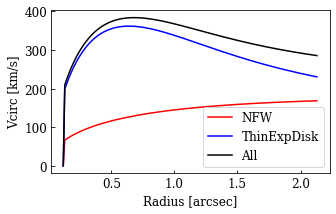

.. code:: ipython3

    import sys
    import glob
    import os
    import io
    import logging
    import emcee
    import pprint as pp
    #from pprint import pprint
    
    print(sys.version)
    
    import socket 
    if  'hypersion' or 'mini' in socket.gethostname() :
        os.chdir('/Users/Rui/Dropbox/Worklib/projects/GMaKE/examples/output/')
    #print(socket.gethostname())
    #print(os.getcwd())
    
    import gmake
    #pp.pprint(gmake.__version__)
    #pp.pprint(gmake.__email__)
    #pp.pprint(gmake.__demo__)
    #gmake.check_setup()
    
    #pp.pprint(gmake.meta.pars_def,indent=4,width=100)
    #gmake.pprint(gmake.meta.pars_def,indent=4,width=100)
    #gmake.pprint(gmake.meta.xymodel_header,indent=4,width=100)
    
    inpfile=gmake.__demo__+'/../examples/inpfile/hxmm01_b6c3_uv_mc.inp'
    #logfile=''
    
    #print('>'*40)
    #gmake.logger_config()
    #gmake.logger_status()
    #gmake.logger_status(root=True)
    
    outdir='/Users/Rui/Dropbox/Worklib/projects/GMaKE/examples/output/hxmm01_b6c3_uv_mc/'
    gmake.logger_config(logfile=outdir+'/gmake.log',loglevel='DEBUG',logfilelevel='DEBUG')
    #gmake.logger_status()
    
    inp_dct=gmake.read_inp(inpfile)
    mod_dct=gmake.inp2mod(inp_dct)
    
    
    import astropy.units as u
    gmake.pprint(mod_dct['dynamics'],indent=4,width=100)
    #gmake.model_dynamics(mod_dct,plotrc=True)
    rc=gmake.model_vcirc(mod_dct['dynamics'])
    #gmake.pprint(rc,indent=4,width=100)
    gmake.model_vcirc_plot(rc,figname='rc1.pdf')
    mod_dct['dynamics']['disk_rs']=2.5*u.kpc
    gmake.pprint(mod_dct['dynamics'],indent=4,width=100)
    #gmake.model_dynamics(mod_dct,plotrc=True)
    rc=gmake.model_vcirc(mod_dct['dynamics'])
    #gmake.pprint(rc,indent=4,width=100)
    gmake.model_vcirc_plot(rc,figname='rc2.pdf')

.. parsed-literal::

    3.7.5 (default, Oct 19 2019, 11:15:26) 
    [Clang 11.0.0 (clang-1100.0.33.8)]
    **********exe read_inp()**************
    {   'disk_sd': <Quantity 5.e+09 solMass / kpc2>,
        'disk_rs': <Quantity 1. kpc>,
        'halo_mvir': <Quantity 5.e+11 solMass>,
        'type': 'potential',
        'object': 'hxmm01',
        'z': 2.308}
    {   'disk_sd': <Quantity 5.e+09 solMass / kpc2>,
        'disk_rs': <Quantity 2.5 kpc>,
        'halo_mvir': <Quantity 5.e+11 solMass>,
        'type': 'potential',
        'object': 'hxmm01',
        'z': 2.308}

.. parsed-literal::

    <Figure size 432x288 with 0 Axes>

.. parsed-literal::

    <Figure size 360x216 with 0 Axes>

